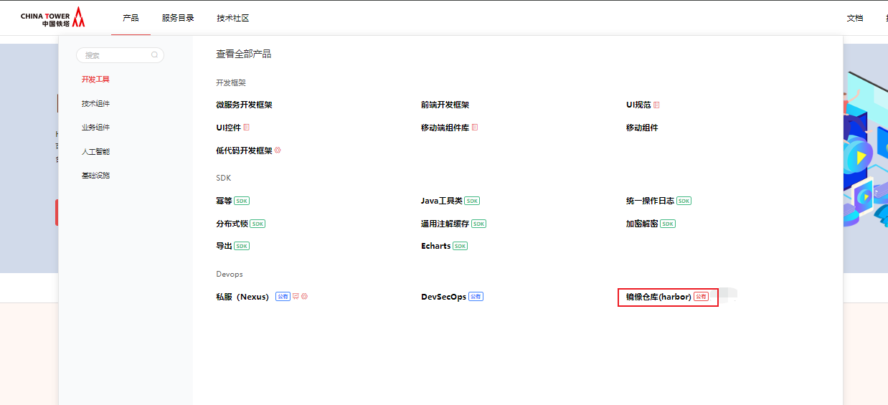
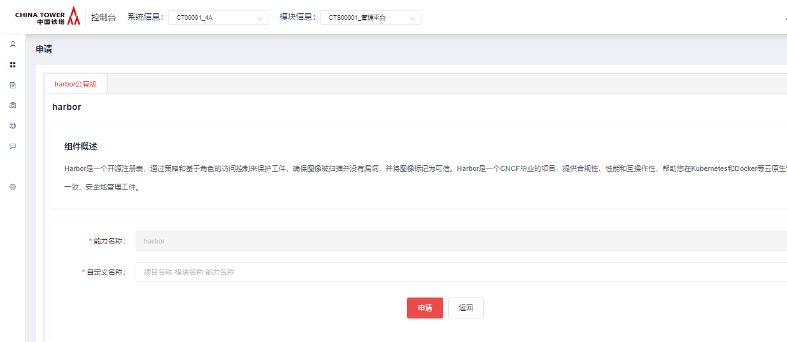
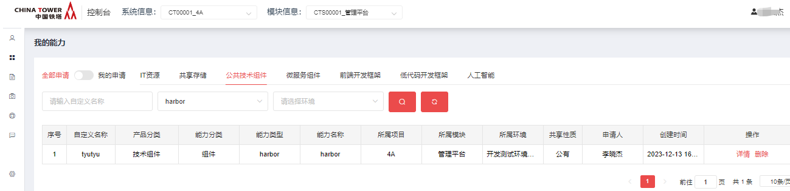

# Harbor

## 功能发布记录

| 版本 | 拟制/修改日期 | 拟制/修改人 | 修改记录 | 批准人 |
| ---- | ------------- | ----------- | -------- | ------ |
| 1.0  | 2023/12/20    | 赵龙        | 初版     |        |

## 重要通知

无

## 组件描述

Harbor是一个开源注册表，通过策略和基于角色的访问控制来保护工件，确保图像被扫描并没有漏洞，并将图像标记为可信。Harbor是一个CNCF毕业的项目，提供合规性、性能和互操作性，帮助您在Kubernetes和Docker等云原生计算平台上一致、安全地管理工件。

### 建设目标

提升铁塔IT自主掌控能力，提高开发效率，降低编写重复代码的工作量。

### 特性

- 1、多用户的管控：基于角色访问控制和项目隔离；
- 2、镜像管理策略：存储配额、制品保留、漏洞扫描、来源签名、不可变制品、垃圾回收等；
- 3、安全与合规：身份认证、扫描和CVE例外规则等；
- 4、互操作性：Webhook、内容远程复制、可插拔扫描器、REST API、机器人账号等。

## 快速入门

进入技术中台首页，选择 产品 → 开发工具 → Devops → 镜像仓库(harbor)  点击 【申请】，填写自定义名称，点击申请，等待运营人员审批 

审批通过后可以在我的能力→公共技术组件→harbor 看到已申请成功的能力 

## 操作指南

无

## 典型实践

无

## API参考

无

## SDK

无

## 网络要求

无

## 常见问题

无

## 样例文件