# Nexus私服

利用 Nexus 你可以只在一个地方就能够完全控制访问和部署在你所维护仓库中的每个 Artifact。

## 开源版本说明

| 版本名 | 版本      | 说明 |
| ------ | --------- | ---- |
| nexus  | 3.59.0-01 |      |

## 功能发布记录

| 发布时间   | 功能分类 | 功能名称                      | 说明 |
| ---------- | -------- | ----------------------------- | ---- |
| 2022-06-17 | 功能新增 | Nexus私服上架技术中台         |      |
| 2024-01-22 | 功能新增 | 前端组件Nexus私服上架技术中台 |      |

## 重要通知

本章节内容适用于各业务系统需要上传自己独有的依赖包，并在流水线统一构建和部署的情况，如果您仅使用铁塔技术中台提供的微服务框架、组件相关的能力。则仅需要按照下面的配置，配置使用铁塔私库即可。

## 组件描述

开发框架提供微服务运行时支撑服务Nexus私服，Nexus 是一个强大的 Maven  仓库管理器，它极大地简化了本地内部仓库的维护和外部仓库的访问。  私服是指私有服务器，是假设在局域网的一种特殊的远程仓库，目的是代理远程仓库及部署第三方构建。  它提供了自动创建存储、仓库、角色、用户功能，支持文件上传和删除操作，并且提供用户重置密码的服务。

## 快速入门

### 组件申请

Ⅰ. 使用消费者账号登录，鼠标移动到上方微服务框架，点击Nexus私服。

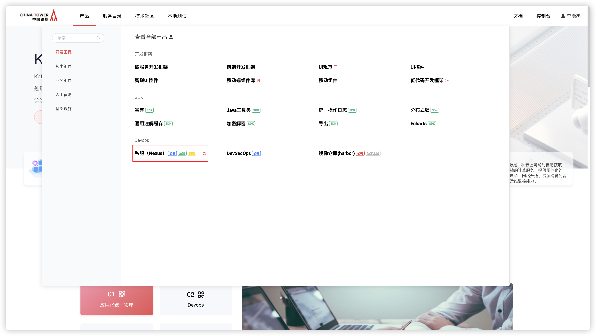

Ⅱ. 进入Nexus私服海报页面，点击申请按钮。

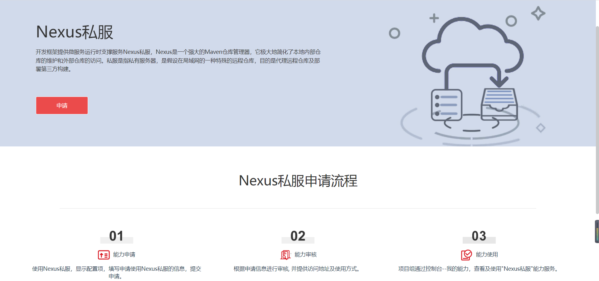

Ⅲ. 进入申请页面，输入自定义名称（注意，自定义名称即为架构组规定的各系统编码，命名规则：必须为全小写字母,并以 chnt 开头，例：chntxxx ），选择私服类型（前端/后端），系统会默认填写环境信息，直接点击申请。

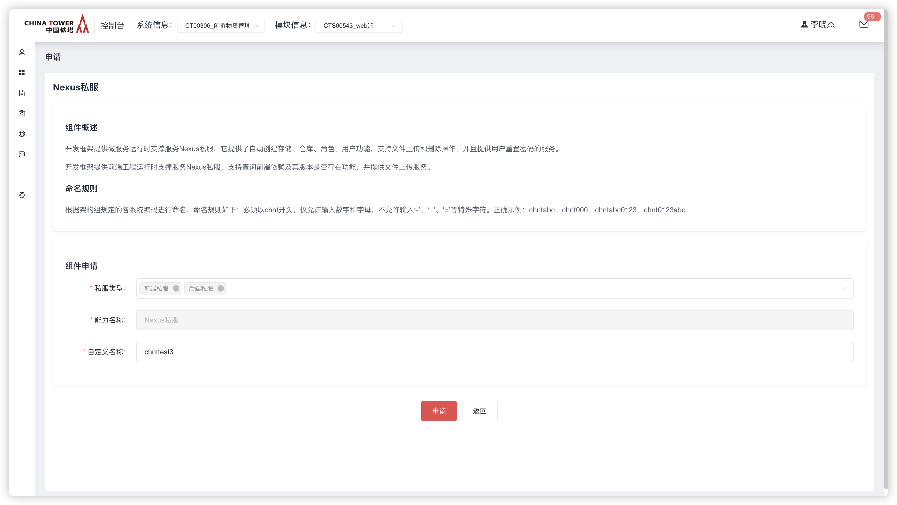

Ⅳ 申请后，应联系技术中台运营人员，审批通过注册中心能力申请。 可在我的申请单，查询当前申请状态。

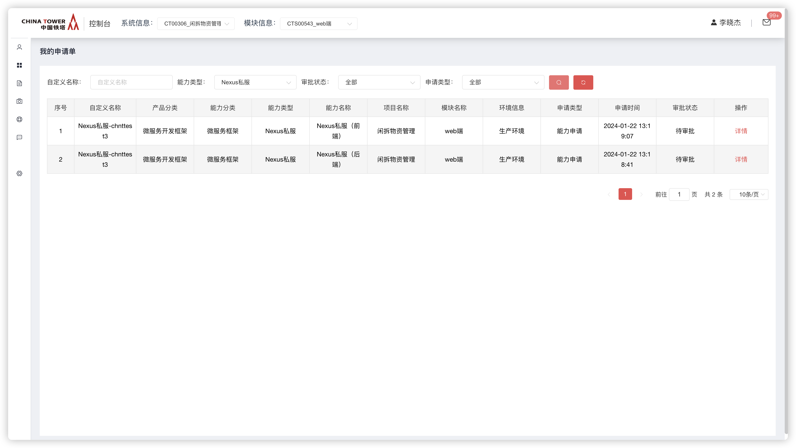

Ⅴ 审批通过后，可在我的能力-》微服务开发框架，找到已经通过的 Nexus私服能力。

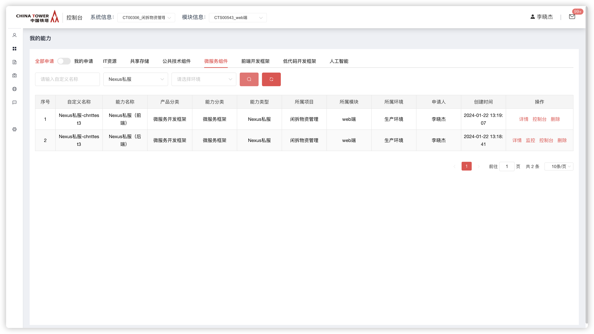

## 操作指南

### 后端私服

1.消费者登录技术中台后，在我的能力中找到Nexus私服（后端），点击"控制台"可查看当前服务下的的具体实例情况

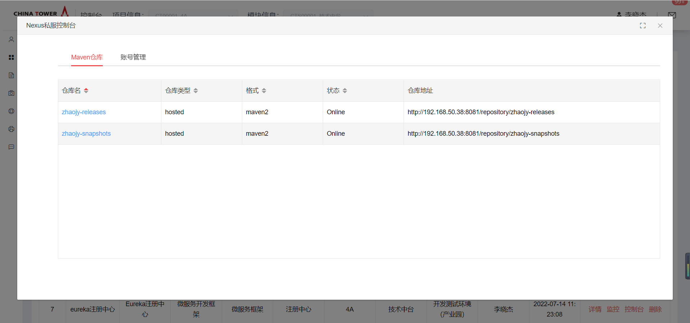

2.点击账号管理,展示本人账号信息。(首次查看请点击重置密码按钮来获取密码信息)

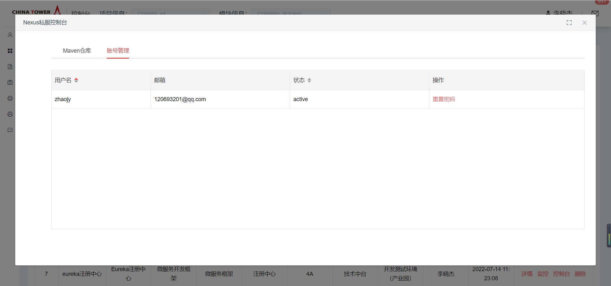

3.并且提供重置密码的操作，每次进行重置密码操作之后会提示新的密码，且密码只显示一次，请妥善保管。

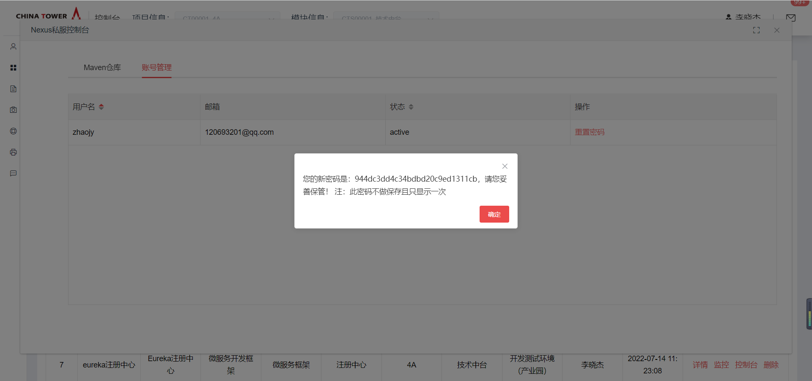

4.点击仓库名，会进入仓库。

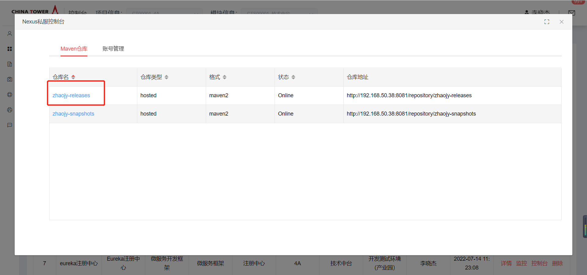

5.显示仓库中所有的文件列表，展示本人仓库下所有包详细信息，以及提供删除包的功能。

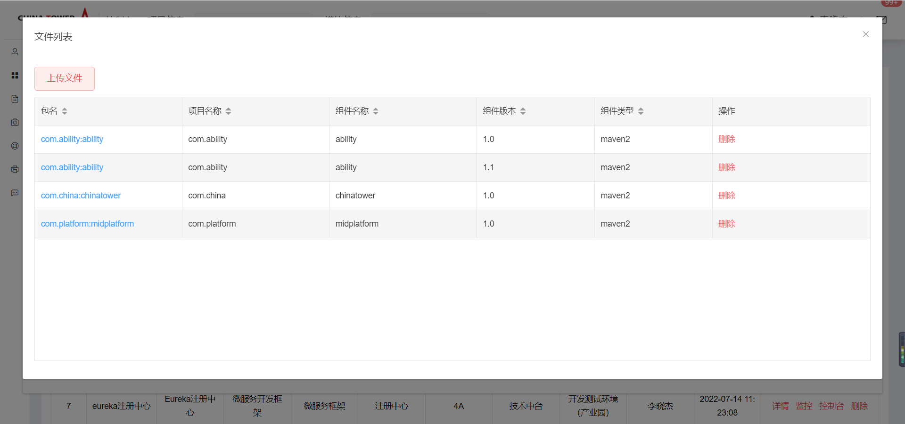

6.`*-releases` 仓库下文件列表界面支持文件上传功能，点击上传按钮，展示上传文件页面，带*号为必填项。

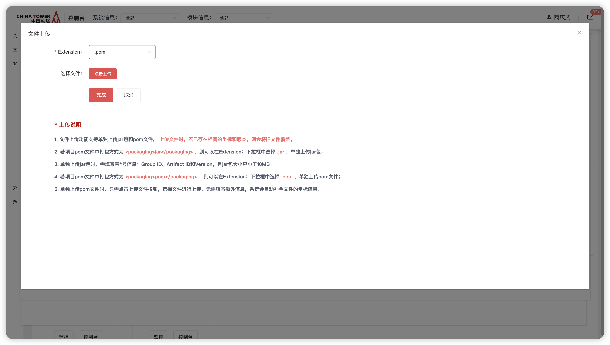

7.`*-releases` 仓库下文件列表界面支持单独上传pom文件，只需上传pom文件，坐标会自动补充。

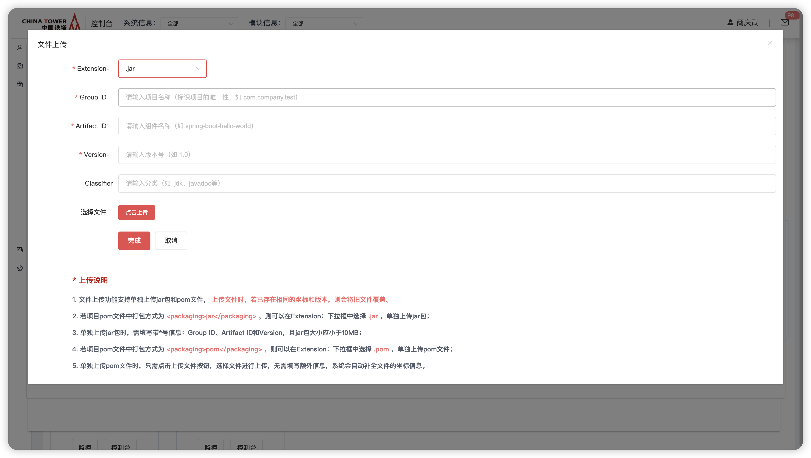

8.`*-snapshots` 仓库下文件列表界面不支持文件上传功能，提供了Snapshot上传说明，点击Snapshot上传说明按钮。

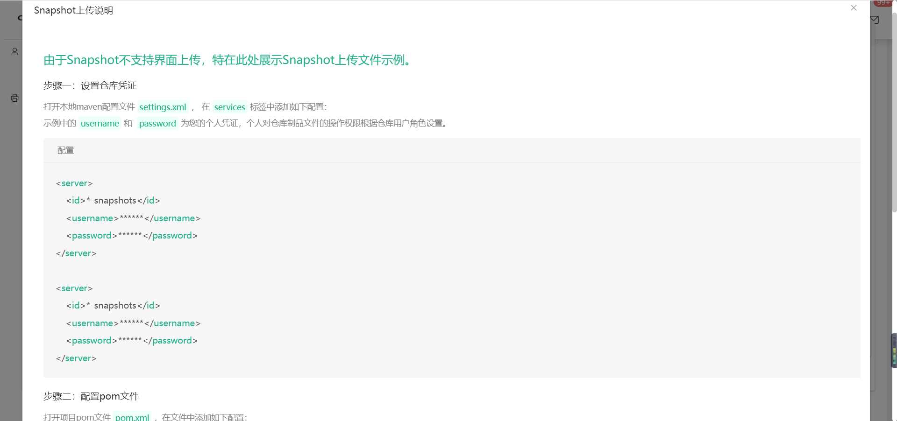

9.点击文件列表界面中的包名，可以显示该包下所有的文件信息，以及依赖引入方式示例。

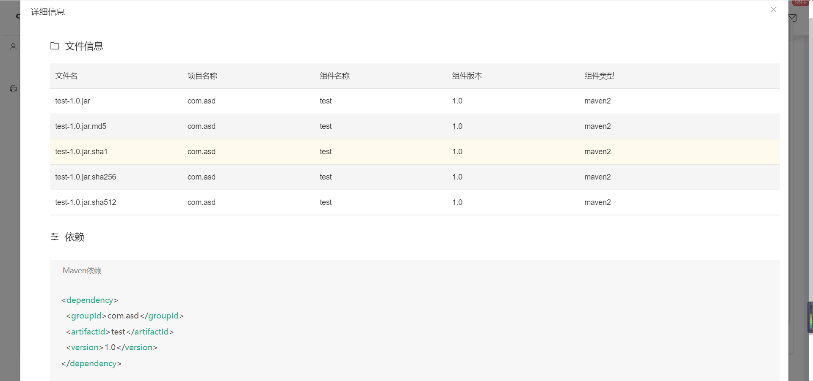

10.支持查询依赖及其版本是否存在，可输入依赖坐标信息进行查询。

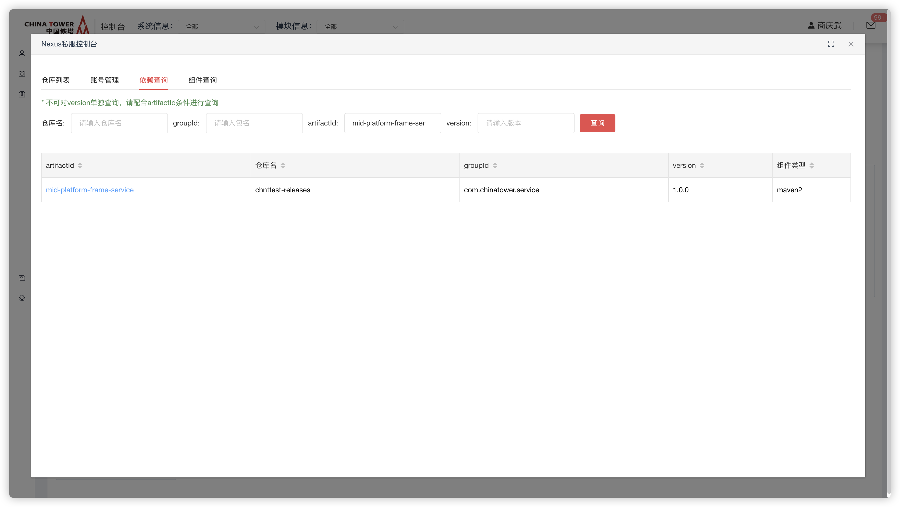

|      | 按照此文档进行申请的nexus私库，各业务系统使用独立仓库限制jar文件上传，新建的仓库会合并到 `maven-public` 仓库中，`maven-public` 仓库并不限制下载依赖（**任何人皆可查看下载**）。 |
| ---- | ------------------------------------------------------------ |
|      |                                                              |

### 前端私服

1.消费者登录技术中台后，在我的能力中找到Nexus私服（前端），点击"控制台"可查看当前服务下的的具体实例情况。

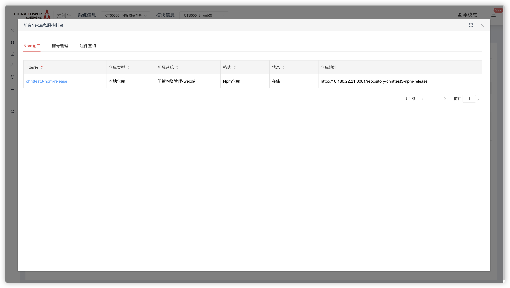

2.点击账号管理,展示本人账号信息。(首次查看请点击重置密码按钮来获取密码信息)。


3.并且提供重置密码的操作，每次进行重置密码操作之后会提示新的密码，且密码只显示一次，请妥善保管。


4.点击仓库名，会进入仓库。


5.显示仓库中所有的文件列表，展示本人仓库下所有包详细信息，依赖引入方式示例，以及提供删除包的功能。

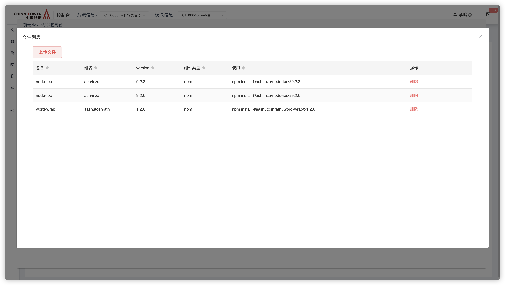

6.`*-npm-component` 仓库下文件列表界面支持文件上传功能，点击上传按钮，打开上传文件页面，只需选择文件即可。

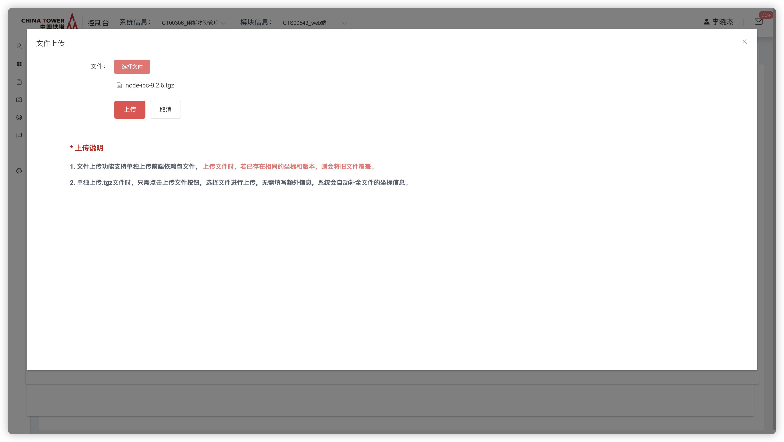

7.支持查询前端组件是否存在，可输入组件名称配合版本进行查询。

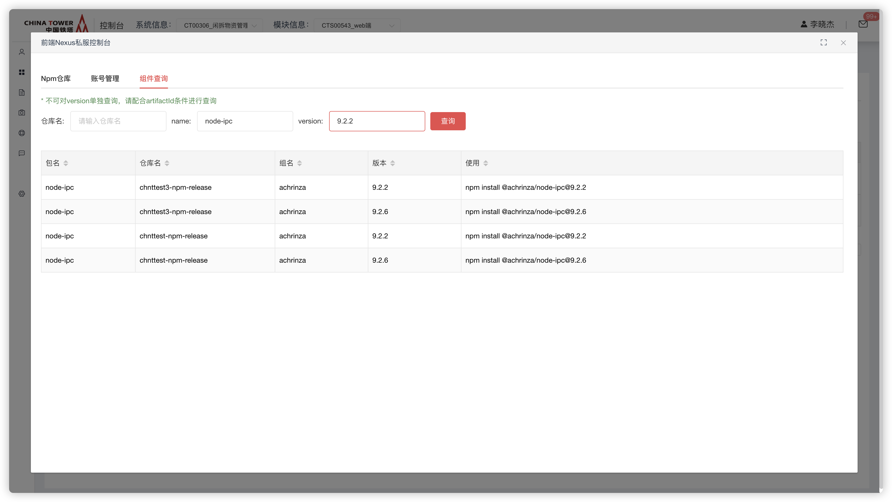

|      | 按照此文档进行申请的nexus私库，各业务系统使用独立仓库限制前端组件上传，新建的仓库会合并到 `npm-public` 仓库中，`npm-public` 仓库并不限制下载依赖（**任何人皆可查看下载**）。 |
| ---- | ------------------------------------------------------------ |
|      |                                                              |

## 典型实践

pom.xml

```xml
<project xmlns="http://maven.apache.org/POM/4.0.0"
         xmlns:xsi="http://www.w3.org/2001/XMLSchema-instance"
         xsi:schemaLocation="http://maven.apache.org/POM/4.0.0 http://maven.apache.org/xsd/maven-4.0.0.xsd">
    <groupId>com.chinatower.product</groupId>
    <artifactId>xxxx</artifactId>
    <version>xxxx</version>
    <modelVersion>4.0.0</modelVersion>
    <!--  添加以下部分  -->
    <repositories>
        <repository>
            <id>chinatower</id>
            <url>http://10.38.77.5:8081/repository/maven-public/</url>
        </repository>
    </repositories>
</project>
```

.m2/settings.xml(项目根目录下新建 `.m2` 文件夹,并配置idea maven使用此配置文件)

```xml
<?xml version="1.0" encoding="UTF-8"?>
<settings xmlns="http://maven.apache.org/SETTINGS/1.0.0"
          xmlns:xsi="http://www.w3.org/2001/XMLSchema-instance"
          xsi:schemaLocation="http://maven.apache.org/SETTINGS/1.0.0 http://maven.apache.org/xsd/settings-1.0.0.xsd">
    <mirrors>
        <mirror>
            <id>chinatower</id>
            <mirrorOf>*</mirrorOf>
            <name>Nexus Tieta</name>
            <url>http://10.38.77.5:8081/repository/maven-public/</url>
        </mirror>
    </mirrors>
</settings>
```

命令行构建需要在项目根目录下执行 `mvn -s .m2/settings.xml clean install` 执行构建。

### 示例

按照此文档进行申请的nexus私库，各业务系统使用独立仓库限制jar文件上传，新建的仓库会合并到 `maven-public` 仓库中，`maven-public` 仓库并不限制下载依赖（**任何人皆可查看下载**）。

### 其他配置

## API参考

无

## SDK

无

## 网络要求

打开SDP开启全局访问后再进行访问。

## 常见问题

### 如何判断私服中是否存在一个后端/前端的依赖包

1. 使用浏览器打开私服 [点击访问](http://10.38.77.5:8081)
2. 点击左侧菜单**Search**，在**Keyword**文本输入框中输入要查询的关键词，点击**Enter**键发起查询
3. 也可以点击**More criteria**按钮，选择**Maven Repositories**，再选择**GroupId**或者**Artifact Id**或者**Base Version** 进行精细化查询。同理可进行**npm**的精细化查询。
4. 可以通过访问流水线构建时输出的错误地址日志进行测试。将具体的地址输入到浏览器地址栏中，如果本地已完成下载，则私服中存在此依赖。

### 私服缺少依赖怎么办？

1. 如果缺少Maven依赖，在技术中台申请Nexus私服，审批后手动上传依赖。
2. 如果缺少Npm依赖，技术中台暂不支持前端私服的申请及手动上传，请手动下载前端依赖的tgz压缩包。自有项目经理发邮件给技术中台项目经理，内容包括：包附件、包简要说明、使用场景、业务系统二级系统编码。

### 上传停滞状态

问题：在上传jar包时，可能会出现停滞在上传中的情况，如下图

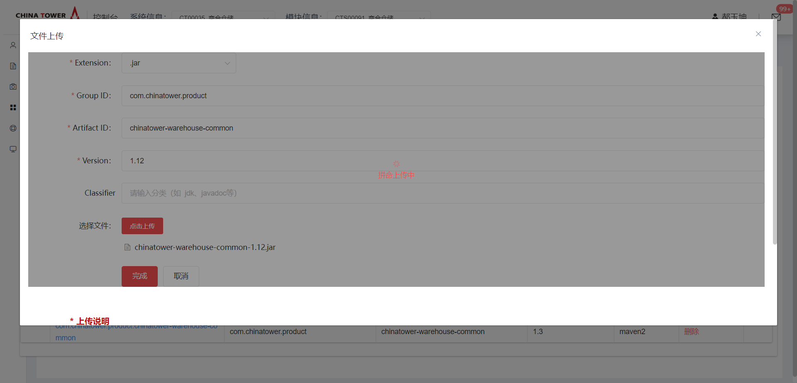

原因：网络问题

解决办法：切换网络，连接手机热点后再次上传