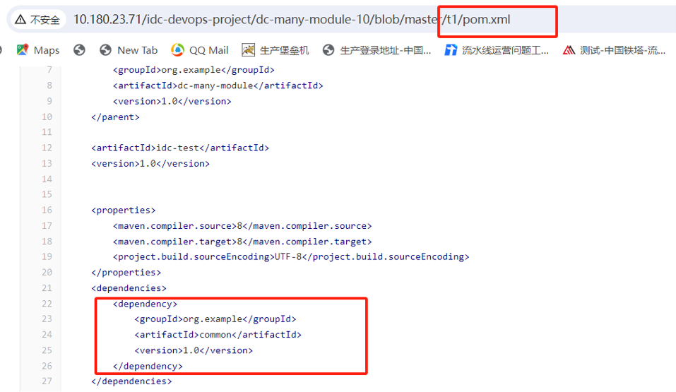
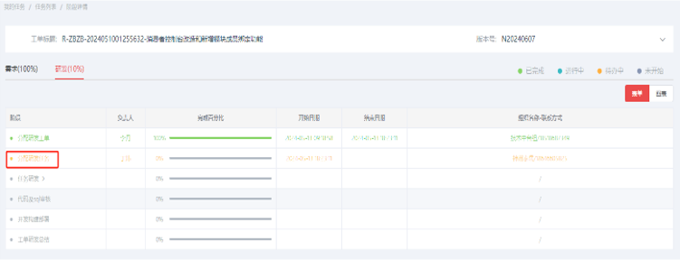
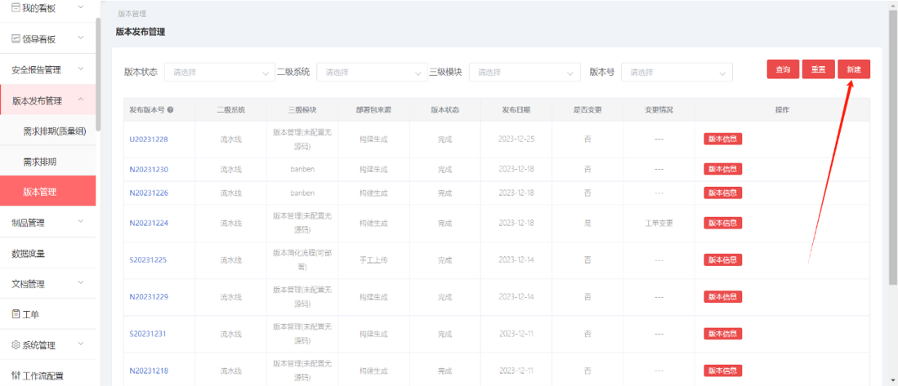
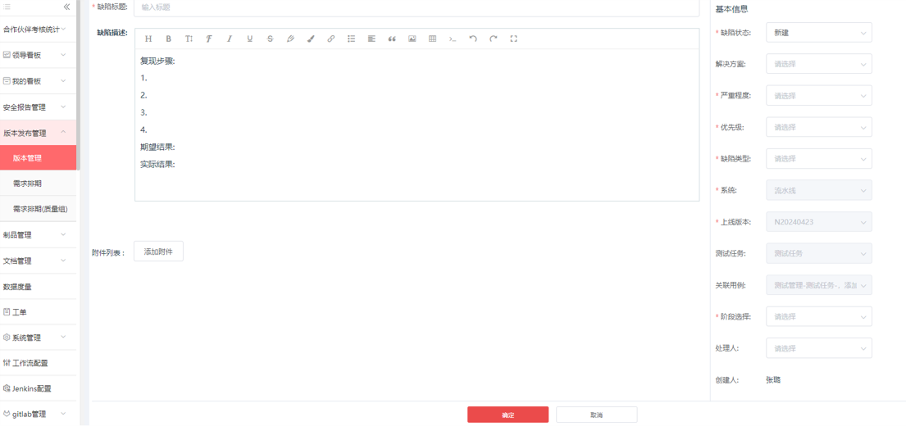
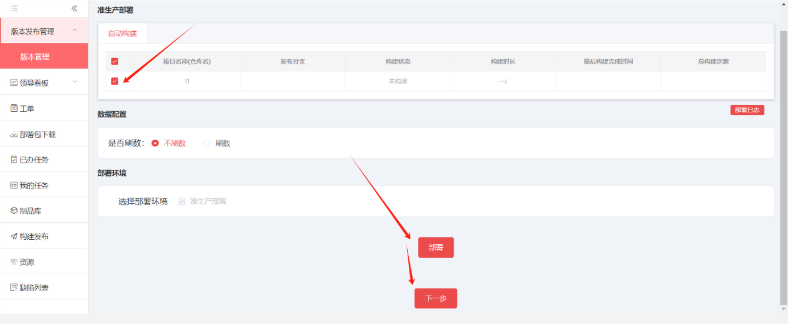
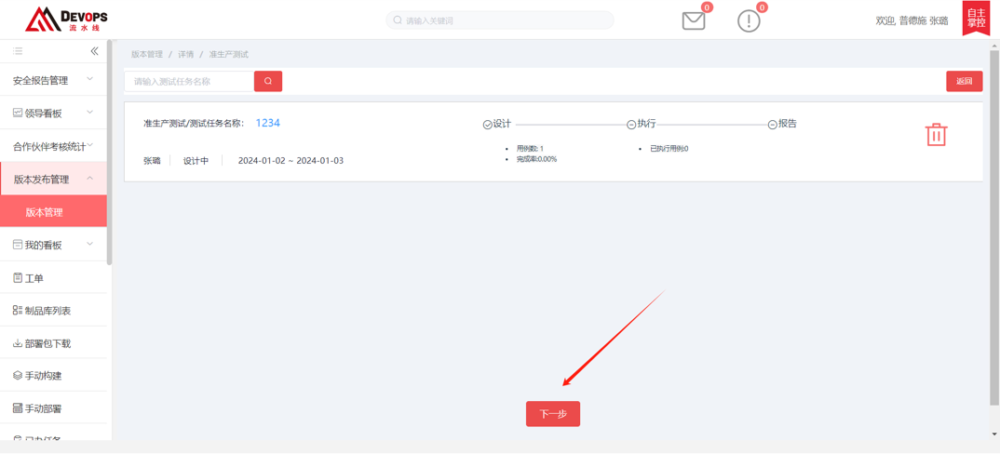
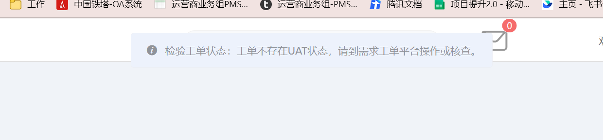

# 流水线

## 功能发布记录

| 版本 | 拟制/修改日期 | 拟制/修改人 | 修改记录 | 批准人 |
| ---- | ------------- | ----------- | -------- | ------ |
| 1.0  | 2023/12/12    | 赵龙        | 初版     |        |

## 重要通知

无

## 组件描述

流水线系统通过可视化全自动、代码检查、质量红线的组合能力，相比起传统的自动化工具，在整体研发过程的交付效率和管控性能上更强，真正做到了高度自动化、支持多并发、能力可扩展、全程可视化和质量可卡控。

### 建设目标

提升铁塔IT自主掌控能力，提高开发效率，降低编写重复代码的工作量。

### 特性

- 1、研发流水线管理：为用户提供流水线编排、任务的调度与执行，任务资源自动创建、调度与释放的能力，整体研发过程的交付效率和管控性能上更强，真正做到了高度自动化、支持多并发、能力可扩展、全程可视化和质量可卡控。实现高效率持续交付.
- 2、代码管理：无缝迁移至 Gitee安全可靠的代码资产保障，存储可靠性达到  99.99%通过多种模式进行协作，提供便捷规范的代码评审流程且支持代码静态扫描产品，用以分析代码库中代码质量。支持编码规范、安全漏洞、代码缺陷、重复代码、复杂度等多维度分析，帮助企业团队全面把握并提升代码质量.
- 3、自动构建与部署：为用户提供构建制品快速便捷部署到线上集群的能力。支持虚拟机、物理机等环境；支持应用部署及自动化运维场景脚本部署
- 4、制品库：制品用以向企业提供一站式的制品管理功能，支持多类型文件常见制品库类型，同时可以与本地各构建工具和云上的持续集成，持续部署无缝结合。为研发团队提供优质高效的构建物管理服务，把控构建物质量.
- 5、测试管理：为用户提供测试空间、测试用例管理，执行记录等功能。支持手工测试、接口自动化测试、性能测试。帮助企业团队全面把握测试进度提升产品的测试质量，是一个综合测试管理平台.
- 6、效能度量：提供完善的度量指标和可视化数据报表，对研发全链路的进度、质量等维度进行实时反馈与度量，助力您的组织持续改进.

## 快速入门

进入技术中台首页，选择 产品 → 开发工具 → Devops → 流水线

  点击 【申请】，填写自定义名称、选择环境、填写使用场景，点击申请，等待运营人员审批 


审批通过后可以在我的能力→公共技术组件→流水线 看到控制台按钮

 

## 操作指南

### 项目接入：新系统或新模块接入流水线平台

- 项目接入需具备的三个条件： ①项目组成员具有4A帐号且帐号有访问流水线的入口（申请4A账户及4A账号访问流水线的权限，申请路径：IT服务工单） ②项目组已在主数据申请过系统编码及模块编码 ③项目组已向质量室申请并创建好仓库组（当前负责人：许孟为）

- 以上条件具备后，需铁塔项目经理在工单平台向流水线提权限配置单，配置内容： ①申请配置项目经理帐号 ②申请将模块编码绑定业务流程内（标准流程或简化流程） ③申请将仓库组与系统绑定

  ```
  工单内容样例：XX申请配置XXXX账户为XXXX系统的项目经理角色。将XXXX仓库组与XXXX系统进行绑定。
  ```

- 配置完成后，项目经理可登录流水线平台，配置系统角色、创建仓库并添加git成员及项目信息。

### 角色配置-界面说明

操作角色：铁塔项目经理 * 此界面由两部分组成：搜索栏和系统成员列表。 * 搜索栏内可搜索到所有人员信息。系统成员列表内显示得是已绑定该系统的人员信息。 * 新增人员在搜索栏中查找，搜索栏可搜素全域人员。 * 修改人员权限，在列表中查找或使用搜索栏查找。 


场景一：为系统添加新的人员并赋予角色（权限） 1.项目经理账号登陆，进入系统管理—账户。 2.在搜索栏人员姓名处输入需要添加的人员姓名，点击查询。 3.查询后展示结果。然后在人员列表操作栏处点击“4A-配置管理”。 


4.进入角色配置界面，点击所属项目中的箭头，页面自动展开项目经理所属的系统和模块。 5.在展开的模块中进行勾选，把人员添加到所需的系统和模块中。勾选后页面会自动显示所选系统和模块。（图一） 6.勾选系统模块后页面会展示该系统模块下可配置的角色，勾选需要的角色即可。勾选后，点击确认，完成人员添加。（图二） 

 

场景二：修改已有人员的角色（权限）

1.在列表中找到需要修改的人员（也可以用搜索栏检索），在人员列表的操作栏点击“4A-配置管理”。 

 

2.点击后，页面跳转至角色配置界面。可以看到所选人员已配置的角色。（图一） 3.勾选需要的角色，取消勾选不需要的角色，然后点击确认即可完成角色修改。（图二） 

 

场景三:将人员从系统中去除

1.在列表中找到需要修改的人员（也可以用搜索栏检索），在人员列表的操作栏点击“编辑”。

 

2.点击编辑后，页面跳转至系统修改界面。在所属项目栏中点击（X）将该人员从系统中去除。（图一） 3.点击（X）后，所点系统不再显示，点击提交，从系统中去除人员操作完成。（图二）

  

### 角色与权限对应表

| 角色             | 权限                                                         |
| ---------------- | ------------------------------------------------------------ |
| 项目经理（唯一） | 分配研发工单、创建git仓库、创建git账号、账号权限配置         |
| 研发组长         | 分配研发任务、代码及sql审核、开发构建部署、工单研发总结、仓库信息配置、能力构建 |
| 研发人员（唯一） | 任务研发、能力构建                                           |
| 测试组长（唯一） | 集成测试、新建测试任务、执行集成测试用例                     |
| 测试人员         | 执行集成测试用例                                             |
| 验收经理（唯一） | 验收测试、验收总结及封板、准生产测试、准生产总结             |
| 验收人员         | 执行验收测试用例                                             |
| 运维专员         | 准生产部署、发布实施                                         |
| 文档上传人员     | 上传项目文档                                                 |
| 制品上传人员     | 上传项目制品                                                 |

### 申请仓库并添加git成员

操作角色：铁塔自有项目经理 

1.项目经理进入代码仓库管理—仓库列表（项目经理）菜单。 

2.选择用于新建仓库的系统的对应仓库组，点击“申请仓库”。 


3.点击申请仓库后，在弹出的页面里，填写仓库信息，然后点击提交申请，完成仓库创建。（图一） 4、如创建仓库时，需要同时添加人员，选择添加人员。（图二）

 

5.在人员姓名下拉列表中选取人员，系统会自动带出改人员的4A账户。（图一） 6、勾选需要赋予的git账户权限后，点击提交申请，完成人员添加和仓库创建。（图二）


合作伙伴的研发组长也可以创建仓库，操作方式同上。唯一区别是，需要铁塔自有项目经理审批。 合作伙伴研发组长申请创建仓库后，铁塔自有项目经理在“代码仓库管理-审批列表（项目经理）”中进行审批。

 

单独创建git账号

注意：创建git账号时，账号必须具备邮箱信息 途径一：系统下的人员绑定研发角色后，流水线会为该人员自动生成git账号。（图一） 途径二：将账号绑定至对应系统后，由项目经理进入代码仓库管理——仓库列表（项目经理）处，新建账户。（图二） 

 


已有仓库，添加git成员

操作角色：铁塔自有项目经理 1.项目经理进入代码仓库管理—仓库列表（项目经理）菜单。选择用于添加仓库成员的仓库组。 2、在仓库列表中，找到要添加成员的仓库，在该仓库的操作列中，点击“添加人员”。 


3、在弹出的添加人员页面中，在人员姓名下拉列表中选取人员。（图一） 4、选取人员后，系统会自动带出改人员的4A账户。勾选需要赋予的git账户权限后，点击提交申请，完成人员添加。（图二） 注意： 若选择的是master权限，则需要铁塔质量组到代码仓库管理——审批列表（质量室）审批。 合作伙伴的研发组长也可以添加成员，操作方式同上。唯一区别是，需要铁塔自有项目经理审批。 

 


解绑git成员

1.项目经理或研发组长登录，进入代码仓库管理——仓库列表（项目经理） 2.选择仓库， 列表展示仓库下git成员信息。触发相关人员列表操作栏中的解绑按钮，账号移除成功

 

### 项目配置注意事项

项目配置注意事项： * 项目信息配置有关应用服务构建，所以标准流程必须进行项目配置。 * 项目信息配置前，各业务组需将Gitlab上，代码仓库中的master分支与dev代码分支拉齐，否则影响后续需求发布和代码一致性。 * 项目信息配置由铁塔自有项目经理操作，或由项目经理指定合作伙伴人员操作，指定后，由指定人员操作。

铁塔项目经理指定配置人员 操作步骤（绑定项目配置权限）： 1.铁塔项目经理进入系统管理-账户下，给相关人员绑定对应模块的“项目配置”角色，绑定后。即可由该人员进入系统管理-项目管理下，选择系统模块新增代码仓库及配置项目信息。

 

### 添加新代码项目并配置项目信息

- 以仓库 http://10.180.23.71/idc-devops-project/dc-many-module-10 为例，进行项目配置演示。

- 该仓库分支目录结构如下：

   

操作步骤（新增下层项目信息）： 

1.铁塔项目经理或项目配置人员进入系统管理菜单，在项目管理选择需要添加代码项目的三级模块，点击“新增下层项目信息”。

 

2.点击后，页面右侧刷新，显示为待填写的项目配置信息表单。

 


项目编码：用户自定义填写，编码唯一不可重复。

样例：上级项目编码xxx。 

- 项目名称：应用系统的微服务名称（用户可自定义名称便于与其他项目区分）。 
- 项目类型：选择“项目” 。 
- 项目工程类型：样例类型为父子类型微服务，这里选择“多模块微服务”。 容器项目（制品包为镜像的系统）、 微服务（单体微服务）、多模块（父子类型微服务）、 Ant项目（普元框架服务或非maven构建服务）、 VUE（前端服务

_ 

- git组名称：选择gitlab中对应仓库组。样例：idc-devops-project 
- git组描述：对应gitlab中仓库组备注。 
- git项目ID：gitlab中对应仓库的ID（系统自动带出）。 
- git项目名称：gitlab中对应的仓库名称。样例：dc-many-module-10 
- git项目描述： 对应gitlab中仓库描述（对应分配任务研发时看到的仓库名称）

 

- SSH内网地址：gitlab仓库ssh地址 
- SSH外网地址：gitlab仓库ssh地址 
- HTTP内网地址：gitlab仓库http地址 
- pom文件路径：pom文件所在位置(微服务项目) 
- GroupId：pom文件GroupId 
- ArtifacId:pom文件ArtifactId 
- Version:pom文件Version 

以上内容在选择完git项目名称后均由系统自动带出 


- 部署服务名称：在部署平台配置自动部署的包名(未填写自动从改服务的制品包中解析,格式特殊的包名可能会解析的有错误, 以填写的优先级最高) 

- 构建命令开关：开:使用自定义的构建命令(在项目根目录)  关:使用平台通用的构建方式 

  注：绿色为开启，红色为关闭，非自定义构建时请关闭该按钮 

- 构建命令：自定义构建命令 ·依赖项目：构建的项目所依赖的同仓库内的其他项目

 

- 打包名称：该项目制品包名称,根据这个名称构建后搜索并上传制品包 
- 打包类型:jar、war、tar ·jdk版本:自行选择 
- jenkins名称：填写模块名称t1。(对于多模块项目，就是模块的名称；对于ant项目是脚本在服务器上的目录名称) 

  

3.以上信息填写完成后点击“新增”按钮。

  

4.页面弹出提示信息，点击“确定”，页面跳转至构建信息校验页面。

 

5.等待至构建校验成功，构建校验成功显示如下：

 

6.返回项目管理页面，可查看到新添加的项目信息，即为添加成功。

 

### 依赖项目配置

依赖项目：同模块下，相同仓库，相同类型的项目,配置依赖项目以后,按照依赖深度进行解析排序,有序构建(对于maven微服务类型多层依赖的项目,只需要配置最外边一层就可以,配置多层不会出现错误,但是会重复编译,效率降低) 


操作步骤： 1.查看项目依赖： （以t1项目为样例进行演示） ·进入t1项目下的pom文件，查看该项目依赖。

可见t1项目下依赖有同模块同仓库下的common模块

  

2.配置项目依赖： ·以同样的步骤将common模块添加至t1的同级模块下。如下图所示：

 

3.在依赖项目处选择到common项目，点击构建验证，构建验证成功后，依赖项目配置完成。

  

操作角色：铁塔自有项目经理或配置人员。 操作说明： 1.进入系统管理菜单，在项目管理选择需要添加代码项目的三级模块，然后点击“新增下层项目信息”。 2.点击后，右侧变为项目信息填写页面，按照要求的信息进行填写后，点击更新，完成添加新代码项目和配置项目信息。 

  


===项目信息配置说明

| 名称                            | 功能描述                                                     |
| ------------------------------- | ------------------------------------------------------------ |
| 项目名称                        | 应用系统的微服务名称                                         |
| 项目类型                        | 级别:1.业务线 2.系统 3.模块 4.项目                           |
| 项目工程类型                    | "不同项目对应的构建类型:①容器项目对应制品包为镜像的系统、微服务对应单体微服务、多模块对应父子类型微服务、vue对应前端服务 ②容器项目对应制品包为镜像的系统、微服务对应单体微服务、多模块对应父子类型微服务、vue对应前端服务 |
| git组名称                       | gitlab中所在仓库组                                           |
| git组描述                       | 对于gitlab中仓库组的备注                                     |
| git项目ID                       | gitlib中对应仓库的ID                                         |
| git项目名称                     | gitlib中对应仓库的名称                                       |
| git项目描述                     | 对于gitlab中仓库的描述(分配研发任务时看到的仓库名称)         |
| SSH内网地址                     | gitlab仓库ssh地址                                            |
| SSH外网地址                     | gitlab仓库ssh地址                                            |
| HTTP内网地址                    | gitlab仓库http地址                                           |
| pom文件路径                     | pom文件所在位置(微服务项目)                                  |
| GroupId（pom文件坐标）          | pom文件GroupId                                               |
| ArtifactId（pom文件坐标）       | pom文件ArtifactId                                            |
| Version（pom文件坐标）          | pom文件Version                                               |
| 部署服务名称                    | 在部署平台配置自动部署的包名(未填写自动从改服务的制品包中解析,格式特殊的包名可能会解析的有错误, 以填写的优先级最高) |
| 构建命令开关                    | 开:使用自定义的构建命令(在项目根目录)  关:使用平台通用的构建方式 |
| 构建命令                        | 自定义的构建命令                                             |
| 依赖项目                        | "可以选择同模块下，相同仓库，相同类型的项目,配置依赖项目以后,按照依赖深度进行解析排序,有序构建 (对于maven微服务类型多层依赖的项目,只需要配置最外边一层就可以,配置多层不会出现错误,但是会重复编译,效率降低)" |
| 打包名称                        | 该项目制品包名称,根据这个名称构建后搜索制品包                |
| 打包类型                        | jar、war、tar                                                |
| jdk版本                         | 后端：使用jdk的版本                                          |
| jenkins名称                     | 对于多模块项目，就是模块的名称；对于ant项目是脚本在服务器上的目录名称 |
| node版本                        | 前端：nodeJS版本号                                           |
| 镜像仓库配置                    | 容器类型项目,配置环境,编译脚本路径,镜像仓库登录命令,构建镜像包的名称 |
| 镜像仓库配置(配置环境)          | 该配置使用到哪个环境中                                       |
| 镜像仓库配置(编译脚本路径)      | 容器项目使用自定义shell脚本进行构建(自由度高),需要配置编译脚本相对于项目根本目录的位置 |
| 镜像仓库配置(镜像仓库登录命令)  | 镜像仓库登录的命令  例如: docker login 仓库ip:端口   -u  账号    -p 密码 |
| 镜像仓库配置(构建镜像包的名称 ) | 该项目构建出的镜像名称；(因为使用shell脚本,整个编译操作是一个黑盒过程,所以需要配置的镜像包名称与实际构建的镜像包名称一致) |

### 流水线业务流程介绍

- 流水线业务流程分为标准流程和简化流程
- 两者的主要区别是：
- 标准流程：自动构建部署包（适用于Java语言的微服务或普通Java项目，具备源代码且能通过流水线构建校验成功的系统。）    后端开发语言为Java,JDK版本为1.8、11、17、20    前端开发语言为VUE，Node版本为10、11、12、14、16 简化流程：无法构建，手工上传制品包（适用于没有源代码或只有部分源代码，没有部署环境或只有部分部署环境的系统。）

业务流程说明-标准流程

- 当需求工单从IT工单平台推送到流水线平台后，先进入研发阶段；在此流程中进行分配研发任务、更新研发任务进度，提交代码合并请求，开发分支和dev分支构建、代码质量扫描。当开发结束后可根据需求发布要求将需求工单与发布版本绑定，进入应用交付阶段；
- 在应用交付阶段中包含：集测测试、验收测试、准生产测试和需求发布上线（上线阶段）。
- 集成阶段中会进行发布版本的构建（dev分支）、代码质量扫描、集成环境部署、安全扫描。同时对发布的应用需求进行项目组内测。
- 验收阶段中会进行发布版本的构建（release分支）、代码质量扫描、验收环境部署。同时对发布的应用需求进行验收测试和UAT测试。
- 准生产阶段进行准生产环境部署，准生产测试。
- 上线阶段为需求发布生产环境 

工单列表-分配研发工单（项目经理） 

- 铁塔项目经理从我的代办中可直接进入分配研发工单环节，将任务分配给指定厂商。 
- 指派成功后，进入下个环节（分配研发任务）

    

工单列表-分配研发任务（研发组长） 

- 研发组长登录流水线，在“我的任务”中进入工单列表；
- 在工单列表中点击工单进度栏中的查看，进入工单，分配研发任务并填写计划工期及给研发人员分配任务。


      

- 任务分配完成后，可对研发任务进行创建分支操作。 
- 点击创建分支，在创建分支弹窗内选择仓库，点击确定后，系统将自动在该仓库内创建feature_xxx分支，feature_xx分支基于master分支拉取。 
- 并在之后的流程中合入dev分支（master分支的dev分支要拉齐，未拉齐合并分支时可能存在代码合并冲突）

  

创建分支完成后，触发下一步。工单进入下一环节（任务研发）

 

工单列表-任务研发（研发人员） 

- 研发人员在“我的任务”中进入工单列表；在工单列表中点击工单进度栏中的查看，进入工单。 
- 进入工单后点击研发任务；任务研发页面，研发人员再此页面可查看开发分支信息，更新开发任务进度。 
- 点击更新任务按钮，设置任务进度为100，点击确定，完成任务更新。 

  

- 更新任务后，触发下一步进行构建，同时系统自动发送一条feature_xxx分支合并dev分支的请求。构建完成后，工单进入下一环节（代码及SQL审核）。

  

工单列表-代码及SQL审核（研发组长） 

- 研发组长进入工单—代码及SQL审核环节。 
- 研发组长确认分支无误后，勾选合并消息点击下一步，操作完成后系统会自动将feature_xxx分支合并入dev分支。工单进入下一环节（开发构建部署）。如果“驳回”，工单会回退到任务研发阶段。 

 

工单列表-开发构建部署（研发组长） 

- 研发组长进入开发构建部署环节。勾选仓库列表，点击构建&部署按钮执行自动化构建和集成环境部署。构建部署完成后触发下一步，工单进入下一环节（工单研发总结）。开发构建部署环节构建的是dev分支；构建、部署可分开执行。 
- 在构建过程中会进行代码质量扫描，如代码质量扫描不通过，则无法进入下一环节。 
- 如有代码质量问题，需解决后重新提交代码（先提交到feature，在合并到dev），进行质量扫描通过后可进入下一环节。

  

工单列表-工单研发总结（研发组长） *研发组长进入工单研发总结环节，上传生产验证单后触发工单完成。需求研发阶段结束。工单可进入验收发布阶段。

  

创建版本（项目经理或研发组长） *铁塔项目经理或研发组长进入版本发布管理—版本管理列表，点击”新建“按钮。 *弹出新建版本页面，项目经理或研发组长填写完信息后并选择工单，点击确定按钮后，版本创建完成。

  

注意1：版本变更或挂起后都需要从集成测试阶段的准备版本开始重新走验收流程。 

注意2：工单进入流水线后就可以创建版本，同一系统下的同一模块允许同时创建多个版本，但进入验收流程的，同一时期只能有一个版本。

准备版本（研发组长） 

- 研发组长通过版本发布管理—版本管理列表，点击版本号，进入集成测试阶段的准备版本环节。

  

研发组长进入准备版本详情页，勾选仓库后点构建&部署（此环节可进行单独构建、部署）。 

- 在准备版本阶段，构建分支为dev，点击构建时会再次将feature_xxx分支合入dev分支。 
- 在构建过程中会进行代码质量扫描，如代码质量扫描不通过，则无法进入下一环节。 
- 如有代码质量问题，需解决后重新提交代码（先提交到feature，在合并到dev），进行质量扫描通过后可进入下一环节。

 

* 构建完成后，进行部署。部署后自动触发web安全扫描，并根据门禁阀值决定是否通过安全扫描。 
* 如安全扫描通过，可在页面底部点击下一步，进入下一环节（集成测试）。 
* 存在安全问题需要项目组解决后重新触发构建&部署，安全扫描，通过后，进入下一环节（集成测试）。

 

集成测试-创建测试任务（测试组长） 

- 测试组长通过版本发布管理进入版本管理列表，点击版本号进入集成测试阶段。 
- 点击列表中的测试任务，进入测试任务环节。在测试任务中，点击新建测试任务按钮创建测试任务。 

  

- 在新建测试任务页面，填写测试任务信息。填写完成后点击确认按钮，测试任务创建成功 

 

集成测试-新建测试用例（测试组长） 

* 测试组长通过测试任务名称，进入测试任务详情，点击关联用例标签，进入到测试用例页面。 
* 点击新建用例 or 导入用例 or 关联用例按钮添加测试用例。 

  

通过新建用例，建立测试用例 *点击新建用例按钮，在弹出的测试用例详情页面中填写测试用例信息。填写完成后，点击提交，完成一条测试用例的新建。 

 

通过关联用例，建立测试用例 

* 点击关联用例按钮，在弹出的测试用例列表中勾选需要关联的测试用例，并填写执行人及需求工单号后点击关联按钮，完成测试用例关联。 

 


通过导入用例，建立测试用例 

* 点击导入用例按钮，在系统弹窗中选择用例模板，用例模板可点击“导出模板”按钮获取。 

 

* 选中用例模板后打开。弹窗展示用例模板预览界面，确认无误后，点击上传。 


*点击后页面提示“用例导入成功”，列表内展示用例信息，完成导入用例。 


集成测试-执行测试用例（测试人员）

* 测试人员通过版本发布管理进入版本管理列表，点击版本号进入集成测试阶段。 
* 点击列表中的测试任务，进入测试任务环节。 
* 在测试任务中，点击关联用例页签，查看测试用例列表，在执行完的测试用例操作列中，点击执行按钮，记录执行结果。 

 


* 所有用例执行完成后，点击下一步，弹出集成测试阶段通过选择页面。 
* 选择通过工单进入下一环节（验收部署），选择不通过流程会回滚至准备版本环节。 


集成测试-缺陷（测试人员） 

- 执行测试用例过程中发现缺陷后可通过关联缺陷or新建缺陷，对测试用例的缺陷进行记录。 
- 当测试过程中有缺陷时，整个集成测试环节不能通过，流程会退到准备版本。 
- 当缺陷处理完成后需要从新提交代码，进行构建（先提交到feature，在合并到dev），走验收流程。 


通过关联缺陷，记录测试用例的缺陷情况。 

* 点击测试用例名称，进入测试用例。 
* 点击关联缺陷按钮，页面跳转至关联缺陷界面。 


* 在弹出的缺陷列表内勾选需要的缺陷用例后点击提交，完成缺陷用例关联。 


通过新建缺陷，记录测试用例的缺陷情况。 

* 点击新建缺陷按钮，在弹出的页面内填写缺陷标题，缺陷描述等基本信息后，点击确定。 

 

验收部署（研发组长） 

* 研发组长通过版本发布管理进入版本管理列表，点击版本号进入验收阶段。 
* 点击验收部署，进入验收部署环节。 
* 勾选仓库后点构建&部署（此环节可进行单独构建、部署）。 

 

* 验收部署环节构建的是release_xxx分支，系统会自动创建release_xxx发版分支。 release_xxx分支基于maste分支拉取，构建时会将feature_xxx分支合入release_xxx发版分支。 
* 在构建过程中会进行代码质量扫描，如代码质量扫描不通过，则无法进入下一环节。 
* 如有代码质量问题，需解决后重新提交代码（先提交到feature，在合并到dev），进行质量扫描通过后可进入下一环节。 
* 验收构建出来的包，用于验收环境、准生产环境、生产环境的部署。 
* 构建部署成功后，点击下一步，页面弹出提示框，用户选择确定后，进入下一环节（验收测试） 

 

验收测试（验收经理） 

* 验收阶段的验收测试和集成阶段的集成测试操作方法一样，缺陷记录方法也一样。此处不再重复讲解。 


验收总结及封板（验收经理）

* 验收经理进入验收总结及封板环节，根据提示语到工单平台处理uat状态。处理完成后页面显示下一步按钮。触发下一步，进入下一环节（准生产部署）。 

 

准生产部署（运维专员）

* 运维专员通过版本发布管理进入版本管理列表，点击版本号进入准生产阶段。 
* 点击准生产部署，进入准生产部署环节。 
* 勾选仓库后点击部署。部署完成后，点击下一步，进入下个环节（准生产测试）。 

 

准生产测试（测试组长） 

* 准生产阶段的测试和集成阶段的集成测试操作方法一样，缺陷记录方法也一样。此处不再重复讲解。
    

准生产测试完成后，点击下一步按钮 

* 在弹出的准生产测试阶段总结中，选择通过工单进入下一环节（准生产总结）。选择不通过流程会回滚至准备版本环节。
    

准生产总结（验收经理） 

* 验收经理进入准生产总结及封板环节，点击下一步按钮。进入下一环节（上线阶段）。
    

上线阶段-发布实施（运维专员） 

* 运维专员点击上线阶段，进入发布实施环节，勾选仓库后点击部署，部署成功点击下一步，进入下一环节（上线总结）  

上线总结（研发组长） 

* 研发组长账号登录后，通过版本发布管理——版本管理列表触发版本号，进入上线总结环节，上传上线验证报告单，点击完成。系统会自动将release_xxx发版分支合入master分支。验收发布阶段完成。
   

业务流程说明-简化流程 

* 当需求工单从IT工单平台推送到流水线平台后进入研发阶段，在此阶段中进行研发任务分配、任务更新，提交代码；不进行代码构建、代码质量扫描。当开发结束后，可根据需求发布要求将需求工单与发布版本绑定，进入应用交付阶段； 
* 在应用交付阶段中进行部署包上传、集成测试、验收测试、准生产测试以及需求上线工作。 
* 集成阶段中会进行集成环境部署。同时对发布的应用需求进行项目组内测和安全扫描。 
* 验收阶段中会进行验收环境部署。同时对发布的应用需求进行验收测试和UAT测试。 
* 准生产阶段进行准生产环境部署，准生产测试。 
* 上线阶段为需求发布生产环境。
   

> [!NOTE]
>
> - 标准流程与简化流程区别在于简化掉了代码构建、代码质量扫描。制品包由构建生成改为项目组手工上传。其余操作与标准流程一致。

上传制品包（研发组长） 

- 研发组长进入版本后，在集成阶段的准备版本环节和验收阶段的验收部署环节，需要手工上传制品包。 
- 在准备版本环节和验收部署环节的页面上，点击上传按钮，上传部署包。 
- 在弹出的页面上，上传包并填写包名信息，填写的包名要与部署平台的包名保持一致，填写后提交。
    

### 附录：常见问题及解决办法

问题一：依赖缺失问题，导致构建失败 <依赖管理> 流水线构建时会使用铁塔的私库拉取的依赖包，所以本地开发时应使用铁塔私库作为本地构建依赖包的源。而非本地依赖库和厂家公司依赖库。 

- 公共依赖引用 引用公共依赖时，确保铁塔私库里存在公共依赖文件，以免构建时因依赖缺失导致构建失败。 
- 私有依赖引用 引用私有依赖时，确保铁塔私库里存在私有依赖文件，以免构建时因依赖缺失导致构建失败

例：构建时依赖缺失情况： 

- 私服地址： http://10.38.77.5:8081/repository/maven-public/ 
- 提示找不到依赖包，进入私服地址到对应目录下查看该依赖包是否存在。
   

查看方式如下：

 

问题二：项目构建时有依赖项目该如何处理？

```
处理方法1：若该项目的依赖项目更新较为频繁，可从流水线页面点击系统管理-项目管理里，搜索到该项目，并在项目信息里选择依赖项目进行配置。
处理方法2：若该项目的依赖项目不常更新，可将该依赖项目打包上传至铁塔私服。
每次更新时需联系流水线运维人员清理掉编译主机的这个包的缓存，确保项目构建时所拉取的依赖是最新的。
```

问题三：项目构建时所依赖的项目有编译顺序该如何处理？ 处理方法：配置依赖项目 查看构建项目下的pom.xml文件:   发现该项目pom文件中配置有同模块下的其他项目。构建时需要先编译依赖项目才可以正常构建。
  

配置依赖项目 依赖项目可配置多个。
 

问题四：已经在流水线配置了依赖项目仍然提示找不到依赖包该怎么处理？ 

* 这种情况是由于项目依赖层级较深，整个git仓库列表的不同模块之间均存在依赖关系，导致该项目虽然配置了依赖项目，但打包的时候依旧有可能遗漏部分依赖包。 
* 该情况的解决办法是：进行全库构建，多个项目不要一起构建。项目同时构建时，会根据项目信息配置里的依赖项目，先编译依赖项目，后编译本项目。如有遗漏的依赖关系绑定，在编译过程中会因为依赖项目的相互嵌套关系，导致找不到依赖包。 
* 这种情况下，可将配置的依赖项目取消，构建时勾选单个仓库，一个一个进行构建操作。单独构建的操作会在项目构建时，将整个仓库列表内的项目一同编译。

问题五：本地打包和流水线打包的大小不一样或多代码如何解决？ 

* 首先对比本地打的分支跟流水线分支打出来的包，有什么区别：是少代码了?还是多了行代码， 或者依赖大小有问题。 
* 本地打包使用的分支，要跟工单在流水线流转过程中 对应流程节点 的构建分支保持一致，不要随便找一个自己本地没问题的分支去打包跟流水线分支打出来的包做对比。 例：流水线验收阶段构建分支为release_xxx，本地打包时也要使用这个分支。
   

* 本地构建分支做对比要注意，不要使用本地仓库，新建一个文件夹作为仓库使用，私服需要用铁塔私服模拟流水线打包构建环境。 
* 通过以上排査如果少代码导致包大小不对、部署有问题 ，可以看一下流水线任务研发的分支代码有没有合并到当前部署环节所对应的分支。 
* 多代码—通常是依赖的错误引用导致，该项目依赖于同仓库模块下的其他项目。构建时需要先编译依赖的工具项目。这种情况需要到项目管理里配置[依赖项目]。 
* 依赖有问题—先去私服看一下私服的包有没有问题 如果私服有问题联系架构组替换私服依赖 然后把依赖坐标告知流水线运维人员，流水线运维人员清理缓存。


## 典型实践

无

## API参考

无

## SDK

无

## 网络要求

无

## 常见问题

### 1.问题：任务研发下一步，提示如下

 原因：代码有冲突或者无变更 解决方案： (1)检查是否有代码提交，必须是有效代码，末尾加空格或空行无效 (2)检查提交的分支是否正确（任务分支，不是dev！） (3)检查任务分支代码与dev分支是否有冲突（自行检查，不会的百度，实在不会反向合并）

### 2.问题：开发/验收部署失败，报错详情中为空，如图

  原因：agent进程掉了或者磁盘满了 解决方案： (1)检查agent进程是否正常，磁盘是否有空间（是你们自己的服务器，自行检查，不会的请教部署平台李连鑫） (2)其他不清楚问题，请教部署平台李连鑫 === 3.问题：验收总结及封版，UAT状态不存在。提示如下  原因：流程环节不对或者工单平台状态与流水线不一致 解决方案： (1)工单平台在uat测试环节，联系相关负责人去处理待办，待办人自行去工单平台查看 (2)工单平台当前环节负责人为空，联系流水线平台处理！

### 4.问题：除角色配置外的账号相关问题（冻结、失效、忘记密码、修改手机号等）

原因：4A侧问题 解决方案：联系4A处理

### 5.问题：由于仓库代码不齐或者缺少分支，导致构建失败问题

原因：任务研发构建的是任务列表展示的feature_**分支。开发集成包构建的是dev分支、准备验收是release分支， dev分支构建部署包内测测试；release分支构建包做验收部署测试；feature_****(在任务研发拉取)从master分支拉取开发需求；feature会先合入dev内测，再合入release验收测试，如果master跟dev代码不齐，自己拉齐，

### 6.版本工单流程、版本流程分支说明

   

### 7.问题：版本号变更、工单号变更

 解决方案： 如图点击版本变更可自行选择：版本变更、工单变更。 注：工单变更流程会重新开始流程，从集成阶段-准备版本 === 8.问题现象：通过平台构建的包，存在依赖包比本地打的依赖包多。 分析1：个人本地仓库某个依赖和铁塔私服依赖不一致；（项目组处理）    个人本地仓库某个依赖pom.xml文件于铁塔私服依赖pom.xml不一致；    使用 mvn dependency:tree | grep xxx 检查依赖 分析2：平台本地仓库某个依赖和铁塔私服依赖不一致；（平台处理）    平台本地仓库某个依赖pom.xml文件于铁塔私服依赖pom.xml不一致；或者铁塔私服不存在相应的pom.xml文件；    使用 mvn dependency:tree | grep xxx 检查依赖

### 9.角色权限操作说明（铁塔项目经理操作）

 路径：系统管理-账号-搜索要配置得账号-点击4A-角色配置 铁塔项目经理分配角色权限-常见角色如下 研发组长----可配置多个厂商，每个厂商唯一 研发人员----可配置多少（自动生产git账号，默认密码4A账号+邮箱后缀） 测试组长----角色唯一 验收经理----角色唯一 验收人员----可配置多个 质量专员----角色唯一 运维专员----角色唯一 常见问题角色问题 两个厂商测试组长角色唯一怎么办？ 解决办法：两个厂商相互配合 === 10.Git权限操作说明（铁塔项目经理操作）  路径：代码仓库管理-仓库列表 1.添加人员：选择添加人员按钮-新增账号访问权限 2.解绑人员：选择操作中解绑按钮 3.编辑权限：选择操作中编辑按钮，仓库人员权限可编辑 注：Master权限需质量组审批（质量组-许孟为） （注意：在仓库下添加人员时若选不到对应git帐号，是由git帐号未创建导致，需联系项目经理将此账号绑定研发人员权限，此操作将自动生成git帐号） === 11.创建分支选择不到仓库  选择不到仓库是因为没有进行项目信息配置，需要项目经理或者拥有项目配置权限的人员进入系统管理-项目配置菜单下，选择系统下的三级模块，然后点击右上“”新建下层项目信息“”进行配置，如图所示： （注意：项目编码为用户自定义编码，该编码不可重复，一般格式为：上级项目编码_xxx 如果项目编码重复，将会导致项目信息无法显示）  

12.流程节点对应角色说明  工单阶段节点对应操作角色 分配研发工单-----项目经理 分配研发任务-----研发组长 研发任务------------研发人员 代码及sql审核---研发组长 开发构建部署-----研发组长 工单研发总结-----研发组长 

版本管理节点对应操作角色 准备版本-----------研发组长 集成测试-----------测试组长 验收部署-----------研发组长 验收测试-----------验收经理 验收总结及封板-验收经理 准生产部署-------运维专员 准生产测试-------验收经理 准生产总结-------验收经理 发布实施----------运维专员 上线总结----------研发组长

详细操作流程可看PPT链接如下: https://pan.chinatowercom.cn/p/585516fbcd078cbb801de4c20f56af6d

 [流水线平台培训材料-2024.5.23.pptx](../file/流水线平台培训材料-2024.5.23.pptx) 

## 样例文件