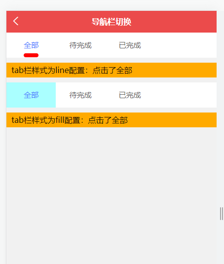

# [Tabs 导航栏](http://mid.chinatowercom.cn:18080/appGuide/ui/tabs.html#tabs-导航栏)

该组件主要用于展示根据点击导航菜单页签显示不同内容。

### [基本使用](http://mid.chinatowercom.cn:18080/appGuide/ui/tabs.html#基本使用)

- 通过`datas`参数绑定数据
- 通过`isScroll`参数设置是否可以滚动，不滚动时`align`参数才会生效
- 通过`align`参数置 tab 框的对齐方式 (该属性在`isScroll 为 false`时生效)

```vue
<template>
  <view class="demo">
    <ct-ui-tabs
      :isScroll="false"
      :datas="divideDatas"
      align="right"
      @click="ctDivideTabs"
    >
    </ct-ui-tabs>
    <view class="text-introduce">
      不能滚动的tab点击数据：{{ divideValue }}
    </view>
    <ct-ui-tabs
      :isScroll="true"
      :datas="scrollDivideDatas"
      @click="scrollDivide"
    >
    </ct-ui-tabs>
    <view class="text-introduce">
      可以滚动的tab点击数据：{{ scrollDivideValue }}
    </view>
  </view>
</template>

<script>
var _self
export default {
  data() {
    return {
      divideDatas: [
        {
          name: '全部',
          value: '点击了全部'
        },
        {
          name: '待完成',
          value: '点击了待完成'
        },
        {
          name: '已完成',
          value: '点击了已完成'
        }
      ],
      divideValue: '',
      scrollDivideDatas: [],
      scrollDivideValue: ''
    }
  },
  onLoad() {
    _self = this
  },
  created() {
    for (var i = 0; i < 7; i++) {
      this.scrollDivideDatas.push({
        name: 'tab' + i,
        value: '这是tab' + i + '的数据'
      })
    }
  },
  methods: {
    ctDivideTabs(e, index) {
      _self.divideValue = e.value
    },
    scrollDivide(e, index) {
      _self.scrollDivideValue = e.value
    }
  }
}
</script>

<style lang="scss">
.demo {
  width: 100vw;

  .text-introduce {
    display: block;
    height: 30px;
    margin: 10px 0;
    padding-left: 10px;
    line-height: 30px;
    background-color: #ffaa00;
  }
}
</style>
```



### [Tab 栏字体大小、颜色、粗细配置](http://mid.chinatowercom.cn:18080/appGuide/ui/tabs.html#tab-栏字体大小、颜色、粗细配置)

- 通过`fontSize`参数设置未选中的文字大小
- 通过`activeSize`参数设置选中的文字大小
- 通过`activeColor`参数设置选中 tab 框的文字颜色
- 通过`activeFontWeight`参数设置选中的 tab 的文字粗细
- 通过`fontWeight`参数设置选中的 tab 的文字粗细
- 通过`unActiveColor`参数设置未选中 tab 框的文字颜色

```vue
<template>
  <view class="demo">
    <ct-ui-tabs
      fontSize="28"
      activeSize="32"
      activeColor="#ffaa00"
      unActiveColor="#000000"
      activeFontWeight="700"
      fontWeight="400"
      :datas="divideDatas"
      @click="ctDivideTabs"
    >
    </ct-ui-tabs>
    <view class="text-introduce"> 字体大小样式配置：{{ divideValue }} </view>
  </view>
</template>

<script>
var _self
export default {
  data() {
    return {
      divideDatas: [
        {
          name: '全部',
          value: '点击了全部'
        },
        {
          name: '待完成',
          value: '点击了待完成'
        },
        {
          name: '已完成',
          value: '点击了已完成'
        }
      ],
      divideValue: '',
      scrollDivideDatas: [],
      scrollDivideValue: ''
    }
  },
  onLoad() {
    _self = this
  },
  methods: {
    ctDivideTabs(e, index) {
      _self.divideValue = e.value
    }
  }
}
</script>

<style lang="scss">
.demo {
  width: 100vw;

  .text-introduce {
    display: block;
    height: 30px;
    margin: 10px 0;
    padding-left: 10px;
    line-height: 30px;
    background-color: #ffaa00;
  }
}
</style>
```

### [Tab 栏高度配置](http://mid.chinatowercom.cn:18080/appGuide/ui/tabs.html#tab-栏高度配置)

- 通过`height`参数设置 tab 框的高度

```vue
<template>
  <view class="demo">
    <ct-ui-tabs height="130" :datas="divideDatas" @click="ctDivideTabs">
    </ct-ui-tabs>
    <view class="text-introduce"> tab栏高度配置：{{ divideValue }} </view>
  </view>
</template>

<script>
var _self
export default {
  data() {
    return {
      divideDatas: [
        {
          name: '全部',
          value: '点击了全部'
        },
        {
          name: '待完成',
          value: '点击了待完成'
        },
        {
          name: '已完成',
          value: '点击了已完成'
        }
      ],
      divideValue: '',
      scrollDivideDatas: [],
      scrollDivideValue: ''
    }
  },
  onLoad() {
    _self = this
  },
  methods: {
    ctDivideTabs(e, index) {
      _self.divideValue = e.value
    }
  }
}
</script>

<style lang="scss">
.demo {
  width: 100vw;

  .text-introduce {
    display: block;
    height: 30px;
    margin: 10px 0;
    padding-left: 10px;
    line-height: 30px;
    background-color: #ffaa00;
  }
}
</style>
```

### [Tab 栏选中项样式配置](http://mid.chinatowercom.cn:18080/appGuide/ui/tabs.html#tab-栏选中项样式配置)

- 通过`mode`参数设置选中的类型，（参数分为`line 和 fill`）
- 通过`bottomHighlight`参数设置选中 tab 框的下划线的高度 (该属性在`mode 为 line`时生效)
- 通过`activeBorderColor`参数设置选中 tab 框的下划线颜色 (该属性在`mode 为 line`时生效)
- 通过`activeFillColor`参数设置选中 tab 框背景颜色 (该属性在`mode 为 fill`时生效)
- 通过`bgColor`参数设置整个 tab 框背景颜色

```vue
<template>
  <view class="demo">
    <ct-ui-tabs
      mode="line"
      bottomHighlight="15"
      activeBorderColor="#ff0000"
      bgColor="#ffffff"
      :datas="divideDatas"
      @click="ctDivideTabs"
    >
    </ct-ui-tabs>
    <view class="text-introduce"> tab栏样式为line配置：{{ divideValue }} </view>
    <ct-ui-tabs
      mode="fill"
      activeFillColor="#aaffff"
      bgColor="#ffffff"
      :datas="divideDatas"
      @click="scrollDivide"
    >
    </ct-ui-tabs>
    <view class="text-introduce">
      tab栏样式为fill配置：{{ scrollDivideValue }}
    </view>
  </view>
</template>

<script>
var _self
export default {
  data() {
    return {
      divideDatas: [
        {
          name: '全部',
          value: '点击了全部'
        },
        {
          name: '待完成',
          value: '点击了待完成'
        },
        {
          name: '已完成',
          value: '点击了已完成'
        }
      ],
      divideValue: '',
      scrollDivideDatas: [
        {
          name: '全部',
          value: '点击了全部'
        },
        {
          name: '待完成',
          value: '点击了待完成'
        },
        {
          name: '已完成',
          value: '点击了已完成'
        }
      ],
      scrollDivideValue: ''
    }
  },
  onLoad() {
    _self = this
  },
  methods: {
    ctDivideTabs(e, index) {
      _self.divideValue = e.value
    },
    scrollDivide(e, index) {
      _self.scrollDivideValue = e.value
    }
  }
}
</script>

<style lang="scss">
.demo {
  width: 100vw;

  .text-introduce {
    display: block;
    height: 30px;
    margin: 10px 0;
    padding-left: 10px;
    line-height: 30px;
    background-color: #ffaa00;
  }
}
</style>
```

### [API](http://mid.chinatowercom.cn:18080/appGuide/ui/tabs.html#api)

#### [Props](http://mid.chinatowercom.cn:18080/appGuide/ui/tabs.html#props)

| 参数 | 说明 | 类型 | 默认值 | 可选值 | 版本 |
| ---- | ---- | ---- | ------ | ------ | ---- |
|      |      |      |        |        |      |

| datas             | Tabs数据                                          | Array            | -       | -                                |               |
| ----------------- | ------------------------------------------------- | ---------------- | ------- | -------------------------------- | ------------- |
| fontSize          | 未选中tab框文字大小 单位（rpx）                   | Number \| String | 28      | -                                | V1.0.22+      |
| activeSize        | 选中tab框文字大小 单位（rpx）                     | Number \| String | 28      | -                                | V1.0.22+      |
| align             | tab框对齐方式 (该属性在`isScroll 为 false`时生效) | String           | split   | center \| left \| right \| split | V1.0.22+      |
| height            | tab栏高度 单位（rpx）                             | Number｜String   | 90      | -                                | V1.0.22+      |
| default           | 默认选中数据项                                    | Number           | 0       | -                                | V1.0.22+      |
| isScroll          | 是否可以滚动                                      | Boolean          | true    | true｜false                      |               |
| mode              | tab框选中类型                                     | String           | line    | line｜fill                       | V1.0.22+      |
| activeColor       | 选中的tab的文字颜色                               | String           | #4D7AFF | -                                | V1.0.22+      |
| activeFontWeight  | 选中tab文字加粗效果                               | Number \| String | 400     | -                                | V1.0.22+      |
| fontWeight        | 未选中tab文字加粗效果                             | Number \| String | 400     | -                                | V1.0.22+      |
| unActiveColor     | 未选中tab文字颜色                                 | String           | #5D5D5D | -                                | V1.0.22+      |
| bottomHighlight   | line选中类型下，选中文字的下标高度                | Number \| String | 10      | -                                | V1.0.22+      |
| activeBorderColor | line选中类型下，选中文字的下标颜色                | String           | #4D7AFF | -                                | V1.0.22+      |
| activeFillColor   | fill选中类型下，选中tab的背景色                   | String           | #FFFFFF | -                                | V1.0.22+      |
| bgColor           | fill选中类型下，选中tab的背景色                   | String           | #FFFFFF | -                                |               |
| defaultSel        | 默认选中的数据角标                                | Number           | 0       | —                                | V1.0.22+ 弃用 |
| barWidth          | 滚动时的宽度，单位px                              | Number           | 40      | —                                | V1.0.22+ 弃用 |
| selColor          | 选中的颜色                                        | String           | #4D7AFF | —                                | V1.0.22+ 弃用 |
| fontSize          | 选中的颜色                                        | String           | #4D7AFF | —                                | V1.0.22+      |
| unSelColor        | 未选中的颜色                                      | String           | #5D5D5D | —                                | V1.0.22+ 弃用 |
| isDefault         | 是否选择默认选中样式                              | Boolean          | true    | true \| false                    | V1.0.22+ 弃用 |
| selClass          | 选中的自定义class样式                             | String           |         | —                                | V1.0.22+ 弃用 |

#### [Events](http://mid.chinatowercom.cn:18080/appGuide/ui/tabs.html#events)

| 事件名 | 说明 | 返回值 | 版本 |
| ------ | ---- | ------ | ---- |
|        |      |        |      |

| click | tab点击事件 | index 当前点击的序号 |      |
| ----- | ----------- | -------------------- | ---- |
|       |             |                      |      |