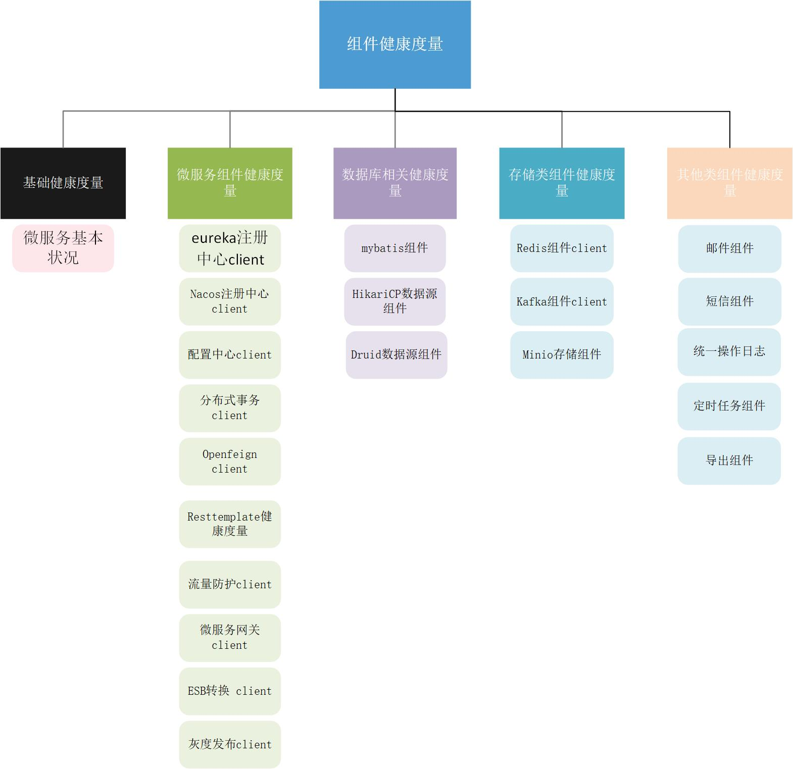
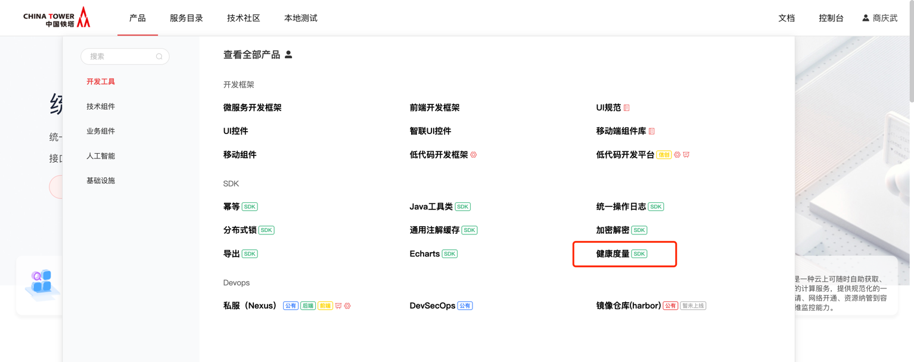
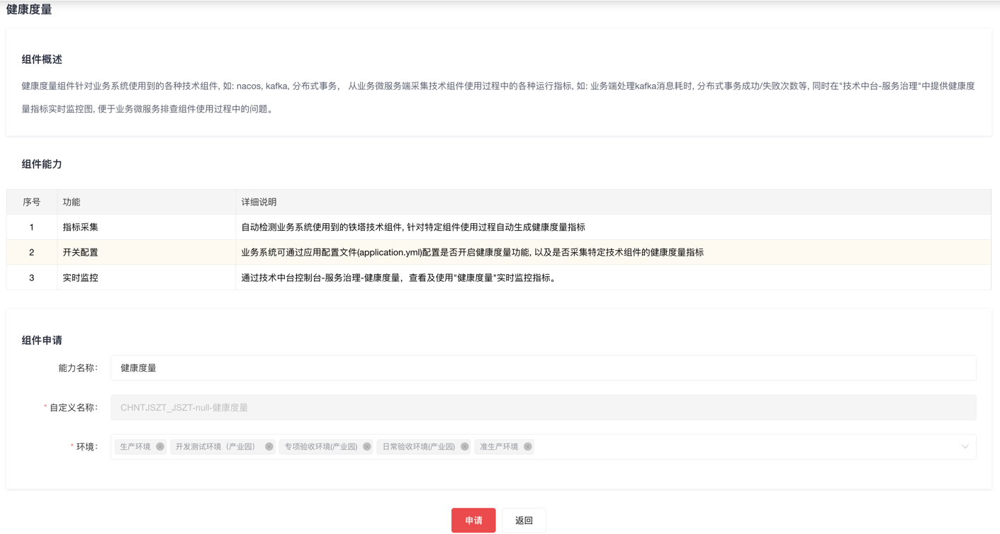
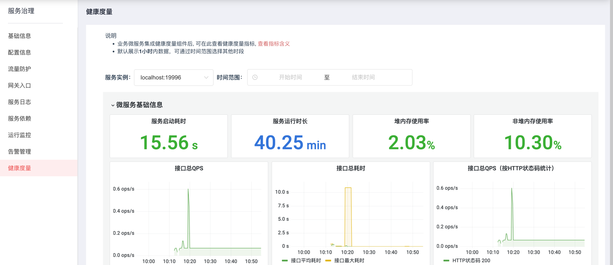

# 健康度量组件

微服务框架提供健康度量组件, 以SDK形式供业务微服务引入使用。健康度量组件针对业务系统使用到的各种技术组件, 如: nacos, kafka, 分布式事务， 从业务微服务端采集技术组件使用过程中的各种运行指标, 如: 业务端处理kafka消息耗时, 分布式事务成功/失败次数等, 同时在"技术中台-服务治理"中提供健康度量指标实时监控图, 便于业务微服务 排查组件使用过程中的问题。

## 功能发布记录

| 发布时间   | 功能分类 | 功能名称     | 说明             |
| ---------- | -------- | ------------ | ---------------- |
| 2024-07-23 | 新特性   | 健康度量组件 | 新增健康度量组件 |

## 重要通知

无

## 组件描述

### 简介

业务微服务需要依赖很多技术组件，但对很多技术组件内部健康状况不了解，当业务系统出现问题而怀疑与技术组件有关时无法很直观的判断，如：分布式事务不成功，可能仅仅是一个配置项错误，但排查此问题可能需要花费很多时间。
 集成健康度量组件后, 能够直观地对业务系统使用的技术组件情况进行监控，为问题的定位和排查提供依据，提高系统问题的解决速度。支持监控的技术组件如下: 



## 快速入门

### 组件申请

第1步，技术中台首页，技术组件中选择"健康度量"



第2步，点击申请


第3步，填写详细信息，点击申请即可



## 操作指南

### 实时监控

申请健康度量组件并成功审批后, 在技术中台-服务治理, 选择具体微服务之后, 点击左侧子菜单"健康度量", 即可查看从业务微服务采集到的健康度量指标实时监控图, 如下图:



#### 指标说明

| 组件                             | 指标                               | 指标类型                | 指标描述                                                     | 监控关注点                                                   | 建议告警阈值                       |
| -------------------------------- | ---------------------------------- | ----------------------- | ------------------------------------------------------------ | ------------------------------------------------------------ | ---------------------------------- |
| 微服务基础信息                   | 服务启动耗时                       | 时间，秒                | 从执行启动命令到应用准备好，能够正常处理业务请求，所耗费的时间 | -                                                            | -                                  |
|                                  | 服务运行时长                       | 时间，秒                | 自启动成功，服务已经运行的时间，重启服务会被重置             | -                                                            | -                                  |
|                                  | 堆内存使用率                       | 百分比                  | 使用的堆内存 / 配置的堆内存最大值，堆内存用于Java对象的分配  | 使用率不应过高                                               | <80%                               |
|                                  | 非堆内存使用率                     | 百分比                  | 使用的非堆内存 / 配置的非堆内存最大值，非堆内存用于常量、代码、类加载使用 | 使用率不应过高                                               | <80%                               |
|                                  | 接口总QPS                          | QPS（1分钟平均）        | 所有的http接口，总的QPS，不区分状态码                        | -                                                            | -                                  |
|                                  | 接口总QPS（按HTTP状态码统计）      | QPS（1分钟平均）        | 所有的http接口，总的QPS，根据http状态码统计                  | 状态码5xx的请求不应出现                                      | error count< 0                     |
|                                  | 接口总耗时                         | 耗时，毫秒（1分钟平均） | 所有的http接口，总的平均耗时，精确到毫秒                     | 耗时不应过长                                                 | <5s                                |
|                                  | CPU使用率                          | 百分比                  | 系统CPU使用率：所在机器CPU使用率，范围：0 % ~ 100%  进程CPU使用率：JVM进程CPU使用率，范围：0 % ~ 100% | 进程CPU使用率不应过高                                        | <50%                               |
|                                  | 系统负载                           | 小数                    | CPU核心数：所在机器CPU核心数  负载1m：机器1分钟平均负载，范围：0 ~ CPU核心数 | -                                                            | -                                  |
|                                  | 磁盘使用量                         | GB                      | 总磁盘空间：所在机器磁盘总GB数  空闲磁盘空间：所在机器磁盘可用GB数 | -                                                            | -                                  |
|                                  | 日志打印 (每分钟新增)              | 整数                    | 各个日志级别每分钟打印次数，包括：debug、info、warn、error   | error级别日志不应过高                                        | error count<60                     |
|                                  | 进程FD（打开文件数）               | 整数                    | Linux中，进程打开的文件数是有限制的，很多场景需要打开文件，如：网络连接、日志文件、进程使用到的系统文件等  打开文件数：JVM进程打开文件数  最多允许打开文件数：JVM进程允许打开最大文件数 | 打开文件数<允许最大数 * 80%                                  | <80%                               |
| Tomcat容器健康度量               | 当前session数                      | 整数                    | tomcat本地session数，微服务架构不推荐使用session             | session数应为0                                               | -                                  |
|                                  | 静态资源命中率                     | 百分比                  | tomcat访问静态资源（js、css、img）命中率，微服务架构前后端分离，静态资源应独立部署，通过nginx代理，tomcat应只处理http后端接口请求 | 命中率应为0                                                  | -                                  |
|                                  | Tomcat线程数                       | 整数                    | tomcat处理业务http接口请求的线程数  - 当前线程数：tomcat当前线程数，包含闲置的+运行中的线程数，根据业务负载会动态增减，不会超过”配置的最大线程数“  - 运行中线程数：正在处理业务请求的线程数  - 配置最大线程数：tomcat配置的最大线程数，默认200 | 运行中线程数<配置最大线程数 * 80%                            | <80%                               |
|                                  | Tomcat http连接数                  | 整数                    | tomcat处理业务http接口请求 http连接数  - 当前连接数：当前http连接数  - 配置最大连接数：tomcat配置的最大连接数，默认8192 | 当前连接数<配置最大连接数 * 80%                              | <80%                               |
|                                  | 各个接口QPS                        | QPS（1分钟平均）        | 业务微服务各个接口QPS                                        | -                                                            | -                                  |
|                                  | 各个接口耗时                       | 耗时，毫秒（1分钟平均） | 业务微服务各个接口平均耗时                                   | 耗时不应过长                                                 | <5s                                |
| JVM 虚拟机健康度量               | 每秒GC停顿次数                     | QPS（1分钟平均）        | JVM垃圾收集器进行垃圾收集时，造成虚拟机线程所有停顿，每秒停顿次数 | -                                                            |                                    |
|                                  | GC停顿平均时长                     | 耗时，毫秒（1分钟平均） | JVM垃圾收集器进行垃圾收集时，造成虚拟机线程所有停顿，停顿时长。一般来说垃圾收集效率很高，耗时很短，毫秒 ~ 几十毫秒比较正常 |                                                              |                                    |
|                                  | Allocated/Promoted内存量           | MB                      | JVM进行内存分配的内存量  - Allocated内存量：平均每秒新生代堆内存增量，MB  - Promoted内存量：平均每秒老年代内存增量，MB |                                                              |                                    |
|                                  | JVM线程数                          | 整数                    | JVM进程所有的线程数，包含业务线程、JVM线程、守护线程等，根据业务负载情况，线程数是动态变化的  - 峰值线程数：JVM进程历史最大线程数  - 当前线程数：当前JVM进程包含的所有线程数 |                                                              |                                    |
|                                  | JVM线程数（各个状态）              | 整数                    | JVM进程当前线程数，根据线程状态进行汇总  包括6种状态（对应于java.lang.Thread$State状态）：new、runnable、blocked、waiting、timed_waiting、terminated |                                                              |                                    |
| Eureka注册中心client健康度量     | 健康状态                           | 枚举                    | 状态枚举  - 未使用该组件  - 健康  - 未开启注册               | 状态应为健康                                                 | 健康                               |
|                                  | 发现的服务数                       | 整数                    | 从eureka注册中心获取到的已注册的服务数，不应为0              | 应该>0                                                       | >0                                 |
|                                  | 请求Eureka server各个接口 - QPS    | QPS（1分钟平均）        | 请求Eureka server各个接口 - QPS                              | -                                                            | -                                  |
|                                  | 请求Eureka server各个接口 - 耗时   | 耗时，毫秒（1分钟平均） | 请求Eureka server各个接口 - 耗时                             | 耗时不应过长                                                 | <1s                                |
| Nacos注册中心client健康度量      | 健康状态                           | 枚举                    | 状态枚举  - 未使用该组件  - 健康  - 未开启注册               | 状态应为健康                                                 | 健康                               |
|                                  | 发现的服务数                       | 整数                    | 从nacos注册中心获取到的已注册的服务数，不应为0               | 应该>0                                                       | >0                                 |
|                                  | 订阅的服务数                       | 整数                    | 业务端手动订阅某个服务的实例列表变动，订阅的服务数           | -                                                            | -                                  |
| Nacos配置中心client健康度量      | 健康状态                           | 枚举                    | 状态枚举  - 未使用该组件  - 健康  - 未开启远程配置           | 状态应为健康                                                 | 健康                               |
|                                  | 监听的配置数                       | 整数                    | 业务端监听远程nacos配置文件的数量                            | -                                                            | -                                  |
|                                  | 配置更新次数（自服务启动以来）     | 整数                    | 配置中心业务端配置后，业务端监听到变动并同步更新的次数       | -                                                            | -                                  |
| Mybatis组件健康度量              | Mapper数量                         | 整数                    | 业务微服务使用的Mapper类的数量                               | -                                                            | -                                  |
|                                  | Mapper方法执行 - QPS               | QPS（1分钟平均）        | Mybatis 各个Mapper方法每秒调用次数，每个Mapper方法都对应一条sql语句 | -                                                            | -                                  |
|                                  | Mapper方法执行 - 耗时              | 耗时，毫秒（1分钟平均） | Mybatis 各个Mapper方法执行耗时，精确到毫秒，Mapper方法执行耗时，对应于sql语句的执行耗时，可衡量sql性能 | 耗时不应过长                                                 | <5s                                |
|                                  | Mapper方法执行失败 - QPS           | QPS（1分钟平均）        | Mybatis 各个Mapper方法每秒调用执行失败的次数                 | 失败次数不应过多                                             | <10                                |
|                                  | Mapper方法执行 失败- 耗时          | 耗时，毫秒（1分钟平均） | Mybatis 各个Mapper方法执行失败的耗时                         |                                                              |                                    |
| Druid连接池健康度量              | 健康状态                           | 枚举                    | 状态枚举  - 未使用该组件  - 健康  - 连接获取失败             | 状态应为健康                                                 | 健康                               |
|                                  | 数据源个数                         | 整数                    | 业务端使用的druid数据源的个数，一般为1，使用多数据源时大于1个 | -                                                            | -                                  |
|                                  | 连接池连接数                       | 整数                    | 数据源连接池中的连接数量  - 空闲连接数  - 挂起的线程数：因为等待可用连接而挂起的线程数  - 活跃连接数：正在使用中的连接数  - 配置最大连接数：应用配置的数据源最大允许的连接数 | 1. 挂起的线程数不应长期>0，大于0说明连接池使用频繁，有某些业务因为获取不到连接而被阻塞  2. 连接使用率 = 活跃连接数 / 配置最大连接数，占比不应过高，过高说明连接池连接资源紧张 | 1. 挂起线程数<0  2. 连接使用率<80% |
| HikariCP连接池健康度量           | 健康状态                           | 枚举                    | 状态枚举  - 未使用该组件  - 健康  - 连接获取失败             | 状态应为健康                                                 | 健康                               |
|                                  | 数据源个数                         | 整数                    | 业务端使用的HikariCp数据源的个数，一般为1，使用多数据源时大于1个 | -                                                            | -                                  |
|                                  | 连接池连接数                       | 整数                    | 同Druid连接池                                                | 同Druid连接池                                                | 同Druid连接池                      |
|                                  | 连接使用耗时                       | 耗时，毫秒（1分钟平均） | 连接从获取到返还给数据源，平均耗时，即：使用连接的时长。若连接占用时长过高，往往意味着有慢sql | 链接使用耗时不应过长                                         | <10s                               |
| 分布式事务seata 健康度量         | 健康状态                           | 枚举                    | 状态枚举  - 未使用该组件  - 健康  - 无法连接seata-server     | 状态应为健康                                                 | 健康                               |
|                                  | 全局事务声明数                     | 整数                    | 业务端使用@GlobalTransactional注解的数量，即：全局事务数     | -                                                            | -                                  |
|                                  | 每分钟 - 全局事务成功 - 次数       | 整数                    | 业务微服务作为全局事务发起端（tm），全局事务成功完成的次数   | -                                                            | -                                  |
|                                  | 每分钟 - 全局事务成功 - 平均耗时   | 耗时，毫秒（1分钟平均） | 业务微服务作为全局事务发起端（tm），全局事务成功完成耗时     | 耗时不应过长，默认60s超时                                    | <60s                               |
|                                  | 每分钟 - 全局事务失败 - 次数       | 整数                    | 业务微服务作为全局事务发起者（tm），全局事务失败的次数，如：提交全局事务失败、全局事务提交失败、全局事务回滚等 | 失败次数不应过多                                             | <10                                |
|                                  | 每分钟 - 全局事务失败 - 平均耗时   | 耗时，毫秒（1分钟平均） | 业务微服务作为全局事务发起端（tm），全局事务失败时的耗时     | -                                                            | -                                  |
|                                  | 每分钟 - 二阶段(2phase) 提交数     | 整数                    | 作为全局事务参与者，分布式事务二阶段提交次数                 | -                                                            | -                                  |
|                                  | 每分钟 - 二阶段(2phase) 回滚数     | 整数                    | 作为全局事务参与者，分布式事务二阶段回滚次数                 | 回滚次数不应过多                                             | <10                                |
|                                  | 业务侧undolog表当前记录数          | 整数                    | 业务侧，seata undolog表中的记录数。业务运行过程表中有数据是正常的，业务低峰期表中数据逐渐清空。当无分布式事务运行但表中有大量数据，或者有状态为1的数据需要注意，业务侧可能存在异常。 |                                                              |                                    |
|                                  | 每分钟 - 新增undo_log数量          | 整数                    | 业务侧，seata undolog表中每分钟新增数                        | 状态为1记录，新增不应过多                                    | <10                                |
| Redis client健康度量             | 请求Redis cache服务成功 - QPS      | QPS（1分钟平均）        | 业务侧请求cache服务各个接口来操作redis成功时，各个接口的每秒请求数。每个cache服务接口对应于一个redis操作，如：/string/get代表获取string类型的缓存值 | -                                                            | -                                  |
|                                  | 请求Redis cache服务成功 - 耗时     | 耗时，毫秒（1分钟平均） | 业务侧请求cache服务各个接口来操作redis成功时，各个接口的平均耗时 | 耗时不应过长                                                 | <5s                                |
|                                  | 请求Redis cache服务失败 - QPS      | QPS（1分钟平均）        | 业务侧请求cache服务各个接口来操作redis失败时，各个接口的每秒请求数。 | 失败次数不应过多                                             | <1                                 |
|                                  | 请求Redis cache服务失败 - 耗时     | 耗时，毫秒（1分钟平均） | 业务侧请求cache服务各个接口来操作redis失败时，各个接口的平均耗时 | -                                                            | -                                  |
| 流量防护client健康度量           | 健康状态                           | 枚举                    | 状态枚举  - 未使用该组件  - 健康  - sentinel server地址未配置 | 状态应为健康                                                 | 健康                               |
|                                  | 限流规则数量                       | 整数                    | 业务端配置的限流规则数量                                     | -                                                            |                                    |
|                                  | 熔断规则数量                       | 整数                    | 业务端配置的熔断降级规则数量                                 |                                                              |                                    |
|                                  | 热点参数限流规则数量               | 整数                    | 业务端配置的热点参数限流规则数量                             |                                                              |                                    |
|                                  | 来源访问控制规则数量               | 整数                    | 业务端配置的来源访问控制流规则数量                           |                                                              |                                    |
| 定时作业(xxljob client) 健康度量 | 健康状态                           | 枚举                    | 状态枚举  - 未使用该组件  - 健康  - xxljob client未正确配置  - xxljob server地址访问不通 | 状态应为健康                                                 | 健康                               |
|                                  | 定时作业数量                       | 整数                    | 业务微服务中，运行的xxljob定时任务的数量                     | -                                                            | -                                  |
|                                  | 各个定时作业执行成功 - 耗时        | 耗时，毫秒（1分钟平均） | 业务侧各个定时作业执行成功耗时                               | -                                                            | -                                  |
|                                  | 各个定时作业执行失败 - 耗时        | 耗时，毫秒（1分钟平均） | 业务侧各个定时作业执行失败耗时                               | -                                                            | -                                  |
|                                  | 定时作业执行次数（自服务启动以来） | 整数                    | 业务侧各个定时作业自服务启动以来，执行次数，区分成功和失败   | 失败次数不应过多                                             | 一天失败次数<0                     |
| 统一操作日志组件 健康度量        | 健康状态                           | 枚举                    | 状态枚举  - 未使用该组件  - 健康  - logback配置文件路径未正确配置 | 状态应为健康                                                 | 健康                               |
|                                  | 操作数量                           | 整数                    | 业务微服务侧使用操作日志注解@OperationLog声明的操作的数量    | -                                                            | -                                  |
|                                  | 各个操作执行成功 - QPS             | QPS（1分钟平均）        | 业务微服务各个操作执行成功的QPS                              | -                                                            | -                                  |
|                                  | 各个操作执行成功 - 耗时            | 耗时，毫秒（1分钟平均） | 业务微服务各个操作执行成功的耗时                             | 耗时不应过长                                                 | <5s                                |
|                                  | 各个操作执行失败 - QPS             | QPS（1分钟平均）        | 业务微服务各个操作执行失败的QPS                              | 操作失败不应过多                                             | 每分钟<10                          |
|                                  | 各个操作执行失败 - 耗时            | 耗时，毫秒（1分钟平均） | 业务微服务各个操作执行失败的耗时                             | -                                                            | -                                  |
| OpenFeign组件健康度量            | 健康状态                           | 枚举                    | 状态枚举  - 未使用该组件  - 健康                             | -                                                            | -                                  |
|                                  | FeignClient数量                    | 整数                    | 业务侧声明使用的FeignClient数量，一般来说每个FeignClient对应一个外部服务 | -                                                            | -                                  |
|                                  | 请求外部服务接口成功 - QPS         | QPS（1分钟平均）        | 业务微服务请求外部微服务接口成功的QPS                        | -                                                            | -                                  |
|                                  | 请求外部服务接口成功 - 耗时        | 耗时，毫秒（1分钟平均） | 业务微服务请求外部微服务接口成功的耗时                       | 耗时不应过长                                                 | <10s                               |
|                                  | 请求外部服务接口失败 - QPS         | QPS（1分钟平均）        | 业务微服务请求外部微服务接口失败的QPS                        | 请求失败不应过多                                             | 每分钟<10                          |
|                                  | 请求外部服务接口失败 - 耗时        | 耗时，毫秒（1分钟平均） | 业务微服务请求外部微服务接口失败的耗时                       | -                                                            | -                                  |
|                                  | 请求外部服务接口每分钟fallback次数 | 整数                    | feignClient配置了fallback情况下，请求失败会触发执行fallback，本指标记录每分钟触发fallback次数 | 触发fallback次数不应过多                                     | 每分钟<10                          |
| RestTemplate HTTP健康度量        | 请求外部接口成功 - QPS             | QPS（1分钟平均）        | 业务微服务请求外部非微服务接口成功的QPS                      | -                                                            | -                                  |
|                                  | 请求外部接口成功 - 耗时            | 耗时，毫秒（1分钟平均） | 业务微服务请求外部非微服务接口成功的耗时                     | 耗时不应过长                                                 | <10s                               |
|                                  | 请求外部接口失败 - QPS             | QPS（1分钟平均）        | 业务微服务请求外部非微服务接口失败的QPS                      | 请求失败不应过多                                             | 每分钟<10                          |
|                                  | 请求外部接口失败 - 耗时            | 耗时，毫秒（1分钟平均） | 业务微服务请求外部非微服务接口失败的耗时                     | -                                                            | -                                  |
| 请求ESB转换服务 健康度量         | 请求ESB转换服务成功  - QPS         | QPS（1分钟平均）        | 业务微服务请求ESB转换服务成功的QPS                           | -                                                            | -                                  |
|                                  | 请求ESB转换服务成功  - 耗时        | 耗时，毫秒（1分钟平均） | 业务微服务请求ESB转换服务成功的耗时                          | 耗时不应过长                                                 | <10s                               |
|                                  | 请求ESB转换服务失败  - QPS         | QPS（1分钟平均）        | 业务微服务请求ESB转换服务失败的QPS                           | 请求失败不应过多                                             | 每分钟<10                          |
|                                  | 请求ESB转换服务失败  - 耗时        | 耗时，毫秒（1分钟平均） | 业务微服务请求ESB转换服务失败的耗时                          | -                                                            | -                                  |
| 请求微服务网关 健康度量          | 请求微服务网关成功 - QPS           | QPS（1分钟平均）        | 业务微服务请求微服务网关成功的QPS                            | -                                                            | -                                  |
|                                  | 请求微服务网关成功 - 耗时          | 耗时，毫秒（1分钟平均） | 业务微服务请求微服务网关成功的耗时                           | 耗时不应过长                                                 | >15s                               |
|                                  | 请求微服务网关失败 - QPS           | QPS（1分钟平均）        | 业务微服务请求微服务网关失败的QPS                            | 请求失败不应过多                                             | 每分钟<10                          |
|                                  | 请求微服务网关失败 - 耗时          | 耗时，毫秒（1分钟平均） | 业务微服务请求微服务网关失败的耗时                           | -                                                            | -                                  |
|                                  | 请求微服务网关 - 每分钟限流数      | 整数                    | 业务微服务请求微服务网关被流控规则限流，从而造成调用失败，每分钟新增次数 | 被限流次数不应过高                                           | 每分钟<10                          |
| 短信Client 健康度量              | 调用发送短信接口成功 - QPS         | QPS（1分钟平均）        | 业务微服务请求sms各个接口发送短信成功QPS                     | -                                                            | -                                  |
|                                  | 调用发送短信接口成功 - 耗时        | 耗时，毫秒（1分钟平均） | 业务微服务请求sms各个接口发送短信成功耗时                    | 耗时不应过长                                                 | <10s                               |
|                                  | 调用发送短信接口失败 - QPS         | QPS（1分钟平均）        | 业务微服务请求sms各个接口发送短信失败QPS                     | 请求失败不应过多                                             | 每分钟<10                          |
|                                  | 调用发送短信接口失败 - 耗时        | 耗时，毫秒（1分钟平均） | 业务微服务请求sms各个接口发送短信失败耗时                    | -                                                            | -                                  |
| 邮件Client 健康度量              | 调用发送邮件接口成功 - QPS         | QPS（1分钟平均）        | 业务微服务请求chinatower-inform-service各个接口发送邮件，成功QPS | -                                                            | -                                  |
|                                  | 调用发送邮件接口成功 - 耗时        | 耗时，毫秒（1分钟平均） | 业务微服务请求chinatower-inform-service各个接口发送邮件，成功耗时 | 耗时不应过长                                                 | <10s                               |
|                                  | 调用发送邮件接口失败 - QPS         | QPS（1分钟平均）        | 业务微服务请求chinatower-inform-service各个接口发送邮件失败，QPS | 请求失败不应过多                                             | 每分钟<10                          |
|                                  | 调用发送邮件接口失败 - 耗时        | 耗时，毫秒（1分钟平均） | 业务微服务请求chinatower-inform-service各个接口发送邮件，失败耗时 | -                                                            | -                                  |
| Kafka消息队列客户端 健康度量     | 健康状态                           | 枚举                    | 状态枚举  - 未使用该组件  - 健康  - 配置不正确               | 状态应为健康                                                 | 健康                               |
|                                  | 消息处理Listener数量               | 整数                    | 处理kafka消息的listener数量，一般来说一个listener处理一个kafka topic | -                                                            | -                                  |
|                                  | 消息发送成功率（最近1小时）        | 百分比                  | 业务系统使用kafka组件发送kafka消息，1小时内的成功率          | 成功率不应过低                                               | >80%                               |
|                                  | 消息处理成功率（最近1小时）        | 百分比                  | 业务系统使用kafka组件处理kafka消息，1小时内的成功率          | 成功率不应过低                                               | >80%                               |
|                                  | 消息处理成功 - QPS                 | QPS（1分钟平均）        | 业务系统处理kafka消息，成功的QPS                             | -                                                            | -                                  |
|                                  | 消息处理成功 - 耗时                | 耗时，毫秒（1分钟平均） | 业务系统处理kafka消息，成功时的处理耗时                      | 耗时不应过长                                                 | <10s                               |
|                                  | 消息处理失败 - QPS                 | QPS（1分钟平均）        | 业务系统处理kafka消息，失败的QPS                             | 请求失败不应过多                                             | 每分钟<10                          |
|                                  | 消息处理失败 - 耗时                | 耗时，毫秒（1分钟平均） | 业务系统处理kafka消息，失败时的处理耗时                      | -                                                            | -                                  |
|                                  | 每分钟 - 消息发送成功次数          | 整数                    | 消息发送成功次数，按分钟统计                                 | -                                                            | -                                  |
|                                  | 每分钟 - 消息发送失败次数          | 整数                    | 消息发送失败次数，按分钟统计                                 | 发送失败不应过多                                             | 每分钟<10                          |

## 典型实践

无

## API参考

无

## SDK

首先，在项目的pom.xml中引入如下依赖

```xml
<dependency>
    <groupId>com.chinatower.cloud</groupId>
    <artifactId>spring-cloud-starter-chinatower-health</artifactId>
</dependency>
```

第二步, 确保开启了springboot actuator指标采集功能

```yaml
management:
  metrics:
    export:
      prometheus:
        enabled: true
      jmx:
        enabled: false
  endpoints:
    web:
      exposure:
        include: '*'
      base-path: /actuator
```

### SDK配置项

| 配置项                           | 含义                         | 默认值 | 说明     |
| -------------------------------- | ---------------------------- | ------ | -------- |
| chinatower.plugin.health.enabled | 是否开启健康度量指标采集功能 | true   | 默认开启 |

## 网络要求

无

## 常见问题

无

## 样例文件

 [spring-cloud-chinatower-health-eureka-examples.zip](../file/spring-cloud-chinatower-health-eureka-examples.zip) 

