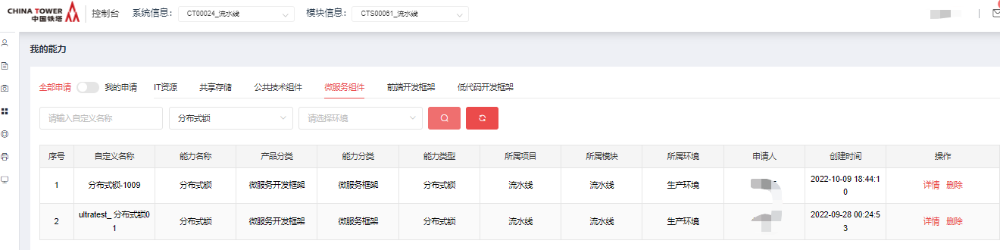

# 分布式锁

## 功能发布记录

| 日期     | 版本  | 变更说明 | 作者 |
| -------- | ----- | -------- | ---- |
| 2022-8-4 | 1.0.0 | 初始版本 | 赵龙 |
|          |       |          |      |

## 重要通知

无

## 组件描述

### 3.1背景

中国铁塔建设的项目很多，且大部分应用都是互联网应用，而这些应用又大都采取微服务的架构设计，分布式系统部署方式。一个服务会部署多个节点。由于分布式系统多线程、多进程并且分布在不同机器上，这将使原单机部署情况下的并发控制锁策略失效，单纯的应用并不能提供分布式锁的能力。为了解决这个问题就需要一种“跨机器的互斥机制”来控制共享资源的访问，这就是分布式锁要解决的问题！

### 3.2 术语定义

<table>
  <tr>
  <th width="50">序号</th>
  <th width="60">简称/术语</th>
  <th width="300">说明</th>
  </tr>
  <tr>
    <td>1</td>
    <td>Redisson</td>
    <td>Redisson是架设在Redis基础上的一个Java驻内存数据网格（In-Memory Data Grid）.底层使用netty框架，并提供了与java对象相对应的分布式对象、分布式集合、分布式锁和同步器、分布式服务等一系列的Redisson的分布式对象。</td>
  </tr>
  <tr>
    <td>2</td>
    <td>Watch dog</td>
    <td>自动延时机制，每隔10秒检测当前客户端是否还持有锁key，会不断延长锁key的生存时间。</td>
  </tr>
</table>


### 3.3 参考资料

| 序号 | 文档名称                                                   | 最后修订时间 | 版本号 | 来源         |
| ---- | ---------------------------------------------------------- | ------------ | ------ | ------------ |
| 1    | 中国铁塔IT系统技术架构总体规划（总册）                     | 2017/05/05   | 1.0    | 铁塔内部资料 |
| 2    | 中国铁塔分布式锁项目架构方案设计——技术（V1.0）             | 2022/05      | 1.0    | 铁塔内部资料 |
| 3    | 中国铁塔分布式锁项目架构方案设计——应用、数据、安全（V1.0） | 2022/05      | 1.0    | 铁塔内部资料 |

### 3.4 使用范围

分布式锁保证在分布式系统中，访问共享资源的安全性、一致性，为分布式系统下并发调用提供安全可靠的并发控制能力。使各系统在运行过程中，安全、可靠。

分布式锁适用于分布式系统下，访问共享资源的时候。

### 4.1 概念

分布式锁保证了在分布式系统中，访问共享资源的安全性、一致性，为分布式系统下并发调用提供安全可靠的并发控制能力。使各系统在运行过程中，安全、可靠。

### 4.2 使用场景

1. 提高分布式系统的效率，避免重复工作：可以避免分布式系统下不同节点重复相同的工作。 例如一微服务项目中有定时任务，且该服务部署在多台服务器上，使用分布式锁保证同一时间只有一台服务可以执行该定时任务。

2. 分布式系统操作共享资源：同一个服务节点部署在多台服务器上，传统的单体锁已经不能生效了。 例如资源，订单等系统，使用分布式锁保证分布式系统下操作共享资源的安全性。

### 4.3 提供的功能

1. 锁的互斥性功能：在分布式高并发情况下，需要保证，同一时刻，只能有一个线程获得锁。
2. 防止死锁功能：锁拥有默认过期时间，即使某个线程获得锁后，还没有来的及去释放锁，因为系统故障或者其它原因，无法执行释放锁的命令，因为有超时时间，到期自动释放，其它线程仍可获取锁，不会产生死锁。
3. 锁的可重入功能：同一个线程，可以重复拿到同一个资源的锁。
4. 锁的自动续期功能：拥有锁的线程还未执行完毕，会为该锁自动续期，防止拿到此锁的线程还未执行完业务逻辑而锁却被释放掉。
5. 锁的原子性功能：加锁、释放锁的操作都是原子性的。防止加锁命令成功，而设置过期时间命令失败的类似问题产生。

### 4.4 分布式锁开发框架概述

分布式锁就是控制分布式系统有序的去对共享资源进行操作，通过互斥来保持数据的一致性。主要适用于分布式系统多线程、多进程并且部署在不同的服务器上。跨机器的互斥机制，来保证共享资源的访问。

分布式锁开发框架具备的特点：

- 锁的互斥性功能：在分布式高并发情况下，需要保证，同一时刻，只能有一个线程获得锁。
- 防止死锁功能：锁拥有默认过期时间，即使某个线程获得锁后，还没有来的及去释放锁，因为系统故障或者其它原因，无法执行释放锁的命令，因为有超时时间，到期��动释放，其它线程仍可获取锁，不会产生死锁。
- 锁的可重入功能：同一个线程，可以重复拿到同一个资源的锁。
- 锁的自动续期功能：拥有锁的线程还未执行完毕，会为该锁自动续期，防止拿到此锁的线程还未执行完业务逻辑而锁却被释放掉。
- 锁的原子性功能：加锁、释放锁的操作都是原子性的。防止加锁命令成功，而设置过期时间命令失败的类似问题产生。

### 4.5 环境要求

Jdk在1.8以上

### 4.6 使用示例

1. Redis直连使用demo

```java
package cn.com.chinatower.lockdemo.controller;

import cn.com.chinatower.lock.service.impl.TowerLock;

import org.springframework.beans.factory.annotation.Autowired;

import org.springframework.web.bind.annotation.GetMapping;

import org.springframework.web.bind.annotation.RequestMapping;

import org.springframework.web.bind.annotation.RestController;

/**

* 中国铁塔分布式锁 使用demo

*
释放锁操作最好都放在finally里面，防止业务逻辑执行异常，未能及时释放掉锁

*/

@RestController
@RequestMapping("/tower")
public class TowerLockController {

@Autowired
private TowerLock towerLock;

private static final String GOODS_KEY = "apple";

private static final String LOCK_KEY = "tower_lock_key";

/**
* 加锁：
* 1.拥有watchdog机制，自动续期；
* 2.锁过期时间：默认30秒；
*/

@GetMapping("/lock")
public void lock() {

// 1.加锁
towerLock.lock(LOCK_KEY);

try {
// 2.执行业务逻辑
executeYourJob(LOCK_KEY);

} finally {

// 3.释放锁

towerLock.unlock(LOCK_KEY);

}

}

/**

* 加锁：自定义锁过期时间。

* 1.没有watchdog机制，不会自动续期；

* 2.锁过期时间：leaseTime-到时自动释放锁；

*/

@GetMapping("/lock_2")

public void lock_leaseTime() {

// 1.加锁

towerLock.lock(LOCK_KEY, 10);

try {

// 2.执行业务逻辑

executeYourJob(LOCK_KEY);

} finally {

// 3.释放锁

towerLock.unlock(LOCK_KEY);

}

}

/**

* 加锁：设置等待时间的锁

* 1.拥有watchdog机制，自动续期；

* 2.锁过期时间：默认30秒；

* 3.等待waitTime后，没有获取到锁，放弃获取锁

* 返回值：true-获取锁成功； false-获取锁失败

*/

@GetMapping("/lock_tryLock")

public void lock_tryLock() {

// 1.加锁

boolean b = towerLock.tryLock(LOCK_KEY, 10);

// 2.执行业务逻辑

try {

if (b) {

executeYourJob(LOCK_KEY);

}

} finally {

// 3.释放锁

towerLock.unlock(LOCK_KEY);

}

}

/**

* 加锁：有等待时间，自定义过期时间

* 1.没有watchdog机制，不会自动续期；

* 2.锁过期时间：leaseTime

* 3.等待waitTime后，没有获取到锁，放弃获取锁

*/

@GetMapping("/lock_tryLock_2")
public void lock_tryLock_2() {

// 1.加锁

boolean b = towerLock.tryLock(LOCK_KEY, 15, 10);
System.out.println("tryLock----" + b);

// 2.执行业务逻辑

if (b) {

executeYourJob(LOCK_KEY);

}

// 3.释放锁

towerLock.unlock(LOCK_KEY);

}

/**

* 判断该锁是否被线程持有

*/

@GetMapping("/isLock")

public String isLock() {

// 1.判断该锁是否被线程持有

boolean lock = towerLock.isLock(LOCK_KEY);

System.out.println("判断该锁是否被线程持有:" + lock);

return "判断该锁是否被线程持有:" + lock;

}

/**

* 可重入锁

*/

@GetMapping("/reentrant_lock")

public void reentrantLock() throws InterruptedException {

// 1.加锁

for (int i = 0; i < 5; i++) {

towerLock.lock(LOCK_KEY);

System.out.println("第" + (i + 1) + "次加锁成功");

Thread.sleep(200L);

}

// 2.执行业务逻辑

// executeYourJob(lock_key);

// 3.释放锁

for (int i = 0; i < 5; i++) {

towerLock.unlock(LOCK_KEY);

System.out.println("第" + (i + 1) + "次释放锁成功");

System.out.println("该线程是否持有锁：" +
towerLock.isHeldByCurrentThread(LOCK_KEY));

Thread.sleep(200L);

}

System.out.println("可重入锁释放完毕：该线程是否持有锁：" +
towerLock.isHeldByCurrentThread(LOCK_KEY));

}

/**

* 判断该线程是否持有当前锁

*/

@GetMapping("/isHeldByCurrentThread")

public void isHeldByCurrentThread() {

System.out.println("1.加锁前：" +
towerLock.isHeldByCurrentThread(LOCK_KEY));

// 1.加锁

towerLock.lock(LOCK_KEY);

System.out.println("1.加锁后：" +
towerLock.isHeldByCurrentThread(LOCK_KEY));

// 2.执行业务逻辑

executeYourJob(LOCK_KEY);

// 3.释放锁

towerLock.unlock(LOCK_KEY);

System.out.println("1.释放锁：" +
towerLock.isHeldByCurrentThread(LOCK_KEY));

}

private void executeYourJob(String lock_key) {

System.out.println("do something..." + lock_key);

}

}
```

1. cache模式使用demo

```java
package cn.com.longer.lock.lock;

import cn.com.chinatower.lock.entity.RespInfo;

import cn.com.chinatower.lock.service.CacheLock;

import com.alibaba.fastjson.JSON;

import com.alibaba.fastjson.JSONObject;

import org.springframework.beans.factory.annotation.Autowired;

import org.springframework.web.bind.annotation.PathVariable;

import org.springframework.web.bind.annotation.RequestMapping;

import org.springframework.web.bind.annotation.RestController;

@RestController

@RequestMapping("/cache")

public class CacheLockController {

@Autowired

private CacheLock cacheLock;

@RequestMapping("/lock/{lockName}")

public void lock(@PathVariable String lockName) {

System.out.println("1.lockName:" + lockName);

RespInfo respInfo = cacheLock.lock(lockName);

System.out.println("2.respInfo:" + respInfo);

System.out.println("do something");

String status = respInfo.getStatus();

String uniqueFlag = respInfo.getData().toString();

RespInfo unlock = cacheLock.unlock(lockName, uniqueFlag);

System.out.println("unlock:" + unlock);

System.out.println("3.释放锁成功 unlock success");

}

@RequestMapping("/lock/{lockName}/{leaseTime}")

public void lockWaitTime(@PathVariable String lockName, @PathVariable
long leaseTime){

System.out.println("1.lockName:" + lockName + " leaseTime:" +
leaseTime);

RespInfo respInfo = cacheLock.lock(lockName, leaseTime);

System.out.println("2.respInfo:" + respInfo);

System.out.println("do something");

String status = respInfo.getStatus();

String uniqueFlag = respInfo.getData().toString();

RespInfo unlock = cacheLock.unlock(lockName, uniqueFlag);

System.out.println("unlock:" + unlock);

System.out.println("3.释放锁成功 unlock success");

}

@RequestMapping("/tryLock/{lockName}/{waitTime}")

public void tryLock(@PathVariable String lockName, @PathVariable long
waitTime) {

System.out.println("1.lockName:" + lockName + " waitTime:" + waitTime);

RespInfo respInfo = cacheLock.tryLock(lockName, waitTime);

boolean flag = false;

String uniqueFlag = "";

if ("0".equals(respInfo.getStatus())) {

Object data = respInfo.getData();

String dataStr = JSON.toJSONString(data);

JSONObject jsonObject = JSON.parseObject(dataStr);

uniqueFlag = jsonObject.getString("uniqueFlag");

flag = jsonObject.getBoolean("flag");

System.out.println("uniqueFlag:" + uniqueFlag);

System.out.println("flag:" + flag);

}

if (flag) {

System.out.println("2.加锁成功");

System.out.println("do something");

}

RespInfo unlock = cacheLock.unlock(lockName, uniqueFlag);

System.out.println("unlock:" + unlock);

System.out.println("3.释放锁成功 unlock success");

}

@RequestMapping("/tryLockLeaseTimeWaitTime/{lockName}/{leaseTime}/{waitTime}")

public void tryLockLeaseTimeWaitTime(@PathVariable String lockName,
@PathVariable long leaseTime, @PathVariable long waitTime) {

System.out.println("1.lockName:" + lockName + " leaseTime:" + leaseTime

+ " waitTime:" + waitTime);

RespInfo respInfo = cacheLock.tryLock(lockName, leaseTime, waitTime);

boolean flag = false;

String uniqueFlag = "";

if ("0".equals(respInfo.getStatus())) {

Object data = respInfo.getData();

String dataStr = JSON.toJSONString(data);

JSONObject jsonObject = JSON.parseObject(dataStr);

uniqueFlag = jsonObject.getString("uniqueFlag");

flag = jsonObject.getBoolean("flag");

System.out.println("uniqueFlag:" + uniqueFlag);

System.out.println("flag:" + flag);

}

if (flag) {

System.out.println("2.加锁成功");

System.out.println("do something");

}

RespInfo unlock = cacheLock.unlock(lockName, uniqueFlag);

System.out.println("unlock:" + unlock);

System.out.println("3.释放锁成功 unlock success");

}

@RequestMapping("/isLock/{lockName}")

public void isLock(@PathVariable String lockName) {

System.out.println("lockName:" + lockName);

RespInfo lock = cacheLock.isLock(lockName);

System.out.println("isLock response:" + lock);

}

}
```

## 快速入门

### 组件申请

仅允许铁塔自有人员申请。 消费者登录技术中台首页，选择微服务组件，点击"分布式锁"。

  点击申请

  

填写申请单，点击申请即可

  运营管理员审批通过后，在我的能力后输入正确的筛选条件，即可看到刚申请的能力。 

 点击”详情“，可看到相关信息

## 操作指南

无

## 典型实践

无

## API参考

### 7.1 使用说明

目前分布式锁组件支持两种模式：1-cache模式，2-redis直连模式。两种模式都方便快捷的实现分布式锁功能。我们优先推荐使用cache模式。

如果您已经在技术中台申请过cache组件，则可以直接使用cache模式。如未申请过cache组件，则可以申请后使用。

如果您未申请过cache组件，且拥有自己的redis服务，则可以使用redis直连模式。我们支持redis的单机模式、哨兵模式、cluster集群模式。

redi直连模式支持的版本：5.x以上

### 7.2 cache模式（推荐使用）

#### 7.2.1 lock(String lockName)

拥有自动续期功能；锁的默认过期时间为30s，每隔10s会检查该线程是否执行完业务逻辑，如果没有，则会续期到30s；如果未获取到锁，则会一直等待获取锁，直到获取锁成功。

**使用场景：**一般用在业务逻辑处理耗时不确定的情况下，不能明确的设定锁的过期时间，且一定要获取到锁，可以使用此接口。

锁特点：

| 锁                    | 是否拥有自动续期机制 | 是否有默认过期时间 | 备注 |
| --------------------- | -------------------- | ------------------ | ---- |
| lock(String lockName) | 是                   | 是（默认30秒）     |      |

请求地址

| 接口类型 | SDK                             |
| -------- | ------------------------------- |
| 接口地址 | CacheLock.lock(String lockName) |

请求参数

| 参数名称 | 说明 | 约束 | 类型   | 备注 |
| -------- | ---- | ---- | ------ | ---- |
| lockName | 锁名 | 必填 | String |      |

响应参数

| 参数名称 | 说明          | 类型   | 备注                                                         |
| -------- | ------------- | ------ | ------------------------------------------------------------ |
| status   | 成功/失败 0/1 | String | 0-成功；1-失败                                               |
| data     | 唯一标识      | String | 此唯一标识用来释放锁时必传参数，调用unlock(String lockName)进行解锁 |
| msg      | 提示信息      | String |                                                              |

#### 7.2.2 lock(String lockName, long leaseTime)

没有自动续期功能；可自定义锁的过期时间(leaseTime)；如果未获取到锁，则会一直等待获取锁，直到获取锁成功。

**使用场景：**明确的知道锁的过期时间，且一定要获取到锁，可以使用此接口。

锁特点

| 锁                                    | 是否拥有自动续期机制 | 是否有默认过期时间 | 备注 |
| ------------------------------------- | -------------------- | ------------------ | ---- |
| lock(String lockName, long leaseTime) | 否                   | 否                 |      |

请求地址

| 接口类型 | SDK                                             |
| -------- | ----------------------------------------------- |
| 接口地址 | CacheLock.lock(String lockName, long leaseTime) |

请求参数

| 参数列表  | 约束 | 说明                                | 类型   | 备注                            |
| --------- | ---- | ----------------------------------- | ------ | ------------------------------- |
| lockName  | 必填 | 锁名                                | String |                                 |
| leaseTime | 必填 | 锁过期时间，单位：秒，大于0的正整数 | long   | 获取锁后，leaseTime后自动释放锁 |

响应参数

| 参数名称 | 说明          | 类型   | 备注                           |
| -------- | ------------- | ------ | ------------------------------ |
| status   | 成功/失败 0/1 | String |                                |
| data     | 唯一标识      | String | 此唯一标识用来释放锁时必传参数 |
| msg      | 提示信息      | String |                                |

#### 7.2.3 tryLock(String lockName, long waitTime)

拥有自动续期功能；锁的默认过期时间为30s，每隔10s会检查该线程是否执行完业务逻辑，如果没有，则会续期到30s；可以自定义等待时间(waitTime)，如果未获取到锁，waitTime后，放弃获取锁。

**使用场景：**一般用在业务逻辑处理耗时不确定的情况下，不能明确的设定锁的过期时间，且不用非要获取到锁，可以使用此接口。

锁特点

| 锁                                      | 是否拥有自动续期机制 | 是否有默认过期时间 | 备注 |
| --------------------------------------- | -------------------- | ------------------ | ---- |
| tryLock(String lockName, long waitTime) | 是                   | 是，默认30秒       |      |

| 接口类型 | SDK                                               |
| -------- | ------------------------------------------------- |
| 接口地址 | CacheLock.tryLock(String lockName, long waitTime) |

请求参数

| 参数列表 | 约束 | 说明                              | 类型   | 备注                                           |
| -------- | ---- | --------------------------------- | ------ | ---------------------------------------------- |
| lockName | 必填 | 锁名                              | String |                                                |
| waitTime | 必填 | 等待时间，单位：秒，大于0的正整数 | long   | 等待waitTime秒后，如果没获取到锁，则放弃获取锁 |

响应参数

| 一级参数名称 | 二级参数   | 说明          | 类型    | 备注                                                         |
| ------------ | ---------- | ------------- | ------- | ------------------------------------------------------------ |
| status       |            | 成功/失败 0/1 | String  |                                                              |
| data         |            |               |         |                                                              |
|              | flag       | 是否加锁成功  | boolean | True-成功 false-失败                                         |
|              | uniqueFlag | 唯一标识      | String  | 此唯一标识用来释放锁时必传参数，调用unlock(String lockName)进行解锁 |
| msg          |            | 提示信息      | String  |                                                              |

#### 7.2.4 tryLock(String lockName, String leaseTime, long waitTime)

没有自动续期功能；可自定义锁的过期时间(leaseTime)；可自定义等待时间(waitTime)，如果未获取到锁，waitTime后，放弃获取锁。

**使用场景：**明确的知道锁的过期时间，且不用非要获取到锁，可以使用此接口。

锁特点

| 锁                                                        | 是否拥有自动续期机制 | 是否有默认过期时间 | 备注 |
| --------------------------------------------------------- | -------------------- | ------------------ | ---- |
| tryLock(String lockName, String leaseTime, long waitTime) | 否                   | 否                 |      |

| 接口类型 | SDK                                                          |
| -------- | ------------------------------------------------------------ |
| 接口地址 | CacheLock.tryLock(String lockName, long leaseTime, long waitTime) |

请求参数

| 参数列表  | 约束 | 说明                              | 类型   | 备注                                           |
| --------- | ---- | --------------------------------- | ------ | ---------------------------------------------- |
| lockName  | 必填 | 锁名                              | String | 锁名                                           |
| leaseTime | 必填 | 过期时间，单位：秒，大于0的正整数 | long   | leaseTime后，自动释放锁                        |
| waitTime  | 必填 | 等待时间，单位：秒，大于0的正整数 | long   | 等待waitTime秒后，如果没获取到锁，则放弃获取锁 |

响应参数

| 一级参数名称 | 二级参数   | 说明          | 类型    | 备注                           |
| ------------ | ---------- | ------------- | ------- | ------------------------------ |
| status       |            | 成功/失败 0/1 | String  |                                |
| data         |            |               |         |                                |
|              | flag       | 是否加锁成功  | boolean | True-成功 false-失败           |
|              | uniqueFlag | 唯一标识      | String  | 此唯一标识用来释放锁时必传参数 |
| msg          |            | 提示信息      | String  |                                |

#### 7.2.5 unlock(String lockName)

锁特点：

用来释放锁

| 接口类型 | SDK                               |
| -------- | --------------------------------- |
| 接口地址 | CacheLock.unlock(String lockName) |

请求参数

| 参数列表 | 约束 | 说明 | 类型   | 备注 |
| -------- | ---- | ---- | ------ | ---- |
| lockName | 必填 | 锁名 | String |      |

响应参数

| 参数名称 | 说明          | 类型    | 备注                  |
| -------- | ------------- | ------- | --------------------- |
| status   | 成功/失败 0/1 | String  |                       |
| data     | 是否解锁成功  | boolean | True-成功；false-失败 |
| msg      | 提示信息      | String  |                       |

#### 7.2.6 isLock(String lockName)

锁特点：

判断该锁是否被线程持有

| 接口类型 | SDK                               |
| -------- | --------------------------------- |
| 接口地址 | CacheLock.islock(String lockName) |

请求参数

| 参数列表 | 约束 | 说明 | 类型   | 备注 |
| -------- | ---- | ---- | ------ | ---- |
| lockName | 必填 | 锁名 | String |      |

响应参数

| 参数名称 | 说明                   | 类型    | 备注              |
| -------- | ---------------------- | ------- | ----------------- |
| status   | 成功/失败 0/1          | String  |                   |
| data     | 判断该锁是否被线程持有 | boolean | True-是；false-否 |
| msg      | 提示信息               | String  |                   |

### 7.3 redis直连模式

#### 7.3.1 lock(String lockName)

拥有自动续期功能；锁的默认过期时间为30s，每隔10s会检查该线程是否执行完业务逻辑，如果没有，则会续期到30s；如果未获取到锁，则会一直等待获取锁，直到获取锁成功。

**使用场景：**一般用在业务逻辑处理耗时不确定的情况下，不能明确的设定锁的过期时间，且一定要获取到锁，可以使用此接口。

锁特点：

| 锁                    | 是否拥有自动续期机制 | 是否有默认过期时间 | 备注 |
| --------------------- | -------------------- | ------------------ | ---- |
| lock(String lockName) | 是                   | 是（默认30秒）     |      |

请求地址

| 接口类型 | SDK                             |
| -------- | ------------------------------- |
| 接口地址 | TowerLock.lock(String lockName) |

请求参数

| 参数名称 | 说明 | 约束 | 类型   | 备注 |
| -------- | ---- | ---- | ------ | ---- |
| lockName | 锁名 | 必填 | String |      |

响应参数

| 参数类型 | 说明                              |
| -------- | --------------------------------- |
| boolean  | true-获取锁成功；false-获取锁失败 |

#### 7.3.2 lock(String lockName, long leaseTime)

没有自动续期功能；可自定义锁的过期时间(leaseTime)；如果未获取到锁，则会一直等待获取锁，直到获取锁成功。

**使用场景：**明确的知道锁的过期时间，且一定要获取到锁，可以使用此接口。

锁特点

| 锁                                    | 是否拥有自动续期机制 | 是否有默认过期时间 | 备注 |
| ------------------------------------- | -------------------- | ------------------ | ---- |
| lock(String lockName, long leaseTime) | 否                   | 否                 |      |

请求地址

| 接口类型 | SDK                                             |
| -------- | ----------------------------------------------- |
| 接口地址 | TowerLock.lock(String lockName, long leaseTime) |

请求参数

| 参数列表  | 约束 | 说明                                | 类型   | 备注                            |
| --------- | ---- | ----------------------------------- | ------ | ------------------------------- |
| lockName  | 必填 | 锁名                                | String |                                 |
| leaseTime | 必填 | 锁过期时间，单位：秒，大于0的正整数 | long   | 获取锁后，leaseTime后自动释放锁 |

响应参数

| 参数类型 | 说明                              |
| -------- | --------------------------------- |
| boolean  | true-获取锁成功；false-获取锁失败 |

#### 7.3.3 tryLock(String lockName, long waitTime)

拥有自动续期功能；锁的默认过期时间为30s，每隔10s会检查该线程是否执行完业务逻辑，如果没有，则会续期到30s；可以自定义等待时间(waitTime)，如果未获取到锁，waitTime后，放弃获取锁。

**使用场景：**一般用在业务逻辑处理耗时不确定的情况下，不能明确的设定锁的过期时间，且不用非要获取到锁，可以使用此接口。

锁特点

| 锁                                      | 是否拥有自动续期机制 | 是否有默认过期时间 | 备注 |
| --------------------------------------- | -------------------- | ------------------ | ---- |
| tryLock(String lockName, long waitTime) | 是                   | 是，默认30秒       |      |

| 接口类型 | SDK                                               |
| -------- | ------------------------------------------------- |
| 接口地址 | TowerLock.tryLock(String lockName, long waitTime) |

请求参数

| 参数列表 | 约束 | 说明                              | 类型   | 备注                                           |
| -------- | ---- | --------------------------------- | ------ | ---------------------------------------------- |
| lockName | 必填 | 锁名                              | String |                                                |
| waitTime | 必填 | 等待时间，单位：秒，大于0的正整数 | long   | 等待waitTime秒后，如果没获取到锁，则放弃获取锁 |

响应参数

| 参数类型 | 说明                              |
| -------- | --------------------------------- |
| boolean  | true-获取锁成功；false-获取锁失败 |

#### 7.3.4 tryLock(String lockName, String leaseTime, long waitTime)

没有自动续期功能；可自定义锁的过期时间(leaseTime)；可自定义等待时间(waitTime)，如果未获取到锁，waitTime后，放弃获取锁。

**使用场景：**明确的知道锁的过期时间，且不用非要获取到锁，可以使用此接口。

锁特点

| 锁                                                        | 是否拥有自动续期机制 | 是否有默认过期时间 | 备注 |
| --------------------------------------------------------- | -------------------- | ------------------ | ---- |
| tryLock(String lockName, String leaseTime, long waitTime) | 否                   | 否                 |      |

| 接口类型 | SDK                                                          |
| -------- | ------------------------------------------------------------ |
| 接口地址 | TowerLock.tryLock(String lockName, long leaseTime, long waitTime) |

请求参数

| 参数列表  | 约束 | 说明                              | 类型   | 备注                                           |
| --------- | ---- | --------------------------------- | ------ | ---------------------------------------------- |
| lockName  | 必填 | 锁名                              | String |                                                |
| leaseTime | 必填 | 过期时间，单位：秒，大于0的正整数 | long   | leaseTime后，自动释放锁                        |
| waitTime  | 必填 | 等待时间，单位：秒，大于0的正整数 | long   | 等待waitTime秒后，如果没获取到锁，则放弃获取锁 |

响应参数

| 参数类型 | 说明                              |
| -------- | --------------------------------- |
| boolean  | true-获取锁成功；false-获取锁失败 |

#### 7.3.5 unlock(String lockName)

锁特点：

释放锁

| 接口类型 | SDK                               |
| -------- | --------------------------------- |
| 接口地址 | TowerLock.unlock(String lockName) |

请求参数

| 参数列表 | 约束 | 说明 | 类型   | 备注 |
| -------- | ---- | ---- | ------ | ---- |
| lockName | 必填 | 锁名 | String |      |

响应参数

| 参数类型 | 说明                              |
| -------- | --------------------------------- |
| boolean  | true-获取锁成功；false-获取锁失败 |

#### 7.3.6 isLock(String lockName)

锁特点：

判断该锁是否被线程持有

| 接口类型 | SDK                                   |
| -------- | ------------------------------------- |
| 接口地址 | TowerLockImpl.islock(String lockName) |

请求参数

| 参数列表 | 约束 | 说明 | 类型   | 备注 |
| -------- | ---- | ---- | ------ | ---- |
| lockName | 必填 | 锁名 | String |      |

响应参数

| 参数类型 | 说明                                          |
| -------- | --------------------------------------------- |
| boolean  | true-该锁被线程持有；false-该锁没有被线程持有 |

#### 7.3.7 isHeldByCurrentThread(String lockName)

锁特点：

判断该线程是否持有当前锁

| 接口类型 | SDK                                              |
| -------- | ------------------------------------------------ |
| 接口地址 | TowerLock.isHeldByCurrentThread(String lockName) |

请求参数

| 参数列表 | 约束 | 说明 | 类型   | 备注 |
| -------- | ---- | ---- | ------ | ---- |
| lockName | 必填 | 锁名 | String |      |

响应参数

| 参数类型 | 说明                                              |
| -------- | ------------------------------------------------- |
| boolean  | true-该线程持有当前锁；false-该线程没有持有当前锁 |

## SDK

分布式锁开发框架是面向开发者使用SDK集成的技术组件。要求开发者在项目中引入该组件所生成的jar包。

### 8.1 pom和yml配置

1.在pom文件中添加maven依赖：

```xml
<dependency>
    <groupId>cn.com.chinatower</groupId>
    <artifactId>chinatower_distributed_lock</artifactId>
    <version>1.0.0</version>
</dependency>
```

2.在yml文件中进行中国铁塔分布式锁的相关配置：

- 单机模式

```yaml
chinatower:
  distributed:
    lock:
      pattern: single
      single-server:
        address: 127.0.0.1
        port: 6379
        password: ******
```

- 哨兵模式

```yaml
chinatower:
  distributed:
    lock:
      pattern: sentinel
      sentinel-server:
        # sentinel-addresses:哨兵的ip，port,用英文逗号分割
        sentinel-addresses: 127.0.0.1:26379,127.0.0.1:26380,127.0.0.1:26381
        # master-name:master节点的名字
        master-name: mymaster
        password: ******
```

- 集群模式

```yaml
chinatower:
  distributed:
    lock:
      pattern: cluster
      cluster-server:
        node-addresses: ip1:port1,ip2:port2,ip3:port3,ip4:port4,ip5:port5,ip6:port6
        password: ******
```

- Cache模式

```yaml
chinatower:
  distributed:
    lock:
      pattern: cache
      cache-server:
        url: http://ip:port
```

在 yml 文件中进行密钥配置,密钥在技术中台申请获取（注：以下密钥配置需放在 application.yml 文件中，否则启动报错）

```yaml
system:
  security:
    distributedLock-key: fcd9**********e989c9
```

## 网络要求

无

## 常见问题

无

## 样例文件

 [distributed-lock-demo.zip](../file/distributed-lock-demo.zip) 

