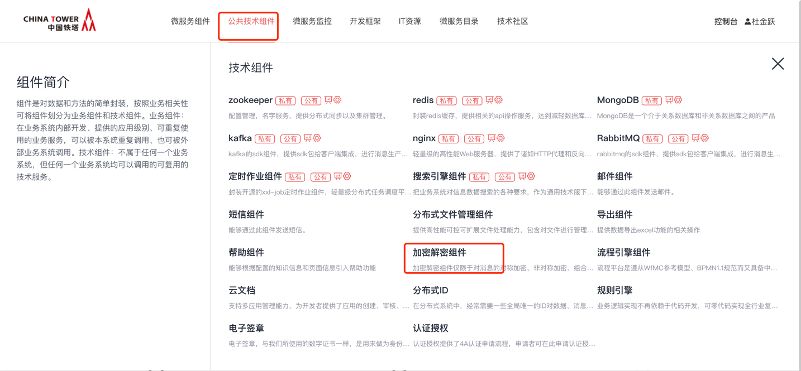
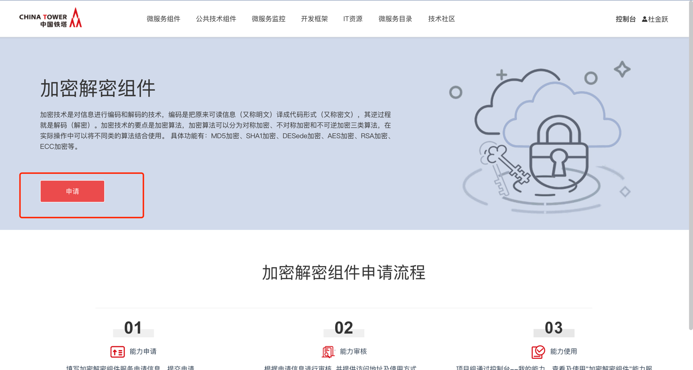
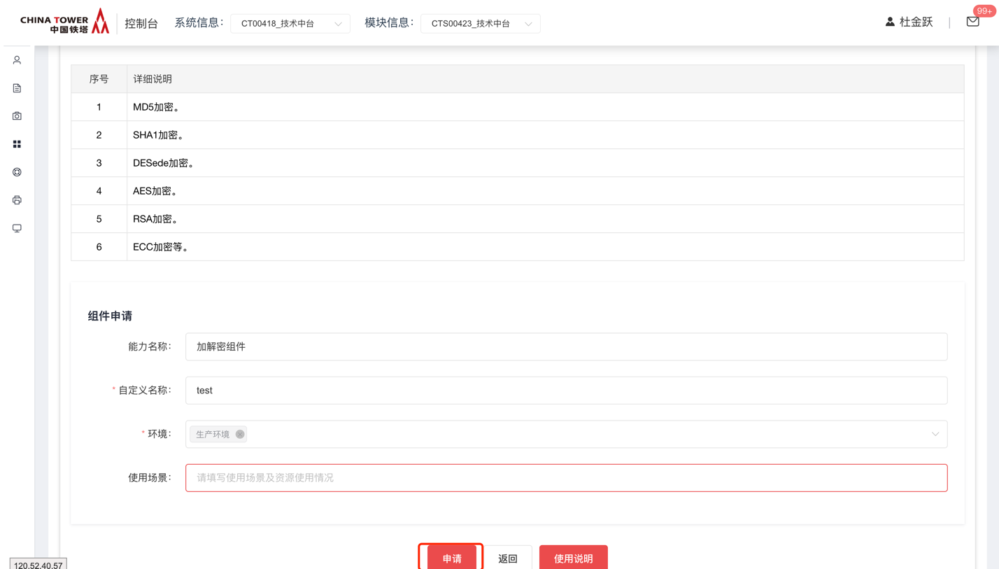

# 加密解密组件

## 功能发布记录

| 版本 | 拟制/修改日期 | 拟制/修改人 | 修改记录 | 批准人 |
| ---- | ------------- | ----------- | -------- | ------ |
| 1.0  | 2019/6/12     | 郝世崇      | 初版     |        |
|      |               |             |          |        |

## 重要通知

无

## 组件描述

### 1.1背景

铁塔大部分应用都是互联网应用，可以直接外网访问，对系统安全性要求就要很高。为了保证平台本身的安全，同时也为对上层应用提供更好的安全支撑，除了从服务器端采取措施防止网络攻击外，各系统也要保证数据的安全。

### 1.2 术语定义

| 序号 | 简称/术语 | 说明                                                         |
| ---- | --------- | ------------------------------------------------------------ |
| 1    | 明文      | 指没有加密的文字（或者字符串），一般人都能看懂的意思，属于密码术语 |
| 2    | 密文      | 对明文进行加密后的报文                                       |
| 3    | 密钥      | 在明文转换为密文或将密文转换为明文的算法中输入的参数         |

### 1.3 参考资料

| 序号 | 文档名称                               | 最后修订时间 | 版本号 | 来源         |
| ---- | -------------------------------------- | ------------ | ------ | ------------ |
| 1    | 中国铁塔IT系统技术架构总体规划（总册） | 2017/05/05   | 1.0    | 铁塔内部资料 |

### 1.4 变更履历

| 变更日期   | 变更页次    | 变更后内容                | 版本号 | 修订人 | 批准人 |
| ---------- | ----------- | ------------------------- | ------ | ------ | ------ |
| 2020.06.28 | 1.5适用范围 | 增加了1.5适用范围         | 1.0    | 杨稳   |        |
| 2024.06.11 |             | 增加了国密 SM4 加解密方法 | 1.8.0  |        |        |

### 1.5 使用范围

加密解密组件仅限于对消息的对称加密、非对称加密、组合加密和不可逆加密，不参与业务处理。针对数据交互以及数据传递场景下使用，可以保证数据的安全性以及可靠性。

| 序号 | 类别       | 能力描述                                                     | 是否支持加密 | 是否支持解密 |
| ---- | ---------- | ------------------------------------------------------------ | ------------ | ------------ |
| 1    | 对称加密   | 支持3DES和AES对称算法，加密和解密使用相同密钥算法公开、计算量小、加密速度快、机密效率高 | 是           | 是           |
| 2    | 非对称加密 | 支持RSA和ECC非对称算法，密钥分为私钥和公钥，通讯双方分别持有自己的私钥和对方的公钥，数据，数据安全性更稳定 | 是           | 是           |
| 3    | 不可逆加密 | 支持MD5和SHA-1不可逆算法，加密过程中不需要使用密钥，输入明文后由系统直接加密算法处理成密文，适用数据存储等环境 | 是           | 否           |
| 4    | 组合加密   | 支持加密算法自由组合，方便数据传输  加密速度快，保密度高     |              |              |

铁塔大部分应用都是互联网应用，可以直接外网访问，对系统安全性要求就要很高。为了保证平台本身的安全，同时也为对上层应用提供更好的安全支撑，除了从服务器端采取措施防止网络攻击外，各系统也要保证数据的安全。

加密技术是对信息进行编码和解码的技术，编码是把原来可读信息（又称明文）译成代码形式（又称密文），其逆过程就是解码（解密）。加密技术的要点是加密算法，加密算法可以分为对称加密、不对称加密和不可逆加密三类算法，在实际操作中可以将不同类的算法结合使用。

## 快速入门

进入技术中台，选择公共技术组件 → 加密解密组件

点击 【申请】，填写自定义名称、选择环境，点击申请，等待运营人员审批







## 操作指南

### 2.1.2 环境要求

Jdk在1.6以上

### 2.1.3 功能清单

#### 2.1.3.1 MD5加密功能

SDK接口，面向开发者提供基于MD5的加密方法。业务系统传递数据（content），可通过配置文件决定加密算法的salt与轮询次数，并将密文返回给业务系统。

请求地址

| 接口类型 | SDK                  |
| -------- | -------------------- |
| 接口地址 | MD5Util. encrypt/[K] |

请求参数

| 参数名称 | 说明 | 约束 | 类型   | 备注 |
| -------- | ---- | ---- | ------ | ---- |
| Content  | 明文 | 必填 | String |      |

响应参数

| 参数名称 | 说明      | 类型   | 备注                          |
| -------- | --------- | ------ | ----------------------------- |
| flag     | 成功/失败 | String | 枚举值可参见7.7.1出错信息描述 |
| result   | 密文      | String |                               |
| desc     | 描述      |        |                               |

#### 2.1.3.2 MD5校验功能

SDK接口，面向开发者提供基于MD5的校验方法。业务系统传递明文数据（content）与密文数据(data)，可通过配置文件决定加密算法的salt与轮询次数，并将校验结果返回给业务系统。

请求地址

| 接口类型 | SDK                |
| -------- | ------------------ |
| 接口地址 | MD5Util. valid/[K] |

请求参数

| 参数列表 | 约束 | 说明 | 类型   | 备注 |
| -------- | ---- | ---- | ------ | ---- |
| Content  | 必填 | 明文 | String |      |
| Data     | 必填 | 密文 | String |      |

响应参数

| 参数列表 | 说明 | 类型    | 备注 |
| -------- | ---- | ------- | ---- |
| Flag     | 标识 | String  |      |
| Data     | 密文 | boolean |      |
| Desc     | 描述 | String  |      |

#### 2.1.3.3 SHA1加密功能

SDK接口，面向开发者提供基于SHA1的加密方法。业务系统传递数据（content），可通过配置文件决定加密算法的salt与轮询次数，并将密文返回给业务系统。

请求地址

| 接口类型 | SDK                  |
| -------- | -------------------- |
| 接口地址 | SHAUtil. encrypt/[K] |

请求参数

| 参数列表 | 约束 | 说明 | 类型   | 备注 |
| -------- | ---- | ---- | ------ | ---- |
| Content  | 必填 | 明文 | String |      |

响应参数

| 参数列表 | 说明 | 类型   | 备注 |
| -------- | ---- | ------ | ---- |
| Flag     | 标识 | String |      |
| Data     | 密文 | String |      |
| Desc     | 描述 | String |      |

#### 2.1.3.4 SHA1校验功能

SDK接口，面向开发者提供基于SHA1的校验方法。业务系统传递明文数据（content）与密文数据(data)，可通过配置文件决定加密算法的salt与轮询次数，并将校验结果返回给业务系统。

请求地址

| 接口类型 | SDK                |
| -------- | ------------------ |
| 接口地址 | SHAUtil. valid/[K] |

请求参数

| 参数列表 | 约束 | 说明 | 类型   | 备注 |
| -------- | ---- | ---- | ------ | ---- |
| Content  | 必填 | 明文 | String |      |
| Data     | 必填 | 密文 | String |      |

响应参数

| 参数列表 | 说明 | 类型    | 备注 |
| -------- | ---- | ------- | ---- |
| Flag     | 标识 | String  |      |
| Data     | 密文 | boolean |      |
| Desc     | 描述 | String  |      |

#### 2.1.3.5 DESede加密功能

SDK接口，面向开发者提供基于DESede的加密方法。业务系统传递数据（content），密钥安全级别(level)，偏移量（offset），可通过配置文件决定加密算法的填充方式，并将密文返回给业务系统。

请求地址

| 接口类型 | SDK                    |
| -------- | ---------------------- |
| 接口地址 | DESedeUtil.encrypt/[K] |

请求参数

| 参数列表 | 约束 | 说明         | 类型    | 备注             |
| -------- | ---- | ------------ | ------- | ---------------- |
| Content  | 必填 | 密文         | String  |                  |
| Level    |      | 密钥安全级别 | Enum    | LOW,HIGH         |
| Offset   |      | 偏移量       | Boolean | True为添加偏移量 |

响应参数

| 参数列表 | 说明   | 类型   | 备注 |
| -------- | ------ | ------ | ---- |
| Flag     | 标识   | String |      |
| Data     | 密文   | String |      |
| Key      | 密钥   | String |      |
| Iv       | 偏移量 | String |      |
| Desc     | 描述   | String |      |

#### 2.1.3.6 DESede解密功能

SDK接口，面向开发者提供基于DESede的解密方法。业务系统传递数据（content），密钥（key），偏移量（offset），并将明文返回给业务系统。

请求地址

| 接口类型 | SDK                    |
| -------- | ---------------------- |
| 接口地址 | DESedeUtil.decrypt/[K] |

请求参数

| 参数列表 | 约束 | 说明   | 类型   | 备注 |
| -------- | ---- | ------ | ------ | ---- |
| Content  | 必填 | 密文   | String |      |
| Key      | 必填 | 密钥   | String |      |
| Offset   |      | 偏移量 | String |      |

响应参数

| 参数列表 | 说明 | 类型   | 备注 |
| -------- | ---- | ------ | ---- |
| Flag     | 标识 | String |      |
| Context  | 明文 | String |      |
| Desc     | 描述 | String |      |

#### 2.1.3.7 AES加密能力

SDK接口，面向开发者提供基于AES的加密方法。业务系统传递数据（content），密钥安全级别(level)，偏移量（offset），可通过配置文件决定加密算法的填充方式，并将密文返回给业务系统。

请求地址

| 接口类型 | SDK                 |
| -------- | ------------------- |
| 接口地址 | AESUtil.encrypt/[K] |

请求参数

| 参数列表 | 约束 | 说明         | 类型    | 备注             |
| -------- | ---- | ------------ | ------- | ---------------- |
| Content  | 必填 | 密文         | String  |                  |
| Level    |      | 密钥安全级别 | Enum    | LOW,MID,HIGH     |
| Offset   |      | 偏移量       | Boolean | True为添加偏移量 |

响应参数

| 参数列表 | 说明   | 类型   | 备注 |
| -------- | ------ | ------ | ---- |
| Flag     | 标识   | String |      |
| Data     | 密文   | String |      |
| Key      | 密钥   | String |      |
| Iv       | 偏移量 | String |      |
| Desc     | 描述   | String |      |

#### 2.1.3.8 AES解密能力

SDK接口，面向开发者提供基于AES的解密方法。业务系统传递数据（content），密钥（key），偏移量（offset），并将明文返回给业务系统。

请求地址

| 接口类型 | SDK                 |
| -------- | ------------------- |
| 接口地址 | AESUtil.decrypt/[K] |

请求参数

| 参数列表 | 约束 | 说明   | 类型   | 备注 |
| -------- | ---- | ------ | ------ | ---- |
| Content  | 必填 | 密文   | String |      |
| Key      | 必填 | 密钥   | String |      |
| Offset   |      | 偏移量 | String |      |

响应参数

| 参数列表 | 说明 | 类型   | 备注 |
| -------- | ---- | ------ | ---- |
| Flag     | 标识 | String |      |
| Context  | 明文 | String |      |
| Desc     | 描述 | String |      |

#### 2.1.3.9 获取RSA密钥能力

SDK接口，面向开发者提供基于RSA的密钥。业务系统传递密钥安全级别(level)，并将密钥返回给业务系统。

请求地址

| 接口类型 | SDK                     |
| -------- | ----------------------- |
| 接口地址 | RSAUtil. genKeyPair/[K] |

请求参数

| 接口类型 | sdk  |              |      |           |
| -------- | ---- | ------------ | ---- | --------- |
| 参数列表 | 约束 | 说明         | 类型 | 备注      |
| Level    |      | 密钥安全级别 | Enum | LOW、HIGH |

响应参数

| 参数列表   | 说明 | 类型   | 备注 |
| ---------- | ---- | ------ | ---- |
| Flag       | 标识 | String |      |
| publicKey  | 公钥 | String |      |
| privateKey | 私钥 | String |      |
| Desc       | 描述 | String |      |

#### 2.1.3.10 RSA加密能力

SDK接口，面向开发者提供基于RSA的加密方法。业务系统传递数据（content），接收方公钥（publicKey），发送方私钥（privateKey），并将密文返回给业务系统。

请求地址

| 接口类型 | SDK                  |
| -------- | -------------------- |
| 接口地址 | RSAUtil. encrypt/[K] |

请求参数

| 接口类型   | sdk  |            |        |      |
| ---------- | ---- | ---------- | ------ | ---- |
| 参数列表   | 约束 | 说明       | 类型   | 备注 |
| Content    | 必填 | 密文       | String |      |
| publicKey  | 必填 | 接收方公钥 | String |      |
| privateKey | 必填 | 发送方私钥 | String |      |

响应参数

| 参数列表 | 说明     | 类型   | 备注 |
| -------- | -------- | ------ | ---- |
| Flag     | 标识     | String |      |
| Data     | 密文     | String |      |
| signData | 密文签名 | String |      |
| Desc     | 描述     | String |      |

#### 2.1.3.11 RSA解密能力

SDK接口，面向开发者提供基于RSA的解密方法。业务系统传递数据（content），接收方私钥（privateKey），密文签名（signData），发送方公钥（publicKey），并将明文返回给业务系统。

请求地址

| 接口类型 | SDK                  |
| -------- | -------------------- |
| 接口地址 | RSAUtil. decrypt/[K] |

请求参数

| 参数列表   | 约束 | 说明       | 类型   | 备注 |
| ---------- | ---- | ---------- | ------ | ---- |
| Content    | 必填 | 密文       | String |      |
| privateKey | 必填 | 接收方私钥 | String |      |
| SignData   | 必填 | 密文签名   | String |      |
| publicKey  | 必填 | 发送方公钥 | String |      |

响应参数

| 参数列表 | 说明 | 类型   | 备注 |
| -------- | ---- | ------ | ---- |
| Flag     | 标识 | String |      |
| Context  | 明文 | String |      |
| Desc     | 描述 | String |      |

#### 2.1.3.12 获取ECC密钥能力

SDK接口，面向开发者提供基于ECC的密钥。业务系统申请ECC密钥，组件将密钥返回给业务系统。

请求地址

| 接口类型 | SDK                     |
| -------- | ----------------------- |
| 接口地址 | ECCUtil. getKeyPair/[K] |

请求参数

内嵌椭圆算法推荐曲线参数

响应参数

| 参数列表   | 说明 | 类型   | 备注 |
| ---------- | ---- | ------ | ---- |
| Flag       | 标识 | String |      |
| publicKey  | 公钥 | String |      |
| privateKey | 私钥 | String |      |
| Desc       | 描述 | String |      |

#### 2.1.3.13 ECC加密能力

SDK接口，面向开发者提供基于ECC的加密方法。业务系统传递数据（content），接收方公钥（publicKey），发送方私钥（privateKey），并将密文返回给业务系统。

请求地址

| 接口类型 | SDK                 |
| -------- | ------------------- |
| 接口地址 | ECCUtil.encrypt/[K] |

请求参数

| 参数列表   | 约束 | 说明       | 类型   | 备注 |
| ---------- | ---- | ---------- | ------ | ---- |
| Content    | 必填 | 密文       | String |      |
| publicKey  | 必填 | 接收方公钥 | String |      |
| privateKey | 必填 | 发送方私钥 | String |      |

响应参数

| 参数列表 | 说明     | 类型   | 备注 |
| -------- | -------- | ------ | ---- |
| Flag     | 标识     | String |      |
| Data     | 密文     | String |      |
| signData | 密文签名 | String |      |
| Desc     | 描述     | String |      |

#### 2.1.3.14 ECC解密能力

SDK接口，面向开发者提供基于ECC的解密方法。业务系统传递数据（content），接收方私钥（privateKey），密文签名（signData），发送方公钥（publicKey），并将明文返回给业务系统。

请求地址

| 接口类型 | SDK                 |
| -------- | ------------------- |
| 接口地址 | ECCUtil.decrypt/[K] |

请求参数

| 参数列表   | 约束 | 说明       | 类型   | 备注 |
| ---------- | ---- | ---------- | ------ | ---- |
| Content    | 必填 | 密文       | String |      |
| privateKey | 必填 | 接收方私钥 | String |      |
| SignData   | 必填 | 密文签名   | String |      |
| publicKey  | 必填 | 发送方公钥 | String |      |

响应参数

| 参数列表 | 说明 | 类型   | 备注 |
| -------- | ---- | ------ | ---- |
| Flag     | 标识 | String |      |
| Context  | 明文 | String |      |
| Desc     | 描述 | String |      |

#### 2.1.3.15 国密 SM4 加密方法（ECB 模式）【v1.8.0】

SDK接口，通过密钥将明文进行加密。

- 在 ECB 模式中，每个数据块独立加密，相同的明文块将产生相同的密文块。
- 优点是并行处理能力强，因为它可以同时加密多个块，而不需要等待前一个块的加密完成。
- 通常不推荐用于需要高安全性的场景，因为它不能很好地隐藏数据模式。
- 普通字符串密钥指的是直接以字符形式提供的密钥，它将按照字符的原始编码(如utf-8)来表示。
- 当密钥是普通字符串，它将首先被转换为字节序列，这个字节序列将直接用于加密算法中，而不需要进行16 进制到字节的转换。
- 当密钥为16进制字符串时，需要将其转换为原始的字节序列才能用于加密或解密过程。

请求地址

| 接口类型 | SDK                                                          |
| -------- | ------------------------------------------------------------ |
| 接口地址 | SM4Util.encryptData_ECB(String plainText, String secretKey, boolean hexString); |

请求参数

| 参数列表  | 约束 | 说明                       | 类型    | 备注                                                         |
| --------- | ---- | -------------------------- | ------- | ------------------------------------------------------------ |
| plainText | 必填 | 明文                       | String  |                                                              |
| secretKey | 必填 | 密钥                       | String  |                                                              |
| hexString | 必填 | 密钥是否为 16 进制的字符串 | boolean | hexString 为 true 时，secretKey 必须为16进制字符串(长度需为 32 位)。 hexString 为 false 时，secretKey 必须为普通字符串(16 位的随机字符串)。 |

响应参数

| 参数列表 | 说明 | 类型   | 备注          |
| -------- | ---- | ------ | ------------- |
| flag     | 标识 | String | 000000 - 成功 |
| data     | 数据 | String | 密文          |
| desc     | 描述 | String | 成功          |

#### 2.1.3.16 国密 SM4 解密方法（ECB 模式）【v1.8.0】

SDK接口，通过密钥将密文进行解密。

请求地址

| 接口类型 | SDK                                                          |
| -------- | ------------------------------------------------------------ |
| 接口地址 | SM4Util.decryptData_ECB(String cipherText, String secretKey, boolean hexString) |

请求参数

| 参数列表   | 约束 | 说明                       | 类型    | 备注                                                         |
| ---------- | ---- | -------------------------- | ------- | ------------------------------------------------------------ |
| cipherText | 必填 | 密文                       | String  |                                                              |
| secretKey  | 必填 | 密钥                       | String  |                                                              |
| hexString  | 必填 | 密钥是否为 16 进制的字符串 | boolean | hexString 为 true 时，secretKey 必须为16进制字符串(长度需为 32 位)。 hexString 为 false 时，secretKey 必须为普通字符串(16 位的随机字符串)。 |

响应参数

| 参数列表 | 说明 | 类型   | 备注          |
| -------- | ---- | ------ | ------------- |
| flag     | 标识 | String | 000000 - 成功 |
| data     | 数据 | String | 明文          |
| desc     | 描述 | String | 成功          |

#### 2.1.3.17 国密 SM4 加密方法（CBC 模式）【v1.8.0】

SDK接口，通过密钥将明文进行加密。

- 在 CBC模式中，每个数据块的加密依赖于前一个块的加密结果。第一个块使用初始化向量（IV）进行加密，后续每个块使用前一个块的加密结果作为输入进行加密。
- 优点是它隐藏了明文的模式，即使明文中有重复的模式，它们在密文中也不会表现出来，从而提高了安全性。
- 为了安全性，CBC模式通常需要一个随机生成的初始化向量（IV），并且这个IV通常与密文一起传输，接收方需要知道IV才能正确解密数据。

请求地址

| 接口类型 | SDK                                                          |
| -------- | ------------------------------------------------------------ |
| 接口地址 | SM4Util.encryptData_CBC(String plainText, String secretKey, String iv, boolean hexString) |

请求参数

| 参数列表  | 约束 | 说明                       | 类型    | 备注                                                         |
| --------- | ---- | -------------------------- | ------- | ------------------------------------------------------------ |
| plainText | 必填 | 明文                       | String  |                                                              |
| secretKey | 必填 | 密钥                       | String  |                                                              |
| iv        | 必填 | 初始化向量                 | String  |                                                              |
| hexString | 必填 | 密钥是否为 16 进制的字符串 | boolean | hexString 为 true 时，secretKey, iv 必须为16进制字符串(长度需为 32 位)。 hexString 为 false 时，secretKey, iv 必须为普通字符串(16 位的随机字符串)。 |

响应参数

| 参数列表 | 说明 | 类型   | 备注          |
| -------- | ---- | ------ | ------------- |
| flag     | 标识 | String | 000000 - 成功 |
| data     | 数据 | String | 密文          |
| desc     | 描述 | String | 成功          |

#### 2.1.3.18 国密 SM4 解密方法（CBC 模式）【v1.8.0】

SDK接口，通过密钥将密文进行解密。

请求地址

| 接口类型 | SDK                                                          |
| -------- | ------------------------------------------------------------ |
| 接口地址 | SM4Util.decryptData_CBC(String cipherText, String secretKey, String iv, boolean hexString); |

请求参数

| 参数列表   | 约束 | 说明                       | 类型    | 备注                                                         |
| ---------- | ---- | -------------------------- | ------- | ------------------------------------------------------------ |
| cipherText | 必填 | 密文                       | String  |                                                              |
| secretKey  | 必填 | 密钥                       | String  |                                                              |
| iv         | 必填 | 初始化向量                 | String  |                                                              |
| hexString  | 必填 | 密钥是否为 16 进制的字符串 | boolean | hexString 为 true 时，secretKey, iv 必须为16进制字符串(长度需为 32 位)。 hexString 为 false 时，secretKey, iv 必须为普通字符串(16 位的随机字符串)。 |

响应参数

| 参数列表 | 说明 | 类型   | 备注          |
| -------- | ---- | ------ | ------------- |
| flag     | 标识 | String | 000000 - 成功 |
| data     | 数据 | String | 明文          |
| desc     | 描述 | String | 成功          |

### 2.1.4 集成说明

#### 2.1.4.1 集成说明

加密解密是面向开发者使用SDK集成的技术组件。要求开发者在项目中引入该组件所生成的jar包。

#### 2.1.4.2 集成规范

在pom文件中：

```xml
<dependency>
    <groupId>com.chinatower</groupId>
    <artifactId>chinatower-encrypt</artifactId>
    <version>1.0</version>
</dependency>
```

在入口类中加注解：

```java
@ComponentScan({"com.chinatower.encrypt"})
```


## 典型实践

无

## API参考

无

## SDK

- v1.0

```xml
<dependency>
    <groupId>com.chinatower</groupId>
    <artifactId>chinatower-encrypt</artifactId>
    <version>1.0</version>
</dependency>
```

- v1.8.0

```xml
<dependency>
    <groupId>com.chinatower</groupId>
    <artifactId>chinatower-encrypt</artifactId>
    <version>1.8.0</version>
</dependency>
```

## 网络要求

无

## 常见问题

无

## 样例文件

 [加解密组件demo.zip](../file/加解密组件demo.zip) 

 [加解密组件_v1.8.0.zip](../file/加解密组件_v1.8.0.zip) 

