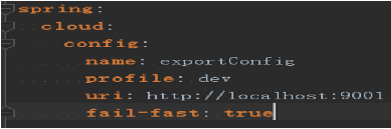
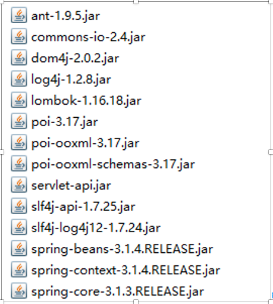

# 导出组件

## 功能发布记录

| 版本 | 拟制/修改日期 | 拟制/修改人 | 修改记录      | 批准人 |
| ---- | ------------- | ----------- | ------------- | ------ |
| 1.0  | 2021/10/10    |             | 初版          |        |
| 1.1  | 2023/05/17    | 陈孔林      | easyExcel加入 |        |

## 重要通知

无

## 组件描述

easyExcel版的导出更轻量化，配置极简，且在内存方面有更优秀的表现。easyExcel基于sax(逐行扫描，边扫描，边解析)模式进行读写数据，不会出现oom情况，程序有过高并发场景的验证，因此程序运行比较稳定，相对于 SXSSFWorkbook来说，读写性能稍慢！

poi版本导出则支持更好的定制表格，对定制化的导出支持非常的丰富。如果当前的项目需求，并发量不大、数据量也不大，但是需要导出 excel 的文件样式千差万别，那么推荐用 SXSSFWorkbook。反之，使用 easyExcel。

### 适用范围

| 序号 | 能力描述                                                     | POI是否支持 | easyExcel是否支持 |
| ---- | ------------------------------------------------------------ | ----------- | ----------------- |
| 1    | 导出文件类型均为excel文件                                    | 是          | 是                |
| 2    | 导出文件格式均为xlsx（excel2007版）                          | 是          | 是                |
| 3    | 模板导出                                                     | 是          | 否                |
| 4    | 异步导出                                                     | 是          | 是                |
| 5    | 单表头，多表头的导出                                         | 是          | 是                |
| 6    | 多sheet页导出                                                | 是          | 是                |
| 7    | 对数据库数据进行分页                                         | 是          | 是                |
| 8    | 异步导出进行文件压缩，压缩格式为zip                          | 是          | 否                |
| 9    | 可配置设置表头和数据的样式                                   | 是          | 否                |
| 10   | 自定义设置表头的样式                                         | 是          | 否                |
| 11   | 异步导出文件查询                                             | 是          | 否                |
| 12   | 异步导出文件下载                                             | 是          | 否                |
| 13   | wps文件类型的导出                                            | 否          | 否                |
| 14   | 复杂的数据校验                                               | 否          | 否                |
| 15   | 竖行表头的导出                                               | 否          | 否                |
| 16   | 复杂的表格导出（嵌套表格，嵌套图表等，嵌套图片，嵌套文件等） | 否          | 否                |
| 17   | 表头不是从 默认的第一行第一格开始的，数据和表头之间有隔开的导出 | 否          | 否                |

## 快速入门

无

## 操作指南

### 环境要求

> 导出组件以SDK的方式集成在各个业务系统上
>
> POI最低支持JDK1.6的java环境
>
> easyExcel最低支持JDK1.8的java环境，且要求项目为spring项目

### 功能清单

POI功能清单

| 序号 | 功能名称 | 详细说明                                                     |
| ---- | -------- | ------------------------------------------------------------ |
| 1    | 自导出   | 自导出分多表头导出和单表头导出。通过读取配置，创建空excel文件，根据表头映射配置设置表头，分页读取数据库数据分sheet页写入，并将excel文件输出出来 |
| 2    | 模板导出 | 通过读取配置以及模板，创建带表头的excel文件，分页读取数据库数据分sheet页写入，并将excel文件输出出来 |
| 3    | 异步导出 | 异步导出分excel文件导出和zip压缩文件导出。通过前台触发异步导出任务，后台异步执行导出任务，将文件输出在固定路径下，同时回调业务系统，告知异步文件路径，同时提供查询和下载文件的方法 |

easyExcel功能清单

| 序号 | 功能名称 | 详细说明                                                     |
| ---- | -------- | ------------------------------------------------------------ |
| 1    | 自导出   | 自导出分多表头导出和单表头导出。通过读取配置，创建空excel文件，根据表头配置设置表头，分页读取数据库数据分sheet页写入，并将excel文件输出出来 |
| 2    | 异步导出 | 异步导出分excel文件导。通过触发异步导出任务，后台异步执行导出任务，将文件输出在固定路径下 |

### 服务环境信息

> 无（导出组件以SDK的方式集成在各个业务系统上）

### SDK集成说明

导出组件是通过SDK的方式引入集成在业务系统的应用中。

POI集成说明

```
下载最新jar包：http://120.52.99.112:8081/repository/chinatower-component-snapshots/com/chinatower/excelExport/excelExport/2.0.2/

或者maven集成（访问铁塔私服）

私服地址配置：

依赖配置：
```

easyExcel集成说明

```
通过maven集成（访问铁塔私服）
```

#### 配置说明

easyExcel无需配置，下方均为POI配置

主配置：

微服务或者单体应用：

exportConfig.properties 放置于src或者resource下，或者classpath下，或者通过System.setProperty("export.configure", "file:conf/exportConfig.properties");方式指定。

微服务（从配置中心读取配置）：

exportConfig-${profile}.properties放置于配置中心,

通过以下配置从配置中心读取



映射配置：

以XML文件的方式配置表头配置，文件可自定义路径存放，需要在主配置中对应的业务导出配置中指明。

模板文件：

用xlsx格式的excel模板（即2007版及其之后的excel）。

公共配置：

```none
#header
#--------------start----------------------
#导出存放相关文件用的目录（建议给足够的空间）
export.file.dir=D:/测试/
```

1. 

   单表头自导出配置说明：

主配置exportConfig.properties中配置

映射配置：test1.xml

```none
<?xml version="1.0" encoding="UTF-8"?>
<header>
	<row id="1" ><!—id是行的唯一标识,从1开始-->
		<columns>
<!—配置每一个字段的映射：id是行的唯一标识,从1开始，name是表头的中文，field是中文对应的数据对象中属性名称，space是指表头占用的空间起始位置{开始行，结束行，开始列，结束列} 从0开始计算）-->
			<column id="1" name="序列" field="id" space="{1,1,0,0}"/>
			<column id="2" name="联系人" field="name" space="{1,1,1,1}"/>
			<column id="3" name="联系方式" field="phone" space="{1,1,2,2}"/>
		</columns>
	</row>
</header>
#单表头，自导出 : 业务配置标识singleHeaderTest
#类型 (20:模板导出，21:自导出)
singleHeaderTest.export.type=21
#导出映射文件所在路径
singleHeaderTest.export.header.mapping.path=D: /测试/test1.xml
#导出数据库分页查询分页大小
singleHeaderTest.export.data.pageSize=10
#导出excel每页sheet页存放的数据的行数
singleHeaderTest.export.sheet.size=10
#导出excel的文件名称前缀（文件名称：前缀_时间戳.xlsx）
singleHeaderTest.export.file.name=测试单表头导出
#导出表头样式（1  浅蓝色; 2  浅灰色; 3  白色  ;4 自定义（自定义需要自己实现CellStyle）;默认值3）
singleHeaderTest.export.headerStyle=2
#导出数据样式（1 白色； 2 灰白相间; 默认值1）
singleHeaderTest.export.dataStyle=2
```

1. 

   多表头自导出配置说明：

主配置exportConfig.properties中配置

```none
#多表头，自导出 : 业务配置标识multipleHeaderTest
#类型 (20:模板导出，21:自导出)
multipleHeaderTest.export.type=21
#导出映射文件所在路径
multipleHeaderTest.export.header.mapping.path=D:/测试/test2.xml
#导出开始写入数据的行，从0开始计数
multipleHeaderTest.export.data.startRow=2
#导出数据库分页查询分页大小
multipleHeaderTest.export.data.pageSize=10
#导出数据库分页查询分页大小
multipleHeaderTest.export.sheet.size=10
#导出excel的文件名称前缀（文件名称：前缀_时间戳.xlsx）
multipleHeaderTest.export.file.name=测试多表头导出
#导出表头样式（1  浅蓝色; 2  浅灰色; 3  白色  ;4 自定义（自定义需要自己实现CellStyle）;默认值3）
multipleHeaderTest.export.headerStyle=1
#导出数据样式（1 白色； 2 灰白相间; 默认值1）
multipleHeaderTest.export.dataStyle=1
```

映射配置：test2.xml

```none
<?xml version="1.0" encoding="UTF-8"?>
<header level="2"><!—level是表头的级别，从1开始计算，1代表单表头，2代表2级表头-->
	<row id="1"><!—id是行的唯一标识,从1开始-->
		<columns>
<!—配置每一个字段的映射：id是行的唯一标识,从1开始，name是表头的中文，field是中文对应的数据对象中属性名称，space是指表头占用的空间起始位置{开始行，结束行，开始列，结束列} 从0开始计算）-->

			<column id="1" name="联系人信息" field="" space="{0,0,0,2}"/>
		</columns>
	</row>
	<row id="2" >
		<columns>
			<column id="1" name="序列" field="id" space="{1,1,0,0}"/>
			<column id="2" name="联系人" field="name" space="{1,1,1,1}"/>
			<column id="3" name="联系方式" field="phone" space="{1,1,2,2}"/>
		</columns>
	</row>
</header>
```

1. 

   模板导出配置说明：

主配置exportConfig.properties中配置

```none
#模板导出 : 业务配置标识templateTest
#类型 (20:模板导出，21:自导出)
templateTest.export.type=20
#导出映射文件所在路径
templateTest.export.header.mapping.path=D:/测试/test3.xml
#导出开始写入数据的行，从0开始计数
templateTest.export.data.startRow=2
#导出数据库分页查询分页大小
templateTest.export.data.pageSize=10
#导出数据库分页查询分页大小
templateTest.export.sheet.size=10
#导出模板所在路径
templateTest.export.template.path=D:/测试/测试导出模板.xlsx
#导出excel的文件名称前缀（文件名称：前缀_时间戳.xlsx）
templateTest.export.file.name=测试模板导出
#导出数据样式（1 白色； 2 灰白相间; 默认值1）
templateTest.export.dataStyle=1
```

映射配置：test3.xml

```none
<?xml version="1.0" encoding="UTF-8"?>
<header>
	<row id="1" ><!—id是行的唯一标识,从1开始-->
		<columns>
<!—配置每一个字段的映射：id是行的唯一标识,从1开始，name是表头的中文，field是中文对应的数据对象中属性名称-->
			<column id="1" name="序列" field="id"/>
			<column id="2" name="联系人" field="name" />
			<column id="3" name="联系方式" field="phone"/>
		</columns>
	</row>
</header>
```

1. 

   异步导出配置说明：

主配置exportConfig.properties中配置

```none
#header
#--------------start----------------------
#导出存放相关文件用的目录
export.file.dir=D:/测试/
#异步导出设置线程池线程数量
export.asynchronous.thread.number=100
#异步导出设置任务池最大数量
export.asynchronous.task.number=1000
#--------------end----------------------
#以上三项配置是异步导出的公共配置项

#异步导出 : 业务配置标识asynchronousTest 需要配置全局的文件夹(多实例需要将路径指向共享磁盘)
#类型（导入/导出）(20:模板导出，21:自导出)
asynchronousTest.export.type=21
#导出映射文件所在路径
asynchronousTest.export.header.mapping.path=D:/测试/test2.xml
#导出开始写入数据的行，从0开始计数
asynchronousTest.export.data.startRow=2
#导出数据库分页查询分页大小
asynchronousTest.export.data.pageSize=10
#导出数据库分页查询分页大小
asynchronousTest.export.sheet.size=10
#导出excel的文件名称前缀（文件名称：前缀_时间戳.xlsx）
asynchronousTest.export.file.name=测试多表头导出
#导出表头样式（1  浅蓝色; 2  浅灰色; 3  白色  ;4 自定义（自定义需要自己实现CellStyle）;默认值3）
asynchronousTest.export.headerStyle=1
#导出数据样式（1 白色； 2 灰白相间; 默认值1）
asynchronousTest.export.dataStyle=1
```

#### 引入说明

##### POI引入说明

将jar包直接放入项目lib中，或者以maven的pom文件引入的方式引入，然后在代码中调用。

1. 首先要在导出业务的service层中实现注册中心的方法，即ExportDataRegister接口。
2. 在对应的service层中的导出方法中做如下引用：

同步的导出引用如下：（自导出，模板导出）

```none
//创建同步导出实例，传入对应的业务标识
ExportManager export = new ExportManager("singleHeaderTest");
//传递参数，创建文件，写入表头和数据
export.writeData("demoService", param,null);
//向请求响应体中写入导出的文件
export.exportExcel(res, req);
```

异步的导出引用如下：

```none
//创建异步导出实例，传入对应的业务标识
AsynchronousExportManager export = AsynchronousExportManager.getInstance();
//创建异步导出任务，将任务放入任务池中，执行异步导出任务
export.exportData(null,userName, "asynchronousTest", "demoService", param, false,"taskId1");
```

同步多sheet页的导出引用如下：（自导出，模板导出）

```none
//创建同步导出实例，传入对应的业务标识
ExportManager export = new ExportManager("singleHeaderTest");
//传递参数，创建文件，写入表头和数据
List<WriteDataInfo> list = new ArrayList<>();
list.add(new WriteDataInfo("sheet1Data", "sheet", new ParamInfo<>(), null, "singleHeaderTest"));
list.add(new WriteDataInfo("sheet2Data", "sheet2", new ParamInfo<>(), null, "singleHeaderTest"));
//向请求响应体中写入导出的文件
export.writeDatas(list);
export.exportExcel(res, req);
```

异步多sheet页的导出引用如下：

```none
//创建异步导出实例，传入对应的业务标识
AsynchronousExportManager export = AsynchronousExportManager.getInstance();
//创建异步导出任务，将任务放入任务池中，执行异步导出任务
List<WriteDataInfo> list = new ArrayList<>();
list.add(new WriteDataInfo("sheet1Data", "sheet", new ParamInfo<>(), null, "singleHeaderTest"));
list.add(new WriteDataInfo("sheet2Data", "sheet2", new ParamInfo<>(), null, "singleHeaderTest"));
instance.exportDatas("test", "singleHeaderTest", "sheet1Data", list, false, "task1");
```

1. 在包扫描配置中加入

单体应用

<context:component-scan base-package="com.chinatower.export.*" />

微服务

@SpringBootApplication(scanBasePackages = "com.*")

或者@ComponentScan(basePackages = "com.chinatower.export")

##### easyExcel引入说明

由maven引入，maven仓库需使用中国铁塔私有maven服务仓库。 将jar包直接放入项目lib中，或者以maven的pom文件引入的方式引入，然后在代码中调用。 实际使用的时候，需要在启动类上加入引用开关

```
@EnableTowerEasyexcel
```

1首先要在导出业务的service层中实现注册中心的方法，即ExportDataRegister接口。 2在对应的service层中的导出方法中做如下引用：

单sheet页同步导出的引用如下

```
String fileName = "/Users/IdeaProjects/easyexcel-demo/exportSingle.xlsx";
ExportWriteExcel.writeData(fileName,User.class,"sheetName","demoDataService", getParam(num));
```

多sheet页同步导出的引用如下

```
String fileName = "/Users/IdeaProjects/easyexcel-demo/exportSingle.xlsx";
List<WriteData> list = new ArrayList<>();
list.add(new WriteData(fileName, User.class, "User", "demoDataService", getParam(num)));
list.add(new WriteData(fileName, Cat.class, "Cat", "demoDataService", getParam(num)));
ExportWriteExcel.writeDatas(list);
```

单sheet页异步导出的引用如下

```
String fileName = "/Users/IdeaProjects/easyexcel-demo/exportSingle.xlsx";
AsynchronousExportWriteExcel.writeData(fileName,User.class,"sheetName","demoDataService", getParam(num));
```

多sheet页异步导出的引用如下

```
String fileName = "/Users/IdeaProjects/easyexcel-demo/exportSingle.xlsx";
List<WriteData> list = new ArrayList<>();
list.add(new WriteData(fileName, User.class, "User", "demoDataService", getParam(num)));
list.add(new WriteData(fileName, Cat.class, "Cat", "demoDataService", getParam(num)));
AsynchronousExportWriteExcel.writeDatas(list);
```

#### 依赖说明

1. 环境依赖说明：

POI导出需要 JDK1.6及以上版本

easyExcel最低支持JDK1.8的java环境，且要求项目为spring项目

1. POI JAR包依赖说明(easyExcel无需关注)：



其中 poi-3.17.jar、poi-ooxml-3.17.jar、poi-ooxml-schemas-3.17.jar、ant-1.9.5.jar不能更换版本；

## 典型实践

无

## API参考

无

## SDK

POI版导出SDK

```none
<dependency>
    <groupId>com.chinatower.excelExport</groupId>
    <artifactId>excelExport</artifactId>
    <version>2.0.2</version>
</dependency>
```

[excelExport-2.0.2.jar](http://mid.chinatowercom.cn:18080/docs/chinatower-component/v1.0/example/excelExport-2.0.2.jar)

easyExcel版导出SDK

```none
<dependency>
    <groupId>com.chinatower.easyexcel</groupId>
    <artifactId>chinatower-easyExcel</artifactId>
    <version>1.0.0</version>
</dependency>
```

[chinatower-easyExcel-1.0.0.jar](http://mid.chinatowercom.cn:18080/docs/chinatower-component/v1.0/example/chinatower-easyExcel-1.0.0.jar)

## 网络要求

无

## 常见问题

无

## 样例文件


POI样例  [excelExport-demo.zip](../file/excelExport-demo.zip) 

easyExcel样例  [easyexcel-demo.zip](../file/easyexcel-demo.zip) 