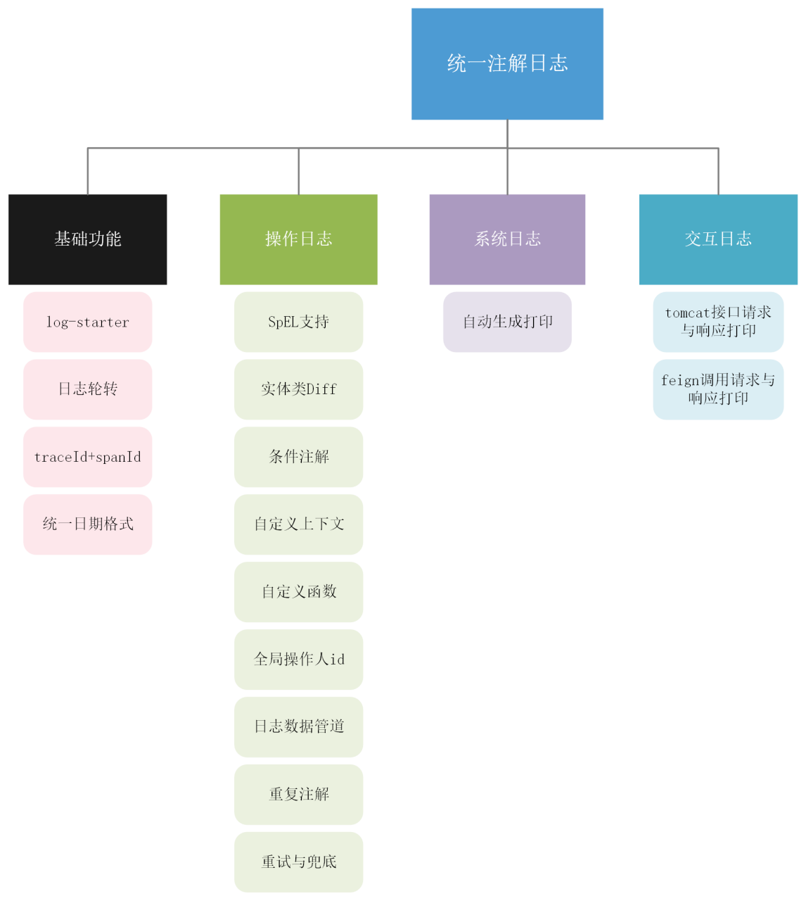
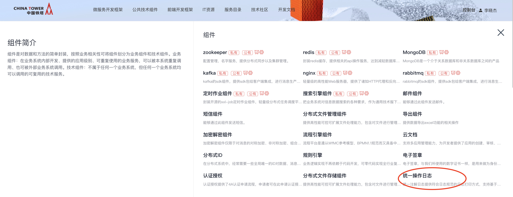
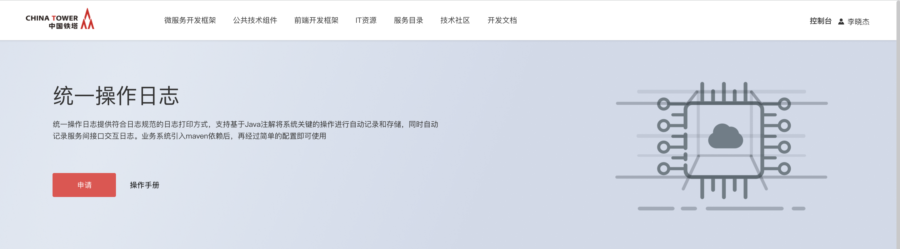
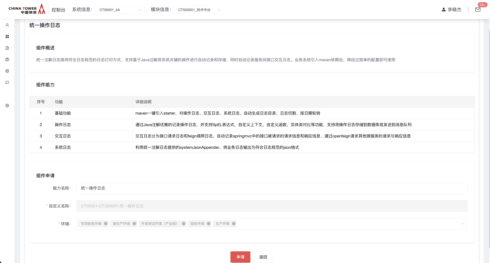

# 统一操作日志

随着业务的发展，微服务系统产生的日志越来越多，在复杂分布式系统中需要统一定义日志打印规范，对日志生成、日志格式提供标准化的解决方案。提高日志可读性可维护性，改善日志分析效率，促进不同系统间沟通与协作。

## 功能发布记录

| 发布时间   | 功能分类 | 功能名称     | 说明                         |
| ---------- | -------- | ------------ | ---------------------------- |
| 2023-07-25 | 新特性   | 统一操作日志 | 新增统一操作日志组件         |
| 2023-09-18 | 新特性   | 统一操作日志 | 操作日志，支持记录操作人姓名 |

## 重要通知

无

## 组件描述

### 简介

统一操作日志提供符合日志规范的日志打印方式，支持基于Java注解将系统关键的操作进行自动记录和存储，同时自动记录服务间接口交互日志。业务系统引入maven依赖后，再经过简单的配置即可使用，提供的功能如下图所示：



### 日志规范

微服务架构系统涉及的日志分为操作日志、系统日志、服务交互日志。**操作日志**指：用户X在X时进行了X操作，操作结果为成功（失败）；**系统日志**指：开发人员添加的打印系统内部关键节点的日志；**服务交互日志**指：跨服务进行访问的请求日志和响应日志。

|      | 日志规范将在标准目录，生成特定的json格式的日志，供日志平台收集。集成统一操作日志SDK后，将自动生成符合日志规范的操作日志、系统日志、服务交互日志，若只关心如何集成和使用，可直接参考[[SDK\]](http://mid.chinatowercom.cn:18080/docs/chinatower-component/v1.0/module/log-record.html#SDK)章节 |
| ---- | ------------------------------------------------------------ |
|      |                                                              |

#### 日志文件名规范

- operation-{yyyy-MM-dd}.log 存放操作日志。
- system-{yyyy-MM-dd}.log存放系统日志。
- transaction-{yyyy-MM-dd}.log存放系统间交互日志。

#### 日志存放路径规范：

统一为/app/logs/{system_code}/{service_name}/{port}/*.log

- system_code为系统编码，各系统应使用架构组最新下发的编码，非ESB编码，可以从主数据系统查看。
- service_name为微服务的服务名，此处具体为spring.applicaiton.name。主要为了支持同主机部署多个微服务的情况。
- port为当前微服务的服务端口，此处具体为server.port。主要为了支持同主机部署同一服务多个副本的情况。

文件规格：每天生成一个新的日志文件并进行压缩, 每个文件最大建议100M, 日志文件保留天数根据实际情况设置，单行日志建议不超过5M。

#### 日志格式规范

操作日志、系统日志、服务交互日志，均遵循基本日志格式规范，统一采用json格式，以下为通用的日志属性：

- date: 日期 采用yyyyMMdd hh:mm:ss.SSS时间格式
- level: 日志级别
- thread: 线程名
- pid: linux进程pid
- class: 类名或者logger的名字
- method: 方法名
- line: 行号
- xb3TraceId: 分布式链路追踪TraceId
- xb3SpanId：分布式链路追踪SpanId
- type：日志类型： 操作日志operation 系统日志system 交互日志 transaction
- message: 日志正文，根据type的不同message的内容不同

#### 操作日志正文格式规范

操作日志message以json字符串进行展示，以下是具体的字段：

- logId：生成的UUID
- bizId：业务唯一ID
- bizType：业务类型
- exception：函数执行失败时写入异常信息
- operateDate：操作执行时间
- success：函数是否执行成功
- msg：日志内容
- tag：自定义标签
- returnStr: 方法执行成功后的返回值字符串
- executionTime：方法执行耗时（单位：毫秒）
- extra：额外信息
- operatorId：操作人ID
- operatorName：操作人姓名
- diffDTOList: 实体类对象对比数据，当使用[实体类对比](http://mid.chinatowercom.cn:18080/docs/chinatower-component/v1.0/module/log-record.html#OBJ_DIFF)功能时该字段有效

示例如下：

```json
{
  "date" : "20230630 14:05:45.984",
  "level" : "INFO",
  "thread" : "http-nio-8877-exec-8",
  "pid" : "93197",
  "class" : "operationLog",
  "method" : "createLog",
  "line" : "14",
  "xb3TraceId" : "a908538905abb6e9",
  "xb3SpanId" : "a908538905abb6e9",
  "type" : "operation",
  "message" : {
    "logId" : "cadfbe40-50e4-426e-92f4-584a2e615c4d",
    "bizId" : "changeUser",
    "bizType" : "user",
    "exception" : null,
    "operateDate" : 1688105145980,
    "success" : true,
    "msg" : "修改用户信息，用户id：1000",
    "tag" : "operation",
    "returnStr" : null,
    "executionTime" : 62,
    "extra" : null,
    "operatorId" : "lisi",
    "operatorName" : "李四",
    "diffDTOList" : []
  }
}
```

#### 系统日志正文格式规范

日志打印规范

- 日志级别：使用适当的日志级别，例如 DEBUG、INFO、WARN 或 ERROR，以便在需要时过滤和分析日志。
- 日志内容：提供有用的信息，例如输入参数、返回值、异常堆栈跟踪等，以便更好地理解日志事件。
- 日志安全：保护敏感信息，例如密码和个人身份信息，以避免泄露。
- 日志可读性：确保日志易于阅读和解释，例如使用正确的字符编码和换行符。

|      | 除了遵循上述规范，业务系统可以选择将系统日志输出为标准json格式，具体步骤参考：[系统日志](http://mid.chinatowercom.cn:18080/docs/chinatower-component/v1.0/module/log-record.html#SYSLOG) |
| ---- | ------------------------------------------------------------ |
|      |                                                              |

一条普通的系统日志，示例如下

```json
{
  "date" : "20230630 13:56:47.288",
  "level" : "INFO",
  "thread" : "http-nio-8877-exec-5",
  "pid" : "93197",
  "class" : "com.chinatower.cloud.examples.logrecord.controller.SystemController",
  "method" : "info",
  "line" : "32",
  "xb3TraceId" : "93faac439d8849f6",
  "xb3SpanId" : "93faac439d8849f6",
  "type" : "system",
  "message" : "systemLog info finish~~~"
}
```

#### 交互日志正文格式规范

交互日志message以json字符串进行展示，以下是具体的字段：

- reqType：req/rsp 请求或者响应
- senderServiceName：发送方微服务服务名
- senderInstanceId：发送方实例id
- servServiceName： 服务端微服务服务名
- servServicePath：服务端接口地址
- msgId：接口请求id 同一次请求 请求日志的msgId应与响应日志的msgId一致
- headers: 请求或响应头
- responseStatus：reqType为rsp时代表HTTP响应状态码
- body：请求报文和响应报文

交互日志，请求示例

```json
{
  "date" : "20230630 13:49:04.075",
  "level" : "INFO",
  "thread" : "http-nio-8877-exec-2",
  "pid" : "93197",
  "class" : "transactionLog",
  "method" : "logRequest",
  "line" : "65",
  "xb3TraceId" : "cc39d6e1832f5afa",
  "xb3SpanId" : "cc39d6e1832f5afa",
  "type" : "transaction",
  "message" : {
    "msgId" : "cc39d6e1832f5afa",
    "reqType" : "REQ",
    "senderSyscode" : "chntjszt-wfwkj",
    "senderServiceName" : "chntlog-record-test",
    "senderInstanceId" : "chntlog-record-test:192.168.10.243:8877",
    "servServiceName" : "chntsentinel-test-old",
    "servServicePath" : "GET /provider",
    "headers" : [ "Sender-Instance-Id: chntlog-record-test:192.168.10.243:8877", "Sender-Service-Name: chntlog-record-test", "Sender-Syscode: chntjszt-wfwkj" ],
    "body" : ""
  }
}
```

交互日志，响应示例

```json
{
  "date" : "20230630 13:49:38.067",
  "level" : "INFO",
  "thread" : "http-nio-8877-exec-2",
  "pid" : "93197",
  "class" : "transactionLog",
  "method" : "logAndRebufferResponse",
  "line" : "111",
  "xb3TraceId" : "cc39d6e1832f5afa",
  "xb3SpanId" : "cc39d6e1832f5afa",
  "type" : "transaction",
  "message" : {
    "msgId" : "cc39d6e1832f5afa",
    "reqType" : "RSP",
    "senderSyscode" : "chntjszt-wfwkj",
    "senderServiceName" : "chntlog-record-test",
    "senderInstanceId" : "chntlog-record-test:192.168.10.243:8877",
    "servServiceName" : "chntsentinel-test-old",
    "servServicePath" : "GET /provider",
    "headers" : [ "connection: keep-alive", "content-type: application/json;charset=UTF-8", "date: Fri, 30 Jun 2023 05:49:38 GMT", "transfer-encoding: chunked" ],
    "body" : "{\"name\":\"zhangsan\"}",
    "responseStatus" : 200
  }
}
```

## 快速入门

### 组件申请

第1步，技术中台首页，公共技术组件中选择"统一操作日志"



第2步，点击申请



第3步，填写详细信息，点击申请即可



## 操作指南

无

## 典型实践

### 性能测试说明

**统一操作日志SDK本身性能瓶颈更依赖于服务器硬盘的性能。**  以一台转速为7200的台式机机械硬盘来说，读取速度一般在110M左右，写入的速度一般都是在90M左右。以本次性能测试的url为例(请求1K，响应0.5K，当然实际业务肯定比这个多)，若只单独考虑硬盘的写入瓶颈，则最大支持60000qps。实际还要考虑到操作系统占用、微服务多副本、云平台虚拟化效率、硬盘物理介质型号等多方位影响因素。

|      | 实际生产上线使用时，可在准生产环境进行压测，观察日志是否正常打印，业务是否稳定运行。 |
| ---- | ------------------------------------------------------------ |
|      |                                                              |

#### 模拟业务占用时间1s

测试url每次调用打印请求和响应报文两条约1.5K。

| 序号 | 并发数 | 持续时间(m) | 吞吐量(qps) | 运行情况                 | 每秒写入磁盘大小 |
| ---- | ------ | ----------- | ----------- | ------------------------ | ---------------- |
| 1    | 10     | 3           | 10          | 运行无异常，日志输出稳定 | 15K              |
| 2    | 20     | 10          | 20          | 运行无异常，日志输出稳定 | 30K              |
| 3    | 30     | 10          | 30          | 运行无异常，日志输出稳定 | 45K              |
| 4    | 50     | 10          | 50          | 运行无异常，日志输出稳定 | 75K              |
| 5    | 100    | 10          | 100         | 运行无异常，日志输出稳定 | 150K             |
| 6    | 120    | 10          | 124         | 运行无异常，日志输出稳定 | 180K             |
| 7    | 130    | 10          | 124         | 运行无异常，日志输出稳定 | 180K             |
| 8    | 150    | 10          | 124         | 运行无异常，日志输出稳定 | 181K             |

#### 模拟业务占用时间3s

| 序号 | 并发数 | 持续时间(m) | 吞吐量(qps) | 运行情况                 | 其他 |
| ---- | ------ | ----------- | ----------- | ------------------------ | ---- |
| 1    | 10     | 10          | 10          | 运行无异常，日志输出稳定 | 15K  |
| 2    | 30     | 10          | 30          | 运行无异常，日志输出稳定 | 45K  |
| 3    | 50     | 10          | 50          | 运行无异常，日志输出稳定 | 75K  |
| 4    | 70     | 10          | 66          | 运行无异常，日志输出稳定 | 100K |
| 5    | 80     | 10          | 66          | 运行无异常，日志输出稳定 | 100K |

## API参考

无

## SDK

首先，在项目的pom.xml中引入如下依赖

```xml
<dependency>
    <groupId>com.chinatower.cloud</groupId>
    <artifactId>spring-cloud-starter-chinatower-log-record</artifactId>
    <version>3.0.6.2</version>
</dependency>
```

第2步，确保syscode正确配置，因为生成日志文件路径依赖于syscode属性，如下所示：

```yaml
spring:
  application:
    name: chntlog-record-test
    syscode: xxxx     # 填写业务系统对应的系统编码
```

第3步，在业务系统的logback配置文件中使用*<include>*标签引入统一操作日志提供的基础配置，如下：

```xml
<?xml version="1.0" encoding="UTF-8"?>
<configuration debug="false">
    <!-- 引入统一操作日志基础配置 -->
    <include resource="logback-logrecord-config.xml"/>
    ....
</configuration>
```

|      | 1. logback-logrecord-config.xml为SDK提供无需业务系统开发人员编写  2.  使用include标签前，确保业务系统的logback配置文件是由spring管理的（不要使用默认的logback.xml文件名），如：文件名为logback-spring.xml或者application.yml配置文件中指定logback配置文件路径，如： |
| ---- | ------------------------------------------------------------ |
|      |                                                              |

```yaml
logging:
  config: classpath:logback-config.xml
```

若项目生成了log_base_dir_IS_UNDEFINED目录，请按上述规则检查logback配置文件的命名

### 基础功能

按照上述3步完成SDK的基本配置后，提供以下的基础功能

- 自动生成符合日志规范的日志目录、日志文件，日志文件自动按日期轮转
- 系统日志、操作日志、交互日志自动打印到标准目录，符合日志规范要求的json格式

可以修改配置，指定日志文件的基础路径，默认为：/app/logs

```yaml
chinatower:
  plugin:
    log-record:
      logBaseDir: /Users/admin/logs
```

### 系统日志

如果希望系统输出的日志为json格式，则可以利用统一操作日志提供的systemJsonAppender，如下示例：

```xml
<?xml version="1.0" encoding="UTF-8"?>
<configuration debug="false">
    <!-- 引入统一操作日志基础配置 -->
    <include resource="logback-logrecord-config.xml"/>

    <!-- 引用系统日志systemJsonAppender，将com.chinatower包相关日志，输出为json格式 -->
    <logger name="com.chinatower" additivity="false" level="INFO">
        <appender-ref ref="systemJsonAppender"/>
    </logger>

</configuration>
```

logger name可根据需要自行指定，上述例子将所有com.chinatower包下的日志输出为json

最终输出的日志，如下所示：

```json
{
  "date" : "20230625 17:25:54.050",
  "level" : "INFO",
  "thread" : "http-nio-8877-exec-2",
  "pid" : "28134",
  "class" : "com.chinatower.cloud.examples.logrecord.controller.SystemController",
  "method" : "info",
  "line" : "31",
  "xb3TraceId" : "7219160d43954b38",
  "xb3SpanId" : "7219160d43954b38",
  "xSpanExport" : "",
  "type" : "system",
  "message" : "system info finish"
}
```

### 操作日志

通过Java注解优雅的记录操作日志，并支持SpEL表达式，自定义上下文，自定义函数，实体类对比等功能，支持将操作日志存储到数据库或发送到消息队列。使用示例：

```java
@OperationLog(bizId = "'changeUser'", bizType = "'user'", msg = "'修改用户信息，用户id：' + #user.id")
public boolean changeUser(User user) {
    log.info("changeUser finish, user: {}", user);
    return true;
}
```

日志最终json格式

```json
{
  "date" : "20230630 10:53:39.556",
  "level" : "INFO",
  "thread" : "http-nio-8877-exec-1",
  "pid" : "72179",
  "class" : "operationLog",
  "method" : "createLog",
  "line" : "14",
  "xb3TraceId" : "070a19a4a95e1310",
  "xb3SpanId" : "070a19a4a95e1310",
  "type" : "operation",
  "message" : {
    "logId" : "3df940c3-01bb-4bd9-b1a8-d5561cfdc38b",
    "bizId" : "changeUser",
    "bizType" : "user",
    "exception" : null,
    "operateDate" : 1688093619551,
    "success" : true,
    "msg" : "修改用户信息，用户id：1000",
    "tag" : "operation",
    "returnStr" : null,
    "executionTime" : 53,
    "extra" : null,
    "operatorId" : "lisi",
    "operatorName" : "李四",
    "diffDTOList" : [ ]
  }
}
```

#### SpEL的使用

*SpEL*是Spring实现的标准的表达式语言，具体的使用可以学习官方文档或者自行搜索资料，可参考以下链接：

- http://itmyhome.com/spring/expressions.html
- https://docs.spring.io/spring-framework/docs/3.0.x/reference/expressions.html

|      | @OperationLog注解中，除了*executeBeforeFunc*和*recordReturnValue*两个*boolean*类型的参数，其他的参数均需要严格遵循*SpEL*表达式语法。 |
| ---- | ------------------------------------------------------------ |
|      |                                                              |

举例来说，*bizType*中我们经常会填入常量，例如订单创建*orderCreate*, 订单修改*orderModify*。 在*SpEL*表达式中，若传入*bizType="orderCreate"*，SpEL会解析失败，因为纯字符串会被认为是一个方法名，导致*SpEL*找不到方法而报错，需要使用*bizType="'orderCreate'"*，才能被正确解析。

#### 内置自定义参数

##### 可以直接使用的自定义参数

- *_return*：原方法的返回值
- *_errorMsg*：原方法的异常信息（*throwable.getMessage()*）

使用示例：

```java
@OperationLog(bizId = "'testDefaultParamReturn'", bizType = "'test'", msg = "#_return")
```

|      | *_return*和*_errorMsg*均为方法执行后才赋值的参数，所以若*executeBeforeFunc=true*（设置为方法执行前执行日志切面），则这两个值为*null*。 |
| ---- | ------------------------------------------------------------ |
|      |                                                              |

#### 根据条件记录日志

@OperationLog注解拥有字段*condition*，用户可以使用SpEL表达式来决定该条日志是否记录。

方法上加上注解：

```java
@OperationLog(bizId = "'condition'", bizType = "'user'", condition = "#user.id != 'admin'", msg = "'修改用户信息，用户id：' + #user.id")
public void condition(User user) {
    log.info("customFunction finish, user: {}", user);
}
```

对于上述方法的调用，只有当入参user的id值不等于admin时，才会记录操作日志

#### 全局操作人信息获取

@OperationLog注解提供*operatorId*字段和*operatorName*，可以设置该操作对应的操作人ID和姓名。有些时候，业务系统希望将操作人ID获取逻辑 放到统一的位置，则只需要实现接口*IOperationLogGetService*，便可以在操作日志中统一注入操作人ID和姓名

```java
@Component
public class IOperatorIdGetServiceImpl implements IOperatorIdGetService {
    @Override
    public String getOperatorId() {
        // 查询操作人信息，可能是从DB中、session中或其他地方获取
        return "lisi";
    }

    @Override
    public String getOperatorName() {
        // 查询操作人信息，可能是从DB中、session中或其他地方获取
        return "李四";
    }
}
```

|      | 若实现了接口后仍在@OperationLog注解手动传入*operatorId*和*operatorName*，则以传入的*operatorId*和*operatorName*优先 |
| ---- | ------------------------------------------------------------ |
|      |                                                              |

#### 自定义上下文

有些时候，操作日志中需要记录的变量需要在方法中查询后才能获取，入参里一般不会包含这些数据。利用自定义上下文，支持在业务方法中手动传递键值对，直接引入类*LogRecordContext*， 调用*putVariable*即可

```java
@OperationLog(bizId = "'customContext'", bizType = "'user'", msg = "'修改用户信息，用户部门：' + #department")
public boolean customContext(User user) {
    LogRecordContext.putVariable("department", "研发部");
    log.info("customContext finish, user: {}", user);
    return true;
}
```

#### 自定义函数

将*@LogRecordFunc*注解声明在需要注册为*SpEL*的自定义函数的类和方法上，在*SpEL*中将能够直接调用自定义函数

|      | 需要在类上也声明*@LogRecordFunc*，否则无法找到该函数。在类上声明的*@LogRecordFunc*可以添加参数*value*，为自定义函数指定统一前缀 |
| ---- | ------------------------------------------------------------ |
|      |                                                              |

自定义函数，分为静态和非静态方法两种声明方式

静态自定义方法写法如下：

```java
/**
 * 静态自定义函数
 * 使用注解的value属性指定函数名前缀为static
 */
@LogRecordFunc("static")
public class StaticFunction {
    /**
     * static方法，最终函数名：static_today
     */
    @LogRecordFunc
    public static String today() {
        SimpleDateFormat format = new SimpleDateFormat("yyyy-MM-dd");
        return format.format(new Date());
    }
}
```

非静态的自定义方法（比如直接调用*Spring*的*Service*）写法如下：

```java
/**
 * Spring Service作为自定义函数
 */
@LogRecordFunc
@Service
public class ServiceFunction {
    /**
     * 最终函数名：uuid
     */
    @LogRecordFunc
    public String uuid() {
        return UUID.randomUUID().toString();
    }

    /**
     * 使用注解的value属性定义函数名，最终函数名：getUser
     */
    @LogRecordFunc("getUser")
    public User user(String id) {
        // 根据id查询用户
        User user = new User();
        user.setId(id);
        user.setName("zhangsan");
        user.setAge(25);
        user.setBirth(new Birth("2000-06-29", "beijing"));
        return user;
    }
}
```

|      | 所有自定义函数可在应用启动时的日志中找到，如果未打印相关日志请排查自定义函数声明是否正确。 |
| ---- | ------------------------------------------------------------ |
|      |                                                              |

```none
2023-06-29 16:33:00.324 [chntlog-record-test,,] [main] INFO  c.c.c.s.logRecord.function.CustomFunctionRegistrar - LogRecord register nonstatic custom function [public java.lang.String com.chinatower.cloud.examples.logrecord.utils.ServiceFunction.uuid()] as name [uuid]
2023-06-29 16:33:00.324 [chntlog-record-test,,] [main] INFO  c.c.c.s.logRecord.function.CustomFunctionRegistrar - LogRecord register nonstatic custom function [public com.chinatower.cloud.examples.logrecord.model.User com.chinatower.cloud.examples.logrecord.utils.ServiceFunction.user(java.lang.String)] as name [getUser]
2023-06-29 16:33:00.324 [chntlog-record-test,,] [main] INFO  c.c.c.s.logRecord.function.CustomFunctionRegistrar - LogRecord register static custom function [public static java.lang.String com.chinatower.cloud.examples.logrecord.utils.StaticFunction.today()] as name [static_today]
```

自定义函数，使用示例

```java
@OperationLog(bizId = "'customFunction'", bizType = "'user'", msg = "'修改用户信息，用户生日：' + #getUser(#user.id).birth.date + ', 当前时间：' + #static_today()")
public void customFunction(User user) {
    log.info("customFunction finish, user: {}", user);
}
```

*msg*中使用了两个自定义函数，最终msg的结果为：修改用户信息，用户生日：2000-06-29, 当前时间：2023-06-29

#### 实体类对比

支持两个对象（相同或者不同的类对象皆可）的属性对比，在@OperationLog注解上，可以通过调用内置实现的自定义函数*_DIFF*，传入两个对象即可触发在操作日志中记录两个对象前后对比信息

```java
@OperationLog(bizId = "'changeUserWithDiff'", bizType = "'user'", msg = "'修改用户信息，用户id：' + #user.id",
            extra = "#_DIFF(#oldUser, #user)", recordReturnValue = true)
public Map<String, Object> changeUserWithDiff(User user) {
    LogRecordContext.putVariable("oldUser", getOldUser(user));
    log.info("changeUserWithDiff finish, user: {}", user);
    return Collections.singletonMap("code", "success");
}
```

最终得到的操作日志消息实体json：

```json
{
	"logId": "27ea47c4-660b-4a83-9399-d761ef010eaf",
	"bizId": "changeUserWithDiff",
	"bizType": "user",
	"exception": null,
	"operateDate": 1688093093360,
	"success": true,
	"msg": "修改用户信息，用户id：admin",
	"tag": "operation",
	"returnStr": "{\"code\":\"success\"}",
	"executionTime": 0,
	"extra": "",
	"operatorId": "lisi",
    "operatorName": "李四",
	"diffDTOList": [{
		"oldClassName": "com.chinatower.cloud.examples.logrecord.model.User",
		"newClassName": "com.chinatower.cloud.examples.logrecord.model.User",
		"newObject": {
			"id": "admin",
			"name": "zhangsan",
			"age": 100,
			"birth": {
				"date": null,
				"city": "beijing"
			}
		},
		"oldObject": {
			"id": "admin",
			"name": "旧名字",
			"age": null,
			"birth": {
				"date": "2023-06-06",
				"city": "beijing"
			}
		}
	}]
}
```

#### 日志处理重试次数及兜底函数配置

操作日志不管是写入到DB还是发送到消息队列，都会存在出现异常的情况，此时就需要进行重试，修改配置如下：

```yaml
chinatower:
  plugin:
    log-record:
      pipeline:
        type: db
        db:
          dbTableName: t_operation_log
      retry:
        retry-times: 3
```

retry-times代表写入db失败时，将最多重试3次，也就是说写入db最多会执行4次

若超过了重试次数依然未成功，业务系统可以通过实现接口 *LogRecordErrorHandlerService* 来进行兜底逻辑处理，接口定义如下：

```java
public interface LogRecordErrorHandlerService {
    /**
     * 数据管道操作日志处理失败处理器
     * 会在日志记录失败后被调用，若配置了重试次数，则超过重试次数后被调用
     */
    void dataPipelineErrorHandler(LogDTO logDTO);
}
```

业务系统可根据自己需要实现接口并注册为Spring bean，下面是一个简单的实现，仅仅打印一条error日志

```java
@Component
public class LogRecordErrorHandlerServiceImpl implements LogRecordErrorHandlerService {
    @Override
    public void dataPipelineErrorHandler(LogDTO logDTO) {
        log.error("data pipeline send log error reached max retryTimes!");
    }
}
```

#### 重复注解

可以在一个方法上同时加多个@OperationLog注解，会保证**按照@OperationLog从上到下的顺序输出操作日志**。

```java
@OperationLog(bizId = "'changeUserRepeatable1'", bizType = "'user'", msg = "'修改用户信息，用户id：' + #user.id")
@OperationLog(bizId = "'changeUserRepeatable2'", bizType = "'user'", msg = "'change user info，user id：' + #user.id")
public boolean changeUserRepeatable(User user) {
    log.info("changeUserRepeatable finish, user: {}", user);
    return true;
}
```

#### 函数返回值记录开关

@OperationLog注解提供布尔值*recordReturnValue()*用于是否开启记录函数返回值，默认关闭，防止返回值实体过大，造成序列化时性能消耗过多。

#### 日志数据管道

根据用户的配置，打印操作日志到文件的同时，支持同时输出到数据库、消息队列中

##### 1 将操作日志保存到数据库中，配置

```yaml
chinatower:
  plugin:
    log-record:
      pipeline:
        type: db
        db:
          dbTableName: t_operation_log
```

type指定为db，同时要求业务系统数据库自行建表，下面是MySQL建表语句，表名根据dbTableName配置可自行定义 NOTE: 打印操作日志时请注意不要超过长度限制，如：操作日志msg不要超过1024长度

```sql
CREATE TABLE `t_operation_log` (
  `id` bigint(20) unsigned NOT NULL AUTO_INCREMENT COMMENT '主键',
  `gmt_create` datetime NOT NULL COMMENT '创建时间',
  `gmt_modified` datetime NOT NULL ON UPDATE CURRENT_TIMESTAMP COMMENT '修改时间',
  `biz_id` varchar(128) NOT NULL COMMENT '业务ID',
  `biz_type` varchar(64) DEFAULT NULL COMMENT '业务类型',
  `tag` varchar(64) DEFAULT NULL COMMENT '标签',
  `operation_date` datetime DEFAULT NULL COMMENT '操作执行时间',
  `msg` varchar(1024) COMMENT '操作内容',
  `operation_status` tinyint(4) DEFAULT NULL COMMENT '操作结果状态',
  `execution_time` int(11) DEFAULT NULL COMMENT '操作耗时',
  `content_return` mediumtext COMMENT '方法返回内容',
  `content_exception` varchar(1024) COMMENT '方法异常内容',
  `operator_id` varchar(32) DEFAULT NULL COMMENT '操作人ID',
  `operator_name` varchar(32) DEFAULT NULL COMMENT '操作人姓名',
  PRIMARY KEY (`id`),
  KEY `idx_biz_id` (`biz_id`)
) ENGINE=InnoDB DEFAULT CHARSET=utf8mb4 COMMENT='操作日志表';
```

##### 2 输出到消息队列

支持将操作日志，以json格式发送到kafka消息队列，如下配置

```yaml
chinatower:
  plugin:
    log-record:
      pipeline:
        type: kafka
        kafka:
          topic-name: topic_LOW_CODE_TEST # 操作日志发送到kafka时的主题名
      retry:
        retry-times: 3                    # 若发送失败，最多重试3次
```

|      | 前提是，正确接入中国铁塔kafka组件，具体接入方式不在本文档讨论范围，可参考对应文档 |
| ---- | ------------------------------------------------------------ |
|      |                                                              |

### 交互日志

交互日志分为接口请求日志和feign调用日志，**接口请求日** 志代表springmvc中的接口被请求的请求信息和响应信息，**feign调用日志** 代表本服务通过openfeign请求 其他微服务的请求与响应信息。

#### 接口请求日志

接口请求日志时默认开启的，/operate/changeUserWithReturn接口请求为例，请求信息，日志记录如下：

```json
{
  "date" : "20230627 15:19:26.981",
  "level" : "INFO",
  "thread" : "http-nio-8877-exec-5",
  "pid" : "90057",
  "class" : "transactionLog",
  "method" : "logRequest",
  "line" : "86",
  "xb3TraceId" : "0ffb3cb7d9f525a1",
  "xb3SpanId" : "0ffb3cb7d9f525a1",
  "type" : "transaction",
  "message" : {
    "msgId" : "0ffb3cb7d9f525a1",
    "reqType" : "REQ",
    "senderServiceName" : "chntlog-record-test",
    "senderInstanceId" : "chntlog-record-test:192.168.10.243:8877",
    "servServiceName" : "chntlog-record-test",
    "servServicePath" : "POST /operate/changeUserWithReturn",
    "headers" : [ "content-type: application/json", "user-agent: PostmanRuntime/7.32.2", "accept: */*", "postman-token: c1e5757e-4a31-4e78-895e-6e8c184ba6bc", "host: localhost:8877", "accept-encoding: gzip, deflate, br", "connection: keep-alive", "content-length: 60" ],
    "body" : "{\"name\":\"zhangsan\"}"
  }
}
```

请求信息，日志记录如下：

```json
{
  "date" : "20230627 15:19:26.981",
  "level" : "INFO",
  "thread" : "http-nio-8877-exec-5",
  "pid" : "90057",
  "class" : "transactionLog",
  "method" : "logResponse",
  "line" : "114",
  "xb3TraceId" : "0ffb3cb7d9f525a1",
  "xb3SpanId" : "0ffb3cb7d9f525a1",
  "type" : "transaction",
  "message" : {
    "msgId" : "0ffb3cb7d9f525a1",
    "reqType" : "RSP",
    "senderServiceName" : "chntlog-record-test",
    "senderInstanceId" : "chntlog-record-test:192.168.10.243:8877",
    "servServiceName" : "chntlog-record-test",
    "servServicePath" : "POST /operate/changeUserWithReturn",
    "headers" : [ "X-test-header: test" ],
    "body" : "{\"name\":\"zhangsan\"}",
    "responseStatus" : 200
  }
}
```

#### feign调用日志

|      | 开启feign调用的交互日志，配置文件中增加如下内容 |
| ---- | ----------------------------------------------- |
|      |                                                 |

```yaml
# 配置所有feign client日志级别为full，将打印最完整请求响应信息：header、请求参数、响应内容等
feign:
  client:
    config:
      default:
        logger-level: full
```

feign调用日志的日志格式和 **接口请求日志** 相同，当通过feign方式访问其他服务时，会自动打印请求和响应日志

## 网络要求

无

## 常见问题

无

## 样例文件

 [spring-cloud-chinatower-log-record-examples.zip](../file/spring-cloud-chinatower-log-record-examples.zip) 
