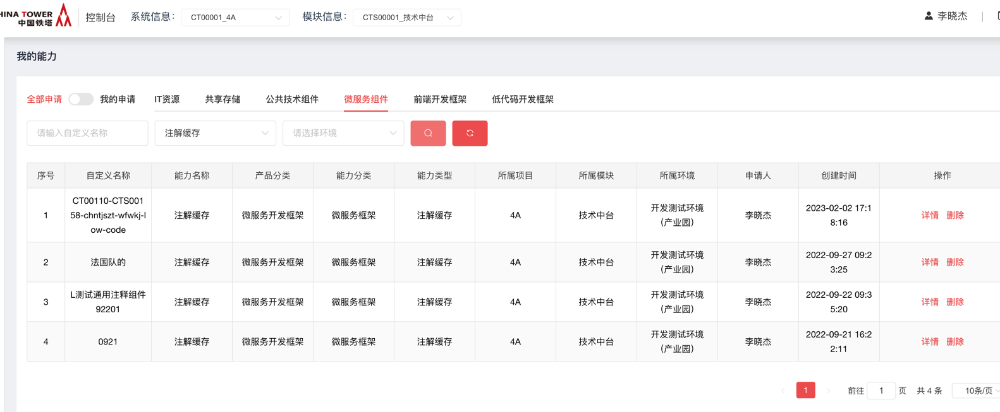

# 通用注解缓存

2022年8月

## 文档控制

### 功能发布记录

| 日期      | 版本 | 变更说明 | 作者   |
| --------- | ---- | -------- | ------ |
| 2022-8-29 | 1.0  | 初始版本 | 陈孔林 |
|           |      |          |        |

### 审阅人

## 重要通知

暂无

## 组件描述

提升铁塔IT开发效率，减少缓存学习时间，简化缓存使用，加快查询速度。对于系统中，访问量高的方法，为避免过于频繁调用数据库影响性能，提供注解缓存支持直接对方法返回值做缓存。用于减轻数据库的访问压力，同时提升应用的性能。典型的有角色菜单树的查询，角色菜单树的变更很少，但是访问量居一个项目的中上游，将其加载到缓存当中，可降低数据库压力。

## 快速入门

仅允许铁塔自有人员申请。

消费者登录技术中台首页，选择微服务组件通用注解缓存组件，点击通用注解缓存组件。


点击申请


根据系统及模块，填写申请单，点击申请即可


## 操作指南

登录技术中台后，选择“我的能力”左侧导航菜单，右侧主内容区域选择“微服务组件”，能力名称为"注解缓存"，操作一栏选择“详情”，即可获取通用注解缓存相关文档。



## 典型实践

详见 [样例文件](http://mid.chinatowercom.cn:18080/docs/chinatower-component/v1.0/module/通用注解缓存.html#CACHE01)

## API参考

无

## SDK

### 1. 功能清单

#### 1.1 注解缓存功能

SDK注解，面向开发者提供基于SpringIOC与SpringAOP的切面注解缓存功能，通过启动类的全局注解打开注解缓存功能，并允许开发者通过在需要将方法结果缓存的方法上加上注解，即可开启该方法的数据结果缓存功能。

| 全局注解 | @EnableAutoCache |
| -------- | ---------------- |
| 方法注解 | @AutoCache       |

#### 1.2 缓存TTL功能

缓存过期功能，以配置的方式提供，在方法注解上增加对应属性即可。过期时间单位为秒，如下示例为缓存的方法返回数据有效期为300秒。

| 方法注解 | @AutoCache(ex = 300) |
| -------- | -------------------- |
|          |                      |

#### 1.3 缓存监控功能

此功能暂时为隐式功能，负责处理方法注解，并将方法返回数据写入缓存内的AOP切面内，会记录下每一次使用的缓存情况，该数据记录将会为失效预防及入库扩展提供数据支持。通过配置可以控制缓存监控时最大保留多少个命中数据在项目中，超过之配置value后，会调用2.1.3.7入库扩展功能将历史命中数据清空。

| 配置key | auto.cache.max-hit |
| ------- | ------------------ |
|         |                    |

#### 1.4 失效预防功能

失效预防功能，此功能亦为隐式功能，开发者可配置不可变更或取消，主要由一个可配置间隔时间（默认一分钟）的定时任务进行处理，默认为一分钟检测一次，该定时任务将完成缓存雪崩检测、缓存击穿检测、缓存穿透检测，并在缓存命中数据达到一定数量的时候，将该部分命中数据交由扩展模块进行数据处理。通过null-hit配置，可以控制穿透、击穿的检测力度，通过ex-hit配置，可以控制雪崩的检测力度。

| 配置key | auto.cache.interval-time |
| ------- | ------------------------ |
| 配置key | auto.cache.null-hit      |
| 配置key | auto.cache.ex-hit        |

#### 1.5 键值优化功能

缓存的键值，是开发者排查缓存是否正常的关键信息，在默认缓存键值生成的策略不满足开发者的需求的时候，开发者可以自定义键值生成的方式，并允许不同的方法有不同的键值生成方式。在方法注解上，配置上所需要使用的生成方式即可，默认生成方式为defaultKeyGenerator，其生成逻辑为methodName_params

| 方法注解 | @AutoCache(keyGenerator = "defaultKeyGenerator") |
| -------- | ------------------------------------------------ |
|          |                                                  |

#### 1.6 二级多支持功能

二级多支持主要是指二级缓存可支持的类型，目前已支持redis集群模式、redis单点模式、cache服务三种，通过配置即可选择需要使用的二级缓存，开启二级缓存之后，一级缓存（内存缓存）不会被使用。配置详情请见2.1.4.2集成规范。

| 配置key | auto.cache.url              |
| ------- | --------------------------- |
| 配置key | auto.cache.password         |
| 配置key | auto.cache.max-idle         |
| 配置key | auto.cache.min-Idle         |
| 配置key | auto.cache.max-active       |
| 配置key | auto.cache.max-wait         |
| 配置key | auto.cache.timeout          |
| 配置key | auto.cache.shutdown-timeout |

#### 1.7 入库扩展功能

提供一个可由开发者多次实现的接口，接口内提供一个方法，开发者实现此方法，将方法参数以其需要的方式保存到其需要的位置下，在2.1.3.4失效预防功能中，将自动调用由开发者实现的此接口的方法，该实现需要交由SpringIOC管理。

| 接口类名   | com.chinatower.autocache.config.HitLogDealService            |
| ---------- | ------------------------------------------------------------ |
| 接口内方法 | void deal(List<HitLog> logList)                              |
| 参数属性   | `private String key; private String methodName; private boolean empty; private long time; private boolean execution;` |

### 2. 集成说明

#### 2.1 集成说明

注解缓存是面向开发者使用SDK集成的技术组件，默认集成在中国铁塔微服务开发框架中，通过全局注解选择开启与关闭注解缓存功能。

#### 2.2 集成规范

在pom文件中(微服务开发框架已集成)：

```xml
<dependency>
    <groupId>com.chinatower</groupId> 
    <artifactId>auto-cache</artifactId> 
    <version>1.0.0</version>
</dependency>
```

在入口类中加注解：

```java
@EnableAutoCache
```

在yml文件中：

```yml
auto:
  cache:
    # 组件申请后，技术中台下发的组件私钥
    secret:

    # 定时任务间隔时间（秒）
    interval-time: 60

    # 是否可以缓存 null， 默认值为false
    nullable: false

    #最大缓存命中数量记录，定时任务发现命中数据记录超过此值之后，会调用方法将处理此数据记录，处理之后清空，默认值为5000
    max-hit: 10

    # 最大 null 命中，在缓存命中数量记录定时任务触发时，检查记录列表内返回值为 null 的数据超过此值将自动为该key添加一个 "null"的缓存数据，阻止超量访问，默认值为10
    null-hit: 10

    # 最大分钟内缓存过期数量，在单位时间内有超过该值数量的key将会失效的情况下，会将部分key的失效时间延长，直至单位时间内失效的key的数量不超过该值，默认值为50
    ex-hit: 2

    # redis url(直接主从和单点) 或者 cache url(默认出现8081端口即为 cache Url ) ,不配置的时候，使用内存缓存
    # url:192.168.180.196:7001,192.168.180.196:7002,192.168.180.196:7003,192.168.180.196:7004,192.168.180.196:7005,192.168.180.196:7006
    # url: 10.180.22.54:8081
    url: 192.168.1.106:6379

    # 以下配置仅在配置 reids url 时生效， password 之后的配置为 lettuce 连接池配置，如无特殊需求或设置，可以不设置，以下为默认值
    # redis连接密码
    password: 12345678

    # 最大空闲数
    # max-idle: 8

    # 最小空闲数
    # min-Idle: 0

    # 最大存活
    # max-active: 8

    # 最大等待时间(毫秒)
    # max-wait: 1000

    # redis连接超时时间(秒)
    # timeout: 100

    #在关闭客户端连接之前等待任务处理完成的最长时间，在这之后，无论任务是否执行完成，都会被执行器关闭(秒)
    # shutdown-timeout: 100
```

在需要开始缓存的方法上加注解：

```java
@AutoCache
```

## 网络要求

无

## 常见问题

暂无

## 样例文件

 [autocache-demo.zip](../file/autocache-demo.zip) 

