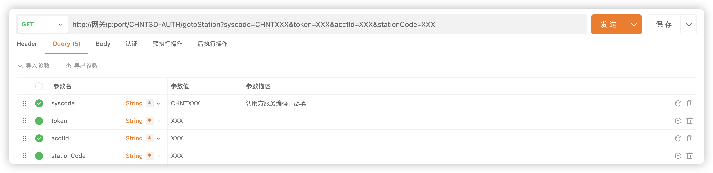

# 业务组件对接说明

业务组件对接说明

## 功能发布记录

| 发布时间 | 功能分类 | 功能名称 | 说明 |
| -------- | -------- | -------- | ---- |
|          |          |          |      |

## 重要通知

需要新增业务组件，请下载并填写模版表格。

[模版-点击下载](http://10.38.77.5:8081/repository/raws/chntjstz/zjh/component/技术中台新增业务组件信息-模板.xlsx)

 [技术中台新增业务组件信息-模板.xlsx](../file/技术中台新增业务组件信息-模板.xlsx) 

## 描述

- 提供业务组件接口对接，实现通过各环境网关网关请求接口，进行重定向功能。

## 功能说明

1. 3D展示接口（示例）
   - 登录技术中台，进入服务目录页面
   
      
   
   - 选择 **资源数字化管理平台-3D展示** 接口
   
      
   
   - 通过个环境网关请求该地址，并携带接口约定所需的参数
   
      
   
   - 额外需在请求参数或请求头中添加syscode参数，即请求方系统编码(必填) 
   
   - 
   
   - 请求示例：http:///网关ip:port/CHNT3D-AUTH/gotoStation?syscode=CHNTXXX&token=XXX&acctId=XXX&stationCode=XXX
   
   - 网关会自动将其重定向至业务组件地址，自动传递接口中相关参数

## 常见问题

1. 请求接口返回400，且响应头中包含“token is null“
   - 检查该接口是否为业务组件，接口标题下包含“使用系统数”字样，即为业务组件 
   - 
   - 检查请求参数或请求头中是否包含syscode参数