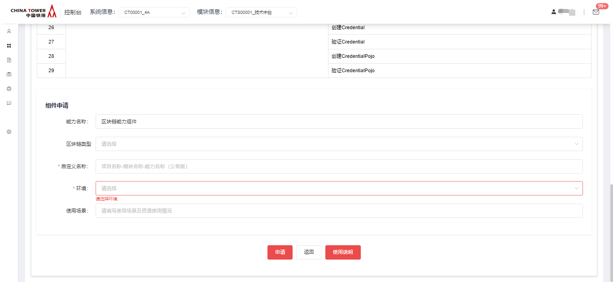
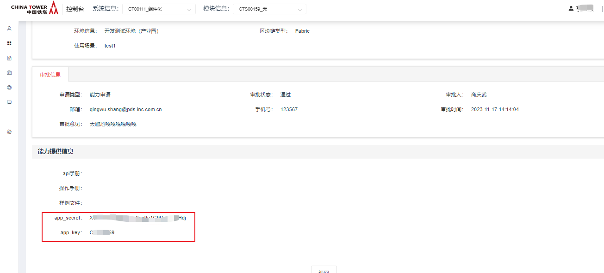

# 区块链

## 功能发布记录

| 版本 | 拟制/修改日期 | 拟制/修改人 | 修改记录 | 批准人 |
| ---- | ------------- | ----------- | -------- | ------ |
| 1.0  | 2023/11/21    | 赵龙        | 初版     |        |

## 重要通知

无

## 组件描述

区块链提供的是联盟链基础信息查询、应用数据存证、智能合约读写、分布式数字身份(DID)能力，区块链能力的增强安全性、更高的透明度和即时可追溯性基础，广泛应用于多方协同信任场景、合同场景、司法场景、版权声明、数据托管等场景。

### 建设目标

提升铁塔IT自主掌控能力，提高开发效率，降低编写重复代码的工作量。

### 特性

- 1、应用数据存证致力于帮助各系统解决数据篡改的问题，链上数据存证是不可篡改、可追溯的；
- 2、智能合约是一段链上可执行代码，可避免通过第三方处理交易的需要，进而减少了人力、时间和费用带来的成本和错误损耗；
- 3、分布式数字身份(DID)能力利用链颁发的可信数字身份交换可信数据。

## 快速入门

进入技术中台，登录消费者账号，选择 产品 → 业务服务 → 区块链

点击 【申请】，选择区块链类型、填写自定义名称、选择环境、填写使用场景，点击申请，等待运营人员审批 

审批通过后可以在我的申请单中(或者我的能力→公共技术组件→区块链→详情)看到 app_key 和 app_secret 

## 操作指南

详情请下载 API 参考目录下的附件

## 典型实践

无

## API参考

[点击下载](http://mid.chinatowercom.cn:18080/docs/chinatower-component/v1.0/module/_attachments/区块链能力接口规范V1.1.zip)  [区块链能力接口规范V1.1.zip](../file/区块链能力接口规范V1.1.zip) 

## SDK

无

## 网络要求

无

## 常见问题

无

## 样例文件