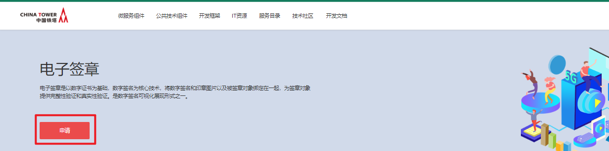
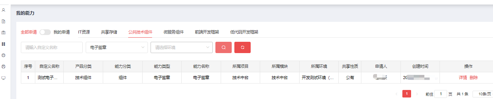

# 电子签章

## 功能发布记录

| 日期    | 版本 | 变更说明 | 作者 |
| ------- | ---- | -------- | ---- |
| 2022-10 | 1.0  | 初始版本 |      |

## 重要通知

无

## 组件描述

电子签章是以数字证书为基础，数字签名为核心技术，将数字签名和印章图片以及被签章对象绑定在一起，为签章对象提供完整性验证和真实性验证。是数字签名可视化展现形式之一。

## 快速入门

### 组件申请

仅允许铁塔自有人员申请。 消费者登录技术中台首页，选择公共技术组件，点击”电子签章“。  点击申请  填写申请单，点击申请即可  运营管理员审批通过后，在我的能力后输入正确的筛选条件，即可看到刚申请的能力。  点击”详情“，可看到下发的密钥以及相关信息

## 操作指南

无

## 典型实践

无

## API参考

无

## SDK

无

## 网络要求

无

## 常见问题

无

## 样例文件

无