# 短信组件

组件设计方案 2019年5月

## 功能发布记录

| 日期     | 版本 | 变更说明 | 作者 |
| -------- | ---- | -------- | ---- |
| 2021-7-7 | 1.0  | 初始版本 |      |

## 重要通知

低代码已支持微服务短信组件快速对接使用，详见[低代码短信组件](http://mid.chinatowercom.cn:18080/docs/chinatower-framework-lowcode/v1.0/module/短信组件.html)

## 组件描述

中国铁塔对通知的推送功能进行统一的建设，供各系统统一规范调用。提升铁塔IT自主掌控能力，提高统一通知处理能力与开发效率，减少因开发相同功能造成的开发资源浪费。

短信组件是一个下发短信的基础业务服务。它封装了与短信网关的交互过程。使得用户直接调用 API，即可实现下发短信的业务需求。

### 短信签名，短信模板示例：

短信签名：

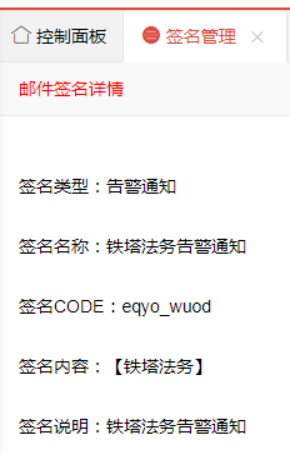

短信模板：

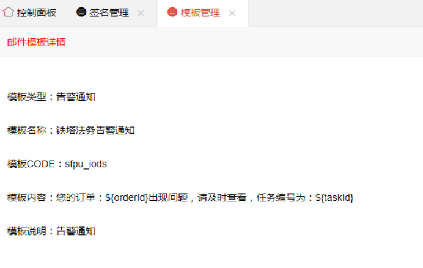

API PostMan 调用示例：

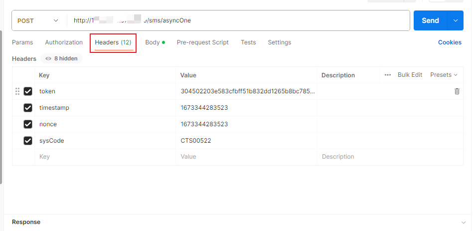

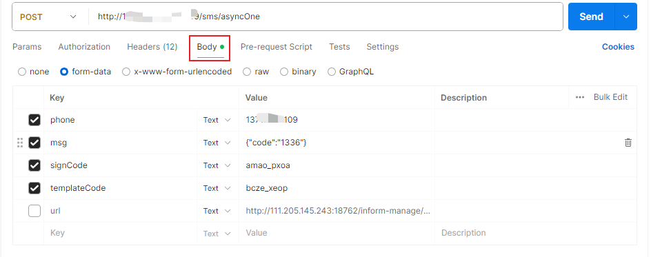

注： nonce, timestamp 为时间戳字符串，这里我们两个参数传值一致。

**返回参数：**

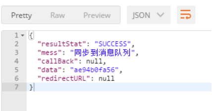

## 快速入门

### 组件申请

仅允许铁塔自有人员申请。 消费者进入技术中台首页，选择产品 → 业务组件 → 短信，进行申请。 

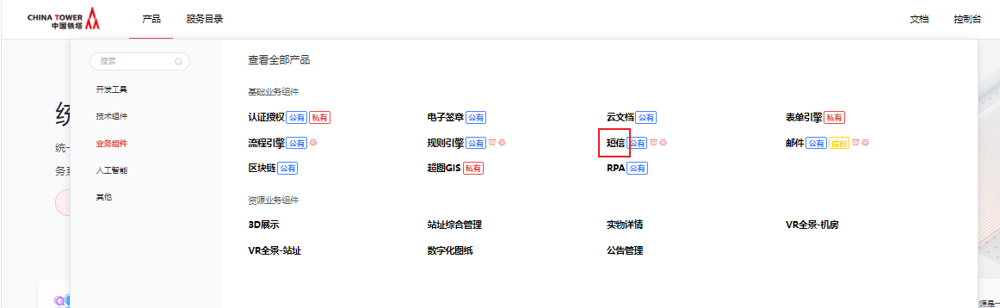 点击申请 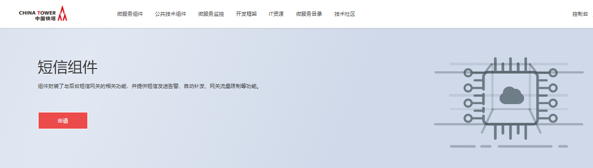 填写申请单，点击申请即可 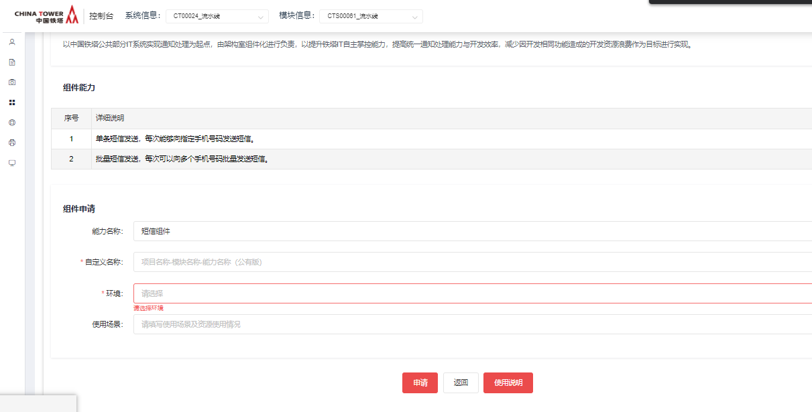 运营管理员审批通过后，在我的能力后输入正确的筛选条件，即可看到刚申请的能力。

 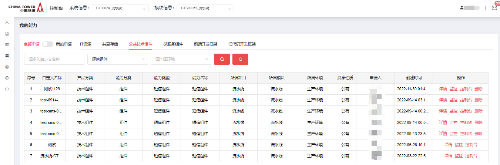 点击”详情“，可看到下发的私钥以及相关信息

## 操作指南

登录技术中台后，选择“我的能力”左侧导航菜单，右侧主内容区域选择“公共技术组件”，能力名称为"短信组件"，操作一栏可看到”控制台“及”监控“按钮。

  点击”控制台“,进入控制台，可以看到”接入系统设置“，自己可以创建”短信签名“”短信模板“ 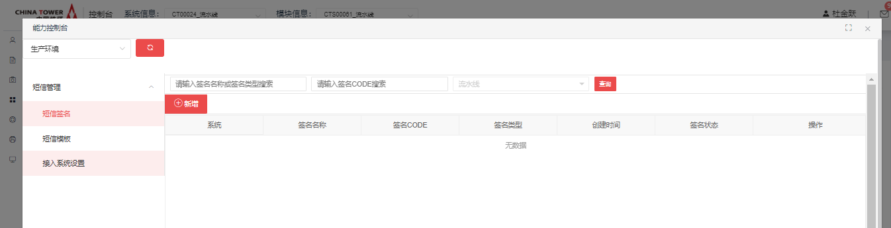 点击”监控“,进入监控，可以看到”短信报表统计“，”短信流水统计“ 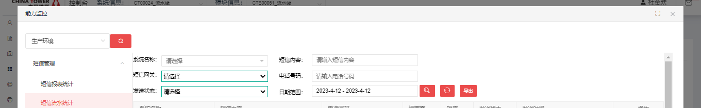

## 典型实践


## API参考

### 发送单条短信

注：ip:port，短信组件申请审批通过后，可在我的申请单详情页或我的能力详情页，查看能力地址。

请求地址：

| 接口类型     | HTTP                        |
| ------------ | --------------------------- |
| 接口提交方式 | POST                        |
| 请求方式     | multipart/form-data         |
| 接口地址     | http://ip:port/sms/asyncOne |

请求参数：

| 参数名称     | 说明             | 是否必填 | 类型   | 备注                                                         |
| ------------ | ---------------- | -------- | ------ | ------------------------------------------------------------ |
| phone        | 目标手机号码     | 必填     | String |                                                              |
| msg          | 模板变量内容     | 必填     | String | 例如：{"key1":"value1","key2":"value2"} Json 格式字符串，用来填充模板中的占位符。 |
| url          | 短信状态回调地址 | 非必填   | String | 通知组件会请求该地址，将短信发送状态发送给调用者。           |
| signCode     | 签名编码         | 必填     | String | 在短信控制台创建签名，并提交审核。                           |
| templateCode | 模板编码         | 必填     | String | 在短信控制台创建模板，并提交审核。                           |

请求头：

| 参数名称  | 说明                                    | 是否必填 | 类型   | 备注                                                         |
| --------- | --------------------------------------- | -------- | ------ | ------------------------------------------------------------ |
| sysCode   | 系统编码                                | 必填     | String | 申请短信组件时所使用的模块编码                               |
| timestamp | 时间戳                                  | 必填     | String | 时间戳字符串                                                 |
| token     | 签名，根据密钥、模块编码、时间戳生成    | 必填     | String | 密钥在我的能力→公共技术组件→短信组件详情页面获取。 token 生成方法参考下方 token 生成方法。 |
| nonce     | 随机数，鉴权使用，和 timestamp 保持一致 | 必填     | String | 和 timestamp 保持一致                                        |

响应参数：

| 参数名称   | 说明          | 类型   | 备注                                                         |
| ---------- | ------------- | ------ | ------------------------------------------------------------ |
| resultStat | SUCCESS/ERROR | String | 成功/失败                                                    |
| mess       | 消息          | String | 例如：同步到消息队列                                         |
| data       | 短信唯一标识  | String | 例如："data":"ae94b0fa56" 回调时会携带该标识，并携带短信发送的状态。 |

### 批量发送短信

ip:port：短信组件申请审批通过后，可在我的申请单详情页或我的能力详情页，查看能力地址。

请求地址：

| 接口类型     | HTTP                         |
| ------------ | ---------------------------- |
| 接口提交方式 | POST                         |
| 请求方式     | multipart/form-data          |
| 接口地址     | http://ip:port/sms/asyncMass |

请求参数：

| 参数名称     | 说明             | 是否必填 | 类型   | 备注                                                         |
| ------------ | ---------------- | -------- | ------ | ------------------------------------------------------------ |
| phones       | 目标手机号码     | 必填     | String | 多个用逗号分割，例如：137*6789,137*6790                      |
| msg          | 模板变量内容     | 必填     | String | 例如：{"key1":"value1","key2":"value2"} Json 格式字符串，用来填充模板中的占位符。 |
| url          | 短信状态回调地址 | 非必填   | String | 通知组件会请求该地址，将短信发送状态发送给调用者。           |
| signCode     | 签名编码         | 必填     | String | 在短信控制台创建签名，并提交审核。                           |
| templateCode | 模板编码         | 必填     | String | 在短信控制台创建模板，并提交审核。                           |

请求头：

| 参数名称  | 说明                                    | 是否必填 | 类型   | 备注                                                         |
| --------- | --------------------------------------- | -------- | ------ | ------------------------------------------------------------ |
| sysCode   | 系统编码                                | 必填     | String | 申请短信组件时所使用的模块编码                               |
| timestamp | 时间戳                                  | 必填     | String | 时间戳字符串                                                 |
| token     | 签名，根据密钥、模块编码、时间戳生成    | 必填     | String | 密钥在我的能力→公共技术组件→短信组件详情页面获取。 token 生成方法参考下方 token 生成方法。 |
| nonce     | 随机数，鉴权使用，和 timestamp 保持一致 | 必填     | String | 和 timestamp 保持一致                                        |

响应参数：

| 参数名称   | 说明          | 类型   | 备注                                                         |
| ---------- | ------------- | ------ | ------------------------------------------------------------ |
| resultStat | SUCCESS/ERROR | String | 成功/失败                                                    |
| mess       | 消息          | String | 例如：同步到消息队列                                         |
| data       | 短信唯一标识  | String | 例如："data":"ae94b0fa56" 回调时会携带该标识，并携带短信发送的状态。 |

### 获取签名 token

（1）maven 的 settings.xml 添加镜像源

```xml
<mirror>
    <id>nexus</id>
    <url>http://10.38.77.5:8081/repository/maven-public/</url>
    <mirrorOf>*</mirrorOf>
</mirror>
```

（2）工程 pom.xml 添加依赖包

```xml
<dependency>
    <groupId>com.chinatower</groupId>
    <artifactId>chinatower_encrypt</artifactId>
    <version>1.0</version>
</dependency>
```

（3）通过调用以下方法获取签名：

```java
Util.creterSM2Signature(nonce, timestamp, sysCode, privateKey);
```

### 回调 url 使用示例

url 为业务系统自定义的短信状态回调地址。此参数为非必填项。

当填写此参数时。短信组件会请求该地址，将短信发送状态发送给调用者。前提是此 url 需保证外网可访问。

业务系统回调方法示例： 以下的 url 可写为：http://ip:port/sms/callback ip:port: 为业务系统自己的，需外网可访问。

SMS 短信组件请求参数说明

| 参数名称  | 说明         | 约束  | 类型   | 备注               |
| --------- | ------------ | ----- | ------ | ------------------ |
| serviceId | 短信唯一标识 | param | String |                    |
| status    | 短信发送状态 | param | String | 例如：DELIVRD 成功 |

```java
@PostMapping("test")
public void test(@RequestBody Map map){
    String serviceId = (String) map.get("serviceId");
    String status = (String) map.get("status");
    System.out.println("serviceId:"+serviceId+" status:"+status);
}
```

## SDK

无

## 网络要求

无

## 常见问题

Q1 : 新接入的系统若不能成功下发短信，请检查以下①-④流程 A1 ： ① 接入系统设置：检查该接入系统的vhost、生产者、消费者是否都成功初始化，      ② 短信告警设置：该接入系统是否有该设置      ③ 短信签名：签名内容必须要用中括号引起来，且签名要处于启用状态      ④ 短信模板：模板内容按照示例填写，且模板必须处于启用状态

## 样例文件

 [sms-demo.zip](../file/sms-demo.zip) 

# 邮件组件

## 功能发布记录

| 日期     | 版本 | 变更说明 | 作者 |
| -------- | ---- | -------- | ---- |
| 2021-7-7 | 1.0  | 初始版本 |      |

## 重要通知

邮件组件已支持微服务短信组件快速对接使用，详见[低代码邮件组件](http://mid.chinatowercom.cn:18080/docs/chinatower-framework-lowcode/v1.0/module/邮件组件.html)

## 组件描述

中国铁塔邮件组件是基于阿里邮箱服务器的邮件发送解决方案，它为业务系统提供了一种简单、高效的邮件下发能力。它封装了与邮件服务器的交互，使得用户可以通过 API 调用的方式，实现下发邮件的业务需求。

邮箱类型：

| 类别 | 阿里云邮箱 | 腾讯邮箱 | 网易邮箱 | 其他 |
| ---- | ---------- | -------- | -------- | ---- |
| 邮箱 | 支持       | 支持     | 支持     | 待测 |

电子邮箱客户端一般默认为非加密模式，并且默认端口不同，若对于信息的密度性以及安全性要求，则提供电子邮箱客户端SSL加密模式。

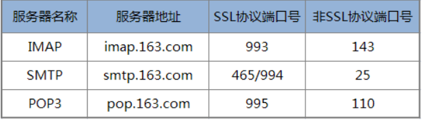

### UI-邮件管理

已经集成技术中台，请在 我的能力 → 公共技术组件 → 邮件组件 → 监控|控制台 进行查看

## 快速入门

### 组件申请

仅允许铁塔自有人员申请。 消费者进入技术中台首页，选择产品 → 业务组件 → 邮件，进行申请。 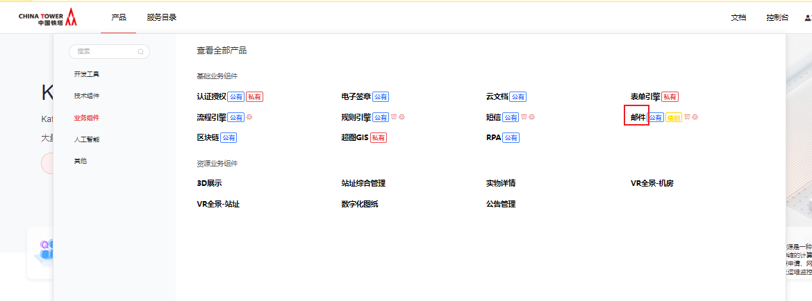 点击申请 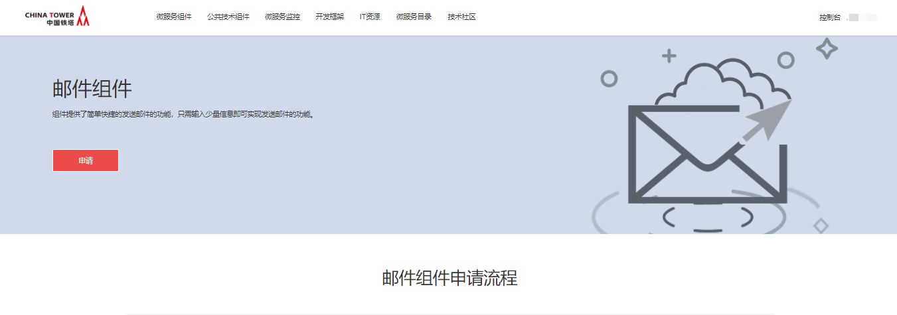 填写申请单，点击申请即可 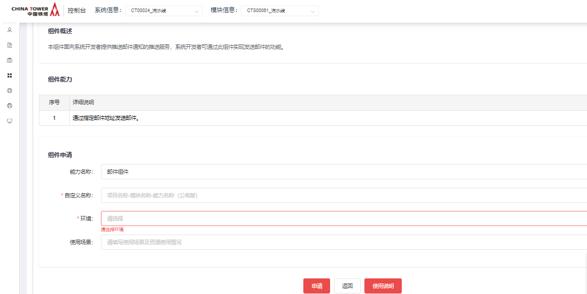

## 操作指南

登录技术中台后，选择“我的能力”左侧导航菜单，右侧主内容区域选择“公共技术组件”，能力名称为"邮件组件"，操作一栏可看到”控制台“及”监控“按钮。 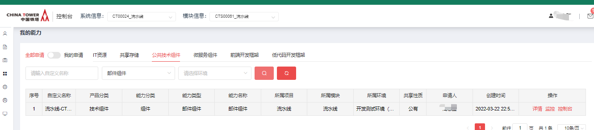 点击”控制台“,进入控制台，可以看到”邮件模板“，自己可以新增“邮件模板“ 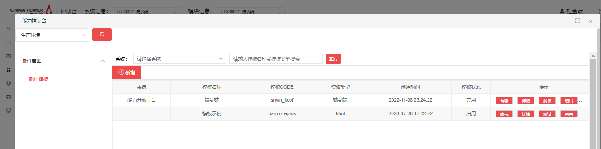 点击”监控“,进入监控，可以看到”邮件列表“ 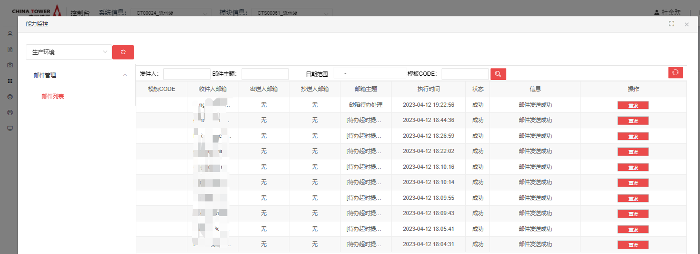

## 典型实践

无

## API参考

### 邮件发送

注：ip:port，邮件组件申请审批通过后，可在我的申请单详情页或我的能力详情页，查看能力地址。

请求地址：

| 接口类型     | HTTP                          |
| ------------ | ----------------------------- |
| 接口提交方式 | POST                          |
| 请求方式     | multipart/form-data           |
| 接口地址     | http://ip:port/email/sendMail |

请求参数:

| 参数名称   | 说明              | 是否必填      | 类型            | 备注                                                         |
| ---------- | ----------------- | ------------- | --------------- | ------------------------------------------------------------ |
| addName    | 发件人姓名        | 否            | String          |                                                              |
| addEmail   | 发件人邮箱        | 否            | String          |                                                              |
| addPwd     | 发件人凭证        | 否            | String          |                                                              |
| addServer  | 发件人服务器地址  | 否            | String          |                                                              |
| reToEmail  | 收件人邮箱        | 是            | String          | 多个收件人时用逗号连接                                       |
| reCcEmail  | 抄送人邮箱        | 否            | String          |                                                              |
| reBccEmail | 密送人邮箱        | 否            | String          |                                                              |
| subject    | 邮件主题          | 是            | String          |                                                              |
| text       | 邮件文本          | 同content选一 | String          |                                                              |
| file       | 邮件附件          | 否            | MultipartFile[] |                                                              |
| isSSL      | SSL加密           | 否            | int             | 0为不加密 / 1为加密                                          |
| isUrgent   | 是否为加急邮件    | 否            | Boolean         | true 为加急/ false不加急                                     |
| content    | 邮件内容html      | 同text选一    | String          | 内置如下三个参数：useTemp,tempName,tempValue 示例： {"useTemp":true,"tempName":"sewe_qzdd","tempValue":{"provinceCode":"山东省","year":"2024","month":"2","day":"20"}} |
| useTemp    | 是否启用模板      |               | Boolean         | true 为启用 / false为不启用                                  |
| tempName   | 模板code/邮件内容 | 必填          | string          | 模板code ，需在技术中台邮件控制台中创建邮件模板。            |
| tempValue  | 模板数据模型      |               | String          | 当tempName使用模板code时，会自动加载模板内容，需要填充数据模型，当使用模板内容时，自己封装数据信息 |

注：参数text与content 同时存在时，只显示content内容。

响应参数:

| 参数名称 | 说明     | 类型   | 备注              |
| -------- | -------- | ------ | ----------------- |
| code     | 结果标识 | String | 000000 - 操作成功 |
| msg      | 结果描述 | String |                   |

### 请求示例：

（1） 默认发件人

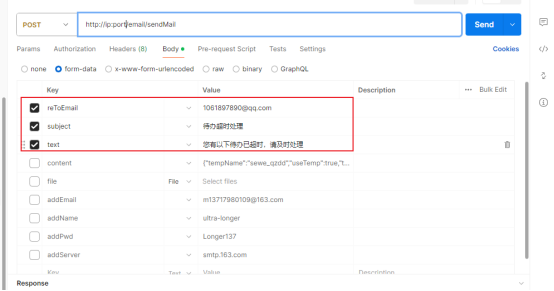

(2) 自定义发件人

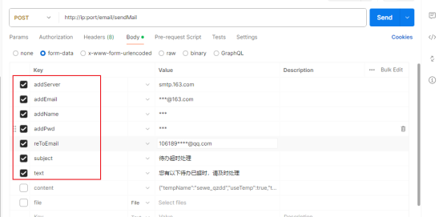

(3) 使用模板

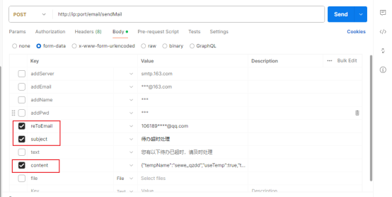

(4) 带附件

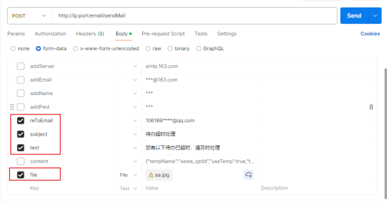

## SDK

无

## 网络要求

无

## 常见问题

无

## 样例文件

 [email-demo.zip](../file/email-demo.zip) 

