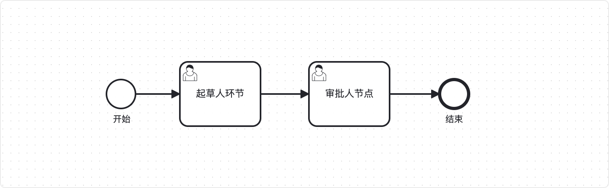

# 自研流程引擎

通过选择搭配组件SDK，快速将自研流程引擎（统一流程平台）接入系统。

## 功能发布记录

| 发布时间 | 功能分类 | 功能名称      | 说明                                   |
| -------- | -------- | ------------- | -------------------------------------- |
| 20231219 | 新增     |               |                                        |
| 20240104 | 新增     | 日期格式转化  | 补充条件查询所需日期字段的格式转化说明 |
| 20240119 | 新增     | sdk集成4a查询 | 需要实现4a查询参数接口                 |
| 20240510 | 修改     | sdk版本升级   | 由0.0.1-SNAPSHOT升级到0.0.2-SNAPSHOT   |

## 重要通知

无

## 组件描述

- 支持引入新流程引擎-SDK，实现自动对自研接流程引擎（统一流程平台）系统。
- 支持引入前端Vue组件，用于流程定义、流程图展示

## 快速入门

### 新系统通过技术中台申请流程引擎步骤

1. 登录生产4a发起IT服务工单-数据配置（仅申请生产环境流程引擎需要发起，申请其他环境流程引擎忽略此步骤） 
2. 通过生产环境4A登录技术中台，点击 产品-业务组件-流程引擎，点击申请(若查询不到接收通知服务，可直接手动输入服务名)。
 
3. 联系技术中台人员审批 审批通过后可在控制台进入流程设计页面 
4. 可通过系统管理-租户信息，查看租户配置 
5. 如需更改业务配置，请联系技术中台运营人员

### 接口文档

### 后端对接自研流程引擎

当我们的业务需要进行流程控制的时候，可以引入流程引擎组件，能够进行完善方便的流程控制。

> [!NOTE]
>
> 对接准备  需先准备系统编码，申请网关能力和注册中心能力，确保网络与网关和注册中心双向打通；  与4A系统完成相关对接，确保系统密钥同步完成，并且存在可用的4A用户；  确保可访问到Nexus私服，并可以从私服拉取依赖。

1、联系运营人员获取租户等相关信息；

2、参考 [SDK-后端SDK集成] 部分；

3、场景：设计一个请假流程系统

简单流程示例文件：

[点击下载](http://10.38.77.5:8081/repository/raws/chntjstz/zjh/tylcpt/default_template.bpmn)  [default_template.bpmn](../file/default_template.bpmn) 

4、流程控制：

 

5、功能实现：

- 配合前端组件，画出请假流程图后，调用后端SDK中提供的接口，先对流程图进行部署操作，生成流程定义；
- 部署成功后会返回流程定义信息，配置相关审批人信息和冗余参数，通过流程定义ID启动流程实例，此时请假申请已经发起成功；
- 启动成功后，此时会生成两个用户任务：流程发起人任务和审批人节点审批任务，如上图所示；
- 按照顺序完成两项任务，通过调用任务审批接口，对任务进行审批操作：
  - 若审批人审批通过，此流程自动完成
  - 若审批人驳回，次流程会自动退回至发起人处
  - 此时发起人可进行两项操作
    - 修改信息，并重新提交
    - 终止并删除此流程

## 操作指南

### 设置审批规则的方法

支持配置4A用户，角色，组织审批规则如支持配置审批规则、支持直接指定审批用户

可用的属性：act_account，act_org，act_role，act_account_var，act_account_var，act_account_var。

同时配置时：

1. 只配置角色，查询拥有角色的用户
2. 只配置账号，查询这些账号的用户
3. 只配置组织，查询组织下的用户
4. 配置角色+账号，查询拥有角色的用户以及配置的账号
5. 配置组织+账号，查询组织下的用户以及配置的账号
6. 配置组织+角色，查询组织下的拥有这些角色的用户
7. 配置组织+角色+账号 ，查询组织下的拥有这些角色的用户以及配置的账号
8. 未配置，查询系统下所有用户

支持同一属性多个，用逗号分开。定义多个时取或集，例： 角色act_role : default-role,admin-role 。

例如:

#### 1. 使用属性定义可用审批人。

1、编辑流程定义，在任务节点上注入act_account属性。


2、启动实例，执行到此任务的前一任务。以当前taskId为参数查询下一任务审批人列表。


3、调用查询下一审批人接口，可查询到根据注入属性筛选后的用户列表


#### 2. 使用变量定义可用审批人

1、编辑流程定义，在任务节点上定义act_accoun_var属性。


2、启动实例，设置变量，执行到此任务的前一节点。


3、调用查询下一审批人接口，可查询到根据注入属性筛选后的用户列表


## 典型实践

### 流程平台回调通知

当业务系统进行流程定义时，支持设置事件监听。若设置了事件监听，则事件触发后流程平台会对业务系统进行回调。

#### 当前支持的回调

| 事件名           | 事件标识         | Spring事件类型        | 触发时机                                                     | 设置方式                                                     |
| ---------------- | ---------------- | --------------------- | ------------------------------------------------------------ | ------------------------------------------------------------ |
| 流程结束         | processFinish    | ProcessFinishEvent    | 流程实例结束                                                 | 流程结束节点，增加"执行监听器"，事件类型：完成，监听器类型：委托表达式，表达式：${processFinishListener} |
| 任务完成         | taskFinish       | TaskFinishEvent       | 任务只需一人审批，审批通过时触发；若为多人会签，所有人都审核通过时触发 | 用户任务节点，增加"任务监听器"，事件类型：完成，监听器类型：委托表达式，表达式：${taskFinishListener} |
| 单个会签任务完成 | taskSingleFinish | TaskSingleFinishEvent | 多人会签时，某个人处理完成，但还有其他人未处理时触发         | 用户任务节点，增加"任务监听器"，事件类型：完成，类型：委托表达式，表达式：${taskFinishListener} |
| 任务变更         | taskChange       | TaskChangeEvent       | 是一个通用的事件，对于任务的新增、删除、完成等，都会进行通知。对于任务完成，能够替代taskFinish、taskSingleFinish事件 | 用户任务节点，增加"任务监听器"，事件类型：完成，类型：委托表达式，表达式：${taskEventListener} |
| 任务退回         | taskReject       | TaskRejectEvent       | 任务审批时, 审批人执行退回操作时触发                         | 在流程定义阶段, 使用2.0版本流程设计器, 选择某个任务节点后, 在右侧节点通知tab中勾选"退回"按钮即可 |
| 任务撤回         | taskRetract      | TaskRetractEvent      | 审批已经通过, 但审批人选择撤回已经审批的任务时触发           | 在流程定义阶段, 使用2.0版本流程设计器, 选择某个任务节点后, 在右侧节点通知tab中勾选"撤回"按钮即可 |
| 任务加签         | taskAddSign      | TaskAddSignEvent      | 任务审批时, 审批人执行加签操作时触发                         | 在流程定义阶段, 使用2.0版本流程设计器, 选择某个任务节点后, 在右侧节点通知tab中勾选"加签"按钮即可 |

#### 回调接收方式

集成流程引擎SDK后回调通知将以Spring事件形式发布，业务端编写ApplicationListener即可进行监听。

> [!IMPORTANT]
>
> 1. 通知是通过微服务网关通知到业务系统，需要业务系统提供集成了流程引擎SDK的微服务id（spring.application.name的值）给到流程平台，进行配置后才能生效  
> 2. 需业务系统确保微服务网关能够正常访问到业务系统的服务，如：业务系统微服务是否申请了网关能力、网关与业务系统微服务的网络是否需要打通

例，监听流程结束回调：

```java
@Component
public class ProcessFinishEventListener implements ApplicationListener<ProcessFinishEvent> {
    private static Logger log = LoggerFactory.getLogger(ProcessFinishEventListener.class);

    @Override
    public void onApplicationEvent(ProcessFinishEvent event) {
        ProcessFinishPayload payload = event.getPayloadObj();
        log.info("TaskFinishEventListener payload: {}", payload);
    }
}
```

>[!NOTE]
>
>流程平台的回调通知，同一个通知可能会回调多次，需业务系统自行保证通知处理的幂等性（如：对流程实例id、任务id进行前置判断，若已处理则忽略通知）

#### 回调通知参数

如上述示例所示，可调用`event.getPayloadObj()`获取通知参数，具体结构定义如下

**TaskFinishEvent事件，payload结构**

```json
{
	"taskInfo": {
		"processDefinitionId": "Process_za313b:4:10013-34141-5670-7515",  # 流程定义id
		"processInstanceId": "3513-14341-5670-7515", # 流程实例id，非空
		"taskDefinitionKey": "Task_4146b",           # 任务定义id，非空
		"taskId": "3513-14341-5670-7515",            # 任务id，非空
		"taskName": "审批任务",                        # 任务名，非空
		"taskVariables": {                           # 该任务相关的变量，可能为空
            "varAssignList": ["zhangsan", "lisi"],   # 变量为key、value形式
            "money": "100"
        },
		"assignee": "zhangsan"                       # 任务办理人，非空
	},
	"isTaskDrafterNode": true                        # 该任务是否为起草人节点，非空
}
```

**TaskSingleFinishEvent事件，payload结构** 同TaskFinishEvent

**TaskChangEvent事件，payload结构**

```json
{
    "type": "complete",                              # 类型
	"taskInfo": {
		"processDefinitionId": "Process_za313b:4:10013-34141-5670-7515",  # 流程定义id
		"processInstanceId": "3513-14341-5670-7515", # 流程实例id，非空
		"taskDefinitionKey": "Task_4146b",           # 任务定义id，非空
		"taskId": "3513-14341-5670-7515",            # 任务id，非空
		"taskName": "审批任务",                        # 任务名，非空
		"taskVariables": {                           # 该任务相关的变量，可能为空
            "varAssignList": ["zhangsan", "lisi"],   # 变量为key、value形式
            "money": "100"
        },
		"assignee": "zhangsan"                       # 任务办理人，非空
	},
	"isTaskDrafterNode": true,                       # 该任务是否为起草人节点，非空
    "taskCompleteFlag": "all"                        # type=complete时返回，all：任务只需一人审批，审批通过时触发；
													 # 若为多人会签，所有人都审核通过时触发；
													 # single：多人会签时，某个人处理完成，但还有其他人未处理时触发
}
```

**type字段定义**

1. create：任务创建，生成任务时触发
2. delete：任务删除，驳回、撤回等情况会触发任务删除，举例：从任务a，驳回到任务b，会触发任务a的删除同时触发任务b的创建
3. complete：任务完成，即：审核通过
4. assignment：任务分配，暂未使用
5. update：任务更新，暂未使用
6. timeout：任务超时，暂未使用

**ProcessFinishEvent事件，payload结构**

```json
{
    "type": "end",                                    # 类型，end：正常结束，delete：流程作废结束
	"processInfo": {
		"processDefinitionId": "Process_za313b:4:10013-34141-5670-7515",  # 流程定义id
		"processInstanceId":   "3513-14341-5670-7515",# 流程实例id
		"processBusinessKey":  "businessKey",         # 流程关联的业务id
        "executionVariables": {                       # 变量定义，可能为空，可获取流程实例开始时的变量
            "varAssignList": ["zhangsan", "lisi"],    # 变量为key、value形式
            "money": "100"
        }
	}
}
```

**TaskCreateEvent，payload结构**

```json
{
    "type": "create",                                # 类型
    "payload": {
        "taskInfo": {
            "processDefinitionId": "Process_za313b:4:10013-34141-5670-7515",  # 流程定义id
            "processInstanceId": "3513-14341-5670-7515", # 流程实例id，非空
            "taskDefinitionKey": "Task_4146b",           # 任务定义id，非空
            "taskId": "3513-14341-5670-7515",            # 任务id，非空
            "taskName": "审批任务",                        # 任务名，非空
            "taskVariables": {                           # 该任务相关的变量，可能为空
                "varAssignList": ["zhangsan", "lisi"],   # 变量为key、value形式
                "money": "100"
            },
            "assignee": "zhangsan"                       # 任务办理人，非空
        },
        "isTaskDrafterNode": true,                       # 该任务是否为起草人节点，非空
        "taskCompleteFlag": "all"                        # type=complete时返回，all：任务只需一人审批，审批通过时触发；
														 # 若为多人会签，所有人都审核通过时触发；
														 # single：多人会签时，某个人处理完成，但还有其他人未处理时触发
    }
}
```

### 日期格式转化

在请求条件查询相关接口时，查询参数中有时间类型的查询条件，因时间格式或时区格式不同，可能会造成时间格式无法转换。

使用方法：

1、自研流程引擎SDK中封装了 ***V1Beta1BpmDateTime*** 对象；

2、三种使用方式：

- 方式一：直接创建 ***V1Beta1BpmDateTime*** 对象

```java
public class Test {
    public static void main(String[] args) {
        V1Beta1BpmDateTime v1Beta1BpmDateTime = new V1Beta1BpmDateTime();
        System.out.println(v1Beta1BpmDateTime); // 2024/01/04 16:13:24
    }
}
```

- 方式二：在 ***V1Beta1BpmDateTime*** 对象中传入指定时间格式字符串，时间格式为（yyyy/MM/dd HH:mm:ss）

```java
public class Test {
    public static void main(String[] args) {
        String s = "2024/01/04 14:18:00";
        V1Beta1BpmDateTime v1Beta1BpmDateTime = new V1Beta1BpmDateTime(s);
        System.out.println(v1Beta1BpmDateTime); // 2024/01/04 14:18:00
    }
}
```

- 方式三：在 ***V1Beta1BpmDateTime*** 对象中传入 ***Date*** 对象

```java
public class Test {
    public static void main(String[] args) {
        Date date = new Date();
        V1Beta1BpmDateTime v1Beta1BpmDateTime = new V1Beta1BpmDateTime(date);
        System.out.println(v1Beta1BpmDateTime); // 2024/01/04 16:23:24
    }
}
```

### 待办过滤器方式接入

需要先创建待办过滤器，创建完成后通过过滤器ID进行查询待办。

无需每次查询待办都创建过滤器，建议创建一个通用的待办查询过滤器，在不同场景下配合扩展查询条件使用。

使用方法：

1.创建过滤器，仿照一下json和java接口实例进行创建

```json5
{
    "name": "ZhangSan Task Filter", // 过滤器名称，必填
    "resourceType": "Task", // 过滤器类型，必填
    "query": { // 扩展查询条件，对待办结果进行二次过滤，非必填
        "assigneeIn": [
          "zhangsan"
        ],
        "sortBy": "followUpDate", // 排序字段，默认值：followUpDate
        "sortOrder": "asc" // 排序方式， 默认值：asc
    },
    "properties": { // 非必填
        "showUndefinedVariable": false,
        "variables": [ // 变量，配置后在待办结果中展示
            {
                "name": "act_start_user",
                "label": "act_start_user"
            }
        ]
    }
}
public class Test {
    @Autowired
    private V1Beta1FilterApi filterApi;

    public FilterDto createFilter() {
        FilterDto filterDto = new FilterDto();
        filterDto.setName("ZhangSan Task Filter"); // 自定义过滤器名称
        filterDto.setResourceType("Task"); // 结果类型（固定，不需要修改）

        // 设置查询条件
        TaskQueryDto taskQueryDto = new TaskQueryDto();
        taskQueryDto.setAssignee("张三"); // 待办人
//        taskQueryDto.setSortBy("followUpDate"); // 结果集排序字段-默认followUpDate，非必选
//        taskQueryDto.setSortOrder("asc"); // 结果集排序方式-默认正序，非必选
        filterDto.setQuery(taskQueryDto);

        // 设置查询变量
        List<Map<String, String>> variables = new LinkedList<>();
        Map<String, String> va = new LinkedHashMap<>();
        va.put("name", "assigneeList"); // 流程实例中的变量名
        va.put("label", "a"); // 自定义名称
        variables.add(va);

        Map<String, Object> properties = new LinkedHashMap<>();
        properties.put("variables", variables);
        filterDto.setProperties(properties);

        FilterDto filter = filterApi.createFilter(filterDto);
        return filter;
    }
}
```

2.第一步过滤器创建成功后，返回过滤器信息

```json
{
    "resultStat": "000",
    "failCode": null,
    "mess": null,
    "callBack": null,
    "data": {
        "id": "4b323bc6-adf5-11ee-b484-c63d4f7fee36",
        "resourceType": "Task",
        "name": "ZhangSan Task Filter",
        "owner": null,
        "query": {
            "assigneeIn": [
              "zhangsan"
            ],
            "taskVariables": [],
            "processVariables": [],
            "caseInstanceVariables": [],
            "orQueries": [],
            "sorting": [
                {
                    "sortBy": "followUpDate",
                    "sortOrder": "asc"
                }
            ]
        },
        "properties": {
            "showUndefinedVariable": false,
            "variables": [
                {
                    "name": "assigneeList",
                    "label": "a"
                }
            ]
        }
    },
    "redirectURL": null
}
```

> [!NOTE]
>
> 创建过滤器的动作只需执行一次，将创建好的过滤器ID进行记录，便可配合第三步中的过滤条件（TaskQueryDto）重复使用，无需每次查询待办都执行创建过滤器动作。

3.通过过滤器ID，请求查询待办接口，并支持对过滤结果集进行条件过滤

```java
public class Test {
    @Autowired
    private V1Beta1FilterApi filterApi;

    /**
     * 包含流程定义信息和流程实例信息
     *
     * id  (required) 过滤器ID
     * extendingQuery  (optional, default to “”) 扩展查询语句
     * pageNum  (optional, default to 1) 页码
     * pageSize  (optional, default to 200) 长度
     */
    public PageRespResult<List<V1Beta1HalTaskDto>> queryListWithProcessInfo() {
        // 结果集过滤参数
        TaskQueryDto taskQueryDto = new TaskQueryDto();
        taskQueryDto.taskId("xxxxxxxxxxxxxxxx");
        taskQueryDto.setCreated(new V1Beta1BpmDateTime());
        // taskQueryDto.setCreated(new V1Beta1BpmDateTime(new Date()));
        // taskQueryDto.setCreated(new V1Beta1BpmDateTime("时间str"));

        // 过滤器ID
        String filterId = "aaaaaaaa";
        // 查询结果
        PageRespResult<List<V1Beta1HalTaskDto>> result = filterApi.queryListWithProcessInfo(filterId, taskQueryDto, 1, 10);
        // 结果集
        List<V1Beta1HalTaskDto> data = result.getData();
        // 分页信息
        Page page = result.getPage();
        return result;
    }
}
```

4.扩展查询条件（即查询待办接口的第二个参数：TaskQueryDto）

> [!NOTE]
>
> - 若请求查询待办接口时，不传TaskQueryDto，则默认使用创建过滤器时设置的扩展查询条件（query字段）；  
>
> - 若请求查询待办接口时，传TaskQueryDto，则会在过滤器中设置的扩展查询条件（query字段）基础上，进行二次过滤（taskQueryDto）

- 若在创建过滤器时，设置了变量查询（properties字段），则在结果集中会返回流程中与变量查询对应的变量名和值；
- 若想对结果集中的返回变量进行二次过滤，可在TaskQueryDto中设置taskVariables或processVariables变量，结构如下： 
- 其中name为目标变量名，value为变量值，operator为操作符，操作符有以下选项：

| 操作符  | 含义       | 使用示例                                                     | 说明                                                         |
| ------- | ---------- | ------------------------------------------------------------ | ------------------------------------------------------------ |
| eq      | 等于(==)   | { "name": "act_start_user", "value": "zhangsan", "operator": "eq" } | 变量act_start_user的值等于zhangsan                           |
| neq     | 不等于(!=) | { "name": "act_start_user", "value": "zhangsan", "operator": "neq" } | 变量act_start_user的值不等于zhangsan                         |
| gt      | 大于       | { "name": "level", "value": 20, "operator": "gt" }           | 变量level的值大于20                                          |
| gteq    | 大于等于   | { "name": "level", "value": 20, "operator": "gteq" }         | 变量level的值大于等于20                                      |
| lt      | 小于       | { "name": "level", "value": 10, "operator": "lt" }           | 变量level的值小于10                                          |
| lteq    | 小于等于   | { "name": "level", "value": 10, "operator": "lteq" }         | 变量level的值小于等于10                                      |
| like    | 模糊查询   | { "name": "act_start_user", "value": "zhang%", "operator": "like" } | 变量act_start_user的值以zhang开头，模糊查询较为特殊，根据需要，在value的前后添加%，类似sql语句中的模糊查询 |
| notLike | 模糊查询   | { "name": "act_start_user", "value": "%san", "operator": "notLike" } | 变量act_start_user的值不以san结尾，模糊查询较为特殊，根据需要，在value的前后添加%，类似sql语句中的模糊查询 |

5.待办结果集排序

在创建过滤器时默认以followUpDate字段进行正序排序，若想修改排序字段，有以下两种方式：

- 方式一、修改过滤器query属性中的sortBy和sortOrder字段
- 方式二、在扩展查询条件（TaskQueryDto）中设置sortBy和sortOrder字段
- 可对待办结果集进行排序的字段如下图所示： 

### 分页查询已办接口

参考[[_api参考\]](http://mid.chinatowercom.cn:18080/docs/chinatower-component/v1.0/module/流程引擎.html#_api参考)部分接口文档, 3.7历史任务接口 通过参数查询已办列表

### 流程中涉及变量

在流程启动或完成任务时，可额外存放流程变量或任务变量（冗余参数），变量数据类型需严格按照以下类型传输

| 数据类型 | 说明                       |
| -------- | -------------------------- |
| Boolean  | 布尔值，表示真或假值       |
| Integer  | 整数，表示整数值           |
| Long     | 长整数，表示长整数值       |
| Double   | 双精度浮点数，表示浮点数值 |
| String   | 字符串，表示文本数据       |
| Date     | 日期，表示日期和时间       |
| Object   | 对象，表示复杂的数据结构   |

错误示例：

```json
{
    "variables": {
        "pageNum": {
            "value": "1",
            "type": "String"
        },
        "currentTimeMillis": {
            "value": "1706578061966",
            "type": "String"
        },
        "assigneeList": {
            "value": "[\"chencg12\",\"xunyu1\"]",
            "type": "Object"
        }
    }
}
```

正确示例：

```json5
{
    "variables": {
        "pageNum": {
            "value": 1,
            "type": "Integer"
        },
        "currentTimeMillis": {
            "value": 1706578061966,
            "type": "Long"
        },
        "assigneeList": {
            "value": "[\"zhangsan\",\"lisi\"]",
            "type": "Object",
            "valueInfo": { // 数组或集合等类型需写入valueInfo中
                "objectTypeName": "java.util.ArrayList",
                "serializationDataFormat": "application/json"
            }
        }
    }
}
```

### 与内网门户进行待办交互

|      | 对接准备  需先与内网门户进行对接，确保待办可正常推送至内网门户；  将使用与OA对接的“系统编码、PC地址和APP地址”三项信息。   情景一、未在技术中台申请能力，线下与统一流程平台对接的系统   登录对应环境的4A系统，点击进入统一流程平台入口；  点击系统管理-租户管理，选择目标租户，点击修改按钮；   将“PC地址和APP地址”输入对应的位置，点击保存修改。
    情景二、新系统对接使用统一流程平台   在能力申请界面填写与OA对接的系统编码、PC地址和APP地址。
  |
| ---- | ------------------------------------------------------------ |
|      |                                                              |

与OA交互相关监听器

| 事件名       | 事件标识       | Spring事件类型      | 触发时机                                                     | 设置方式                                                     |
| ------------ | -------------- | ------------------- | ------------------------------------------------------------ | ------------------------------------------------------------ |
| 推送OA待办   | taskAssignment | TaskAssignmentEvent | 推送OA待办监听器：在任务分配给执行人时触发执行。可以用于指定任务的执行人或候选人，若存在执行人或候选人时，会向自动OA发送待办新增的请求。 | 用户任务节点，增加"任务监听器"，事件类型：assignment（分配），类型：委托表达式，表达式：${oaSendTodoListener} |
| OA待办变已办 | taskFinish     | TaskFinishEvent     | OA待办变已办监听器：在任务完成时触发执行。可以用于用户任务在完成时，触发时会自动向OA发送待办变已办的请求。 | 用户任务节点，增加"任务监听器"，事件类型：complete（完成），类型：委托表达式，表达式：${oaDoneListener} |
| 删除OA待办   | taskDelete     | TaskDeleteEvent     | 删除OA待办监听器：在任务被删除时触发执行。可以用于清理任务相关的数据和流程实例废除，触发时会自动向OA发送删除待办的请求。 | 用户任务节点，增加"任务监听器"，事件类型：delete（删除），类型：委托表达式，表达式：${oaDeleteTodoListener} |

实现自动发送待办、待办转已办和删除待办功能

1. 绘制流程图时，在流程定义级别设置OA交互相关扩展属性；若填写，则优先使用；若不填写，则默认使用准备环节设置的信息。
 
2. 在用户任务节点配置上述三个监听器； 
3. 流程启动后，进行到目标用户任务节点，会自动与OA进行交互。

向内网门户推送待办时，支持自定义待办名称

在用户任务中添加扩展属性，key：act_oa_todo_expression, value: 自定义

- 方式一、扩展属性value直接填写目标待办名称 
- 方式二、扩展属性value直接填写正则表达式，字段与字段之间的部分（如图中“+”部分）可随意填写，流程引擎自动解析生成待办名称，若不存在目标字段或字段值为空，则会跳过目标字段 
- 正则表达式字段有以下可选择：（也可参考接口文档：“通过taskDefinitionKey查询此任务的上下文信息”接口）

| 字段名                         | 含义                              | 使用方式                             |
| ------------------------------ | --------------------------------- | ------------------------------------ |
| processDefinition.id           | 流程定义ID                        | {processDefinition.id}               |
| processDefinition.key          | 流程定义唯一标识                  | {processDefinition.key}              |
| processDefinition.description  | 流程定义描述                      | {processDefinition.description}      |
| processDefinition.name         | 流程定义名称                      | {processDefinition.name}             |
| processDefinition.version      | 流程定义版本                      | {processDefinition.version}          |
| processDefinition.deploymentId | 流程定义部署ID                    | {processDefinition.deploymentId}     |
| processDefinition.tenantId     | 流程定义租户ID                    | {processDefinition.tenantId}         |
| processInstance.id             | 流程实例ID                        | {processInstance.id}                 |
| processInstance.businessKev    | 流程实例业务键                    | {processInstance.businessKev}        |
| processInstance.variable       | 流程实例变量值（xxx为目标变量名） | {processInstance.variable.xxx.value} |
| task.name                      | 任务名称                          | {task.name}                          |
| task.taskDefinitionKey         | 任务唯一标识                      | {task.taskDefinitionKey}             |
| task.assignee                  | 任务审批人                        | {task.assignee}                      |

查看OA交互记录

参考接口文档：OA交互记录接口

## API参考

[接口文档-点击下载](http://10.38.77.5:8081/repository/raws/chntjstz/zjh/tylcpt/统一流程平台API接口文档.pdf)  [统一流程平台API接口文档.pdf](../file/统一流程平台API接口文档.pdf) 

## SDK

### 后端SDK集成

#### SDK功能模块说明

| 类名                                | 功能说明                                                     |
| ----------------------------------- | ------------------------------------------------------------ |
| V1Beta1DeploymentApi                | 用来维护流程部署，支持查询、发布、修改和删除等功能           |
| V1Beta1ExecutionApi                 | Execution对象包含有关当前活动的信息，还可以包含流程变量和执行监听器 |
| V1Beta1FilterApi                    | 查询工具，用于按照特定的条件从数据库中检索任务、流程实例和历史数据等 |
| V1Beta1HistoricActivityInstanceApi  | 历史活动实例,它记录了工作流程实例在运行过程中经历的每个活动  |
| V1Beta1HistoricProcessDefinitionApi | 记录工作流程定义的历史信息，可以了解工作流程定义的版本历史、部署时间和资源等信息 |
| V1Beta1HistoricProcessInstanceApi   | 历史流程实例，它记录了工作流程实例的执行历史，包括已完成或已终止的流程实例的信息 |
| V1Beta1HistoricTaskInstanceApi      | 记录已完成的任务实例的历史数据，可以了解任务实例的各种信息，如任务ID、名称、执行人、开始时间、结束时间等 |
| V1Beta1HistoricVariableInstanceApi  | 记录工作流程实例或任务实例中变量的历史数据，可以了解变量在工作流程实例或任务实例中的变化过程，包括变量的名称、值、类型、更新时间等信息 |
| V1Beta1ProcessDefinitionApi         | 定义工作流程的模板。它包含了工作流程的所有信息，包括流程的名称、图形化的流程图、流程的各个节点、节点之间的连接和流转条件等 |
| V1Beta1ProcessInstanceApi           | 它代表了一个具体的工作流程实例，即根据流程定义创建的一个正在执行的工作流程，跟踪和管理工作流程的执行过程。它包含了当前流程实例的状态信息，如流程实例ID、当前节点、变量值等。 |
| V1Beta1TaskApi                      | 定义和管理工作流程中的任务。每个任务都有一个独立的标识，包含了任务的名称、描述、创建时间、到期时间等信息，可以对任务进行操作和监控，对任务进行分配、完成、委派、挂起、恢复等操作 |
| V1Beta1TaskLocalVariableApi         | 任务局部变量，是指仅在当前任务范围内有效的变量。它们只与特定的任务实例关联，而不是与整个流程实例或流程定义关联，作用是在任务执行过程中存储和传递数据。 |
| V1Beta1TaskVariableApi              | 任务变量，是指与任务实例关联的变量。它们可以在整个任务执行过程中存储和传递数据，与任务实例的生命周期相对应 |
| V1Beta1VariableInstanceApi          | 变量实例，是指与流程实例或任务实例关联的变量的实例，包含了变量的名称、值、数据类型等信息 |
| V1Beta1AssigneeQueryApi             | 审批人查询相关接口，包括通过当前任务查询下一个节点审批人列表，流程发起之前查询发起节点的下一个节点审批人列表，查询当前任务的可加签人列表 |

#### 添加依赖

pom.xml

```xml
<dependency>
    <groupId>com.chinatower.product</groupId>
    <artifactId>spring-cloud-starter-chinatower-newbpm</artifactId>
    <version>0.0.2-SNAPSHOT</version>
</dependency>
```

#### 重写请求拦截器

SDK中默认添加通过为服务网关校验请求头，因业务系统间对接4A同步密钥存在差异，因此需重写指定name的请求拦截器，添加符合当前系统风格的请求头逻辑

示例：

```java
@Configuration
public class MyConfig {
    @Bean("apiGatewayRequestInterceptor") // apiGatewayRequestInterceptor为指定bean name，不可修改
    public RequestInterceptor requestInterceptor() {
        // 通过网关校验相关逻辑
        return requestTemplate -> {
            String key = "E^#e*w$5"; // 4A最新同步密钥
            String appUuid = UUID.randomUUID().toString();
            String applyUuidCrpt = ThreeDESUtil.encode(appUuid, key);
            requestTemplate.header("APPID", "CHNTXXXX"); // 系统编码
            requestTemplate.header("APPUUID", appUuid); // UUID
            requestTemplate.header("APPUUIDCRPT", applyUuidCrpt); // 加密后UUID
            requestTemplate.header("ACCESSIPADDR", "127.0.0.1"); // IP
        };
    }
}
```

#### 实现4a查询参数接口

```java
package com.chinatower.cloud.starter.foura;

/**
 * 提供4A查询必须参数，需要客户端自己实现
 */
public interface FourAParamsProvider {

    /**
     * 4A同步的系统系统（未加密的）
     * @return
     */
    String getSecretKey();

    /**
     * 当前4A登录用户，配置当前系统的某一用户编码如zb-tongls
     * @return
     */
    String getLoginAcct();

    /**
     * 当前系统编码，如CHNTTEST
     * @return
     */
    String getSysCode();
}
```

样例：

```java
@Service
public class MyFourAParamsProviderImpl implements FourAParamsProvider {
    private static final Logger log = LoggerFactory.getLogger(MyFourAParamsProviderImpl.class);
    @Autowired
    private FourASecretMapper fourASecretMapper;
    @Value("${spring.application.syscode}")
    private String sysCode;
    @Override
    public String getSecretKey() {
        // return 最新同步的4A密钥（8位的原始密钥，例：7#4S99&n）
        return ThreeDESUtil.decode(fourASecretMapper.selectSecretKey());
    }

    @Override
    public String getLoginAcct() {
        return "zb-tongls";
    }

    @Override
    public String getSysCode() {
        return sysCode;
    }
}
```

#### 配置文件添加配置

租户认证信息暂时通过线下提供

```yaml
spring:
  application:
    name: CHNTXXXX # 服务名
    syscode: chntxxxx # 系统编码

chinatower:
  framework:
    gateway:
      url: http://网关ip:端口
  plugin:
    newbpm:
      # 租户认证信息
      apikey:  2222
      secretKey: 2222
      tenantId: 3333
```

#### 客户端方式调用接口

可直接通过@Autowired注入的方式进行调用，示例：

```java
@RestController
@RequestMapping("/test")
public class TestController {

    @Autowired
    private V1Beta1DeploymentApi deploymentControllerApiClient;

    /**
     * 通过ID查询部署
     */
    @GetMapping("/getDeployment")
    public DeploymentDto getDeployment() {
        return deploymentControllerApiClient.getDeployment("0219f4a2-89e7-11ee-ada3-60a5e2499e59");
    }
}
```

### 前端SDK集成

支持业务系统渲染流程进度图，starter默认提供了后端接口。

[点击跳转查看](http://mid.chinatowercom.cn:18080/docs/chinatower-framework-web/1.0.5/module/自研流程引擎组件.html)

## 网络要求


## 常见问题

### 常用的接口（下载接口文档查看具体信息）

- 部署定义
- 通过定义启动流程实例
- 查询待办
- 完成任务
- 查询已办

### 目前支持的业务场景

- 支持在流程定义中设置基于4A鉴权相关的审批规则业务场景，具体查看操作指南下设置审批规则的方法
- 支持流程在流转的过程中与OA进行交互的业务场景，无需业务系统内部自行与OA进行交互，包含创建OA待办、删除OA待办、OA待办转已办
- 支持流程在流程的过程中与业务系统交互的业务场景，具体查看典型实践下的流程平台回调通知

### cannot invoke "feign.Response$Body.asReader(java.nio.charset.[harset)" because the return value of "feign.Response.body()" is null

- 登录对应环境的4A系统，点击进入4A管理页面
- 检查当日最新同步密钥与数据库中密钥是否一致
- 若不一致，找4A相关人员解决
- 若一致，提供curl至流程引擎相关人员

## 样例文件

 [chntbpm-camunda-engine-example.zip](../file/chntbpm-camunda-engine-example.zip) 