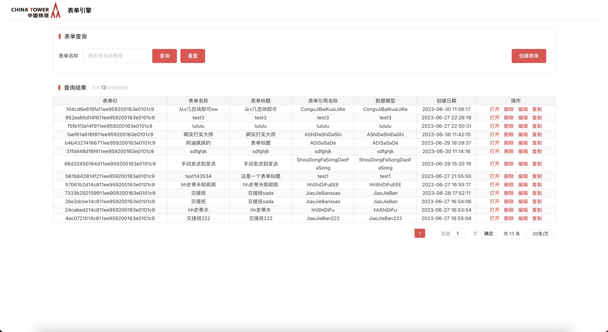
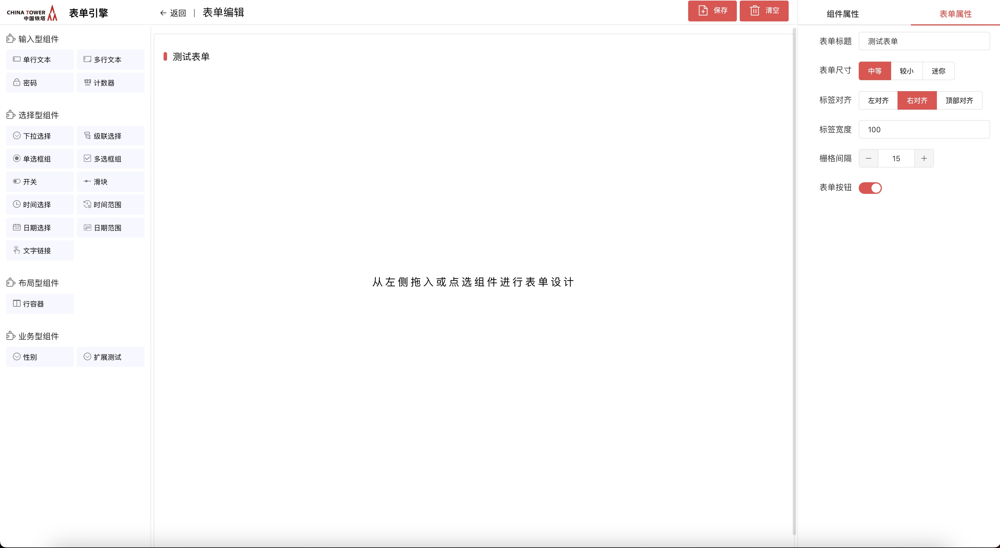
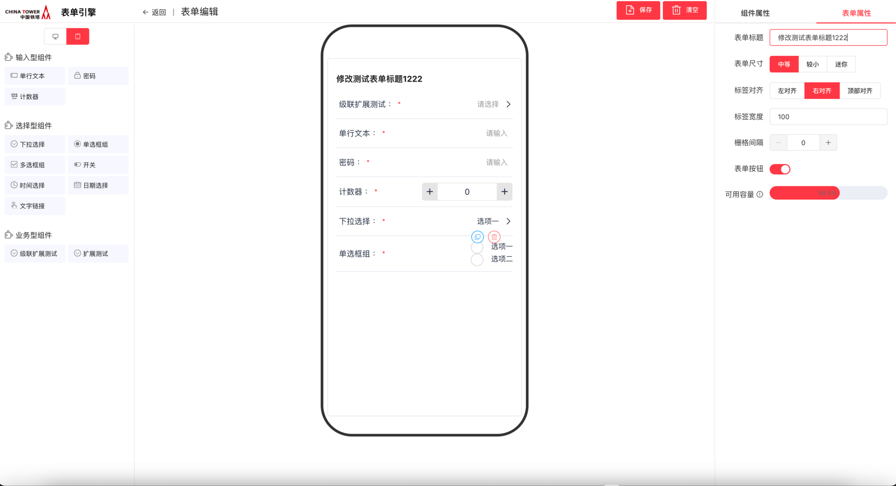
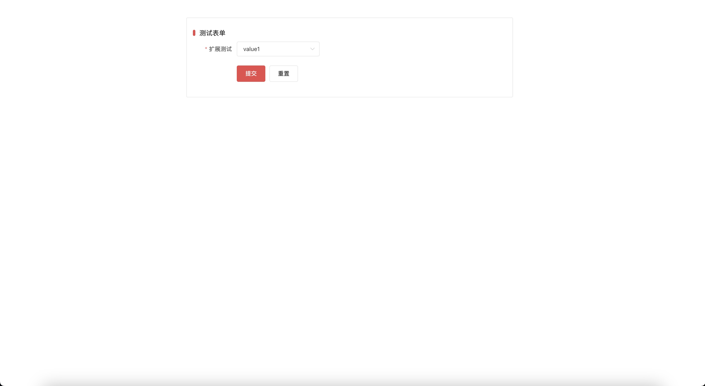
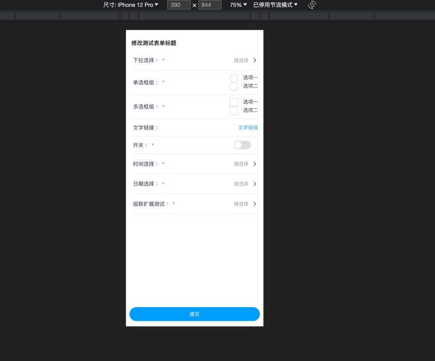
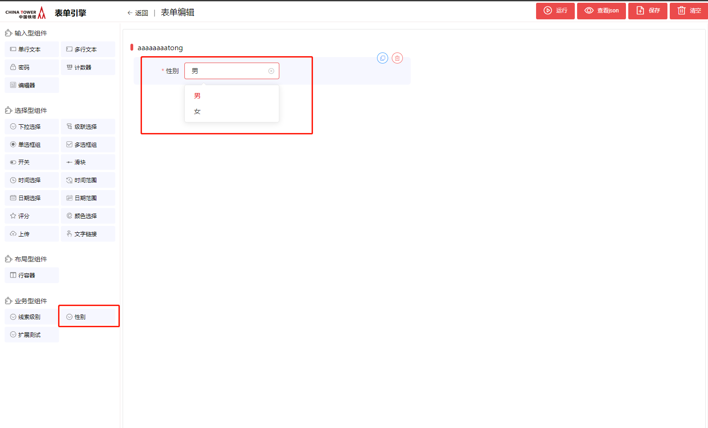
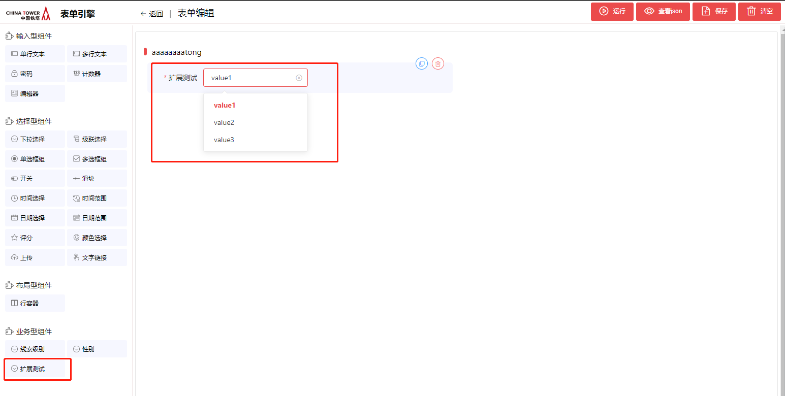

# 表单引擎

2023年6月

## 功能发布记录

| 日期       | 版本 | 变更说明                                                     | 作者   |
| ---------- | ---- | ------------------------------------------------------------ | ------ |
| 2023-06-21 | 1.0  | 初始版本                                                     | 关启芃 |
| 2023-08-18 | 2.0  | 增加表单项容量计算，增加版本溯源，增加表单禁用功能。涉及到数据库结构变化，需使用sql重新创建数据库 | 佟林朔 |
| 2023-09-15 | 3.0  | 增加表单引擎移动端组件集成步骤                               | 庄子义 |

### 审阅人

## 重要通知

暂无

## 组件描述

基于铁塔UI和前端框架的表单引擎，支持铁塔前端框架表单控件，包括文本框、多行文本框等多种类的控件元素，提供基于SDK方式的私有化部署和控件元素扩展的能力，包含表单编辑器，支持拖拉拽的方式创建表单

### 组件建设目标

增加表单引擎组件，快速使用，快速接入

### 读者

应用系统开发人员

### 参考资料

无

### 术语定义

| 序号 | 简称/术语 | 说明                                                         |
| ---- | --------- | ------------------------------------------------------------ |
| 1    | 表单引擎  | 表单引擎是一种用于创建、渲染和处理表单的软件工具或库。它提供了一套功能和接口，使开发人员能够以编程方式定义表单字段、验证规则和表单布局，并生成用户界面以收集用户输入。表单引擎通常提供数据绑定、校验、错误处理和表单提交等功能，简化了表单开发的工作流程。它们可以与各种应用程序、网站和框架集成，从而加快表单开发的速度和效率。 |
| 2    | 复制表单  | 继承当前模型的所有表单项，共用数据表，相当于拆分出一个新的模型版本，编辑新版本模型不会影响到父版本。 |
| 3    | 重建表单  | 针对数据库行容量有限的解决方案，当编辑表单提示行容量已满时，建议使用重建表单功能，相当于新建一个包含当前模型所有表单项的表单，数据库会创建一张新的数据表。 |
| 4    | 禁用表单  | 禁用的表单不允许编辑                                         |

### 适用范围

- 用于简化各种表单代码编写，如联系表单、注册表单、调查表等。通常包括数据验证、字段映射和数据存储功能。

## 快速入门

### 公有版

暂无

### 私有版

## 操作指南

### 公有版功能介绍

暂无

### 私有版功能介绍

#### 前端组件

##### 组件引入

###### 在项目下使用npm install 引入表单引擎组件

```shell
npm install @ct/china-tower-form-engine@1.0.2 -registry http://10.38.77.5:8081/repository/npm-public
```

###### 集成移动端表单引擎组件

表单引擎1.0.2版本包含对移动端的适配，只需要集成 [移动端开发框架](http://mid.chinatowercom.cn:18080/appGuide/guide/quickstart.html)即可

###### 在项目main.js处引入依赖

```javascript
import Vue from 'vue'
import App from './App.vue'
import router from './router'
import ChinaTowerUI from '@ct/china-tower-ui'
import ElementUI from 'element-ui'
import axios from 'axios'
import FormEngine from '@ct/china-tower-form-engine'

Vue.use(ElementUI)
Vue.use(ChinaTowerUI)

Vue.use(FormEngine)

Vue.config.productionTip = false
Vue.prototype.$axios = axios

const store = FormEngine.store
new Vue({
  store,
  router,
  render: h => h(App)
}).$mount('#app')
```

###### 别名及样式配置

安装copy-webpack-plugin插件，将依赖包内的静态文件导入本地

```shell
npm install copy-webpack-plugin
```

在vue.config.js文件中进行copy-webpack-plugin插件和别名转义的配置

```javascript
const CopyWebpackPlugin = require('copy-webpack-plugin')
  configureWebpack: {
    resolve: {
      alias: { // 配置别名
        Vue: 'vue',
        VueRouter: 'vue-router',
        ELEMENT: 'element-ui'
      }
    },
    plugins: [
      new CopyWebpackPlugin({ // 配置copy-webpack-plugin插件
        patterns: [
          {
            from: 'node_modules/@ct/china-tower-form-engine/dist/img',
            to: 'js/img',
            toType: 'dir'
          },
          {
            from: 'node_modules/@ct/china-tower-form-engine/dist/static/',
            to: 'static/',
            toType: 'dir'
          }
        ]
      })
    ]
  }
```

###### 引入样式

在入口index.html的head标签内使用引入样式

```html
<link href="/static/element-ui/theme-chalk/index.css" rel="stylesheet">
```

###### 路由配置

```javascript
import Vue from 'vue'
import VueRouter from 'vue-router'
import HomeView from '../views/HomeView.vue'

Vue.use(VueRouter)

const routes = [
  {
    path: '/',
    name: 'form_engines_manage',
    component: HomeView
  },
  // {
  //   path: '/',
  //   name: 'form_engines_manage',
  //   component: () => import('../views/ManageView.vue') // 管理页面源码
  // },
  {
    path: '/edit/:uuid',
    name: 'form_engines_edit', // 页面由manage跳到edit使用了根据name跳转，因此若使用默认的ct-form-manage,此处name应填写form_engines_edit
    component: () => import('../views/EditView.vue'),
    props: true
  },
  {
    path: '/ct-parser/:uuid',
    name: 'form_engines_parser', // 页面由manage跳到parser使用了根据name跳转，因此若使用默认的ct-form-manage,此处name应填写form_engines_parser
    component: () => import('../views/ParserView.vue'),
    props: true
  }
]

const router = new VueRouter({
  routes
})

export default router
```

##### 组件使用

可直接在vue项目中使用<ct-manage-form>,<ct-edit-form>,<ct-parser>标签引入表单引擎组件

```javascript
<template>
  <div class="manage">
    <ct-manage-form></ct-manage-form>
  </div>
</template>

<script>

export default {
  name: 'HomeView'
}
</script>
<style scoped></style>
```

##### 代理配置

表单引擎组件中使用了默认的管理接口。 接口请求一律以`/form-engines`作为开头，请在集成项目中避免使用如上开头的接口，并为其配置代理。

###### 在vue.config.js中的代理配置

```javascript
module.exports = {
  devServer: {
    open: false, // 是否自动启动浏览器
    host: '0.0.0.0',
    port: 8080, // 前端服务端口
    proxy: {
      '/form-engines': { // 将以/form-engines开头的请求代理到代理服务器地址
        target: 'http://127.0.0.1:19998', // 集成了表单引擎后端sdk的服务地址
        logLevel: 'debug'
      }
    }
  }
}
```

###### 在nginx中的代理配置

```none
location /form-engines/ {
  proxy_pass http://127.0.0.1:19998/form-engines/; // 集成了表单引擎后端sdk的服务地址
}
```

##### 表单引擎组件介绍

表单引擎共提供三个组件分别为ct-manage-form,ct-edit-form,ct-parser

##### ct-manage-form 组件介绍

ct-manage-form 组件是表单引擎中的管理页面，它主要负责表单的增删改查，是表单引擎的入口



|      | 该组件将提供相应源码，各项目组可按照后端sdk提供的接口，根据实际业务情况进行修改 |
| ---- | ------------------------------------------------------------ |
|      |                                                              |

##### ct-edit-form 组件介绍

ct-edit-form 组件是表单引擎中的表单编辑页面，它主要负责编辑表单样式

桌面版样式：



移动端样式：



- 组件提供的参数

| 参数              | 含义                                                         | 默认值                                                       | 可选值           |
| ----------------- | ------------------------------------------------------------ | ------------------------------------------------------------ | ---------------- |
| uuid              | 表单模型的#uuid值，将根据该值对表单内容进行更改              | -                                                            | -                |
| mode              | 组件的展示模式，针对不同受众对可配置属性与展示项进行限制(该属性随需求细化会做更改) | custom                                                       | custom/developer |
| initExternal      | 左侧菜单加载扩展组件                                         | true                                                         | true/false       |
| showAllComponents | 左侧菜单展示所有组件                                         | false                                                        | true/false       |
| showComponents    | 左侧菜单展示的组件,当showAllComponents为false时生效。input 为输入型组件,select为选择型组件,layout为布局型组件,business为业务型组件 | {input: ['单行文本', '多行文本', '密码', '计数器'],select: ['下拉选择', '级联选择', '单选框组', '多选框组',  '开关', '滑块', '时间选择', '时间范围', '日期选择', '日期范围', '文字链接'],layout:  ['行容器'],business: ['性别', '扩展测试']} | -                |

- 组件提供的事件

| 事件名称   | 说明           | 回调参数         |
| ---------- | -------------- | ---------------- |
| addItem    | 新增组件时触发 | (item, itemList) |
| copyItem   | 复制组件时触发 | (item, itemList) |
| deleteItem | 删除组件时触发 | (item, itemList) |

##### ct-parser 组件介绍

ct-parser 组件是表单引擎中的渲染组件，配置完毕的表单最终通过该组件进行渲染

桌面版样式：



移动端样式：



|      | 开发者应将该组件灵活引入，以实现动态表单生成的效果 |
| ---- | -------------------------------------------------- |
|      |                                                    |

- 组件提供的参数

| 参数              | 含义                                              | 默认值 | 可选值     |
| ----------------- | ------------------------------------------------- | ------ | ---------- |
| uuid              | 表单模型的#uuid值，将根据该值渲染对应表单         | -      | -          |
| defaultSubmit     | 将提交数据到表单引擎数据表内,使用submit事件时生效 | true   | true/false |
| defaultSubmitTips | 当defaultSubmit为true时，展示提交后的状态信息     | true   | true/false |

- 组件提供的事件

| 事件名称     | 说明                                               | 回调参数                                                     |
| ------------ | -------------------------------------------------- | ------------------------------------------------------------ |
| submit       | 提交时触发                                         | (event: Event)                                               |
| beforeLoad   | 表单加载前触发                                     | (event: Event)                                               |
| afterLoad    | 表单加载后触发                                     | (event: Event)                                               |
| beforeSubmit | 点击提交按钮后, 在表单数据提交到后端接口前触发     | (data: Map), 表单数据, 如: {"userName": "张三", "gender": "女"} |
| afterSubmit  | 点击提交按钮后, 在表单数据成功提交到后端接口后触发 | (data: Map), 表单数据, 如: {"userName": "张三", "gender": "女"} |

- 组件提供的方法

| 方法名       | 说明                                            | 参数                                                         | 返回值  |
| ------------ | ----------------------------------------------- | ------------------------------------------------------------ | ------- |
| getFormRef   | 获取表单的ref                                   | -                                                            | object  |
| getFormModel | 获取表单的模型数据                              | -                                                            | object  |
| getFormItem  | 获取表单项el-form-item对象                      | 表单字段id(表单编辑时的字段名, 如: DanXingWenBen101)         | object  |
| getFormEl    | 获取表单元素对象, 如: ct-input, ct-select等对象 | 表单字段id(表单编辑时的字段名, 如: DanXingWenBen101)         | object  |
| validForm    | 校验表单，检验成功后进行回调函数                | callback 回调函数                                            | boolean |
| fillFormData | 填充表单默认数据                                | object ⇒ {model: "data" …} ,传入对象:属性名为表单项绑定的model，值为对应该项的值 | -       |
| resetForm    | 重置表单                                        | -                                                            | -       |

#### 字典下拉控件

|      | 需要手动创建字典相关数据库表，具体使用参考字典组件。 |
| ---- | ---------------------------------------------------- |
|      |                                                      |

- 在配置中增加chinatower.plugin.form.engines.external配置

list结构，每个value为字典类型表的字典类型，每个字典类型对应一个下拉控件，即可在表单编辑器中拖拽使用

```yaml
chinatower:
  plugin:
    form:
      engines:
        external:
          dict:
            - sex
            - xianshuojibi
```

- 效果图



#### 表单控件扩展

|      | 需要引入前后端SDK。 |
| ---- | ------------------- |
|      |                     |

- 在启动类中增加@EnableFormEngineExternal注解

EnableFormEngineExternal注解支持内部和外部扫描

例：

```java
package com.chinatower.cloud.examples.form;

import com.chinatower.cloud.starter.form.engine.external.EnableFormEngineExternal;
import org.springframework.boot.SpringApplication;
import org.springframework.boot.autoconfigure.SpringBootApplication;

@SpringBootApplication
@EnableFormEngineExternal
public class FormEngineExamplesApplication {

    public static void main(String[] args) {
        SpringApplication.run(FormEngineExamplesApplication.class, args);
    }

}
```

- 编写扩展类

以增加下拉框为例：需要实现ExternalItemCreator接口，实现create方法，返回值需要派生自ExternalItemParam类

```java
package com.chinatower.cloud.examples.form.controller;

import com.chinatower.cloud.starter.form.engine.external.FormItemData;
import com.chinatower.cloud.starter.form.engine.external.builder.ExternalItemCreator;
import com.chinatower.cloud.starter.form.engine.external.builder.ExternalSelectItemParam;
import org.springframework.beans.factory.annotation.Autowired;
import org.springframework.core.env.Environment;

import java.util.ArrayList;
import java.util.List;

public class TestFormEnginesExtends implements ExternalItemCreator {

    @Autowired
    private Environment environment;
    @Override
    public ExternalSelectItemParam create() {

        System.out.println(environment.getActiveProfiles());
        ExternalSelectItemParam param=new ExternalSelectItemParam();
        param.setName("扩展测试");
        List<FormItemData> dataList=new ArrayList<>();
        dataList.add(new FormItemData("value1","0",true));
        dataList.add(new FormItemData("value2","1",false));
        dataList.add(new FormItemData("value3","2",false));
        param.setDataList(dataList);
        return param;
    }

}
```

|      | 基于ExternalItemCreator接口实现的派生类默认是一个spring bean，支持ioc，例中ExternalSelectItemParam是下拉控件的返回值 |
| ---- | ------------------------------------------------------------ |
|      |                                                              |

- 效果展示



## API参考

### 业务表的增删改查接口

#### 1. 新增数据

**请求类型**

POST

**请求 URL**

/form-engines/data/insert

**请求参数**

| 请求参数       | 位置 | 类型   | 是否必须 | 含义                 | 备注 |
| -------------- | ---- | ------ | -------- | -------------------- | ---- |
| #uuid          | body | string | 是       | 表单模型数据的唯一id |      |
| fields[].#uuid | body | string | 是       | 表单项数据的唯一id   |      |
| fields[].value | body | object | 是       | 表单项的值           |      |

```bash
curl 'http://127.0.0.1:8080/form-engines/data/insert' -H 'Content-Type: application/json;charset=UTF-8' -d '{
    "#uuid": "f66c03c813ee11ee959200163e0101c9",
    "fields": [
        {
            "#uuid": "fea78c0913ee11ee959200163e0101c9",
            "value": "1"
        },
        {
            "#uuid": "fea792e013ee11ee959200163e0101c9",
            "value": "1"
        },
        {
            "#uuid": "fea7988213ee11ee959200163e0101c9",
            "value": "1"
        }
    ]
}'
```

| 返回参数    | 含义                     | 备注                  |
| ----------- | ------------------------ | --------------------- |
| resultStat  | 处理结果状态             | success:000;error:999 |
| failCode    | 处理失败指定具体错误明细 |                       |
| mess        | 处理结果返回信息         |                       |
| callBack    | 处理结果回调函数         |                       |
| data        | 处理完成返回数据         |                       |
| redirectURL | 处理完成返回重定向地址   |                       |

```json
{
    "resultStat": "000",
    "failCode": null,
    "mess": "数据保存成功",
    "callBack": null,
    "data": "",
    "redirectURL": null
}
```

#### 2. 查询数据

**请求类型**

GET

**请求 URL**

/form-engines/data/page

**请求参数**

| 请求参数    | 位置 | 类型    | 是否必须 | 含义                 | 备注 |
| ----------- | ---- | ------- | -------- | -------------------- | ---- |
| formId      | url  | string  | 是       | 表单模型数据的唯一id |      |
| currentPage | url  | integer | 否       | 分页信息 默认1       |      |
| pageSize    | url  | integer | 否       | 分页信息 默认20      |      |

**返回参数**

| 返回参数    | 含义                     | 备注                  |
| ----------- | ------------------------ | --------------------- |
| resultStat  | 处理结果状态             | success:000;error:999 |
| failCode    | 处理失败指定具体错误明细 |                       |
| mess        | 处理结果返回信息         |                       |
| callBack    | 处理结果回调函数         |                       |
| data        | 处理完成返回数据         |                       |
| redirectURL | 处理完成返回重定向地址   |                       |

**示例**

**请求示例**

```bash
curl 'http://127.0.0.1/form-engines/data/page?formId=f66c03c813ee11ee959200163e0101c9?currentPage=1&pageSize=5'
```

**返回示例**

```json
{
    "resultStat": "000",
    "failCode": null,
    "mess": null,
    "callBack": null,
    "data": {
        "total": 15,
        "list": [
            {
                "DanXingWenBen103_cd00": "3",
                "update_time": "2023-06-26T16:42:50",
                "create_time": "2023-06-26T16:41:35",
                "MiMa102_afa9": "2",
                "id": "424bf9dd13fd11ee959200163e0101c9",
                "DanXingWenBen101_e328": "1"
            },
            {
                "DanXingWenBen103_cd00": "1",
                "create_time": "2023-06-27T14:00:44",
                "MiMa102_afa9": "1",
                "id": "f383d04714af11ee959200163e0101c9",
                "DanXingWenBen101_e328": "1"
            },
            {
                "DanXingWenBen103_cd00": "1",
                "create_time": "2023-06-27T14:00:12",
                "MiMa102_afa9": "1",
                "id": "e05620a014af11ee959200163e0101c9",
                "DanXingWenBen101_e328": "1"
            },
            {
                "DanXingWenBen103_cd00": "1",
                "create_time": "2023-06-27T14:00:08",
                "MiMa102_afa9": "1",
                "id": "ddffc8f414af11ee959200163e0101c9",
                "DanXingWenBen101_e328": "1"
            },
            {
                "DanXingWenBen103_cd00": "1",
                "create_time": "2023-06-27T14:00:04",
                "MiMa102_afa9": "1",
                "id": "dbafecbc14af11ee959200163e0101c9",
                "DanXingWenBen101_e328": "1"
            }
        ],
        "pageNum": 1,
        "pageSize": 5,
        "size": 5,
        "startRow": 1,
        "endRow": 5,
        "pages": 3,
        "prePage": 0,
        "nextPage": 2,
        "isFirstPage": true,
        "isLastPage": false,
        "hasPreviousPage": false,
        "hasNextPage": true,
        "navigatePages": 8,
        "navigatepageNums": [
            1,
            2,
            3
        ],
        "navigateFirstPage": 1,
        "navigateLastPage": 3
    },
    "redirectURL": null
}
```

#### 3. 更新数据

**请求类型**

PATCH

**请求URL**

/form-engines/data/update

**请求参数**

| 请求参数       | 位置 | 类型   | 是否必须 | 含义                 | 备注                          |
| -------------- | ---- | ------ | -------- | -------------------- | ----------------------------- |
| formId         | url  | string | 是       | 表单模型数据的唯一id |                               |
| id             | body | string | 是       | 业务表数据的唯一id   |                               |
| 其他业务表字段 | body | string | 否       | 业务表对应字段       | 非全量更新,只更新请求体内字段 |

**返回参数**

| 返回参数    | 含义                     | 备注                  |
| ----------- | ------------------------ | --------------------- |
| resultStat  | 处理结果状态             | success:000;error:999 |
| failCode    | 处理失败指定具体错误明细 |                       |
| mess        | 处理结果返回信息         |                       |
| callBack    | 处理结果回调函数         |                       |
| data        | 处理完成返回数据         |                       |
| redirectURL | 处理完成返回重定向地址   |                       |

**示例**

**请求示例**

```bash
curl -X PATCH 'http://127.0.0.1:8080/form-engines/data/update?formId=f66c03c813ee11ee959200163e0101c9' -H 'Content-Type: application/json' -d '{
    "DanXingWenBen103_cd00": "6",
    "MiMa102_afa9": "6",
    "id": "424bf9dd13fd11ee959200163e0101c9",
    "DanXingWenBen101_e328": "6"
}'
```

**返回示例**

```json
{
    "resultStat": "000",
    "failCode": null,
    "mess": "数据修改成功",
    "callBack": null,
    "data": "",
    "redirectURL": null
}
```

#### 4. 删除数据

**请求类型**

DELETE

**请求 URL**

/form-engines/data/delete

**请求参数**

| 请求参数   | 位置 | 类型    | 是否必须 | 含义                 | 备注 |
| ---------- | ---- | ------- | -------- | -------------------- | ---- |
| formId     | url  | string  | 是       | 表单模型数据的唯一id |      |
| dataId     | url  | string  | 是       | 业务表数据的唯一id   |      |
| safeDelete | url  | boolean | 否       | 是否启用安全删除     |      |

**返回参数**

| 返回参数    | 含义                     | 备注                  |
| ----------- | ------------------------ | --------------------- |
| resultStat  | 处理结果状态             | success:000;error:999 |
| failCode    | 处理失败指定具体错误明细 |                       |
| mess        | 处理结果返回信息         |                       |
| callBack    | 处理结果回调函数         |                       |
| data        | 处理完成返回数据         |                       |
| redirectURL | 处理完成返回重定向地址   |                       |

**示例**

- 请求示例

```bash
curl -X DELETE '127.0.0.1:8080/form-engines/data/delete?formId=f66c03c813ee11ee959200163e0101c9&dataId=424bf9dd13fd11ee959200163e0101c9'
```

- 返回示例

```json
{
    "resultStat": "000",
    "failCode": null,
    "mess": "数据删除成功",
    "callBack": null,
    "data": "",
    "redirectURL": null
}
```

### 表单模型操作

### 复制/拆分新版本/基于原有表单模型的业务表创建新的表单模型

**请求类型**

POST

**请求 URL**

/form-engines/addBaseOnFormModel

**请求参数**

| 请求参数 | 位置 | 类型   | 是否必须 | 含义                 | 备注 |
| -------- | ---- | ------ | -------- | -------------------- | ---- |
| formId   | body | string | 是       | 基于表单模型的id     |      |
| name     | body | string | 是       | 要创建的表单模型名称 |      |

**返回参数**

| 返回参数    | 含义                     | 备注                  |
| ----------- | ------------------------ | --------------------- |
| resultStat  | 处理结果状态             | success:000;error:999 |
| failCode    | 处理失败指定具体错误明细 |                       |
| mess        | 处理结果返回信息         |                       |
| callBack    | 处理结果回调函数         |                       |
| data        | 创建的表单模型id         |                       |
| redirectURL | 处理完成返回重定向地址   |                       |

**示例**

- 请求示例

```bash
curl '127.0.0.1:19998/form-engines/addBaseOnFormModel' -H 'Content-Type: application/x-www-form-urlencoded' -d 'formId=fc1f2706209711ee959200163e0101c9' -d 'name=%E8%87%AA%E5%8A%A9%E9%A4%90'
```

- 返回示例

```json
{
    "resultStat": "000",
    "failCode": null,
    "mess": null,
    "callBack": null,
    "data": "ff8eaaf6212011ee959200163e0101c9",
    "redirectURL": null
}
```

### 重建表单

**请求类型**

POST

**请求 URL**

/form-engines/rebuild

**请求参数**

| 请求参数 | 位置 | 类型   | 是否必须 | 含义                 | 备注 |
| -------- | ---- | ------ | -------- | -------------------- | ---- |
| formId   | body | string | 是       | 基于表单模型的id     |      |
| name     | body | string | 是       | 要创建的表单模型名称 |      |

**返回参数**

| 返回参数    | 含义                     | 备注                  |
| ----------- | ------------------------ | --------------------- |
| resultStat  | 处理结果状态             | success:000;error:999 |
| failCode    | 处理失败指定具体错误明细 |                       |
| mess        | 处理结果返回信息         |                       |
| callBack    | 处理结果回调函数         |                       |
| data        | 创建的表单模型id         |                       |
| redirectURL | 处理完成返回重定向地址   |                       |

**示例**

- 请求示例

```bash
curl '127.0.0.1:19998/form-engines/rebuild' -H 'Content-Type: application/x-www-form-urlencoded' -d 'formId=fc1f2706209711ee959200163e0101c9' -d 'name=%E8%87%AA%E5%8A%A9%E9%A4%90'
```

- 返回示例

```json
{
    "resultStat": "000",
    "failCode": null,
    "mess": null,
    "callBack": null,
    "data": "12ea2a753d6f11eeb44d00163e0101c9",
    "redirectURL": null
}
```

### 查询剩余行容量

**请求类型**

GET

**请求 URL**

/form-engines/getColumnSizeAvailable

**请求参数**

| 请求参数 | 位置 | 类型   | 是否必须 | 含义         | 备注 |
| -------- | ---- | ------ | -------- | ------------ | ---- |
| formId   | url  | string | 是       | 表单模型的id |      |

**返回参数**

| 返回参数    | 含义                     | 备注                  |
| ----------- | ------------------------ | --------------------- |
| resultStat  | 处理结果状态             | success:000;error:999 |
| failCode    | 处理失败指定具体错误明细 |                       |
| mess        | 处理结果返回信息         |                       |
| callBack    | 处理结果回调函数         |                       |
| data        | 剩余行容量               |                       |
| redirectURL | 处理完成返回重定向地址   |                       |

**示例**

- 请求示例

```bash
curl '127.0.0.1:19998/form-engines/getColumnSizeAvailable?formId=06566bf23c1711eeb44d00163e0101c9'
```

- 返回示例

```json
{
    "resultStat": "000",
    "failCode": null,
    "mess": null,
    "callBack": null,
    "data": 62263,
    "redirectURL": null
}
```

### 禁用/恢复表单

**请求类型**

POST

**请求 URL**

/form-engines/changeDisabledStatus

**请求参数**

| 请求参数 | 位置 | 类型    | 是否必须 | 含义                  | 备注 |
| -------- | ---- | ------- | -------- | --------------------- | ---- |
| formId   | url  | string  | 是       | 表单模型的id          |      |
| disabled | url  | boolean | 是       | true:禁用，false:恢复 |      |

**返回参数**

| 返回参数    | 含义                     | 备注                  |
| ----------- | ------------------------ | --------------------- |
| resultStat  | 处理结果状态             | success:000;error:999 |
| failCode    | 处理失败指定具体错误明细 |                       |
| mess        | 处理结果返回信息         |                       |
| callBack    | 处理结果回调函数         |                       |
| data        | 当前禁用状态             |                       |
| redirectURL | 处理完成返回重定向地址   |                       |

**示例**

- 请求示例

```bash
curl 'http://127.0.0.1:19998/form-engines/changeDisabledStatus?formId=12ea2a753d6f11eeb44d00163e0101c9&disabled=true'  -X 'POST'
```

- 返回示例

```json
{
    "resultStat": "000",
    "failCode": null,
    "mess": null,
    "callBack": null,
    "data": true,
    "redirectURL": null
}
```

### 本地方法

引入示例，查询数据接口

```java
package com.chinatower.cloud.examples.form.controller;

import com.chinatower.cloud.starter.form.engine.pojo.dto.FormEntity;
import com.chinatower.cloud.starter.form.engine.pojo.dto.FormItemEntity;
import com.chinatower.cloud.starter.form.engine.service.FormItemService;
import com.chinatower.cloud.starter.form.engine.service.FormService;
import com.chinatower.cloud.starter.form.engine.service.TableDataService;
import com.chinatower.framework.common_service.response.RespResult;
import com.github.pagehelper.PageInfo;
import com.github.pagehelper.page.PageMethod;
import org.springframework.beans.factory.annotation.Autowired;
import org.springframework.web.bind.annotation.*;

import java.util.*;

@RestController
@RequestMapping("/test")
public class DataServiceImportTest {


    @Autowired
    private FormService formService;

    @Autowired
    private FormItemService formItemService;

    @Autowired
    private TableDataService tableDataService;

    @GetMapping("/data/page")
    public RespResult dataSelectList(@RequestParam String formId, @RequestParam(defaultValue = "1") Integer currentPage,
                                     @RequestParam(defaultValue = "20") Integer pageSize) {
        FormEntity form = formService.getForm(formId);
        if(form == null) {
            return RespResult.FAIL("不存在此表单模型");
        }
        String tableName = form.getTableName();
        ArrayList<String> tableColumns = new ArrayList<>();
        for (FormItemEntity item : formItemService.listFormItem(formId)) {
            tableColumns.add(item.getTableColumn());
        }
        PageMethod.startPage(currentPage, pageSize);
        List<Map<String, Object>> result = tableDataService.selectAll(formId, tableName, tableColumns);
        return RespResult.SUCCESS(new PageInfo<>(result));
    }
}
```

### 配置全局删除策略

配置文件中增加如下

```yaml
chinatower:
  plugin:
    form:
      engines:
        form-safe-delete: true
        data-safe-delete: true
```

| 配置说明         | 含义                 | 备注                                      |
| ---------------- | -------------------- | ----------------------------------------- |
| form-safe-delete | 表单模型安全删除开关 | 默认为true,删除操作可回退，业务数据不丢失 |
| data-safe-delete | 业务数据安全删除开关 | 默认为true,删除操作可回退，业务数据不丢失 |

## SDK

2023/08/23 更新版本到3.0.6.2 : spring-cloud-starter-chinatower-3.0.6.2  `<dependency>    <groupId>com.chinatower.cloud</groupId>    <artifactId>spring-cloud-starter-chinatower-form-engine-hostself</artifactId>    <version>3.0.6.2</version> </dependency>`

@ct/china-tower-form-engine@1.0.2  `"dependencies": {    "@ct/china-tower-form-engine": "1.0.2", },`

## 网络要求

无

## 样例文件

 [form-engines-examples_v1.0.9.zip](../file/form-engines-examples_v1.0.9.zip) 