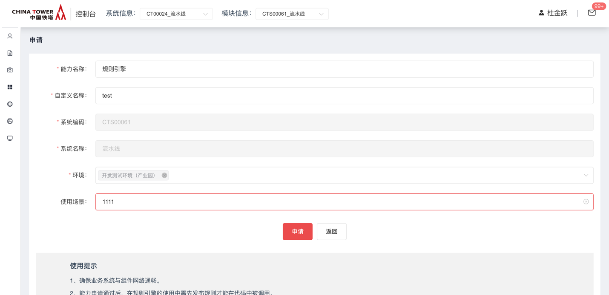
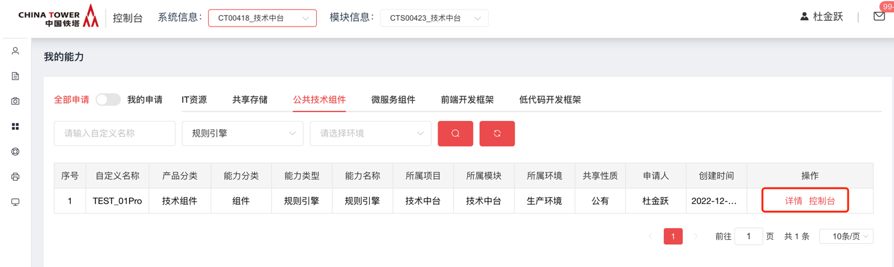
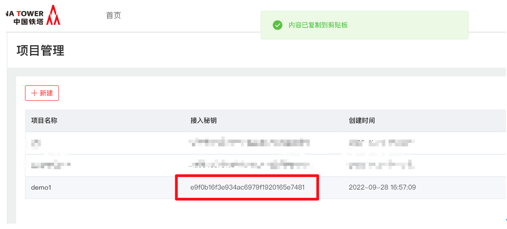

# 规则引擎

## 功能发布记录

| 版本 | 拟制/修改日期 | 拟制/修改人 | 修改记录 | 批准人 |
| ---- | ------------- | ----------- | -------- | ------ |
| 1.0  | 2022/11/10    | 周天啸      | 初版     |        |
|      |               |             |          |        |

## 重要通知

无

## 组件描述

规则引擎是一种嵌入在应用程序中的组件，它可以将业务规则从业务代码中剥离出来。使用预先定义好的语义规范来实现这些剥离出来的业务规则。规则引擎通过接受输入的数据，进行业务规则的评估，并做出业务决策。

### 应用场景

1.将规则代码从业务中抽离出来，实现业务规则的可视化管理，提高业务规则的可维护性和可扩展性；

2.规则中有一定的逻辑判断，判断中的部分条件经常改变，需要热更新，这些情况下可以使用规则引擎；

3.规则引擎适用于管理业务规则，例如定价策略、促销规则、折扣规则等。这使得业务人员能够通过配置规则而不是修改代码来调整系统行为。

### 建设目标

提升铁塔IT自主掌控能力，提高开发效率，降低编写重复代码的工作量。

### 特性

- 1、支持通过Web页面对项目、规则进行CRUD操作，操作简单，易上手；
- 2、提供规则集、决策表、决策树、评分卡、规则流等业务规则设计工具，从各个角度满足复杂业务规则设计的需要。提供了15大类，近40个小类的常用数学符号，可进行几乎所有类型的可视化的科学计算。
- 3、后台采用纯Java实现，运行时借鉴Rete了算法的优势，再结合中式规则引擎的特点，独创了一套自己的规则模式匹配算法，这套算法可以从根本上保证规则运行的效率，实现大量复杂业务规则计算时的毫秒级响应。
- 4、无论是单个规则文件、或是用户调用的规则包，都提供了完善的版本控制机制。对于规则文件来说只要有需要，可以回退到任何一个历史版本； 对于给用户调用的规则包，可以在不同的历史版本之间灵活切换。
- 

### 组件技术架构图


### 对科学计算的支持

URule-Engine提供了平方根、方根、乘方、分数、指数、对数、自然对数、绝对值、圆周率、向上取整、向下取整、极值、三角函数、反三角函数等15大类， 近40个小类的常用数学符号，这些数学符号可以在规则的动作定义部分当中， 可进行几乎所有类型的可视化的科学计算。

这些数学符号在规则动作中使用效果如下图所示：


### 规则设计器

URule-Engine提供了向导式规则集、脚本式规则集、决策表、决策树、评分卡、规则五种类型的业务规则设计工具。

## 快速入门

进入技术中台，选择产品 → 业务服务 → 规则引擎

点击 【申请】，填写自定义名称、选择环境，点击申请，等待运营人员审批

审批通过后可以在我的能力中看到规则引擎的控制台






## 操作指南

规则引擎是一种嵌入在应用程序中的组件，它可以将业务规则从业务代码中剥离出来，使用预先定义好的语义规范来实现这些剥离出来的业务规则。规则引擎通过接受输入的数据，进行业务规则的评估，并做出业务决策。如果我们的业务给出的是零散的逻辑规则，那么可以使用规则集来实现；如果给出的是表格形式的业务规则，那么可以直接使用对应的决策表来实现；如果需要对实体进行综合评分，则可以使用评分卡来实现；最后还可以通过规则流对一系列复杂的规则个体进行编排，将这个规则流作为实际业务规则调用入口，从而实现任意复杂的业务规则。

申请规则引擎能力之后，在我的能力中点击规则引擎控制台来 创建和编辑规则。

一、创建库文件

规则引擎提供了四种库文件类型，分别是变量库、产量库、动作库和参数库；

在一般情况下，我们仅使用变量库即可满足大部分的需求。

创建好库文件之后就可以在规则中使用了。

二、规则引擎提供了决策集、决策表、决策树、评分卡、决策流这四种规则类型，在业务场景中，使用决策集即可满足绝大部分的业务需求，最常用的也是决策集。决策集提供脚本式决策集和向导式决策集，通常使用的是向导式决策集。

创建好规则集，在规则集中点击变量库引入库文件

之后就可以编写具体的规则

三、编写完成之后需要对这个决策集进行测试，测试方法比较简单

进入规则列表，点击添加文件将编写好的规则添加

点击仿真测试输入参数即可测试决策集

测试无问题即可在代码中通过API接口来调用规则

### 环境要求

1. JDK1.8+
2. Maven3+
3. Spring-boot：2.2.4.RELEASE /Spring 5.2.3.RELEASE

### 客户端开发案例

- 导入变量库


> 根据所需，自定义对象信息
>
> 

- 在规则引擎页面配置好所需规则，如图：


#### 2023年10月10日上线新增功能

- 导入导出功能

该功能方便用户在测试环境测试完成的规则直接导入到准生产或者生产环境使用

导入导出不能导出具体规则，只能导入导出规则绑定的文件，所以具体规则还需要用户新建并绑定对应的文件

可以在文件或者分类上右键选择导出（单文件导出为xml格式后缀，批量导出为压缩包）

可以在分类上右键选择导入（支持多选导入，只能导入xml格式）


- 在线测试

在原有的仿真测试按钮旁边添加了在线测试功能。 在线测试是直接调用用户在使用规则引擎时的真实接口， 返回数据也完全一致，模拟更真实的调用场景， 不同的是，在线测试可以打印规则中配置的打印到控制台的内容


- 查看执行历史

在线测试按钮旁边新增按钮执行历史，可以查看对应的规则执行历史情况


#### 2023年10月10日上线新增动作

```
(说明，- 指出动作在何分类下可见)
1.方法 - 数学函数 - 四舍五入指定保留小数位
2.方法 - 数学函数 - 指数计算
3.方法 - 数学函数 - 平方根计算
4.方法 - 字符串 - json解析(取出指定字段)
**** 用.区分json层级
5.方法 - http请求 - get请求
6.方法 - http请求 - get请求带参数(url拼接传参，非body体)
7.方法 - http请求 - post请求
**** 注意：http请求均需要注意规则引擎对应的服务器是否与目标地址网络通畅
8.方法 - 通知类 - 短信通知
**** 短信通知需提前在技术中台申请短信组件才可以正常使用
9.方法 - 通知类 - 邮件通知
```

示例 

### API接口调用

**通过API接口调用规则，会记录在规则执行的历史记录列表中**

请求参数：

项目编码:



规则编码:


| 名称         | 数值                                                         |
| ------------ | ------------------------------------------------------------ |
| 请求方式     | POST                                                         |
| 对应的方法   | http://ip:port/edas-rule-client/api/exe                      |
| 请求类型     | application/json;charset=UTF-8                               |
| 方法参数     | `    {        "ruleCode":"testcustomer1", //规则编码        "params":{            //自定义参数            "netCategory1":"无线接入网",            "netCategory2":"2G",            "netCategory3":"BSC",            "netName":"QUJ16281"        },        "projectCode":"e9f0b16f3e934ac6979f1920165e7481" //项目编码    }` |
| 接口描述     | 项目中规则执行                                               |
| 返回结果样例 | `{    "code": 20000,    "message": "success",    "data": [        {            "name": "客户",            "type": "Custom",            "clazz": "com.bstek.vo.Customer",            "variables": [                {                    "name": "age",                    "label": "年龄",                    "type": "Integer",                    "defaultValue": "20",                    "act": "InOut"                }            ]        }    ] }` |
| 返回结果描述 | 返回结果中code为20000及为接口调用成功；返回值data中parameters包含接口输入参数和规则执行输出参数，获取输出参数时需要将接口输入参数过滤掉。 |

**指定项目和规则编码查询变量库接口**

请求参数：

项目编码:


规则编码:


| 名称         | 数值                                                         |
| ------------ | ------------------------------------------------------------ |
| 请求方式     | GET                                                          |
| 对应的方法   | http://ip:port/edas-rule-client/api/get/ruleLibraries?projectCode=xxx&ruleCode=xxx |
| 请求类型     | application/json;charset=UTF-8                               |
| 方法参数     | url传参 projectCode，ruleCode                                |
| 接口描述     | 根据项目秘钥及规则编码查询关联的变量库                       |
| 返回结果样例 | `{ "code": 20000, "message": "查询成功", "data": [ 	{ 		"name": "newData", 		"clazz": "com.test.newData", 		"fileName": "/技术中台/新动作测试.vl.xml", 		"type": "Variable", 		"variables": [ 			{ 				"name": "money", 				"label": "钱", 				"type": "BigDecimal" 			}, 			{ 				"name": "Decimal", 				"label": "小数位", 				"type": "Integer" 			}, 			{ 				"name": "result", 				"label": "结果", 				"type": "String" 			}, 			{ 				"name": "url", 				"label": "访问地址", 				"type": "String" 			}, 			{ 				"name": "params", 				"label": "请求参数", 				"type": "Map" 			}, 			{ 				"name": "httpResult", 				"label": "http请求结果集", 				"type": "String" 			}, 			{ 				"name": "timestamp", 				"label": "时间戳", 				"type": "String" 			}, 			{ 				"name": "nonce", 				"label": "随机数", 				"type": "String" 			}, 			{ 				"name": "token", 				"label": "token", 				"type": "String" 			}, 			{ 				"name": "number", 				"label": "数字", 				"type": "Integer" 			} 		] 	} ] }` |
| 返回结果描述 | 返回结果中code为20000及为接口调用成功                        |

**执行历史查询接口**

请求参数：

项目编码:


规则编码:


| 名称         | 数值                                                         |
| ------------ | ------------------------------------------------------------ |
| 请求方式     | GET                                                          |
| 对应的方法   | http://ip:port/edas-rule-client/api/get/history?projectCode=xxx&ruleCode=xxx?historyId=xxx |
| 请求类型     | application/json;charset=UTF-8                               |
| 方法参数     | url传参 projectCode，ruleCode                                |
| 接口描述     | 执行历史查询                                                 |
| 返回结果样例 | `{    "code": 20000,    "message": "查询成功",    "data": [        {            "id": "fa7a499f02c4468599ad22441497c976",            "projectName": "技术中台",            "projectCode": "be2a3c27590c4d8d96d80480d7d20096",            "ruleCode": "新动作测试",            "ruleName": "新动作测试",            "inputParams": "{\"money\":39}",            "outputParams": "{\"money\":\"39.0\"}",            "invokTime": 1695356885000,            "invokeTimeString": null        }    ] }` |
| 返回结果描述 | 返回结果中code为20000及为接口调用成功                        |

## 典型实践

无

## API参考

无

## SDK

无

## 网络要求

无

## 常见问题

无

## 样例文件

 [规则引擎demo.zip](../file/规则引擎demo.zip) 