# 认证授权

## 功能发布记录

| 日期       | 版本 | 变更说明           | 作者 |
| ---------- | ---- | ------------------ | ---- |
| 2022-11-24 | 1.0  | 初始版本           |      |
| 2023-03-28 | 1.1  | 补充集成4A-SDK内容 |      |

## 重要通知

无

## 组件描述

认证授权提供了4A认证申请流程，申请者可在此申请认证授权功能后，线上配置与4A的相关接口等信息。

## 快速入门

### 公有版组件申请

仅允许铁塔自有人员申请。 消费者登录技术中台首页，选择公共技术组件，点击”认证授权“。

 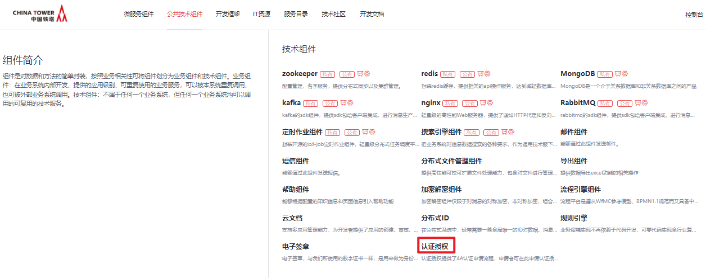 点击申请

 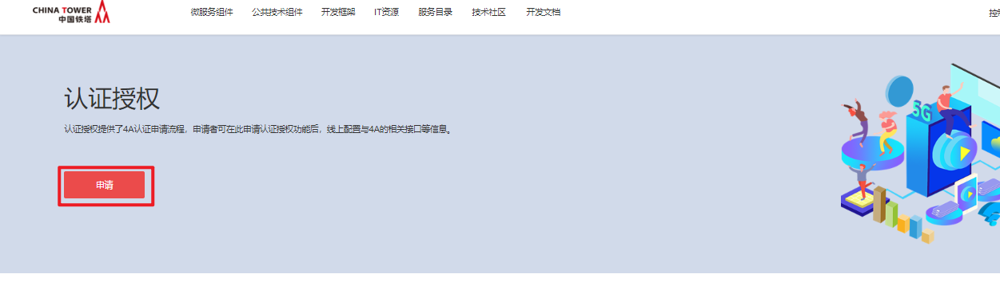 填写申请单，点击申请即可

 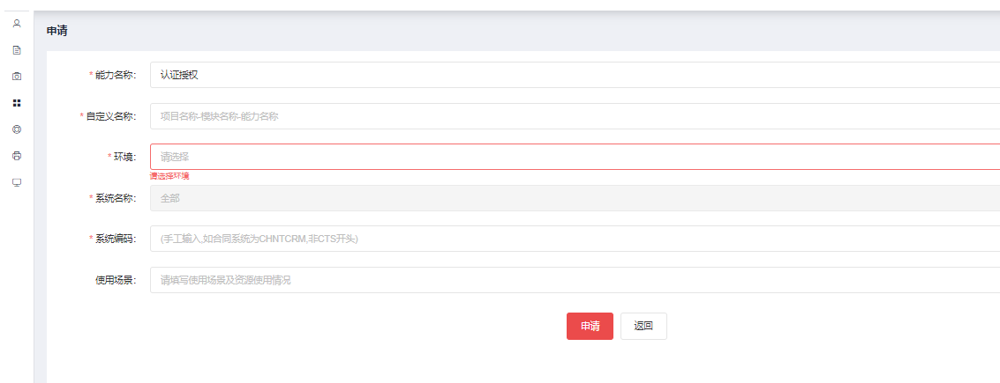 运营管理员审批通过后，在我的能力后输入正确的筛选条件，即可看到刚申请的能力。

 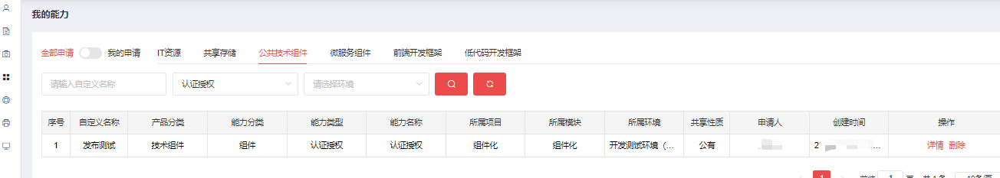 点击”详情“，可看到下发的密钥以及相关信息

### 私有版组件申请

仅允许铁塔自有人员申请。 消费者登录技术中台首页，点击”认证授权“,选择认证授权私有版。

 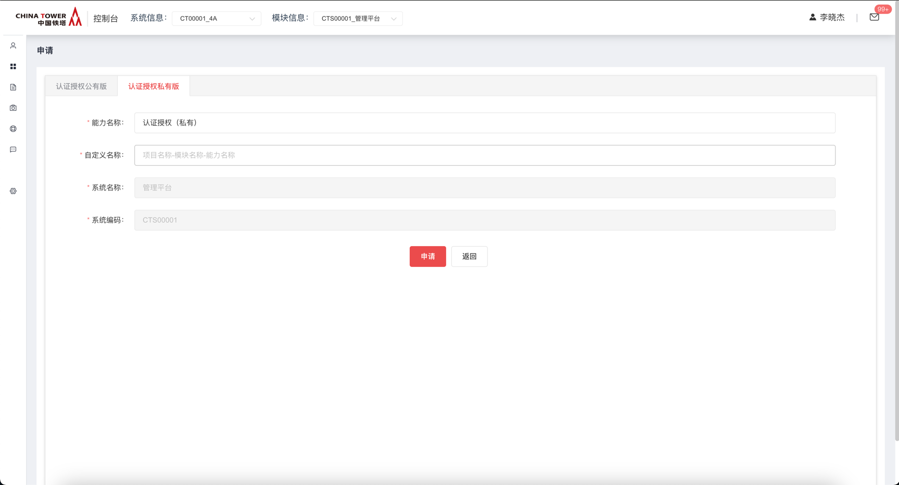

通过我的能力 → 能力详情 → 样例文件 → 解压后获得私有版组件部署工程包及使用手册

 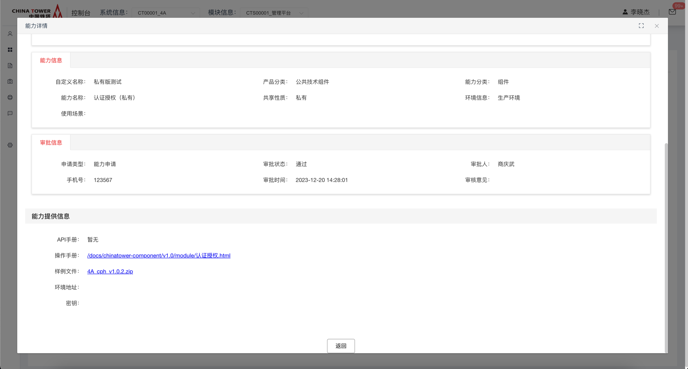

## 操作指南

登录技术中台后，选择“我的能力”左侧导航菜单，右侧主内容区域选择“公共技术组件”，能力名称为"认证授权"，操作一栏可看到”详情“按钮。

  点击”详情“，可看到下发的密钥以及相关信息

### 密钥使用说明

1、密钥说明：1）通用密钥（6#dPz>3F）即所有接口整串args加密的密钥，依然沿用原来的加密方式 2）专用密钥，4A通过各系统提供的密钥接收接口（《中国铁塔4A统一认证授权接口规范-V1.7》中2.3.11-appIdAndSecretSync），将密钥推送至该系统，这个密钥为该系统专用密钥，用于加密请求报文中的uuid和token。 3）加解密jar包参看《3des加密包》

## 典型实践

1.联系4A相关人员，填写“系统对接4A模板表”;

第一步：根据示例图片填写对接排期，表中红框中内容请按实际填写。（注：此处的应用编码等同于上述配置文件中的“spring.application.syscode”属性）

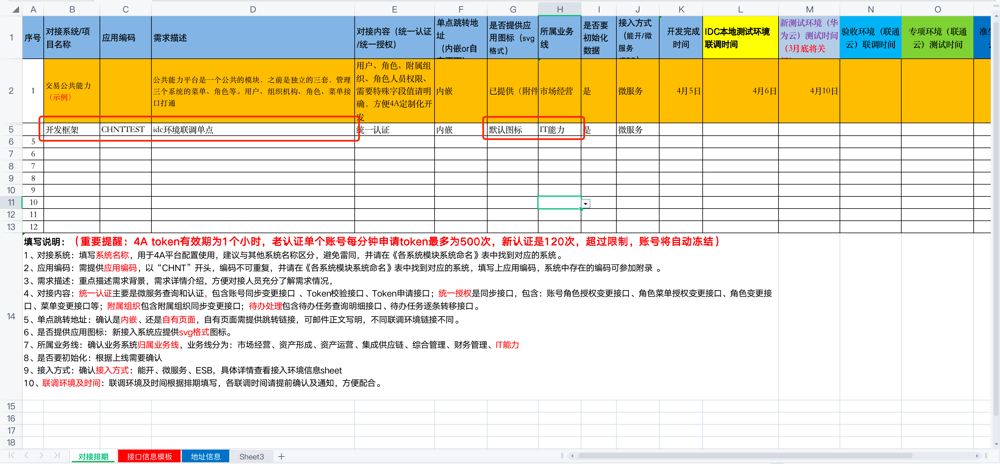

第二步：根据示例图片填写接口信息模板，表中红框中内容请按实际填写。 注：此处的服务编码等同于服务名； 接口地址中网关ip和服务名按实际情况填写，接口url无需修改。

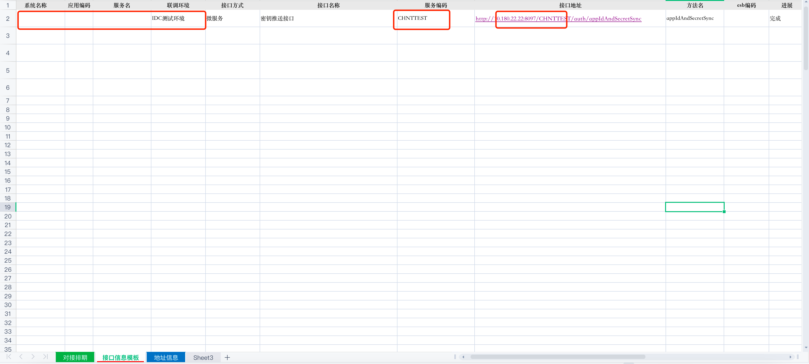

第三步：填写完成后提交至4A相关人员，请4A人员对接口进行配置

2.4A相关人员配置成功后，登录对应环境4A管理页面;

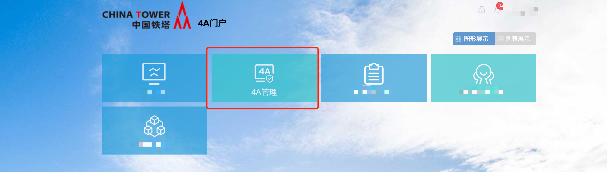

3.点击应用管理，应用资源管理;

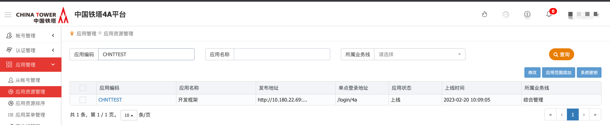

4.选择系统，点击编辑，图中框中信息按照实际情况填写，发布地址为服务地址;

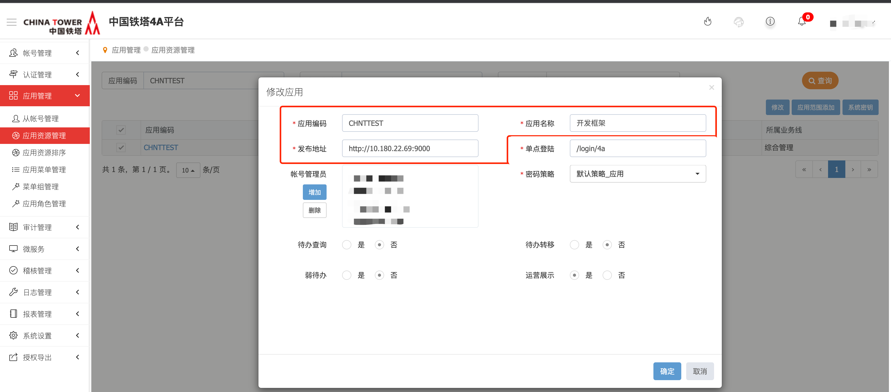

5.点击系统密钥，可查看系统密钥推送情况，当前密钥对应（步骤3）数据表中“app_secret”字段;

1. 申请认证授权组建能力后，在我的能力详情页面中展示的密钥，等同于第一次4A推送时的密钥。

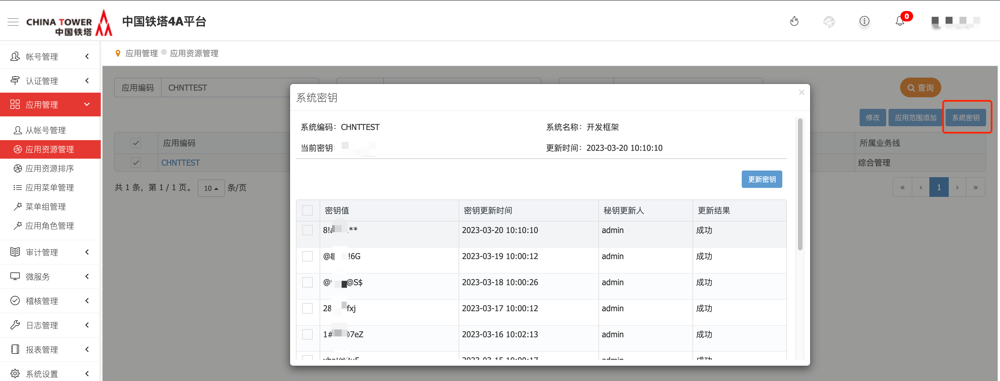

6.选择应用菜单管理，选择应用名称，点击查询，确认存在菜单;

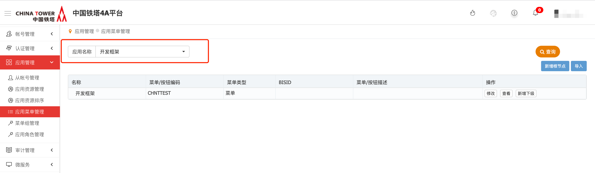

7.选择角色管理，点击新增按钮，可新增角色;

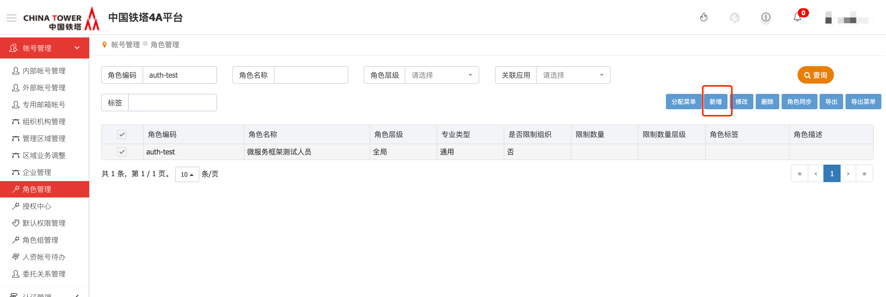

8.新增角色后，点击分配菜单，选择应用名称，勾选菜单，进行菜单分配;

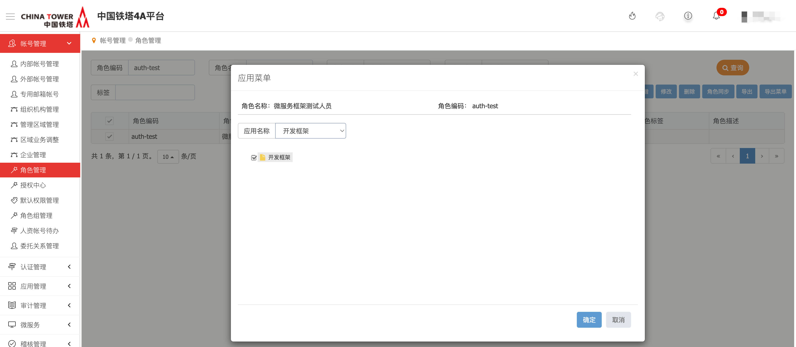

9.点击内部/外部账号管理，查询账号，选中后，点击角色分配;

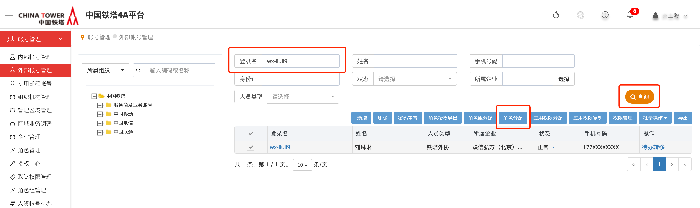

10.点击未分配，选择关联应用，点击查询，选择角色，点击绑定;

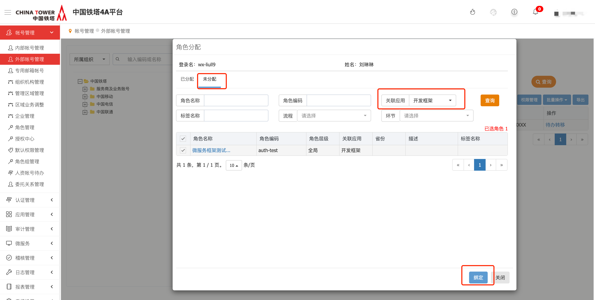

11.绑定成功后，对应环境4A登录该账号，即可使用此菜单能力。

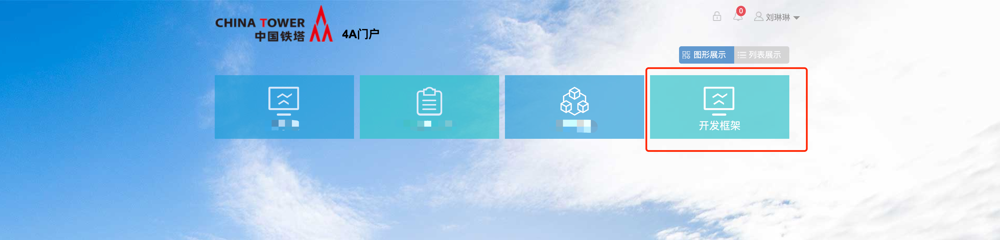

## API参考

无

## SDK

无

## 网络要求

无

## 常见问题

无

## 样例文件

无