# 超图GIS

SuperMap是一家专业的地理信息系统（GIS）软件。SuperMap的产品和服务涵盖了地图制作、空间分析、地图发布、大数据处理和可视化等多个领域，其产品被广泛应用于各个行业，帮助用户进行地理空间数据的管理、分析和决策支持。

## 功能发布记录

| 发布时间 | 功能分类 | 功能名称 | 说明 |
| -------- | -------- | -------- | ---- |
|          |          |          |      |

## 重要通知

无

## 组件描述

- 提供私有版SuperMap部署包和使用说明，实现地理空间数据管理、分析和决策支持。

## 支持功能

1. 提供基础能力预览，支持将原始平台提供的使用文档暴漏到消费者侧。
   - 提供多种地图前端展示示例，如专题图、空间分析等；
   - 提供地图可视化使用场景代码示例，如热力图、聚点图等；
   - 提供地图标绘/标注使用场景代码示例，如图形绘制、拖拽图形等；
   - 支持多种WebGIS客户端框架，OpenLayers、MapboxGL等。
 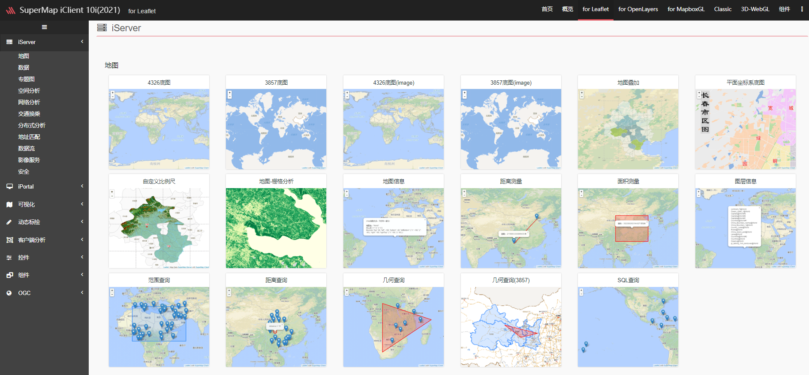
2. 提供封装好的后端工具依赖提升地图接入效率，降低学习成本，包括坐标转换、矢量切片、地图数据存储等接口。
   - 简化地图平台数据存储相关复杂数据结构的增、删、改、查接口；
   - 简化地图平台提供的服务地图接口，如坐标转换、面积量算、指定点串距离测算、获取矢量切片等。
 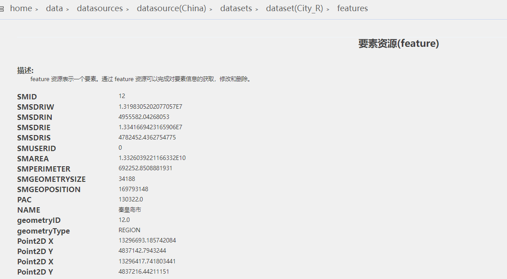 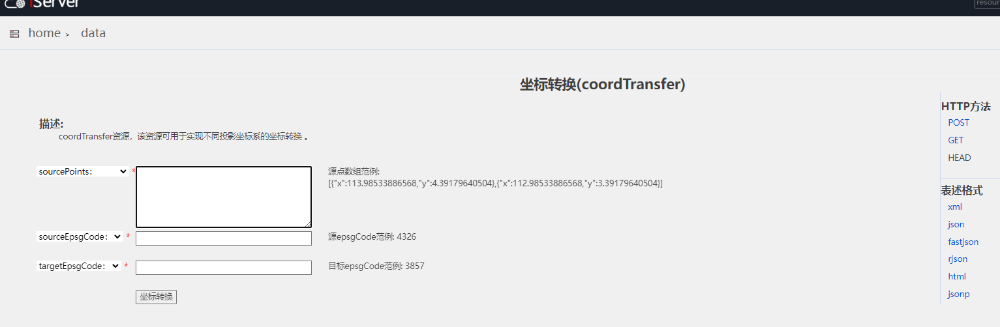
3. 提供封装好的前端工具依赖提升地图接入效率，降低学习成本，包括等多客户端统一接入、Vue封装等。
   - 提供多客户端统一入口依赖，包括OpenLayers、MapboxGL ，一次引入，多种使用；
   - 提供原始js转换为Vue的使用方式，统一标准，统一使用方式。
 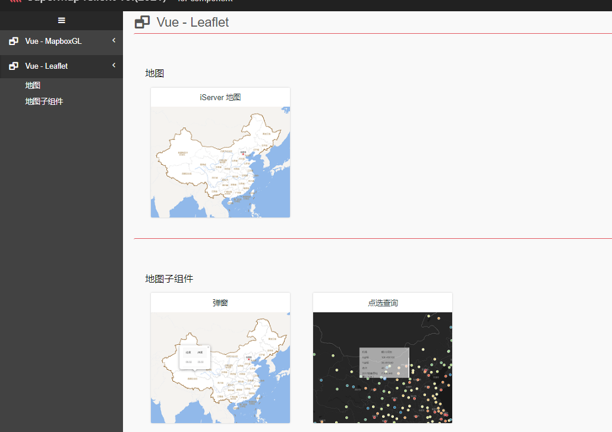 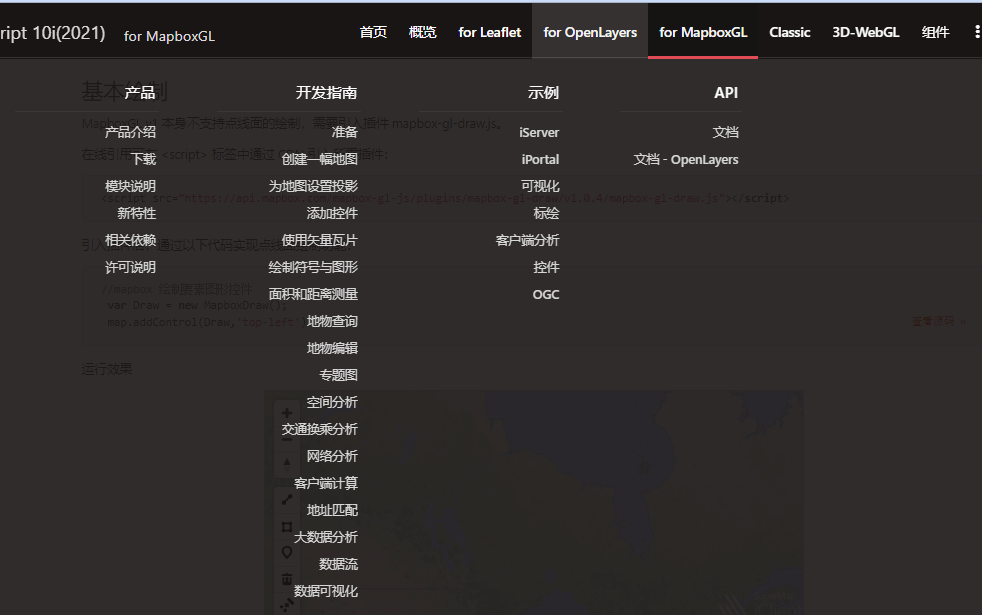
4. 基于超图地图管理服务，支持消费者二开后将地图以资源的形式在技术中台发布，提供地图示例，基本功能，API说明。
   - 提供地图仓库的功能，支持发布二次开发好的地图，减少重复地图功能的再建，支持地图发布、下线等操作；
   - 提供地图介绍功能，支持显示地图示例图、地图功能说明、上传地图使用文档、API文档等。
 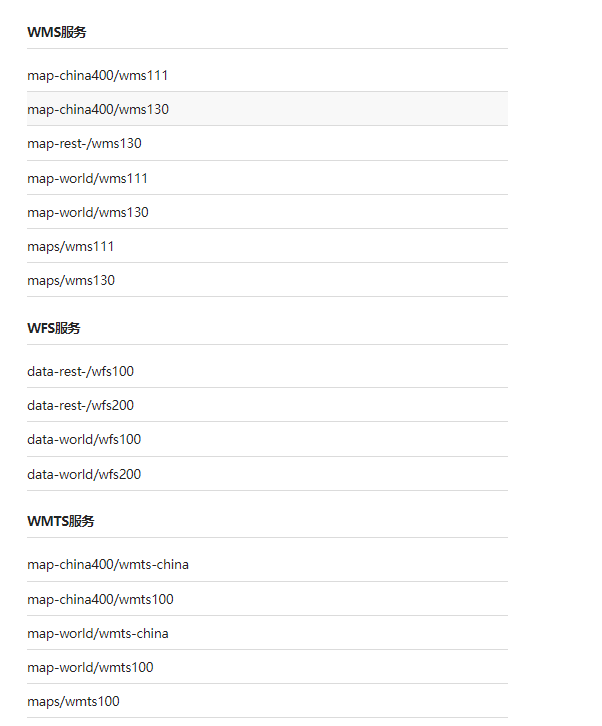 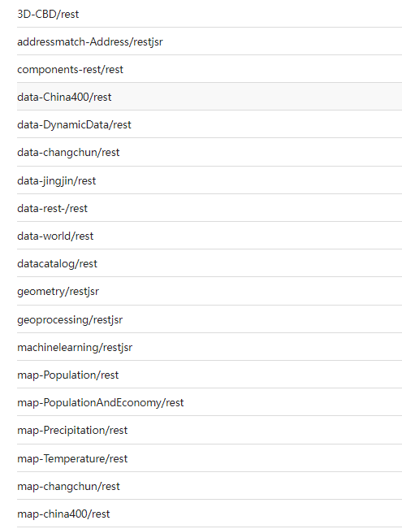
5. 提供多人在同一地图场景下协作能力，支持统一信息存储，标绘信息即时显示等功能。
   - 提供地图标绘、批注功能，允许标绘对象拖拽到地图中以及在地图中绘制点、线等信息；
   - 提供地图协作信息存储功能，支持将地图上的标绘信息、点信息、线信息统一存储；
   - 提供地图协作信息回显功能，支持将存储中的标绘信息、点信息、线信息回显到地图上；
   - 支持多人在同一地图上标绘、批注功能以及标绘后即时显示。
 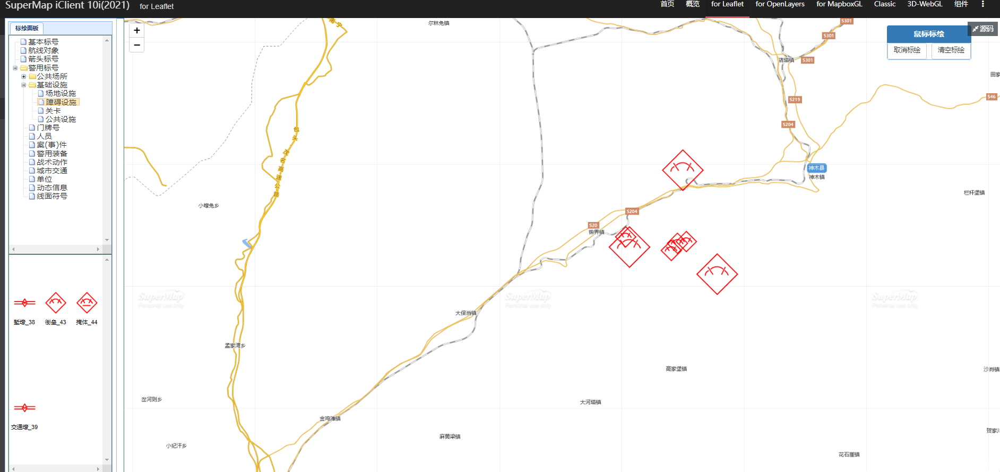

## 组件集成

1. 解压 supermap-iserver-10.2.1-windows-x64.zip 文件
2. 双击setup.exe文件进行安装 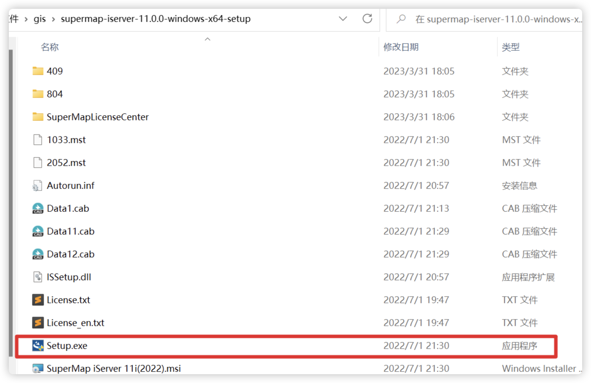
3. 安装之后的目录结构如下 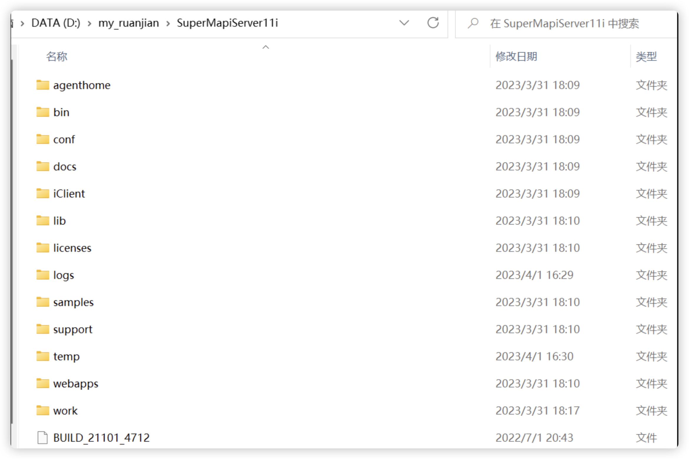
4. 找到安装或解压缩的 iServer目录，进入 bin 文件夹，双击打开 startup 批处理文件（关闭服务双击该目录下的 shutdown 批处理文件） 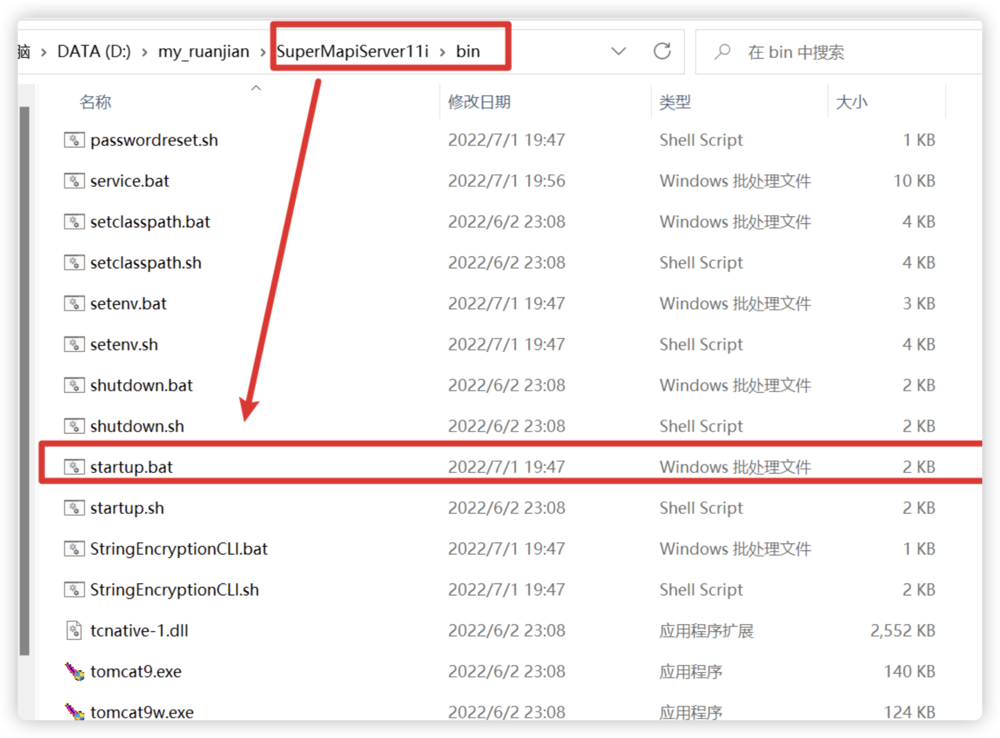
5. 双击之后会出现一个窗体，如下图，等待弹出的黑窗口准备完毕后 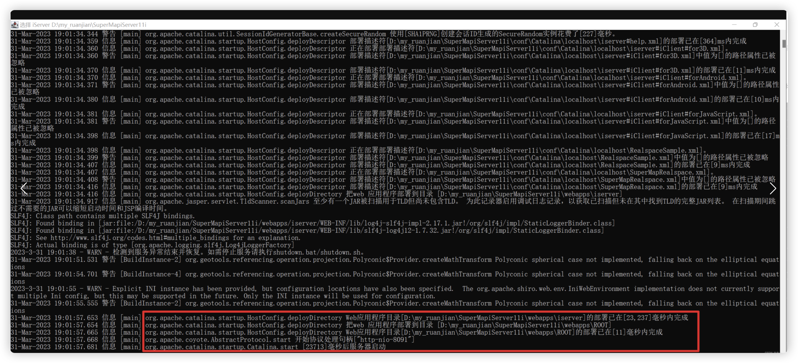
6. 当执行到上面这一步时，说明SuperMap iServer已经启动成功了
7. 弹出的黑窗口准备完毕，启动成功后，打开浏览器输入以下地址：http://localhost:8091/iserver/setup进行初始化向导， 输入账号和密码即可创建管理员账户 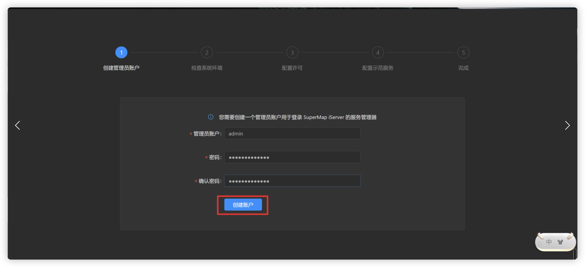
8. 检查系统环境 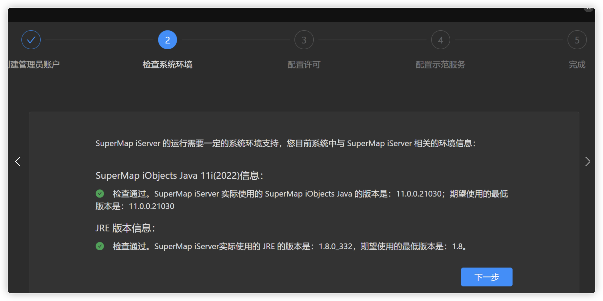
9. 配置许可 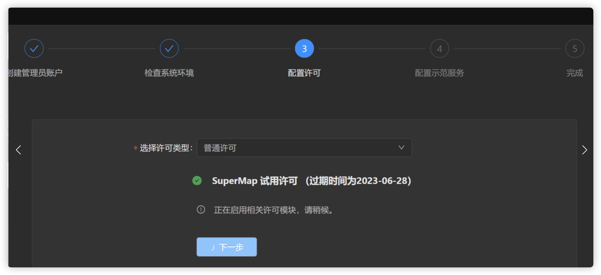
10. 配置示范服务 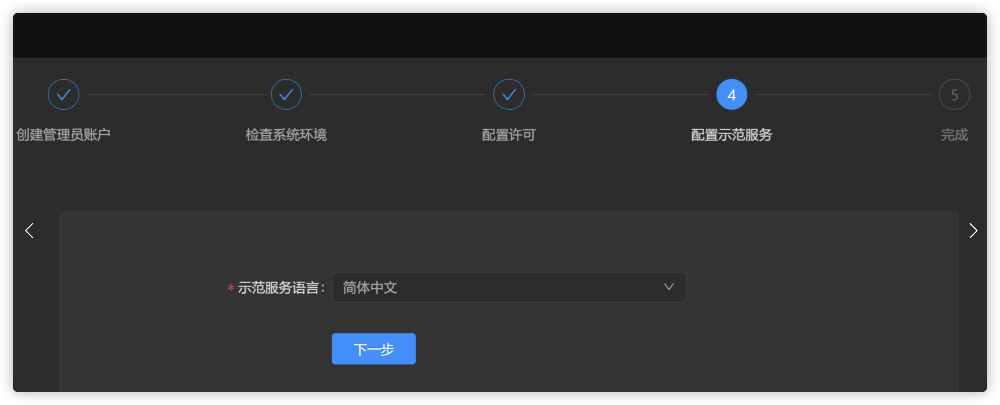 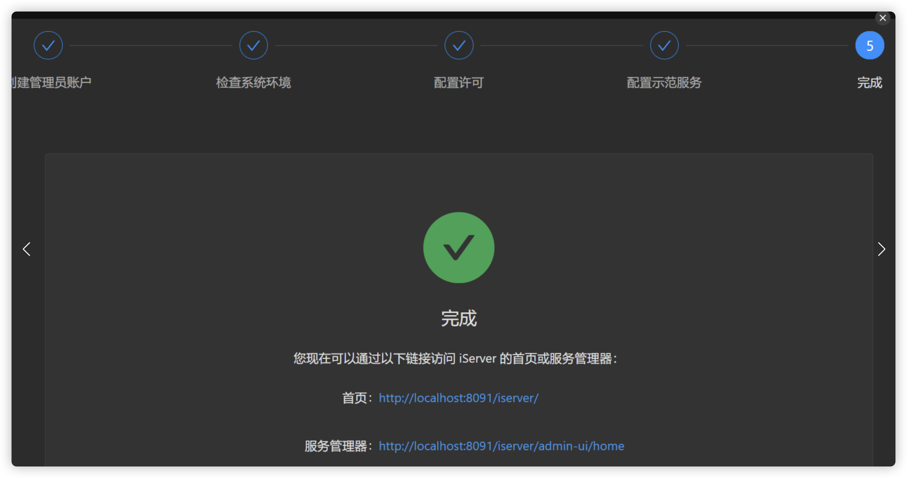
11. 安装完成，在浏览器中输入：http://localhost:8091/iserver/setup 进入服务管理页面 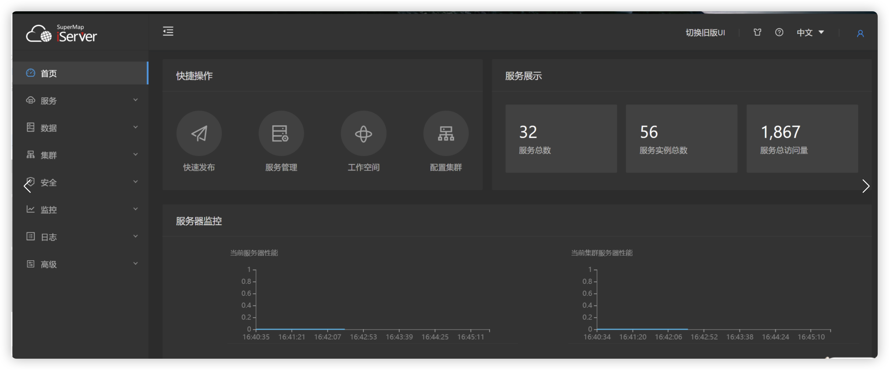

### 添加依赖

无

### 补充配置文件

无

## 部署包

[点击下载](http://10.38.77.5:8081/repository/raws/chntjstz/zjh/supermap-iserver-10.2.1-windows-x64.zip)

## 常见问题

### SuperMap iServe启动失败，可能是因为端口号被占用，需要修改端口号

1. 打开conf文件夹，找到server.xml 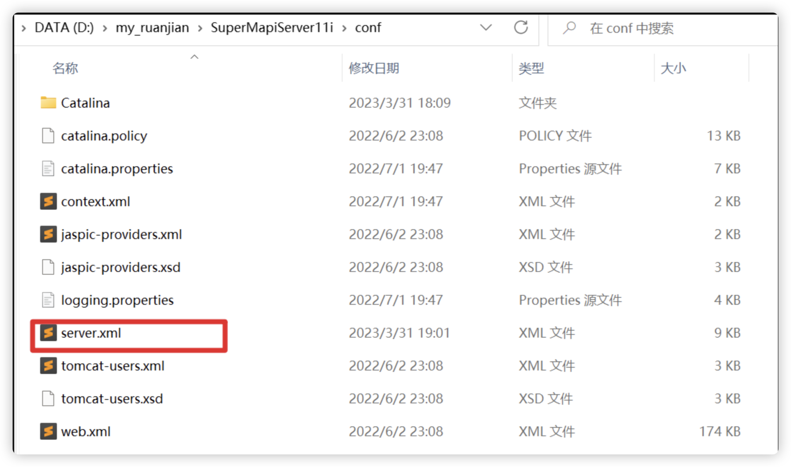
2. 选择文本编辑器打开，找到“8090”，修改端口号，重新启动即可 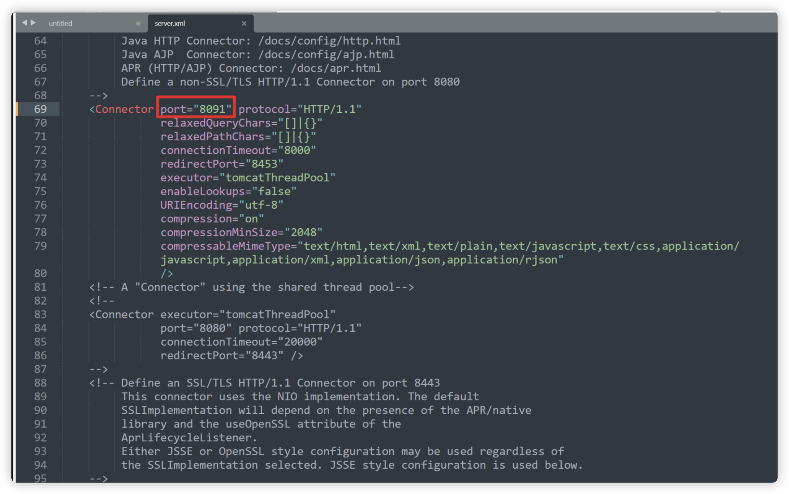