# Hbase组件

2023年12月

## 开源版本说明

| 版本名    | 版本         | 说明 |
| --------- | ------------ | ---- |
| jdk版本   | jdk1.8.0_391 |      |
| zookeeper | 3.8.1        |      |
| hadoop    | 3.3.6        |      |
| hbase     | 2.5.6        |      |

## 功能发布记录

| 日期       | 版本           | 变更说明 | 作者 | 升级方式 |
| ---------- | -------------- | -------- | ---- | -------- |
| 2023-12-20 | 2.5.6-20231220 | 初始版本 |      |          |

### 审阅人

## 重要通知

暂无

## 组件描述

### 组件建设目标

增加hbase组件私有虚机版搭建能力，提供hbase相关服务

### 读者

应用系统维护人员

### 参考资料

https://hadoop.apache.org/docs/r3.3.6/

https://hbase.apache.org/

### 术语定义

| 序号 | 简称/术语 | 说明                                                         |
| ---- | --------- | ------------------------------------------------------------ |
| 1    | hadoop    | Apache®Hadoop®项目开发用于可靠、可扩展、分布式计算的开源软件 |
| 2    | hbase     | Apache HBase™是Hadoop数据库，一个分布式、可扩展的大数据存储  |

### 适用范围

HBase（Hadoop数据库）是一个分布式、面向列的NoSQL数据库，它是构建在Apache Hadoop之上的一部分。HBase适用于以下场景：

- 大数据存储和处理： HBase是在Hadoop生态系统中构建的，为大数据存储和处理提供了水平扩展的能力。它可以处理PB级别的数据，并通过水平扩展在集群中分布存储和处理数据。
- 随机、快速读/写： HBase支持快速随机读写操作。这使其非常适合需要快速访问和更新数据的应用程序，例如实时分析、日志处理和实时仪表板等。
- 稀疏数据： HBase适用于稀疏数据模型，即大多数行可能只有很少的列。这使得它在处理包含大量空白或缺失数据的数据集时非常高效。
- 弹性模式： HBase支持动态添加列和列族，因此可以轻松地适应模式的变化。这对于处理半结构化或非结构化数据的应用程序非常有用。
- 高可用性： HBase提供了高度可用的架构，通过数据的分布和复制，确保即使在节点故障的情况下也能保持服务的可用性。
- 线性可扩展性： HBase是一个水平可扩展的系统，可以通过添加更多的节点来扩展存储和处理能力，而无需对现有数据进行重新分配。
- 时间序列数据： 由于HBase支持时间戳，它非常适合存储和查询时间序列数据，如日志、传感器数据等。
- 半结构化数据： HBase对半结构化数据的存储和检索有良好的支持，这使得它适用于许多与大数据相关的应用程序。
- 需要注意的是，HBase并不适用于所有类型的应用。如果应用程序更适合关系型数据库，或者对事务支持有更高的要求，那么传统的关系型数据库可能更合适。选择数据库技术应该基于应用程序的具体需求和特点。

## 快速入门

### 私有虚机版

- 申请
  - 在技术中台申请hbase组件私有版，部署场景选择虚机版，容器版暂不支持纳管，申请通过后，下载私有版部署包

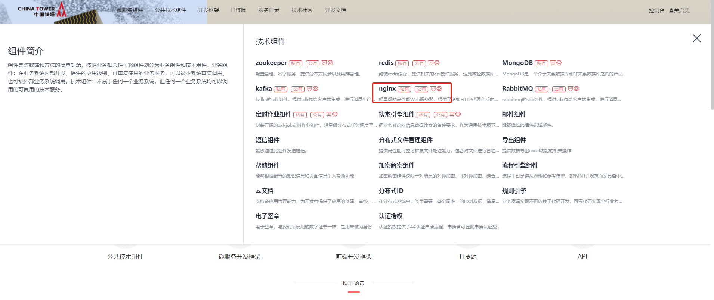

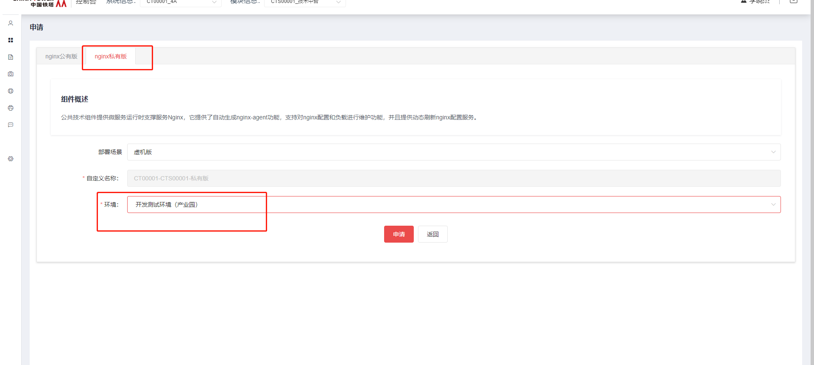

### 公有版

暂无

## 操作指南

### 私有虚机版功能介绍

#### 部署包下载

基于服务器系统版本centos7.9

```sh
服务器系统信息(下面版本均经过验证)

系统版本 CentOS Linux release 7.9.2009

内核版本 Linux 5.4.260-1.el7.elrepo.x86_64

内核版本 Linux 3.10.0-1160.el7.elrepo.x86_64
```

[点击下载](http://10.38.77.5:8081/repository/raws/chntjstz/zjh/hbase/hbase-all-2.5.6-20231219.tar.gz)

#### 部署包内容

部署包根路径

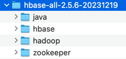

#### 安装步骤

此部署教程针对centos7.9系统 基于3台服务器，一台master，两台node

- 初始化服务器环境

  此步骤需要root账号

安装必要的运行库

```sh
yum install -y vim net-tools psmisc nc rsync ntp libzstd openssl-static tree iotop git
```

关闭防火墙firewalld(部分服务器不存在该服务)

```sh
systemctl stop firewalld
systemctl disable firewalld
```

清理iptables规则

```sh
iptables -F
iptables -X
iptables -Z
iptables -P INPUT ACCEPT
iptables -P OUTPUT ACCEPT
iptables -P FORWARD ACCEPT
```

配置/etc/hosts文件 文件末尾追加

vim /etc/hosts

```txt
ip1 master
ip2 node1
ip3 node2
```

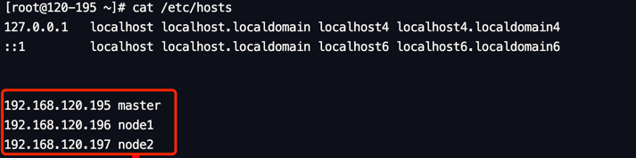

- 配置appuser用户机器互信

  此操作后切换到appuser用户

在每个服务器上执行命令

```shell
ssh-keygen -t rsa
```

需要按三次回车

进入ssh配置目录

cd ~/.ssh

将公钥（名为id_rsa.pub文件）追加到认证文件（名为authorized_keys文件）中:

```shell
cat ~/.ssh/id_rsa.pub >> ~/.ssh/authorized_keys
```

修改认证文件权限

chmod 600 ~/.ssh/authorized_keys

把3台服务器的认证文件内容整合

查看认证文件内容

需要有3行，每行末尾应该为登录用户@服务器名称

查看当前登录用户名命令为：

```shell
whoami
```

查看服务器名称命令为：

```shell
hostname
```

最终状态

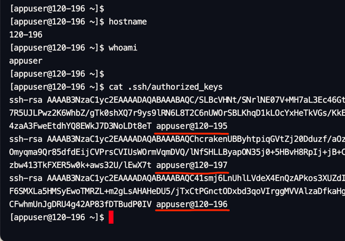

- 上传部署包并解压

  将部署包上传到每个服务器的/app目录下

解压

```shell
cd /app
tar -zxvf hbase-all-2.5.6-20231219.tar.gz
```


- 配置JAVA_HOME

  vim ~/.bash_profile

在文件末尾添加

```shell
export JAVA_HOME=/app/java/jdk1.8.0_291
export PATH=$JAVA_HOME/bin:$PATH
```

刷新环境变量

```shell
source ~/.bash_profile
```

- 初始化hdfs

  在master服务器上执行

```shell
cd /app/hadoop/hadoop-3.3.6/
./bin/hdfs namenode -format
```

- 启动hadoop

  在master服务器上执行

```shell
cd /app/hadoop/hadoop-3.3.6/
./start.sh
```

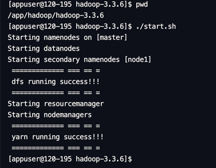

验证hdfs是否启动成功

```shell
jps -l
```

master节点

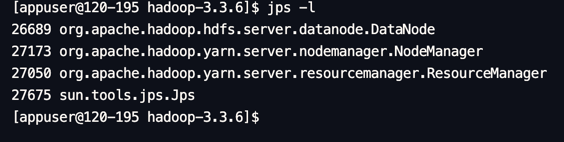

node1节点

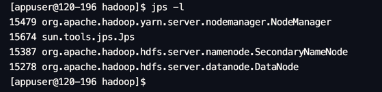

node2节点

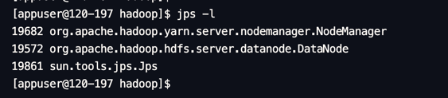

浏览器访问

http://master:9870

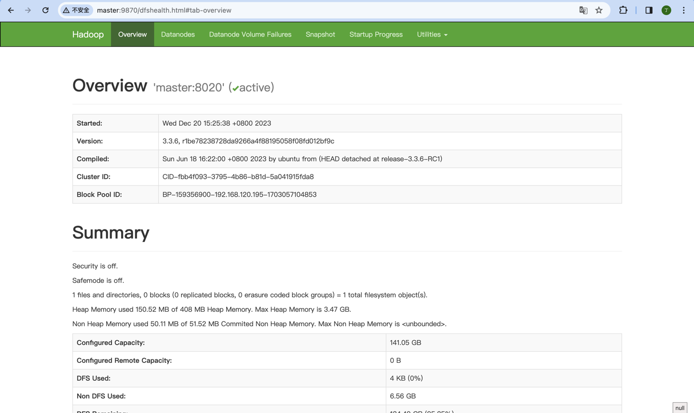

http://master:8088

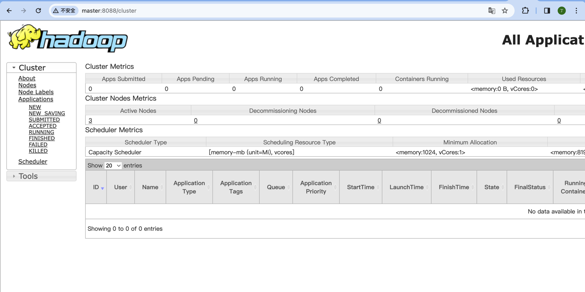

- 启动zoopkeeper

  在3台服务器上执行

```shell
cd /app/zookeeper/
./apache-zookeeper-3.8.1-bin/bin/zkServer.sh start
```

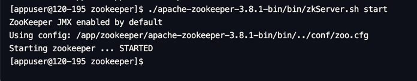

- 启动hbase

  在master服务器上执行

```shell
cd /app/hbase/hbase-2.5.6/
./bin/start-hbase.sh
```

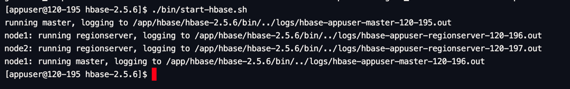

验证hbase是否启动成功

```shell
jps -l
```

master节点

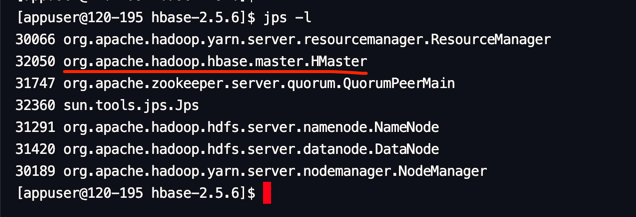

node1节点

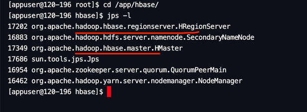

node2节点

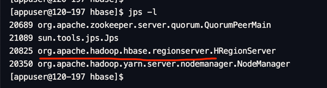

浏览器访问

http://master:16010

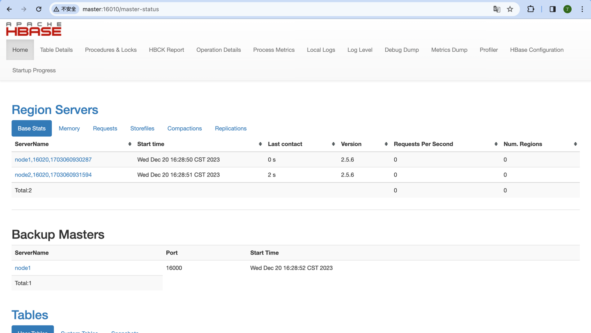

|      | hadoop启动占用大量端口，需要注意端口可用  重点端口  9870 (页面)  8020 (hbase通信)  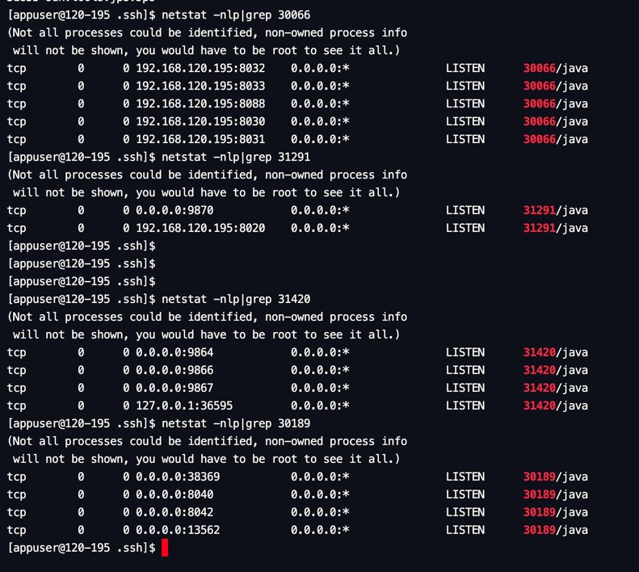  zookeeper占用端口2181，2888，3888  hbase 端口占用  16010 (页面)  16000 (hbase通信)  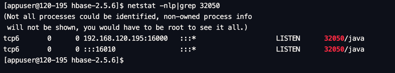 |
| ---- | ------------------------------------------------------------ |
|      |                                                              |

### 公有版功能介绍

暂无

## API参考

无

## SDK

无

## 网络要求

### 私有虚拟版网络打通

- 单向打通业务服务到zookeeper端口2181的网络
- 单向打通业务服务到hbase的网络

