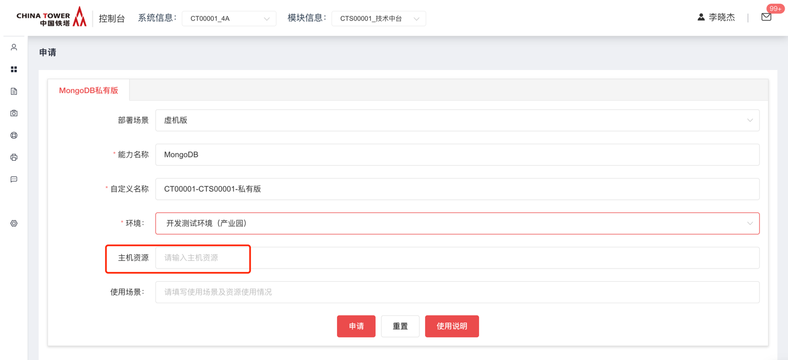
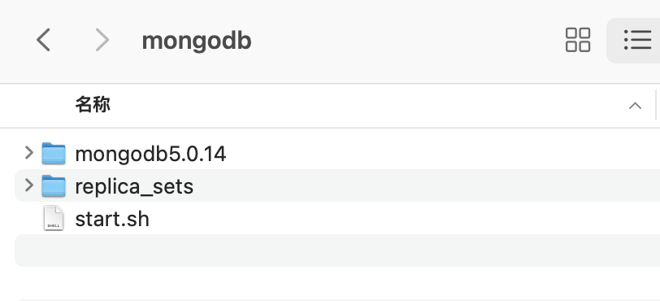

# MongoDB

## 开源版本说明

| 版本名  | 版本   | 说明 |
| ------- | ------ | ---- |
| mongoDB | 5.0.14 |      |

## 功能发布记录

| 版本 | 拟制/修改日期 | 拟制/修改人 | 修改记录 | 批准人 |
| ---- | ------------- | ----------- | -------- | ------ |
| 1.0  | 2023/01/20    | 杨斌        | 初版     |        |
|      |               |             |          |        |

## 重要通知

无

## 组件描述

MongoDB是一个基于分布式文件存储的数据库。由C++语言编写。旨在为WEB应用提供可扩展的高性能数据存储解决方案。

## 快速入门

### 私有虚机版

- 申请
  - 在技术中台申请redis组件私有版，部署场景选择虚机版，容器版暂不支持纳管，申请通过后，下载私有版部署包
  - 申请时需要选择环境，并填写申请的服务器地址




### 私有容器版

- 需提前联系运营人员协助申请

### 公有版

暂无

## 操作指南

### 私有虚机版功能介绍

#### 部署包位置

[点击下载](http://10.38.77.5:8081/repository/raws/chntjstz/zjh/mongodb/mongodb-5.0.14-20230614.tar.gz)

#### 部署包内容

部署包根路径



#### mongodb副本集搭建

三台服务器，每台服务器各安装1个mongodb节点，搭建mongodb副本集

#### 1.1 每台服务器安装mongodb步骤

```shell
# appuser用户登录服务器
# 在 app 目录下，上传 mongodb.tar.gz 安装包，并解压
cd /app
# 上传后解压
tar -zxvf mongodb.tar.gz
# 启动 mongodb
cd mongodb
./start.sh
# 检查启动后进程
ps -ef|grep mongodb
```

#### 1.2 创建集群

3台服务器安装完成后，随便登录一个mongodb节点，执行创建集群命令

```shell
cd /app/mongodb/mongodb5.0.14/bin
./mongo --port 27017

rs.initiate({
	_id: "myrs",
	members: [
	{ _id: 0, host: "xx.xx.xx.xx:27017" },
	{ _id: 1, host: "xx.xx.xx.xx:27017" },
	{ _id: 2, host: "xx.xx.xx.xx:27017" }
	] })
```

#### 1.3 查看集群状态

创建集群完成后，执行

```shell
rs.status()
```

#### 1.4 创建管理员账号

```shell
use admin

db.createUser({user:"root",pwd:"123456",roles:[{role:"root",db:"admin"}]});
```

#### 1.5 账号认证登录

```shell
use admin
db.auth("root","123456")
```

#### 1.6 创建数据库

```shell
# 以下所有操作，需要在admin账号登录后执行
#如果数据库不存在，则创建数据库，否则切换到指定数据库。
use TEST_DB
#查看数据库，
show dbs
#数据库插入一条记录
db.TEST_DB.insert({"test":"测试"})
#创建数据库账号
db.createUser({user:"test_admin",pwd:"123456",roles:[{role:"readWrite",db:"TEST_DB"},{role:"dbOwner",db:"TEST_DB"}]})

#MongoDB 中默认的数据库为 test，如果你没有创建新的数据库，集合将存放在 test 数据库中。
#注意: 在 MongoDB 中，集合只有在内容插入后才会创建! 就是说，创建集合(数据表)后要再插入一个文档(记录)，集合才会真正创建。
```

## 典型实践

无

## API参考

无

## SDK

PS: 和开发框架SpringBoot版本兼容即可

## 网络要求

### 私有虚拟版网络打通

- 双向打通mongodb服务到业务服务的网络

## 常见问题

无

## 样例文件

无