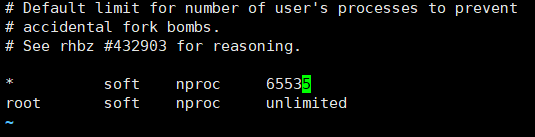

# MySQL

MySQL是一种开源的关系型数据库管理系统，它是最流行的数据库管理系统之一。MySQL使用SQL（结构化查询语言）来管理和操作数据库，它具有高性能、可靠性和易于使用的特点，可以在各种操作系统上运行，并支持多种编程语言的接口。

## 功能发布记录

| 发布时间 | 功能分类 | 功能名称 | 说明 |
| -------- | -------- | -------- | ---- |
|          |          |          |      |

## 重要通知

无

## 组件描述

- 提供私有版MySQL部署包和使用说明；
- 提供Linux6和Linux7的环境配置说明；
- 提供keepalived部署包和使用说明。

## 安装MySQL

### 配置安装环境

1、关闭防火墙

```bash
# linux 6
service iptables stop
chkconfig iptables off
# linux 7：
# 查看防火墙状态
firewall-cmd --state

systemctl stop firewalld

# 禁止firewall开机启动
systemctl disable firewalld.service
```

2、禁用selinux

先查看SELINUX 状态，如果没有关闭再执行下面关闭的操作

```bash
less /etc/selinux/config | grep SELINUX
```

手动修改配置文件参数，为disabled，但重启才能生效

查看 getenforce


3、关闭numa

```bash
# 安装numactl工具
yum install numactl -y
numactl --hardware
```

linux 6:

```bash
# /etc/grub.conf的kernel行最后添加numa=off
kernel /vmlinuz-2.6.32-220.el6.x86_64 ro ...... KEYTABLE=us rd_NO_DM numa=off
```

linux 7:

```bash
# /etc/default/grub的GRUB_CMDLINE_LINUX行最后添加 numa=off
GRUB_CMDLINE_LINUX=“crashkernel=auto …… rhgb quiet numa=off”
# 执行grub2-mkconfig命令
grub2-mkconfig -o /boot/grub2/grub.cfg
```


需重启数据库

```bash
reboot
```

重启后，查询是否关闭

```bash
grep -i numa /var/log/dmesg
```


```bash
# 如果上面办法不能关闭numa ，则使用下面的办法
grubby --update-kernel=ALL --args="numa=off"

# 然后再重启服务器，再次检查是否关闭
```

4、调整磁盘io调度策略

linux 6:

```bash
# /etc/grub.conf的kernel行最后添加elevator=deadline
kernel /vmlinuz-2.6.32-220.el6.x86_64 ro ...... KEYTABLE=us rd_NO_DM numa=off elevator=deadline
```

linux 7:

```bash
# 查看：dmesg | grep scheduler
linux 7 io调度规则默认为“deadline”，所以不需要更改
```

5、文件数，进程数限制 ---设置OS参数，OS限制各个用户能够打开的文件描述符限制

```bash
#  lsof -u mysql|wc -l    ---查看mysql用户当前打开的文件数
# 在my.cnf中设置的参数open_files_limit值是无效的，因为open_files_limit都以OS的文件描述符为准。
#  nofile - 打开文件的最大数目, noproc - 进程的最大数目
#  soft 指的是当前系统生效的设置值。hard 表明系统中所能设定的最大值。soft 的限制不能比har 限制高。

vi /etc/security/limits.conf
mysql   soft    nproc   65535
mysql   hard    nproc   65535
mysql   soft    nofile  65536
mysql   hard    nofile  65536

# /etc/security/limits.d
# 该目录下文件都改成65535，这个文件不改，文件数仍然是4096

vi /etc/security/limits.d/20-nproc.conf
# 欧拉系统&麒麟系统
vi /etc/security/limits.d/90-nproc.conf
```




6、内核参数

```bash
vi /etc/sysctl.conf
# 禁用交换区
vm.swappiness=0
```

对于数据库服务器，最好将vm.swappiness参数的值设置得相对较低，以减少交换的发生，因为交换会导致延迟增加并降低性能。

对于MySQL服务器，建议将vm.swappiness参数的值设置为较低的值，例如10或更低。

```bash
#信号量
kernel.sem = 250 32000 100 128  #与MySQL段等待超时相关
```

> [!NOTE]
>
> 第一列，表示每个信号集中的最大信号量数目。  
>
> 第二列，表示系统范围内的最大信号量总数目。  
>
> 第三列，表示每个信号发生时的最大系统操作数目。  
>
> 第四列，表示系统范围内的最大信号集总数目。


```bash
生效：
sysctl -p    # 让参数立即生效
```

7、创建用户以及用户组

```bash
groupadd mysql
useradd -r -g mysql -s /bin/false mysql
```

修改主机名：

更改之前，先记录下原主机名，因为如果该节点是主库的话，后期安装NBU需要查询之前这个服务器是否安装过NBU，主机名是否冲突，以及通过原主机名获取token等操作。

> [!CAUTION]
>
> 注意：欧拉系统不能带 –static 参数

```bash
# 生产环境是ctc开头 （都小写）
hostnamectl set-hostname ctc-业务系统名字缩写-mysql01 --static

#华为云准生产字母缩写开头+工单中提供的系统名字+mysql01 （都小写）
hostnamectl set-hostname  hwyzsc-业务系统名字缩写-mysql01 --static

#验收
hostnamectl set-hostname  ys-业务系统名字缩写-mysql01 --static
# idc测试
hostnamectl set-hostname  idc-业务系统名字缩写-mysql01 --static

# 欧拉系统，改完主机名需要固化
```

### 创建目录结构

1、磁盘挂载

```bash
df -h
```

查看数据盘挂载目录是不是/mysqldata


不是的话，进行创建

```bash
# 创建安装目录
mkdir /mysqldata
# 将数据盘挂载到mysqldata目录当中，如果已经挂载到mysqldata这一步可以忽略。
umount /app
mount /dev/mapper/VolGroup02-lv_app01 /mysqldata   #这里注意路径，有变动自己改下
# 进入fstab里面添加mysqldata目录。使得开机自动将数据盘挂载到mysqldata目录
vi /etc/fstab
/dev/mapper/VolGroup02-lv_data01 /mysqldata ext4 defaults 0 0
```


2、创建目录

```bash
# 创建mysql所需要的目录结构，如果不创建无法安装数据库
mkdir /mysqldata/mysql/{data,tmpdir,binlogs} -p
```

### 安装mysql软件

1、二进制安装

```bash
# 将安装包解压，二进制文件放到指定的目录当中，并设置软连接
cd /mysqldata/
xz -d mysql-8.0.33-linux-glibc2.12-x86_64.tar.xz
tar -xvf mysql-8.0.33-linux-glibc2.12-x86_64.tar
mv mysql-8.0.33-linux-glibc2.12-x86_64 mysql_80_basedir
ln -s /mysqldata/mysql_80_basedir /usr/local/mysql
chown -R mysql:mysql /mysqldata/mysql/
```

2、环境变量

```bash
# 配置并立即生效
cp /etc/profile /etc/profile.bak
cat >>/etc/profile <<EOF
export PATH
export PATH=/usr/local/mysql/bin:\$PATH
EOF

source /etc/profile
```

3、配置文件

```bash
# 编辑my.cnf之后将8.0版本mysql配置文件模板内容粘贴进去，这里面有四个值要更改
cp /etc/my.cnf /etc/my.cnf.bak

# /etc/my.cnf
vi /etc/my.cnf
```

> [!NOTE]
>
> 8.0版本mysql配置文件模板： [8.0配置文件.txt](../file/8.0配置文件.txt) 

server-id需要更改，改成端口号+ip的最后2位。以本次专项验收环境为例：33071227

innodb_buffer_pool_size的值需要改成系统总内存的70%

```bash
# 查看total大小，total*0.5的结果就是innodb_buffer_pool_size的值
free -g
```

read_only 如果是从库需要开启只读，也就是把行首的“#”号去掉。

super_read_only 如果是从库需要开启只读，也就是把行首的“#”号去掉。

### 数据库初始化

1、拷贝启动脚本

```bash
cp /usr/local/mysql/support-files/mysql.server /etc/init.d/mysqld
```

2、初始化数据库

```bash
# 初始化mysql数据库。这一步会在datadir目录当中生成文件。我们配置模板当中的datadir就是/mysqldata/mysql/data目录
/usr/local/mysql/bin/mysqld --defaults-file=/etc/my.cnf --initialize-insecure --user=mysql
```

### 启库

```bash
# 启动mysql数据库
/usr/local/mysql/bin/mysqld_safe --defaults-file=/etc/my.cnf &
```

### 配置root密码

1、生成密码

```bash
pwmake 8
```

2、设置root密码

```bash
# 进入mysql数据库，并且设置root用户的密码，密码要用脚本生成的密码
mysql -uroot -p -S /mysqldata/mysql/data/mysql.sock

alter user 'root'@'localhost' identified by 'AAAAA';
```

3、搭建主从

对于2个主机 新启的实例：

第一步：在节点1上创建同步账号

```bash
create user 'repl'@'192.168.%' identified by 'xc32gzWZuA';
grant replication slave on *.* to 'repl'@'192.168.%';
```

第二步：在节点2上执行下面的语句

```bash
change master to master_host='10.147.64.72',master_port=3306,master_user='repl',master_password='xc32gzWZuA',master_auto_position=1;
start slave;
show slave status\G
```

## 安装keepalived

### 背景

环境中已经安装部署mysql主从，下面是配置keepalived以及开启半同步的步骤。

### 要更新的内容，增加功能脚本

1. keepalive日志输出路径；
2. M2 判断后关闭只读；
3. 回切方案；
4. my.cnf参数变动，如M2作为永远的主库，切换后如何编辑配置文件。

### 编译安装

keepalived的安装两个节点步骤一样，唯一不一样的地方就是配置文件

1、安装依赖包

```bash
yum -y install e2fsprogs-devel keyutils-libs-devel libsepol-devel libselinux-devel krb5-devel zlib-devel openssl-devel popt-devel

yum -y install gcc-c++
```

2、解压软件包

```bash
cp /u01/app/backup/soft/keepalived-2.1.5.tar.gz /mysqldata

tar -zxvf keepalived-2.1.5.tar.gz
```

3、编译安装keepalived

```bash
cd /mysqldata/keepalived-2.1.5/
```

第一步：

```bash
# 指定配置的安装路径
./configure --prefix=/usr/local/keepalived/
```

第二步：

```bash
# 编译程序
make

# 如果系统没有make命令，则安装下即可
yum -y install gcc automake autoconf libtool make
```

第三步：

```bash
# 检查上一条命令的退出状态，正常退出返回0，否则有报错
echo $?
```

第四步：

```bash
# 安装文件
make install
```

第五步：

```bash
# 同样做个检查，确认安装过程中上是否有报错
echo $?
```

### 配置文件

1、部署配置文件

```bash
mkdir /etc/keepalived/
vi /etc/keepalived/keepalived.conf
global_defs {
   router_id KeepAlive_MySQL
   script_user root
   enable_script_security
}

vrrp_script check_run {
   script "/etc/keepalived/bin/mysql_check.sh"
   interval 5
   timeout 100
   fall 10
}

vrrp_instance VI_1 {
  state BACKUP
  interface bond0
  mcast_src_ip 192.168.2.10
  virtual_router_id 10
  priority 100
  advert_int 5
  nopreempt
  authentication {
      auth_type PASS
      auth_pass 1111
  }

  track_script {
    check_run
  }
  virtual_ipaddress {
      192.168.2.254
  }
  notify_fault "/etc/keepalived/bin/notify_fault.sh"
}
```

> [!important]
>
> 红字需要改  
>
> interface：要改成vip要绑定的网卡名。  
>
> mcast_src_ip：当前主机IP地址。  
>
> virtual_router_id：虚拟路由ID号，每个集群节点ID号要一样，我这边主从节点写的是主库的IP最后一位。  
>
> virtual_ipaddress：虚拟IP #跟网络人员申请这个虚拟ip，如果是虚机申请后还需要放流；华为云虚机不需要放流；  
>
> vrrp_script check_run：检查数据库是否正常的脚本，会每30秒执行脚本。
>
> mysql_check.sh 如果返回mysql不可用，VIP就会飘移。  
>
> priority：优先级，当主库出现故障的时候如果有多个从库，那么VIP就会飘移到优先级大的从库。如果一主一从，主库比从库的值大就行了。  
>
> notify_fault：如果当前keepalived节点状态为fault，就执行该脚本。
>
> notify_fault.sh是用来停止keepalived的。 #这里面的bin目录，会在编辑下面脚本中，进行创建  
>
> advert_int ：设定keepalive master/backup 负载均衡器之间同步检查的时间间隔，单位是秒  
>
> advert_int =5 可容忍网络延迟10-15秒。  测试 设置为3，4000ms- 8000ms 的延迟就会脑裂。  
>
> interval：当 Keepalive 连接建立后，每隔 interval 秒就会发送一个探测数据包到对端。  
>
> auth_pass：验证密码，keepalive 的master/backup 需要保持一致  
>
> timeout：单位秒，如果在 timeout 秒内没有收到对端的回复，则计为一次失败。  
>
> fall：失败次数，当累计失败次数达到 fall 次时，即连续失败 fall 次，认定连接已断开。  
>
> nopreempt:非抢占模式，只能用于state为backup，因此这里所有节点state都设置为backup  
>
> enable_script_security：#如过路径为非root可写，不要配置脚本为root用户执行。  
>
> notify_master `<STRING>|<QUOTED-STRING>`：当前节点成为主节点时触发的脚本  
>
> notify_fault `<STRING>|<QUOTED-STRING>`：当前节点转为“失败”状态时触发的脚本  
>
> notify_backup `<STRING>|<QUOTED-STRING>`：当前节点转为备节点时触发的脚本  
>
> notify `<STRING>|<QUOTED-STRING>`：通用格式的通知触发机制，一个脚本可完成以上三种状态的转换时的通知

### 部署脚本

1、部署mysql状态监控脚本

```bash
mkdir /etc/keepalived/bin
vi /etc/keepalived/bin/mysql_check.sh
# 注 . /etc/profile  .后需要保留空格的
# 文本中要定格写，有空格会报格式错误

#!/bin/bash
. /etc/profile
count=1
while true
do
/usr/local/mysql/bin/mysql -ushsnccheck -p"shsnc2018lr" --socket=/mysqldata/mysql/data/mysql.sock -e "select 1;" >/dev/null 2>&1
i=$?
ps aux | grep 'mysqld --defaults-file' | grep -v grep >/dev/null 2>&1
j=$?


 if [ $i = 0 ]&&[ $j = 0 ]
 then
 exit 0
 else
  if [ $i = 1 ]&&[ $j = 0 ]
  then
  exit 0
  else
  exit 1
  fi
 fi
 done
chmod 755 /etc/keepalived/bin/mysql_check.sh
```

> [!NOTE]
>
> “show status” 命令是用来判断是否数据库可以正常返回结果的。  
>
> “ps aux \| grep mysqld”命令是用来判断mysqld进程是否存在。如果无法正常返回结果并且mysqld进程也不存在，就认为一次检查失败。

部署多实例的时候，使用下面的脚本

```sh
#!/bin/bash
. /etc/profile
count=1
while true
do
ps aux | grep 3307 | grep -v grep >/dev/null 2>&1
j=$?

if [ $j = 0 ]
then
exit 0
else
exit 1
fi

done
```

2、部署关闭节点keepalive脚本

```bash
vi /etc/keepalived/bin/notify_fault.sh
#!/bin/bash
pkill keepalived
chmod 755 /etc/keepalived/bin/notify_fault.sh
```

> [!NOTE]
>
> 停止该节点上的keepalived，防止VIP来回飘移。

### 快捷启动

#### centos 6 部署快捷启动---使用service管理

1、将启动脚本拷贝到/etc/init.d/下

```bash
cp /mysqldata/keepalived-2.1.5/keepalived/etc/init.d/keepalived /etc/init.d/
```

2、将启动配置文件拷贝到/etc/sysconfig/下

```bash
cp /mysqldata/keepalived-2.1.5/keepalived/etc/sysconfig/keepalived /etc/sysconfig
```

3、将程序拷贝到/usr/sbin路径下

```bash
cp /usr/local/keepalived/sbin/keepalived /usr/sbin/
```

#### centos 7 部署快捷启动---使用systemctl管理

只需将启动脚本拷贝到/etc/init.d/下即可

```bash
cp /mysqldata/keepalived-2.1.5/keepalived/etc/init.d/keepalived /etc/init.d/
```

如果出现下图中的cp 权限错误，按照图中的思路去处理即可。

#### 椒图安全软件安装的时候加的，为了安全加固

```bash
lsattr /etc/rc.d/
chattr -i /etc/rc.d/ && chattr -i /etc/rc.d/init.d
```


### 启动验证

> [!NOTE]
>
> 主库上面的keepalived要先启动，之后从库的keepalived再启动，因为keepalived的模式为不争抢模式，所以主从数据库节点，哪个先启动keeplived服务，VIP就会挂载到哪个节点。

1、启动keepalive

```bash
# centos6快捷管理命令
service keepalived start
service keepalived stop
service keepalived restart
service keepalived status

# centos7快捷管理命令
systemctl start keepalived
systemctl stop keepalived
systemctl restart keepalived
systemctl status keepalived
```

第一步：启动

```bash
systemctl start keepalived
```

第二步：查看启动状态，有无报错

```
systemctl status keepalived
```


2、验证

执行命令，可以看到虚拟ip绑定到了网卡上

```bash
ip a
```


第一步：验证VIP是否可用

下面是主库创建的账号，登录这些允许连接数据库的host服务器上，使用对应的账号+虚拟ip去连接数据库，看能否连接成功。 在主库执行下面命令，其中-h使用虚拟IP

```bash
# 使用虚拟ip
mysql -ubi_dict -p -h192.168.76.18 -P3306
```

连接上之后，执行命令，查看连接的是哪个库。

```bash
show variables like 'server_id'
```

正常情况下显示的应该是主库的server_id


在从库服务器执行：

```bash
ping 主库ip
ping 虚拟ip
```

都能ping通说明vip在主库时，从库与主库网络互通

第二步：验证VIP能否正常漂移

关闭主库keepalive

```bash
systemctl stop keepalived

systemctl status keepalived
```

然后在主库上再次执行

```bash
mysql -ubi_dict -p -h192.168.76.18 -P3306

show variables like 'server_id';
```

如果显示是从库的server_id，则证明能正常漂移。

在主库服务器执行：

```bash
ping 从库ip
ping 虚拟ip
```

都能ping通说明vip在从库时，主库与从库网络互通。

第三步：重新开启主库keepalive

这一步先关闭从库的keepalive

```bash
systemctl stop keepalived
systemctl status keepalived
```

再按主从顺序，先开主库keepalive，再开从库keepalive

```bash
systemctl start keepalived
```

最后，再验证下虚拟VIP是否可用，并且查一下此时连接的是不是主库

```bash
show variables like 'server_id';
```

3、网络互通

在上面验证的操作中，验证当VIP分别漂移到主库，从库的时候：

主，从，虚拟IP，这三个节点能否互相ping通；

如果出现不能ping通的情况（一般虚机才会出现，物理机不会），需要联系网络人员，提交工单打通网络（放流）。

本例子中主库76.17，从库76.9，虚拟VIP76.18，

当VIP漂移到从库的时候，从主库76.17上去ping VIP地址，无法ping通。

这种问题常见于主从库其中有虚机的场景，如果都是物理机一般没有这类问题。


## 开启mysql 半同步

### 异步变成半同步

主库:

1、加载半同步插件

```bash
install plugin rpl_semi_sync_master SONAME 'semisync_master.so';

install plugin rpl_semi_sync_slave SONAME 'semisync_slave.so';
```

2、开启半同步

```bash
SET GLOBAL rpl_semi_sync_master_enabled = 1;
```

3、半同步超时时间

```bash
SET GLOBAL rpl_semi_sync_master_timeout=5000;
```

>[!NOTE]
>
>如果从库返回给主库ack的时间超过5000毫秒（5秒），那么就会由半同步退化为异步复制。如果从库追赶上主库之后还会由异步提升为半同步。

从库：

4、加载半同步插件

```bash
install plugin rpl_semi_sync_master SONAME 'semisync_master.so';

install plugin rpl_semi_sync_slave SONAME 'semisync_slave.so';
```

5、开启半同步

```bash
SET GLOBAL rpl_semi_sync_slave_enabled = 1;
```

6、重启同步线程

```bash
stop slave;
start slave;
show slave status\G
```

主库：

7、验证

Rpl_semi_sync_master_clients的值从0变成1，说明有一个开启半同步的从库连接进来。

```bash
show status like 'rpl%';
```


### 添加依赖

无

### 补充配置文件

无

## 部署包

mysql-8.0.33-linux-glibc2.12-x86_64： [点击下载](http://10.38.77.5:8081/repository/raws/chntjstz/zjh/mysql/mysql-8.0.33-linux-glibc2.12-x86_64.tar)  [mysql-8.0.33-linux-glibc2.12-x86_64.tar](../file/mysql-8.0.33-linux-glibc2.12-x86_64.tar) 

keepalived-2.1.5： [点击下载](http://10.38.77.5:8081/repository/raws/chntjstz/zjh/mysql/keepalived-2.1.5.tar.gz)  [keepalived-2.1.5.tar.gz](../file/keepalived-2.1.5.tar.gz) 

## 常见问题

1、mysql: error while loading shared libraries: libncurses.so.5: cannot open shared object file: No such file or directory

openEuler 22.03 版本

解压安装包，配置完环境变量，使用mysql命令会报错

会报类似下面的两个缺少依赖包的错误


解决办法：从其他机器上拷贝过来放到本机的 /usr/lib64路径下即可。

从 10.38.63.11 这个上面可以找到依赖包，目前共享nas里面也有 /u01/app

2、安装8.0.33初始化报错，mysql安装包的glibc版本比系统的高，本次用的是8.0.33 glibc-2.28

```text
/usr/local/mysql/bin/mysqld: /lib64/libstdc++.so.6: version `CXXABI_1.3.11' not found (required by /usr/local/mysql/bin/mysqld)
/usr/local/mysql/bin/mysqld: /lib64/libstdc++.so.6: version `CXXABI_1.3.8' not found (required by /usr/local/mysql/bin/mysqld)
/usr/local/mysql/bin/mysqld: /lib64/libstdc++.so.6: version `GLIBCXX_3.4.22' not found (required by /usr/local/mysql/bin/mysqld)
/usr/local/mysql/bin/mysqld: /lib64/libstdc++.so.6: version `GLIBCXX_3.4.20' not found (required by /usr/local/mysql/bin/mysqld)
/usr/local/mysql/bin/mysqld: /lib64/libstdc++.so.6: version `GLIBCXX_3.4.21' not found (required by /usr/local/mysql/bin/mysqld)
/usr/local/mysql/bin/mysqld: /lib64/libstdc++.so.6: version `CXXABI_1.3.9' not found (required by /usr/local/mysql/bin/mysqld)
/usr/local/mysql/bin/mysqld: /lib64/libc.so.6: version `GLIBC_2.28' not found (required by /usr/local/mysql/bin/mysqld)
/usr/local/mysql/bin/mysqld: /lib64/libc.so.6: version `GLIBC_2.25' not found (required by /mysqldata/mysql_80_basedir/bin/../lib/private/libcrypto.so.1.1)
/usr/local/mysql/bin/mysqld: /lib64/libc.so.6: version `GLIBC_2.28' not found (required by /mysqldata/mysql_80_basedir/bin/../lib/private/libprotobuf-lite.so.3.19.4)
/usr/local/mysql/bin/mysqld: /lib64/libstdc++.so.6: version `GLIBCXX_3.4.20' not found (required by /mysqldata/mysql_80_basedir/bin/../lib/private/libprotobuf-lite.so.3.19.4)
/usr/local/mysql/bin/mysqld: /lib64/libstdc++.so.6: version `CXXABI_1.3.9' not found (required by /mysqldata/mysql_80_basedir/bin/../lib/private/libprotobuf-lite.so.3.19.4)
/usr/local/mysql/bin/mysqld: /lib64/libstdc++.so.6: version `CXXABI_1.3.8' not found (required by /mysqldata/mysql_80_basedir/bin/../lib/private/libprotobuf-lite.so.3.19.4)
/usr/local/mysql/bin/mysqld: /lib64/libstdc++.so.6: version `GLIBCXX_3.4.21' not found (required by /mysqldata/mysql_80_basedir/bin/../lib/private/libprotobuf-lite.so.3.19.4)
# 查看 系统支持的glibc最高版本
strings /lib64/libc.so.6 |grep GLIBC_

# 或
getconf GNU_LIBC_VERSION
```

解决办法：下载对应的mysql安装包 8.0.33 glibc 2.12即可

```bash
# glibc 2.17 是最小化安装版本
```