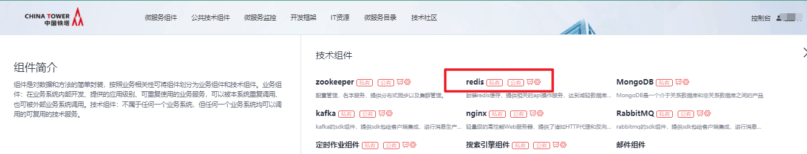
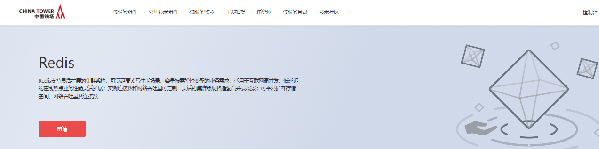
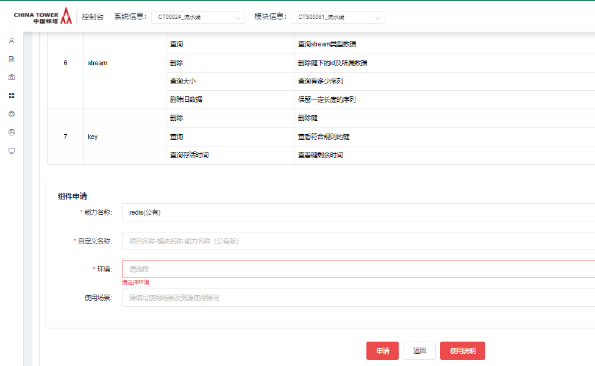
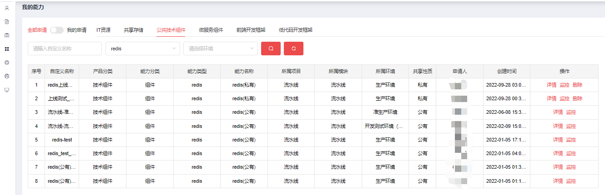
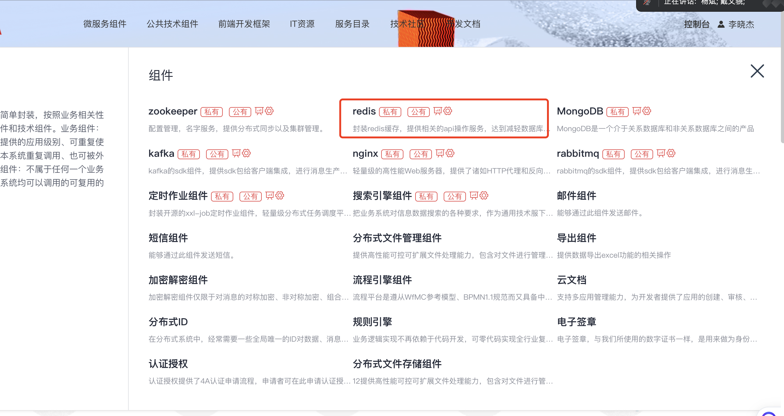
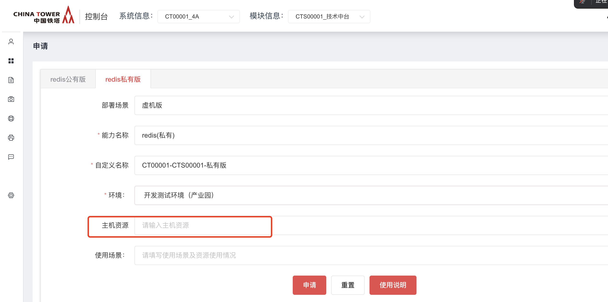
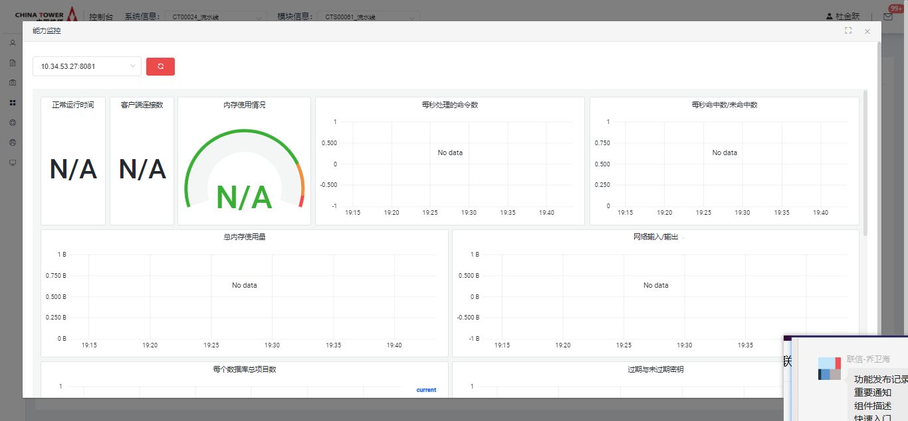
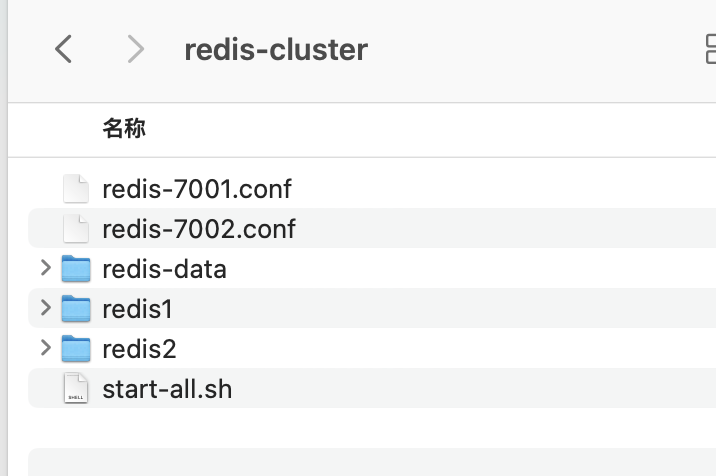

# Redis

V1.0  2019/3/20

## 开源版本说明

| 版本名 | 版本  | 说明 |
| ------ | ----- | ---- |
| redis  | 5.0.7 |      |

## 功能发布记录

版本变更记录

| 版本 | 拟制/修改日期 | 拟制/修改人 | 修改记录                       | 批准人 |
| ---- | ------------- | ----------- | ------------------------------ | ------ |
| 1.0  | 2019/4/9      | 薛恩超      |                                |        |
| 1.1  | 2019/07/09    | 符平        | 补充生产环境、验收环境接口信息 |        |
|      |               |             |                                |        |

## 重要通知

无

## 组件描述

### 3.1 组件建设目标

提升铁塔IT开发效率，减少数据库负担，加快查询速度。

### 3.2 读者

应用系统维护人员；

应用系统开发人员；

### 3.3 参考资料

| 序号 | 文档名称                               | 最后修订时间 | 版本号 | 来源         |
| ---- | -------------------------------------- | ------------ | ------ | ------------ |
|      | 中国铁塔IT系统技术架构总体规划（总册） | 2017/05/05   | 1.0    | 铁塔内部资料 |
|      | 中国铁塔架构组公共枚举值清单V1.0.docx  | 2019-04-08   | 1.0    | 铁塔内部资料 |

### 3.4 术语定义

| 序号 | 简称/术语 | 说明                                                 |
| ---- | --------- | ---------------------------------------------------- |
| 1    | Codis     | 分布式Redis解决方案                                  |
| 2    | RESTful   | 软件架构风格、设计风格，提供了一组设计原则和约束条件 |

### 3.5 适用范围

Redis不仅仅支持简单的k/v类型的数据，同时还提供list，set，zset，hash等数据结构的存储；Redis支持数据的备份，即master-slave模式的数据备份。Redis支持数据的持久化，可以将内存中的数据保持在磁盘中，重启的时候可以再次加载进行使用。

### API方式

#### 环境

（1）因服务器网络策略不支持本机访问本机外网，请使用铁塔内网网络对接。

#### 功能清单

| 序号 | 功能名称 | 详细说明                                                     |
| ---- | -------- | ------------------------------------------------------------ |
| 1    | 缓存读取 | restful API接口，业务系统传递查询关键字（KEY），通过key获取缓存value值。 |
| 2    | 缓存新增 | restful API接口，业务系统传递键值对（key-value），支持String、list、map、set等数据类型。缓存组件存储键值对，把成功或失败响应返回给业务系统，并同步给其它Redis节点。 |
| 3    | 缓存修改 | restful API接口，业务系统传递键值对（key-value），通过K修改缓存数据，把成功或失败响应返回给业务系统，并同步到其它Redis节点。 |
| 4    | 缓存删除 | restful API接口，业务系统传递关键字（K），通过K删除缓存数据，把成功或失败响应返回给业务系统，并同步到其它Redis节点。 |
| 5    | 缓存失效 | Restful API接口，业务系统传递key、expireTime，通过K设置该数据的失效时间。（缓存插入和修改可以设置失效时间） |

#### Restful API清单

##### restful API-缓存读取

请求地址：

| 接口类型     | HTTP                       |
| ------------ | -------------------------- |
| 接口提交方式 | POST                       |
| 接口地址     | http://ip:port/codis/query |

请求参数

| **参数名称** | **说明**   | **约束** | **类型** | **备注** |
| ------------ | ---------- | -------- | -------- | -------- |
| key          | 查询关键字 | 必填     | String   |          |

请求参数示例：

样例：\{"key":" CT00001_oasystemproduct_name "}

响应参数

| 参数名称 | 说明          | 类型   | 备注 |
| -------- | ------------- | ------ | ---- |
| flag     | 成功/失败 0/1 | String |      |
| mes      | 返回码描述    | String |      |
| data     | 返回数据信息  | Object |      |

响应参数示例：

样例：\{"flag": "0","data": "你好"}

##### restful API-缓存新增

请求地址：

| 接口类型     | HTTP                        |
| ------------ | --------------------------- |
| 接口提交方式 | POST                        |
| 接口地址     | http://ip:port/codis/insert |

请求参数

| 参数名称   | 说明     | 约束 | 类型              | 备注 |
| ---------- | -------- | ---- | ----------------- | ---- |
| key        | 关键字   | 必填 | String            |      |
| value      | 值       | 必填 | String、list、map |      |
| expireTime | 失效时间 | 必填 | Long              |      |

请求参数示例：

样例：\{"key":" CT00001_oasystemproduct_name","value":["1","2","3","4"]}

响应参数

| 参数名称 | 说明         | 类型   | 备注           |
| -------- | ------------ | ------ | -------------- |
| flag     | 成功/失败0/1 | String |                |
| mes      | 返回码描述   | String | 异常情况返回。 |

##### restful API-缓存修改

请求地址：

| 接口类型     | HTTP                        |
| ------------ | --------------------------- |
| 接口提交方式 | POST                        |
| 接口地址     | http://ip:port/codis/update |

请求参数

| 参数名称   | 说明     | 约束 | 类型              | 备注                   |
| ---------- | -------- | ---- | ----------------- | ---------------------- |
| key        | 关键字   | 必填 | String            |                        |
| value      | 值       | 选填 | String、map、list | 值和失效时间至少填一个 |
| expireTime | 失效时间 | 必填 |                   | 值和失效时间至少填一个 |

请求参数示例：

样例：\{"key":" CT00001_oasystemproduct_name ","value":"你好","expireSecond":60}

响应参数

| 参数名称 | 说明          | 类型   | 备注           |
| -------- | ------------- | ------ | -------------- |
| flag     | 成功/失败 0/1 | String |                |
| mes      | 返回码描述    | String | 异常情况返回。 |

样例：\{ "flag": "0"}

##### restful API-缓存删除

请求地址：

| 接口类型     | HTTP                     |
| ------------ | ------------------------ |
| 接口提交方式 | POST                     |
| 接口地址     | http://ip:port/codis/del |

请求参数

| 参数名称 | 说明   | 约束 | 类型   | 备注 |
| -------- | ------ | ---- | ------ | ---- |
| key      | 关键字 | 必填 | String |      |

样例：\{"key":" CT00001_oasystemproduct_name "}

响应参数

| 参数名称 | 说明          | 类型   | 备注 |
| -------- | ------------- | ------ | ---- |
| flag     | 成功/失败 0/1 | String |      |
| mes      | 返回码描述    | String |      |

样例：\{"flag": "0"}

### 微服务Starter方式

#### 环境搭建

（1）maven安装目录 settings修改server为：

```xml
<server>
    <id>chinatower-component-release</id>
    <username>admin</username>
    <password>admin123</password>
</server>
```

映射mirror为：

```xml
<mirror>
    <id>nexus</id>
    <url>http://10.38.77.5:8081/repository/maven-public/</url>
    <mirrorOf>*</mirrorOf>
</mirror>
```

（2）工程pom.xml添加依赖包

springboot版本2.0.6.RELEASE支持版本：

```xml
<dependency>
  <groupId>com.chinatower.redis</groupId>
  <artifactId>chinatower_redis_client</artifactId>
  <version>2.0.0.RELEASE</version>
</dependency>
```

springboot版本2.6.14支持版本：

```xml
<dependency>
  <groupId>com.chinatower.redis</groupId>
  <artifactId>chinatower_redis_client</artifactId>
  <version>2.1.0.RELEASE</version>
</dependency>
```

（3）配置文件application.yml 添加zookeeper地址

```yaml
spring:
  codis:
    zookeeper:
      #connect-string: 192.168.1.104:2181,192.168.1.104:2182,192.168.1.104:2183
      connect-string: 123.126.41.204:20428,123.126.41.204:20429,123.126.41.204:20430
	  #connect-string: 192.168.54.9:2181,192.168.54.10:2181,192.168.54.11:2181
      session-timeout: 30000
      proxy-path: /jodis/codis-demo
      password: ""
    database: 0
    serializer:
      key: org.springframework.data.redis.serializer.StringRedisSerializer
      value: com.asiainfo.biapp.mcd.redis.util.FastjsonRedisSerializer
      hash-key: org.springframework.data.redis.serializer.StringRedisSerializer
      hash-value: org.springframework.data.redis.serializer.JdkSerializationRedisSerializer
    pool:
      max-active: 20
      max-idle: 8
      min-idle: 0
```

（4）业务代码注入

```java
@Autowired
private CacheUtil cacheUtil;
```

（5）Spring boot 启动类需添加扫描依赖包注解

```java
@SpringBootApplication(scanBasePackages = {"com.chinatower.framework.*"})
```

#### 服务方法

##### 缓存读取

查询方法：cacheUtil.get(String key)

参数说明

| **参数名称** | **说明**   | **约束** | **类型** | **备注** |
| ------------ | ---------- | -------- | -------- | -------- |
| key          | 查询关键字 | 必填     | String   |          |

返回值：Map<String,Object>

| 参数名称 | 说明          | 类型   | 备注 |
| -------- | ------------- | ------ | ---- |
| flag     | 成功/失败 0/1 | String |      |
| mes      | 返回码描述    | String |      |
| data     | 返回数据信息  | Object |      |

##### 缓存新增

新增提供2个方法，

场景1：新增无失效时间

cacheUtil.set(String key,Object value);

场景2：新增有失效时间

cacheUtil.set(String key,Object value,Long expireTime);

参数说明

| 参数名称   | 说明     | 约束 | 类型              | 备注 |
| ---------- | -------- | ---- | ----------------- | ---- |
| key        | 关键字   | 必填 | String            |      |
| value      | 值       | 必填 | String、list、map |      |
| expireTime | 失效时间 | 必填 | Long              |      |

返回值：Map<String,Object>

| 参数名称 | 说明         | 类型   | 备注           |
| -------- | ------------ | ------ | -------------- |
| flag     | 成功/失败0/1 | String |                |
| mes      | 返回码描述   | String | 异常情况返回。 |

##### 缓存修改

修改提供3个方法：

场景1：通过key只修改value值

cacheUtil.updateCacheInfos(String key,Object value);

场景2：通过key只修改失效时间

cacheUtil.updateCacheInfos(String key, Long expireTime);

场景3：通过key修改value和失效时间

cacheUtil.updateCacheInfos(String key,Object value,Long expireTime);

参数说明

| 参数名称   | 说明     | 约束 | 类型              | 备注                   |
| ---------- | -------- | ---- | ----------------- | ---------------------- |
| key        | 关键字   | 必填 | String            |                        |
| value      | 值       | 选填 | String、map、list | 值和失效时间至少填一个 |
| expireTime | 失效时间 | 必填 | Long              | 值和失效时间至少填一个 |

返回值：Map<String,Object>

| 参数名称 | 说明          | 类型   | 备注           |
| -------- | ------------- | ------ | -------------- |
| flag     | 成功/失败 0/1 | String |                |
| mes      | 返回码描述    | String | 异常情况返回。 |

##### 缓存删除

删除方法：cacheUtil.del(String key);

参数说明

| 参数名称 | 说明   | 约束 | 类型   | 备注 |
| -------- | ------ | ---- | ------ | ---- |
| key      | 关键字 | 必填 | String |      |

返回值：Map<String,Object>

| 参数名称 | 说明          | 类型   | 备注 |
| -------- | ------------- | ------ | ---- |
| flag     | 成功/失败 0/1 | String |      |
| mes      | 返回码描述    | String |      |

### 微服务Feign方式

#### 客户端调用

1. 参数定义：需要定义CacheModel类

```java
private String key;
private Object value;
private long expireTime;
```

1. 接口定义：接口添加注解@FeignClient(value="cache")

> 注意：cache为服务名称
>
> 缓存新增：@GetMapping("/codis/insert")
>
> 缓存修改：@GetMapping("/codis/update")
>
> 缓存查询：@GetMapping("/codis/query")
>
> 缓存删除：@GetMapping("/codis/del")

> [!caution]
>
> 注意：方法传递的参数同API方式一样。

样例：

```java
@FeignClient(value="cache")
public interface TestCacheService \{
@GetMapping("/codis/insert")
Map<String ,Object> set(@RequestBody CacheModel cacheModel);

@GetMapping("/codis/query")
Map<String ,Object> query(@RequestBody CacheModel cacheModel);

}
```

1. 配置文件：添加服务注册中心地址（.properties文件）

```properties
eureka.client.service-url.defaultZone=http://120.52.99.112:10911/eureka
```

1. Pom文件：添加Eureka和Feign的依赖

```xml
<!-- 引入服务注册发现组件 eureka依赖 -->
<dependency>
    <groupId>org.springframework.cloud</groupId>
    <artifactId>spring-cloud-starter-eureka</artifactId>
</dependency>

<!--feign依赖 配置-->
<dependency>
    <groupId>org.springframework.cloud</groupId>
    <artifactId>spring-cloud-starter-feign</artifactId>
</dependency>
```

### 附录

#### 服务名称

用途：用于区分同一系统下的各个服务。

#### 第三方定义

用途：批量处理操作，以区分数据。

#### Key命名规范

Key值前缀：系统编码_服务名称_第三方定义；

样例key：CT00001_oasystemproduct_name

注意：只能是数字和字母。

## 快速入门

### 公有版组件申请

仅允许铁塔自有人员申请。 消费者登录技术中台首页，选择公共技术组件，点击”redis“。  点击申请  填写申请单，点击申请即可  运营管理员审批通过后，在我的能力后输入正确的筛选条件，即可看到刚申请的能力。  点击”详情“，可看到能力地址以及相关信息

### 私有虚机版

- 申请
  - 在技术中台申请redis组件私有版，部署场景选择虚机版，容器版暂不支持纳管，申请通过后，下载私有版部署包
  - 申请时需要选择环境，并填写申请的服务器地址





### 私有容器版

- 需提前联系运营人员协助申请

## 操作指南

登录技术中台后，选择“我的能力”左侧导航菜单，右侧主内容区域选择“公共技术组件”，能力名称为"redis"，操作一栏可看到”监控“按钮。  点击”监控“,进入监控面板 

### 私有虚机版功能介绍

#### 部署包位置

[点击下载](http://10.38.77.5:8081/repository/raws/chntjstz/zjh/redis/redis-cluster-6.0.6-20240711.tar.gz)  [redis-cluster-6.0.6-20240711.tar.gz](../file/redis-cluster-6.0.6-20240711.tar.gz) 

#### 部署包内容

部署包根路径



#### 搭建过程

三台服务器，搭建6个节点cluster集群，每台服务器安装2个redis节点。

包名称：redis-cluster-6.0.6-20240711.tar.gz

#### 1.1 每台服务器安装redis步骤

```shell
# appuser用户登录服务器
# 在 app 目录下，上传 redis-cluster.tar.gz安装包，并解压
cd /app
# 上传后解压
tar -zxvf redis-cluster-6.0.6-20230608.tar.gz
# 默认密码123456，编辑redis-7001.conf、redis-7002.conf，修改密码
cd redis-cluster
vim redis-7001.conf

masterauth 123456
requirepass 123456

# 修改绑定的机器ip，填写本机ip，localip修改为当前机器的ip
bind localip

# 启动 redis
./start-all.sh
# 检查启动后进程
ps -ef|grep redis-server
```

#### 1.2 创建集群

3台服务器安装完成后，随便登录一个redis-cli，执行创建集群命令

```shell
./redis-cli -a password --cluster create 192.168.10.1:7001 192.168.10.1:7002 192.168.10.2:7001 192.168.10.2:7002 192.168.10.3:7001 192.168.10.3:7002 --cluster-replicas 1
```

执行命令后，可以看到在创建集群，中间需要输入 `yes` 命令，最后，控制台出现 `ok` 即集群创建完成。然后，登录，查看集群。

#### 1.3 登录查看集群

```
登录集群，-c表示以集群模式登录
./redis-cli -c -h 127.0.0.1 -p 7001 -a password
```

1. `cluster info` 命令，查看集群信息
2. `cluster nodes` 查看节点信息
3. `cluster slots` 查看槽信息

## 典型实践

无

## API 参考

无

## SDK

PS: 和开发框架SpringBoot版本兼容即可

## 网络要求

### 私有虚拟版网络打通

- 双向打通redis服务到业务服务的网络

## 常见问题

无

## 样例文件

无