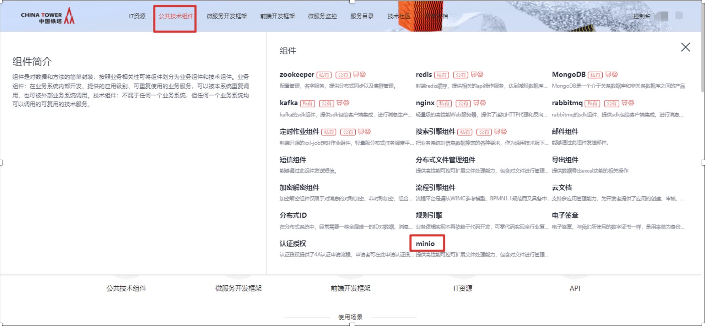
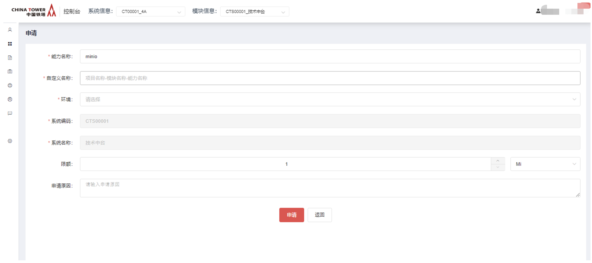
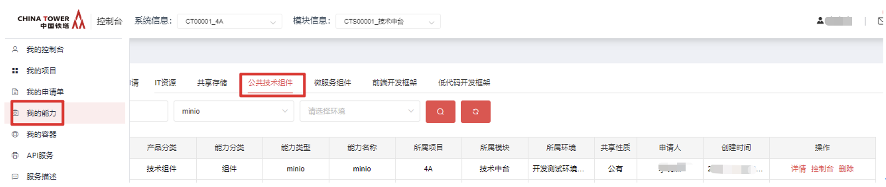
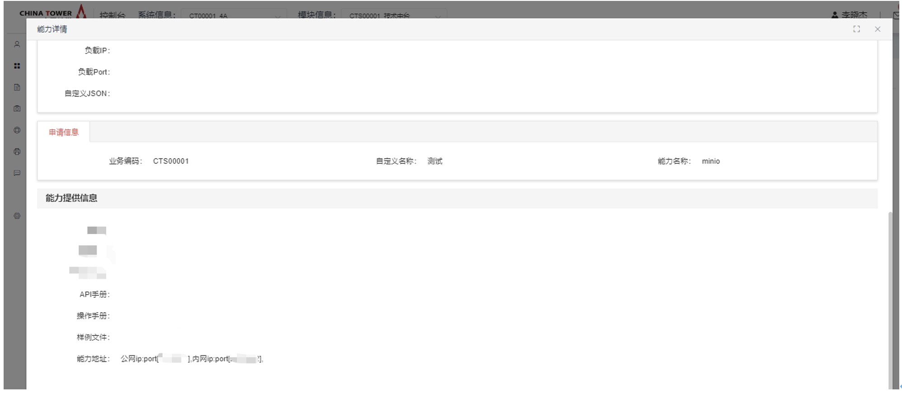
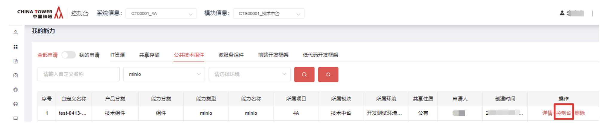
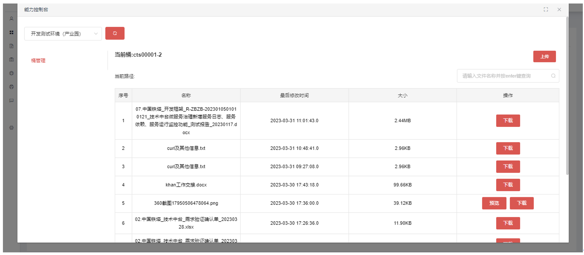

# 分布式文件存储组件

## 开源版本说明

| 版本名 | 版本              | 说明 |
| ------ | ----------------- | ---- |
| minio  | 4月24日自编译版本 |      |

## 功能发布记录

| 版本 | 拟制/修改日期 | 拟制/修改人 | 修改记录 | 批准人 |
| ---- | ------------- | ----------- | -------- | ------ |
| 1.0  | 2023/06/20    | 张历兵      | 初版     |        |
|      |               |             |          |        |

## 重要通知

无

## 组件描述

minio是一个分布式对象存储服务器。存储的文件有容错，如果单一节点故障，可以保证文件不丢失。

### 应用场景

1.分布式文件存储组件是一款高性能的对象存储服务器，适用于云应用程序的数据存储和管理。

2.分布式文件存储组件可作为数据湖的存储层，支持海量的数据存储和快速查询。

3.分布式文件存储组件支持多种数据格式，包括文本、图像、视频和音频等，适用于大数据分析和处理。

4.分布式文件存储组件支持多种流行的媒体格式，包括AVI、MP4、FLV和MKV等，可用于媒体存储和流媒体传输。

## 快速入门

消费者登录技术中台首页，选择“公共技术组件”，点击“minio”

进入申请页面，点击“申请”按钮

填写申请单，填写完毕后，点击“申请”按钮

运营者审批完毕后，消费者在“我的能力”-“公共技术组件”-“minio”-能力详情页面，可以看到能力地址

## 操作指南

点击“我的能力”-“公共技术组件”-“minio控制台”，进入 MinIO 控制台界面。

消费者控制台界面所拥有的功能：

展示当前用户所拥有的桶；

桶内所拥有的文件对象；

点击“上传”按钮，上传附件到当前桶；

通过输入文件名进行查询；

对文件进行“下载”操作；

对 jpg, png, jpeg, gif, mp4, pdf 格式的附件进行“预览”操作

点击“上传”按钮，可以上传附件

## 典型实践

无

## API参考

### 功能清单

| 序号 | 功能名称            | 详细说明                                                     |
| ---- | ------------------- | ------------------------------------------------------------ |
| 1    | 文件上传            | restful API接口，调用API传入参数到文件上传服务，文件系统内部进行文件上传到文件管理服务器并日志登记，返回客户端文件主键信息。 |
| 2    | 文件下载            | restful API接口，调用API传入参数到文件下载服务，文件系统内部返回客户端文件流。 |
| 3    | 获取桶内所有对象    | restful API接口，调用API传入参数到文件服务接口，文件系统内部查询桶内对象信息返回客户端查询结果报文。 |
| 4    | 文件删除            | restful API接口，调用API传入参数到文件删除服务，服务器进行文件删除，返回成功/失败状态信息。 |
| 5    | 文件批量删除        | restful API接口，调用API传入参数到文件批量删除服务，服务器进行文件批量删除，返回成功/失败状态信息。 |
| 6    | Fastdfs方式上传文件 | restful API接口，调用API传入参数到文件上传服务，文件系统内部进行文件上传到文件管理服务器并日志登记，返回客户端文件主键信息。 |
| 7    | Fastdfs方式下载文件 | restful API接口，调用API传入参数到文件下载服务，文件系统内部进行文件下载到文件管理服务器并日志登记，返回客户端文件主键信息。 |
| 8    | 初始化分片任务      | restful API接口，调用API传入参数到文件服务，初始化一个分片上传任务。 |
| 9    | 分片上传            | restful API接口，调用API传入参数到文件分片上传服务，将文件片上传。 |
| 10   | 查询分片上传进度    | restful API接口，调用API传入参数到文件服务，文件服务返回已上传完成的文件片信息。 |
| 11   | 合并分片            | restful API接口，调用API传入参数到文件服务，所有分片上传完成后，进行合并。 |
| 12   | 取消分片任务        | 如果上传分片校验失败可以调用此接口取消分片上传任务 restful API接口，调用API传入参数到文件服务，取消分片上传任务。 |

### Restful API清单

#### 1 文件上传

##### 功能描述

文件上传

##### 请求参数

| 字段       | 父节点 | 字段名称 |      | 字段类型      | 必填 | 备注 |
| ---------- | ------ | -------- | ---- | ------------- | ---- | ---- |
| moduleCode |        | 系统编码 |      | String        | 是   |      |
| file       |        | 文件     |      | MultipartFile | 是   |      |

##### 输出参数

| 字段       | 父节点 | 字段名称 |      | 字段类型 | 必填 | 备注     |
| ---------- | ------ | -------- | ---- | -------- | ---- | -------- |
| status     |        | 状态     |      |          |      | 状态     |
| desc       |        | 描述     |      |          |      | 描述     |
| data       |        |          |      |          |      |          |
| bucketName | data   | 桶名称   |      |          |      | 上传的桶 |
| objectName | data   | 对象名称 |      |          |      | 对象名称 |
| fileId     | data   | 文件ID   |      |          |      | 文件ID   |

##### 请求格式

| HTTP方法     | Post                                                         |
| ------------ | ------------------------------------------------------------ |
| URL          | /ChinatowerFile/upload                                       |
| 输入请求参数 | `form-data {    "moduleCode": "moduleCode",    "file": "multipartFile" }` |
| 响应返回数据 | {   "status": "SUCCESS",   "desc": "上传成功",   "data": {     "bucketName": "cts00002-1",     "objectName": "新建文本文档.txt",     "fileId": "2688eebb14ac4dc3b172267748fb7017"   } } |

#### 8.3.2 文件下载

##### 功能描述

下载对象到本地磁盘

##### 请求参数

| **字段**   | **父节点** | **字段名称** |      | **字段类型** | **必填** | **备注** |
| ---------- | ---------- | ------------ | ---- | ------------ | -------- | -------- |
| bucketName |            | 桶名称       |      | String       | 是       |          |
| objectName |            | 对象名称     |      | String       | 是       |          |

##### 输出参数

Stream文件流

##### 请求格式

| HTTP方法     | Post                                                         |
| ------------ | ------------------------------------------------------------ |
| URL          | /ChinatowerFile/download/{bucketName}/{objectName}           |
| 输入请求参数 | {   "bucketName": "bucketName",   "objectName": "objectName",   "path": "savePath" } |
| 响应返回数据 | Stream                                                       |

#### 3 获取桶内所有对象

##### 功能描述

获取桶内所有对象信息

##### 请求参数

| **字段**   | **父节点** | **字段名称** |      | **字段类型** | **必填** | **备注** |
| ---------- | ---------- | ------------ | ---- | ------------ | -------- | -------- |
| bucketName |            | 桶名称       |      | String       | 是       |          |
| pageSize   |            | 每页数量     |      | String       | 否       |          |
| pageNum    |            | 页数         |      | String       | 否       |          |

##### 输出参数

| **字段**      | **父节点** | **字段名称** |      | **字段类型** | **必填** | **备注**               |
| ------------- | ---------- | ------------ | ---- | ------------ | -------- | ---------------------- |
| status        |            | 状态         |      |              |          | 状态                   |
| desc          |            | 描述         |      |              |          | 描述                   |
| data          |            |              |      |              |          |                        |
| total         |            | 总数         |      |              |          | 总数                   |
| list          |            |              |      |              |          |                        |
| fileId        | list       | 文件ID       |      |              |          | 文件ID                 |
| objectName    | list       | 对象名称     |      |              |          | 对象名称               |
| fileType      | list       | 文件类型     |      |              |          | 文件类型               |
| fileSize      | list       | 文件大小     |      |              |          | 文件大小               |
| fileSizeUnits | list       | 文件大小单位 |      |              |          | 文件大小单位           |
| bucketName    | list       | 桶名称       |      |              |          | 桶名称                 |
| filePath      | list       | 文件路径     |      |              |          | 文件路径               |
| preview       | list       | 可否预览     |      |              |          | 0为不可预览  1为可预览 |
| createTime    | list       | 创建时间     |      |              |          | 创建时间               |
| updateTime    | list       | 最后更新时间 |      |              |          | 最后更新时间           |
| modifier      | list       | 备用字段     |      |              |          | 备用字段               |
| remark        | list       | 备注         |      |              |          | 备注                   |

##### 请求格式

| HTTP方法     | Post                                                         |
| ------------ | ------------------------------------------------------------ |
| URL          | /ChinatowerFile/consoleInfos                                 |
| 输入请求参数 | `{    "bucketName": "cts00002-1" }`                          |
| 响应返回数据 | {   "status": "200",   "desc": "查询成功",   "data": {     "total": 2,     "list": [       {         "fileId": "c64c3c46541a4d14be3f9b6a8f96ca9c",         "fileName": "新建文本文档.txt",         "objectName": "新建文本文档.txt",         "fileType": "txt",         "fileSize": "5.25KB",         "bucketName": "cts00002-1",         "filePath": "http://10.180.22.83:8890/cts00002-1/新建文本文档.txt",         "preview": "0",         "createTime": "2023-04-28 09:56:38",         "updateTime": "2023-04-28 09:59:39",         "modifier": null,         "remark": null       },       {         "fileId": "7efd0434a5bc4e14b331b9509823ba2d",         "fileName": "sbg907.pdf",         "objectName": "9ea1fe7247884a54a0748d7799503a16.pdf",         "fileType": "application/pdf",         "fileSize": "754.87KB",         "bucketName": "cts00002-1",         "filePath": "http://10.180.22.83:8890/cts00002-1/9ea1fe7247884a54a0748d7799503a16.pdf",         "preview": "1",         "createTime": "2023-03-31 15:34:36",         "updateTime": null,         "modifier": null,         "remark": null       }     ],     "pageNum": 1,     "pageSize": 10,     "size": 2,     "startRow": 1,     "endRow": 2,     "pages": 1,     "prePage": 0,     "nextPage": 0,     "isFirstPage": true,     "isLastPage": true,     "hasPreviousPage": false,     "hasNextPage": false,     "navigatePages": 8,     "navigatepageNums": [       1     ],     "navigateFirstPage": 1,     "navigateLastPage": 1   } } |

#### 4 删除文件

##### 功能描述

删除桶内的一个对象

##### 请求参数

| **字段**   | **父节点** | **字段名称** |      | **字段类型** | **必填** | **备注** |
| ---------- | ---------- | ------------ | ---- | ------------ | -------- | -------- |
| bucketName |            | 桶名称       |      | String       | 是       | 桶名称   |
| objectName |            | 对象名称     |      | String       | 是       | 对象名称 |

##### 输出参数

| **字段** | **父节点** | **字段名称** |      | **字段类型** | **必填** | **备注**     |
| -------- | ---------- | ------------ | ---- | ------------ | -------- | ------------ |
| status   |            | 状态         |      | String       | 是       | 状态         |
| desc     |            | 描述         |      | String       | 是       | 描述         |
| data     |            |              |      |              |          | 删除文件数量 |

##### 请求格式

| HTTP方法     | DELETE                                                       |
| ------------ | ------------------------------------------------------------ |
| URL          | /ChinatowerFile/removeObject                                 |
| 输入请求参数 | form-data：{   "bucketName": "bucketName",   "objectName": "objectName" } |
| 响应返回数据 | {   "status": "200",   "desc": "删除成功",   "data": 1 } |

#### 5 批量删除文件

##### 功能描述

删除同一个桶内的多个对象

##### 请求参数

| **字段**   | **父节点** | **字段名称** |      | **字段类型** | **必填** | **备注** |
| ---------- | ---------- | ------------ | ---- | ------------ | -------- | -------- |
| bucketName |            | 桶名称       |      | String       | 是       |          |
| list       |            | 对象名称集合 |      | List         | 是       |          |

##### 输出参数

| **字段** | **父节点** | **字段名称** |      | **字段类型** | **必填** | **备注**     |
| -------- | ---------- | ------------ | ---- | ------------ | -------- | ------------ |
| status   |            | 状态         |      | String       | 是       | 状态         |
| desc     |            | 描述         |      | String       | 是       | 描述         |
| data     |            |              |      |              |          | 删除文件数量 |

##### 请求格式

| HTTP方法     | DELETE                                                       |
| ------------ | ------------------------------------------------------------ |
| URL          | /ChinatowerFile/removeListObject                             |
| 输入请求参数 | `{    "bucketName": "cts00001-1",    "list": [        "测试上传.txt",        "测试上传2.txt"    ] }` |
| 响应返回数据 | `{    "status": "200",    "desc": "删除成功",    "data": 2 }` |

#### 6 Fastdfs方式上传文件

##### 功能描述

由Fastdfs分布式文件迁移至minIO分布式文件，使用原文件组件字段进行上传

##### 请求参数

| **字段** | **父节点** | **字段名称** |      | **字段类型** | **必填** | **备注** |
| -------- | ---------- | ------------ | ---- | ------------ | -------- | -------- |
| file     |            | 文件         |      | String       | 是       |          |
| sysCode  |            | 系统编码     |      | String       | 是       |          |

##### 输出参数

| **字段** | **父节点** | **字段名称** |      | **字段类型** | **必填** | **备注** |
| -------- | ---------- | ------------ | ---- | ------------ | -------- | -------- |
| status   |            | 状态         |      | String       | 是       | 状态     |
| desc     |            | 描述         |      | String       | 是       | 描述     |
| data     |            |              |      |              |          |          |

##### 请求格式

| HTTP方法     | Post                                                         |
| ------------ | ------------------------------------------------------------ |
| URL          | /file/upload                                                 |
| 输入请求参数 | `{    "file": "multipartFile",    "sysCode": "cts00001" }`   |
| 响应返回数据 | `{    "status": "SUCCESS",    "desc": "执行成功",    "data": {        "bucketName": "cts00002-1",        "objectName": "新建文本文档.txt",        "fileId": "6992460107fa417893ae2e7c0972cd07"    } }` |

#### 7 Fastdfs方式下载文件

##### 功能描述

由Fastdfs分布式文件迁移至minIO分布式文件，使用原文件组件字段进行下载

##### 请求参数

| **字段** | **父节点** | **字段名称** |      | **字段类型** | **必填** | **备注** |
| -------- | ---------- | ------------ | ---- | ------------ | -------- | -------- |
| fileId   |            | 文件ID       |      | String       | 是       |          |

##### 输出参数

Stream

##### 请求格式

| HTTP方法     | GET                         |
| ------------ | --------------------------- |
| URL          | /file/download              |
| 输入请求参数 | `{    "fileId":"xxxxxxx" }` |
| 响应返回数据 | Stream                      |

#### 8 初始化分片上传任务

##### 功能描述

进行分片上传请先初始化分片上传任务

##### 请求参数

| **字段**   | **父节点** | **字段名称** |      | **字段类型** | **必填** | **备注**             |
| ---------- | ---------- | ------------ | ---- | ------------ | -------- | -------------------- |
| identifier |            | 文件MD5      |      | String       | 是       | 根据文件生成的唯一ID |
| fileName   |            | 文件名称     |      | String       | 是       | 文件名称             |
| totalSize  |            | 文件大小     |      | String       | 是       | 单位：字节           |
| chunkSize  |            | 每片大小     |      | String       | 是       | 单位：字节           |
| moduleCode |            | 系统编码     |      | String       | 是       | param                |

##### 输出参数

| **字段**     | **父节点** | **字段名称** |      | **字段类型** | **必填** | **备注**     |
| ------------ | ---------- | ------------ | ---- | ------------ | -------- | ------------ |
| status       |            | 状态         |      |              | 是       | 状态         |
| desc         |            | 描述         |      |              | 是       | 描述         |
| data         |            |              |      |              |          |              |
| finished     | data       | 初始化状态   |      |              |          | 初始化状态   |
| path         | data       | 文件路径     |      |              |          | 文件路径     |
| taskRecord   | data       | 分片文件数组 |      |              |          | 分片文件数组 |
| fileId       | data       | 文件ID       |      |              |          | 文件ID       |
| objectName   | data       | 对象名称     |      |              |          | 对象名称     |
| bucketName   | data       | 桶名称       |      |              |          | 桶名称       |
| exitPartList | taskRecord | 分片上传信息 |      |              |          | 分片上传信息 |

##### 请求格式

| HTTP方法     | Post                                                         |
| ------------ | ------------------------------------------------------------ |
| URL          | /minioTasks?moduleCode=?                                     |
| 输入请求参数 | `{    "identifier": "08d8f8507ddd75f6fc9dd84476091963",    "fileName": "chinatower-minio-service-20230419154449.jar",    "totalSize": 89560305,    "chunkSize": 44780152 }` |
| 响应返回数据 | `{    "status": "SUCCESS",    "desc": "执行成功",    "data": {        "finished": true,        "path": "http://10.180.22.83:8890/cts00002-1/chinatower-minio-service-20230419154449.jar",        "taskRecord": {            "exitPartList": null        },        "fileId": "2d9a48f538a743a5ab8ef881d54a7c22",        "objectName": "chinatower-minio-service-20230419154449.jar",        "bucketName": "cts00002-1"    } }` |

#### 9 分片上传

##### 功能描述

将已完成分片的文件片上传至minIO

##### 请求参数

| **字段**      | **父节点** | **字段名称** |      | **字段类型**  | **必填** | **备注**   |
| ------------- | ---------- | ------------ | ---- | ------------- | -------- | ---------- |
| identifier    |            | 文件MD5      |      | String        | 是       | 文件MD5    |
| partNumber    |            | 文件片序号   |      | Integer       | 是       | 文件片序号 |
| multipartFile |            | 文件片       |      | MultipartFile | 是       | 文件片     |
| bucketName    |            | 桶名称       |      | String        | 是       | 桶名称     |

##### 输出参数

| **字段**        | **父节点** | **字段名称** | **字段类型** | **必填** | **备注**        |
| --------------- | ---------- | ------------ | ------------ | -------- | --------------- |
| status          |            | 状态         | String       | 是       | 状态            |
| desc            |            | 描述         | String       | 是       | 描述            |
| data            |            |              |              |          | 上传成功片数    |
| data.etag       | data       |              |              |          | 当前分片的md5值 |
| data.partNumber | data       |              |              |          | 当前分片的编号  |

##### 请求格式

| HTTP方法     | Post                                                         |
| ------------ | ------------------------------------------------------------ |
| URL          | /minioTasks/uploadTaskFile                                   |
| 输入请求参数 | `form-data: {    "identifier":"xxxxxxx",    "partNumber":"1",    "multipartFile": MultipartFile,    "bucketName": "xxxxx" }` |
| 响应返回数据 | `{    "status": "SUCCESS",    "desc": "执行成功",    "data": {        "etag" : "xxxxxxxxx",        "partNumber" : 1    } }` |

#### 10 查询分片上传进度

##### 功能描述

查询分片文件上传进度情况

##### 请求参数

| **字段**   | **父节点** | **字段名称** |      | **字段类型** | **必填** | **备注** |
| ---------- | ---------- | ------------ | ---- | ------------ | -------- | -------- |
| identifier |            | 文件MD5      |      | String       | 是       |          |
| bucketName |            | 桶名称       |      | String       | 是       | 桶名称   |

##### 输出参数

| **字段**     | **父节点**   | **字段名称**     |      | **字段类型** | **必填** | **备注**     |
| ------------ | ------------ | ---------------- | ---- | ------------ | -------- | ------------ |
| status       |              | 状态             |      | String       | 是       | 状态         |
| desc         |              | 描述             |      | String       | 是       | 描述         |
| data         |              |                  |      |              |          |              |
| taskRecord   |              | 分片文件信息数组 |      |              |          | 分片文件信息 |
| exitPartList | taskRecord   | 分片信息         |      |              |          | 分片信息     |
| partNumber   | exitPartList | 分片序号         |      |              |          | 分片序号     |
| lastModified | exitPartList | 完成时间         |      |              |          | 完成时间     |
| size         | exitPartList | 分片大小         |      |              |          | 分片大小     |
| etag         | exitPartList | 标识             |      |              |          | 标识         |

##### 请求格式

| HTTP方法     | GET                                                          |
| ------------ | ------------------------------------------------------------ |
| URL          | /minioTasks/identifier                                       |
| 输入请求参数 | `{  "identifier":"xxxxxxxxxxxxxxxxxxxxxx" }`                 |
| 响应返回数据 | `{    "status": "SUCCESS",    "desc": "执行成功",    "data": {        "finished": false,        "path": "http://10.180.22.83:8890/cts00002-1/chinatower-minio-service-20230419154449.jar",        "taskRecord": {            "exitPartList": [                {                    "partNumber": 1,                    "lastModified": "2023-04-26T09:11:48.934+00:00",                    "size": 89560556,                    "etag": "ece4ce319bbf71ef49bdef8074f52c51"                }            ]        }    } }` |

#### 11 合并分片

##### 功能描述

文件片都上传完成后进行合并分片操作

##### 请求参数

| **字段**   | **父节点** | **字段名称** |      | **字段类型** | **必填** | **备注** |
| ---------- | ---------- | ------------ | ---- | ------------ | -------- | -------- |
| identifier |            | 文件MD5      |      | String       | 是       |          |
| bucketName |            | 桶名称       |      | String       | 是       |          |

##### 输出参数

| **字段** | **父节点** | **字段名称** |      | **字段类型** | **必填** | **备注** |
| -------- | ---------- | ------------ | ---- | ------------ | -------- | -------- |
| status   |            | 状态         |      | String       | 是       | 状态     |
| desc     |            | 描述         |      | String       | 是       | 描述     |
| data     |            |              |      |              |          |          |

##### 请求格式

| HTTP方法     | POST                                                         |
| ------------ | ------------------------------------------------------------ |
| URL          | /minioTasks/merge                                            |
| 输入请求参数 | `{    "identifier":"xxxxxxxxxxxxxxxxxxxxxx" }`               |
| 响应返回数据 | `{    "status": "SUCCESS",    "desc": "执行成功",    "data": "合并成功" }` |

#### 12 取消分片任务

##### 功能描述

分片md5校验失败后，或不想继续上传，可取消当前分片任务，保证后续重新执行分片上传任务

##### 请求参数

| **字段**   | **父节点** | **字段名称** | **字段类型** | **必填** | **备注** |
| ---------- | ---------- | ------------ | ------------ | -------- | -------- |
| identifier |            | 文件MD5      | String       | 是       |          |
| bucketName |            | 桶名称       | String       | 是       |          |

##### 输出参数

| **字段** | **父节点** | **字段名称** |      | **字段类型** | **必填** | **备注** |
| -------- | ---------- | ------------ | ---- | ------------ | -------- | -------- |
| status   |            | 状态         |      | String       | 是       | 状态     |
| desc     |            | 描述         |      | String       | 是       | 描述     |
| data     |            |              |      |              |          |          |

##### 请求格式

| HTTP方法     | delete                                                       |
| ------------ | ------------------------------------------------------------ |
| URL          | /minioTasks/abortTasks                                       |
| 输入请求参数 | `{    "identifier":"xxxxxxxxxxxxxxxxxxxxxx",    "bucketName": "xxxxx" }` |
| 响应返回数据 | `{    "status": "SUCCESS",    "desc": "取消成功",    "data": "取消成功" }` |

### 附录

#### 枚举值清单

##### 响应码清单

| 序号 | 编码 | 描述     | 备注 |
| ---- | ---- | -------- | ---- |
| 1    | 200  | 操作成功 |      |
| 2    | 400  | 操作异常 |      |

## SDK

无

## 网络要求

- 单向打通业务服务到分布式文件组件系统的网络

## 常见问题

无

## 样例文件

无

