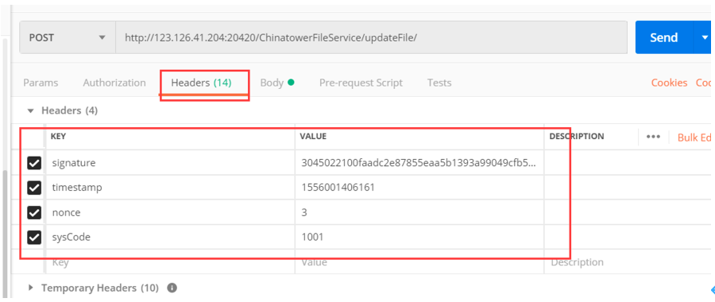

# 分布式文件管理组件

## 开源版本说明

| 版本名  | 版本  | 说明 |
| ------- | ----- | ---- |
| fastdfs | 5.0.5 |      |

## 功能发布记录

| 版本 | 拟制/修改日期 | 拟制/修改人 | 修改记录 | 批准人 |
| ---- | ------------- | ----------- | -------- | ------ |
| 1.0  | 2022/11/10    | 张历兵      | 初版     |        |
|      |               |             |          |        |

## 重要通知

> [!IMPORTANT]
>
> 生产环境接口最大并发数为1500，超过最大并发的请求将被丢弃，或影响服务正常使用。

> [!IMPORTANT]
>
> 新接系统并发数建议不超过300，如果预估超过300请联系技术中台组。

## 组件描述

### 目标

提升铁塔IT自主掌控能力，提高开发效率，解决大容量文件存储及调阅问题。

### 读者

应用系统维护人员；

应用系统开发人员；

### 参考资料

| 序号 | 文档名称                               | 最后修订时间 | 版本号 | 来源         |
| ---- | -------------------------------------- | ------------ | ------ | ------------ |
| 1    | 中国铁塔IT系统技术架构总体规划（总册） | 2017/05/05   | 1.0    | 铁塔内部资料 |
| 2    | 中国铁塔架构组公共枚举值清单V1.0.docx  | 2019-04-08   | 1.0    | 铁塔内部资料 |

### 术语定义

| 序号 | 简称/术语 | 说明                                                 |
| ---- | --------- | ---------------------------------------------------- |
| 1    | fastdfs   | 开源的轻量级分布式文件系统，对文件进行管理           |
| 2    | RESTful   | 软件架构风格、设计风格，提供了一组设计原则和约束条件 |

### 适用范围

| 序号 | 类别         | 支持                                               | 不支持   |
| ---- | ------------ | -------------------------------------------------- | -------- |
|      | 语言         | 不受限制                                           | 无       |
|      | 架构         | 不受限制                                           | 无       |
|      | 文件类型     | Excel、word、txt、视频、音频等                     | 无       |
|      | 文件大小     | 文件上传下载的大小建议范围：4KB < file_size <500MB | 大于500M |
|      | 操作类型     | 上传、下载、批量下载、文件调阅、文件删除           | 批量上传 |
|      | 静态资源访问 | 支持例如css、jpg、png、html等静态资源访问          |          |

## 快速入门

无

## 操作指南

### 环境要求

（1）因服务器网络策略不支持本机访问本机外网，请使用铁塔内网网络对接。

### 功能清单

| 序号 | 功能名称             | 详细说明                                                     |
| ---- | -------------------- | ------------------------------------------------------------ |
| 1    | 获取文件访问权限令牌 | restful API接口，服务端返回文件访问权限令牌信息。此令牌用于操作文件上传、下载、更新、删除等操作的权限认证。 |
| 2    | 文件上传             | restful API接口，调用获取文件访问权限令牌接口获取令牌，将访问令牌、文件名称、文件类型参数请求文件上传服务，文件系统内部进行文件上传到文件管理服务器并日志登记，返回客户端文件唯一主键信息。 |
| 3    | 文件下载             | restful API接口，调用[获取签名](http://mid.chinatowercom.cn:18080/docs/chinatower-component/v1.0/module/分布式文件管理组件.html#获取签名)方法获取签名，传人签名、唯一主键等参数请求文件上传服务，服务器返回文件流信息 |
| 4    | 文件批量下载         | restful API接口，返回打包的压缩包，调用[获取签名](http://mid.chinatowercom.cn:18080/docs/chinatower-component/v1.0/module/分布式文件管理组件.html#获取签名)方法获取签名，传人签名、逗号分隔的文件id集合等参数请求文件下载服务，服务器返将相关文件进行压缩打包，返回http下载链接。文件大小限制在4KB至500M之间。 |
| 5    | 文件删除             | restful API接口，调用[获取签名](http://mid.chinatowercom.cn:18080/docs/chinatower-component/v1.0/module/分布式文件管理组件.html#获取签名)方法获取签名，传人签名、唯一主键等参数组成的集合数据请求文件下载服务，服务器进行文件删除，返回成功/失败状态信息。 |
| 6    | 静态资源访问         | http协议服务，给各系统分配静态文件存放目录，如图片、css、html文件等静态资源能够直接通过http的方式进行访问 |

### 服务环境信息

各个环境地址信息请到 我的申请单 → 详情页 → 能力地址 查看

### 附录

### 枚举值清单

#### 文件可见性级别

| 序号 | 名称           | 编码 | 备注                                                 |
| ---- | -------------- | ---- | ---------------------------------------------------- |
| 1    | 系统私有       | 1001 | 本系统可以下载、删除、更新，其它系统不能             |
| 2    | 内部系统间可见 | 1002 | 本系统可以进行下载、删除、更新、其它系统可以进行下载 |
| 3    | 完全公开       | 1003 | 无权限验证，所有系统用户可下载                       |

#### 响应码清单

| 序号 | 编码   | 描述             | 备注 |
| ---- | ------ | ---------------- | ---- |
| 1    | 000000 | 操作成功         |      |
| 2    | 999999 | 操作失败         |      |
| 3    | 000001 | 服务器内部异常   |      |
| 4    | 000002 | 接口鉴权失败     |      |
| 5    | 000003 | 请求参数不完整   |      |
| 6    | 000004 | 业务逻辑处理失败 |      |

### 获取签名

请求地址：

| 接口类型     | HTTP                                                         |
| ------------ | ------------------------------------------------------------ |
| 接口提交方式 | POST                                                         |
| 接口地址     | http:/ip:port/ChinatowerFileService/getSignature  注：各环境IP和端口参见7.3服务环境信息 |

请求参数

| **参数名称** | **说明** | **约束** | **类型** | **参数区域类型** | **备注**                                                     |
| ------------ | -------- | -------- | -------- | ---------------- | ------------------------------------------------------------ |
| timestamp    | 时间戳   | 必填     | String   | Headers          |                                                              |
| nonce        | 随机数   | 必填     | String   | Headers          |                                                              |
| sysCode      | 系统编码 | 必填     | String   | Headers          | 规则参照附录[系统编码](http://mid.chinatowercom.cn:18080/docs/chinatower-component/v1.0/module/分布式文件管理组件.html#系统编码) |

请求参数示例：


响应参数

| 参数名称 | 说明         | 类型   | 备注                    |
| -------- | ------------ | ------ | ----------------------- |
| code     | 返回码       | String | 参见附录8.1.3响应码清单 |
| mes      | 返回码描述   | String |                         |
| data     | 返回数据信息 | String | 签名字符串              |

响应参数示例：

```json
{
    "code":"000000",
    "mes":"操作成功",
	"data":"3046022100c07ba61eb9c2d641246dc3112d281532710639c041b34702d2ad2597c61c05d90221008199e123504a18ed76c26"
}
```

### JS插件(断点续传)

#### 8.3.1使用说明：

将提供好的 fileUtil.js 引入到客户端前端项目中，如果没有，请联系架构室，然后在界面中引用该js文件以及jquery文件:然后在onclick函数中调用以下方法，这里案例是将一些参数直接写死在js中，请修改为真实数据。

```js
sendRequest($('#file')[0],headersData,'http://localhost:8769/ChinatowerFileService/uploadFile1','1001','3444');
```

该js函数会直接请求支持断点续传的文件上传接口，内部进行了参数封装处理，所以接口中的以下参数会自动生成并添加到请求中，无需自己添加。

| UUID     | 文件切片编码 | 必填 |
| -------- | ------------ | ---- |
| count    | 切片总数量   | 必填 |
| fileName | 文件名称     | 必填 |
| index    | 当前切片标识 | 必填 |

#### 8.3.2js函数参数说明：

```javascript
/**
* @param divId dom对象，不是jquer对象
* @param headersData1 headers信息
* @param url 请求上传文件地址
* @param visibilityLevel 文件可见性级别
* @param userId 用户ID
* @returns \{boolean}
*/

function sendRequest(divId,headersData1,url,visibilityLevel,userId)
```

#### 8.3.3使用案例：

```html
<!DOCTYPE html>
<html>
    <head lang="en">
        <meta charset="UTF-8">
        <title></title>
    </head>
    <script>
        **_headersData_**={
            sysCode:"CT00026",
            signature:"3046022100a457bca5a96571b758b8bfdff161c035af8182267ab3fbc8c8acc9327810af62022100e324bafc5634",
            timestamp:"1572766124158",
            nonce:"2"
        }
    </script>
    <body>
        <input type="file" id="file" name="file"/>
        <button onclick="sendRequest($('#file')[0],*_headersData_*,'http://localhost:8769/ChinatowerFileService/uploadFile1','1001','3444');">上传</button>
    </body>
    <script type="text/JavaScript" src="../static/jquery.min.js"></script>
    <script type="text/JavaScript" src="../static/jquery.form.js"></script>
    <script type="text/javascript" src="../static/fileUtil.js"></script>
</html>
```

## 典型实践

无

## API参考

### Restful API清单

#### restful API-文件上传

请求地址：

| 接口类型     | HTTP                                                         |
| ------------ | ------------------------------------------------------------ |
| 接口提交方式 | POST                                                         |
| 接口地址     | http://ip:port/ChinatowerFileService/uploadFile/  注：各环境IP和端口参见7.3服务环境信息 |

请求参数

| **参数名称**    | **说明**        | **约束**         | **类型** | **参数区域类型** | **备注**                                                     |
| --------------- | --------------- | ---------------- | -------- | ---------------- | ------------------------------------------------------------ |
| visibilityLevel | 文件可见性级别  | 必填             | String   | Body form-data   | 规则参照附录文件可见性级别枚举值                             |
| file            | 文件            | 必填             | 文件流   | Body form-data   |                                                              |
| userId          | 用户            | 必填             | String   | Body form-data   |                                                              |
| hasOut          | 是否包含外部url | 非必填，默认为否 | String   | Body form-data   |                                                              |
| signature       | 签名            | 必填             | String   | Headers          | 调用[获取签名](http://mid.chinatowercom.cn:18080/docs/chinatower-component/v1.0/module/分布式文件管理组件.html#获取签名) |
| timestamp       | 时间戳          | 必填             | String   | Headers          |                                                              |
| nonce           | 随机数          | 必填             | String   | Headers          |                                                              |
| sysCode         | 系统编码        | 必填             | String   | Headers          | 规则参照附录[系统编码](http://mid.chinatowercom.cn:18080/docs/chinatower-component/v1.0/module/分布式文件管理组件.html#系统编码) |

请求参数示例：


响应参数

| 参数名称 | 说明         | 类型   | 备注                           |
| -------- | ------------ | ------ | ------------------------------ |
| code     | 返回码       | String | 参见附录8.1.3响应码清单        |
| mes      | 返回码描述   | String |                                |
| data     | 返回数据信息 | Object | 包含文件ID和下载地址： file_id |

响应参数示例：

```json
{
    "code":"000000",
    "mes":"操作成功",
    "data":{
        "file_id":"3CC506BA0F8C4ADDBD73744AC6850FF0"
    }
}
```

#### restful API-文件下载

请求地址：

| 接口类型     | HTTP                                                         |
| ------------ | ------------------------------------------------------------ |
| 接口提交方式 | GET                                                          |
| 接口地址     | http://ip:port/ChinatowerFileService/dowloadFile/  注：各环境IP和端口参见7.3服务环境信息 |

请求参数

| 参数名称  | 说明     | 约束 | 类型   | 参数位置 | 备注                                                         |
| --------- | -------- | ---- | ------ | -------- | ------------------------------------------------------------ |
| fileId    | 文件id   | 必填 | String | Prams    |                                                              |
| userId    | 用户     | 必填 | String | Prams    |                                                              |
| signature | 签名     | 必填 | String | Headers  | 调用[获取签名](http://mid.chinatowercom.cn:18080/docs/chinatower-component/v1.0/module/分布式文件管理组件.html#获取签名) |
| timestamp | 时间戳   | 必填 | String | Headers  |                                                              |
| nonce     | 随机数   | 必填 | String | Headers  |                                                              |
| sysCode   | 系统编码 | 必填 | String | Headers  | 规则参照附录[系统编码](http://mid.chinatowercom.cn:18080/docs/chinatower-component/v1.0/module/分布式文件管理组件.html#系统编码) |

请求参数示例：


响应参数

| 参数名称 | 说明       | 类型     | 备注                                  |
| -------- | ---------- | -------- | ------------------------------------- |
| 文件流   | 文件流数据 | 二进制流 |                                       |
| code     | 返回码     | String   | 异常情况返回。参见附录8.1.3响应码清单 |
| mes      | 返回码描述 | String   | 异常情况返回。                        |

#### restful API-文件批量下载

请求地址：

| 接口类型     | HTTP                                                         |
| ------------ | ------------------------------------------------------------ |
| 接口提交方式 | GET                                                          |
| 接口地址     | http://ip:port/ChinatowerFileService/batchDowloadFile/  注：各环境IP和端口参见7.3服务环境信息 |

请求参数

批量下载时多个数据之间以数组格式上送。

| 参数名称  | 说明     | 约束 | 类型   | 参数位置 | 备注                                                         |
| --------- | -------- | ---- | ------ | -------- | ------------------------------------------------------------ |
| fileIds   | 文件id   | 必填 | String | Prams    | 多个用逗号隔开                                               |
| userId    | 用户     | 必填 | String | Prams    |                                                              |
| signature | 签名     | 必填 | String | Headers  | 调用[获取签名](http://mid.chinatowercom.cn:18080/docs/chinatower-component/v1.0/module/分布式文件管理组件.html#获取签名) |
| timestamp | 时间戳   | 必填 | String | Headers  |                                                              |
| nonce     | 随机数   | 必填 | String | Headers  |                                                              |
| sysCode   | 系统编码 | 必填 | String | Headers  | 规则参照附录[系统编码](http://mid.chinatowercom.cn:18080/docs/chinatower-component/v1.0/module/分布式文件管理组件.html#系统编码) |

请求参数示例：


响应参数

正常情况返回打包的文件流信息，异常情况返回异常码和描述

| 参数名称 | 说明       | 类型     | 备注                                  |
| -------- | ---------- | -------- | ------------------------------------- |
| 文件流   | 文件流数据 | 二进制流 |                                       |
| code     | 返回码     | String   | 异常情况返回。参见附录8.1.3响应码清单 |
| mes      | 返回码描述 | String   | 异常情况返回。                        |

#### restful API-文件删除

请求地址：

| 接口类型     | HTTP                                                         |
| ------------ | ------------------------------------------------------------ |
| 接口提交方式 | POST                                                         |
| 接口地址     | http://IP:port/ChinatowerFileService/deleteFile/  注：各环境IP和端口参见7.3服务环境信息 |

请求参数

| 参数名称  | 说明     | 约束 | 类型   | 参数位置 | 备注                                                         |
| --------- | -------- | ---- | ------ | -------- | ------------------------------------------------------------ |
| fileId    | 文件id   | 必填 | String | Prams    |                                                              |
| userId    | 用户     | 必填 | String | Prams    |                                                              |
| signature | 签名     | 必填 | String | Headers  | 调用[获取签名](http://mid.chinatowercom.cn:18080/docs/chinatower-component/v1.0/module/分布式文件管理组件.html#获取签名) |
| timestamp | 时间戳   | 必填 | String | Headers  |                                                              |
| nonce     | 随机数   | 必填 | String | Headers  |                                                              |
| sysCode   | 系统编码 | 必填 | String | Headers  | 规则参照附录[系统编码](http://mid.chinatowercom.cn:18080/docs/chinatower-component/v1.0/module/分布式文件管理组件.html#系统编码) |

请求参数示例：


响应参数

| 参数名称 | 说明       | 类型   | 备注                    |
| -------- | ---------- | ------ | ----------------------- |
| code     | 返回码     | String | 参见附录8.1.3响应码清单 |
| mes      | 返回码描述 | String |                         |

#### restful API-文件修改

请求地址：

| 接口类型     | HTTP                                                         |
| ------------ | ------------------------------------------------------------ |
| 接口提交方式 | POST                                                         |
| 接口地址     | http:/ip:port/ChinatowerFileService/updateFile/  注：各环境IP和端口参见7.3服务环境信息 |

请求参数

| **参数名称**    | **说明**       | **约束** | **类型** | **参数区域类型** | **备注**                                                     |
| --------------- | -------------- | -------- | -------- | ---------------- | ------------------------------------------------------------ |
| fileId          | 文件id         | 必填     | String   | Body form-data   |                                                              |
| visibilityLevel | 文件可见性级别 | 必填     | String   | Body form-data   | 规则参照附录文件可见性级别枚举值                             |
| userId          | 用户           | 必填     | String   | Body form-data   |                                                              |
| file            | 文件           | 必填     | 文件流   | Body form-data   |                                                              |
| signature       | 签名           | 必填     | String   | Headers          | 调用[获取签名](http://mid.chinatowercom.cn:18080/docs/chinatower-component/v1.0/module/分布式文件管理组件.html#获取签名) |
| timestamp       | 时间戳         | 必填     | String   | Headers          |                                                              |
| nonce           | 随机数         | 必填     | String   | Headers          |                                                              |
| sysCode         | 系统编码       | 必填     | String   | Headers          | 规则参照附录[系统编码](http://mid.chinatowercom.cn:18080/docs/chinatower-component/v1.0/module/分布式文件管理组件.html#系统编码) |

请求参数示例：




响应参数

| 参数名称 | 说明         | 类型   | 备注                           |
| -------- | ------------ | ------ | ------------------------------ |
| code     | 返回码       | String | 参见附录8.1.3响应码清单        |
| mes      | 返回码描述   | String |                                |
| data     | 返回数据信息 | Object | 包含文件ID和下载地址： file_id |

响应参数示例：

```json
{
    "code":"000000",
    "mes":"操作成功",
    "data":{
        "file_id":"EB9F873EC74845F09E955EF26F43D07D"
    }
}
```

## SDK

无

## 网络要求

无

## 常见问题

无

## 样例文件

 [chinatower_fastdfs_demo.zip](../file/chinatower_fastdfs_demo.zip) 

