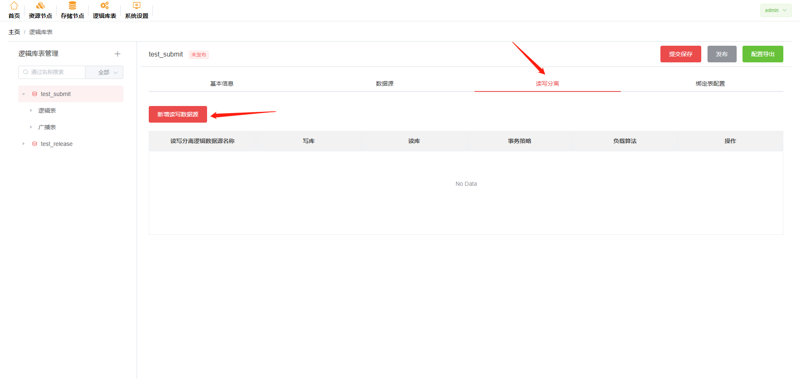
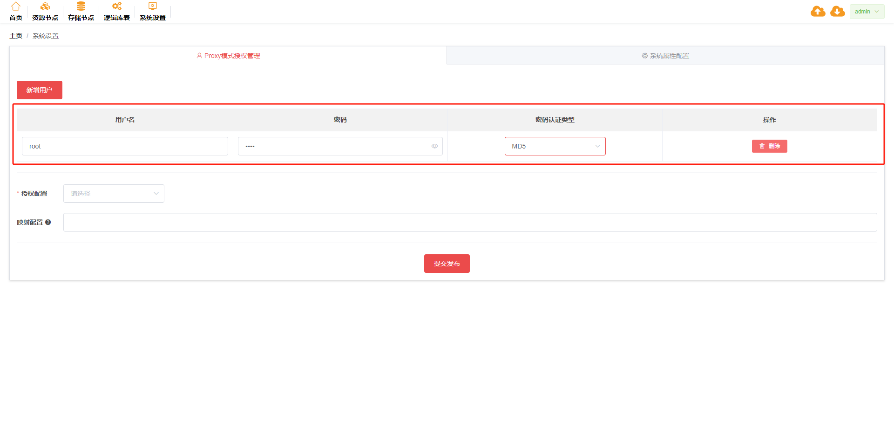

# 分库分表组件

## 功能发布记录

| 版本 | 拟制/修改日期 | 拟制/修改人 | 修改记录 | 批准人 |
| ---- | ------------- | ----------- | -------- | ------ |
| 1.0  | 2023/09/10    | 梁冰        | 初版     |        |

## 重要通知

无

## 组件描述

### 目标

以业务为导向，结合规范化的企业架构为出发点，推进技术中台组件沉淀，实现具备统一模型、低代码开发、大数据处理、数据质量保证能力的分库分表组件的开发，完成分库分表组件可视化管理。

### 读者

应用系统维护人员；

应用系统开发人员；

### 参考资料

| 序号 | 文档名称                               | 最后修订时间 | 版本号 | 来源         |
| ---- | -------------------------------------- | ------------ | ------ | ------------ |
|      | 中国铁塔IT系统技术架构总体规划（总册） | 2017/05/05   | 1.0    | 铁塔内部资料 |
|      | 中国铁塔架构组公共枚举值清单V1.0.docx  | 2019-04-08   | 1.0    | 铁塔内部资料 |

### 术语定义

| 序号 | 简称/术语 | 说明                                                         |
| ---- | --------- | ------------------------------------------------------------ |
| 1    | 逻辑库    | 逻辑库配置的数据库实例作为数据源，并从逻辑维度上管理数据库和表的元数据信息。 |
| 2    | 资源节点  | 资源节点管理包含对各个节点信息的管理，包含地址端口、访问用户、运行状态和物理机基础配置。 |
| 3    | 计算节点  | 管理JDBC / Proxy节点信息，信息包含IP地址和端口               |
| 4    | 存储节点  | 配置访问真实物理库实例的信息,包括:数据库类型、主机、端口、用户名密码。 |
| 5    | 协调中心  | 协调中心集成注册中心与配置中心的功能，用于支撑集群模式下的运行方式。组件支持配置Zookeeper作为注册中心，需要配置注册中心的主机和端口等信息，通过注册中心实现节点发现和管理。 |
| 6    | 负载中心  | 负载中心配合proxy实现集群模式接入的负载均衡配置，用于管理负载中心各节点的上下线状态 |
| 7    | Java      | Java是一门面向对象编程语言，Java具有简单性、面向对象、分布式、健壮性、安全性、平台独立与可移植性、多线程、动态性等特点 。Java可以编写桌面应用程序、Web应用程序、分布式系统和嵌入式系统应用程序等。 |
| 8    | 业务架构  | 业务架构定义了在总体企业战略指导下希望实现的业务能力及其关系，以及解决各组织之间的业务逻辑。 |
| 9    | 应用架构  | 是对信息管理系统进行的高层应用划分，指导整个信息系统构建和实施。 |
| 10   | 技术架构  | 是基于面向服务的架构思路，实现信息、应用、流程横向贯通，支持应用架构优化和提升的技术平台架构；<br />定义各个信息基础设施之间的关系，从宏观和微观角度分析信息系统的发展过程和技术要求，并为保障和支撑应用和数据提供一个可实现的基础。 |
| 11   | 数据架构  | 是从跨组织应用系统的视角对数据进行组织和管理，包括对整个数据生命周期中数据的处理、存储、转换、整合、分布制定的策略、模型、流程、以及支持这些策略、模型、流程的技术架构方案。 |

### 适用范围

| 序号 | 类别   | 支持   | 不支持 |
| ---- | ------ | ------ | ------ |
|      | 语言   | JAVA   | 无     |
|      | 架构   | 微服务 | 无     |
|      | 数据库 | MySQL  | 无     |

## 快速入门

### 组件申请

消费者登录技术中台首页，选择公共技术组件，点击分库分表组件，进入分库分表组件申请页面，点击提交，等待技术中台管理员审批通过后，即可使用。


按照页面中的提示，填写具体信息，点击申请按钮提交。


能力申请通过后，消费者在我的能力中将看到对应能力。


点击详情，可以看到具体能力信息。


## 操作指南

### 环境要求

- 组件现阶段作为私有化版本发布，需要业务系统自行申请或利旧服务器资源，请根据自身业务场景及使用情况评估资源容量。
- 组件部署环境依赖 JDK1.8。
- 组件依赖 zookeeper 服务，请业务系统复用自身服务，或申请部署服务，服务地址配置到可视化控制台和Proxy程序配置文件中，建议版本 3.8.2。
- 组件只支持Mysql数据库作为数据源配置，请业务系统复用自身数据库服务，或申请数据库服务，Mysql5.7 或 Mysql8.0。

### 用户手册

### 1 登录入口

#### 1.1 功能概述

业务系统管理员角色用户，通过私有化部署后的前端工程页面登录。

#### 1.2 操作角色

铁塔信息化建设部门以及合作伙伴。

#### 1.3 操作步骤

登录系统后，会自动登录系统并跳转到系统首页，如下图所示：


### 2 首页

#### 2.1 功能概述

用户登录后默认展示节点个数信息、逻辑库表数量以及协调中心列表和计算节点列表。

#### 2.2 操作角色

铁塔信息化建设部门以及合作伙伴。

#### 2.3 操作步骤

首页展示各版本信息：如下图所示：


### 3 资源节点管理

#### 3.1 功能概述

管理分库组件底层使用的物理资源。包括的主机信息，存储节点信息，协调节点信息，ip信息，备注信息等。

#### 3.2 操作角色

铁塔信息化建设部门以及合作伙伴。

#### 3.3 操作步骤

资源节点管理功能位置，点击菜单【资源节点】，进入资源节点管理页面。


进入资源节点管理页面后，点击左侧【新增】按钮添加资源节点


添加资源节点时请填写自定义主机名，IP地址，备注，并选择对应的资源标签，点击提交按钮保存资源节点数据。


添加后的数据会在列表页显示，列表支持筛选查询，并且用户可点击操作栏中的图标进行修改和删除操作。


### 4 存储节点管理

#### 4.1 功能概述

对数据源信息的维护及数据源的可视化配置。

#### 4.2 操作角色

铁塔信息化建设部门以及合作伙伴。

#### 4.3 操作步骤

存储节点管理功能位置，点击菜单【存储节点】，进入存储节点管理页面。


进入存储节点管理页面后，点击左侧【新增】按钮添加存储节点


添加存储节点时，按表单页面填写数据源必要信息项，IP地址为【资源节点】中资源标签为存储节点的数据，支持修改连接池配置以及自定义连接池属性，可以点击页面右下方【测试连接】按钮测试数据库连接状态，点击【提交】按钮保存数据源配置记录，请注意不要填错。


添加后的数据会在列表页显示，列表支持筛选查询，并且用户可点击操作栏中的图标进行修改和删除操作。


### 5 逻辑库表管理

#### 5.1 功能概述

对逻辑库和逻辑表以及广播表的维护及可视化配置。

#### 5.2 操作角色

铁塔信息化建设部门以及合作伙伴

#### 5.3 操作步骤

逻辑库表管理功能位置，点击菜单【逻辑库表】，进入逻辑库表管理页面。


##### 5.3.1 新建逻辑库

新建逻辑库，点击页面中的【+】号，添加逻辑库。


填写逻辑库名称和备注后，点击【确定】按钮，保存数据到左侧树形列表中，且逻辑库名称在左侧树形列表中不能重复，必须保证逻辑库名称是唯一的。


点击左侧树形结构中的逻辑库列表选择逻辑库进行数据编辑。


根据表单信息项填写逻辑库【基本信息】数据。


填写逻辑库【数据源】数据

点击左上角的【新增普通数据源】按钮，新增数据源信息。


填写数据源名称和选择数据库，且点击【删除】按钮可以删除已存在的数据源配置。

|      | 数据源名称不允许重复，必须保证是唯一的，数据库数据来源【存储管理】中的数据，数据源必须配置。 |
| ---- | ------------------------------------------------------------ |
|      |                                                              |


填写逻辑库【读写分离】数据

点击左上角的【新增读写数据源】按钮，新增读写分离配置信息。



填写读写数据源名称、配置写库、读库（多选）、事务内读请求的路由策略以及负载均衡算法，点击【暂存】按钮，读写分离信息在列中显示。


可以点击【修改】按钮修改读写分离配置或点击【删除】按钮删除这条读写分离配置。


|      | 读写数据源名称不允许重复，必须保证是唯一的且不能与【逻辑库 - 数据源配置tab】中的数据源名称重复，写库和读库数据来源【逻辑库 - 数据源配置tab】中的数据，且负载均衡算法选择为【WEIGHT【权重】】后，所选的读库权重的和相加要等于100。 |
| ---- | ------------------------------------------------------------ |
|      |                                                              |

填写逻辑库【绑定表配置】数据

点击左上角的【新增绑定表配置】按钮，新增绑定表配置信息。


|      | 点击【新增绑定表配置】按钮后，会校验这个逻辑库下是否存在2个或2个以上逻辑表配置，如果不存在可以先点击【提交保存】按钮保存以下逻辑库配置信息。      |
| ---- | ------------------------------------------------------------ |
|      |                                                              |

##### 5.3.2 新建逻辑表

新建逻辑表，将鼠标移入左侧树形结构某个逻辑库的名称上，点击后面的【+】号，选择逻辑表按钮，添加逻辑表。


填写逻辑表名称和备注后，点击【确定】按钮，保存数据到左侧树形列表中，且逻辑表名称不能重复，必须保证逻辑表名称是唯一的。


|      | 新增的逻辑表在【逻辑库】- 【绑定表配置】中不能选择，需要先将逻辑表数据编辑保存提交后才可被选择 |
| ---- | ------------------------------------------------------------ |
|      |                                                              |

点击左侧树形结构中的逻辑表进行数据编辑，层级为【逻辑库】 - 逻辑表 - 【逻辑表列表】。


填写逻辑表【基本信息】数据

根据表单信息项填写逻辑表【基本信息】数据。其中选择逻辑表类型后根据所选类型后面显示不同的tab页，真实表节点 需要填写Inline表达式


在表单的下方有建表组件，可以创建/修改字段和创建/修改索引，并可以预览SQL。


填写逻辑表【数据分片-自动】数据

根据逻辑表【基本信息】中逻辑表类型为自动 -【auto】显示


根据实际情况填写表单数据。


填写逻辑表【数据分片-手动】数据

根据逻辑表【基本信息】中逻辑表类型为手动 -【manual】显示


根据实际情况填写表单数据。


##### 5.3.3 按钮作用

【提交保存】按钮的作用是：存储数据，不校验数据。

【发布】按钮的作用是：更新数据，校验数据，并且将数据发布。

【配置导出】按钮的作用是：将所选的以发布状态的逻辑库规则导出为yml文件。


### 6 系统设置

#### 6.1 功能概述

可以通过模板名称查询模板列表信息，并可以对相应记录进行编辑、删除、下载和发布或取消发布的操作。

#### 6.2 操作角色

铁塔信息化建设部门以及合作伙伴

#### 6.3 操作步骤

通过菜单【系统设置】可以进入到系统设置页面。

用户可以通过【Proxy模式授权管理】页面新增/修改全局授权用户。


点击【新增用户】按钮新增用户。


填写用户名、密码和密码认证类型。



并且可以点击【删除】按钮，删除这条数据。


再将授权配置和映射配置填写，即可点击【提交发布】按钮进行保存数据。


|      | 当授权配置选择的是【ALL_PERMITTED】时，映射配置可以不填。  当授权配置选择的是【DATABASE_PERMITTED】时，映射配置为必填。 |
| ---- | ------------------------------------------------------------ |
|      |                                                              |

用户可以通过【系统属性配置】页面新增/修改控制台的配置参数。


按需填写完成表单后，点击【提交发布】按钮即可保存数据。


### 7 系统设置导入导出、修改密码

#### 7.1 功能概述

快速迁移逻辑库配置。

#### 7.2 操作角色

铁塔信息化建设部门以及合作伙伴

#### 7.3 操作步骤

通过点击菜单右侧【系统设置导出】按钮导出数据。


通过点击菜单右侧【系统设置导入】按钮导出数据。


|      | 当用户通过系统设置导入导出功能进行数据迁移时，需要重新配置【资源节点数据】、【存储节点数据】、和【逻辑库中的数据源配置】 |
| ---- | ------------------------------------------------------------ |
|      |                                                              |

通过点击菜单右侧【用户名】按钮选择修改密码。


填写表单数据后，点击【提交】按钮即可。


### 服务环境

- 由业务系统部署后发布服务域地址
- 默认地址：http://{HOST_IP}:8088

### 组件部署

#### 部署流程

1. 准备部署分库分表组件服务器资源。
2. 登录技术中台上申请分库分表组件。
3. 打通相关依赖服务间网络。
4. 通过技术中台开发文档链接下载释放版本。
5. 配置分库分表组件运行参数。
6. 启动分库分表组件服务，并根据自身业务场景适配。

#### 部署步骤

##### 分库分表组件-zookeeper部署手册

- 程序文件 [apache-zookeeper-3.8.2-bin.tar.gz](http://10.38.77.5:8081/repository/raws/chntjstz/zjh/modules/shardataModule/apache-zookeeper-3.8.2-bin.tar.gz)
  - 运行命令

```bash
# 解压
tar -zxvf apache-zookeeper-3.8.2-bin.tar.gz
# 进入目录
cd apache-zookeeper-3.8.2-bin
# 启动
cd bin
./zkServer.sh start
# 查看状态
./zkServer.sh status
# 停止
./zkServer.sh stop
```

##### 分库分表组件-部署手册-可视化控制台

- 程序文件 [chinatower-shardata.zip](http://10.38.77.5:8081/repository/raws/chntjstz/zjh/modules/shardataModule/chinatower-shardata.zip)

###### 解压后目录结构

```bash
chinatower-shardata
-shardata-console.tar.gz  [可视化控制台程序包]
-shardata-proxy.tar.gz    [Proxy代理程序包]
```

###### 运行命令 - [可视化控制台程序包]

```bash
# 解压
tar -zxvf shardata-console.tar.gz

# 进入目录
cd shardata-console

# 启动
cd bin
./start.sh

# 停止
./stop.sh
```

###### 参数说明 - [可视化控制台程序包]

```bash
# 进入配置文件目录
cd shardata-console
cd conf

# 配置文件 server.yaml
## ZooKeeper 服务地址
mode.repository.props.server-lists
## ZooKeeper 命名空间
mode.repository.props.namespace
mode.repository.props.ui-namespace
## 技术中台申请令牌
shardata.token
```

###### 运行命令 - [Proxy代理程序包]

```bash
# 解压
tar -zxvf shardata-proxy.tar.gz

# 进入目录
cd shardata-proxy

# 启动
cd bin
./start.sh

# 停止
./stop.sh
```

###### 参数说明 - [Proxy代理程序包]

```bash
# 进入配置文件目录
cd shardata-proxy
cd conf

# 配置文件 server.yaml
## 模式类型
mode.type [配置取值 Cluster]
## ZooKeeper 服务地址
mode.repository.props.server-lists
## ZooKeeper 命名空间
mode.repository.props.namespace
## 重试间隔毫秒数
retryIntervalMilliseconds: 500
## 临时数据失效的秒数
timeToLiveSeconds: 60
## 客户端连接最大重试次数
maxRetries: 3
## 客户端操作超时的毫秒数
operationTimeoutMilliseconds: 500
## 技术中台申请令牌
shardata.token
```

###### JDBC模式 - 铁塔私服依赖坐标

```bash
<dependency>
  <groupId>com.chinatower</groupId>
  <artifactId>chinatower-jdbc-core</artifactId>
  <version>1.0.0</version>
</dependency>
```

###### JDBC模式 - 配置说明

```bash
通过maven依赖引入chinatower-jdbc-core.jar
将通过可视化控制台导出的配置文件放入classpath中
```

## 典型实践

无

## API参考

无

## SDK

无

## 网络要求

业务需要打通以下服务间网络

- 组件服务器 ←→ 目标数据库
- 组件服务器 ←→ zookeeper服务

## 常见问题

无

## 样例文件

无