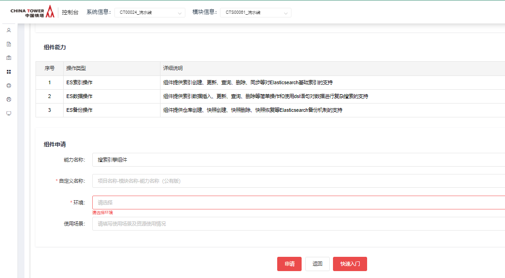
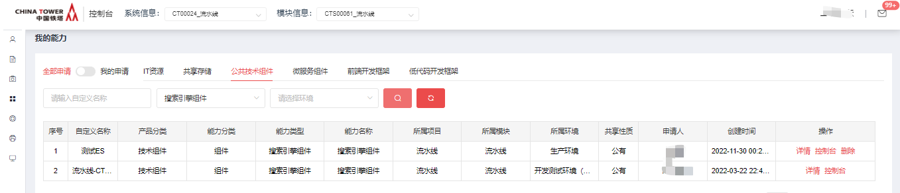

# 搜索引擎组件

2021年11月

## 开源版本说明

| 版本名        | 版本  | 说明 |
| ------------- | ----- | ---- |
| elasticSearch | 7.9.3 |      |

## 功能发布记录

| 日期     | 版本 | 变更说明 | 作者 |
| -------- | ---- | -------- | ---- |
| 2021-7-7 | 1.0  | 初始版本 |      |

## 重要通知

无

## 组件描述

### 1.1背景

提升铁塔IT开发效率，统一管理es搜索，加快查询速度。

### 1.2 术语定义

| 序号 | 简称/术语 | 说明 |
| ---- | --------- | ---- |
| 1    |           |      |
| 2    |           |      |

### 1.3 参考资料

| 序号 | 文档名称                               | 最后修订时间 | 版本号 | 来源         |
| ---- | -------------------------------------- | ------------ | ------ | ------------ |
| 1    | 中国铁塔IT系统技术架构总体规划（总册） | 2017/05/05   | 1.0    | 铁塔内部资料 |
| 2    | 中国铁塔架构组公共枚举值清单V1.0.docx  | 2019/04/08   | 1.0    | 铁塔内部资料 |
|      |                                        |              |        |              |

### 1.4 变更履历

| 变更日期 | 变更页次 | 变更后内容 | 版本号 | 修订人 | 批准人 |
| -------- | -------- | ---------- | ------ | ------ | ------ |
|          |          |            |        |        |        |
|          |          |            |        |        |        |

### 1.5 适用范围

ES是目前全文搜索引擎的首选。它是一个基于 Lucene 的搜索服务器，提供了一个分布式多用户能力的全文搜索引擎，它同时基于 RESTful Web 接口，可以快速地储存、搜索和分析海量数据。适用于电子商务、日志分析、数据监控等复杂搜索的相关业务。

### 2.1 ES搜索组件

#### 2.1.1 组件概述

对于系统中需要经常进行模糊搜索，数据收集分析等操作，为避免过于依赖数据库影响数据库性能，Elasticsearch搜索引擎对数据进行倒排索引，可以实现海量数据的模糊查询。ES组件通过连接Elasticsearch搜索引擎提供ES索引操作、数据操作等功能。

#### 2.1.2 建设目标

提升铁塔IT自主掌控能力，提供模糊搜索、全文搜索等功能提高开发效率，解决数据库的访问压力。

#### 2.1.3 功能清单

##### 2.1.3.1 ES索引操作

组件提供索引创建、更新、查询、删除、同步等对Elasticsearch基础索引的支持

##### 2.1.3.2 ES数据操作

组件提供索引数据插入、更新、查询、删除等简单操作和使用dsl语句对数据进行复杂搜索的支持

##### 2.1.3.3 ES备份操作

组件提供仓库创建、快照创建、快照删除、快照恢复等Elasticsearch备份机制的支持

## 快速入门

### 组件申请

仅允许铁塔自有人员申请。 消费者登录技术中台首页，选择公共技术组件，点击"搜索引擎组件"。

  点击申请  

填写申请单，点击申请即可

  

运营管理员审批通过后，在我的能力后输入正确的筛选条件，即可看到刚申请的能力。

 

## 操作指南

登录技术中台后，选择“我的能力”左侧导航菜单，右侧主内容区域选择“公共技术组件”，能力名称为"搜索引擎组件"，操作一栏可看到”控制台“按钮。 

 

点击”控制台“,进入控制台，可以看到”索引管理“，”Rest接口“，”索引模板管理“ es/img5.png[]

## 典型实践

无

## API参考

### Restful API接口方式

提供Restful API接口的方式供铁塔各系统调用，支持普元、微服务、普通java应用、.net应用等各类语言客户端调用。

#### 1.1 索引操作

##### 1.1.1新增索引映射

请求地址：

| 接口类型     | HTTP                                        |
| ------------ | ------------------------------------------- |
| 接口提交方式 | POST                                        |
| 接口地址     | HOST:PORT/se-service/mapping/createMapping/ |

请求参数：

| **参数名称**  | **说明**     | **约束** | **类型** | **备注**                                                     |
| ------------- | ------------ | -------- | -------- | ------------------------------------------------------------ |
| indexName     | 索引名称     | 必填     | String   |                                                              |
| indexRealName | 索引使用名称 | 必填     | String   |                                                              |
| mappingDetail | 映射的结构   | 必填     | String   | Json 结构  \{  "properties":\{  "字段名":\{  "映射属性名":"属性值"  }  }  } |
| creater       | 创建人       | 必填     | String   |                                                              |

响应参数：

| 参数名称   | 说明              | 类型   | 备注 |
| ---------- | ----------------- | ------ | ---- |
| resultStat | 成功/失败 000/999 | String |      |
| mess       | 提示信息          | String |      |
| data       | id                | long   |      |

##### 1.1.2 修改索引映射

请求地址：

| 接口类型     | HTTP                                         |
| ------------ | -------------------------------------------- |
| 接口提交方式 | POST                                         |
| 接口地址     | HOST:PORT/se-service/mapping/updateMapping / |

请求参数：

| **参数名称**  | **说明**     | **约束** | **类型** | **备注**                                                     |
| ------------- | ------------ | -------- | -------- | ------------------------------------------------------------ |
| indexName     | 索引名称     | 必填     | String   |                                                              |
| indexRealName | 索引使用名称 | 必填     | String   |                                                              |
| mappingDetail | 映射的结构   | 必填     | String   | Json 结构  \{  "properties":\{  "字段名":\{  "映射属性名":"属性值"  }  }  } |
| id            | 数据id       | 必填     | String   |                                                              |

响应参数：

| 参数名称   | 说明              | 类型   | 备注 |
| ---------- | ----------------- | ------ | ---- |
| resultStat | 成功/失败 000/999 | String |      |
| mess       | 提示信息          | String |      |
| data       | id                | long   |      |

##### 1.1.3 查询登录用户创建的mapping

请求地址：

| 接口类型     | HTTP                                         |
| ------------ | -------------------------------------------- |
| 接口提交方式 | POST                                         |
| 接口地址     | HOST:PORT/se-service/mapping/getMappingList/ |

请求参数：

| **参数名称** | **说明** | **约束** | **类型** | **备注** |
| ------------ | -------- | -------- | -------- | -------- |
| creater      | 创建人   | 必填     | String   |          |
| indexName    | 索引名称 | 非必填   | String   |          |
| pageSize     | 行数     | 非必填   | Integer  |          |
| pageNum      | 页数     | 非必填   | Integer  |          |

响应参数：

| 参数名称   | 说明              | 类型   | 备注 |
| ---------- | ----------------- | ------ | ---- |
| resultStat | 成功/失败 000/999 | String |      |
| mess       | 提示信息          | String |      |
| data       | id                | Json   |      |

##### 1.1.4 删除mapping 映射

请求地址：

| 接口类型     | HTTP                                     |
| ------------ | ---------------------------------------- |
| 接口提交方式 | POST                                     |
| 接口地址     | HOST:PORT/se-service/mapping/delMapping/ |

请求参数：

| **参数名称** | **说明** | **约束** | **类型** | **备注** |
| ------------ | -------- | -------- | -------- | -------- |
| id           | 数据id   | 必填     | String   |          |
| indexName    | 索引名称 | 必填     | String   |          |

响应参数：

| 参数名称   | 说明              | 类型   | 备注 |
| ---------- | ----------------- | ------ | ---- |
| resultStat | 成功/失败 000/999 | String |      |
| mess       | 提示信息          | String |      |
| data       | 长度              | long   |      |

##### 1.1.5 同步索引

请求地址：

| 接口类型     | HTTP                                    |
| ------------ | --------------------------------------- |
| 接口提交方式 | POST                                    |
| 接口地址     | HOST:PORT/se-service/mapping/syncIndex/ |

请求参数：

| **参数名称** | **说明** | **约束** | **类型** | **备注** |
| ------------ | -------- | -------- | -------- | -------- |
| id           | 数据id   | 必填     | String   |          |
| indexName    | 索引名称 | 必填     | String   |          |

响应参数：

| 参数名称   | 说明              | 类型   | 备注 |
| ---------- | ----------------- | ------ | ---- |
| resultStat | 成功/失败 000/999 | String |      |
| mess       | 提示信息          | String |      |
| data       | 长度              | long   |      |

##### 1.1.6 创建索引通过系统编码

请求地址：

| 接口类型     | HTTP                                               |
| ------------ | -------------------------------------------------- |
| 接口提交方式 | POST                                               |
| 接口地址     | HOST:PORT/se-service/monitor/createIndexModuleCode |

请求参数：

| **参数名称** | **说明**   | **约束** | **类型** | **备注**                   |
| ------------ | ---------- | -------- | -------- | -------------------------- |
| moduleCode   | 系统编码   | 必填     | String   |                            |
| indexName    | 索引名称   | 必填     | String   | 索引名称（不拼接系统编码） |
| shards       | 分片数     | 必填     | Integer  |                            |
| replicas     | 副本数     | 必填     | Integer  |                            |
| indexJson    | 映射的结构 | 必填     | String   |                            |

响应参数：

| 参数名称   | 说明     | 类型    | 备注                           |
| ---------- | -------- | ------- | ------------------------------ |
| code       | 200      | Integer | 200成功，其余失败              |
| data       | 索引详情 | Json    |                                |
| data.index | 索引名称 | String  | 索引实际名称，后续数据操作使用 |

##### 1.1.7 创建索引通过系统编码

请求地址：

| 接口类型     | HTTP                                               |
| ------------ | -------------------------------------------------- |
| 接口提交方式 | POST                                               |
| 接口地址     | HOST:PORT/se-service/monitor/deleteIndexModuleCode |

请求参数：

| **参数名称** | **说明** | **约束** | **类型** | **备注**                   |
| ------------ | -------- | -------- | -------- | -------------------------- |
| moduleCode   | 系统编码 | 必填     | String   |                            |
| indexName    | 索引名称 | 必填     | String   | 索引名称（不拼接系统编码） |

响应参数：

| 参数名称 | 说明     | 类型    | 备注              |
| -------- | -------- | ------- | ----------------- |
| code     | 200      | Integer | 200成功，其余失败 |
| mess     | 提示信息 | String  |                   |
| data     | 删除结果 | Json    |                   |

#### 1.2 数据操作

##### 1.2.1 插入数据

请求地址：

| 接口类型     | HTTP                                     |
| ------------ | ---------------------------------------- |
| 接口提交方式 | POST                                     |
| 接口地址     | HOST:PORT/se-service/esData/insertSEData |

请求参数：

| **参数名称** | **说明** | **约束** | **类型** | **备注**       |
| ------------ | -------- | -------- | -------- | -------------- |
| indexName    | 索引名称 | 必填     | String   |                |
| dataId       | 数据id   | 必填     | String   |                |
| Data         | 数据     | 必填     | Json     | 数据对象json串 |

响应参数：

| 参数名称   | 说明              | 类型   | 备注     |
| ---------- | ----------------- | ------ | -------- |
| resultStat | 成功/失败 000/999 | String |          |
| mess       | 提示信息          | String |          |
| data       | 数据对象          | String | 索引名称 |

##### 1.2.2 批量插入数据

请求地址：

| 接口类型     | HTTP                                              |
| ------------ | ------------------------------------------------- |
| 接口提交方式 | POST                                              |
| 接口地址     | HOST:PORT /se-service/esData/insertParentAndChild |

请求参数：

| **参数名称** | **说明** | **约束** | **类型** | **备注**                                                    |
| ------------ | -------- | -------- | -------- | ----------------------------------------------------------- |
| indexName    | 索引名称 | 必填     | String   |                                                             |
| dataId       | 数据id   | 必填     | String   |                                                             |
| Data         | 数据     | 必填     | Json     | 数据对象数组json                                            |
| routing      | 路由     |          |          | 子文档中创建子文档时需要传入的数据,创建父文档时传入空值即可 |

响应参数：

| 参数名称   | 说明              | 类型   | 备注     |
| ---------- | ----------------- | ------ | -------- |
| resultStat | 成功/失败 000/999 | String |          |
| mess       | 提示信息          | String |          |
| data       | 数据对象          | String | 索引名称 |

##### 1.2.3 删除数据

请求地址：

| 接口类型     | HTTP                                  |
| ------------ | ------------------------------------- |
| 接口提交方式 | POST                                  |
| 接口地址     | HOST:PORT/se-service/esData/delSEData |

请求参数：

| **参数名称** | **说明** | **约束** | **类型** | **备注** |
| ------------ | -------- | -------- | -------- | -------- |
| indexName    | 索引名称 | 必填     | String   |          |
| dataId       | 数据id   | 必填     | String   |          |
| routing      | 路由     | 非必填   | String   |          |

响应参数：

| 参数名称   | 说明              | 类型   | 备注     |
| ---------- | ----------------- | ------ | -------- |
| resultStat | 成功/失败 000/999 | String |          |
| mess       | 提示信息          | String |          |
| data       | 数据对象          | String | 索引名称 |

##### 1.2.4 更新seData数据

请求地址：

| 接口类型     | HTTP                                     |
| ------------ | ---------------------------------------- |
| 接口提交方式 | POST                                     |
| 接口地址     | HOST:PORT/se-service/esData/updateSEData |

请求参数：

| **参数名称** | **说明** | **约束** | **类型** | **备注**       |
| ------------ | -------- | -------- | -------- | -------------- |
| indexName    | 索引名称 | 必填     | String   |                |
| dataId       | 数据id   | 必填     | String   |                |
| Data         | 数据     | 必填     | Json     | 数据对象json串 |
| routing      | 路由     | 非必填   | String   |                |

响应参数：

| 参数名称   | 说明              | 类型   | 备注     |
| ---------- | ----------------- | ------ | -------- |
| resultStat | 成功/失败 000/999 | String |          |
| mess       | 提示信息          | String |          |
| data       | 数据对象          | String | 索引名称 |

##### 1.2.5 简单查询单条数据

请求地址：

| 接口类型     | HTTP                                  |
| ------------ | ------------------------------------- |
| 接口提交方式 | POST                                  |
| 接口地址     | HOST:PORT/se-service/esData/getSEData |

请求参数：

| **参数名称** | **说明** | **约束** | **类型** | **备注** |
| ------------ | -------- | -------- | -------- | -------- |
| indexName    | 索引名称 | 必填     | String   |          |
| dataId       | 数据id   | 必填     | String   |          |
| routing      | 路由     | 非必填   | String   |          |

响应参数：

| 参数名称   | 说明              | 类型   | 备注 |
| ---------- | ----------------- | ------ | ---- |
| resultStat | 成功/失败 000/999 | String |      |
| mess       | 提示信息          | String |      |
| data       | 数据对象          | Json   |      |

##### 1.2.6 模糊查询es数据

请求地址：

| 接口类型     | HTTP                                    |
| ------------ | --------------------------------------- |
| 接口提交方式 | POST                                    |
| 接口地址     | HOST:PORT /se-service/esData/fuzzyQuery |

请求参数：

| **参数名称** | **说明**     | **约束** | **类型**     | **备注**   |
| ------------ | ------------ | -------- | ------------ | ---------- |
| indexName    | 索引名称     | 必填     | List<String> |            |
| queryObj     | 模糊查询对象 | 必填     | Json         | 对象json串 |
| highLightVo  | 高亮显示对象 | 必填     | Json         | 对象json串 |
| sortMap      | 排序字段对象 | 非必填   | Json         | 对象json串 |

响应参数：

| 参数名称   | 说明              | 类型   | 备注 |
| ---------- | ----------------- | ------ | ---- |
| resultStat | 成功/失败 000/999 | String |      |
| mess       | 提示信息          | String |      |
| data       | 数据对象          | Json   |      |

##### 1.2.7 使用dsl语言查询的es数据

请求地址：

| 接口类型     | HTTP                                         |
| ------------ | -------------------------------------------- |
| 接口提交方式 | POST                                         |
| 接口地址     | HOST:PORT/se-service/esData/querySEDataByDsl |

请求参数：

| **参数名称**   | **说明**       | **约束** | **类型** | **备注**   |
| -------------- | -------------- | -------- | -------- | ---------- |
| indexName      | 索引名称       | 必填     | String   |            |
| templateScript | 模板字符串     | 必填     | String   | Es查询语句 |
| templateValues | 插入的数据结构 | 必填     | Json     | 数据json串 |

响应参数：

| 参数名称   | 说明              | 类型   | 备注 |
| ---------- | ----------------- | ------ | ---- |
| resultStat | 成功/失败 000/999 | String |      |
| mess       | 提示信息          | String |      |
| data       | 数据对象          | Json   |      |

##### 1.2.8 搜索建议

请求地址：

| 接口类型     | HTTP                                     |
| ------------ | ---------------------------------------- |
| 接口提交方式 | POST                                     |
| 接口地址     | HOST:PORT/se-service/esData/querySuggest |

请求参数：

| **参数名称** | **说明**                                     | **约束** | **类型** | **备注** |
| ------------ | -------------------------------------------- | -------- | -------- | -------- |
| indexName    | 索引名称                                     | 必填     | String   |          |
| suggestKey   | 搜索建议的字段(该字段的类型必须为completion) | 必填     | String   |          |
| suggestValue | 搜索建议的建议词                             | 必填     | String   |          |

响应参数：

| 参数名称   | 说明              | 类型   | 备注 |
| ---------- | ----------------- | ------ | ---- |
| resultStat | 成功/失败 000/999 | String |      |
| mess       | 提示信息          | String |      |
| data       | 数据对象          | Json   |      |

##### 1.2.9 条件删除

请求地址：

| 接口类型     | HTTP                                       |
| ------------ | ------------------------------------------ |
| 接口提交方式 | POST                                       |
| 接口地址     | HOST:PORT /se-service/esData/deleteByQuery |

请求参数：

| **参数名称** | **说明**               |        | **约束** | **类型** | **备注**   |
| ------------ | ---------------------- | ------ | -------- | -------- | ---------- |
| indexName    | 索引名称               | 必填   |          | String   |            |
| routing      | 路由                   | 非必填 |          | String   |            |
| termVO       | term查询的list         | 非必填 |          | Json     | 对象json串 |
| termsVO      | terms查询的list        | 非必填 |          | Json     | 对象json串 |
| multiMatchVO | 一值多条件的multimatch | 非必填 |          | Json     | 对象json串 |

响应参数：

| 参数名称   | 说明              | 类型   | 备注       |
| ---------- | ----------------- | ------ | ---------- |
| resultStat | 成功/失败 000/999 | String |            |
| mess       | 提示信息          | String |            |
| data       | 数据对象          | Long   | 删除的条数 |

##### 1.2.10 组合查询

请求地址：

| 接口类型     | HTTP                                      |
| ------------ | ----------------------------------------- |
| 接口提交方式 | POST                                      |
| 接口地址     | HOST:PORT/se-service/esData/combinedQuery |

请求参数：

| **参数名称** | **说明**     | **约束** | **类型**     | **备注**   |
| ------------ | ------------ | -------- | ------------ | ---------- |
| indexName    | 索引名称     | 必填     | List<String> |            |
| pageSize     | 行数         | 非必填   | Integer      |            |
| pageNum      | 页数         | 非必填   | Integer      |            |
| shouldVO     | 或者条件     | 非必填   | Json         | 对象json串 |
| mustVO       | 必须条件     | 非必填   | Json         | 对象json串 |
| mustNotVO    | 必须不条件   | 非必填   | Json         | 对象json串 |
| filterVO     | 过滤条件     | 非必填   | Json         | 对象json串 |
| highLightVo  | 高亮显示对象 | 必填     | Json         | 对象json串 |
| sortMap      | 排序         | 非必填   | Json         | 对象json串 |

响应参数：

| 参数名称   | 说明              | 类型   | 备注 |
| ---------- | ----------------- | ------ | ---- |
| resultStat | 成功/失败 000/999 | String |      |
| mess       | 提示信息          | String |      |
| data       | 数据对象          | Json   |      |

##### 1.2.11 简单查询

请求地址：

| 接口类型     | HTTP                                    |
| ------------ | --------------------------------------- |
| 接口提交方式 | POST                                    |
| 接口地址     | HOST:PORT/se-service/esData/simpleQuery |

请求参数：

| **参数名称** | **说明**               | **约束** | **类型**     | **备注**   |
| ------------ | ---------------------- | -------- | ------------ | ---------- |
| indexName    | 索引名称               | 必填     | List<String> |            |
| pageSize     | 行数                   | 非必填   | Integer      |            |
| pageNum      | 页数                   | 非必填   | Integer      |            |
| termVO       | term查询的list         | 非必填   | Json         | 对象json串 |
| termsVO      | terms查询的list        | 非必填   | Json         | 对象json串 |
| multiMatchVO | 一值多条件的multimatch | 非必填   | Json         | 对象json串 |
| highLightVo  | 高亮显示对象           | 必填     | Json         | 对象json串 |
| sortMap      | 排序                   | 非必填   | Json         | 对象json串 |

响应参数：

| 参数名称   | 说明              | 类型   | 备注 |
| ---------- | ----------------- | ------ | ---- |
| resultStat | 成功/失败 000/999 | String |      |
| mess       | 提示信息          | String |      |
| data       | 数据对象          | Json   |      |

##### 1.2.12 根据子文档查询父文档

请求地址：

| 接口类型     | HTTP                                       |
| ------------ | ------------------------------------------ |
| 接口提交方式 | POST                                       |
| 接口地址     | HOST:PORT /se-service/esData/hasChildQuery |

请求参数：

| **参数名称** | **说明**             | **约束** | **类型**     | **备注** |
| ------------ | -------------------- | -------- | ------------ | -------- |
| indexName    | 索引名称             | 必填     | List<String> |          |
| childType    | 定义relation时的type | 必填     | String       |          |
| scoreMode    | 是否参与评分         | 必填     | String       |          |
| shouldVO     | 或者条件             | 非必填   | Json         |          |
| mustVO       | 必须条件             | 非必填   | Json         |          |
| mustNotVO    | 必须不条件           | 非必填   | Json         |          |
| filterVO     | 过了条件             | 非必填   | Json         |          |

##### 1.2.13 滚动查询

请求地址：

| 接口类型     | HTTP                              |
| ------------ | --------------------------------- |
| 接口提交方式 | POST                              |
| 接口地址     | HOST:PORT /se-service/esData/scan |

请求参数：

请求参数：

| **参数名称** | **说明**     | **约束** | **类型**     | **备注**   |
| ------------ | ------------ | -------- | ------------ | ---------- |
| indexName    | 索引名称     | 必填     | List<String> |            |
| pageSize     | 行数         | 非必填   | Integer      |            |
| pageNum      | 页数         | 非必填   | Integer      |            |
| shouldVO     | 或者条件     | 非必填   | Json         | 对象json串 |
| mustVO       | 必须条件     | 非必填   | Json         | 对象json串 |
| mustNotVO    | 必须不条件   | 非必填   | Json         | 对象json串 |
| filterVO     | 过滤条件     | 非必填   | Json         | 对象json串 |
| highLightVo  | 高亮显示对象 | 必填     | Json         | 对象json串 |
| sortMap      | 排序         | 非必填   | Json         | 对象json串 |

响应参数：

| 参数名称   | 说明              | 类型   | 备注 |
| ---------- | ----------------- | ------ | ---- |
| resultStat | 成功/失败 000/999 | String |      |
| mess       | 提示信息          | String |      |
| data       | 数据对象          | Json   |      |
| scrollId   | 滚动查询id        | String |      |

##### 1.2.14 分词解析

请求地址：

| 接口类型     | HTTP                                 |
| ------------ | ------------------------------------ |
| 接口提交方式 | POST                                 |
| 接口地址     | HOST:PORT /se-service/esData/analyze |

请求参数：

请求参数：

| **参数名称** | **说明**     | **约束** | **类型** | **备注** |
| ------------ | ------------ | -------- | -------- | -------- |
| analyzerName | 分词器名称   | 必填     | String   |          |
| text         | 待分词的字符 | 必填     | String   |          |

响应参数：

| 参数名称   | 说明              | 类型   | 备注     |
| ---------- | ----------------- | ------ | -------- |
| resultStat | 成功/失败 000/999 | String |          |
| mess       | 提示信息          | String |          |
| data       | 数据对象          | Json   | 分词结果 |

##### 1.2.15 dsl查询通过scroll_id实现滚动查询

请求地址：

| 接口类型     | HTTP                                             |
| ------------ | ------------------------------------------------ |
| 接口提交方式 | POST                                             |
| 接口地址     | HOST:PORT/se-service/esData/querySEDataByDslScan |

请求参数：

| **参数名称**   | **说明**       | **约束** | **类型** | **备注**                           |
| -------------- | -------------- | -------- | -------- | ---------------------------------- |
| indexName      | 索引名称       | 必填     | String   |                                    |
| templateScript | 模板字符串     | 必填     | String   | Es查询语句                         |
| templateValues | 插入的数据结构 | 必填     | Json     | 数据json串                         |
| scrollId       | 滚动查询id     | 非必填   | String   | 首次查询非必填，后续查询必填       |
| scrollTime     | 滚动查询时间   | 非必填   | String   | 滚动查询时间，单位s（秒），默认60s |

响应参数：

| 参数名称      | 说明              | 类型   | 备注       |
| ------------- | ----------------- | ------ | ---------- |
| resultStat    | 成功/失败 000/999 | String |            |
| mess          | 提示信息          | String |            |
| data          | 数据对象          | Json   |            |
| data.scrollId | 滚动查询id        | String | 滚动查询id |

#### 1.3 快照操作

##### 1.3.1 创建备份仓库

请求地址：

| 接口类型     | HTTP                                           |
| ------------ | ---------------------------------------------- |
| 接口提交方式 | POST                                           |
| 接口地址     | HOST:PORT/se-service/snapshot/createRepository |

请求参数：

| **参数名称**   | **说明** | **约束** | **类型** | **备注** |
| -------------- | -------- | -------- | -------- | -------- |
| location       | 仓库地址 | 必填     | String   |          |
| repositoryName | 仓库名称 | 必填     | String   |          |

响应参数：

| 参数名称   | 说明              | 类型   | 备注 |
| ---------- | ----------------- | ------ | ---- |
| resultStat | 成功/失败 000/999 | String |      |
| mess       | 提示信息          | String |      |
| data       | id                | Json   |      |

##### 1.3.2 创建快照

请求地址：

| 接口类型     | HTTP                                          |
| ------------ | --------------------------------------------- |
| 接口提交方式 | POST                                          |
| 接口地址     | HOST:PORT /se-service/snapshot/createSnapshot |

请求参数：

| **参数名称**   | **说明** | **约束** | **类型** | **备注** |
| -------------- | -------- | -------- | -------- | -------- |
| repositoryName | 仓库名称 | 必填     | String   |          |
| snapshotName   | 快照名称 | 必填     | String   |          |

响应参数：

| 参数名称   | 说明              | 类型   | 备注 |
| ---------- | ----------------- | ------ | ---- |
| resultStat | 成功/失败 000/999 | String |      |
| mess       | 提示信息          | String |      |
| data       | id                | Json   |      |

##### 1.3.3 获取快照

请求地址：

| 接口类型     | HTTP                                       |
| ------------ | ------------------------------------------ |
| 接口提交方式 | POST                                       |
| 接口地址     | HOST:PORT /se-service/snapshot/getSnapshot |

请求参数：

| **参数名称**   | **说明** | **约束** | **类型** | **备注** |
| -------------- | -------- | -------- | -------- | -------- |
| repositoryName | 仓库名称 | 必填     | String   |          |
| snapshotName   | 快照名称 | 必填     | String   |          |

响应参数：

| 参数名称   | 说明              | 类型   | 备注 |
| ---------- | ----------------- | ------ | ---- |
| resultStat | 成功/失败 000/999 | String |      |
| mess       | 提示信息          | String |      |
| data       | id                | Json   |      |

##### 1.3.4 恢复快照

请求地址：

| 接口类型     | HTTP                                          |
| ------------ | --------------------------------------------- |
| 接口提交方式 | POST                                          |
| 接口地址     | HOST:PORT/se-service/snapshot/restoreSnapshot |

请求参数：

| **参数名称**   | **说明** | **约束** | **类型** | **备注** |
| -------------- | -------- | -------- | -------- | -------- |
| repositoryName | 仓库名称 | 必填     | String   |          |
| snapshotName   | 快照名称 | 必填     | String   |          |
|                |          |          |          |          |

响应参数：

| 参数名称   | 说明              | 类型   | 备注 |
| ---------- | ----------------- | ------ | ---- |
| resultStat | 成功/失败 000/999 | String |      |
| mess       | 提示信息          | String |      |
| data       | id                | Json   |      |

##### 1.3.5 删除快照

请求地址：

| 接口类型     | HTTP                                      |
| ------------ | ----------------------------------------- |
| 接口提交方式 | POST                                      |
| 接口地址     | HOST:PORT/se-service/snapshot/delSnapshot |

请求参数：

| **参数名称**   | **说明** | **约束** | **类型** | **备注** |
| -------------- | -------- | -------- | -------- | -------- |
| repositoryName | 仓库名称 | 必填     | String   |          |
| snapshotName   | 快照名称 | 必填     | String   |          |

响应参数：

| 参数名称   | 说明              | 类型   | 备注 |
| ---------- | ----------------- | ------ | ---- |
| resultStat | 成功/失败 000/999 | String |      |
| mess       | 提示信息          | String |      |
| data       | id                | Json   |      |

#### 接口示例参考

[点击下载](http://mid.chinatowercom.cn:18080/docs/chinatower-component/v1.0/module/_attachments/搜索组件对外提供接口V1.6.zip)  [搜索组件对外提供接口V1.6.zip](../file/搜索组件对外提供接口V1.6.zip) 

## SDK

无

## 网络要求

无

## 常见问题

无

## 样例文件

无