# KubeSphere

## 功能发布记录

| 版本 | 拟制/修改日期 | 拟制/修改人 | 修改记录 | 批准人 |
| ---- | ------------- | ----------- | -------- | ------ |
| 1.0  | 2023/12/20    | 赵龙        | 初版     |        |

## 重要通知

无

## 组件描述

KubeSphere是面向云原生应用的容器混合云，它支持多云与多集群管理，提供全栈的IT自动化运维的能力，简化企业的DevOps工作流。KubeSphere提供了运维友好的向导式操作界面，帮助企业快速构建一个强大和功能丰富的容器云平台。

### 建设目标

提升铁塔IT自主掌控能力，提高开发效率，降低编写重复代码的工作量。

### 特性

- 1、容器混合云管理：KubeSphere支持多云与多集群管理，提供全栈的IT自动化运维的能力，简化企业的DevOps工作流；
- 2、云原生应用管理：KubeSphere提供了应用商店与应用生命周期管理、可视化无代码侵入的灰度发布、熔断、流量治理与流量拓扑等功能模块，以完整的解决方案帮助企业轻松应对敏捷开发与自动化运维、DevOps、微服务治理、灰度发布、多租户管理、工作负载和集群管理、监控告警、日志查询与收集、服务与网络、应用商店、镜像构建与镜像仓库管理和存储管理等多种业务场景；
- 3、容器安全与认证：KubeSphere还提供基于多租户、细粒度安全架构设计，提供资源以及操作级别的权限管控，充分保障资源安全性，同时支持标准AD/LDAP协议，以实现集中化认证；
- 4、存储管理：KubeSphere支持对接多种开源的存储服务和高性能的商业存储。

## 快速入门

进入技术中台首页，选择 产品 → 基础设施 → 容器 → kubesphere 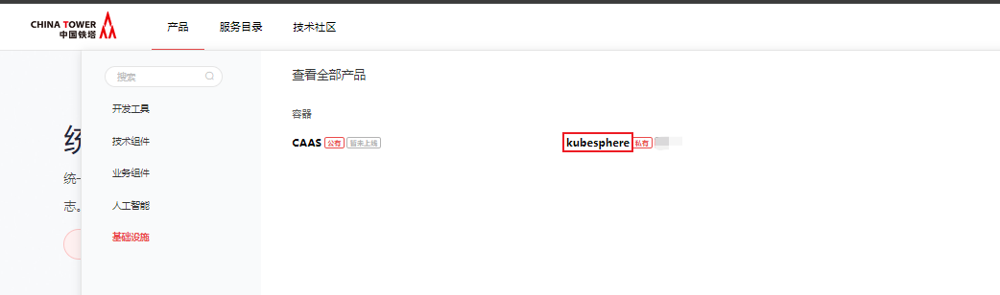 点击 【申请】，填写自定义名称，点击申请，等待运营人员审批 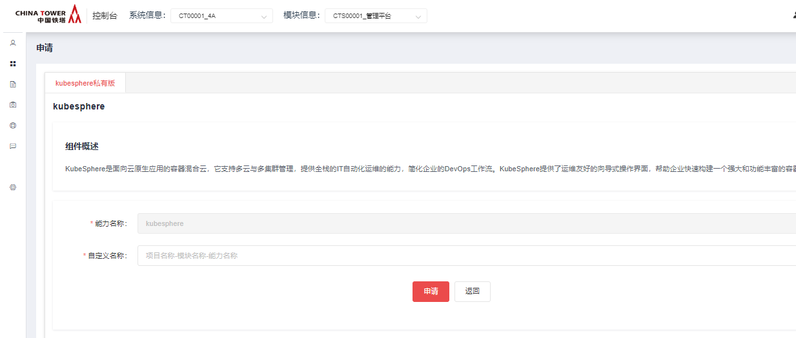

审批通过后可以在我的能力→公共技术组件→kubesphere 看到已申请成功的能力 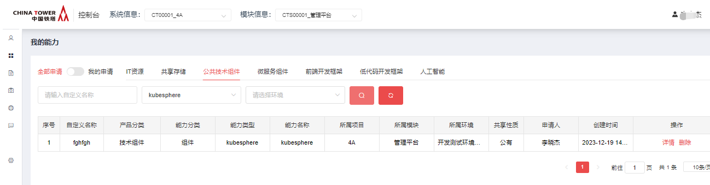

## 操作指南

### 私有虚机版功能介绍

#### 部署包下载

基于服务器系统版本centos7.9

```sh
服务器系统信息(下面版本均经过验证)

系统版本 CentOS Linux release 7.9.2009

内核版本 Linux 5.4.260-1.el7.elrepo.x86_64

内核版本 Linux 3.10.0-1160.el7.elrepo.x86_64
```

[点击下载](http://10.38.77.5:8081/repository/raws/chntjstz/zjh/kubesphere/kubesphere-v3.4.1-20240111.tar.gz)

#### 部署包内容

部署包根路径

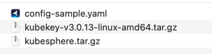

#### 安装步骤

此部署教程针对centos7.9系统

基于3台服务器，一台master，两台worker

|      | 单向打通部署服务器到铁塔公有harbor的网络 |
| ---- | ---------------------------------------- |
|      |                                          |

|      | harbor地址：10.38.57.6:80 (harbor.tower0788.cn) |
| ---- | ----------------------------------------------- |
|      |                                                 |

- 初始化服务器环境

  此步骤需要root账号

安装必要的运行库

```sh
yum install -y vim net-tools psmisc nc rsync ntp libzstd openssl-static tree iotop git
```

关闭防火墙firewalld(部分服务器不存在该服务)

```sh
systemctl stop firewalld
systemctl disable firewalld
```

清理iptables规则

```sh
iptables -F
iptables -X
iptables -Z
iptables -P INPUT ACCEPT
iptables -P OUTPUT ACCEPT
iptables -P FORWARD ACCEPT
```

- 配置root用户机器互信

  在每个服务器上执行命令

```shell
ssh-keygen -t rsa
```

需要按三次回车

进入ssh配置目录

cd ~/.ssh

将公钥（名为id_rsa.pub文件）追加到认证文件（名为authorized_keys文件）中:

```shell
cat ~/.ssh/id_rsa.pub >> ~/.ssh/authorized_keys
```

修改认证文件权限

chmod 600 ~/.ssh/authorized_keys

把3台服务器的认证文件内容整合

查看认证文件内容

需要有3行，每行末尾应该为登录用户@服务器名称

查看当前登录用户名命令为：

```shell
whoami
```

查看服务器名称命令为：

```shell
hostname
```

最终状态

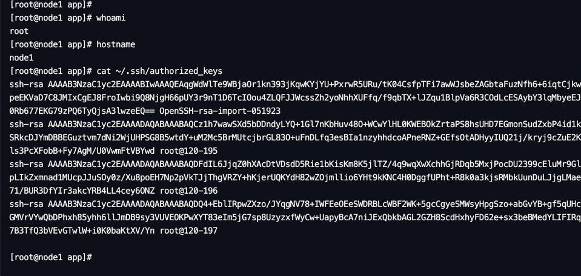

- 上传部署包并解压

  将部署包上传到master服务器的/app目录下

解压

```shell
cd /app
tar -zxvf kubesphere-v3.4.1-20240111.tar.gz
```


- 解压kk命令

  在master服务器上执行

```shell
cd /app/kubesphere/
tar -zxvf kubekey-v3.0.13-linux-amd64.tar.gz
```

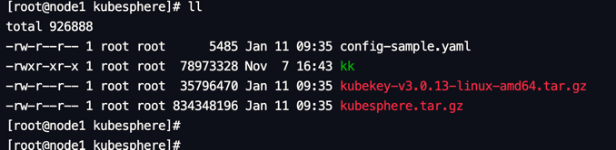

- 修改配置文件

  在master服务器上执行

```shell
cd /app/kubesphere/
vim config-sample.yaml
```

修改服务器ip地址

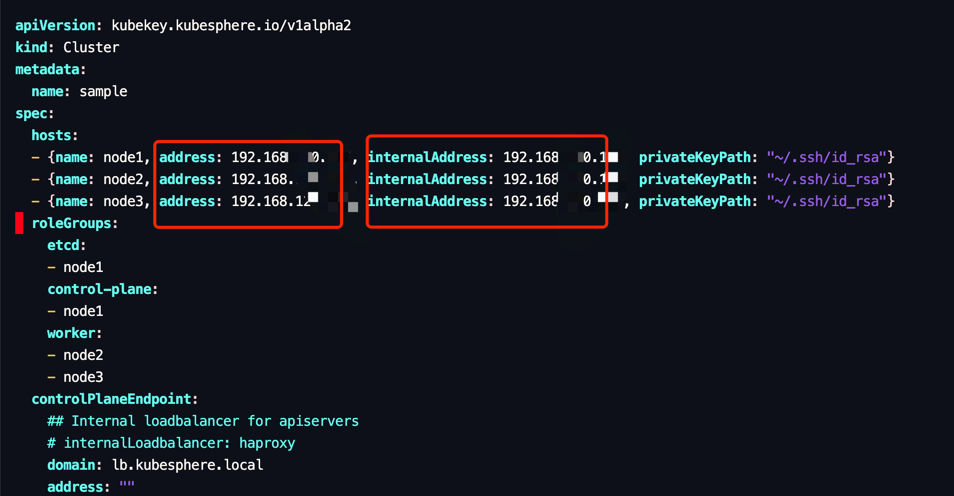

并保存

- 部署并启动集群

  在master服务器上执行

```shell
cd /app/kubesphere/
./kk create cluster -f config-sample.yaml -a kubesphere.tar.gz --with-packages --skip-push-images
```

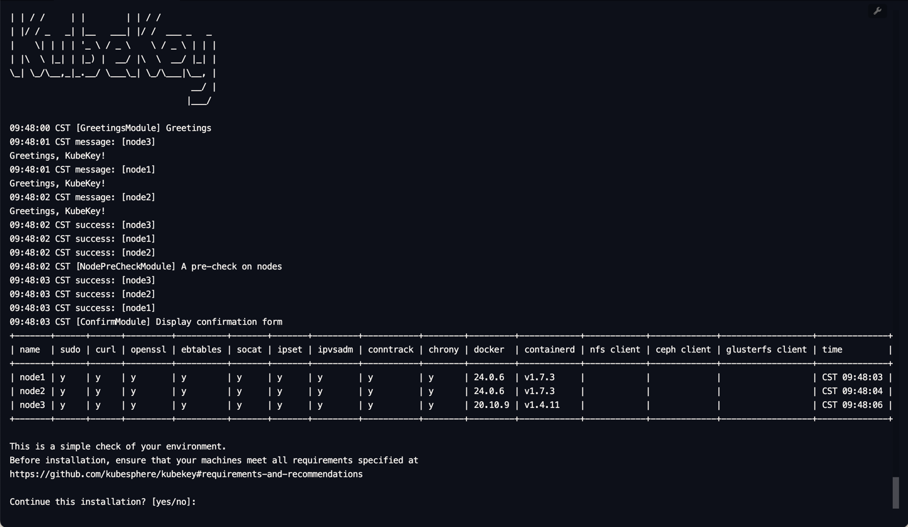

出现上面的界面时，输入yes，并回车

|      | 此步骤需要等待较长时间，等待期间请勿操作 |
| ---- | ---------------------------------------- |
|      |                                          |

出现下面的界面时，可以另外启动一个窗口，查看启动日志

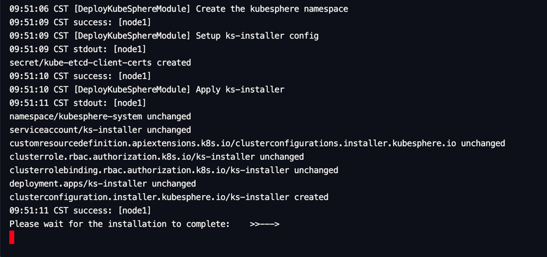

```shell
kubectl logs -n kubesphere-system $(kubectl get pod -n kubesphere-system -l 'app in (ks-install, ks-installer)' -o jsonpath='{.items[0].metadata.name}') -f
```

|      | 继续等待，出现以下界面表示部署完成 |
| ---- | ---------------------------------- |
|      |                                    |

原窗口

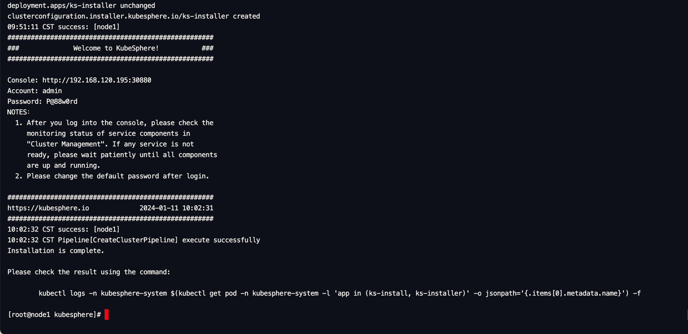

新窗口

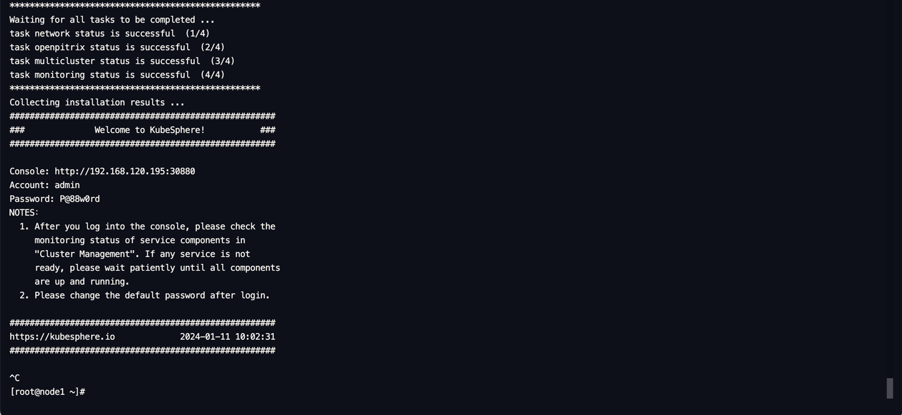

- 登录界面查看

  在浏览器中输入master服务器ip地址，端口号：30880，出现以下界面表示部署成功

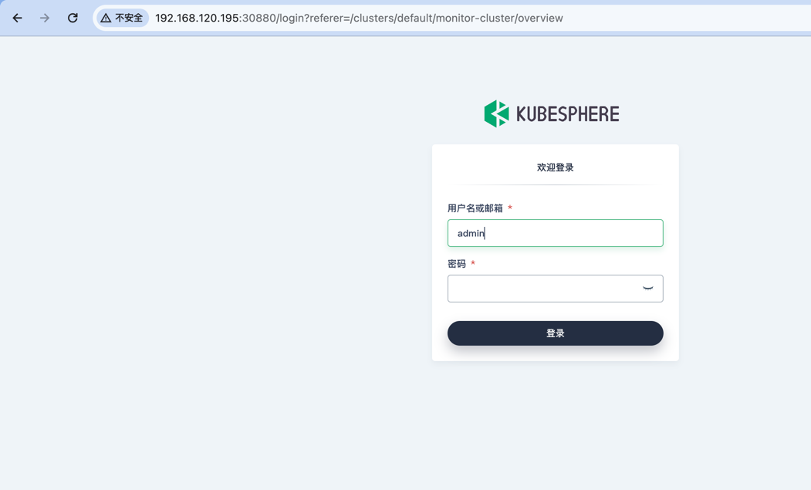

输入部署完成后提供的用户名密码，登录，按照提示修改密码后继续操作

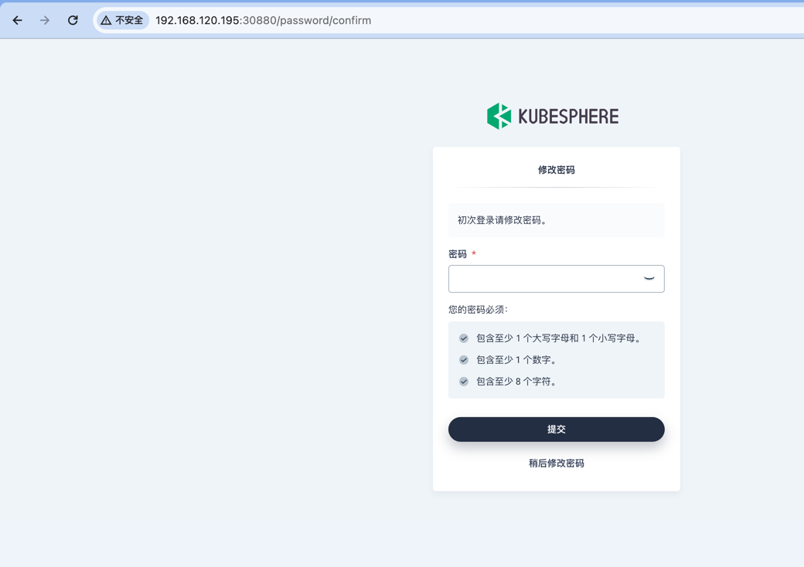

- 添加harbor私仓信息

  点击左上角【平台管理】→【集群管理】

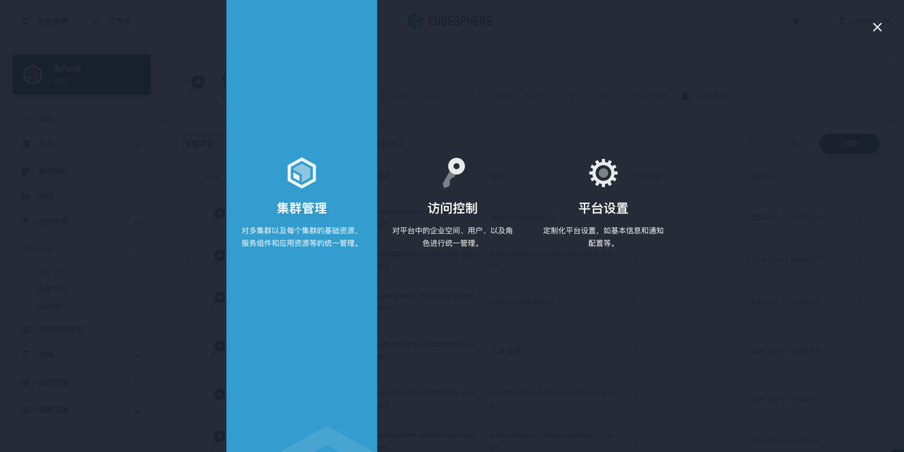

点击左侧导航栏 【配置】→【保密字典】→【创建】

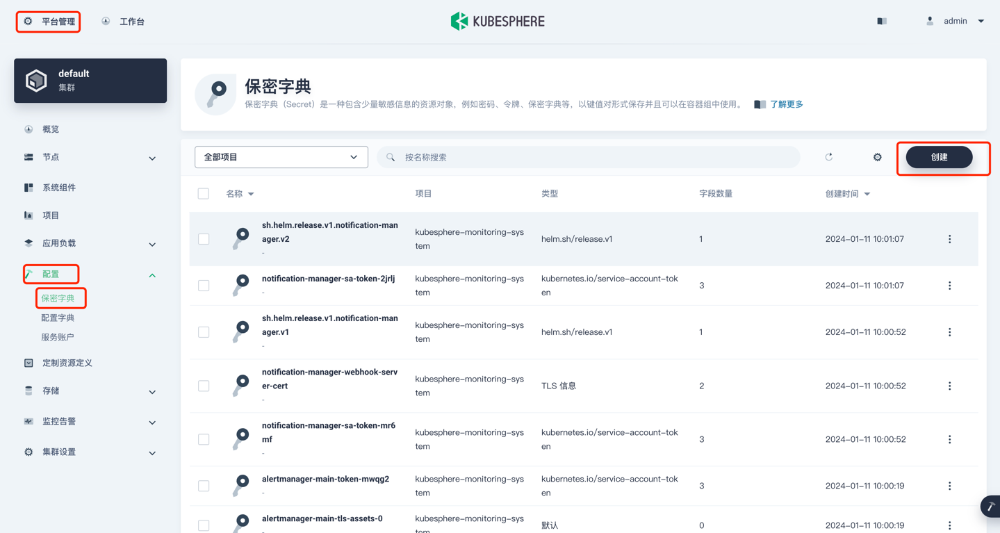

填写名称，选择项目，点击【下一步】

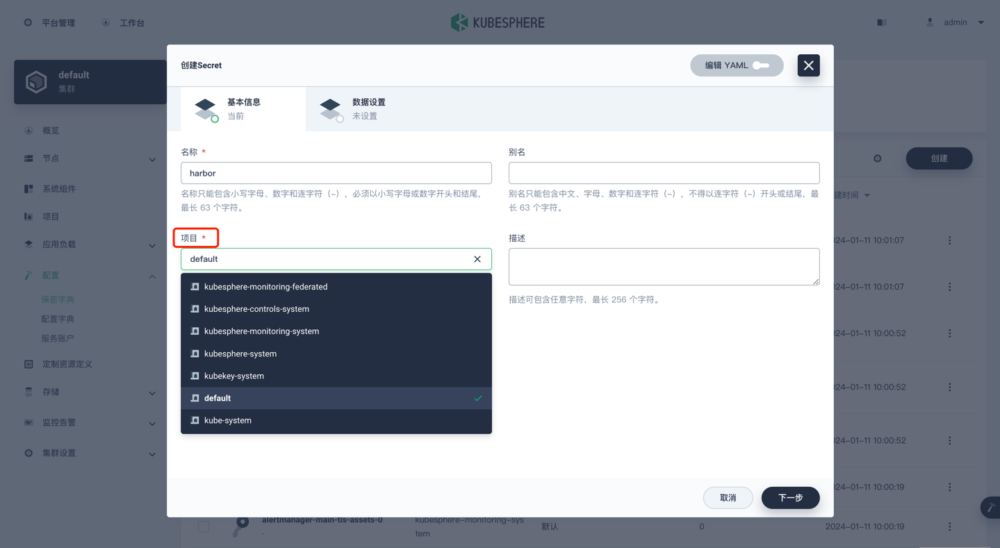

类型选择镜像服务信息，填写harbor私仓地址，用户名密码，点击【创建】

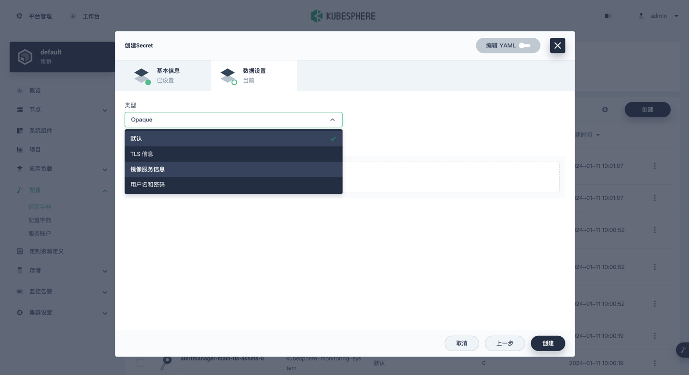

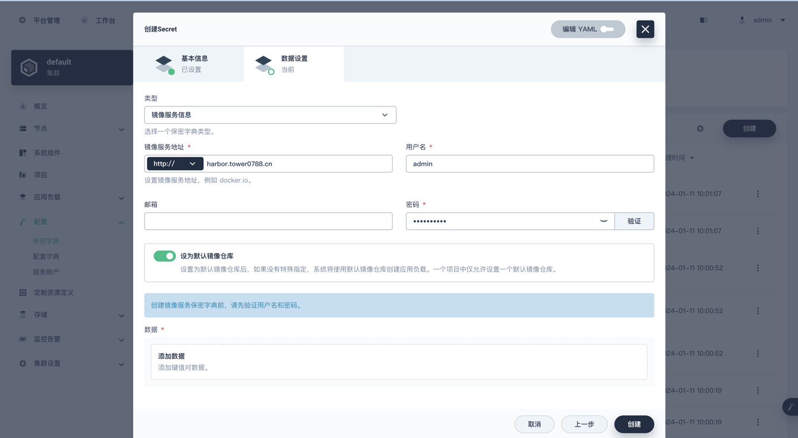

|      | 需要注意的是，这个添加后的harbor仓库只能在当前项目下选择使用，如果需要在其他项目下使用，需要重新添加 |
| ---- | ------------------------------------------------------------ |
|      |                                                              |

部署验证完成

|      | kuberphere启动占用大量端口，尽量使用新机器操作避免端口占用 |
| ---- | ---------------------------------------------------------- |
|      |                                                            |

## 典型实践

无

## API参考

无

## SDK

无

## 网络要求

### 私有虚拟版网络打通

- 双向打通业务服务到kubesphere的网络

- 单向打通 打通部署服务器到铁塔公有harbor的网络

  ```
  harbor地址：10.38.57.6:80 (harbor.tower0788.cn)
  ```

## 常见问题

无

## 样例文件