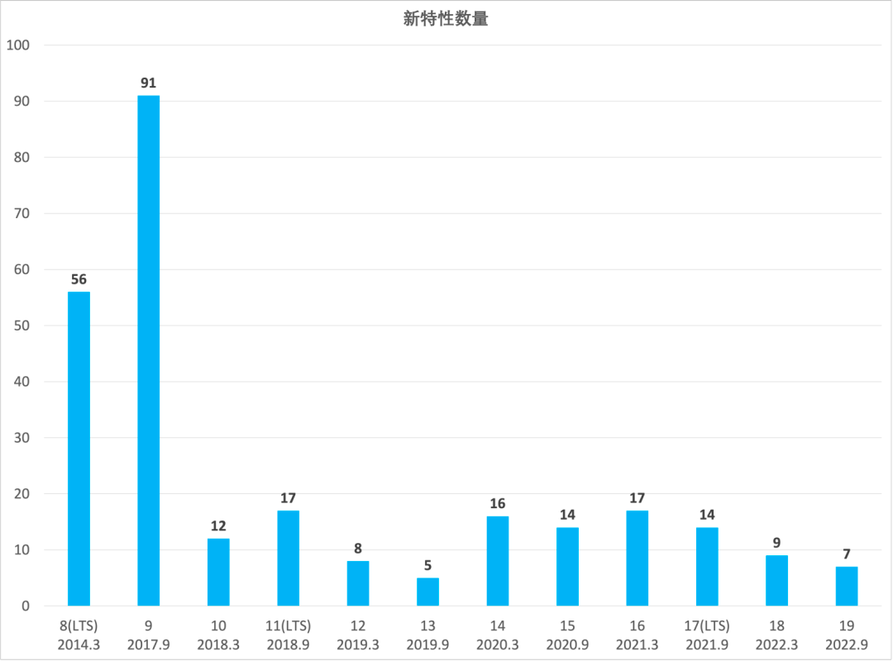
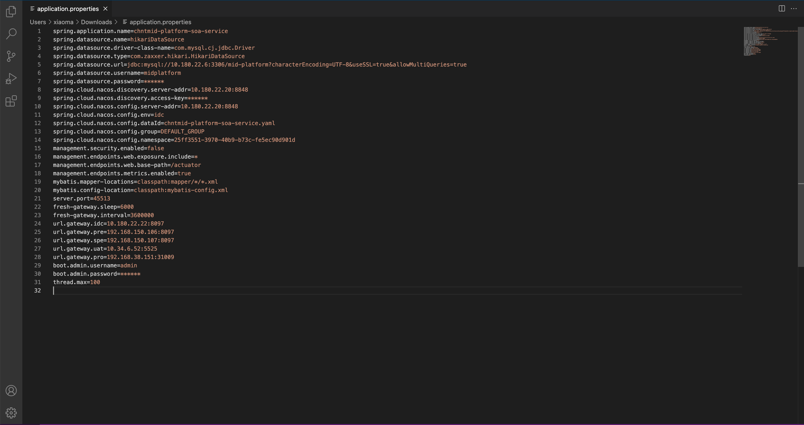
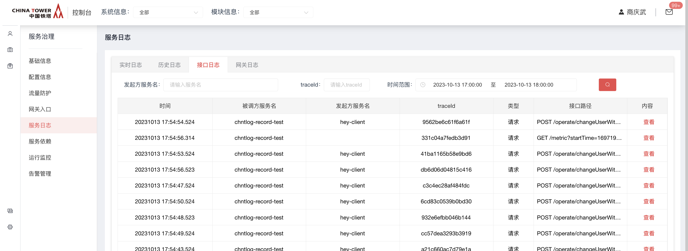

# 微服务开发框架简介

Spring Cloud Chinatower 致力于提供微服务开发的一站式解决方案。此项目包含开发分布式应用服务的必需组件，方便开发者通过 Spring Cloud 编程模型轻松使用这些组件来开发分布式应用服务。

依托 Spring Cloud Chinatower，您只需要添加一些注解和少量配置，就可以将 Spring Cloud 应用接入铁塔分布式应用解决方案，通过铁塔技术中台来迅速搭建分布式应用系统。

目前 Spring Cloud Chinatower 提供了如下功能:

- [服务注册与发现](http://mid.chinatowercom.cn:18080/docs/chinatower-microservice-component/v1.0/module/nacos-discovery.html)：适配 Spring Cloud v2021 服务注册与发现标准，默认集成了 LoadBalancer 的支持。
- [分布式配置管理](http://mid.chinatowercom.cn:18080/docs/chinatower-microservice-component/v1.0/module/nacos-config.html)：支持分布式系统中的外部化配置，配置更改时自动刷新。
- [微服务网关](http://mid.chinatowercom.cn:18080/docs/chinatower-microservice-component/v1.0/module/gateway.html): 提供各微服务系统之间的网络访问。
- Rpc服务：扩展 Spring Cloud 客户端 RestTemplate 和 OpenFeign。
- [分布式事务](http://mid.chinatowercom.cn:18080/docs/chinatower-microservice-component/v1.0/module/seata.html)：使用 @GlobalTransactional 注解， 高效并且对业务零侵入地解决分布式事务问题。
- [ESB服务转换](http://mid.chinatowercom.cn:18080/docs/chinatower-microservice-component/v1.0/module/esb.html)：适配ESB总线，支持微服务应用与传统的ESB应用接口的相互转换。
- [OpenApi](http://mid.chinatowercom.cn:18080/docs/chinatower-framework/v1.0/module/open-api.html): 适配最新OpenApi V3版本，支持自动上传接口信息到技术中台。
- 服务自监控： 使用actuator扩展自定义指标，通过prometheus进行业务指标的统计。
- [服务限流降级](http://mid.chinatowercom.cn:18080/docs/chinatower-microservice-component/v1.0/module/sentinel.html)：支持 WebServlet、WebFlux, OpenFeign、RestTemplate 限流降级功能的接入，可以在运行时通过控制台实时修改限流降级规则，还支持查看限流降级 Metrics 监控。
- [Docker支持](http://mid.chinatowercom.cn:18080/docs/chinatower-framework/v1.0/module/docker.html)：提供默认容器化构建镜像脚本，更好的支持容器化部署。
- [JDK11&JDK17](http://mid.chinatowercom.cn:18080/docs/chinatower-framework/v1.0/module/jdk11-17.html)：默认支持JDK11&JDk17版本支持。

微服务框架基于Spring Cloud技术栈，其主体功能包含两个方面，一是提供微服务架构下的基础设施服务，另外对一些通用功能集成，如负载均衡、断路器、数据持久层等进行集成。业务模块开发人员应用此框架，只需专注于业务代码实现，降低开发成本。

> [!IMPORTANT]
>
> 微服务开发框架仅支持基于 `spring-boot-maven-plugin` 构建 `all in one` 可运行jar。不支持将lib包分离部署。


# 版本说明

| 名称                                  | 版本    | spring boot版本 | spring cloud版本 | 发布时间   |
| ------------------------------------- | ------- | --------------- | ---------------- | ---------- |
| framework-app                         | 1.0     | 1.5.8.RELEASE   | Dalston.SR4      |            |
| chinatower-cloud-basis-starter        | 1.0     | 2.0.6.RELEASE   | Finchley.SR2     |            |
| chinatower-cloud-basis-starter        | 1.1     | 2.0.6.RELEASE   | Finchley.SR2     |            |
| chinatower-cloud-basis-starter        | 1.2.3   | 2.0.6.RELEASE   | Finchley.SR2     |            |
| chinatower-cloud-basis-starter        | 1.2.4   | 2.0.6.RELEASE   | Finchley.SR2     |            |
| spring-cloud-starter-chinatower-basis | 3.0.6.0 | 2.6.14          | 2021.0.6         | 2022.10    |
| spring-cloud-starter-chinatower-basis | 3.0.6.2 | 2.6.14          | 2021.0.6         | 2023.11.1  |
| spring-cloud-starter-chinatower-basis | 3.0.6.3 | 2.6.15          | 2021.0.6         | 2023.12.26 |
| spring-cloud-starter-chinatower-basis | 3.0.9.0 | 2.6.15          | 2021.0.9         | 2023.12.26 |
| spring-cloud-starter-chinatower-basis | 3.0.9.1 | 2.6.15          | 2021.0.9         | 2024.03.15 |
| spring-cloud-starter-chinatower-basis | 3.0.9.2 | 2.6.15          | 2021.0.9         | 2024.04.23 |
| spring-cloud-starter-chinatower-basis | 3.1.4.0 | 3.1.7           | 2022.0.4         | 2023.12.27 |


# 版本升级指南

## 升级到3.1.4.0

> [!important]
>
> 本文说明如何从3.0.9.0版本升级到微服务开发框架3.1.4.0版本。

#### 微服务开发框架版本升级

##### 修改版本声明

3.0.9.0 修改为 3.1.4.0

`pom.xml`

```xml
<dependencyManagement>
    <dependencies>
        <dependency>
            <groupId>com.chinatower.cloud</groupId>
            <artifactId>spring-cloud-chinatower-dependencies</artifactId>
            <version>3.1.4.0</version>
            <type>pom</type>
            <scope>import</scope>
        </dependency>
    </dependencies>
</dependencyManagement>
```

##### 其他

- 使用此版本，最低需要jdk17
- spring-cloud 2021.0.9 → 2022.0.4
- spring-boot 2.6.15 → 3.1.7 (pagehelper组件不兼容boot3.2.x，请勿覆盖boot版本)
- 因sentinel暂不支持jdk17，取消自动引入
- 包名变更 javax.servlet → jakarta.servlet (所有的二方包、三方包均需变更)
- 目前使用此版本后，已充分验证 nacos、seata组件的稳定性，其他组件（kafka，redis）未验证。
- sleuth → micrometer (spring cloud 2022移除了sleuth，具体请参考官方)
- pagehelper-spring-boot-starter 1.4.7 → 2.0.0


## 升级到3.0.9.3

> [!important]
>
> 本文说明如何从3.0.9.2版本升级到微服务开发框架3.0.9.3版本。

### 微服务开发框架版本升级

#### 修改版本声明

3.0.9.2修改为3.0.9.3

pom.xml

```xml
<dependencyManagement>
    <dependencies>
        <dependency>
            <groupId>com.chinatower.cloud</groupId>
            <artifactId>spring-cloud-chinatower-dependencies</artifactId>
            <version>3.0.9.3</version>
            <type>pom</type>
            <scope>import</scope>
        </dependency>
    </dependencies>
</dependencyManagement>
```

#### spring-cloud-starter-chinatower-log-record

- 默认文件上传下载不打印报文内容。

#### spring-cloud-starter-chinatower-basis

- com.google.guava:guava 20.0 → 33.2.0-jre

#### spring-cloud-starter-chinatower-sentinel

- bug修复

### 技术中台技术组件版本升级

> [!important]
>
> 此章节为可选章节，若业务系统使用了以下组件，则按照说明操作，反之则可以跳过。

#### spring-cloud-starter-chinatower-job

- 升级支持对接新版本xxl-job

## 升级到3.0.9.2

> [!important]
>
> 本文说明如何从3.0.9.1版本升级到微服务开发框架3.0.9.2版本。

### 微服务开发框架版本升级

#### 修改版本声明

3.0.9.1修改为3.0.9.2

pom.xml

```xml
<dependencyManagement>
    <dependencies>
        <dependency>
            <groupId>com.chinatower.cloud</groupId>
            <artifactId>spring-cloud-chinatower-dependencies</artifactId>
            <version>3.0.9.2</version>
            <type>pom</type>
            <scope>import</scope>
        </dependency>
    </dependencies>
</dependencyManagement>
```

#### spring-cloud-starter-chinatower-log-record

- log-record 设置默认level级别。

#### spring-cloud-starter-chinatower-openapi

- 框架默认启用。

#### spring-cloud-starter-chinatower-sentinel

- 框架默认启用。

#### spring-cloud-starter-chinatower-gateway-hostself

添加配置参数 `spring.main.web-application-type=reactive`	


### 技术中台技术组件版本升级

> [!important]
>
> 此章节为可选章节，若业务系统使用了以下组件，则按照说明操作，反之则可以跳过。

#### spring-cloud-starter-chinatower-kafka

- 1.5.2→1.5.3

## 升级到3.0.9.1

> [!important]
>
> 本文说明如何从3.0.9.0版本升级到微服务开发框架3.0.9.1版本。

### 微服务开发框架版本升级

#### 修改版本声明

3.0.9.0修改为3.0.9.1

pom.xml

```xml
<dependencyManagement>
    <dependencies>
        <dependency>
            <groupId>com.chinatower.cloud</groupId>
            <artifactId>spring-cloud-chinatower-dependencies</artifactId>
            <version>3.0.9.1</version>
            <type>pom</type>
            <scope>import</scope>
        </dependency>
    </dependencies>
</dependencyManagement>
```

#### spring-cloud-starter-chinatower-log-record

- 默认忽略静态资源的请求日志记录、gzip支持
- 插件配置server.port默认端口号8080

#### spring-cloud-starter-chinatower-4a-query

- 将4a查询部分的逻辑单独拆分为一个module。原4amodule依赖此query module

#### spring-cloud-starter-chinatower-monitor

- 删除actuator默认白名单策略，修改返回code401为404.增强安全性。

#### spring-cloud-starter-chinatower-form-engine-hostself

- 优化数据插入，解决decimal插入失败问题

#### 其他

- spring-cloud 2021.0.6 → 2021.0.9
- seata 1.4.1 → 1.6.1
- fix sonarqube

## 升级到3.0.9.0

> [!important]
>
> 本文说明如何从3.0.6.3版本升级到微服务开发框架3.0.9.0版本。

### 微服务开发框架版本升级

#### 修改版本声明

3.0.6.3修改为3.0.9.0

pom.xml

```xml
<dependencyManagement>
    <dependencies>
        <dependency>
            <groupId>com.chinatower.cloud</groupId>
            <artifactId>spring-cloud-chinatower-dependencies</artifactId>
            <version>3.0.9.0</version>
            <type>pom</type>
            <scope>import</scope>
        </dependency>
    </dependencies>
</dependencyManagement>
```

#### 其他

- spring-cloud 2021.0.6 → 2021.0.9
- seata 1.4.1 → 1.6.1

## 升级到3.0.6.3

> [!important]
>
> 本文说明如何从3.0.6.2版本升级到微服务开发框架3.0.6.3版本。

### 微服务开发框架版本升级

#### 修改版本声明

3.0.6.2修改为3.0.6.3

pom.xml

```xml
<dependencyManagement>
    <dependencies>
        <dependency>
            <groupId>com.chinatower.cloud</groupId>
            <artifactId>spring-cloud-chinatower-dependencies</artifactId>
            <version>3.0.6.3</version>
            <type>pom</type>
            <scope>import</scope>
        </dependency>
    </dependencies>
</dependencyManagement>
```

#### spring-cloud-starter-chinatower-log-record

- 新增统一操作日志组件，框架默认启用。

#### spring-cloud-starter-chinatower-router-loadbalancer

- 新增灰度发布支持

#### 其他

- cyclonedx-maven-plugin 2.7.1 → 2.7.10
- spring-boot 2.6.14 → 2.6.15

### 技术中台技术组件版本升级

> [!important]
>
> 此章节为可选章节，若业务系统使用了以下组件，则按照说明操作，反之则可以跳过。

#### spring-cloud-starter-chinatower-gateway-hostself

- 新增API网关私有版，可前往技术中台申请。
- 支持灰度发布
- 支持对接轻量化认证授权。

#### spring-cloud-starter-chinatower-form-engine-hostself

- 表单引擎创建表结构新增4个原始字段（form_code、version、attributeA、attributeB）

#### spring-cloud-starter-chinatower-bpm

- 添加了非事务性注解@BpmNoTransactional

#### chinatower-encrypt

- 修复安全漏洞 1.0 → 1.7.1

## 升级到3.0.6.2

> [!important]
>
> 本文说明如何从3.0.6.0版本升级到微服务开发框架3.0.6.2版本。

### 微服务开发框架版本升级

#### 修改版本声明

3.0.6.0修改为3.0.6.2

pom.xml

```xml
<dependencyManagement>
    <dependencies>
        <dependency>
            <groupId>com.chinatower.cloud</groupId>
            <artifactId>spring-cloud-chinatower-dependencies</artifactId>
            <version>3.0.6.2</version>
            <type>pom</type>
            <scope>import</scope>
        </dependency>
    </dependencies>
</dependencyManagement>
```

#### spring-cloud-starter-chinatower-basis

- com.github.pagehelper:pagehelper-spring-boot-starter 1.4.6 → 1.4.7
- tk.mybatis:mapper-spring-boot-starter 4.2.2 → 4.2.3
- com.alibaba:druid 1.2.17 → 1.2.18

#### spring-cloud-starter-chinatower-gateway

新增对接网关的客户端，快速完成网关的header认证。

#### 优化缺少spring.application.syscode配置的提示。

未配置 spring.application.syscode 属性值，请增加此配置，值为主数据系统当前微服务所属的三级模块编码全小写（eg: chntjszt_wfwkj_001）

### 技术中台技术组件版本升级

> [!important]
>
> 此章节为可选章节，若业务系统使用了以下组件，则按照说明操作，反之则可以跳过。

#### spring-cloud-starter-chinatower-kafka

- 3.0.6.0 → 3.0.6.2
  - com.chinatower:chinatower-mq 1.5.0 → 1.5.2

#### spring-cloud-starter-chinatower-sms

优化对接SMS客户端，简化使用。

[点击查看](http://mid.chinatowercom.cn:18080/docs/chinatower-framework-lowcode/v1.0/module/短信组件.html)

#### spring-cloud-starter-chinatower-bpm

新增对接普元流程引擎V8微服务版本客户端，集成分布式事务保证数据一致性。

[点击查看](http://mid.chinatowercom.cn:18080/docs/chinatower-framework-lowcode/v1.0/module/流程引擎.html)

#### spring-cloud-starter-chinatower-4a

新增对接4A系统客户端，快速完成与4a系统的对接。

[点击查看](http://mid.chinatowercom.cn:18080/docs/chinatower-framework-lowcode/v1.0/module/4A.html)

#### spring-cloud-starter-chinatower-email

优化对接邮件客户端，简化使用。

[点击查看](http://mid.chinatowercom.cn:18080/docs/chinatower-framework-lowcode/v1.0/module/邮件组件.html)

#### spring-cloud-starter-chinatower-job

优化对接定时任务客户端，简化使用。


## 升级到3.0.6.0

> [!NOTE]
>
> 基于微服务架构的特性，建议先找一个微服务进行生产上线，观察一周后再升级其他微服务。遵循先边缘服务再重点微服务的策略，逐步扩大范围升级。

> [!important]
>
> 本文讲述从chinatower-cloud-basis-starter 1.x版本升级到spring-cloud-starter-chinatower-basis 3.0.6.0版本。

### 微服务开发框架版本升级

> [!important] 
>
> 此章节为每个微服务都必须执行的步骤。请开发人员在新Git分支进行操作。 

#### 添加Nexus私服

> [!NOTE]
>
> Nexus私服已于2022/12/5由验收环境迁移到华为云准生产环境，原公网地址已关闭，请打开SDP软件开启全局访问后，再使用Maven下载公共依赖。

##### 项目根pom文件添加

```xml
<repositories>
    <repository>
        <id>chinatower</id>
        <url>http://10.38.77.5:8081/repository/maven-public/</url>
    </repository>
</repositories>
```

##### 本地Maven配置添加

由于铁塔私服地址对外以ip:port地址提供，maven高版本禁止非https协议下载依赖，请执行以下步骤

1. 前往 `.m2` 文件夹
2. 创建 `settings.xml` 文件
3. 将以下代码粘贴并保存。
4. 确保IDEA使用此 `settings.xml` 配置文件。

```xml
<mirror>
  <id>chinatowerhttps</id>
  <mirrorOf>chinatower</mirrorOf>
  <name>Maven chinatower https</name>
  <url>http://10.38.77.5:8081/repository/maven-public/</url>
</mirror>
```

#### 添加版本声明

版本升级后，为了便于管理，相关包Maven坐标发生变动，实际类路径未发生变动。同时，我们也提供了BOM支持。

Spring Cloud Chinatower BOM 包含了它所使用的所有依赖的版本。

将中国铁塔微服务开发框架提供的 BOM 添加到您的项目 `根 pom.xml` 中的 `<dependencyManagement>` 部分。 这将允许您省略任何Maven依赖项的版本，而是将版本控制委派给BOM。

```xml
<dependencyManagement>
    <dependencies>
        <dependency>
            <groupId>org.springframework.boot</groupId>
            <artifactId>spring-boot-dependencies</artifactId>
            <version>2.6.14</version>
            <type>pom</type>
            <scope>import</scope>
        </dependency>
        <dependency>
            <groupId>org.springframework.cloud</groupId>
            <artifactId>spring-cloud-dependencies</artifactId>
            <version>2021.0.6</version>
            <type>pom</type>
            <scope>import</scope>
        </dependency>
        <dependency>
            <groupId>com.chinatower.cloud</groupId>
            <artifactId>spring-cloud-chinatower-dependencies</artifactId>
            <version>3.0.6.0</version>
            <type>pom</type>
            <scope>import</scope>
        </dependency>
    </dependencies>
</dependencyManagement>
```

#### basis依赖升级

删除以下依赖

```xml
<dependency>
    <groupId>com.chinatower.framework.cloud</groupId>
    <artifactId>chinatower-cloud-basis-starter</artifactId>
    <version>1.x</version>
</dependency>
```

新增依赖

```xml
<dependency>
    <groupId>com.chinatower.cloud</groupId>
    <artifactId>spring-cloud-starter-chinatower-basis</artifactId>
</dependency>
```

主要变动如下:

- 删除 `org.springframework.cloud` 相关无用依赖

  - spring-cloud-starter-netflix-hystrix
  - spring-cloud-starter-netflix-hystrix-dashboard
  - spring-cloud-starter-netflix-ribbon
  - spring-cloud-starter-zipkin
  - spring-cloud-starter-sleuth
  - spring-cloud-sleuth-zipkin

- 升级相关依赖

  - com.github.pagehelper:pagehelper-spring-boot-starter 1.2.10 → 1.4.6

    若使用了 `PageHelper.startPage(0,0)` 这种特殊参数，新版本默认只会进行count操作。需要添加参数 `pagehelper.pageSizeZero=true` 进行避免。 [点击查看详情](http://mid.chinatowercom.cn:18080/docs/chinatower-framework/v1.0/module/upgrade-3.0.6.0.html#pagehelper) (20230621补充)

  - tk.mybatis:mapper-spring-boot-starter 2.1.5 → 4.2.2

  - com.alibaba:druid 1.1.10 → 1.2.17

  - javassist:javassist 3.11.0.GA → 3.12.1.GA

  - org.apache.skywalking:apm-toolkit-logback-1.x 6.2.0 → 8.14.0

- 删除配置中心默认依赖（可选组件，自行添加）

- Web容器变更说明

  `chinatower-cloud-basis-starter` 依赖在1.0版本中使用 `Tomcat` 容器，在 `1.1` 版本后排除了 `Tomcat` 容器，使用 `Undertow` 容器，`3.x` 版本根据信息院信创要求将切换使用 `Tomcat` 容器，请业务组注意影响。后续铁塔微服务框架统一使用 `Tomcat` 容器且仅允许使用 `Tomcat` 容器 (20230525补充)。

#### Swagger组件

删除以下依赖

```xml
<dependency>
     <groupId>com.chinatower.framework.cloud</groupId>
     <artifactId>chinatower-swagger-starter</artifactId>
     <version>1.0</version>
</dependency>
```

删除以下配置

```yaml
swagger:
  enable: false #是否开启swagger功能
  package:
    scan: com.chinatower.product #扫描包路径
  title: springboot利用swagger构建api文档 #title
  description: 简单优雅的restfun风格 #描述
  version: 1.1 #版本
  contact: #联系人
    name: wq #联系人名称
    tel: 13888888888 #联系人电话
    email: test@qq.com #联系人qq
```

新增以下配置

```xml
<dependency>
    <groupId>com.chinatower.cloud</groupId>
    <artifactId>spring-cloud-starter-chinatower-openapi</artifactId>
</dependency>
```

具体信息可以参考 [OpenApi采集](http://mid.chinatowercom.cn:18080/docs/chinatower-framework/v1.0/module/open-api.html) 章节

#### common_service组件

删除以下依赖

```xml
<dependency>
    <groupId>com.chinatower.framework.cloud</groupId>
    <artifactId>common_service</artifactId>
    <version>1.1</version>
</dependency>
```

新增以下配置

```xml
<dependency>
    <groupId>com.chinatower.cloud</groupId>
    <artifactId>spring-cloud-chinatower-commons</artifactId>
</dependency>
```

#### 其他组件和配置

##### zipkin

Zipkin已废弃，删除相关zipkin配置和代码，如需调用链支持，请联系维护组对应包机经理接入APM系统。

```yaml
spring:
  zipkin:
    base-url: http://192.168.150.107:9411/
    enabled: true
    sender:
      type: web
```

##### hystrix

2020 年 12 月 22 日 Spring 官方博客宣布，Spring Cloud 2020.0.0 正式发布。2020.0.0  是第一个使用新的版本号命名方案的 Spring Cloud 发行版本。 Spring Cloud 官方尤其着重指出 ribbon、hystrix 和 zuul 从 Spring Cloud 2020.0 正式版发布后将不再被 Spring Cloud 支持。具体请查看 [Spring Cloud Netflix OSS Support](https://spring.io/projects/spring-cloud-netflix#support)。

##### 替换 `FallbackFactory` 类包名地址。

由 `feign.hystrix.FallbackFactory` 替换为 `org.springframework.cloud.openfeign.FallbackFactory`。

> [!TIP]
>
> 可以使用IDEA，Ctrl+Shift+R 快捷键完成批量替换。

删除hystrix相关配置和代码


##### 允许循环引用

> [!TIP]
>
> 若使用配置中心能力，应将此配置添加到 `bootstrap.yaml` 文件中。

高版本Spring Boot 默认不允许，需要开启。

```yaml
spring:
  main:
    allow-circular-references: true
```

##### 允许Bean覆盖

> [!TIP]
>
> 若使用配置中心能力，应将此配置添加到 `bootstrap.yaml` 文件中。

高版本Spring Boot 默认不允许，需要开启。

```yaml
spring:
  main:
    allow-bean-definition-overriding: true
```

##### 升级spring-boot-maven-plugin插件版本

升级插件版本为 `2.6.14`

```xml
<plugin>
    <groupId>org.springframework.boot</groupId>
    <artifactId>spring-boot-maven-plugin</artifactId>
    <version>2.6.14</version>
    <configuration>
        <fork>true</fork>
    </configuration>
    <executions>
        <execution>
            <goals>
                <goal>build-info</goal>
                <goal>repackage</goal>
            </goals>
        </execution>
    </executions>
</plugin>
```

#### 补充服务治理配置

##### Maven依赖治理

pom文件中添加以下构建插件，技术中台会通过网关访问服务暴露的Maven依赖信息，进行信息采集。

```xml
<plugin>
    <groupId>org.cyclonedx</groupId>
    <artifactId>cyclonedx-maven-plugin</artifactId>
    <version>2.7.10</version>
    <executions>
        <execution>
            <phase>validate</phase>
            <goals>
                <goal>makeAggregateBom</goal>
            </goals>
        </execution>
    </executions>
    <configuration>
        <outputFormat>json</outputFormat>
        <outputName>classes/bom</outputName>
    </configuration>
</plugin>
```

##### Maven构建治理

```xml
<build>
    <plugins>
        <plugin>
            <groupId>pl.project13.maven</groupId>
            <artifactId>git-commit-id-plugin</artifactId>
            <version>4.9.10</version>
            <executions>
                <execution>
                    <id>get-the-git-infos</id>
                    <goals>
                        <goal>revision</goal>
                    </goals>
                    <phase>initialize</phase>
                </execution>
            </executions>
            <configuration>
                <generateGitPropertiesFile>true</generateGitPropertiesFile>
                <generateGitPropertiesFilename>${project.build.outputDirectory}/git.json</generateGitPropertiesFilename>
                <includeOnlyProperties>
                    <includeOnlyProperty>^git.branch$</includeOnlyProperty>
                    <includeOnlyProperty>^git.build.(time|version|number|host|user.email|user.name)$</includeOnlyProperty>
                    <includeOnlyProperty>^git.commit.id.(abbrev|full|describe)$</includeOnlyProperty>
                    <includeOnlyProperty>^git.commit.message.full$</includeOnlyProperty>
                    <includeOnlyProperty>^git.commit.time$</includeOnlyProperty>
                    <includeOnlyProperty>^git.closest.tag.name$</includeOnlyProperty>
                    <includeOnlyProperty>^git.remote.origin.url$</includeOnlyProperty>
                </includeOnlyProperties>
                <format>json</format>
                <abbrevLength>8</abbrevLength>
                <commitIdGenerationMode>full</commitIdGenerationMode>
            </configuration>
        </plugin>
        <plugin>
            <groupId>org.springframework.boot</groupId>
            <artifactId>spring-boot-maven-plugin</artifactId>
            <version>2.6.14</version>
            <configuration>
                <fork>true</fork>
            </configuration>
            <executions>
                <execution>
                    <goals>
                        <goal>build-info</goal>
                        <goal>repackage</goal>
                    </goals>
                </execution>
            </executions>
        </plugin>
    </plugins>
</build>
```

##### 信息采集安全管控

`spring-cloud-starter-chinatower-basis` 内部默认依赖了 `spring-cloud-starter-chinatower-monitor` 依赖（支持servlet和webflux环境），monitor依赖内部会添加一个过滤器，只有提供正确的密钥才允许访问。要求业务系统修改nginx配置 /actuator 和 /v3/api-docs 不允许外网访问。

```yaml
management:
  security:
    enabled: false
  metrics:
    export:
      prometheus:
        enabled: true
      jmx:
        enabled: false
  endpoints:
    web:
      exposure:
        include: '*'
      base-path: /actuator
    metrics:
      enabled: true
    health:
      show-details: always
```

### 技术中台技术组件版本升级

> [!IMPORTANT]
>
> 此章节为可选章节，若业务系统使用了以下组件，则按照说明操作，反之则可以跳过。

#### 配置中心组件

- 将 `bootstrap.properties` 修改为 `bootstrap.yaml` 格式。
- 删除以下依赖配置。

```xml
<dependencies>
    <dependency>
        <groupId>com.alibaba.cloud</groupId>
        <artifactId>spring-cloud-starter-alibaba-nacos-config</artifactId>
        <version>2.0.2.RELEASE</version>
    </dependency>

    <dependency>
        <groupId>com.chinatower.framework.cloud</groupId>
        <artifactId>chinatower-cloud-basis-starter</artifactId>
        <version>1.2.3</version>
        <exclusions>
            <exclusion>
                <groupId>com.alibaba.nacos</groupId>
                <artifactId>nacos-client-proxy</artifactId>
            </exclusion>
            <exclusion>
                <groupId>org.springframework.cloud</groupId>
                <artifactId>spring-cloud-starter-alibaba-nacos-config</artifactId>
            </exclusion>
        </exclusions>
    </dependency>
</dependencies>
```

- 增加以下配置

```xml
<dependency>
    <groupId>com.chinatower.cloud</groupId>
    <artifactId>spring-cloud-starter-chinatower-nacos-config</artifactId>
</dependency>
```

#### 分布式事务Seata组件

删除以下依赖

```xml
<dependency>
     <groupId>com.chinatower.framework.cloud</groupId>
     <artifactId>chinatower-seata-starter</artifactId>
     <version>1.x</version>
</dependency>
```

新增以下配置

```xml
<dependency>
    <groupId>com.chinatower.cloud</groupId>
    <artifactId>spring-cloud-starter-chinatower-seata</artifactId>
</dependency>
```

> [!important]
>
> 不要升级mysql驱动版本。目前经过验证8.0.22版本是可以开启事务以及回滚事务的，高版本会无法回滚。

#### kafka组件

删除以下依赖

```xml
<dependency>
    <groupId>com.chinatower</groupId>
    <artifactId>chinatower-mq</artifactId>
</dependency>
```

新增以下配置

```xml
<dependency>
    <groupId>com.chinatower.cloud</groupId>
    <artifactId>spring-cloud-starter-chinatower-kafka</artifactId>
</dependency>
```

变更说明：

1、生产者Config配置修改 key的序列化方式，由IntegerSerializer.class修改为StringSerializer.class value的序列化方式，由IntegerSerializer.class修改为StringSerializer.class

2、消费者者Config配置修改 key的序列化方式，由IntegerSerializer.class修改为StringSerializer.class value的序列化方式，由IntegerSerializer.class修改为StringSerializer.class

3、生产者发送消息key默认值修改 由不设置默认值修改为key默认值为uuid

> [!IMPORTANT]
>
> **提示**：因为以上变更，所以需要生产者服务和消费者服务同时升级，如果只有一方升级，则会造成消息消费失败。 对于不能同时完成框架升级的情况，需要未完成框架升级的服务，单独升级kafka依赖包，保证生产者和消费者key/value对应的序列化类型一致。
>
> pom文件中，做如下修改：不需要配置spring-cloud-starter-chinatower-kafka ，直接把chinatower-mq 依赖版本 1.3.5 升级为1.3.7

```xml
<dependency>
  <groupId>com.chinatower</groupId>
  <artifactId>chinatower-mq</artifactId>
  <version>1.3.7</version>
</dependency>
```

#### 其他配置

##### 文件上传Size配置

文件上传size值若之前带分号( `;` ),则需要删除分号。

```yaml
spring:
  servlet:
    multipart:
      max-file-size : 20MB
      max-request-size : 100MB
```

##### Post请求获取表单参数配置

在新Spring boot版本中，表单文件上传可能会出现Controller层方法无法获取实际表单值的情况。

触发限定条件：

1. `content-type: multipart/form-data`
2. `post`方法

可添加以下配置尝试解决。

```yaml
spring:
  mvc:
    hiddenmethod:
      filter:
        enabled: true
```

### 业务组其他三方包版本升级

项目组使用的其他二方包、三方包等内部依赖Spring相关组件的依赖包需要进行版本升级。需要和要求的boot版本相匹配，不能造成依赖冲突。这部分需要业务组自行处理。

项目组开发人员可以使用 `IDEA` 安装 `Maven Helper` 插件，发现依赖版本冲突，并进行修复。

#### 自验证

> [!IMPORTANT]
>
> 第五章节（微服务开发框架版本升级）为必需项，内部每个配置都需要执行。请确保执行完成后再进行验证。

##### 页面验证

- 通过4A或者OA登录技术中台系统（若无权限，请提4a工单申请开通）。
- 点击技术中台控制台按钮。


- 点击左侧菜单服务治理，进入服务治理页面（若看不到服务列表，请在开发框架群联系运营团队绑定4a账号与系统模块关系）。


- 点击服务名称，进入服务详情页面（若找不到自己负责的服务，请在开发框架群联系运营团队更改服务与系统绑定关系）


- 点击基本信息→接口信息 可以看到接口列表（若看不到接口清单，请点击更新接口按钮重试）


- 点击基本信息→Maven依赖 可以看到Maven依赖树（若看不到清单，请点击查询按钮重试）


> [!NOTE]
>
> 若能够看到接口清单和Maven依赖树(版本在3.0.6.0以上)，则升级完成。

##### API验证

- ip: 微服务实例真实ip
- port： 微服务实例真实port
- token： 技术中台申请注册中心后返回的（token/accesskey）
- Maven依赖校验类： com.chinatower.cloud.starter.monitor.filter.ActuatorFilter
- API接口校验类： com.chinatower.cloud.starter.openapi.OpenApiFilter

```sh
# 自检验Maven依赖 返回值json包含名为bom的key即为正常
curl $ip:$port/actuator/info -H "Authorization: $token"
# 自检验api接口 有返回值即为正常
curl $ip:$port/v3/api-docs/ -H "Authorization: $token"
```

若API验证不正常，请业务组自行处理，若API验证正常，页面验证不正常，请在开发框架群向运营团队沟通反映。

#### 技术支撑

如有问题请前往开发框架与组件化支撑群沟通。

#### 补充说明

##### pagehelper


*Figure 3. pageHelper v5.2.0 相关代码变更记录*

# 使用HikariCP数据源

## 适用场景

适用于使用了Druid数据源，想要切换到HikariCP数据源，本篇将介绍如何完成切换。

### HikariCP优势

相对于其他JDBC数据库连接池，HikariCP更轻量，性能更高，目前是springboot默认的数据库连接池，JMH Benchmarks性能对比（来自HikariCP github）：


说明

- Connection Cycle 代表一次DataSource.getConnection()/Connection.close()调用
- Statement Cycle 代表一次Connection.prepareStatement(), Statement.execute(), Statement.close()调用

### HikariCP vs druid

- 性能：性能上HikariCP比druid强，由于是springboot默认集成的数据源，使用起来更加方便些。
- 功能：功能上druid更加全面，扩展性更强，支持Filter扩展、拦截SQL注入、 sql级别的监控等。
- 稳定：druid经过alibaba常年验证稳定性，HikariCP也经过Twitter等大公司验证，稳定性均足够。
- 支持：二者均在gitub开源，在持续维护中，社区活跃

综上，如果更加关注性能和使用便捷，可选择HikariCP数据源。

### 操作步骤

#### 1. 依赖替换

pom.xml中去除com.alibaba:druid和com.alibaba:druid-spring-boot-starter依赖，若druid为间接引入的，则增加exclusion进行依赖排除，如：

```xml
<dependency>
    <groupId>com.chinatower.cloud</groupId>
    <artifactId>spring-cloud-starter-chinatower-basis</artifactId>
    <exclusions>
        <exclusion>
            <groupId>com.alibaba</groupId>
            <artifactId>druid</artifactId>
        </exclusion>
    </exclusions>
</dependency>
```
>[!NOTE]
>
>依赖替换时，推荐使用Maven Helper插件依赖分析功能，能够更容易更准确地查找、排除相关的依赖

>[!NOTE]
>
>HikariCP为springboot2.0以后推荐使用的数据源，若工程使用了org.springframework.boot:spring-boot-starter-jdbcHikariCP依赖会默认引入，无需额外操作。 


#### 2. 配置修改

更改spring.datasource.name和spring.datasource.type，同时去除spring.datasource.druid相关配置，增加spring.datasource.hikari相关配置， 如：最大连接数、最小空闲连接数等，具体配置字段参考官方文档或网络搜索，不在此篇讨论范围。

- [github hikari常用配置](https://github.com/brettwooldridge/HikariCP#frequently-used)

更改前

```yaml
spring:
  datasource:
    name: druidDataSource
    type: com.alibaba.druid.pool.DruidDataSource
    druid:
      max-active: 20
      initial-size: 5
      # 省略若干druid相关配置
      # ...
```

更改后

```yaml
spring:
  datasource:
    name: hikariDataSource
    type: com.zaxxer.hikari.HikariDataSource
    hikari:
      maximum-pool-size: 100
      minimum-idle: 5
      # 省略若干hikari相关配置
      # ...
```

#### 3. 验证

重启应用，验证是否启动成功，启动成功后日志中将会包含类似下面的日志。启动成功后，可进行测试，验证数据库功能是否正常。

```text
2023-10-12 19:06:11 [INFO][com.zaxxer.hikari.HikariDataSource][getConnection][110]-> hikariDataSource - Starting...
2023-10-12 19:06:12 [INFO][com.zaxxer.hikari.HikariDataSource][getConnection][123]-> hikariDataSource - Start completed.
```
> [!NOTE]
>
> 若业务系统使用了druid作为多数据源方案，除了按本文中的操作步骤处理依赖和基本配置，则需要业务系统自行修改相关代码。 

# OpenApi采集

`springdoc-openapi` java库有助于使用 `Spring Boot` 项目自动生成 API 文档。 通过在运行时检查应用程序以根据 `Spring Boot` 配置、类结构和各种注解来推断 API 语义。在旧版本的铁塔微服务框架中，使用 `springfox` 依赖进行处理，但此开源的类库已经停止了维护，且时间已经超过两年，故替换使用 `springdoc-openapi` 库继续支持API生成和管理。

## 功能发布记录

| 发布时间 | 功能分类 | 功能名称 | 说明 |
| -------- | -------- | -------- | ---- |
|          |          |          |      |

## 重要通知

无

## 组件描述

支持以下功能特性：

- OpenAPI 3
- Spring-boot (v1 and v2)
- JSR-303, specifically for @NotNull, @Min, @Max, and @Size.
- Swagger-ui
- OAuth 2
- GraalVM native images

## 快速入门

组件无须申请，配置即可使用。

## 操作指南

无

## 典型实践

`openapi` 并不是默认开启。如果要在您的项目中使用 `openapi` ，使用 group ID 为 `com.chinatower.cloud` 和 artifact ID 为 `spring-cloud-starter-chinatower-openapi` 的 starter。

```xml
<dependency>
    <groupId>com.chinatower.cloud</groupId>
    <artifactId>spring-cloud-starter-chinatower-openapi</artifactId>
</dependency>
```

此依赖仅生成openapi模型文档，即仅支持生成 `/v3/api-docs` api接口供API网关定期扫描采集接口信息。并不提供UI页面，内部已添加针对 `/v3/api-docs` api接口的过滤器进行安全保证。

如需添加UI界面，可以添加以下依赖到项目中，这将提供一个swaggerUI(http://server:port/context-path/swagger-ui.html) 界面，方便接口测试。

```xml
<dependency>
    <groupId>org.springdoc</groupId>
    <artifactId>springdoc-openapi-ui</artifactId>
    <version>1.6.12</version>
</dependency>
```

> [!NOTE]
>
> 添加此依赖后，会暴露接口信息，请项目组自行做好安全把控。

### 从老版本升级

- 移除所有swagger相关依赖，使用 `spring-cloud-starter-chinatower-openapi` 替换

```xml
<!--删除此依赖-->
<dependency>
    <groupId>com.chinatower.framework.cloud</groupId>
    <artifactId>chinatower-swagger-starter</artifactId>
    <version>1.0</version>
</dependency>
<!--添加此依赖-->
<dependency>
    <groupId>com.chinatower.cloud</groupId>
    <artifactId>spring-cloud-starter-chinatower-openapi</artifactId>
</dependency>
```

- 用 `swagger3` 注解替换 `swagger2` 注解（它已经包含在新依赖项中）。`swagger3` 注解的包是 `io.swagger.v3.oas.annotations` .
  - @Api→@Tag
  - @ApiIgnore→@Parameter(hidden = true)或@Operation(hidden = true)或@Hidden
  - @ApiImplicitParam→@Parameter
  - @ApiImplicitParams→@Parameters
  - @ApiModel→@Schema
  - @ApiModelProperty(hidden = true)→@Schema(accessMode = READ_ONLY)
  - @ApiModelProperty→@Schema
  - @ApiOperation(value = "foo", notes = "bar")→@Operation(summary = "foo", description = "bar")
  - @ApiParam→@Parameter
  - @ApiResponse(code = 404, message = "foo")→@ApiResponse(responseCode = "404", description = "foo")

### 其他高级使用

https://springdoc.org/#

## API参考

无

## SDK

maven引入铁塔为服务框架starter，具体pom.xml可参考[典型实践](http://mid.chinatowercom.cn:18080/docs/chinatower-framework/v1.0/module/open-api.html#A01)部分

## 网络要求

无

# 容器化支持

微服务框架提供默认的容器化Dockerfile。

## 功能发布记录

| 发布时间 | 功能分类 | 功能名称 | 说明 |
| -------- | -------- | -------- | ---- |
|          |          |          |      |

## 重要通知

无

## 组件描述

默认支持JDK11&JDK17，不推荐JDK8的应用进行容器化部署，额外的参数比较多，容易出问题。

## 快速入门

无须申请，配置即可使用。

## 操作指南

无

## 典型实践

### 新增.m2文件夹

项目根目录下新增.m2文件夹，文件夹内部新增settings.xml文件。文件内容如下

settings.xml

```xml
<mirror>
  <id>chinatowerhttps</id>
  <mirrorOf>chinatower</mirrorOf>
  <name>Maven chinatower https</name>
  <url>http://10.38.77.5:8081/repository/maven-public/</url>
</mirror>
```

### JDK11

Dockerfile.11

```Dockerfile
FROM maven:3.9.2-eclipse-temurin-11  as builder
WORKDIR /workspace
COPY chinatower_esb_service_api /workspace/chinatower_esb_service_api
COPY chinatower_esb_service_service /workspace/chinatower_esb_service_service
COPY pom.xml /workspace/pom.xml
COPY .m2 /workspace/.m2
RUN mvn -s .m2/settings.xml --batch-mode -T 4 clean install

FROM eclipse-temurin:11-jre-focal
RUN ln -fs /usr/share/zoneinfo/Asia/Shanghai /etc/localtime
RUN apt-get update && apt-get install -y \
    telnet \
    tree \
    curl \
 && rm -rf /var/lib/apt/lists/*
RUN mkdir -m 777 -p /app/logs/
COPY --from=builder /workspace/chinatower_esb_service_service/target/*.jar /app/app.jar
USER 65532:65532
#https://nacos.io/zh-cn/docs/system-configurations.html
CMD ["java","-Djava.security.egd=file:/dev/./urandom","-Djdk.tls.client.protocols=TLSv1.2","-DJM.LOG.PATH=/app/logs/nacos","-DJM.SNAPSHOT.PATH=/app/nacos-cache/config","-Dcom.alibaba.nacos.naming.cache.dir=/app/nacos-cache/naming","-jar","/app/app.jar"]
```

### JDK17

Dockerfile.17

```Dockerfile
FROM maven:3.9.2-eclipse-temurin-17  as builder
WORKDIR /workspace
COPY chinatower_esb_service_api /workspace/chinatower_esb_service_api
COPY chinatower_esb_service_service /workspace/chinatower_esb_service_service
COPY pom.xml /workspace/pom.xml
COPY .m2 /workspace/.m2
RUN mvn -s .m2/settings.xml --batch-mode -T 4 clean install

FROM eclipse-temurin:17-jre-focal
RUN ln -fs /usr/share/zoneinfo/Asia/Shanghai /etc/localtime
RUN apt-get update && apt-get install -y \
    telnet \
    tree \
    curl \
 && rm -rf /var/lib/apt/lists/*
RUN mkdir -m 777 -p /app/logs/
COPY --from=builder /workspace/chinatower_esb_service_service/target/*.jar /app/app.jar
USER 65532:65532
#https://nacos.io/zh-cn/docs/system-configurations.html
CMD ["java","-Djava.security.egd=file:/dev/./urandom","-Djdk.tls.client.protocols=TLSv1.2","-DJM.LOG.PATH=/app/logs/nacos","-DJM.SNAPSHOT.PATH=/app/nacos-cache/config","-Dcom.alibaba.nacos.naming.cache.dir=/app/nacos-cache/naming","-jar","/app/app.jar"]
```

以下为解释说明：

- 基础构建容器镜像内部不存在maven私服配置，所以在项目根目录创建一个并copy到容器镜像内部
- `ln -fs /usr/share/zoneinfo/Asia/Shanghai /etc/localtime` 配置东八区时区
- 安装必要的依赖 telnet tree curl 便于exec 进入容器后定位问题，删除目录去除缓存，降低docker layer层大小。
- 使用65532UID，不使用root用户启动，降低安全风险。
- CMD配置默认参数，收敛日志打印位置，便于挂载数据盘统一管理。

## API参考

无

## SDK

无

## 网络要求

无

# JDK11&JDK17

2006 年之后 SUN 公司决定将 JDK 进行开源，从此成立了 OpenJDK 组织进行 JDK  代码管理。任何人都可以获取该源码，并通过源码构建一个发行版发布到网络上。但是需要一个组织审核来确保构建的发行版是有效的, 这个组织就是  JCP(Java Community Process)。

2009 年，SUN 公司被 Oracle 公司收购，此时大家使用的 JDK 通常都是 Oracle 公司的 OpenJDK 构建版本-OracleJDK。Oracle 公司接手 Java 商标之后，加快了 JDK 的发布版本。

2018 年 9 月 25 日，JDK11 成功发布，这是一个 LTS 版本，包含了 17 个 JEP 的更新。与此同时，Oracle 把 JDK11 起以往的商业特性全部开源给 OpenJDK（例如：ZGC 和 Flight Recorder）。根据 Oracle  的官方说法（Oracle JDK Releases for Java 11 and Later），从 JDK11 之后，OracleJDK 与  OpenJDK 的功能基本一致。然后，Oracle 宣布以后将会同时发行两款 JDK：

1. 一个是以 GPLv2+CE 协议下，由 Oracle 发行 OpenJDK（简称为 Oracle OpenJDK）；
2. 另一个是在 OTN 协议下的传统 OracleJDK。

这两个 JDK 共享绝大多数源码，核心差异在于前者可以免费在开发、测试和生产环境下使用，但是只有半年时间的更新支持。后者各个人可以免费使用，但是生产环境中商用就必须付费，可以有三年时间的更新支持。

2021 年 9 月 14 日，Oracle JDK17 发布，目前也是最新的 Java LTS 版本。OracleJDK17  是免费的开源协议，并支撑长达 8 年的维护计划。 Oracle 在 JDK8 上开源协议支持的最高免费版本为 jdk1.8.0_202。2022 年 Spring6 和 SpringBoot3 相继推出，而支持的最低版本为 JDK17。

## 重要通知

无

## JDK版本概述

从1996年初JDK1.0发布到现在已经二十多年了， 最新一个版本已经到 JDK 19，JDK17是最新的一个LTS(Long-Term  Support)版本。所谓LTS版本就是可以得到至少八年产品支持的版本。到目前为止，有四个LTS版本，JDK 7、JDK 8、JDK  11、JDK 17，下一个LTS版本是JDK 21，预计在2023年9月发布。Oracle  每隔6个月就会有一个短期维护版本(non-LTS)发布出来；然后每隔2年，就会发布一款得到8年长期支持维护的JDK版本，下图是oracle官方发布的roadmap, 可以更直观的看到JDK版本的更新。


**Java 版本新特性**



上图显示了自 Java 8 起到 Java 19 各版本新增特性的数量。从 Java 8 到 Java 19 总共引入了超过 250  个新特性，其中 Java 9 中包含了 91 个新特性，这是由于之前的发布周期较长所导致的，在应用新的发布模型后，各版本的新增特性数量都维持在  10 个左右的水平。下面主要针对各版本的主要特性进行介绍

### JDK9

#### 模块化

模块化提供了比 package  更高级别的聚合，模块是一个包的容器。模块的代码被组织成多个包，每个包中包含Java类和接口；如果我们想让项目成为一个模块，则需要在该项目的java源码的根目录(如果是maven项目也就是src/main/java)添加一个特殊的java文件模块描述符文件 module-info.java，以jdk 里java.sql 模块为例：


```Java
/**
 * Defines the JDBC API.
 *
 * @uses java.sql.Driver
 *
 * @moduleGraph
 * @since 9
 */
// 声明模块
module java.sql {

    // 声明依赖模块, transitive修饰符会导致依赖于当前模块的其他模块具有隐式依赖性。
    requires transitive java.logging;
    requires transitive java.transaction.xa;
    requires transitive java.xml;

    // 声明哪些包是可以被其它模块访问
    exports java.sql;
    exports javax.sql;

    // 使用语句（uses statement）和提供语句（provides statement）实现其服务
    // 使用语句可以指定服务接口的名字，当前模块就会发现它，使用 java.util.ServiceLoader类进行加载
    uses java.sql.Driver;
}
```

#### 接口支持私有方法

JDK 8 为我们带来了接口的默认方法。接口现在也可以包含行为，而不仅仅是方法签名。JDK 9支持了私有方法，可以解决接口中代码复用问题；该特性主要是为了Java 8中default方法和static方法服务的。

```Java
public interface TestInterface{

    default void method(){ init(); }

    default void anotherMethod(){ init(); }

    private void init(){ System.out.println("Initializing");}
}
```

#### 新增Stream API & 集合工厂方法

JDK 9 为 Stream 新增了几个方法：dropWhile、takeWhile、ofNullable，为 iterate 方法新增了一个重载方法。

- takeWhile

takeWhile 方法使用一个断言作为参数，返回给定 Stream 的子集直到断言语句第一次返回 false。如果第一个值不满足断言条件，将返回一个空的 Stream。

```Java
// 输出 => abc
Stream.of("a","b","c","","e","f").takeWhile(s->!s.isEmpty())
         .forEach(System.out::print);
```

- dropWhile

dropWhile 方法和 takeWhile 作用相反的，使用一个断言作为参数，直到断言语句第一次返回 true 才返回给定 Stream 的子集。

```Java
// 输出 => ef
Stream.of("a","b","c","","e","f").dropWhile(s-> !s.isEmpty())
         .forEach(System.out::print);
```

- ofNullable

ofNullable 方法可以预防 NullPointerException 异常， 可以通过检查流来避免 null 值。[source, Java]

```Java
// 输出 => 0
System.out.println(Stream.ofNullable(null).count());
```

- 集合工厂方法

```Java
// 通过java.util.Set 创建 不可变 的集合实例
Set<String> set = Set.of("A", "B", "C");

// 通过java.util.List 创建 不可变 的集合实例
List<String> list = List.of("A", "B", "C");

// 通过k1,v1,k2,v2,...,形式创建
Map<String, String> map = Map.of("A","V1","B","v2","C","v3");

// 通过 Map.entry 形式创建
Map<Integer, String> map1 = Map.ofEntries (
    Map.entry(1, "v1"),
    Map.entry(2, "v2"),
    Map.entry(3, "v3"));
```

#### 改进版 Try-With Resources

try-with-resources 是 JDK 7 中一个新的异常处理机制，它能够很容易地关闭在 try-catch  语句块中使用的资源。try-with-resources 声明在 JDK 9 已得到改进。如果你已经有一个资源是 final 或等效于  final 变量,您可以在 try-with-resources 语句中使用该变量，而无需在 try-with-resources  语句中声明一个新变量。

```Java
static String readData(String message) throws IOException {
      Reader reader = new StringReader(message);
      BufferedReader br = new BufferedReader(reader);
     // 不需要重新声明变量
      try (br) {
         return br.readLine();
      }
  }
```

#### G1 成为默认垃圾收集器

在 Java 8 的时候，默认垃圾回收器是 Parallel Scavenge（新生代）+Parallel Old（老年代）。到了  Java 9, CMS 垃圾回收器被废弃了，G1（Garbage-First Garbage Collector） 成为了默认垃圾回收器。G1  是在 Java 7 中被引入的，经过两个版本优异的表现成为成为默认垃圾回收器。

### JDK 10

#### APPCDS 应用程序类数据共享

CDS 的全称是 Class-Data Sharing, CDS 的作用是让类可以被预处理放到一个归档文件中，后续 Java  程序启动的时候可以直接带上这个归档文件，这样 JVM 可以直接将这个归档文件映射到内存中，以节约应用启动的时间。这个特性在 JDK 1.5  就开始引入, 但是 CDS 只能作用与 Boot Class Loader 加载的类，不能作用于 App Class Loader 或者自定义的 Class Loader 加载的类。在 JDK 10 中， CDS 扩展为 AppCDS，AppCDS 不止能够作用于 Boot Class  Loader，App Class Loader 和自定义的 Class Loader 也都能够起作用，进一步提高了应用启动性能。

#### 多线程并行 GC

在JDK9中G1被选定为默认的垃圾收集器，G1的设计目标是避免发生Full GC，由于Full GC较难产生所以在设计之初只有Young  GC和Mixed GC是并行的，而Full GC是单线程使用标记-清理-合并算法进行垃圾回收。G1只是避免发生Full  GC，在极端情况下，当G1的回收速度相对于产生垃圾的速度不是足够快时，就会发生Full GC。 为了最大限度地减少 Full GC 造成的应用停顿的影响，从 JDK 10开始，G1 的 FullGC  改为并行的标记清除算法，同时会使用与年轻代回收和混合回收相同的并行工作线程数量，从而减少了 Full GC  的发生，以带来更好的性能提升、更大的吞吐量 线程的数量可以由 -XX:ParallelGCThreads 选项来控制，这个参数也用来控制Young GC和Mixed GC的线程数。

#### 局部变量类型推断

JDK10 可以使用var作为局部变量类型推断标识符，此符号仅适用于局部变量，增强for循环的索引，以及传统for循环的本地变量；它不能使用于方法形式参数，构造函数形式参数，方法返回类型，字段，catch形式参数或任何其他类型的变量声明。

```Java
var list = new ArrayList<String>();
list.add("hello，world！");
System.out.println(list);
```

反编译后是这样的

```Java
ArrayList<String> list = new ArrayList();
list.add("hello，world！");
System.out.println(list);
```

从示例中可以看出，var 其实是一种语法糖，旨在改善开发者体验

#### 线程-局部管控

这是在 JVM 内部相当低级别的更改，现在将允许在不运行全局虚拟机安全点的情况下实现线程回调。这将使得停止单个线程变得可能和便宜，而不是只能启用或停止所有线程。

#### 基于Java的实验性JIT编译器Graal

Graal 是一个以 Java 为主要编程语言，面向 Java bytecode 的编译器。与用 C++ 实现的 C1 及 C2  相比，它的模块化更加明显，也更加容易维护。Graal 既可以作为动态编译器，在运行时编译热点方法；亦可以作为静态编译器，实现 AOT 编译。在  JDK 10 中，Graal 作为试验性 JIT compiler 一同发布

### JDK 11

#### String 增强

JDK 11 增加了一系列的字符串处理方法：

```Java
// 判断字符串是否为空
" ".isBlank(); // true
// 去除字符串首尾空格
" JDK11 ".strip();// "JDK11"
// 去除字符串首部空格
" JDK11 ".stripLeading();   // "JDK11 "
// 去除字符串尾部空格
" JDK11 ".stripTrailing();  // " JDK11"
// 重复字符串多少次
"JDK11 ".repeat(3);             // "JDK11 JDK11 JDK11 "
// 返回由行终止符分隔的字符串集合
"A\nB\nC".lines().count();    // 3
```

#### 支持TLS 1.3 协议

实现TLS协议1.3版本, 替换了之前版本中包含的 TLS，包括 TLS 1.2，同时还改进了其他 TLS 功能, 在安全性和性能方面也做了很多提升

#### HTTP Client

在 JDK 11 中 Http Client API 得到了标准化的支持。且支持 HTTP/1.1 和 HTTP/2 ，也支持 websockets。 使用起来也很简单，如下：

```Java
HttpClient client = HttpClient.newHttpClient();
HttpRequest request = HttpRequest.newBuilder()
    .uri(URI.create(uri))
    .build();
// 异步
client.sendAsync(request, HttpResponse.BodyHandlers.ofString())
    .thenApply(HttpResponse::body)
    .thenAccept(System.out::println)
    .join();

// 同步
HttpResponse<String> response = client.send(request, HttpResponse.BodyHandlers.ofString());
System.out.println(response.body());
```

#### Epsilon：低开销垃圾回收器

新增的垃圾回收器，一个完全消极的 GC 实现，分配有限的内存资源，最大限度的降低内存占用和内存吞吐延迟时间

#### 飞行记录器：JFR

Java飞行记录器(Java Flight Recorder)已经变成JDK 11的一部分了，之前它是一个商业功能，但是伴随JDK  11发布，它从OracleJDK开源到了OpenJDK。 飞行记录器类似飞机上的黑盒子，是一种低开销的事件信息收集框架，主要用于对应用程序和 JVM  进行故障检查、分析。飞行记录器记录的主要数据源于应用程序、JVM 和  OS，这些事件信息保存在单独的事件记录文件中，故障发生后，能够从事件记录文件中提取出有用信息对故障进行分析

### JDK 12 ~ 14

#### G1 收集器优化

JDK 12 为垃圾收集器 G1 带来了两项更新

- 可中止的混合收集集合 ：为了达到用户提供的停顿时间目标，通过把要被回收的区域集（混合收集集合）拆分为强制和可选部分，使 G1 垃圾回收器能中止垃圾回收过程。G1 可以中止可选部分的回收以达到停顿时间目标。
- 及时返回未使用的已分配内存 ：由于 G1 尽量避免完整的 GC，并且仅基于 Java  堆占用和分配活动来触发并发周期，因此在许多情况下，除非从外部强制执行，否则它不会返还 Java 堆内存。JDK 12增强了 G1  GC，可以在空闲时自动将 Java 堆内存返回给操作系统。

#### SocketAPI 重构

java.net.Socket 和 java.net.ServerSocket 类早在 Java 1.0 时就已经引入了，它们的实现的  Java 代码和 C 语言代码的混合，维护和调试都十分不易；而且这个实现还存在并发问题，有时候排查起来也很困难。JDK 13 将 Socket  API 的底层进行了重写，并且在 JDK 13 中是默认使用新的 Socket 实现, 使其易于排查问题，同时也增加了可维护性。

#### 动态 CDS 存档

JDK 13 中对 JDK 10 中引入的应用程序类数据共享(AppCDS)进行了进一步的简化、改进和扩展，即：允许在 Java  应用程序执行结束时动态进行类归档，具体能够被归档的类包括所有已被加载，但不属于默认基层 CDS  的应用程序类和引用类库中的类。这提高了应用程序类数据共享AppCDS的可用性。

#### 增强 switch

增强版 switch 在 JDK 12 作为预览特性引入。在 JDK 14 之后，增强版 switch 语句块具备返回值

```Java
String result = switch (day) {
            case "Monday", "Tuesday", "Wednesday", "Thursday", "Friday" -> "工作日";
            case "weekend" -> "周末";
            default -> {
                // yield 关键字 yield的是JDK13后的一个新特性，它主要的作用是进行程序的局部返回
                yield "unknown";
            }

        };
System.out.println(result);
```

#### 移除 CMS 垃圾收集器

移除了 CMS(Concurrent Mark Sweep) 垃圾收集器（功成而退）

### JDK 15 ~ 16

#### 文本块

JDK 15正式发布文本块功能， 用来解决多行文本的问题，文本块以三重双引号开头，并以同样的以三重双引号结尾终止 示例:

```Java
String content = """
    JDK 10
    JDK 11
    JDK 12
 """;
System.out.println(content);
```

输出：

```Java
JDK 10
JDK 11
JDK 12
```

#### Hidden Classes（隐藏类）

此功能可帮助需要在运行时生成类的框架。框架生成类需要动态扩展其行为，但是又希望限制对这些类的访问。隐藏类很有用，因为它们只能通过反射访问，而不能从普通字节码访问。此外，隐藏类可以独立于其他类加载，这可以减少框架的内存占用。

#### instanceof 模式匹配

之前使用instanceof 进行类型判断之后，需要进行对象类型转换后才能使用。而在 JDK 16 中，可以在判断类型时指定变量名称进行类型转换，方便了使用。

```Java
// JDK 16之前
if (obj instanceof String) {
    // 强制转换后使用
    String str = (String)o;
    ... use str ...
}

// JDK 16
if (o instanceof String str) {
    // 直接使用str变量
    ... use s ...
}
```

#### 记录类

record 是一种全新的类型，它本质上是一个 final 类，同时所有的属性都是 final 修饰，或者可看成是 Lombok 中  @Data 注解的一个 "低配" 替代。它会自动编译出 getXXX、toString、 hashcode  、equals等方法，减少了代码编写量。

```Java
// 定义记录类
public record Person(String name, Integer age) {
}

// ======

// 使用
Person person = new Person("张三", 16);
System.out.println(person);
```

#### ZGC 并发线程堆栈处理

ZGC是JDK 11引入的新的垃圾收集器，JDK 15 正式发布成正式特性，ZGC是一个重新设计的并发的垃圾回收器，可以极大的提升GC的性能。支持任意堆大小而保持稳定的低延迟（10ms以内），性能非常可观。 JDK 16将 ZGC 线程栈处理从安全点转移到一个并发阶段，甚至在大堆上也允许在毫秒内暂停 GC 安全点。消除 ZGC 垃圾收集器中最后一个延迟源可以极大地提高应用程序的性能和效率。

### JDK17

#### 增强的伪随机数生成器

JDK 17 之前，我们可以借助 Random、ThreadLocalRandom和SplittableRandom来生成随机数。不过，这 3 个类都各有缺陷，且缺少常见的伪随机算法支持。

JDK 17 为伪随机数生成器 （pseudorandom number generator，RPNG，又称为确定性随机位生成器）增加了新的接口类型和实现，使得开发者更容易在应用程序中互换使用各种 PRNG 算法。

使用示例：

```Java
RandomGeneratorFactory<RandomGenerator> l128X256MixRandom = RandomGeneratorFactory.of("L128X256MixRandom");
// 使用时间戳作为随机数种子
RandomGenerator randomGenerator = l128X256MixRandom.create(System.currentTimeMillis());
// 生成随机数
randomGenerator.nextInt(10));
```

#### 密封类

密封类可以是封闭类和或者封闭接口，用来增强 Java 编程语言，防止其他类或接口扩展或实现它们。这个特性由JDK 15的预览版本在JDK  17晋升为正式版本。 密封类引入了sealedclass或interface，这些class或者interfaces只允许被指定的类或者interface进行扩展和实现。使用修饰符sealed，可以将一个类声明为密封类。密封的类使用关键字permits列出可以直接扩展它的类。子类可以是最终的，非密封的或密封的。

```Java
// 比如现在要限制 Person类 只能被这三个类继承，不能被其他类继承，可以这么做

// 添加sealed修饰符，permits后面跟上只能被继承的子类名称
public sealed class Person permits Teacher, Worker, Student{ } //人

// 子类可以被修饰为 final
final class Teacher extends Person { }//教师

// 子类可以被修饰为 non-sealed，此时 Worker类就成了普通类，谁都可以继承它
non-sealed class Worker extends Person { }  //工人
// 任何类都可以继承Worker
class AnyClass extends Worker{}
```

#### 移除实验性的 AOT 和 JIT 编译器

实验性的基于 Java 的提前 (AOT) 和即时 (JIT) 编译器是实验性功能，并未得到广泛采用。作为可选，它们已经从 JDK 16 中删除。这个 JEP 从 JDK 源代码中删除了这些组件。

#### 删除 Applet API

Applet 是使用 Java 编写的可以嵌入到 HTML 中的小应用程序，嵌入方式是通过普通的 HTML 标记语法，由于早已过时，几乎没有场景在使用了。Applet API 在 JDK 9 时已经标记了废弃，现在 JDK 17 中彻底删除

## 为什么升级？

目前大多数应用用的还是JDK 8，不知道高版本的JDK能带来什么收益，所以没有动力去升级，我理解升级JDK版本带来的收益核心有三点：

1. 性能收益，从已升级的应用的数据来看，性能收益还是不错的，后面详细介绍
2. 新特性， 高版本有更多的语法和功能供我们使用
3. 业界主流趋势 springboot 、netty、Kafka这些常用的框架在高版本里已不再支持低版本JDK(JDK8及以下）

## 如何选择版本？

首选 LTS版本， JDK 8以后LTS版本目前就两个，JDK 11和 JDK17, 直接从JDK 8 → JDK 17, 风险较高，由于没有经过JDK 11过渡，可能会出现测试未覆盖代码在线上运行时直接异常退出情况。 总的来看，目前选择JDK11是一个不错的选择，建议大家可以先升级JDK11, 如果有需求再升级JDK17， 如果对应用的代码和依赖完全可控， 可以直接升JDK 17。 另外附上New Relic 2022年3月发布的一份 Java 生态系统状况报告 [[1\]](https://newrelic.com/resources/report/2022-state-of-java-ecosystem) 供参考，该报告基于从数百万个提供性能数据的匿名应用程序中收集的数据。报告显示，JDK 11 采用率已经超过 JDK 8，已经成为生产环境的最新标准。


## JDK11+G1升级收益

### SPECjbb2015 JDK8/11性能分析

SPECjbb2015是SPEC组织的一个用于评估服务器端Java应用性能的基准测试程序。


## 升级指南

### 常用软件升级

一些常用软件或框架的老版本不支持JDK11，需要进行升级。 常用的开发软件和插件的支持JDK11的最低版本：

- IntelliJ IDEA: 2018.2 [[2\]](https://blog.jetbrains.com/idea/2018/06/java-11-in-intellij-idea-2018-2/)
- Eclipse: Photon 4.9RC2 with Java 11 plugin [[3\]](https://blog.codefx.org/https://marketplace.eclipse.org/content/java-11-support-eclipse-photon-49)
- Maven: 3.5.0
  - compiler plugin: 3.8.0
  - surefire and failsafe: 2.22.0
- Gradle: 5.0 [[4\]](https://docs.gradle.org/5.0/release-notes.html#java-11-runtime-support)

常用框架支持JDK11的最低版本：

- ASM : 7.0
- Spring : 5.0
- Guice : 4.2
- guava : 19.0

### 本地环境升级

- 本地开发可以在这里 [[5\]](https://adoptium.net/zh-CN/marketplace/?version=11)选择合适的版本进行下载
- 项目配置新版本JDK 11


- 升级 maven compiler plugin 版本

升级到使用JDK11需要修改以下pom配置,升级到JDK17则修改为17。

```xml
<project xmlns="http://maven.apache.org/POM/4.0.0"
         xmlns:xsi="http://www.w3.org/2001/XMLSchema-instance"
         xsi:schemaLocation="http://maven.apache.org/POM/4.0.0 http://maven.apache.org/xsd/maven-4.0.0.xsd">
    <properties>
        <maven.compile.source>11</maven.compile.source>
        <maven.compile.target>11</maven.compile.target>
    </properties>
    <build>
        <plugins>
            <plugin>
                <groupId>org.apache.maven.plugins</groupId>
                <artifactId>maven-compiler-plugin</artifactId>
                <version>${maven-compiler-plugin.version}</version>
                <configuration>
                    <source>${maven.compiler.source}</source>
                    <target>${maven.compiler.target}</target>
                </configuration>
            </plugin>
        </plugins>
    </build>
</project>
```

### 遇到的问题

#### 应用启动报错 io.netty.util.internal.PlatformDependent0 - direct buffer constructor: unavailable

- 报错截图


- 解决方式：setenv.sh 脚本增加如下参数。

```shell
SERVICE_OPTS="${SERVICE_OPTS} -Dio.netty.tryReflectionSetAccessible=true --add-opens=java.base/jdk.internal.misc=ALL-UNNAMED --add-opens=java.base/java.nio=ALL-UNNAMED"
```

#### Error:(5, 16) java: 程序包sun.misc不存在

- 解决方式：JDK 9 之后已经删除和弃用 sun.misc。如果是需要替换sun.misc.BASE64Decoder，可以考虑  java.util.Base64代替掉 sun.misc.BASE64Encoder 和 sun.misc.BASE64Decoder。

## 总结

主要讲了JDK高版本的一些新特性、升级JDK 11带来的收益以及升级步骤和升级常见问题。总体来说, JDK 11 升级带来的收益是大于升级成本的（特别老的应用另说），希望本文能够帮助大家对高版本的JDK有一个全面的了解，对于有升级需要的同学也能有所帮助。 参考链接：

[1]https://newrelic.com/resources/report/2022-state-of-java-ecosystem

[2]https://blog.jetbrains.com/idea/2018/06/java-11-in-intellij-idea-2018-2/

[3]https://blog.codefx.org/https://marketplace.eclipse.org/content/java-11-support-eclipse-photon-49

[4]https://docs.gradle.org/5.0/release-notes.html#java-11-runtime-support

[5]https://adoptium.net/zh-CN/marketplace/?version=11

# 服务治理

对微服务进行精细化管控，包括服务信息管理、服务配置管理、服务网关配置，服务运行监控，服务日志查询，服务依赖关系查询和服务流量防护。


## 功能描述

[基本信息](http://mid.chinatowercom.cn:18080/docs/chinatower-framework/v1.0/module/soa-detail/basic.html)

- 查询服务当前信息，可对实例快速上线，下线实例。快速剔除不健康的实例，维护系统稳定性。
- 获取服务实例的历史事件信息，接口信息，maven依赖信息。通过历史事件观察服务稳定性。通过maven依赖信息，及时排除存在问题的依赖，维护系统健康。

[配置信息](http://mid.chinatowercom.cn:18080/docs/chinatower-framework/v1.0/module/soa-detail/config.html)

- 获取服务实例的环境配置信息。 获取当前实例的实际环境配置信息，方便排除服务环境配置所引发的问题。

[流量防护](http://mid.chinatowercom.cn:18080/docs/chinatower-microservice-component/v1.0/module/sentinel.html)

- 支持流量防护功能，包含流量控制，熔断降级。当流量突增或下游服务出错，导致服务无法处理请求，或请求堆积，进而影响整个业务系统的稳定性。此时，使用流量控制，熔断降级功能可有效的摒弃无效请求，减少服务负载，提升业务系统稳定性。

[网关入口](http://mid.chinatowercom.cn:18080/docs/chinatower-microservice-component/v1.0/module/gateway.html)

- 支持网关入口接口级动态路由，网关策略配置，流控监控，安全防护，网关流控。可通过动态调整网关的路由配置，实现服务接口安全的对外暴露。

服务日志

- 支持服务的实时日志和历史日志查询。通过该功能可在不通过堡垒机的情况下，直接查询到服务日志，便于观察，定位服务问题。

服务依赖

- 支持服务拓扑查询，服务上游依赖，服务下游依赖查询。通过服务拓扑明确服务间的依赖关系。

运行监控

- 支持对服务实例的性能监控，异常监控，线程监控，日志监控，自定义指标监控。可综合各种监控完成对服务问题定位。若预置指标无法满足监控需求，也可以由服务自己提供指标，通过配置自定义指标定时采集数据。


## 基本信息

### 功能发布记录

| 发布时间   | 功能分类 | 功能名称                     | 说明 |
| ---------- | -------- | ---------------------------- | ---- |
| 2022-11-23 | 功能上线 | 新增服务治理服务目录管理功能 |      |

### 重要通知

服务治理相关功能需要申请Nacos/Eureka注册中心能力并注册成功。

部分功能需要引入依赖和修改Maven配置，详见[其他配置](http://mid.chinatowercom.cn:18080/docs/chinatower-framework/v1.0/module/soa-detail/basic.html#其他配置)

### 组件描述

可查询到服务的

1、申请能力信息与注册所需的的token/accessKey。

2、实例列表，可查看服务下实例的IP，端口，健康状态，元数据等信息。

3、Maven构建信息，包括maven坐标信息，构建时间，构建jdk版本，SpringBoot版本等构建信息。

4、Git版本信息，包括当前分支，提交时间，仓库地址，提交用户等版本信息。

5、事件列表，展示实例注册成功，下线事件队列，持久化保存。

6、api接口列表，包括接口名称，方法类型，接口路径，修改时间等信息。

7、Maven依赖展示树形maven结构，包含坐标信息，版本，License，可按层级依次展开。

并支持对实例的一键上线/下线操作。

### 快速入门

服务注册相关流程参考：[微服务组件-Nacos注册中心](http://mid.chinatowercom.cn:18080/docs/chinatower-microservice-component/v1.0/module/nacos-discovery.html) , [微服务组件-Eureka注册中心](http://mid.chinatowercom.cn:18080/docs/chinatower-microservice-component/v1.0/module/eureka-discovery.html)

#### 组件申请

仅需申请Nacos/Eureka注册中心能力。

### 操作指南

登录技术中台并进入控制台


右侧菜单进入服务治理


可根据环境，系统/模块，实例数量，服务名称，是否通过审批筛选服务。


点击服务名跳转到对应服务的管理页面

#### 基础信息

1、包含注册中心类型，服务名，实例数量，Token/AccessKey，能力申请信息。

2、实例信息：ip，端口，状态，元数据。 可对实例进行下线，上线操作。


#### 实例信息

1、Maven构建信息


2、Gi版本信息


#### 事件列表

记录服务在线/离线历史，持久化保存

在线：服务实例启动成功，能够对外提供服务，处于在线状态

离线：服务实例已经关闭，无法访问


#### 接口信息

展示服务对外提供的接口信息，请求类型，接口url，参数等信息。


#### Maven依赖

展示此项目的jar包依赖情况，可查询具体jar包版本


例如，在漏洞排查时，可在线查询log4j版本信息


### 典型实践

暂无

### 示例

暂无

### 其他配置

#### Maven构建信息与Git版本信息功能需要的配置：

Maven构建治理

pom文件中添加以下构建插件，技术中台会通过网关访问服务暴露的构建信息，进行信息采集。

```xml
    <plugin>
      <groupId>pl.project13.maven</groupId>
      <artifactId>git-commit-id-plugin</artifactId>
      <version>4.9.10</version>
      <executions>
        <execution>
          <id>get-the-git-infos</id>
          <goals>
            <goal>revision</goal>
          </goals>
          <phase>initialize</phase>
        </execution>
      </executions>
      <configuration>
        <generateGitPropertiesFile>true</generateGitPropertiesFile>
        <generateGitPropertiesFilename>${project.build.outputDirectory}/git.json</generateGitPropertiesFilename>
        <includeOnlyProperties>
          <includeOnlyProperty>^git.branch$</includeOnlyProperty>
          <includeOnlyProperty>^git.build.(time|version|number|host|user.email|user.name)$</includeOnlyProperty>
          <includeOnlyProperty>^git.commit.id.(abbrev|full|describe)$</includeOnlyProperty>
          <includeOnlyProperty>^git.commit.message.full$</includeOnlyProperty>
          <includeOnlyProperty>^git.commit.time$</includeOnlyProperty>
          <includeOnlyProperty>^git.closest.tag.name$</includeOnlyProperty>
          <includeOnlyProperty>^git.remote.origin.url$</includeOnlyProperty>
        </includeOnlyProperties>
        <format>json</format>
        <abbrevLength>8</abbrevLength>
        <commitIdGenerationMode>full</commitIdGenerationMode>
      </configuration>
    </plugin>
    <plugin>
      <groupId>org.springframework.boot</groupId>
      <artifactId>spring-boot-maven-plugin</artifactId>
      <version>版本号根据自己用的实际版本填写</version>
      <configuration>
        <fork>true</fork>
      </configuration>
      <executions>
        <execution>
          <goals>
            <goal>build-info</goal>
            <goal>repackage</goal>
          </goals>
        </execution>
      </executions>
    </plugin>
```

信息采集安全管控（20221207更新）

pom文件中添加以下依赖，会添加过滤器，拦截访问以上信息的接口，只有提供正确的密钥才允许访问。 同时业务系统需要修改nginx配置 /actuator 和 /v3/api-docs 不允许外网访问，仅允许内网访问。

微服务开发框架版本为3.0以上时，添加以下依赖（查看spring-cloud-chinatower-platform或 spring-cloud-chinatower-dependencies依赖的版本做判断）版本号不需要指定，框架统一管理

```xml
    <dependency>
      <groupId>com.chinatower.cloud</groupId>
      <artifactId>spring-cloud-starter-chinatower-monitor</artifactId>
    </dependency>
```

微服务开发框架版本为1.0以上时，添加以下依赖（查看chinatower-cloud-basis-starter依赖的版本做判断）

```xml
    <dependency>
      <groupId>com.chinatower.framework.cloud</groupId>
      <artifactId>chinatower-cloud-monitor-starter</artifactId>
      <version>1.2.3</version>
    </dependency>
```

配置文件配置

application.yaml文件中添加以下配置，开启 spring-boot-actuator，并使用monitor依赖提供的过滤器做统一的安全管理。

```yaml
    management:
        security:
            enabled: false
        metrics:
            export:
            prometheus:
                enabled: true
            jmx:
                enabled: false
        endpoints:
            web:
            exposure:
                include: '*'
            base-path: /actuator
            metrics:
            enabled: true
            health:
            show-details: always
```

#### 接口信息功能需要的配置

API接口治理（20221219更新）

pom文件中添加以下依赖，集成openapi，技术中台会通过网关访问服务暴露的接口地址，进行接口采集。

微服务开发框架版本为3.0以上时，添加以下依赖（查看spring-cloud-chinatower-platform或spring-cloud-chinatower-dependencies依赖的版本做判断）版本号不需要指定，框架统一管理

```xml
    <dependency>
      <groupId>com.chinatower.cloud</groupId>
      <artifactId>spring-cloud-starter-chinatower-openapi</artifactId>
    </dependency>
```

微服务开发框架版本为1.0以上时，添加以下依赖（查看chinatower-cloud-basis-starter依赖的版本做判断）

```xml
    <dependency>
      <groupId>com.chinatower.framework.cloud</groupId>
      <artifactId>hinatower-swagger-starter</artifactId>
      <version>1.0</version>
    </dependency>
```

#### Maven依赖功能需要的配置

Maven依赖治理

Maven依赖治理pom文件中添加以下构建插件，技术中台会通过网关访问服务暴露的Maven依赖信息，进行信息采集。

```xml
    <plugin>
        <groupId>org.cyclonedx</groupId>
        <artifactId>cyclonedx-maven-plugin</artifactId>
        <version>2.7.10</version>
        <executions>
            <execution>
                <phase>validate</phase>
                <goals>
                    <goal>makeAggregateBom</goal>
                </goals>
            </execution>
        </executions>
        <configuration>
            <outputFormat>json</outputFormat>
            <outputName>classes/bom</outputName>
        </configuration>
    </plugin>
```

信息采集安全管控（20221207更新）

pom文件中添加以下依赖，会添加过滤器，拦截访问以上信息的接口，只有提供正确的密钥才允许访问。 同时业务系统需要修改nginx配置 /actuator 和 /v3/api-docs 不允许外网访问，仅允许内网访问。

微服务开发框架版本为3.0以上时，添加以下依赖（查看spring-cloud-chinatower-platform或 spring-cloud-chinatower-dependencies依赖的版本做判断）版本号不需要指定，框架统一管理

```xml
    <dependency>
      <groupId>com.chinatower.cloud</groupId>
      <artifactId>spring-cloud-starter-chinatower-monitor</artifactId>
    </dependency>
```

微服务开发框架版本为1.0以上时，添加以下依赖（查看chinatower-cloud-basis-starter依赖的版本做判断）

```xml
    <dependency>
      <groupId>com.chinatower.framework.cloud</groupId>
      <artifactId>chinatower-cloud-monitor-starter</artifactId>
      <version>1.2.3</version>
    </dependency>
```

配置文件配置

application.yaml文件中添加以下配置，开启 spring-boot-actuator，并使用monitor依赖提供的过滤器做统一的安全管理。

```yaml
management:
    security:
        enabled: false
    metrics:
        export:
        prometheus:
            enabled: true
        jmx:
            enabled: false
    endpoints:
        web:
        exposure:
            include: '*'
        base-path: /actuator
        metrics:
        enabled: true
        health:
        show-details: always
```

### API参考

无

### SDK

参照本页- [其他配置](http://mid.chinatowercom.cn:18080/docs/chinatower-framework/v1.0/module/soa-detail/basic.html#其他配置)

maven引入铁塔为服务框架starter，具体pom.xml可参考典型实践部分

### 网络要求

各业务微服务单向打通到Nacos提供的F5内网端口。

打通当前环境chntjszt-wfwkj-spring-boot-admin服务到各业务微服务的单向网络。

### 常见问题

暂无

### 样例文件

暂无


## 配置信息

微服务框架提供服务治理-配置信息模块， 可获取当前实例的实际配置信息、系统变量和环境变量信息，方便排除服务环境配置所引发的问题。

#### 功能发布记录

| 发布时间   | 功能分类 | 功能名称          | 说明                                                       |
| ---------- | -------- | ----------------- | ---------------------------------------------------------- |
| 2023-03-14 | 新特性   | 服务治理-配置信息 | 新增服务治理配置信息模块，支持配置信息、系统变量、环境变量 |

#### 重要通知

无

#### 组件描述

###### 简介

提供各服务以及服务下各实例的配置信息查询入口，统一配置信息的查询流程，方便对各服务的系统变量和环境变量进行统一查找，展示服务运行时jvm系统变量和操作系统的环境变量等详细信息。

#### 快速入门

###### 前置条件

> [!NOTE]
>
> 确保已经申请注册中心能力，且注册中心能力审批通过

**信息采集安全管控**

pom文件中添加以下依赖，会添加过滤器，拦截访问以上信息的接口，只有提供正确的密钥才允许访问。
同时业务系统需要修改nginx配置 /actuator 和 /v3/api-docs 不允许外网访问，仅允许内网访问。

微服务开发框架版本为3.0以上时，添加以下依赖（查看spring-cloud-chinatower-platform或spring-cloud-chinatower-dependencies依赖的版本做判断）版本号不需要指定，框架统一管理

```xml
<dependency>
    <groupId>com.chinatower.cloud</groupId>
    <artifactId>spring-cloud-starter-chinatower-monitor</artifactId>
</dependency>
```

微服务开发框架版本为1.0以上时，添加以下依赖（查看chinatower-cloud-basis-starter依赖的版本做判断）

```xml
<dependency>
    <groupId>com.chinatower.framework.cloud</groupId>
    <artifactId>chinatower-cloud-monitor-starter</artifactId>
    <version>1.2.3</version>
</dependency>
```

同时需要在配置文件中配置，在application.yaml文件中添加以下配置，开启 spring-boot-actuator，并使用monitor依赖提供的过滤器做统一的安全管理。

```yaml
management:
    security:
        enabled: false
    metrics:
        export:
        prometheus:
            enabled: true
        jmx:
            enabled: false
    endpoints:
        web:
        exposure:
            include: '*'
        base-path: /actuator
        metrics:
        enabled: true
        health:
        show-details: always
```

#### 操作指南

登录技术中台，点击左侧菜单"服务治理"即可进入服务治理首页，点击具体某个微服务则进入该服务的治理页面。点击"配置信息"子菜单，进入配置管理主页。


###### 一、配置信息

**查看配置** 支持实例下拉框，选择具体实例，同样支持按属性Key和属性Value进行搜索


**切换yaml面板**


切换到yaml面板后，如果接入了nacos配置中心，则可以直接编辑并保存配置


支持修改配置中心后热部署


**导出配置**

点击"导出properteis"按钮，可以将配置导出为properties格式配置文件下载到本地。



切换到yaml面板后，点击"导出yaml"按钮可以将配置导出为yaml格式配置文件并下载到本地。


###### 二、系统变量

查看JVM内部系统变量，可根据配置key和配置value进行过滤，点击"导出properties"按钮可将配置导出为properties文件格式


点击"导出properteis"按钮，可以将配置导出为properties格式配置文件下载到本地。


###### 三、环境变量

查看操作系统环境变量，可根据配置key和配置value进行过滤，点击"导出properties"按钮可将配置导出为properties文件格式


点击"导出properteis"按钮，可以将配置导出为properties格式配置文件下载到本地。


#### 典型实践

无

#### API参考

无

#### SDK

无

#### 常见问题

无

#### 样例文件

无

## 流量防护

参考微服务组件部分：[流量防护](http://mid.chinatowercom.cn:18080/docs/chinatower-microservice-component/v1.0/module/sentinel.html)

## 网关入口

参考微服务组件部分：[API网关](http://mid.chinatowercom.cn:18080/docs/chinatower-microservice-component/v1.0/module/gateway.html)


## 服务日志

服务治理提供服务日志功能，用于查看服务产生的各种日志，如：实时日志、历史日志、接口日志、网关日志。

> [!NOTE]
>
> 前置条件：  
>
> 1. 依赖中国铁塔统一日志平台（smartlog平台），服务需提前配置日志采集  
>
> 2. 若需要使用 **接口日志** 功能，则需要集成 [统一操作日志组件](http://mid.chinatowercom.cn:18080/docs/chinatower-component/v1.0/module/log-record.html)。

#### 功能发布记录

| 发布时间   | 功能分类 | 功能名称                   | 说明 |
| ---------- | -------- | -------------------------- | ---- |
| 2023-10-20 | 新增特性 | 新增接口日志和网关日志功能 |      |

#### 操作指南

###### 服务日志功能

######## 1 实时日志

消费者及运营者操作相同

第一步：登录技术中台控制台后，直接在左侧菜单选择“服务治理”，选择具体环境和服务之后，跳转到具体服务的服务治理页面


第二步：到了服务治理页面，左侧菜单选择服务日志，实时日志中选择对应的实例并填写日志路径，可实时查看日志内容；


######## 2 历史日志

历史日志需额外选择查询时间范围可展示所选时间范围的日志内容。


######## 3 接口日志

查询微服务经过web容器（tomcat），处理的请求、响应信息，可查询业务侧微服务详细的网络请求细节，如：请求参数、响应体、header信息等。前提是，业务微服务需接入铁塔统一操作日志组件，并在smartlog配置了日志采集。

1. 登陆技术中台页面，点击服务治理。

2. 查询应用及实例信息，显示项目的应用信息，包括应用数量，启动实例数量，下线实例数量和在线服务等。

3. 点击在线服务可以进入实例详情页面。

4. 点击服务日志。

5. 标签页选择接口日志查询。

6. 默认查询最近1小时数据，可根据发起方服务名、traceId、时间段自行过滤查询需要的数据。

   

7. 点击”查看“按钮，可查看对应的请求与响应信息

   

######## 4 网关日志

若微服务经过网关，被其他系统调用，则网关侧会记录下发给微服务的请求与微服务返回的响应详情，如：请求参数、响应体、header信息等。

1. 登陆技术中台页面，点击服务治理。

2. 查询应用及实例信息，显示项目的应用信息，包括应用数量，启动实例数量，下线实例数量和在线服务等。

3. 点击在线服务可以进入实例详情页面。

4. 选择服务日志菜单。

5. 标签页选择网关日志查询。

6. 默认查询最近1小时数据，可根据发起方服务名、traceId、时间段自行过滤查询需要的数据。

   

7. 点击”查看“按钮，可查看对应的请求与响应信息

   

#### 网络要求

无

#### 常见问题

###### 服务治理-服务日志-接口日志查询无数据

情况1：若提示如下信息，则为smartlog平台不稳定，多试几次或稍后重试


情况2：无提示且查询数据为空

- 登录smartlog平台，确保日志已经由smartlog平台正确采集且对应时间段内存在日志数据，采集路径：/app/logs/系统编码/服务名/启动端口/transaction.log， 例如：


- 登录smartlog平台，确保smartlog解析规则应为transaction，若不是则需smartlog人员进行配置


