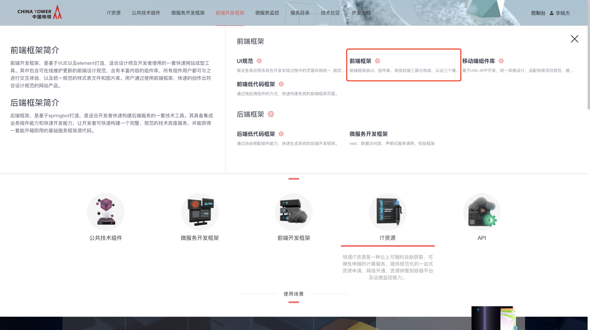
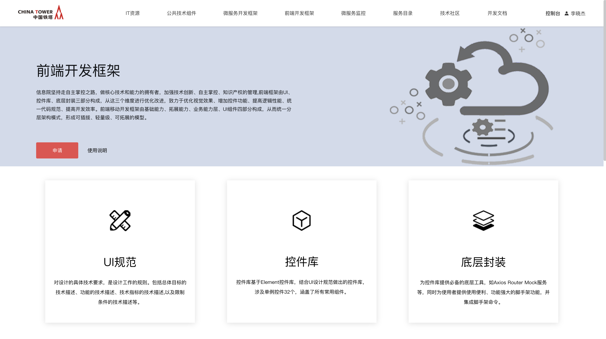
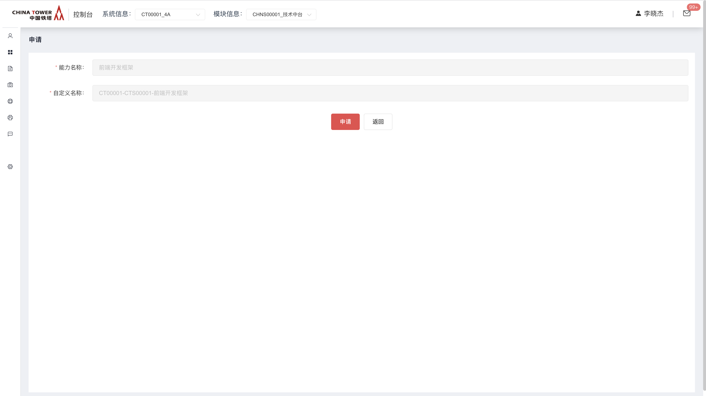
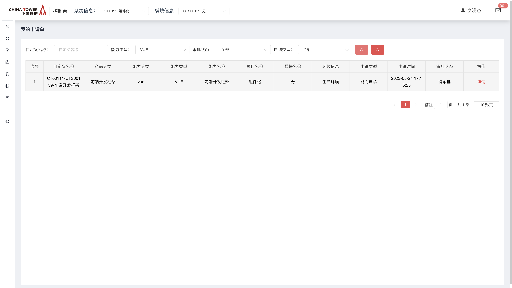
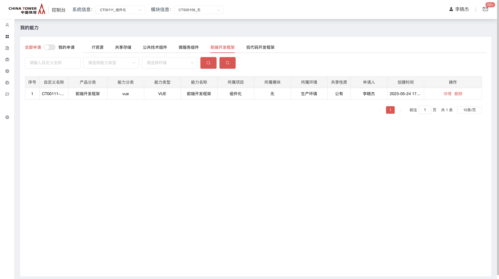
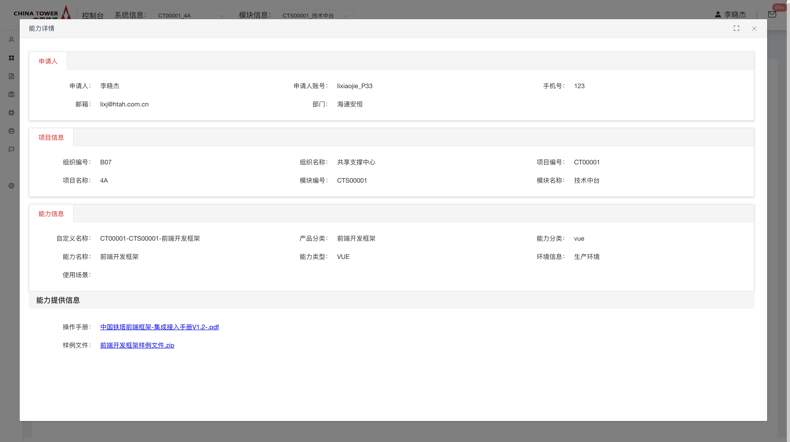
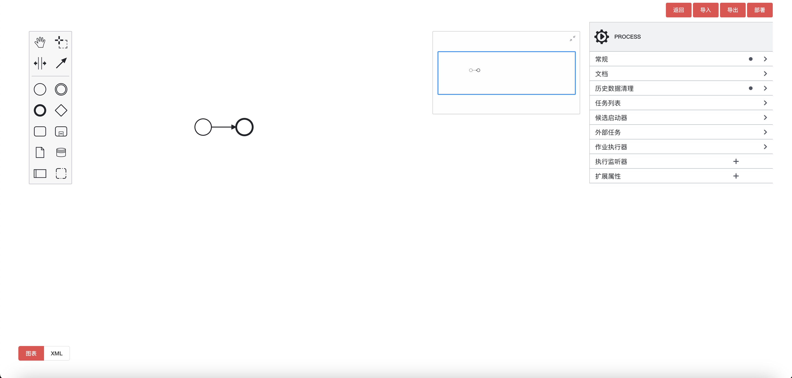
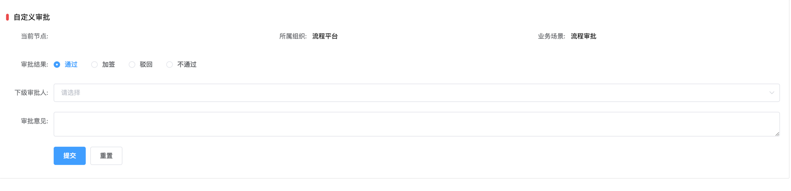
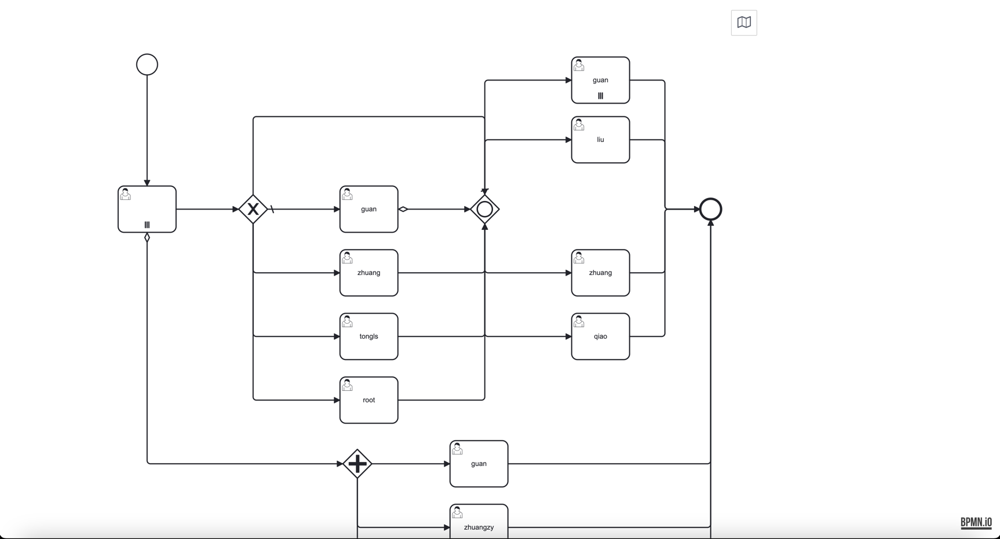
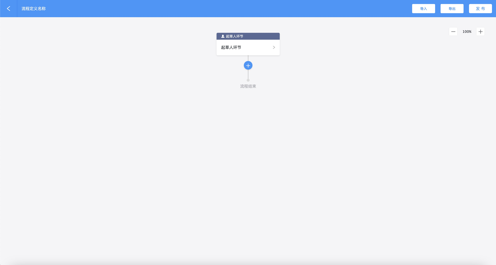

# 前端开发框架

前端框架为前端开发者提供了大量的基础控件和底层模块，基于vue+element的基础上结合UIUE设计规范升级改造而成，其组件样式、交互模式符合设计规范。

## 功能发布记录

| 发布时间 | 功能分类 | 功能名称 | 说明 |
| -------- | -------- | -------- | ---- |
| 2022-11  | 1.0.6    |          |      |

## 重要通知

原前端框架私服地址已停止使用，请打开SDP访问以下Nexus私服内网地址。无需登录，支持匿名访问。

- 源地址：http://10.38.77.5:8081/repository/npm-public/
- Web可视化地址：http://10.38.77.5:8081/#browse/browse:npm-public

## 组件描述

控件库基于Element-ui开发，在Element控件原有的功能上增加了符合铁塔业务的新功能。

## 快速入门

Ⅰ. 消费者点击开发框架，选择前端框架



Ⅱ. 进入前端框架海报页面，点击申请按钮。



Ⅲ. 进入申请页面，选择顶部系统信息，申请信息会自动补全，直接点击申请。



Ⅳ 申请后，联系技术中台运营人员，审批通过前端开发框架能力申请。 可在我的申请单，查询当前申请状态。



Ⅴ 审批通过后，可在我的能力→前端开发框架，找到已经通过的前端开发框架能力。



Ⅵ 点击详情，查看能力提供信息→样例文件，点击链接可下载样例文件。



## 典型实践

### 配置NPM铁塔私服

```bash
# 持久使⽤方式
npm config set registry http://10.38.77.5:8081/repository/npm-public/

# npm 源别名方式
npm install -g npmpublic --registry=http://10.38.77.5:8081/repository/npm-public/
```

### 配置使用组件库

```bash
npm install @ct/china-tower-ui@1.0.6
```

### 在main.js中引入ChinaTowerUI

```bash
import ChinaTowerUI from '@ct/china-tower-ui';

Vue.use(ChinaTowerUI);
```

### 下载依赖

1. 运行 `npm install`

### 项目打包

1. 运行 `npm build:prod`

### 项目部署

将项目打包后得到的dist文件上传到服务器/app/xxxxx/nginx/html

#### 修改nginx配置

```markdown
http {
    server {
      listen 8080;
      server_name localhost;
      location / {
        root   /app/xxxxx/nginx/html/dist;
        index  index.html;
      }
    }
}
```

#### 重加载nginx配置

nginx -s reload

## API参考

无

## SDK

无

## 网络要求

无

## 常见问题

无

## 样例文件

样例工程属于已搭建完成的项目，其中嵌入了demo页面、各类控件、底层模块（包括mock服务、动态router结合导航和面包屑、axios、指令等）。 优点：直接使用项目demo无需下载安装Element、铁塔控件库、底层功能模块等，只需切换铁塔npm源后执行npm install即可。

### 样例文件下载

- 申请前端框架能力后在我的能力详情页面下载
- 申请前端低代码框架后点击生成并下载源码

### 样例工程代码屏蔽

样例工程中存在一些文件，使用了NodeJs语法，与质量组Sonar扫描存在冲突，需要申请屏蔽。以下为屏蔽清单：

- src/store （vuex store 官方写法）
- src/plugs/axios（直接引用开源软件）
- src/libs/createRouter.js（直接引用开源软件）
- src/main.js（Nodejs正常导入包语法）
- src/permission.js（ Nodejs 正常箭头语法 ）
- src/utils/index.js（VUE属性官方挂载写法及事件监听）
- mock/mock-server.js（直接引用开源软件）
- mock/role.js（ Nodejs 正常箭头语法 ）


# 自研流程引擎

支持渲染流程引擎编辑器组件。

## 功能发布记录

| 版本  | 拟制/修改日期 | 拟制/修改人 | 修改记录                       | 批准人 |
| ----- | ------------- | ----------- | ------------------------------ | ------ |
| 0.0.5 | 2024/2/28     | 庄子义      | 编辑器参数调整，支持freeze参数 |        |
| 0.0.6 | 2024/3/4      | 庄子义      | 审批组件添加只读模式，用于回显 |        |
|       |               |             |                                |        |

## 安装

> [!NOTE]
>
> node版本应为14, copy-webpack-plugin用于将@ct/china-tower-bpm-engine内的静态文件映射到本地/static

```bash
npm install @ct/china-tower-bpm-engine@2.0.1 -registry http://10.38.77.5:8081/repository/npm-public
npm install copy-webpack-plugin@^6.4.1
```

## 组件引用

在main.js中引入组件，以及样式文件

```javascript
import CtBpmEngine from '@ct/china-tower-bpm-engine/dist/china-tower-bpm-engine.umd'
import '@ct/china-tower-bpm-engine/dist/china-tower-bpm-engine.css'

Vue.use(CtBpmEngine)
```

在vue.config.js中配置插件copy-webpack-plugin，用于静态文件映射

> [!NOTE]
>
> 也可以直接将@ct/china-tower-bpm-engine包内的fonts文件夹复制到本地项目public文件夹下。此处的目的是使静态资源可被访问,若无法访问,应根据访问地址,灵活更改映射目录。

```javascript
const { defineConfig } = require('@vue/cli-service')
const CopyWebpackPlugin = require('copy-webpack-plugin')
module.exports = defineConfig({
  configureWebpack: {
    plugins: [
      new CopyWebpackPlugin({
        patterns: [
          {
            from: 'node_modules/@ct/china-tower-bpm-engine/dist/fonts',
            to: './fonts',
            toType: 'dir'
          }
        ]
      })
    ]
  }
})
```

>[!NOTE]
>
>如果编译时出现ES6编译错误，可以添加babel配置进行转译。  `const { defineConfig } = require('@vue/cli-service') const CopyWebpackPlugin = require('copy-webpack-plugin') module.exports = defineConfig({  configureWebpack: {    module: {      rules: [        {          test: /china-tower-bpm-engine\.umd\.js$/,          use: 'babel-loader'        }      ]    }  } })`  
>
>如果编译时出现无法识别bpmn文件错误，可以使用raw-loader。 
>
> `npm install raw-loader`   `const { defineConfig } = require('@vue/cli-service') const CopyWebpackPlugin = require('copy-webpack-plugin') module.exports = defineConfig({  configureWebpack: {    module: {      rules: [        {          test: /\.bpmn$/,          use: [            {              loader: 'raw-loader'            }          ]        }      ]    }  } })`

## 用法

如App.vue 中渲染组件的initXML属性传入一个符合bpmn格式的字符串即可

```html
<template>
  <div id="app">
    <ct-bpmn-editor :init="this.init" />
  </div>
</template>

<script>
import initXML from './view/bpmn/initXML.bpmn'
export default {
  name: 'app',
  components: {},
  data() {
    return {
      init: {
        initXML: initXML
      },
    }
  },
}
</script>
```

/view/bpmn/initXML.bpmn 样例数据如下

```xml
<?xml version="1.0" encoding="UTF-8"?>
<bpmn:definitions xmlns:bpmn="http://www.omg.org/spec/BPMN/20100524/MODEL" xmlns:bpmndi="http://www.omg.org/spec/BPMN/20100524/DI" xmlns:dc="http://www.omg.org/spec/DD/20100524/DC" xmlns:camunda="http://camunda.org/schema/1.0/bpmn" id="Definitions_1" targetNamespace="http://bpmn.io/schema/bpmn" xmlns:modeler="http://camunda.org/schema/modeler/1.0" exporter="EXPORTER_NAME" exporterVersion="7.20.0" modeler:executionPlatform="Camunda Platform" modeler:executionPlatformVersion="7.20.0">
  <bpmn:process id="Process_1" isExecutable="true" camunda:historyTimeToLive="365">
  </bpmn:process>
  <bpmndi:BPMNDiagram id="BPMNDiagram_1">
    <bpmndi:BPMNPlane id="BPMNPlane_1" bpmnElement="Process_1">
    </bpmndi:BPMNPlane>
  </bpmndi:BPMNDiagram>
</bpmn:definitions>
```

## 网络配置

通过配置axios的baseURL控制接口前缀，以供代理 以下以/api/v1beta1为例

```javascript
Vue.prototype.$bpmEnginesAxios = axios.create({
  // 设置baseURL为'/api/v1beta1'
  baseURL: '/bpm/api/v1beta1'
})
```

此时组件内部所有接口为  /bpm/api/v1beta1/xxxx/xxxx

配置代理到后端sdk所在服务地址, 假设后端地址为10.180.22.99:8765，如此配置实际访问地址为 http://10.180.22.99:8765/api/v1beta1/xxxx/xxxx

>[!NOTE]
>
>建议使用中台 [Nginx组件私有版](http://mid.chinatowercom.cn:18080/docs/chinatower-component/v1.0/module/nginx.html)

```javascript
#user  nobody;
worker_processes 1;
#error_log  logs/error.log;
#error_log  logs/error.log  notice;
#error_log  logs/error.log  info;
#pid        logs/nginx.pid;
events {
  worker_connections 1024;
}

http {
  include mime.types;
  default_type application/octet-stream;
  #log_format  main  '$remote_addr - $remote_user [$time_local] "$request" '
  #                  '$status $body_bytes_sent "$http_referer" '
  #                  '"$http_user_agent" "$http_x_forwarded_for"';
  #access_log  logs/access.log  main;
  vhost_traffic_status_zone;
  sendfile on;
  #tcp_nopush     on;
  #keepalive_timeout  0;
  keepalive_timeout 65;
  #gzip  on;
  upstream bpmEngine {
    server 10.180.22.99:8765;
  }
  server {
    #AGENTCREATE;
    listen 8080;
    server_name localhost;
    #charset koi8-r;
    #access_log  logs/host.access.log  main;
    location /bpm {
        proxy_pass http://bpmEngine;
    }
  }
}
```

## 组件参数

### ct-bpmn-editor组件

封装有API的流程引擎编辑器



#### ct-bpmn-editor支持的参数

| 参数         | 说明                                                         | 类型   | 可选值 | 默认值                                                    |
| ------------ | ------------------------------------------------------------ | ------ | ------ | --------------------------------------------------------- |
| deploymentId | 根据部署ID，自动通过API获取XML                               | String | -      | -                                                         |
| init         | 包含组件初始化时的属性， initXML: 根据传入XML渲染流程，initDeployName: 默认部署名称，initTenantId: 默认组织id | Object | -      | {initXML: null, initDeployName: null, initTenantId: null} |
| visibility   | 包含组件内控件显隐, showTools: 是否展示右上角按钮组, showXML: 是否展示右下角展示XML按钮组 | Object | -      | {showTools: true, showXML: true}                          |
| freeze       | 可强制修改流程属性,processId: 流程唯一标识, processName: 流程名称 | Object | -      | {processId: null, processName: null}                      |

#### ct-bpmn-editor支持的事件

| 事件名称    | 说明           | 回调参数         |
| ----------- | -------------- | ---------------- |
| submit      | 执行提交       | function(xml)    |
| afterSubmit | 默认提交后执行 | function(result) |

#### ct-bpmn-editor支持的插槽

| 插槽名称 | 说明         |
| -------- | ------------ |
| tools    | 右上角按钮组 |

### ct-bpmn-modeler组件

基础的流程引擎编辑器，提供了只读，标记等基础功能。

#### ct-bpmn-modeler支持的参数

| 参数        | 说明                | 类型    | 可选值     | 默认值                                                       |
| ----------- | ------------------- | ------- | ---------- | ------------------------------------------------------------ |
| xml         | 根据传入XML渲染流程 | String  | -          | 默认的空流程                                                 |
| readonly    | 是否只读            | Boolean | true/false | true                                                         |
| instanceTag | 对任务进行标记      | Array   | -          | [], 例子: {id: "" // 任务id, instances: "" // 标记内容, tag: "" // 消息提示} |

### ct-bpmn-approval组件

流程引擎审批页面组件，提供了审批，加签，驳回，不通过，作废功能。



#### ct-bpmn-approval支持的参数

| 参数                  | 说明                                                         | 类型    | 可选值     | 默认值   |
| --------------------- | ------------------------------------------------------------ | ------- | ---------- | -------- |
| taskId                | 审批任务ID                                                   | String  | -          | 必填     |
| showTools             | 展示默认提交按钮                                             | Boolean | true/false | true     |
| businessDeleteVisible | 强制控制作废按钮是否显示,默认则根据是起草人节点显示，否则不显示 | Boolean | true/false | null     |
| base.org              | 用于组件显示所属组件值                                       | String  | -          | -        |
| base.business         | 用于组件显示业务场景属性值                                   | String  | -          | -        |
| base.formName         | 表单表头                                                     | String  | -          | 审批信息 |
| readonly              | 控制是否为只读模式                                           | Boolean | true/false | false    |
| showForm              | 显示表单                                                     | Boolean | true/false | false    |

#### ct-bpmn-approval支持的事件

| 事件名称    | 说明           | 回调参数         |
| ----------- | -------------- | ---------------- |
| submit      | 执行提交       | function(data)   |
| afterSubmit | 默认提交后执行 | function(result) |

#### ct-bpmn-approval支持的插槽

| 插槽名称 | 说明     |
| -------- | -------- |
| formItem | 表单行   |
| tools    | 表单按钮 |

#### ct-bpmn-approval支持的方法

|      | 使用ref调用 |
| ---- | ----------- |
|      |             |

| 方法名     | 说明         | 返回值 |
| ---------- | ------------ | ------ |
| submitForm | 提交当前表单 | -      |
| resetForm  | 重置表单     | -      |

### ct-bpmn-approval-history组件

流程引擎审批历史页面组件， 提供了审批历史表格，用于展示当前实例的所有审批记录。


#### ct-bpmn-approval-history支持的参数

| 参数              | 说明                                                         | 类型    | 可选值     | 默认值   |
| ----------------- | ------------------------------------------------------------ | ------- | ---------- | -------- |
| processInstanceId | 流程实例ID                                                   | String  | -          | 必填     |
| base.tableName    | 用于显示审批历史表头属性的值                                 | String  | -          | 审批历史 |
| showRefresh       | 显示默认刷新按钮                                             | Boolean | true/false | true     |
| data              | 审批历史的数据集，此项有值时，将不会触发使用processInstanceId的API | Object  | -          | -        |

#### ct-bpmn-approval-history支持的插槽

| 插槽名称              | 说明             |
| --------------------- | ---------------- |
| resultTableOperations | 表格操作按钮插槽 |
| tableItem             | 表格列插槽       |

#### ct-bpmn-approval-history支持的方法

|      | 使用ref调用 |
| ---- | ----------- |
|      |             |

| 方法名 | 说明         | 返回值 |
| ------ | ------------ | ------ |
| query  | 查询审批历史 | -      |

### ct-bpmn-approval-views组件

流程引擎审批流程图组件，用于展示当前审批流程的流程图。



#### ct-bpmn-approval-views支持的参数

| 参数              | 说明       | 类型   | 可选值 | 默认值 |
| ----------------- | ---------- | ------ | ------ | ------ |
| processInstanceId | 流程实例ID | String | -      | 必填   |

### ct-new-bpmn-editor组件

新版流程编辑组件。 

#### ct-new-bpmn-editor支持的参数

| 参数         | 说明                                                         | 类型   | 可选值 | 默认值                                                    |
| ------------ | ------------------------------------------------------------ | ------ | ------ | --------------------------------------------------------- |
| deploymentId | 根据部署ID，自动通过API获取XML                               | String | -      | -                                                         |
| init         | 包含组件初始化时的属性， initXML: 根据传入XML渲染流程，initDeployName: 默认部署名称，initTenantId: 默认组织id | Object | -      | {initXML: null, initDeployName: null, initTenantId: null} |

#### ct-new-bpmn-editor支持的事件

| 事件名称    | 说明           | 回调参数         |
| ----------- | -------------- | ---------------- |
| submit      | 执行提交       | function(xml)    |
| afterSubmit | 默认提交后执行 | function(result) |

## 样例文件