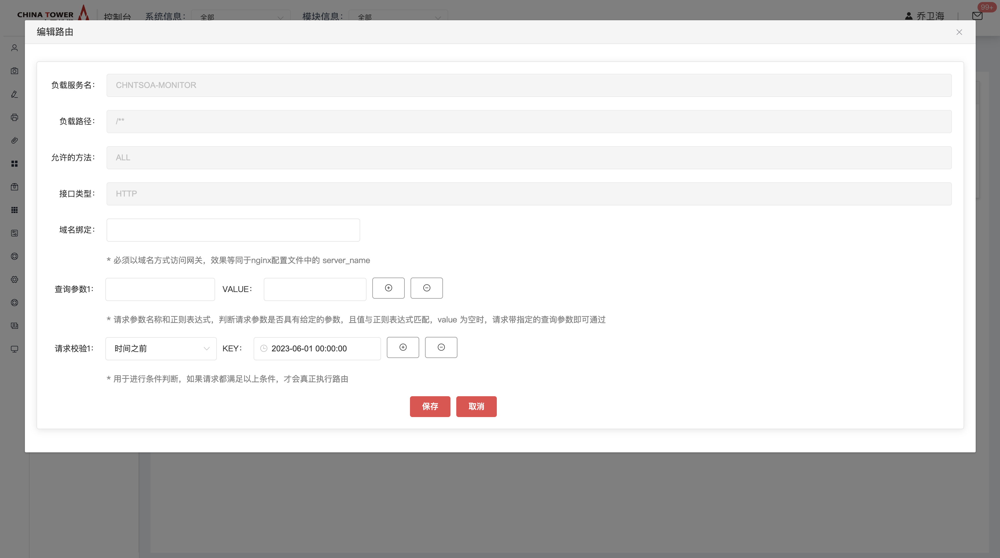
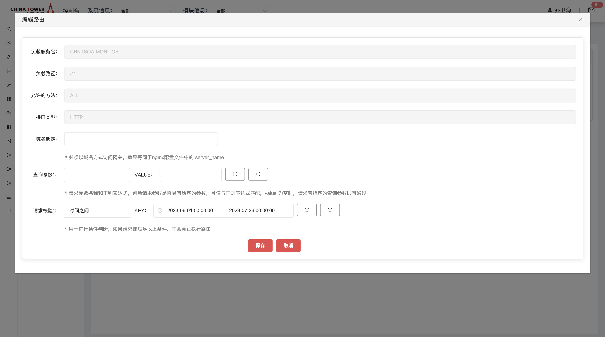

# API网关

开发框架提供微服务运行时支撑服务API网关，所有的外部客户端访问都需要经过它来进行调度和过滤，它提供了请求路由、负载均衡、校验过滤等功能。

## 功能发布记录

| 发布时间   | 功能分类 | 功能名称          | 说明                                                         |
| ---------- | -------- | ----------------- | ------------------------------------------------------------ |
| 2023-11-10 | 新特性   | 增加私有版本网关  | 私有版本网关使用简介请查看 [网关（私有版）](http://mid.chinatowercom.cn:18080/docs/chinatower-microservice-component/v1.0/module/gateway-private.html) |
| 2022-12-20 | 新特性   | 服务治理-网关入口 | 优化网关申请流程，新增网关入口模块和相关功能，参考[操作指南](http://mid.chinatowercom.cn:18080/docs/chinatower-microservice-component/v1.0/module/gateway.html#A90) |
| 2023-10-20 | 新特性   | 服务治理-网关入口 | 新增支持网关统计，网关链路追踪功能                           |

## 重要通知

>[!NOTE]
>
>2022-12-20网关支持动态路由功能，在此日期之后新增微服务需要申请网关能力，未申请网关能力的微服务，网关请求无法负载到业务微服务上

>[!IMPORTANT]
>
>生产环境接口最大并发数为5000，超过最大并发的请求将被丢弃，或影响服务正常使用。

>[!IMPORTANT]
>
>新接系统并发数建议不超过50，如果预估超过100请联系技术中台组。

## 组件描述

### 简介

API网关适用于微服务架构下的跨系统调用，不同系统的微服务之间，需要通过API网关进行接口调用，另外服务治理提供网关入口模块，可利用网关进行统一的动态路由、流量控制等相关管控

## 快速入门

### 组件申请

仅允许铁塔自有人员申请。能力申请负责将内部的微服务通过网关暴露， 如您仅是消费者，需要通过网关调用其他系统的微服务，请联系服务提供方进行服务暴露。网关调用请参考：[调用规范](http://mid.chinatowercom.cn:18080/docs/chinatower-microservice-component/v1.0/module/gateway.html#A88)章节。

消费者登录技术中台首页，选择微服务框架，点击API网关。


点击申请


如果需要某个服务的所有接口均可通过网关进行访问，则申请服务层级网关，申请服务层级的网关能力需要申请类型选择服务层级后填系统、模块、环境、服务名称


如果需要某个服务的指定某个接口通过网关进行访问，则申请接口层级网关，申请接口层级的网关能力需要申请类型选择接口层级后选填系统、模块、环境、服务名称、接口名称、请求方式


申请通过审批后，在我的能力里找到刚才申请的网关，点击控制台进入服务治理页面。


## 操作指南

登录技术中台后，选择“我的能力”左侧导航菜单，右侧主内容区域选择“微服务开发框架”，能力名称为"网关"，操作一栏选择“控制台”，则会跳转到服务治理页面。

在服务治理，网关入口页面，支持各种网关相关功能配置

### 动态路由

动态路由tab页面，展示此服务下所有路由基础信息，如负载地址、路由类型、接口类型、允许的方法和压缩


点击新增路由按钮可跳转至网关能力申请页面，申请服务级或者接口级路由，具体可参考[组件申请](http://mid.chinatowercom.cn:18080/docs/chinatower-microservice-component/v1.0/module/gateway.html#A89)


可对路由基础信息进行编辑操作，可修改域名绑定、查询参数和请求校验参数


可对路由添加Host覆盖配置，可填写域名(**.anotherhost.org)，必须以域名方式访问网关，效果等同于nginx配置文件中的 server_name；


可对路由添加查询参数配置，若只填写一个参数，配置后需要在请求中添加key为指定内容的查询参数；若填写两个参数，则需要在请求中添加key和value为指定内容的查询参数


可对路由添加请求校验配置，配置后当且仅当满足条件时，才会转发到下游


可对路由添加开始时间校验功能，当且仅当请求时的时间在配置的时间之前时，才会转发到下游；



可对路由添加结束时间校验功能，当且仅当请求时的时间在配置的时间之后时，才会转发到下游；


可对路由添加开始到结束间校验功能，当且仅当请求时的时间在配置的时间之间时，才会转发到下游。



可查看对路由基础信息的修改历史


### 策略配置

点击"策略配置"tab，可查看路由策略配置详情


策略配置页面可对路由配置进行修改操作；


可对路由添加参数追加配置，分别为连接超时时间和响应超时时间，单位为毫秒；


路由策略可选择添加请求头、删除请求头、添加响应头、删除响应头和路径重写参数，在命中此路由的所有请求，都会增加请求头部信息，并将请求头传递到下游


可对路由添加路径重写配置，采用路径正则表达式参数和替换参数，对于指定的请求路径，会在发出下游请求之前将路径设置为指定路径；


可对路由添加是否禁用跨域配置，在网关层会默认对路由开启跨域配置，若选择是，则为禁用跨域配置，若选择否，则为开启跨域配置


### 安全防护


在"安全防护"tab页，可根据需求，对各项进行编辑


- ip白名单/黑名单：对http请求中请求方的ip进行白名单和黑名单配置
- ua白名单/黑名单：对http请求中的User-Agent请求头进行白名单和黑名单配置
- referer白名单/黑名单：对http请求中的来源referer请求头进行白名单和黑名单配置
- host白名单/黑名单：对http请求中的Host请求头进行白名单和黑名单配置

### 网关流控

在"网关流控"tab页，进行流控规则配置


新增或编辑流控规则，可控制整个服务级别或接口级别最大访问QPS（每秒请求数），如下图


### 流控监控

在服务治理页面，左侧菜单选择网关入口，右侧主内容区域tab选择“流控监控”即可到达监控功能


### 网关统计

网关统计功能，记录了网关侧转发请求的统计信息，如：请求数、成功率等，便于了解网关实际运行情况

**1)  查看网关入口-网关统计信息**
 1.登录技术中台，跳转到控制台后，左侧选择服务治理菜单，选择特定服务后，进入该服务的治理首页。

2.选择”网关入口“菜单，切换到”网关统计“tab，则可查看网关统计信息，默认是当前服务的统计数据


点击”查看系统“按钮，则查看的数据是当前服务所在系统的汇总数据，同时”查看系统“按钮变为”查看服务“


**2）查看网关控制台-网关统计信息**

如果是运营者账号，则还可以在”共有能力控制台“→”网关控制台“，查看更多更全面的网关统计信息
 1.登录技术中台，跳转到控制台后，左侧选择共有能力控制台，选择”Gateway网关“并点击控制台按钮，打开网关控制台

2.左侧选择”网关统计“子菜单，可以按日期查看按系统的网关统计列表信息


点击”图表“按钮，则以图表形式查看，如下图：


### 链路追踪

若外部系统通过微服务网关请求服务接口，则网关侧会记录被请求服务的链路追踪信息，将请求的上下游信息记录并展示，辅助业务系统进行问题已排查、定位。

>[!IMPORTANT]
>
>业务系统需接入铁塔apm agent，才能看到更完整、更全面的链路追踪信息。

**1）查看网关链路追踪请求汇总信息**

1.击登录技术中台，跳转到控制台后，左侧选择服务治理菜单，选择特定服务后，进入该服务的治理首页。

2.选择”网关入口“菜单，切换到”链路追踪“tab，则可查看链路追踪信息


**2）查看请求明细**
 点击列表的”请求地址“，则会弹出该url在所选时间段内的请求明细，如下图：


**3）查看请求链路**
 点击操作栏”查看“，则可以查看该请求的链路追踪信息，如：调用堆栈、时序图等，如下图：


若被请求的下游微服务，未接入apm，则堆栈树、时序图、拓扑图，展示的信息较少，如：


请求时序图信息，如下图：


## 典型实践

### 调用规范

API网关为服务调用的统一入口，对于后台服务请求需经过网关。调用示例如下： `http://ip:port/{service_name}/{resources_path}`

- ip:port：为网关服务地址
- service_name:服务名，大写
- resources_path：资源路径

### 鉴权

浏览器端每次请求，需在请求头中添加参数网关获取到去4A进行鉴权，鉴权通过放行，不通过返回401。

| 标签         | 说明                                                       | 数据类型 | 长度 |
| ------------ | ---------------------------------------------------------- | -------- | ---- |
| APPID        | 系统的应用标识，由4A统一分配，详细见附录                   | String   | 16   |
| APPUUID      | 申请系统产生的唯一字符串，每次申请都需要重新产生一个       | String   | 64   |
| APPUUIDCRPT  | 采用申请系统密钥对APPUUID进行加密的值，采用DES加解密算法。 | String   | 256  |
| ACCESSIPADDR | 访问来源IP                                                 | String   | 32   |

>[!NOTE]
>
>校验参数请与4A系统进行联系并联调测试。

>[!NOTE]
>
>秘钥校验通过且对资源路径具有访问权限，放行。 秘钥校验失败或对资源路径不具有权限，拒绝服务调用，并给出没有权限的提示(401)。

## API参考

无

## SDK

无

## 网络要求

### 网络架构图

微服务网关目前的定位为跨系统之间的服务调用。不直接承载前端请求。详情可参见微服务开发规范。


### 网络打通

- 单向打通业务微服务到网关F5内网地址的网络。
- 单向打通网关各节点到业务微服务的地址。

## 常见问题

### 网关的网络打通规则

1. 如果是被调用方，需打通网关到被调用服务的ip+端口
2. 如果是调用方，需打通服务到网关的ip+端口
3. 既是调用方也是服务方需要双向打通ip+端口

### 通过网关调用其他服务500报错

#### 1. 判断是否为网关报错

① 检查feignclient url为各个环境网关的地址


② 检查返回报文格式。注意: 网关报错返回报文requestId字段一定存在，若无此字段则 不是网关返回报错，直接找被调方微服务负责人员。


#### 2. 检查网络

若经过上面步骤确定是调用的网关，下一步检查是否按要求打通了网关和业务微服务之间的网络，具体网络打通方法在”技术中台“→”我的能力“，网关能力详情页面可以查看

#### 3. 如何查询网关交互日志

若已确认网络正确打通，则需要查询网关侧日志，查询方法如下：

假设我们想要查找2024-05-09 12:57:34的一条500报错日志，只需按以下步骤操作：

① 进入网关交互日志存放位置

```shell
  cd /app/logs/chntjszt-wfwkj/chinatower-api-gateway/8097
```

② 根据日期筛选2024-05-09当天所有交互日志压缩文件

```shell
  ls -lth transaction-2024-05-09.*
```


③ 根据日志文件时间可知要找的日志在12:55到13:07之间


④ zgrep命令搜索具体zip文件，关键字一般为接口名称

```shell
  zgrep '关键字' transaction-2024-05-09.114.zip
```


⑤ 最后根据日志中的date，即可找到目标日志  交互日志为json格式，请求与响应成对出现，同一对请求与响应xb3TraceId和xb3SpanId字段相同，且系统日志中也包含这两个值


#### 4. 查询系统日志

如需获取更多日志信息，可根据如下方法获取系统日志： ① 进入系统日志存放位置

```shell
  cd /app/logs/10.1004
```

② 根据交互日志中的xb3TraceId查询对应系统日志

```shell
  zgrep '320842cc0e3ef7a1' system-2024-05-09-12.1.zip
```


### 请求网关无响应

问题如图：


这种情况看响应header，若token is unavailable，找4A


### 通过网关调其他服务调不通

先自行排出服务到网关网络是否通（方法：telnet 网关ip 端口），如果是通的在联系被调用方是否已打通网关到被调用方服务的网络，如不确定再联系运维人员配合核查

### 微服务网关是否支持文件上传？

不支持，微服务网关目前的定位是跨系统间的接口调用。

### 与注册中心的区别

注册中心只记录服务名与实例的清单信息，并不实际承载业务流量。


### 网关调用接口时好时坏

核查是否自己本地起服注册到注册中心了

### 通过网关调用404

1. 检查目标微服务是否已申请网关能力
2. 直连目标微服务地址测试是否OK

### 套装类软件如何通过网关对接4A系统？

1. 申请Nacos注册中心能力，并查看Nacos注册中心开发文档中关于 [套装类软件如何集成](http://mid.chinatowercom.cn:18080/docs/chinatower-microservice-component/v1.0/module/nacos-discovery.html#taozhuan-nacos) 章节的说明。
2. 申请网关能力
3. 查看涉及组件的能力详情页面，根据能力详情进行网络打通。

## 运维常见问题

### 查询网关日志

为排查相关问题，需要查询网关侧的日志，网关日志分为网关交互日志和网关系统日志两种。

- 交互日志：1：业务微服务A请求网关→2：网关请求下游被调微服务B→3：网关接收被调微服务B的响应→4：网关返回响应信息给业务微服务A， 交互日志会记录1和3步骤的请求与响应详情，如：url、参数、响应体等
- 系统日志：网关内部自己产生的日志，可能对排查问题有所帮助，如：500错误时查询异常信息

#### 通过技术中台页面查询交互日志

具体操作方法，请参考：[服务日志](http://mid.chinatowercom.cn:18080/docs/chinatower-framework/v1.0/module/soa-detail/log.html) 页面，搜索"网关日志"

>[!NOTE]
>
>微服务网关虚机5实例，caas 1实例，目前网关日志不包含caas网关实例产生的日志

#### 通过命令查询原始日志

**1 查询方法**

登录到虚拟机或者caas平台pod中，日志路径如下：

- 交互日志：/app/logs/chntjszt-wfwkj/chinatower-api-gateway/8097/transaction.log
- 系统日志：/app/logs/10.1004/system.log（如果不在这个目录则应该在/app/logs/chntjszt-wfwkj/chinatower-api-gateway/8097/service.log）

日志会切割和压缩为zip，如果想要搜索历史日志，可使用zgrep命令(和grep用法一样，但支持zip文件)

例：搜索某一天所有历史交互日志，查找特定关键字

```shell
zgrep '关键字' /app/logs/chntjszt-wfwkj/chinatower-api-gateway/8097/transaction-2024-02-04*
```

**2 traceId的用法**

交互日志为json格式，请求与响应成对出现，同一对请求与响应xb3TraceId字段相同，同时xb3TraceId与系统日志中traceId相同，红色为系统日志的traceId


>[!IMPORTANT]
>
>1. 可根据traceId从系统日志和交互日志查询出一个请求经过网关产生的所有日志，便于问题定位  
>2. 若使用curl -v 选项向网关发送测试请求，或者请求网关的业务系统记录下网关返回的请求头，网关会返回gw-req-traceid响应头，和网关侧日志的traceId是一致的，可用于快速定位一个请求相关的日志


## 样例文件

无