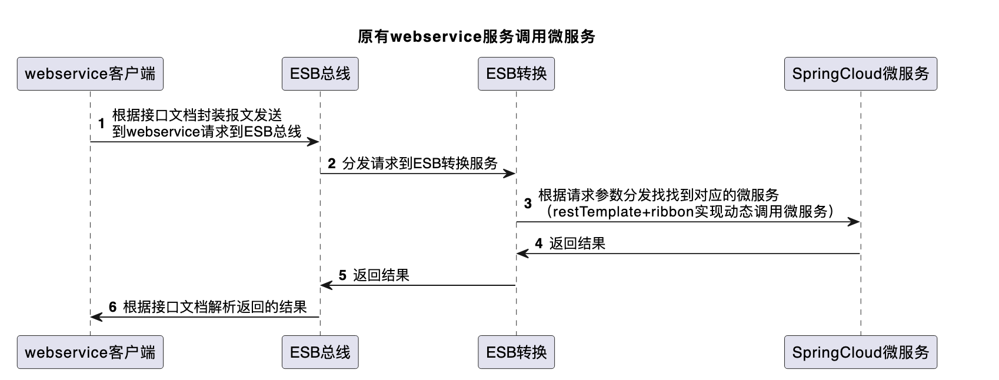
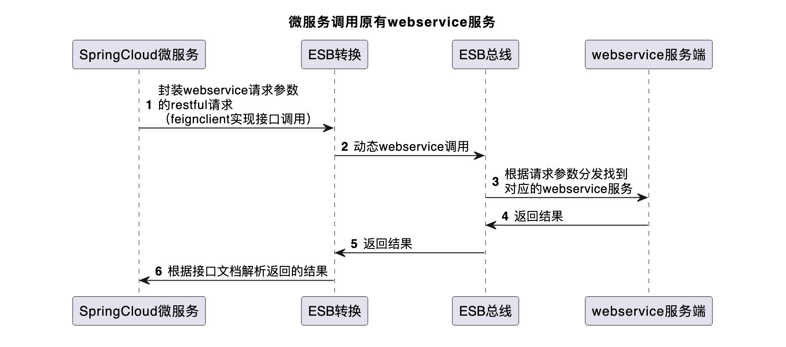
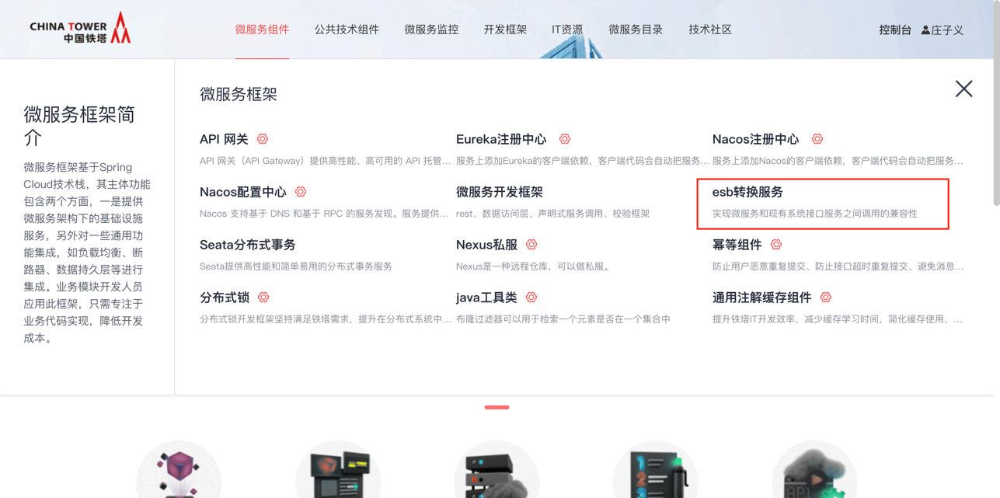
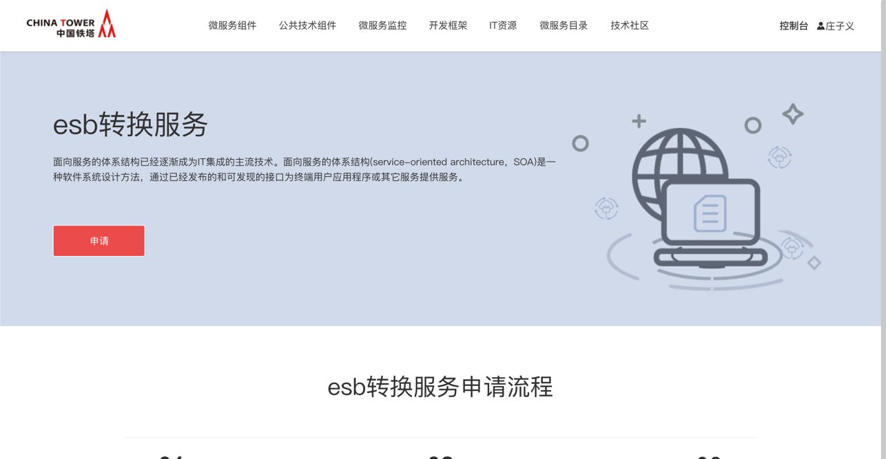
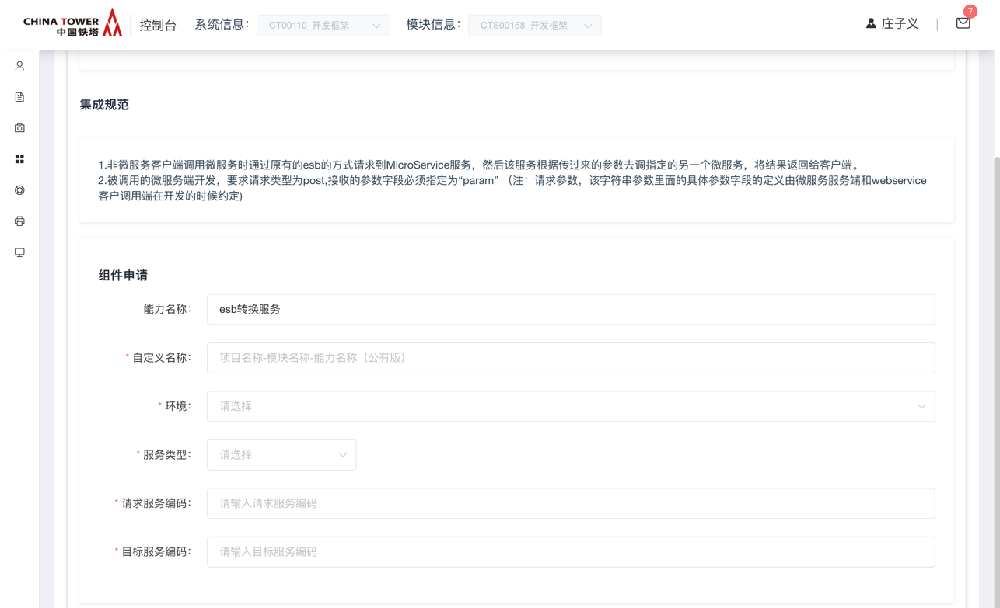
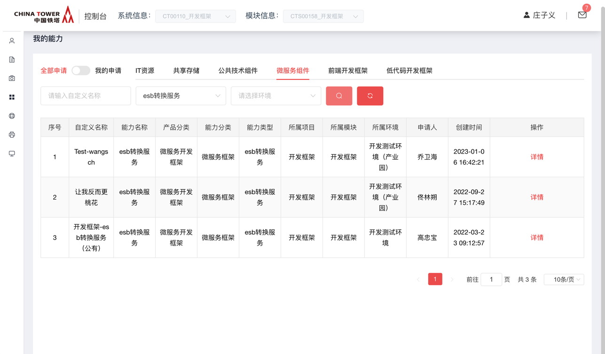

# ESB转换服务

原有系统是通过企业总线ESB进行webservice调用，所有系统之间的调用都要通过ESB总线。而新改造的系统通过springcloud微服务开发实现，服务之间的调用是全新的调用方式。为实现微服务和现有系统接口服务之间调用的兼容性，开发此ESB转换服务。

## 功能发布记录

| 发布时间   | 功能分类 | 功能名称                | 说明                                                         |
| ---------- | -------- | ----------------------- | ------------------------------------------------------------ |
| 2023-03-16 | 功能优化 | ESB转换服务超时时间优化 | webservice服务调用微服务时，ESB转换服务连接被请求的微服务超时时间改为：5000毫秒 |

## 重要通知

|      | 生产环境接口最大并发数为2000，超过最大并发的请求将被丢弃，或影响服务正常使用。 |
| ---- | ------------------------------------------------------------ |
|      |                                                              |

|      | 新接系统并发数建议不超过50，如果预估超过100请联系技术中台组。 |
| ---- | ------------------------------------------------------------ |
|      |                                                              |

## 组件描述

### 原有webservice服务调用微服务



该服务提供webservice的接口并在ESB上注册供原有系统进行接口调用。原有系统要调用微服务的服务时，先按照接口文档传入要调用的的微服务服务信息，然后还按原来的webservice调用方式调用即可，该服务解析传过来的参数，再去动态调用参数中指定的微服务，然后返回结果给webservice调用端。

### 微服务调用原有webservice服务



微服务端封装要调用的webservice服务端的必要参数，然后调用ESB转换服务，ESB转换服务根据参数，动态webservice调用发请求给ESB总线，然后ESB分发到相应的接口，调用该接口并返回接口。

## 快速入门

### 组件申请

消费者登录技术中台首页，选择微服务框架，点击esb转换服务。



点击申请



根据提示，输入名称，选择对应的环境，服务类型根据己方所属的架构进行勾选，请求服务编码和目标服务编码分别为各系统在ESB总线申请的esb系统编码（类似 10.1001格式）。



运营管理员审批通过后，在我的能力后输入正确的筛选条件，即可看到刚申请的能力。



点击详情按钮，即可看到各环境的能力地址。

## 操作指南

### 消费者控制台

无

## 典型实践

- 微服务调用webservice，微服务feign调用esb-service服务。
- webservice调用微服务，webservice通过esb总线调用微服务。

## API参考

### Webservice客户端调用微服务

#### Webservice客户端开发

服务名称：MicroService （10.1004.MicroService）

WSDL地址：`http://10.180.22.14:9080/services/MicroService?wsdl`（IDC测试环境内网地址）

服务描述：非微服务客户端调用微服务的服务时通过原来的走esb的方式请求到MicroService该服务，然后该服务根据传过来的参数去调指定的另一个微服务，然后返回结果给客户端。

输入（json格式） 入参节点名称：info

| 序号 | 要求 | 字段名称 | 字段描述               | 数据类型 | 备注                                                         |
| ---- | ---- | -------- | ---------------------- | -------- | ------------------------------------------------------------ |
| 1.   | Y    | url      | 要调用的微服务接口地址 | String   | 调用微服务接口的url地址如:”CMS-BUSINESS/test” “CMS-BUSINESS”为微服务注册在注册中心上的服务实例名。该名称必须要跟其完全一致，包括大小写。一般都是全部为大写 |
| 2.   | Y    | param    | 请求参数               | String   | 请求参数，该字符串参数里面的具体参数字段的定义由微服务服务端和webservice客户调用端在开发的时候约定 |

发送报文

```xml
<soap:Envelope>
  <soap:Header>
      <Esb xmlns="http://tempuri.org/">
         <Route>
            <Sender>XXXX</Sender>
            <Time>2015-04-13 13:00:15.410</Time>
            <ServCode>XXXXX.xxxxxxx</ServCode>
            <MsgId>XX_XXXXXXXXXXX</MsgId>
         </Route>
      </Esb>
   </soap:Header>
   <soap:Body>
      <MicroService>
        <info>{'url':'CMS-BUSINESS/test','param':'接口两端开发约定的数据'}</info>
      </MicroService>
   </soap:Body>
</soap:Envelope>
```

输出（json格式）

| 序号 | 要求 | 字段名称 | 字段描述        | 数据类型 | 备注                                                         |
| ---- | ---- | -------- | --------------- | -------- | ------------------------------------------------------------ |
| 1.   | Y    | status   | 0：成功 1：失败 | int      | 返回结果状态标识                                             |
| 2.   | Y    | result   |                 | String   | 返回接口调用的结果，该结果的字段内容由接口两端开发时具体约定 |
| 3.   | Y    | message  |                 | String   | 返回消息                                                     |

响应报文

```xml
<soap:Envelope xmlns:soap="http://schemas.xmlsoap.org/soap/envelope/">
    <soap:Body>
        <ns2:MicroServiceResponse>
            <return>{"result":"'接口两端开发约定的结果数据","message":"调用成功","status":0}</return>
        </ns2:MicroServiceResponse>
    </soap:Body>
</soap:Envelope>
```

#### 微服务端开发

被调用的微服务端开发，要求请求类型为post,接收的参数字段必须指定为”param” （注：请求参数，该字符串参数里面的具体参数字段的定义由微服务服务端和webservice客户调用端在开发的时候约定)

代码示例如下：

```java
@PostMapping("/test")
public String test(String param) {
    //具体的接口实现代码
    return "测试通过esb webservice 调用springcloud微服务"+param;
}
```

### 微服务调用原有webservice服务功能开发

服务实例名称：ESB-SERVICE

请求地址：/common/invoke

请求方式：post

请求参数：InterfaceInfo

调用代码示例：

```java
@FeignClient(name="esb-service")
public interface EsbServiceClient {
    @PostMapping("/common/invoke")
    public String invoke(@RequestBody InterfaceInfo interfaceInfo);
}
public class InterfaceInfo {
    //服务命名空间 如果调用的接口必须要指定命名空间，则该字段不能为空
    private String servNamespace;
    //发送方编码 例：CRM系统为发送调用方，编码为10.1001
    private String sender;
    //服务编码 例：要调用4A系统的接口，编码为40.4007
    private String servCode;
    //服务名称
    private String servName;
    //参数名称 接口定义的参数名称，因为参数的个数不确定，所以采用
    //数组 例：大部分接口定义的参数名称都是info或者RequestInfo那么
    //就赋值为{“info”}或者{“ResquestInfo”}，如果有两个参数则形如：{args1,args2}
    private String[] paramName;
    //请求信息
    //跟参数名称paramName必须是一一对应
    private String[] reqMsg;
    //参数上是否需要命名空间，如果需要可以指定为字符串”true”,如果不需要不用赋值
    private String isRequiredNamepace;
}
```

注：请求体放在InterfaceInfo 类的reqMsg字段中，具体的请求体报文需调用端封装。

返回结果在RespResult 的result字段中，具体的解析还是按原来的接口文档中定义的字段解析

示例：

1.4A 统一凭证申请&校验接口 请求参数：

```json
{
  "paramName": ["RequestInfo"],
  "reqMsg": ["<REQUEST><HEAD><CODE></CODE><SID></SID><TIMESTAMP>20180411175354</TIMESTAMP><SERVICEID>CHNTLMS</SERVICEID></HEAD><BODY><LOGINACCT>liuhw3</LOGINACCT></BODY></REQUEST>"],
  "sender": "20.2008",
  "servCode": "40.4007",
  "servName": "CreateAiuapTokenSoap",
  "servNamespace": "http://crm.server.inter.tower.com/"
}
```

响应结果：

```json
{
  "status": 0,
  "message": null,
  "result": "<?xml version='1.0' encoding='UTF-8'?><USERRSP><HEAD><CODE>000</CODE><SID>000</SID><TIMESTAMP>20180427104347</TIMESTAMP><SERVICEID>CHNTLMS</SERVICEID></HEAD><BODY><RSP>0</RSP><APPACCTID>2009441096</APPACCTID><TOKEN>32|19|69|-44|64|-56|43|111|-6|66|-18|104|-49|31|87|-53|-6|97|34|7|-5|126|-51|-123|-83|22|-49|50|-1|-5|86|-64|89</TOKEN></BODY></USERRSP>"
}
```

请求参数：

2.业务推送接口（PushService）

```json
{
    "paramName": ["info"],
    "reqMsg": ["[{'CARRIER':'1003','CITYID':'230100','COUNTYID':'230112','CUSTOMER_ID':'100000374','INFO':'','LATITUDE':'26.870567','LOGIN_ID':'1','LONGITUDE':'126.870567','MAKE_REQ_TIME':'2016-12-19 00:00:00','MERGE_ORDER':'2301127000002021561','Out_check_date':'2017-02-24 00:00:00.0','PROJECTS_CODE':'16A09HLHE216271','PROVINCE':'230000','REQUEST_ID':'1016121902597170','REQ_CODE':'ORDER_01','SCENE':'04','SITE_NAME':'测试接口添加两个字段','TRADE_TYPE':'07','BUILT_TYPE':'','IS_SHARESITE':''}]"],
    "sender": "10.1001",
    "servCode": "30.3005",
    "servName": "PushService",
    "servNamespace": "http://crm.server.inter.tower.com/"
}
```

响应结果：

```json
{
    "status": 0,
    "message": null,
    "result": "{\"RESP_CODE\":\"0000\",\"RESP_DESC\":\" \"}"
}
```

3. 请求参数：

```json
{
    "paramName": ["interfaceName","jsonValue"],
    "reqMsg":  ["ReceiveWLDWInfo","{'MDMWLDW_DWBH':'LN20180301002','MDMWLDW_SH':'123111','MDMWLDW_YYZZ':'','CreateTime':'2018-03-01 10:13:45','MDMWLDW_ZZDM':'123121414566','Modify_flag':'1','CreateUser':'58230','IsHistory':'0','IFOWNER':'','MDMWLDW_LBNM':'0601','MDMWLDW_NOTE':'','MDMWLDW_DWMC':'山东广电科技有限公司','MDMWLDW_SSGS':'410000','AUDITSTATE':'','LastMdifiedUser':'58230','LastModifiedTime':'2018-03-06 16:44:25','MDMWLDW_NATION':'156','MDMWLDW_LYBZ':'CHNTNBDS','MDMWLDW_ORGIN':'210200','IFCUSTOM':'1','MDMWLDW_SFZH':'','IFVENDOR':'','IFSERVER':''}"],
    "sender": "30.3014",
    "servCode": "60.6001",
    "isRequiredNamepace":"true",
    "servName": "MDMInterfaceJson",
    "servNamespace": "http://tempuri.org/"
}
```

响应结果：

```json
{
    "status": 0,
    "message": null,
    "result": "{\"ReturnCode\":\"MDM000\",\"ReturnMsg\":\"执行成功。影响行数：1\",\"ReturnValue\":[]}"
}
```

## SDK

无

## 网络要求

- 微服务是服务端时，打通esb-service服务到业务微服务的单向网络。
- 微服务是客户端时，打通业务微服务到esb-service服务的单向网络。

## 常见问题

无

## 样例文件

无