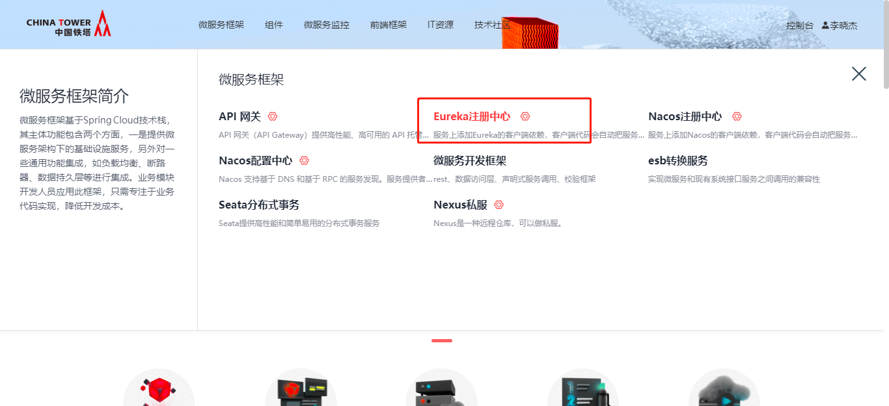
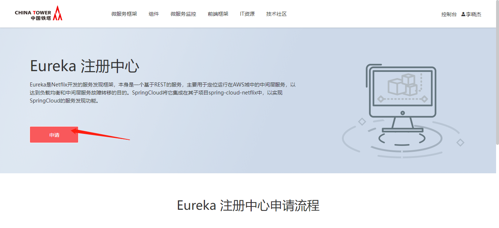
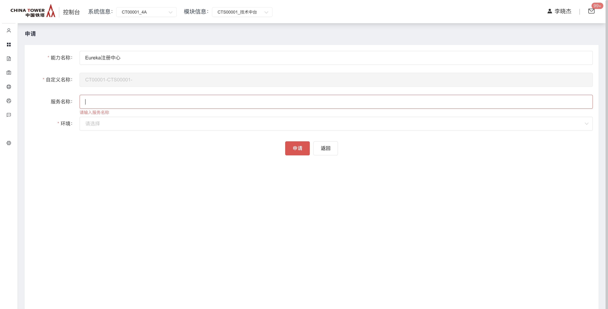
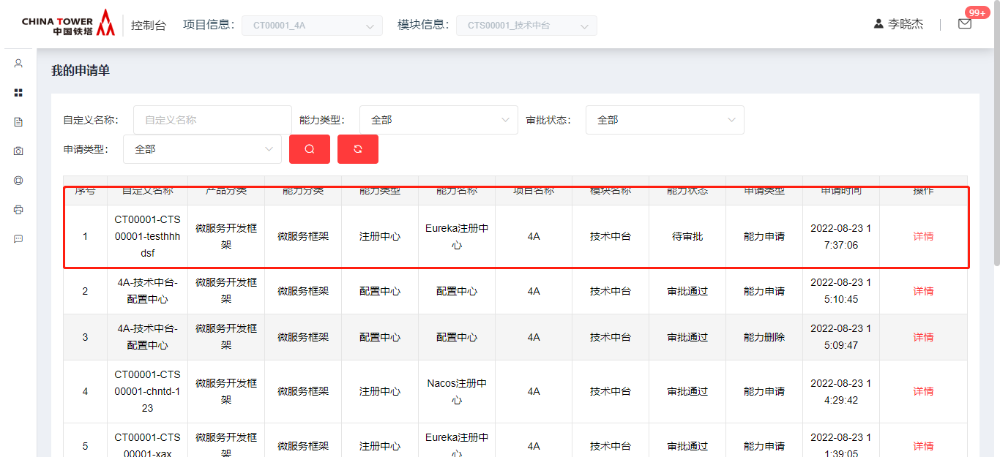
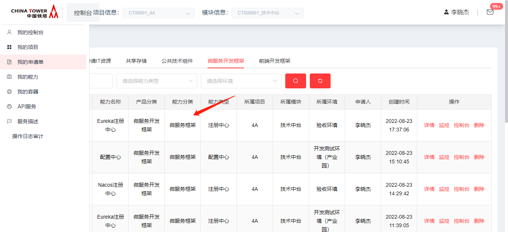
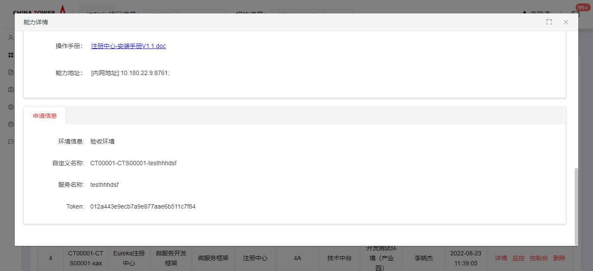
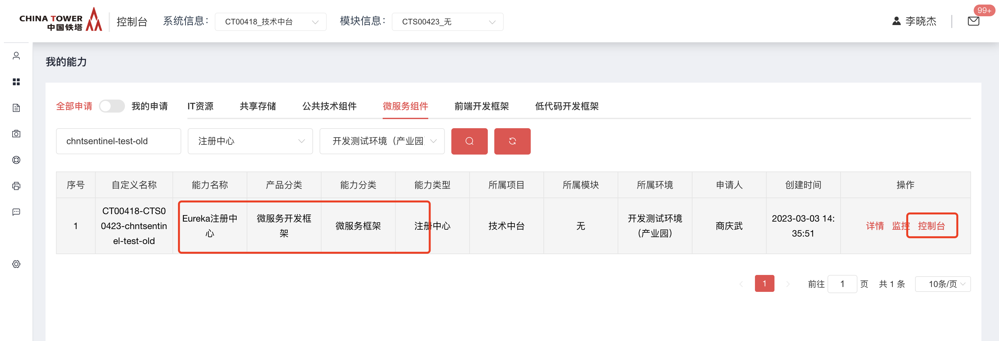
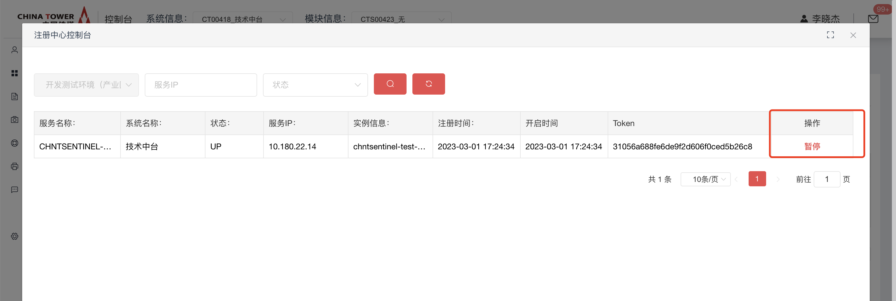
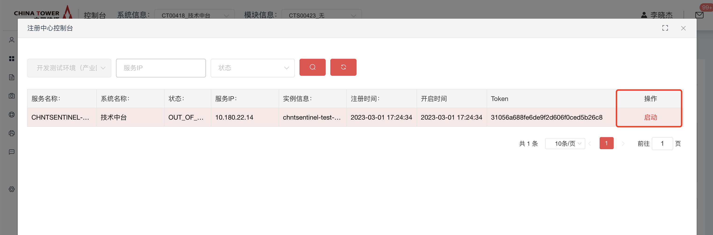

# Eureka注册中心

Eureka是Netflix开发的服务发现框架，本身是一个基于REST的服务，主要用于定位运行在AWS域中的中间层服务，以达到负载均衡和中间层服务故障转移的目的。SpringCloud将它集成在其子项目spring-cloud-netflix中，以实现SpringCloud的服务发现功能

|      | Eureka注册中心后期会停止申请。 |
| ---- | ------------------------------ |
|      |                                |

## 开源版本说明

| 版本名                      | 版本    | 说明 |
| --------------------------- | ------- | ---- |
| eureka-client               | 1.10.17 |      |
| spring-cloud-netflix-eureka | 3.1.5   |      |

## 功能发布记录

| 发布时间   | 功能分类 | 功能名称                               | 说明                                                         |
| ---------- | -------- | -------------------------------------- | ------------------------------------------------------------ |
| 2023-05-06 | 功能优化 | 提供新版本SDK，支持Spring Cloud 2021   |                                                              |
| 2023-02-14 | 功能优化 | Eureka注册中心，加强注册字段规范性检验 | 对实例注册的配置信息进行规范检测，如：对instance-id格式校验，具体参考[典型实践](http://mid.chinatowercom.cn:18080/docs/chinatower-microservice-component/v1.0/module/eureka-discovery.html#A01)部分 |

## 重要通知

新系统和微服务，推荐使用Nacos注册中心，Eureka注册中心后期会停止申请。

>[!NOTE]
>
>生产环境接口最大并发数为2000，超过最大并发的请求将被丢弃，或影响服务正常使用。

>[!NOTE]
>
>新接系统并发数建议不超过50，如果预估超过100请联系技术中台组。

## 组件描述

服务发现是微服务架构体系中最关键的组件之一。如果尝试着用手动的方式来给每一个客户端来配置所有服务提供者的服务列表是一件非常困难的事，而且也不利于 服务的动态扩缩容。Eureka Discovery 可以帮助您将服务自动注册到 Eureka 服务端并且能够动态感知和刷新某个服务实例的服务列表。除此之外，Eureka Discovery 也将服务实例自身的一些元数据信息-例如 host，port, 健康检查URL，主页等内容注册到 Eureka。

## 快速入门

### 组件申请

Ⅰ. 使用消费者账号登录，鼠标移动到上方微服务框架，点击Eureka注册中心。



Ⅱ. 进入Eureka注册中心海报页面，点击申请按钮。



Ⅲ.  进入申请页面，输入服务名称（注意，此处服务名唯一且应与服务配置文件中spring.application.name保持一致。要求格式为英文小写，-,数字,并以chnt开头，最大字符长度为50,且应符合 ${主数据系统下发的系统编码}-${服务名规范} ），勾选环境，点击申请。



Ⅳ 申请后，应联系相应职能人员，审批通过注册中心能力申请。 可在我的申请单，查询当前申请状态。



Ⅴ 审批通过后，可在我的能力-》微服务开发框架，找到已经通过的Eureka注册中心能力。



Ⅵ 点击详情，查看已获得的Token



## 操作指南

消费者登录技术中台后，在我的能力中找到Eureka注册中心，点击"控制台"可查看当前服务下的的具体实例情况



对特定实例进行"暂停"操作，则后续请求不会请求到该实例



对特定实例进行"启动"操作，则该实例可以正常处理请求



## 典型实践

如果要在您的项目中使用 Eureka 来实现服务注册，使用 group ID 为 `com.chinatower.framework.cloud` 和 artifact ID 为 `chinatower-cloud-basis-starter` 的 starter。 以下步骤向您展示了如何将一个服务注册到 Eureka。

- pom.xml的配置示例：

pom.xml

```xml
<?xml version="1.0" encoding="UTF-8"?>
<project xmlns="http://maven.apache.org/POM/4.0.0"
         xmlns:xsi="http://www.w3.org/2001/XMLSchema-instance"
         xsi:schemaLocation="http://maven.apache.org/POM/4.0.0 http://maven.apache.org/xsd/maven-4.0.0.xsd">
    <modelVersion>4.0.0</modelVersion>
    <parent>
        <groupId>com.chinatower.cloud</groupId>
        <artifactId>spring-cloud-chinatower-platform</artifactId>
        <version>3.0.6.0</version>
    </parent>

    <artifactId>spring-cloud-chinatower-eureka-examples</artifactId>

    <dependencies>
        <dependency>
            <groupId>com.chinatower.cloud</groupId>
            <artifactId>spring-cloud-starter-chinatower-web</artifactId>
        </dependency>
        <dependency>
            <groupId>com.chinatower.cloud</groupId>
            <artifactId>spring-cloud-starter-chinatower-eureka</artifactId>
        </dependency>
    </dependencies>

    <build>
        <plugins>
            <plugin>
                <groupId>org.springframework.boot</groupId>
                <artifactId>spring-boot-maven-plugin</artifactId>
            </plugin>
        </plugins>
    </build>

    <repositories>
        <repository>
            <id>chinatower</id>
            <url>http://10.38.77.5:8081/repository/maven-public/</url>
        </repository>
    </repositories>
</project>
```

- application.yaml 配置。一些关于 Eureka 基本的配置也必须在 application.yaml 配置，如下所示：

application.yaml

```yaml
server:
  port: 8833
spring:
  application:
    name: chntregister-eurekla-demo
    syscode: chntregister
  cloud:
    nacos:
      discovery:
        enabled: false
eureka:
  instance:
    prefer-ip-address: true
    instance-id: ${spring.application.name}:${spring.cloud.client.ip-address}:${server.port}
    hostname: ${spring.cloud.client.ip-address}
    statusPageUrlPath: ${management.endpoints.web.base-path:}/info
    healthCheckUrlPath: ${management.endpoints.web.base-path:}/health
  client:
    authToken: ff8d410348a50cb5a9c895d1a701b863
    serviceUrl:
      defaultZone: http://10.180.22.9:8761/eureka

logging:
  level:
    root: info
```

>[!NOTE]
>
>`defaultZone` 根据技术中台申请提供的地址进行替换；
>
>`spring.application.name` 替换为技术中台申请的名称
>
>`authToken` 替换为审批后提供的 `Token` 。

- 服务注册示例：

DiscoveryExampleApplication

```java
@SpringBootApplication
@EnableDiscoveryClient
public class DiscoveryExampleApplication {
    public static void main(String[] args) {
        SpringApplication.run(DiscoveryExampleApplication.class, args);
    }
}
```

ExampleController

```java
@Controller
public class ExampleController {
    @RequestMapping("/test")
    @ResponseBody
    public String test(){
        System.out.println("test");
        return "test";
    }
}
```

将项目启动，这个时候你就可以在 Eureka的控制台上看到注册上来的服务信息了。

## API参考

无

## SDK

maven引入铁塔为服务框架starter，具体pom.xml可参考[典型实践](http://mid.chinatowercom.cn:18080/docs/chinatower-microservice-component/v1.0/module/eureka-discovery.html#A01)部分

```xml
<dependency>
    <groupId>com.chinatower.cloud</groupId>
    <artifactId>spring-cloud-starter-chinatower-eureka</artifactId>
</dependency>
```

## 网络要求

各业务ip单向打通到所有eureka节点指定端口的网络。

## 常见问题

### Eureka注册中心无法注册报错

确保eureka的配置和下图保持一致，仅修改authToken和defaultZone值为我的能力审批后返回的详情信息，其他字段不修改

```yml
eureka:
  instance:
    prefer-ip-address: true
    instance-id: ${spring.application.name}:${spring.cloud.client.ip-address}:${server.port}
    hostname: ${spring.cloud.client.ip-address}
    statusPageUrlPath: ${management.endpoints.web.base-path:}/info
    healthCheckUrlPath: ${management.endpoints.web.base-path:}/health
  client:
    authToken: ff8d410348a50cb5a9c895d1a701b863
    serviceUrl:
      defaultZone: http://10.180.22.9:8761/eureka
```

### 使用nacos注册中心的服务可以调用eureka上注册的服务吗

可以，eureka注册中心上注册后，会同步到nacos注册中心供调用方调用，同样的nacos上注册的服务也会同步到eureka注册中心中，开发者不需要考虑自己的服务是注册在nacos还是eureka。

### 注册中心是否可以提供公网地址？

不可以，目前微服务基础能力中，只有网关有公网地址，其他组件都不会提供公网地址,且只提供联通云环境的内网地址。上海三可以联系网络组进行点对点隧道打通;上海四无法打通网络，对接4A请使用能开渠道。

### 各组件提供的ip地址哪里获取？

为了安全起见，在技术中台申请对应的能力后，详情页面会显示对应的地址信息。（提示：各环境的能力需要单独申请）

### eureka注册中心日志返回204状态码是否正常？

正常。无须担心

### 目标服务名不是以chnt开头，怎么申请能力

根据是否已上生产环境为区分，若服务已上生产环境，则通过后台补录数据的方式进行操作，若生产环境不存在，则打回。

1. 业务组线下联系运营团队，告知要申请token的服务名，以及目标环境。
2. 运营团队验证此服务名是否已在生产环境正常运行。若生产环境不存在，则打回，不允许。若存在，运营团队联系三线建设团队生成token。
3. 运营团队返回token给业务组。
4. 业务组代码配置token并进行启服。
5. 运营团队通过后台进行数据绑定操作。

### 本地开发如何避免影响idc测试

本地开发时，应添加此配置防止跨服务调用时因网络不通联调失败。

eureka

```yml
eureka:
  client:
    register-with-eureka: false
```

nacos

```yml
spring:
  cloud:
    nacos:
      discovery:
        enabled: false
```

## 样例文件

 [example.zip](../file/example.zip) 