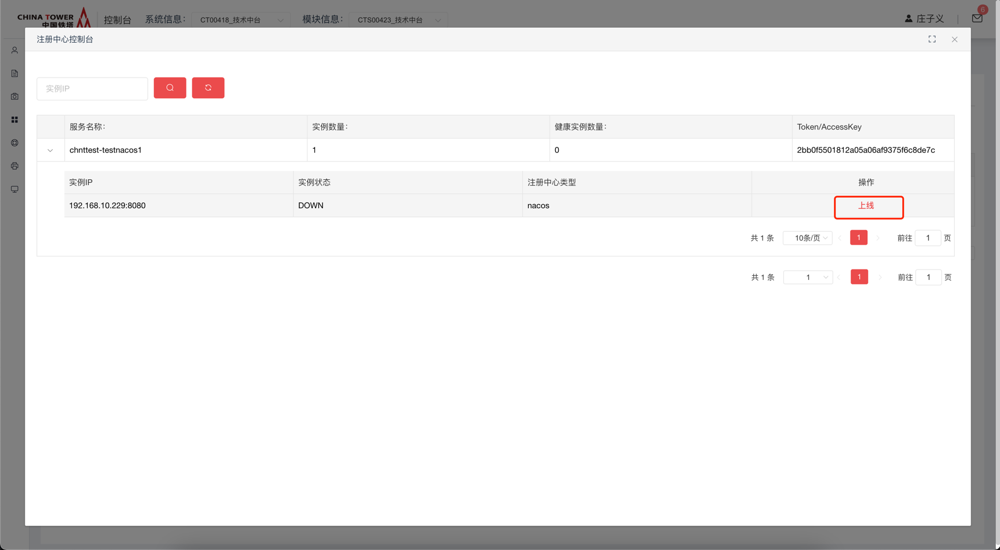
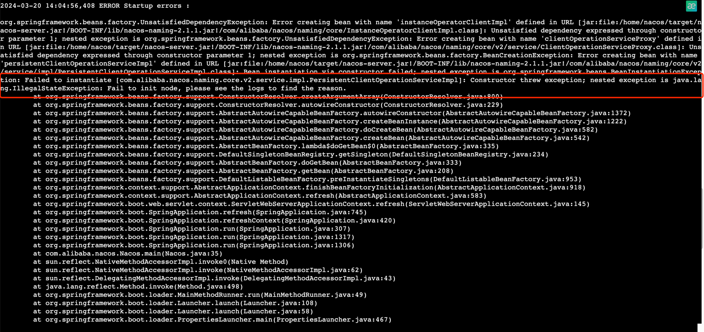

# Nacos注册中心

Nacos 是一个 Alibaba 开源的、易于构建云原生应用的动态服务发现、配置管理和服务管理平台。

使用 Spring Cloud Chinatower Nacos Discovery，可基于 Spring Cloud 的编程模型快速接入 `技术中台注册中心` 服务注册功能。

## 开源版本说明

| 版本名 | 版本  | 说明 |
| ------ | ----- | ---- |
| nacos  | 2.1.1 |      |

## 功能发布记录

| 发布时间   | 功能分类 | 功能名称                  | 说明 |
| ---------- | -------- | ------------------------- | ---- |
| 2023-08-23 | 功能新增 | Nacos注册中心上架技术中台 |      |

## 重要通知

Nacos注册中心仅支持铁塔V3版本开发框架。

>[!NOTE]
>
>生产环境接口最大并发数为1500，超过最大并发的请求将被丢弃，或影响服务正常使用。

> [!NOTE]
>
> 新接系统并发数建议不超过50，如果预估超过100请联系技术中台组。

## 组件描述

服务发现是微服务架构体系中最关键的组件之一。如果尝试着用手动的方式来给每一个客户端来配置所有服务提供者的服务列表是一件非常困难的事，而且也不利于 服务的动态扩缩容。Nacos Discovery 可以帮助您将服务自动注册到 Nacos 服务端并且能够动态感知和刷新某个服务实例的服务列表。除此之外，Nacos Discovery 也将服务实例自身的一些元数据信息-例如 host，port, 健康检查URL，主页等内容注册到 Nacos。

## 快速入门

### 组件申请

Ⅰ. 使用消费者账号登录，鼠标移动到上方微服务框架，点击Nacos注册中心。


Ⅱ. 进入Nacos注册中心海报页面，点击申请按钮。


Ⅲ.  进入申请页面，输入服务名称（注意，此处服务名唯一且应与服务配置文件中spring.application.name保持一致。要求格式为英文小写，-,数字,并以chnt开头，最大字符长度为50,且应符合 ${主数据系统下发的系统编码}-${服务名规范} ），勾选环境，点击申请。


Ⅳ 申请后，应联系技术中台运营人员，审批通过注册中心能力申请。 可在我的申请单，查询当前申请状态。


Ⅴ 审批通过后，可在我的能力-》微服务开发框架，找到已经通过的Nacos注册中心能力。


Ⅵ 点击详情，查看已获得的AccessKey


## 操作指南

消费者登录技术中台后，在我的能力中找到Eureka注册中心，点击"控制台"可查看当前服务下的的具体实例情况


对特定实例进行"下线"操作，则后续请求不会请求到该实例


对特定实例进行"上线"操作，则该实例可以正常处理请求



## 典型实践

如果要在您的项目中使用 Nacos 来实现服务注册，使用 group ID 为 `com.chinatower.cloud` 和 artifact ID 为 `spring-cloud-starter-chinatower-nacos-discovery` 的 starter。

```xml
<dependency>
    <groupId>com.chinatower.cloud</groupId>
    <artifactId>spring-cloud-starter-chinatower-nacos-discovery</artifactId>
</dependency>
```

### 示例

以下步骤向您展示了如何将一个服务注册到 Nacos。

- pom.xml的配置示例：

`spring-cloud-starter-chinatower-nacos-discovery` 依赖做为默认的依赖已经添加到parent中，**无须手动添加(管理)依赖**。

pom.xml

```xml
<?xml version="1.0" encoding="UTF-8"?>
<project xmlns="http://maven.apache.org/POM/4.0.0"
         xmlns:xsi="http://www.w3.org/2001/XMLSchema-instance"
         xsi:schemaLocation="http://maven.apache.org/POM/4.0.0 http://maven.apache.org/xsd/maven-4.0.0.xsd">
    <parent>
        <groupId>com.chinatower.cloud</groupId>
        <artifactId>spring-cloud-chinatower-platform</artifactId>
        <version>3.0.6.0</version>
    </parent>
    <modelVersion>4.0.0</modelVersion>

    <artifactId>spring-cloud-chinatower-nacos-discovery-examples</artifactId>

    <dependencies>
        <dependency>
            <groupId>org.springframework.boot</groupId>
            <artifactId>spring-boot-starter-web</artifactId>
        </dependency>
    </dependencies>

    <build>
        <plugins>
            <plugin>
                <groupId>org.cyclonedx</groupId>
                <artifactId>cyclonedx-maven-plugin</artifactId>
            </plugin>
            <plugin>
                <groupId>org.springframework.boot</groupId>
                <artifactId>spring-boot-maven-plugin</artifactId>
            </plugin>
            <plugin>
                <groupId>pl.project13.maven</groupId>
                <artifactId>git-commit-id-plugin</artifactId>
            </plugin>
            <plugin>
                <groupId>org.apache.maven.plugins</groupId>
                <artifactId>maven-jar-plugin</artifactId>
            </plugin>
            <plugin>
                <groupId>org.apache.maven.plugins</groupId>
                <artifactId>maven-deploy-plugin</artifactId>
                <configuration>
                    <skip>true</skip>
                </configuration>
            </plugin>
        </plugins>
    </build>

    <repositories>
        <repository>
            <id>chinatower</id>
            <url>http://10.38.77.5:8081/repository/maven-public/</url>
        </repository>
    </repositories>
</project>
```

- application.yaml 配置。一些关于 Nacos 基本的配置也必须在 application.yaml 配置，如下所示：

application.yaml

```yaml
spring:
  application:
    name: chntframe-nacos-discovery-test
  cloud:
    nacos:
      discovery:
        server-addr: 10.180.22.20:8848
        access-key: 99b39839ab2389ab8b55ab0afb1ebc6c
```

> [!IMPORTANT]
>
> `server-addr` 根据技术中台申请提供的地址进行替换，`spring.application.name` 替换为申请时填写的服务名称，并全部小写，`access-key` 替换为审批后提供的 `Accesskey` 。

- 服务注册示例：

DiscoveryExampleApplication

```java
@SpringBootApplication
@EnableDiscoveryClient
public class DiscoveryExampleApplication {
    public static void main(String[] args) {
        SpringApplication.run(DiscoveryExampleApplication.class, args);
    }
}
```

ExampleController

```java
@Controller
public class ExampleController {
    @RequestMapping("/test")
    @ResponseBody
    public String test(){
        System.out.println("test");
        return "test";
    }
}
```

将项目启动，这个时候你就可以在 Nacos的控制台上看到注册上来的服务信息了。

### 其他配置

| 配置项         | Key                                              | 默认值 | 说明                                                         |
| -------------- | ------------------------------------------------ | ------ | ------------------------------------------------------------ |
| 服务端地址     | `spring.cloud.nacos.discovery.server-addr`       |        | Nacos Server服务端ip地址和端口，每个环境的地址需要从技术中台申请。 |
| 网卡名         | `spring.cloud.nacos.discovery.network-interface` |        | 当IP未配置时，注册的IP为此网卡所对应的IP地址，如果此项也未配置，则默认取第一块网卡的地址 |
| 注册的IP地址   | `spring.cloud.nacos.discovery.ip`                |        | 优先级最高                                                   |
| 注册的端口     | `spring.cloud.nacos.discovery.port`              | `-1`   | 默认情况下不用配置，会自动探测                               |
| AccessKey      | `spring.cloud.nacos.discovery.access-key`        |        | 准入秘钥，铁塔技术中台上面申请的Nacos注册中心能力的秘钥      |
| 元数据         | `spring.cloud.nacos.discovery.metadata`          |        | 使用Map格式配置，用户可以根据自己的需要自定义一些和服务相关的元数据信息 |
| 日志文件名     | `spring.cloud.nacos.discovery.log-name`          |        |                                                              |
| 是否集成Ribbon | `ribbon.nacos.enabled`                           | `true` | 一般都设置成true即可                                         |

**重点**

Nacos链接： https://nacos.io/zh-cn/docs/system-configurations.html

生产环境需要配置以下参数： 同一机器运行多个spring boot程序路径要区分。

| 参数名                             | 含义                   | 可选值   | 默认值                   | 支持版本 |
| ---------------------------------- | ---------------------- | -------- | ------------------------ | -------- |
| JM.LOG.PATH                        | 客户端日志的目录       | 目录路径 | 用户根目录               | >= 0.1.0 |
| com.alibaba.nacos.naming.cache.dir | 注册中心客户端缓存目录 | 目录路径 | {user.home}/nacos/naming | >= 1.0.0 |
| JM.SNAPSHOT.PATH                   | 配置中心客户端缓存目录 | 目录路径 | {user.home}/nacos/config | >= 1.0.0 |

|      | 生产环境确保添加以下参数，防止日志打印在非数据盘中。 |
| ---- | ---------------------------------------------------- |
|      |                                                      |

start.sh

```shell
java \
-DJM.LOG.PATH=/app/logs/nacos
-DJM.SNAPSHOT.PATH=/app/nacos-cache/config \
-Dcom.alibaba.nacos.naming.cache.dir=/app/nacos-cache/naming \
-jar /app/app.jar
```

## API参考

无

## SDK

maven引入铁塔为服务框架starter，具体pom.xml可参考[典型实践](http://mid.chinatowercom.cn:18080/docs/chinatower-microservice-component/v1.0/module/nacos-discovery.html#A01)部分

## 网络要求

各业务ip单向打通到Nacos提供的F5内网端口。

## 常见问题

### 注册报错情况1

#### 现象

同一个jar在IDC、验收、准生产、生产环境多个环境中，存在服务在部分环境无法正常启动的现象

error.log

```none
2023-04-03 18:15:13 [INFO][org.springframework.cloud.commons.util.InetUtils][convertAddress][170]-> Cannot determine local hostname
2023-04-03 18:15:15 [INFO][org.springframework.cloud.commons.util.InetUtils][convertAddress][170]-> Cannot determine local hostname
2023-04-03 18:15:25 [ERROR][com.alibaba.cloud.nacos.discovery.NacosWatch][start][136]-> namingService subscribe failed, properties:NacosDiscoveryProperties{serverAddr='192.168.157.107:8848', username='', password='', endpoint='', namespace='', watchDelay=30000, logName='', service='xxx', weight=1.0, clusterName='DEFAULT', group='DEFAULT_GROUP', namingLoadCacheAtStart='false', metadata={preserved.register.source=SPRING_CLOUD}, registerEnabled=true, ip='xxx', networkInterface='', port=-1, secure=false, accessKey='xxx', secretKey='', heartBeatInterval=null, heartBeatTimeout=null, ipDeleteTimeout=null, instanceEnabled=true, ephemeral=true, failureToleranceEnabled=false}, ipDeleteTimeout=null, failFast=true}
com.alibaba.nacos.api.exception.NacosException: Client not connected, current status:STARTING
	at com.alibaba.nacos.common.remote.client.RpcClient.request(RpcClient.java:655)
	at com.alibaba.nacos.common.remote.client.RpcClient.request(RpcClient.java:635)
	at com.alibaba.nacos.client.naming.remote.gprc.NamingGrpcClientProxy.requestToServer(NamingGrpcClientProxy.java:304)
	at com.alibaba.nacos.client.naming.remote.gprc.NamingGrpcClientProxy.doSubscribe(NamingGrpcClientProxy.java:255)
	at com.alibaba.nacos.client.naming.remote.gprc.NamingGrpcClientProxy.subscribe(NamingGrpcClientProxy.java:240)
	at com.alibaba.nacos.client.naming.remote.NamingClientProxyDelegate.subscribe(NamingClientProxyDelegate.java:160)
	at com.alibaba.nacos.client.naming.NacosNamingService.subscribe(NacosNamingService.java:404)
	at com.alibaba.cloud.nacos.discovery.NacosWatch.start(NacosWatch.java:132)
	at org.springframework.context.support.DefaultLifecycleProcessor.doStart(DefaultLifecycleProcessor.java:178)
	at org.springframework.context.support.DefaultLifecycleProcessor.access$200(DefaultLifecycleProcessor.java:54)
	at org.springframework.context.support.DefaultLifecycleProcessor$LifecycleGroup.start(DefaultLifecycleProcessor.java:356)
	at java.lang.Iterable.forEach(Iterable.java:75)
	at org.springframework.context.support.DefaultLifecycleProcessor.startBeans(DefaultLifecycleProcessor.java:155)
	at org.springframework.context.support.DefaultLifecycleProcessor.onRefresh(DefaultLifecycleProcessor.java:123)
	at org.springframework.context.support.AbstractApplicationContext.finishRefresh(AbstractApplicationContext.java:935)
	at org.springframework.context.support.AbstractApplicationContext.refresh(AbstractApplicationContext.java:586)
	at org.springframework.boot.web.servlet.context.ServletWebServerApplicationContext.refresh(ServletWebServerApplicationContext.java:145)
	at org.springframework.boot.SpringApplication.refresh(SpringApplication.java:745)
	at org.springframework.boot.SpringApplication.refreshContext(SpringApplication.java:420)
	at org.springframework.boot.SpringApplication.run(SpringApplication.java:307)
	at org.springframework.boot.SpringApplication.run(SpringApplication.java:1317)
	at org.springframework.boot.SpringApplication.run(SpringApplication.java:1306)
	at com.chinatower.product.threed.ThreedApplication.main(ThreedApplication.java:20)
```

#### 解决方案

查看hostname


查看/etc/hosts


**如果存在hostname不在hosts文件中，申请运维工单**

### 套装类软件如何集成

>[!CAUTION]
>
>请先申请Nacos注册中心，在我的能力详情中获得accessKey

#### 源码是JAVA语言且为spring cloud微服务架构

根据注册中心提供的样例工程，添加技术中台提供的依赖jar坐标，配置相应参数，重新打包和部署。

#### 源码非JAVA语言：

- 方案1: 尝试Nacos官网其他语言SDK，并二开添加 `authToken` 请求头，值为我的能力审批通过后返回的accessKey数据。
- 方案2: 使用Rest API自行发起 注册、续约、下线三个接口调用，调用的同时将在技术中台申请的accessKey作为authToken请求头的值放到请求中


## 运维常见问题

### nacos无法启动

现象：启动日志中显示：Fail to init node, please see the logs to find the reason ，如下图



解决：删除 <nacos安装目录>/data/protocol 目录，然后重启即可

对于caas平台nacos来说，进入到pod内执行

```shell
rm -fr /home/nacos/data/protocol
```

## 样例文件

 [example(1).zip](../file/example(1).zip) 

