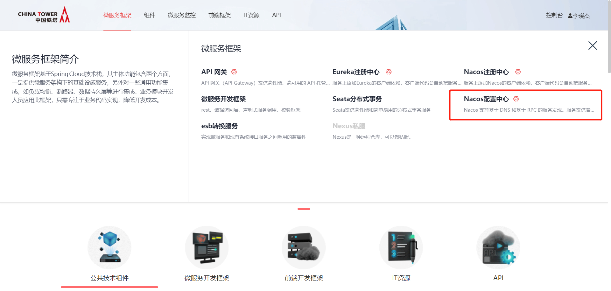
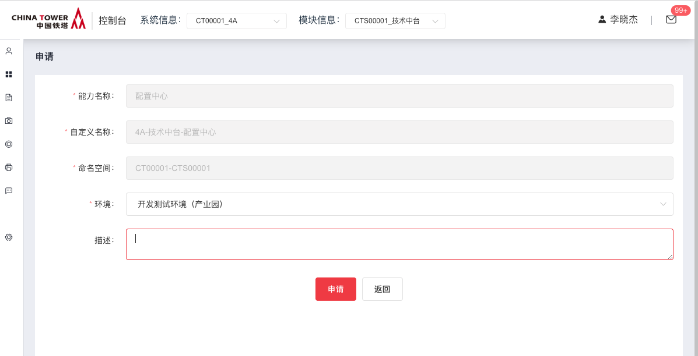
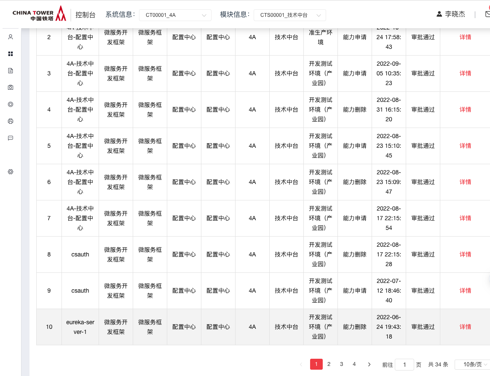
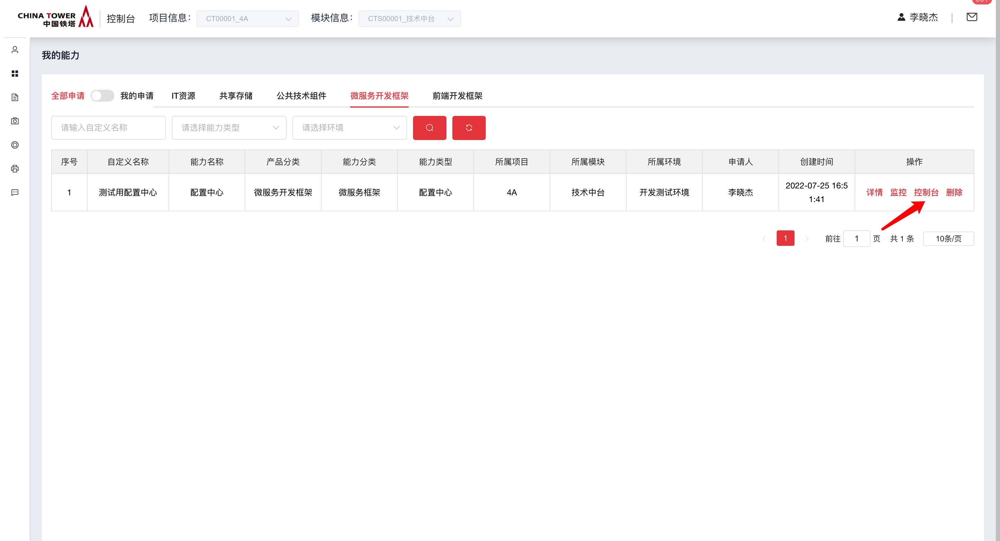
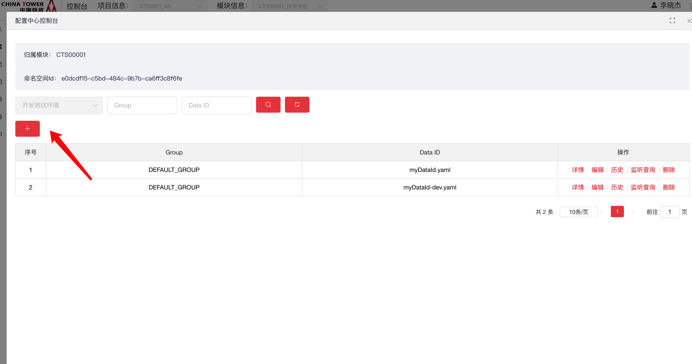
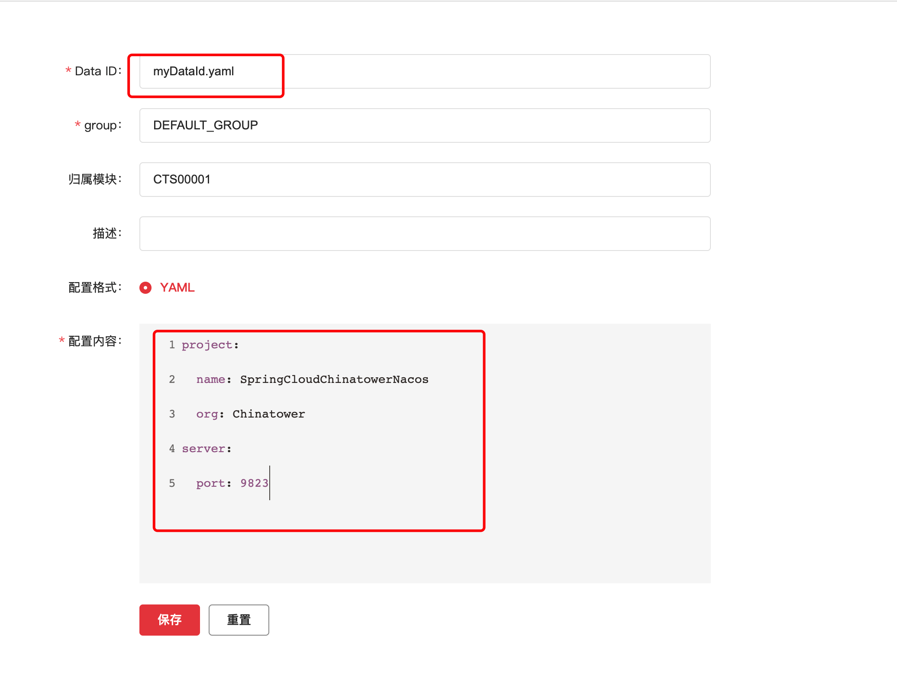

# Nacos配置中心

Nacos 是一个 Alibaba 开源的、易于构建云原生应用的动态服务发现、配置管理和服务管理平台。

使用 Spring Cloud Chinatower Nacos Config，可基于 Spring Cloud 的编程模型快速接入 Nacos 配置管理功能。

## 开源版本说明

| 版本名 | 版本  | 说明 |
| ------ | ----- | ---- |
| nacos  | 2.1.1 |      |

## 功能发布记录

| 发布时间   | 功能分类 | 功能名称                  | 说明 |
| ---------- | -------- | ------------------------- | ---- |
| 2022-08-12 | 功能上线 | Nacos配置中心上架技术中台 |      |

## 重要通知

Nacos配置中心仅支持铁塔V3版本开发框架。

> [!NOTE]
>
> 生产环境接口最大并发数为1500，超过最大并发的请求将被丢弃，或影响服务正常使用。

> [!NOTE]
>
> 新接系统并发数建议不超过50，如果预估超过100请联系技术中台组。

## 组件描述

支持基于 DNS 和基于 RPC 的服务发现（可以作为 springcloud 的配置中心）、动态配置服务（可以做配置中心）、动态 DNS  服务。做为配置中心，允许在所有环境中以集中和动态的方式管理所有应用程序或服务的配置，动态配置消除了配置更新时重新部署应用程序和服务的需要。可以更方便的实现无状态服务，更轻松地实现按需弹性扩展服务实例。

## 快速入门

### 组件申请

Ⅰ. 使用消费者账号登录，鼠标移动到上方微服务框架，点击Nacos配置中心



II. 进入Nacos配置中心海报页面，点击申请按钮。



III.申请后，应联系技术中台运营人员，审批通过配置中心能力申请。 可在我的申请单，查询当前申请状态。



IⅤ. 审批通过后，可在我的能力-》微服务开发框架，找到已经通过的Nacos配置中心能力。



## 操作指南

消费者登录技术中台后，在我的能力中找到Nacos配置中心，点击"控制台"可查看当前模块下的配置情况。


点击+号创建配置



Nacos Config 使用 DataId 和 GROUP 确定一个配置。

下图表示 DataId 使用 `myDataId.yaml`, GROUP 使用 `DEFAULT_GROUP`，配置格式为 yaml 的一个配置项:



Figure 1. 技术中台配置中心控制台

## 典型实践

### 动态配置

代码中使用 `@ConfigurationProperties` 注解方式标识一个实体类，并添加 `@RefreshScope` 注解。在别的bean中注入此properties。当在配置中心动态修改值时，会动态修改配置值。

Properties类源码

```java
@Component
@ConfigurationProperties(prefix = "xxx")
@RefreshScope
public class XXXProperties {
    private String name;

    public String getName() {
        return name;
    }

    public void setName(String name) {
        this.name = name;
    }

    @Override
    public String toString() {
        return "XXXProperties{" +
                "name='" + name + '\'' +
                '}';
    }
}
```

nacos配置

```yaml
xxx:
  name: yyy
```

需要注入此Properties的bean源码

```java
@Service
public class Test{
    private static final Logger log = LoggerFactory.getLogger(Test.class);
    @Autowired
    private XXXProperties xxxProperties;

    @Override
    private void checkIsWhiteIp(String whiteIps, String remoteIp) {
        log.info("name: {} ", xxxProperties.getName());
    }
}
```

在技术中台nacos管理控制台上修改配置后，终端会打印新的name值。

实际生产环境，会存在刷新spring bean context的过程，会存在服务不可响应的情况，请在业务低峰操作。

> [!CAUTION]
>
> 不要使用 `@Value("${xxx.name}")` 这种方式来操作动态配置，实际存在多种问题。

## 示例

现在创建一个标准的 Spring Boot 应用。

在运行此 此 Spring Boot 应用之前， 必须使用 `bootstrap.yaml` 配置文件来配置 Nacos Server 地址, namespace信息, 以及dataId(`${prefix}`.`$\{file-extension:yaml}`)，例如：

服务地址在能力详情里可查到，命名空间id进入配置中心控制台可查到。

bootstrap.yaml

```yaml
#  GROUP 不配置默认使用 DEFAULT_GROUP。
spring:
  cloud:
    nacos:
      config:
        server-addr: 192.168.50.67:8666
        namespace: e0dcdf15-c5bd-484c-9b7b-ca6ff3c8f6fe
        prefix: myDataId
        file-extension: yaml
```

在启动类里输出一些配置信息，方便验证是否拉取成功配置。

```java
@SpringBootApplication
public class NacosConfigApplication {

    public static void main(String[] args) {
        ConfigurableApplicationContext applicationContext = SpringApplication.run(ConfigApplication.class, args);
        String userName = applicationContext.getEnvironment().getProperty("project.name");
        String userAge = applicationContext.getEnvironment().getProperty("project.org");
        System.err.println("project name : " + name + "; org: " + org);
    }
}
```

启动这个 Example，可以看到如下输出结果： 成功拉取到远程配置。

```none
……
2022-07-25 18:38:44.961  INFO 13978 --- [           main] w.s.c.ServletWebServerApplicationContext : Root WebApplicationContext: initialization completed in 741 ms
2022-07-25 18:38:45.351  INFO 13978 --- [           main] o.s.b.w.embedded.tomcat.TomcatWebServer  : Tomcat started on port(s): 9823 (http) with context path ''
2022-07-25 18:38:45.361  INFO 13978 --- [           main] c.c.c.e.n.c.ConfigExampleApplication     : Started ConfigExampleApplication in 3.264 seconds (JVM running for 3.866)
2022-07-25 18:38:45.372  INFO 13978 --- [           main] c.a.c.n.refresh.NacosContextRefresher    : listening config: dataId=myDataId, group=DEFAULT_GROUP
2022-07-25 18:38:45.373  INFO 13978 --- [           main] c.a.c.n.refresh.NacosContextRefresher    : listening config: dataId=myDataId.yaml, group=DEFAULT_GROUP
project name : SpringCloudChinatowerNacos; org: Chinatower
```

## 其他配置

### 完全关闭 Nacos Config 的自动化配置

通过设置 spring.cloud.nacos.config.enabled = false 来完全关闭 Spring Cloud Nacos Config

### 关于 Nacos Config Starter 更多的配置项信息

更多关于 Nacos Config Starter 的配置项如下所示:

| 配置项            | Key                                       | 默认值          | 说明                                                         |
| ----------------- | ----------------------------------------- | --------------- | ------------------------------------------------------------ |
| 服务端地址        | `spring.cloud.nacos.config.server-addr`   |                 | Nacos Server 启动监听的ip地址和端口                          |
| 配置对应的 DataId | `spring.cloud.nacos.config.prefix`        |                 | 先取 prefix，再取 name，最后取 spring.application.name       |
| GROUP             | `spring.cloud.nacos.config.group`         | `DEFAULT_GROUP` | 配置对应的组                                                 |
| 文件扩展名        | `spring.cloud.nacos.config.fileExtension` | `properties`    | 配置项对应的文件扩展名，目前支持 properties 和 yaml(yml)     |
| 命名空间          | `spring.cloud.nacos.config.namespace`     |                 | 常用场景之一是不同环境的配置的区分隔离，例如开发测试环境和生产环境的资源（如配置、服务）隔离等 |

## API参考

无

## SDK

maven引入铁塔为服务框架starter，具体pom.xml可参考典型实践部分

## 网络要求

各业务ip单向打通到Nacos提供的F5内网端口。

## 常见问题

暂无

## 样例文件

 [example(2).zip](../file/example(2).zip) 

