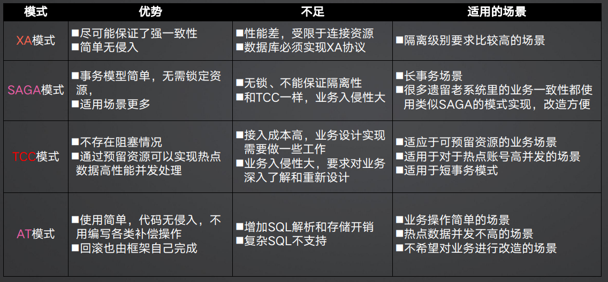
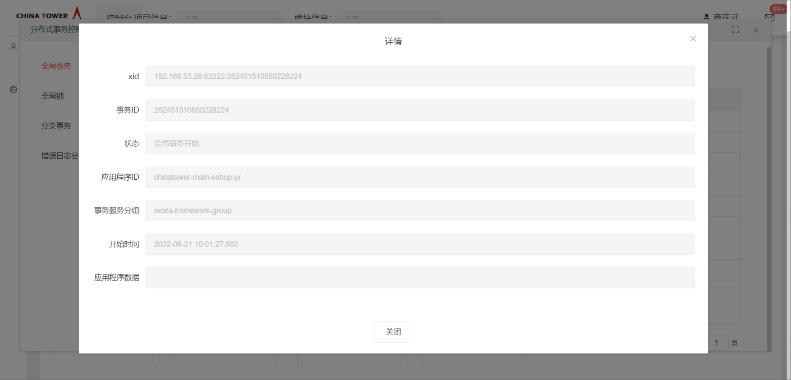
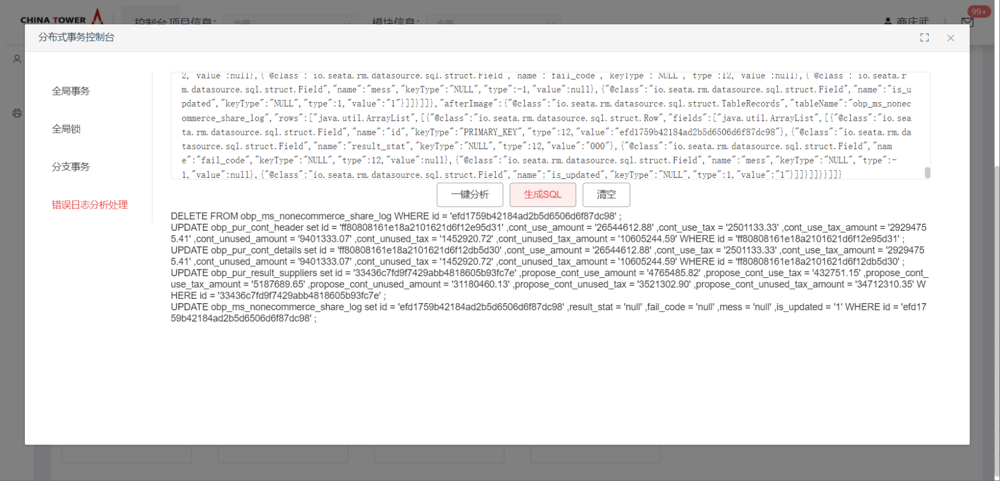

# 分布式事务Seata

分布式事务SEATA提供高性能和简单易用的分布式事务服务,保证不同节点之间的数据一致性，采用第二阶段补偿机制的AT事务模式，为业务系统打造一站式的分布式解决方案。

>[!NOTE]
>
>1. 当前服务端版本为1.6.1; 
>1. 当前仅支持AT模式。

## 开源版本说明

| 版本名       | 版本  | 说明 |
| ------------ | ----- | ---- |
| seata-server | 1.6.1 |      |
| seata-client | 1.4.1 |      |

## 功能发布记录

| 发布时间   | 功能分类 | 功能名称                 | 说明                                                         |
| ---------- | -------- | ------------------------ | ------------------------------------------------------------ |
| 2022-08-23 | 新特性   | 新增分布式事务管理控制台 | 技术中台，消费者在分布式事务管理控制台，提供全局事务信息、全局锁信息、分支事务信息、错误日志分析等相关查询与操作，具体参考[操作指南](http://mid.chinatowercom.cn:18080/docs/chinatower-microservice-component/v1.0/module/seata.html#_操作指南)部分 |

## 重要通知

### 什么是分布式事务

分布式事务是指涉及多个独立处理单元（例如，多个数据库、服务、应用程序实例等）的事务操作。在传统的单体应用中，事务通常是在一个单一的数据库中执行，而分布式事务则涉及跨足多个独立的分布式系统或服务的数据访问和更新。

分布式事务要解决的主要问题是确保在分布式环境下执行的事务满足ACID（原子性、一致性、隔离性和持久性）属性，这是传统数据库事务的关键特性。分布式环境的挑战包括网络延迟、节点故障、通信失败等，这些都可能导致事务管理更为复杂。

### 行业内有哪些分布式事务解决方案

#### 传统做法：定时检查一致性，逆向操作冲抵。

#### 现代做法：引入全局事务管理器，控制状态。


基于目前的行业现状，及数据一致性要求，一般都采用第二种即引入全局事务管理器的方式，全局控制分布式事务，保证业务正常操作。特殊情况下，存在一些场景，也会同时采用第一种方案，来加强数据的一致性保障，如财务对账。

#### 本文主要讨论第二种全局分布式事务解决方案:

1.分布式事务的本质：把数据库事务的一部分机制拿到业务侧来做， 实现本地事务在分布式系统下的整体一致性能力增强的技术方案。

2.分布式事务协议和机制：

- **两阶段提交协议（Two-Phase Commit, 2PC）**： 这是一种协议，确保所有参与者都同意提交或回滚一个事务。然而，2PC在某些故障情况下可能导致阻塞，因为它需要所有参与者的同意。


- **三阶段提交协议（Three-Phase Commit, 3PC）**： 3PC是对2PC的改进，增加precommit阶段，旨在减少在某些故障情况下的阻塞问题。


- **补偿性事务（Compensating Transactions）**： 使用补偿性事务的方法是，当一个事务失败时，执行一些逆操作以回滚或补偿先前的操作，以确保系统恢复到一致的状态。


- **基于消息的分布式事务（Messaging-Based Distributed Transactions）**： 使用消息传递系统来协调分布式事务，例如，通过消息队列实现分布式事务的一致性。


3.刚性事务和柔性事务

(1) **刚性事务（强一致）**

- 定义：刚性事务要求系统在事务执行期间保持一致性，即事务在开始和结束时系统状态必须保持一致
- 特点：在刚性事务中，事务的执行是原子性的、一致性的、隔离的、持久的（ACID特性）


- 通常使用XA协议来解决需要刚性分布式事务的场景，XA协议是基于多阶段（两阶段提交（2PC）和三阶段提交（3PC））提交方式实现的刚性分布式事务解决方案，传统的关系型数据库系统通常提供刚性事务，确保事务的执行是可预测和可靠的。
- 基于XA实现分布式事务：


(2) **柔性事务（最终一致）**


- 定义： 柔性事务允许在分布式系统中的一段时间内存在不一致的状态，但最终会达到一致性
- 特点： 柔性事务放宽了一致性要求，允许系统在一段时间内处于不同的一致性级别，但要求最终达到一致性。

(3) **柔性分布式事务解决方案1：SAGA**

- SAGA特点： 所有本地事务依次执行，当某个事务执行出错时，依次反向执行补偿逻辑，撤销掉各个事务对数据库的修改，需要注意撤销操作的幂等性。


(4) **柔性分布式事务解决方案2：TCC（Try、Confirm、Cancel）**

- TCC特点： 每个本地事务拆分为三个步骤，并发性能较好，对业务侵入性高，适用范围广，每个Try保留资源确保Confirm能成功。


(5) **柔性分布式事务解决方案3：AT**

- AT特点： 业务侵入性最小，相当于是自动化补偿的SAGA，在执行SQL时自动生成反向SQL，要求SQL不能太复杂，要求在业务数据库创建SQL操作表，要求业务SQL和反向生成在同一个事务。


4.各模式对比



## 组件描述

Seata分布式事务，用于实现分布式环境下，特别是微服务架构下的高性能事务一致性。支持MySQL、Oracle等数据源，并结合Chinatower Spring Cloud微服务、feign RPC框架等配合使用， 轻松实现分布式数据库事务、多库事务等需求。

铁塔分布式事务组件基于开源的分布式事务解决方案Seata框架，致力于提供高性能和简单易用的分布式事务服务。为用户提供了 AT模式，为业务系统打造一站式的分布式解决方案。

### 管理分布式事务的典型生命周期：

1. TM 要求 TC 开始一个全新的全局事务
2. TC 生成一个代表该全局事务的 XID。
3. XID 贯穿于微服务的整个调用链。
4. TM 要求 TC 提交或回滚 XID 对应全局事务
5. TC 驱动 XID 对应的全局事务下的所有分支事务完成提交或回滚。


### AT模式

1. AT 模式是一种非侵入式的分布式事务解决方案，在内部做了对数据库操作的代理层，我们使用AT 模式时，实际上用的是自带的数据源代理 DataSourceProxy，在这层代理中加入了很多逻辑，比如插入回滚 undo_log 日志，检查全局锁等。
2. 整体机制：
   - 一阶段：业务数据和回滚日志记录在同一个本地事务中提交，释放本地锁和连接资源。
   - 二阶段：1. 提交异步化，非常快速地完成。2. 回滚通过一阶段的回滚日志进行反向补偿。

>[!IMPORTANT]
>
>- 一般情况下，均可以0改造接入分布式事务组件来解决系统的数据一致性问题（需要添加一些配置和注解声明）；  
>- AT模式可以解决80%的场景；  
>- 分布式事务组件支持单系统多服务、跨系统、多系统间的同步模式的接口调用的场景；  
>- 由于AT模式属于补偿类型，本质上属于柔性事务，仅能保证最终一致性，需要业务系统进行考虑；  
>- AT模式下，一次业务请求会将所有涉及的数据表的主键id锁住（存储到分布式事务组件服务端），需要在业务入口，添加分布式锁，防止无意义的频繁分布式事务回滚；  
>- AT模式适合短事务，并不适合长事务；  
>- 非ACID操作可通过TCC模式混合使用；  
>- TCC模式相比AT模式因为无锁，性能高，但需自行保证幂等和事务防悬挂；  
>- 一次全局事务全环节应在60s内完成，单接口超过10s应考虑异步方式改造或者性能优化（降低单次加锁数量/添加索引/等）。

## 快速入门

### 组件申请

消费者登录技术中台首页，选择微服务框架，点击Seata分布式事务。


点击申请


根据提示，输入名称，选择对应的环境，点击申请按钮。


运营管理员审批通过后，在我的能力后输入正确的筛选条件，即可看到刚申请的能力。


点击详情按钮，即可看到各环境的能力地址。根据下文配置参数章节进行地址替换。


## 操作指南

### 消费者控制台

#### 分布式事务控制台左侧选择全局事务信息


全局事务提供xid、事务id、应用程序id查询，同时每条数据提供详情查看功能。




#### 分布式事务控制台左侧选择全局锁信息


全局事务提供xid、分支id、表名称、事务id，资源id查询，同时每条数据提供详情查看功能。


#### 分布式事务控制台左侧选择分支事务信息


全局事务提供xid、分支id、事务id，资源id、客户端id查询，同时每条数据提供详情查看功能。


#### 分布式事务控制台左侧选择分支事务信息


填入正确格式的错误日志，点击一键分析，如果满足解锁条件，则会自动进行解锁。


如果未满足解锁条件，存在其他全局锁占用时，则会列出相应全局锁信息。


填入对应的undo_log日志，点击生成SQL，则会自动解析生成对应手动回滚的SQL。



## 典型实践

### 场景介绍

#### 服务仅使用ACID关系型数据库

1. 场景说明：
   - 系统内部微服务之间远程调用；
   - 跨系统通过网关调用。
2. 场景解决方案：
   - 上下游都接入技术中台分布式事务组件；
   - 使用AT模式。
3. 场景补充说明：
   - 目前seata AT模式基于支持本地 ACID 事务 的 关系型数据库；仅支持MySQL、Oracle、PostgreSQL、 TiDB、MariaDB。国产达梦数据库需要做适配，目前不支持（24年完成适配）；
   - 不支持 SQL 嵌套；
   - 不支持多表复杂 SQL(自1.6.0版本，MySQL支持UPDATE JOIN语句）；
   - 不支持存储过程、触发器；
   - 部分数据库不支持批量更新，在使用 MySQL、Mariadb、PostgreSQL9.6+作为数据库时支持批量，批量更新方式需要按照指定方式编写；
   - Seata 的隔离级别默认为读未提交；使用 for update 代理可以让 Seata 达到读已提交；
   - 部分函数支持，需要根据文档操作；
   - 支持铁塔微服务框架。支持mybatis、Mybatis-Plus；
   - 组件AT模式只支持全链路同步，针对异步场景需要做特殊支持；
   - 组件默认全局分布式事务超时时间为60s：
     - 所有上下游处理时间不得超过60s。（可简单理解为一次用户操作的耗时）；
     - 超过60s触发全局回滚；
     - 各分支事务处理时间应不超过10s，超过10s应考虑使用异步请求方式。

### 服务内部使用分库分表组件

1. 场景背景：
   - 垂直分库后直接访问数据库；
   - 水平分库后一个操作访问多个库表。
2. 场景解决方案：
   - 上下游都接入技术中台分布式事务组件；
   - 使用AT模式。
3. 使用技术中台分库分表组件。
   - 场景补充说明：
     - 同场景1

### 服务操作无法加入分布式全局事务

1. 场景背景：
   - 使用了redis、mongo、es等非ACID数据库等；
   - 下游服务当前未集成分布式事务组件；
   - 下游服务为套装采购类软件，无法加入到seata全局事务；
   - 跨公司、跨语言调用。
2. 场景解决方案：
   - 若使用铁塔的微服务框架，基于spring cloud 体系和openFeign 进行RPC接口调用，则可以使用@LocalTCC注解进行支持。以下是代码编写说明：
     - 定义TCC接口
       - @LocalTCC注解在接口上，此接口可以是寻常的业务接口，只要实现了TCC的两阶段提交对应方法便可。
       - @TwoPhaseBusinessAction  注解try方法，其中name为当前tcc方法的bean名称，写方法名便可（全局唯一），commitMethod指向提交方法，rollbackMethod指向事务回滚方法。指定好三个方法之后，seata会根据全局事务的成功或失败，去帮我们自动调用提交方法或者回滚方法。
       - @BusinessActionContextParameter 注解可以将参数传递到二阶段（commitMethod/rollbackMethod）的方法。
       - BusinessActionContext 便是指TCC事务上下文。
     - 编写TCC接口的业务实现。
       - 在try方法中使用@Transational可以直接通过spring事务回滚关系型数据库中的操作，而非关系型数据库等中间件的回滚操作可以交给rollbackMethod方法处理。
       - 使用context.getActionContext("params")便可以得到一阶段try中定义的参数，在二阶段对此参数进行业务回滚操作。
     - TM入口添加@GlobalTransactional注解，开启全局事务。
3. 场景补充说明：
   - Seata的AT模式基本上能满足我们使用分布式事务80%的需求，但涉及不支持事务的数据库与中间件（如redis）等的操作，或AT模式暂未支持的数据库（目前AT支持Mysql、Oracle与PostgreSQL）、跨公司服务的调用、跨语言的应用调用或有手动控制整个二阶段提交过程的需求，则需要结合TCC模式。不仅如此，TCC模式还支持与AT模式混合使用。
   - 二阶段不可以捕获异常，否则TCC将识别该操作为成功，无法进行回滚。
   - TCC模式要开发者自行保证幂等和事务防悬挂。
   - TCC模式不保证数据隔离。

### 添加依赖

依赖内部集成了seata-spring-boot-starter 1.4.1版本，该版本已默认开启数据源的自动代理以及GlobalTransactionScanner初始化。

pom.xml

```xml
<dependency>
    <groupId>com.chinatower.cloud</groupId>
    <artifactId>spring-cloud-starter-chinatower-seata</artifactId>
    <version>3.0.6.0</version>
</dependency>
```

>[!NOTE]
>
>使用此版本时，若使用mysql数据库，则使用的mysql驱动版本不得超过8.0.22。 [点击查看相关ISSUE](https://github.com/seata/seata/issues/3620))

### 配置参数

application.yaml

```yaml
seata:
  enabled: true
  tx-service-group: seata-framework-group
  service:
    vgroup-mapping:
      seata-framework-group : default
    grouplist:
      default: 10.180.22.20:61111  # 技术中台申请各环境的分布式事务能力，获取各环境地址。 多个地址分号分割。
  client:
    undo:
      data-validation: true             # 二阶段回滚镜像校验（默认true开启，false关闭）
      log-serialization: jackson        # undo序列化方式（默认jackson）
      log-table: undo_log    # 自定义undo表名（默认undo_log）
    rm:
      lock:
        retry-interval: 10              #校验或占用全局锁重试间隔
        retry-times: 100                #校验或占用全局锁重试次数
        retry-policy-branch-rollback-on-conflict: true   #分支事务与其它全局回滚事务冲突时锁策略
    tm:
      commit-retry-count: 10     #一阶段全局提交结果上报TC重试次数
      rollback-retry-count: 10   #一阶段全局回滚结果上报TC重试次数
```

### 添加表结构

在业务相关的数据库中添加 undo_log 表，用于保存需要回滚的数据 mysql为例:

```sql
CREATE TABLE `undo_log`
(
    `id`            BIGINT(20)   NOT NULL AUTO_INCREMENT,  -- 主键
    `branch_id`     BIGINT(20)   NOT NULL,	-- 分支事务ID
    `xid`           VARCHAR(100) NOT NULL, --  全局事务ID
    `context`       VARCHAR(128) NOT NULL, --  事务上下文
    `rollback_info` LONGBLOB     NOT NULL, --  回滚信息
    `log_status`    INT(11)      NOT NULL, -- 日志状态
    `log_created`   DATETIME     NOT NULL, --  日志创建时间
    `log_modified`  DATETIME     NOT NULL, -- 日志最后修改时间
    `ext`           VARCHAR(100) DEFAULT NULL, --  扩展信息
    PRIMARY KEY (`id`),
    UNIQUE KEY `ux_undo_log` (`xid`, `branch_id`)
) ENGINE = InnoDB
AUTO_INCREMENT = 1
DEFAULT CHARSET = utf8
```

### 开启全局事务

在业务的发起方的方法上使用@GlobalTransactional开启全局事务，Seata 会将事务的 xid  通过拦截器添加到调用其他服务的请求中，实现分布式事务。 业务调用链中需要异常才能执行回滚操作，使用之前，请先查看代码中是否有Try-catch  块，如果有请更换为回抛异常处理，如果有全局异常处理，请查看下面参数说明，添加指定异常类进行事务回滚。

参数说明：

| 参数名称               | 参数说明                                                     | 默认值          |
| ---------------------- | ------------------------------------------------------------ | --------------- |
| timeoutMills           | 全局事务超时时间                                             | 60000 单位 毫秒 |
| name                   | 全局事务名称                                                 | 无              |
| rollbackFor            | 该属性用于设置需要进行回滚的异常类数组，当方法中抛出指定异常数组中的异常时，则进行事务回滚。例如： 指定单一异常类：@Transactional(rollbackFor=RuntimeException.class) 指定多个异常类：@Transactional(rollbackFor={RuntimeException.class, Exception.class}) | 无              |
| rollbackForClassName   | 该属性用于设置需要进行回滚的异常类名称数组，当方法中抛出指定异常名称数组中的异常时，则进行事务回滚。例如： 指定单一异常类名称：@Transactional(rollbackForClassName="RuntimeException") 指定多个异常类名称：@Transactional(rollbackForClassName={"RuntimeException","Exception"}) | 无              |
| noRollbackFor          | 该属性用于设置不需要进行回滚的异常类数组，当方法中抛出指定异常数组中的异常时，不进行事务回滚。例如： 指定单一异常类：@Transactional(noRollbackFor=RuntimeException.class) 指定多个异常类：@Transactional(noRollbackFor={RuntimeException.class, Exception.class}) | 无              |
| noRollbackForClassName | 该属性用于设置不需要进行回滚的异常类名称数组，当方法中抛出指定异常名称数组中的异常时，不进行事务回滚。例如： 指定单一异常类名称：@Transactional(noRollbackForClassName="RuntimeException") 指定多个异常类名称： @Transactional(noRollbackForClassName={"RuntimeException","Exception"}) | 无              |

### 运营指标

1.分布式事务使用占比：

通过系统总体涉及到跨系统/跨服务的接口为分布式事务接口最大值，当前已使用的分布式事务接口为分布式事务接口当前值，使用当前值和最大值计算比例，即分布式事务使用占比。

```sh
# 已使用分布式事务的接口量 / 总接口量 = 使用占比
seata_transaction_apply_current / seata_transaction_apply_max = seata_transaction_apply_ratio
```

2.分布式事务实例耗时：

通过发起分布式事务的时间为开始时间，提交分布式事务成功的时间为结束时间，结束时间减去开始时间，为分布式事务实例的耗时时间。

```sh
# 分布式事务实例提交成功时间 - 分布式事务实例发起时间 = 分布式事务耗时
seata_transaction_instance_commit_success_timestamp - seata_transaction_instance_start_ timestamp = seata_transaction_instance_apply_time
```

### 异常使用情况

1.业务代码与分布式事务SDK代码线程隔离，无法传递XID。

Seata分布式事务的核心是每个分布式事务发起会创建一个XID，为分布式事务实例声明一个ID，XID会贯穿于微服务的整个调用链，由于XID绑定在ThreadLocal上，当处理业务逻辑的代码和跨系统调用的代码是在不同的线程池，seata提供的SDK获取不到XID同时无法传递XID，下游应用获取不到XID，导致下游服务无法加入到分布式事务生命周期中。

## API参考

无

## SDK

无

## 网络要求

各业务ip单向打通到seata节点指定端口的网络。

## 常见问题

### seata能力提供了多个地址时, 配置文件如何配置

用 ; 分割

### 数据源支持

AT模式支持的数据库有：MySQL、Oracle、PostgreSQL、TiDB、MariaDB。

### SQL限制

Seata 事务目前支持 INSERT、UPDATE、DELETE 三类 DML  语法的部分功能，这些类型都是已经经过Seata开源社区的验证。SQL  的支持范围还在不断扩大，建议在本文限制的范围内使用。如果您有意帮助社区支持更多类型的SQL，请提交PR申请。

#### 使用限制

- 不支持 SQL 嵌套
- 不支持多表复杂 SQL(自1.6.0版本，MySQL支持UPDATE JOIN语句，详情请看 )
- 不支持存储过程、触发器
- 部分数据库不支持批量更新，在使用 MySQL、Mariadb、PostgreSQL9.6+作为数据库时支持批量，批量更新方式如下以 Java 为例

```java
public class Test {
    // use JdbcTemplate
    public void batchUpdate() {
        jdbcTemplate.batchUpdate(
            "update storage_tbl set count = count -1 where id = 1",
            "update storage_tbl set count = count -1 where id = 2"
        );
    }

    // use Statement
    public void batchUpdateTwo() {
        statement.addBatch("update storage_tbl set count = count -1 where id = 1");
        statement.addBatch("update storage_tbl set count = count -1 where id = 2");
        statement.executeBatch();
    }
}
```

### DML语句

本文介绍 DML 语句类型、SQL 实例以及 Seata 是否支持，帮助您在 Seata 更顺畅的使用 SQL。

| 类型        | SQL 实例                                                     | 是否支持       |
| ----------- | ------------------------------------------------------------ | -------------- |
| INSERT      | INSERT INTO tb1_name (col_name,…) VALUES (\{expr \| FAULT},…),(…),…或 INSERT INTO tb1_name SET col_name=\{expr \| DEFAULT}, … 或INSERT INTO tb1_name  (col_name,…) VALUES (\{expr \| FAULT},…) ON DUPLICATE KEY UPDATE  field1=value1,…; | 是             |
| UPDATE      | UPDATE tb1_name SET col_name1=expr1 [, col_name2=expr2 …][WHERE where_definition] | 是             |
| DELETE      | DELETE FROM tb1_name [WHERE where_definition]                | 是             |
| SELECT      | SELECT [ALL \| DISTINCT \| DISTINCTROW ]select_expr, … FROM tb1_name[WHERE where_definition] | 是             |
| REPLACE     | REPLACE [LOW_PRIORITY \| DELAYED][INTO] tb1_name [(col_name,…)]VALUES (\{expr \| DEFAULT},…),(…),…或REPLACE [LOW_PRIORITY \| DELAYED][INTO] tb1_nameSET col_name=\{expr \| DEFAULT}, … | 否             |
| TRUNCATE    | TRUNCATE [TABLE] tb1_name                                    | 否             |
| UPDATE JOIN | UPDATE tb1_name tb1 JOIN tb2_name tb2 ON tb2.col_name=tb1.col_name SET  tb1.col_name1=expr1 [, tb1.col_name2=expr2 …][ [WHERE where_definition] | 是 since 1.6.0 |

### SQL修饰

https://seata.io/zh-cn/docs/user/sqlreference/sql-decoration.html

### 函数

https://seata.io/zh-cn/docs/user/sqlreference/function.html

## 样例文件

 [example(3).zip](../file/example(3).zip) 