# 流量防护

微服务框架提供流量防护能力，属于服务治理中的一个主要模块，在多个维度管控并保护微服务系统访问流量，并提供完善的实时监控图表提高服务可观测行，也便于相关问题的定位和排查。

## 开源版本说明

| 版本名          | 版本  | 说明 |
| --------------- | ----- | ---- |
| sentinel-server | 1.8.6 |      |
| sentinel-client | 1.8.6 |      |

## 功能发布记录

| 发布时间   | 功能分类 | 功能名称          | 说明                                                         |
| ---------- | -------- | ----------------- | ------------------------------------------------------------ |
| 2023-05-23 | 新特性   | 服务治理-流量防护 | 新增流量防护能力，可在技术中台进行申请和相关配置，支持流量控制、来源访问控制、自适应保护 |
| 2023-05-30 | 新特性   | 服务治理-流量防护 | 流量防护，新增支持熔断降级、热点参数限流、实时监控功能       |

## 重要通知

无

## 组件描述

### 适用场景

流量防护支持流量控制、熔断降级、实时监控等多项功能，适用于不同场景

- 流量控制（常用）：流量控制可以根据QPS或并发线程数对接口的访问进行控制，超过配置的最大阈值则调用者的请求会被拒绝，以此保护服务不被未预期的流量拖垮。
- 熔断降级（常用）：当调用的外部资源出现不稳定，例如，表现为 timeout，异常比例升高的时候，则对这个资源的调用进行限制，并让请求快速失败，避免影响到其它的资源，最终产生雪崩的效果。
- 实时监控（常用）：实时监控统计了业务端微服务接口流量的相关指标，可根据实例（ip:port）、资源名、时间范围进行筛选查看。
- 热点参数限流：会统计传入参数中的热点参数，并根据配置的限流阈值与模式，对包含热点参数的资源调用进行限流。热点参数限流可以看做是一种特殊的流量控制，仅对包含热点参数的资源调用生效。
- 来源访问控制：根据请求调用方的IP或IP网段进行判断，决定允许请求通过还是拒绝请求，支持黑名单和白名单两种授权类型
- 自适应防护：对应用级别的入口流量进行控制，以下情况将触发自适应防护：
  1. 当前系统负载 > cpu核数*2.5，且当前并发请求线程数 > 入口总QPS最大值*入口请求最小响应时间；
  2. 系统cpu使用率 > 80%；
  3. 入口总QPS大于300；

### 简介

### 基本概念

**资源**

资源是流量控制的关键概念，它可以是 Java 应用程序中的任何内容，如：http接口、数据库、一个service方法。 目前，主要是指微服务提供的http接口，或者微服务调用的外部接口

**规则**

围绕对资源的访问而设定的规则，包括流量控制规则、熔断降级规则、热点参数限流规则、来源访问控制规则等，所有规则可以在技术中台动态实时调整，具体配置方式参考[操作指南](http://mid.chinatowercom.cn:18080/docs/chinatower-microservice-component/v1.0/module/sentinel.html#A90)部分

## 快速入门

### 前置条件

> [!NOTE]
>
> 申请流量防护能力前，确保已经申请注册中心能力，且注册中心能力审批通过

### 组件申请

一、登录技术中台首页，选择微服务框架，点击流量防护到达能力信息页面

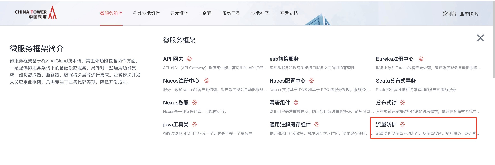

二、在能力信息页面点击"申请"按钮

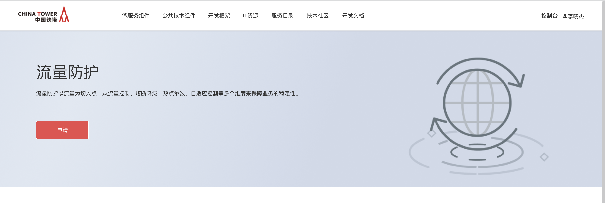

三、填写具体申请信息后提交申请

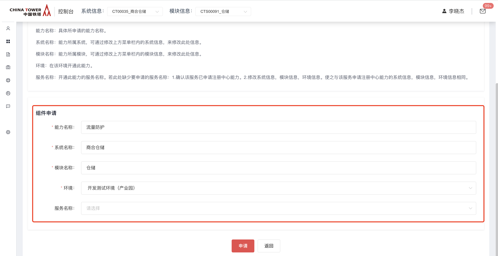

四、能力申请并通过审批后，登录技术中台后，选择“我的能力”左侧导航菜单，右侧主内容区域选择“微服务组件”，能力类型选择为“流量防护”，即可查看申请好的能力。

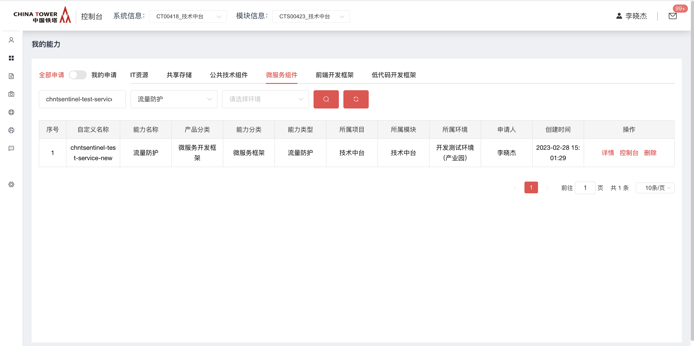

能力详情信息，申请不同环境的能力返回的能力地址不同，以IDC举例

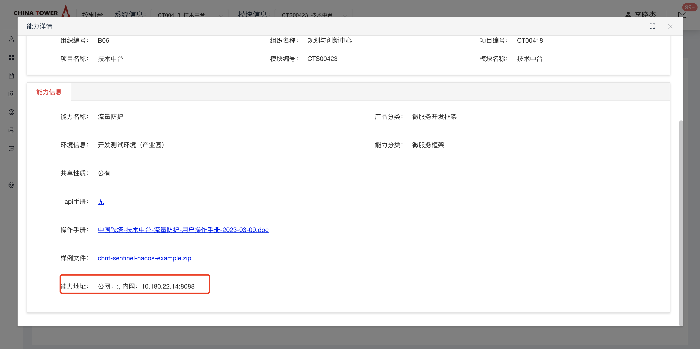

## 操作指南

在我的能力，选择流量防护能力后，操作栏点击"控制台"即可跳转到流量防护能力控制台。在流量防护控制台，根据不同的控制维度划分成多个tab，主要是针对各类规则的配置，另外也可查看实时监控来了解规则配置后产生的实时效果。

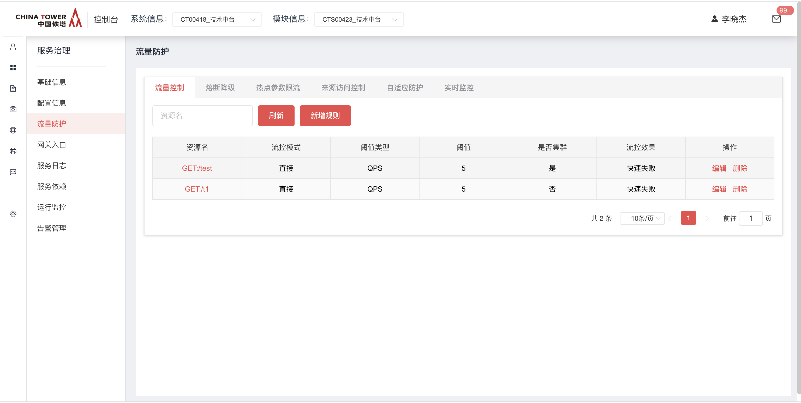

### 一、流量控制

流量控制可以根据QPS或并发线程数对接口的访问进行控制，超过配置的最大阈值则调用者的请求会被拒绝并返回http状态码429。根据QPS进行限流时，还可支持"预热启动"的流控效果

**新增规则**

根据QPS限流，快速失败

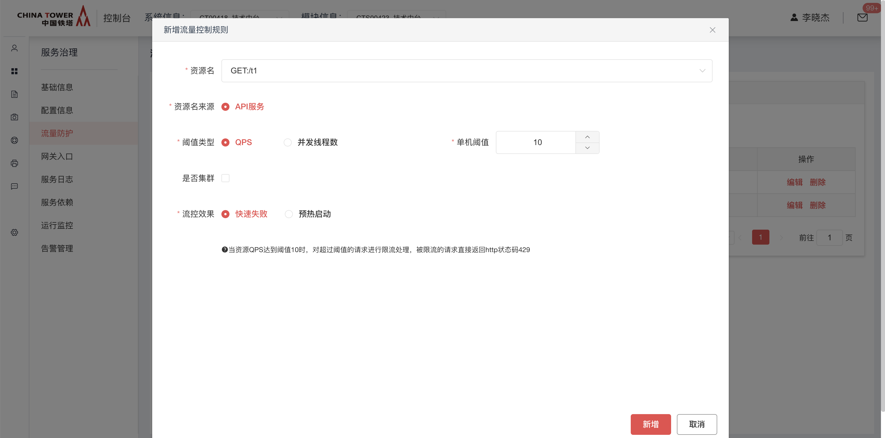

根据QPS限流，预热启动，当QPS处于较低值而请求量突然增大时，则在设置的预热时间内，逐渐将允许的最大QPS增加至设置的最大阈值

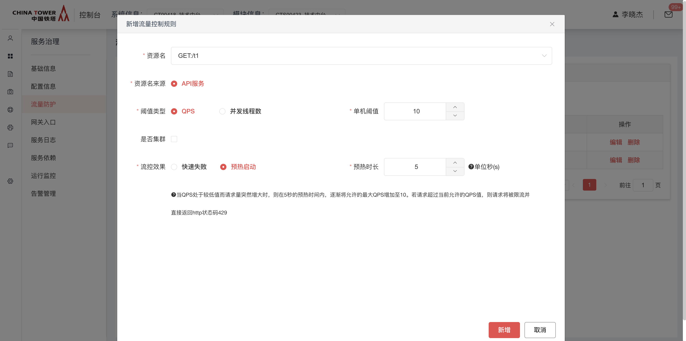

**编辑规则**

在规则列表中，操作栏选择"编辑"，则可对已有规则进行编辑，规则编辑后实时生效

**删除规则**

在规则列表中，操作栏选择"删除"，则删除已有规则，删除后规则立刻失效

**集群流控**

新增或者编辑规则时，可以勾选"集群"复选框，集群模式下使用均摊阈值，即：当资源QPS达到设置的阈值最大值 / 服务实例数时，才进行限流。

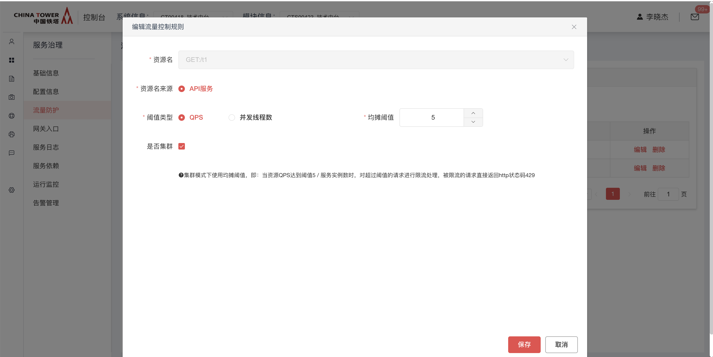

### 二、熔断降级

当调用的外部资源出现不稳定，例如，表现为 timeout，异常比例升高的时候，则对这个资源的调用进行限制，并让请求快速失败，避免影响到其它的资源，最终产生雪崩的效果。

**新增规则**

支持三种熔断策略：慢调用比例、异常比例、异常数，不通策略配置参数不同，可参考下面的实例配置。

*熔断策略：慢调用比例*

根据调用的接口出现*慢点用的比例*进行熔断，超过配置的最大响应时间即为慢调用

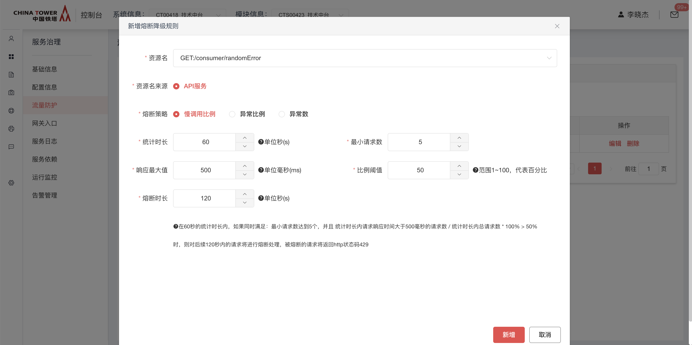

*熔断策略：异常比例*

根据调用的接口出现*异常的比例*进行熔断，异常判定：接口未返回http状态码200，如：出现500状态码、401未授权状态码等情况，错误则认为是异常调用

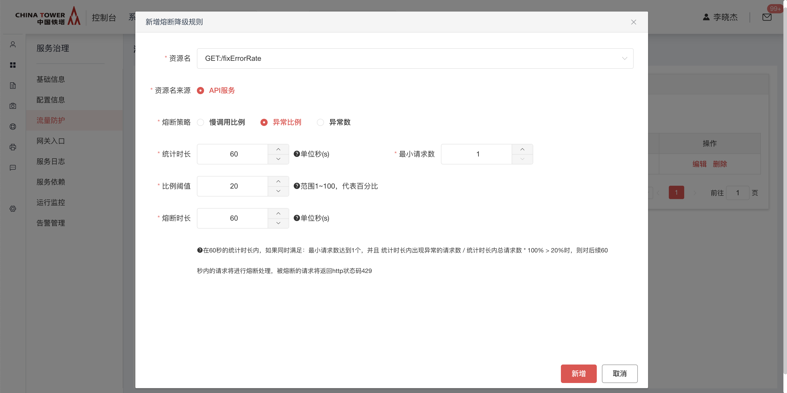

*熔断策略：异常数*

根据调用的接口出现*异常的数量*进行熔断，对异常的判定同异常比例

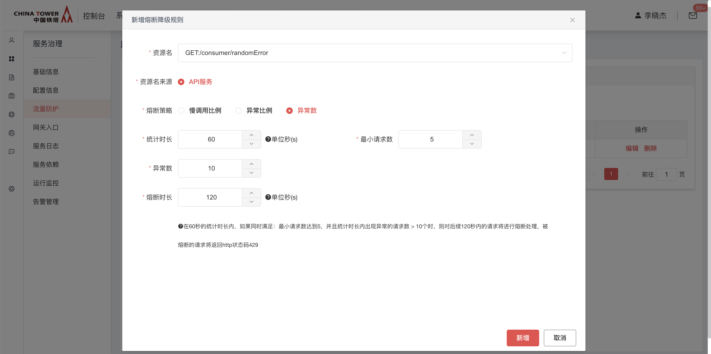

**编辑规则**

在规则列表中，操作栏选择"编辑"，则可对已有规则进行编辑，规则编辑后实时生效

**删除规则**

在规则列表中，操作栏选择"删除"，则删除已有规则，删除后规则立刻失效

### 三、热点参数限流

热点参数限流会统计传入参数中的热点参数，并根据配置的限流阈值与模式，对包含热点参数的资源调用进行限流。热点参数限流可以看做是一种特殊的流量控制，仅对包含热点参数的资源调用生效。

**新增规则**

支持两种参数类型

**URL参数**：请求参数为普通url参数或表单参数，根据参数名进行规则配置
 **JSON参数**：请求参数类型为application/json时，可根据json路径作为参数名进行规则配置

参数类型为URL参数时输入参数名，如：id； 当类型为JSON参数时输入json key，多层级用"."分割，如：user.username

*URL参数*

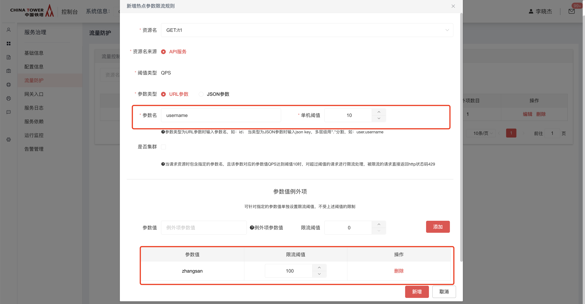

可以在高级选项中配置参数值例外项，如上图的配置：当username参数值为zhangsan时，最大qps允许为100，其余参数值最大qps允许为10

*JSON参数*

>[!NOTE]
>
>业务端需修改application.yaml配置文件，开启对该功能的支持

```yaml
chinatower:
  sentinel:
    client:
      paramFlowJsonEnable: true         # 开启热点参数限流对JSON参数类型的支持
```

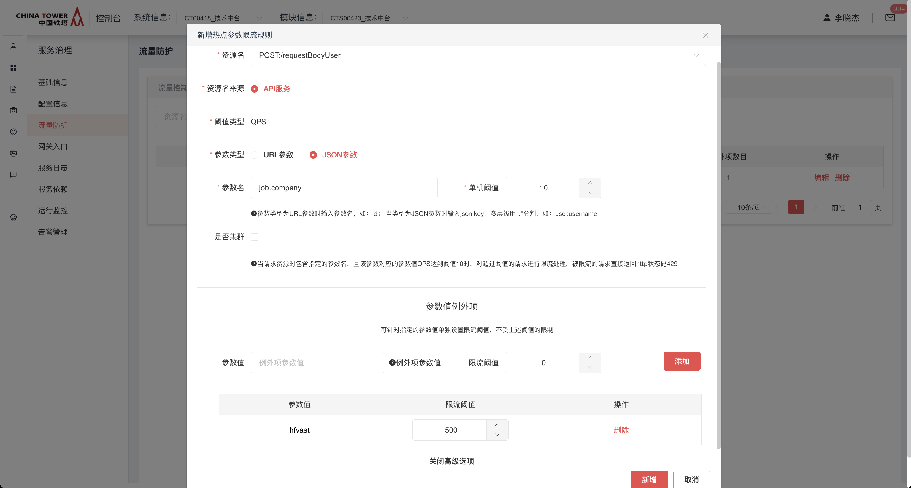

例子：对应的controller和参数类

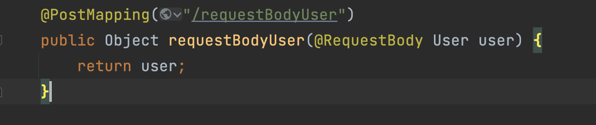

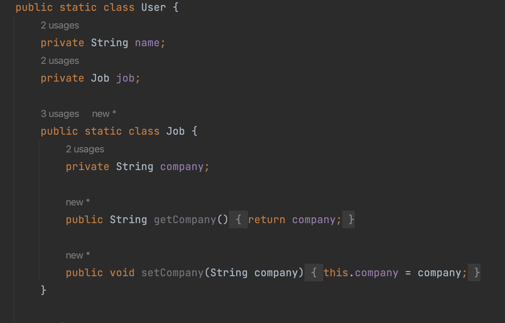

**编辑规则**

在规则列表中，操作栏选择"编辑"，则可对已有规则进行编辑，规则编辑后实时生效

**删除规则**

在规则列表中，操作栏选择"删除"，则删除已有规则，删除后规则立刻失效

### 四、来源访问控制

根据请求调用方的IP或IP网段进行判断，决定允许请求通过还是拒绝请求

支持两种授权类型

**黑名单**：调用方IP地址或网段处于黑名单时，请求将被拒绝并返回http状态码429。
 **白名单**：调用方IP地址或网段处于白名单时，才允许请求通过，不在白名单时请求将被拒绝并返回http状态码429。

注意，当黑白名单同时配置时，先判断黑名单再判断白名单

**新增规则**


**编辑规则**

在规则列表中，操作栏选择"编辑"，则可对已有规则进行编辑，规则编辑后实时生效

**删除规则**

在规则列表中，操作栏选择"删除"，则删除已有规则，删除后规则立刻失效

### 五、自适应防护

对应用级别的入口流量进行控制，以下情况将触发自适应防护：

1. 当前系统负载 > cpu核数 *2.5，且当前并发请求线程数 > 入口总QPS最大值*入口请求最小响应时间；
2. 系统cpu使用率 > 80%；
3. 入口总QPS大于300；


触发上述规则的请求，将被拒绝处理并返回http状态码429

**开启规则**

默认为关闭状态，单选按钮选择为开启后点击保存则开启自适应防护，开启后实时生效

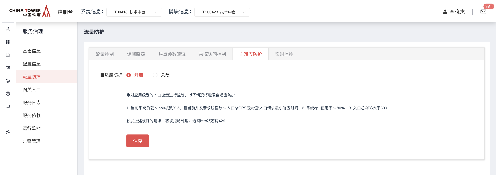

**关闭规则**

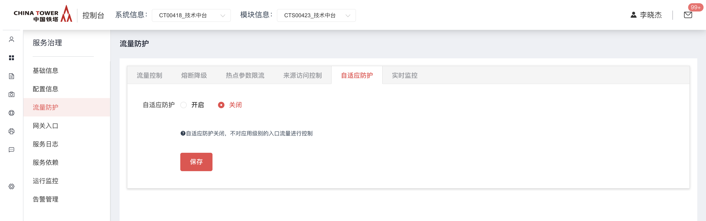

### 六、实时监控

实时监控统计了业务端微服务接口流量的相关指标，可根据实例（ip:port）、资源名、时间范围进行筛选查看

**总览**

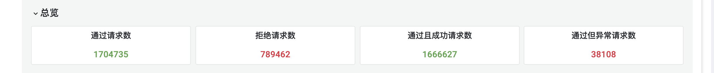

**请求数趋势**

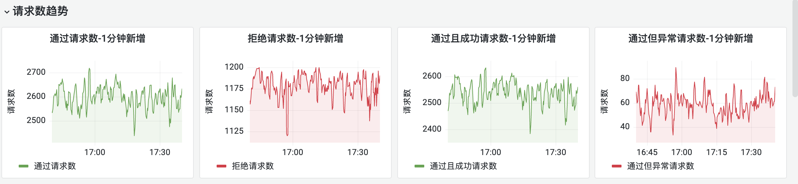

**QPS**

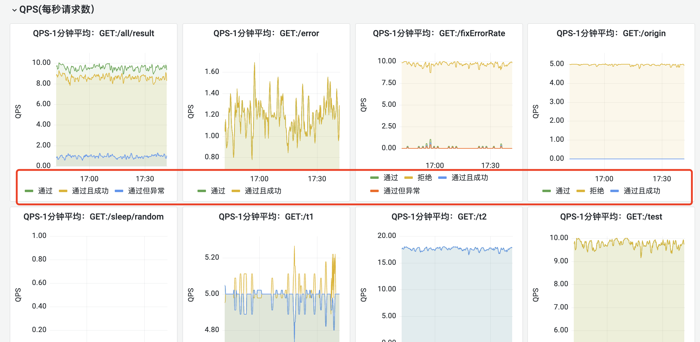

**请求拒绝情况**

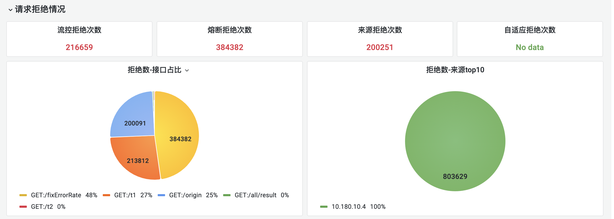

**请求排序**

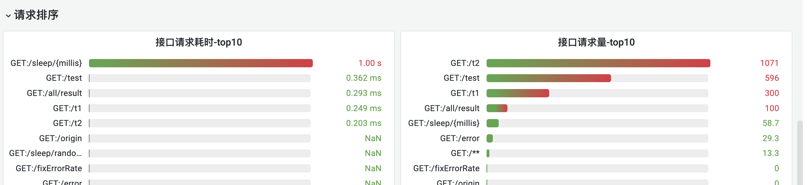

## 典型实践

### 规则下发

**实时下发** 在技术中台配置流量防护各类规则后，会通过starter端提供的/sentinel接口实时下发到业务端，如果业务端对接口访问有额外的权限验证，如：使用了spring  security，请确保/sentinel开头的接口能够被正常访问，可考虑将/sentinel前缀作为白名单地址避免请求被拦截。/sentinel相关接口内部有鉴权逻辑， 业务端不必担心该接口的安全性问题。

**主动轮询** starter会定时向流量防护服务端轮询最新的流量防护规则，默认时间30s，可通过以下配置修改

```yaml
chinatower:
  sentinel:
    client:
      refreshRulesMillis: 30000  # 单位毫秒
```

### 鉴权

>[!NOTE]
>
>集成流量防护starter后，将提供若干/sentinel开头的http接口用于接收流量防护服务端下发的各类流量防护规则， 规则下发时starter使用nacos注册中心的access-key 或者 eureka注册中心authToken进行鉴权，

使用nacos注册中心时，需确保nacos已经正确配置，示例配置：

```yaml
spring:
  application:
    name: your-application-name
  cloud:
    nacos:
      discovery:
        access-key: 4dc8d401b0ba7dbca99a3a44c0719689
```

使用eureka注册中心，则需要确保authToken正确配置

```yaml
spring:
  application:
    name: your-application-name
eureka:
  client:
    authToken: 31056a688fe6de9f2d606f0ced5b26c8
```

流量防护starter也会定时向流量防护服务端轮询最新规则，也是通过传递nacos注册中心的access-key进行鉴权，同样需要确保nacos已经正确配置

## API参考

无

## SDK

maven引入sentinel-starter

```xml
<dependency>
    <groupId>com.chinatower.cloud</groupId>
    <artifactId>spring-cloud-starter-chinatower-sentinel</artifactId>
</dependency>
```

常用的配置项如下，配置文件也可在样例工程中获取

```yaml
spring:
  application:
    name: sentinel-example
    syscode: chnttest
  cloud:
    nacos:
      discovery:
        server-addr: 10.180.22.20:8848
        access-key: 53eaa438054cc4fcc57419a5fe5aa787
    sentinel:
      transport:
        dashboard: 10.180.22.14:8088    # sentinel服务端地址，设置为能力申请通过后，能力详情页面中的地址
      log:
        dir: /app/logs/sentinel-example # sentinel相关日志目录，按需要设置为与服务logback日志相同位置即可，一般是/app/logs/系统编码
      httpMethodSpecify: true           # 固定配置，不要修改
      filter:
        order: -2147483638              # 固定配置，不要修改
```

## 网络要求

### 网络打通

- 打通业务微服务到流量防护服务端内网地址，地址信息可在能力申请通过后的能力详情页查看

## 常见问题

### 1) 点击流量防护菜单提示如下错误

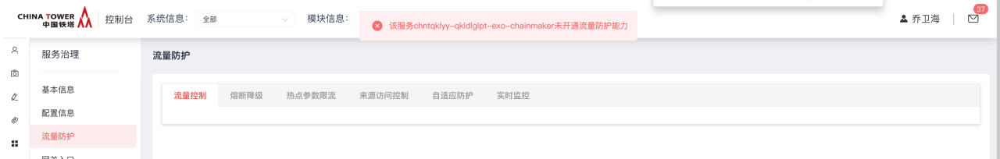

解决：需要申请流量防护能力，并审批通过

## 样例文件

 [example(4).zip](../file/example(4).zip) 

