# Nginx组件

2023年5月

## 1. 版本说明

| 技术中台版本号 | nginx开源版本 | 集成lua版本号 | 备注        |
| -------------- | ------------- | ------------- | ----------- |
| 20231205       | 1.23.3        | luajit2.1     | 推荐版本    |
| 20231124       | 1.23.3        | luajit2.1     |             |
| 20230821       | 1.23.3        | -             | 支持centos6 |
| 20230629       | 1.23.3        | luajit2.1     |             |
| 20230522       | 1.23.3        | luajit2.1     |             |

**信创版本兼容性说明**

目前Nginx已在 `Kylin Linux Advanced Server V10 (Azalea)` 操作系统进行过稳定性测试，其他版本未进行验证。 请在服务器上执行 `nkvers` 命令查询操作系统版本。

**内置module说明**

```bash
--with-threads \
--with-file-aio \
--with-http_ssl_module \
--with-http_v2_module \
--with-stream \
--with-http_sub_module \
--with-http_auth_request_module \
--with-http_stub_status_module \
--with-http_realip_module \
--with-debug \
--with-http_gzip_static_module \
--with-http_realip_module \
--with-openssl=../openssl-1.1.1t \
--add-module=../nginxModule/nginx-module-vts-0.2.1 \
--add-module=../nginxModule/ngx_devel_kit-0.3.1 \
--add-module=../nginxModule/lua-nginx-module-0.10.24 \
--add-module=../nginxModule/nginx-sticky-module \
--add-module=../nginxModule/echo-nginx-module-0.63 \
--prefix=/app/data/nginx-1.23.3
```

## 2. 功能发布记录

| 日期       | 版本             | 变更说明                                                | 作者   | 升级方式                                                     |
| ---------- | ---------------- | ------------------------------------------------------- | ------ | ------------------------------------------------------------ |
| 2023-05-08 | 1.23.3/luajit2.1 | 初始版本                                                | 关启芃 |                                                              |
| 2023-05-22 | 1.23.3/luajit2.1 | 部署包结构变更                                          | 关启芃 |                                                              |
| 2023-09-05 | 1.23.3/luajit2.1 | 增加cookie粘连策略和真实IP设置，同时支持Centos6操作系统 | 关启芃 |                                                              |
| 2023-11-24 | 1.23.3/luajit2.1 | 隐藏nginx主版本号增加安全性                             | 关启芃 | 杀掉nginx进程，替换nginx-1.23.3/sbin/nginx文件，启动nginx进程 |
| 2023-12-05 | 1.23.3/luajit2.1 | 上游分流页面功能支持灰度发布                            | 关启芃 | 结束nginx-agent进程,替换agent/chinatower-nginx-agent-1.0.0-SNAPSHOT.jar文件，启动nginx-agent |

### 2.1. 审阅人

## 3. 重要通知

暂无

## 4. 组件描述

### 4.1. 组件建设目标

增加nginx管理手段，快速使用，快速接入，支持信创

### 4.2. 读者

应用系统维护人员

### 4.3. 参考资料

http://nginx.org/en/docs/

https://github.com/openresty/lua-nginx-module

### 4.4. 术语定义

| 序号 | 简称/术语 | 说明                                                         |
| ---- | --------- | ------------------------------------------------------------ |
| 1    | nginx     | Nginx是一款轻量级的Web 服务器/反向代理服务器及电子邮件（IMAP/POP3）代理服务器 |
| 2    | lua       | Lua是一种轻量小巧的脚本语言,它由标准的C语言编写并且是开源的  |

### 4.5. 适用范围

- 静态文件服务：Nginx在提供静态资源服务方面效率很高，可以快速的响应大量的静态请求，减轻其他动态服务器的负担，如CSS、JavaScript、Image、Audio和Video文件等
- 反向代理和负载均衡：Nginx可以作为反向代理服务器，通过优化请求的分配和处理方式，可以平均分配后端服务器的负载，提高系统的可用性和可靠性，使其更稳定
- 访问控制和安全：Nginx可以使用访问控制、基于IP地址的访问限制等来提高服务器的安全性，有效保护Web应用程序和服务器

## 5. 快速入门

### 5.1. 私有虚机版

- 申请
  - 在技术中台申请nginx组件私有版，部署场景选择虚机版，容器版暂不支持纳管，申请通过后，下载私有版部署包

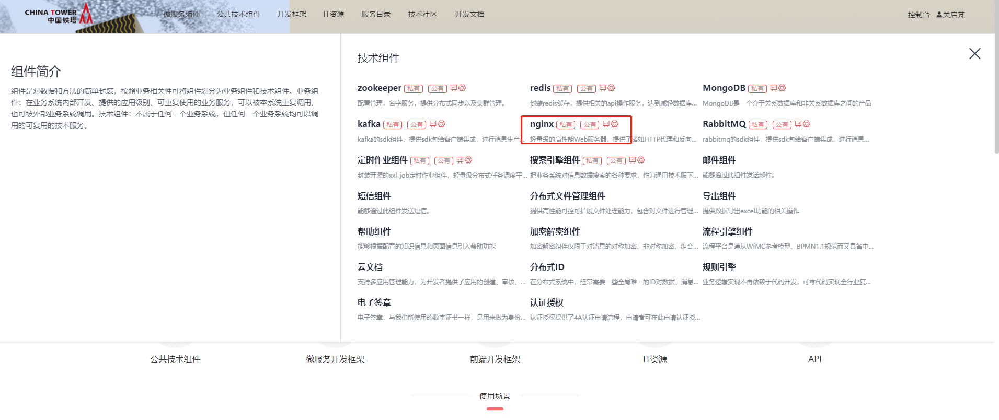

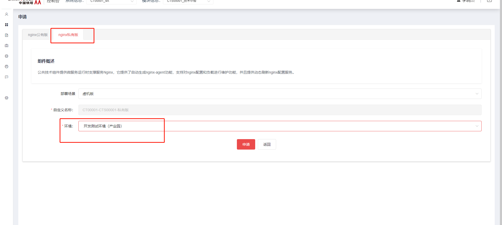

### 5.2. 公有版

暂无

## 6. 操作指南

### 6.1. 私有虚机版功能介绍

#### 6.1.1. 部署包下载

- 主版本

  [点击下载](http://10.38.77.5:8081/repository/raws/chntjstz/zjh/nginx/nginx-1.23.3-2.1-20231205.tar.gz)  [nginx-1.23.3-2.1-20231205.tar.gz](../file/nginx-1.23.3-2.1-20231205.tar.gz) 

- centos6操作系统环境（不支持lua脚本）

  [点击下载](http://10.38.77.5:8081/repository/raws/chntjstz/zjh/nginx/nginx-1.23.3-centos6-20230821.tar.gz)  [nginx-1.23.3-centos6-20230821.tar.gz](../file/nginx-1.23.3-centos6-20230821.tar.gz) 

#### 6.1.2. 部署包内容

部署包根路径


agent路径下

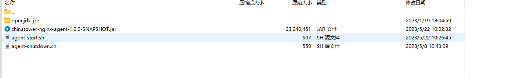

nginx-1.23.3路径下


- nginx1.23.3

  可直接运行的nginx软件包, 软件相关脚本在sbin/文件夹下

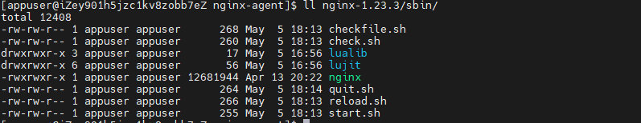

- agent/chinatower-nginx-agent*.jar

  nginx代理jar包，支持nginx软件包的功能管理

- agent/openjdk-jre

  nginx代理jar包依赖的运行时,基于jdk8

- agent/agent-start.sh

  nginx代理jar包启动脚本, 默认启动端口18989,支持变更端口

```shell
sh agnent-start.sh 16666
```

- agent/agent-shutdown.sh

  nginx代理jar包结束进程脚本，默认结束进程端口18989，支持变更端口

```shell
sh agent-shutdown.sh 16666
```

- 部署
  - 执行nginx1.23.3/sbin/下start.sh脚本
  - 执行agent/agent-start.sh脚本

>[!NOTE]
>
>nginx1.23.3/conf/nginx.conf文件夹的配置默认自带 `19989` 端口监听，用于nginx代理jar包对nginx程序的指标监控采集，此端口是基于代理jar包默认端口 `18989+1000` ,如果启动agent-start.sh脚本时变更默认端口，需要依照代理jar包启动端口号加1000的原则同步修改nginx.conf配置
>
>  `http {  include mime.types;  default_type application/octet-stream;  #access_log  logs/access.log  main;  vhost_traffic_status_zone;  sendfile on;  #tcp_nopush     on;  #keepalive_timeout  0;  keepalive_timeout 65;  #gzip  on;  server {    #AGENTCREATE;    listen 19989;    server_name localhost;    #charset koi8-r;    #access_log  logs/host.access.log  main;    location / {      #AGENTCREATE type static;      #AGENTCREATE id w5s20fd5;      root html;    }    location /status {      vhost_traffic_status_display;      vhost_traffic_status_display_format html;    }    #location = /50x.html {    #  root html;    #}    #error_page  404              /404.html;    # redirect server error pages to the static page /50x.html    #error_page 500 502 503 504 404 /50x.html;  } }`

- 纳管
  - 在技术中台我的能力nginx组件控制台中的nginx节点管理中添加部署IP和agent-start.sh的启动端口
  - 保证网络可达

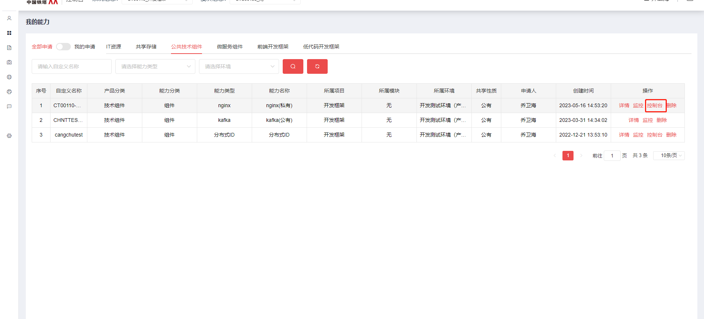

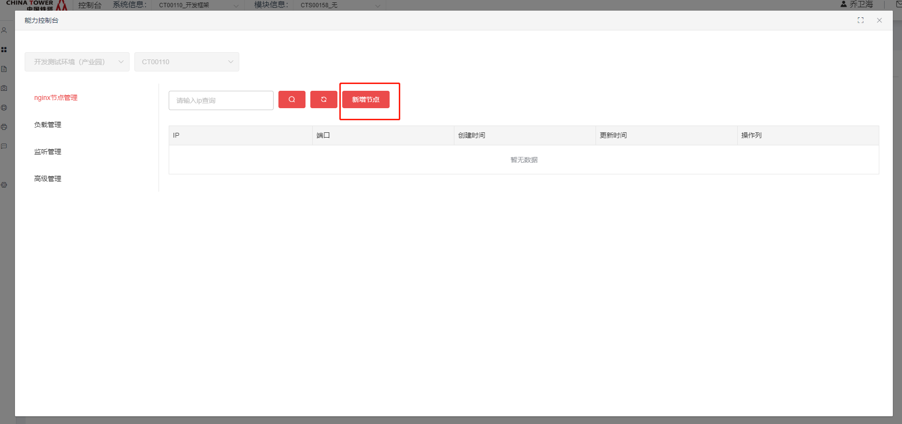

>[!NOTE]
>
>在nginx代理纳管后的使用过程中，需要在nginx所在文件下创建临时文件，所以需要启动nginx代理jar的用户对该文件夹有读写权限

- nginx节点管理

  用于纳管nginx管理节点

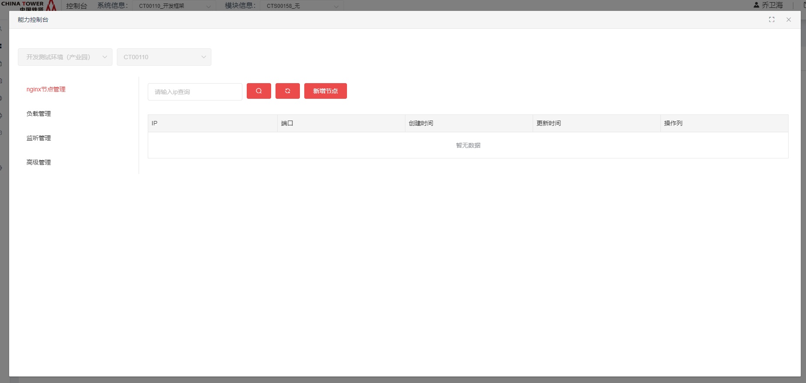

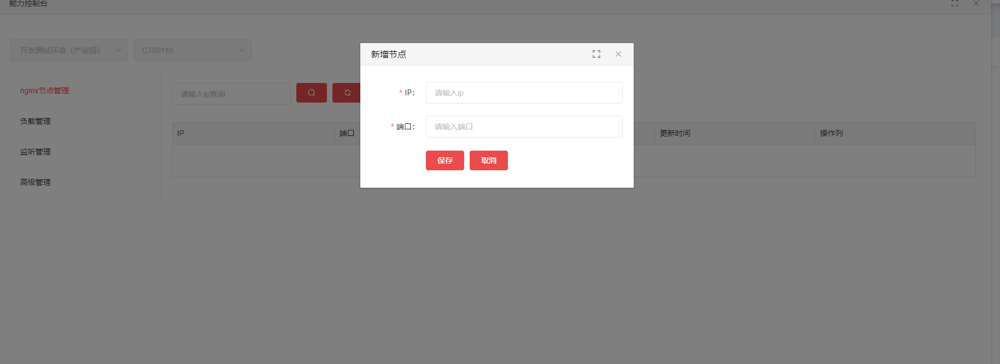

- 负载管理

  对nginx节点的下游负载的管理，支持配置轮询、轮询权重、ipHash等负载策略，主要基于nginx配置的upstream block。

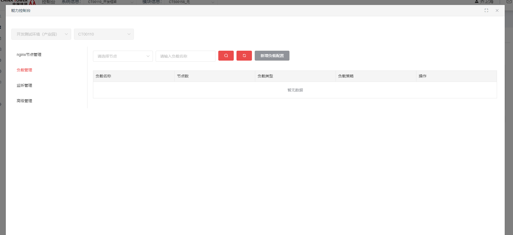

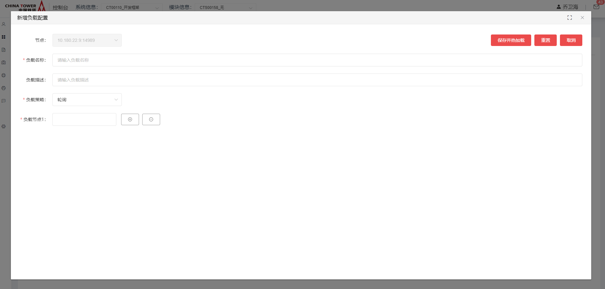

- 监听管理

  对nginx节点的端口监听的管理，提供下游负载、下游分流、静态映射、静态分流、跳转、跳转分流等场景配置；主要基于nginx配置的server block以及location block。

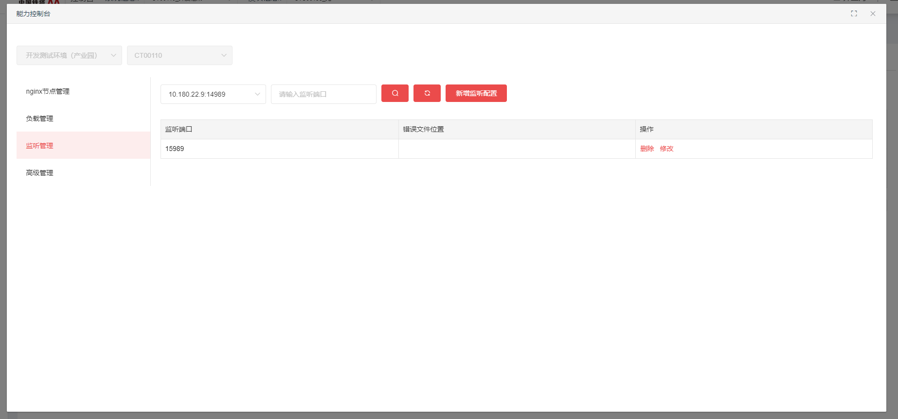

>[!Caution]
>
>正常情况下nginx节点默认携带一个默认监听，此监听用于监控使用，`勿动`

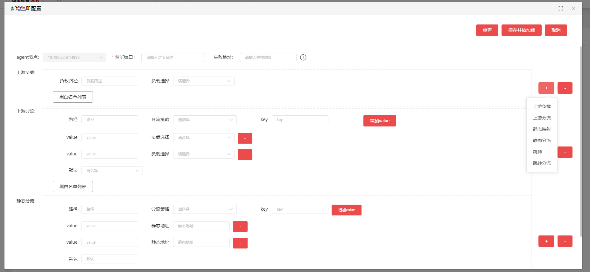

- 高级管理

  对nginx节点的原生配置的管理，可在线编辑nginx节点的配置并支持热加载。

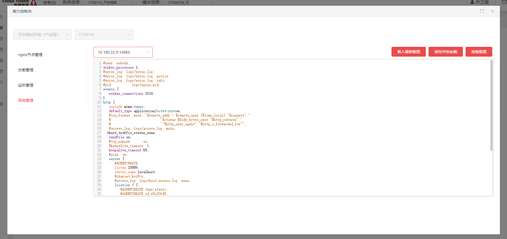

|      | 当前版本代理程序不支持nginx配置文件中存在 `带引号的正则表达式` ，在本地或线上修改配置时应该避免这种情况  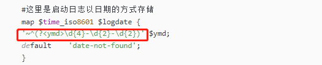 |
| ---- | ------------------------------------------------------------ |
|      |                                                              |

|      | 如果配置文件中的配置块中存在 `#AGENTCREATE` 开头的注释，该注释表示此配置块由agent生成，请不要修改该配置块  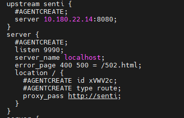 |
| ---- | ------------------------------------------------------------ |
|      |                                                              |

- 监控

  支持nginx节点的网络连接、上游QPS、上游访问处理时长以及访问错误数的监控。

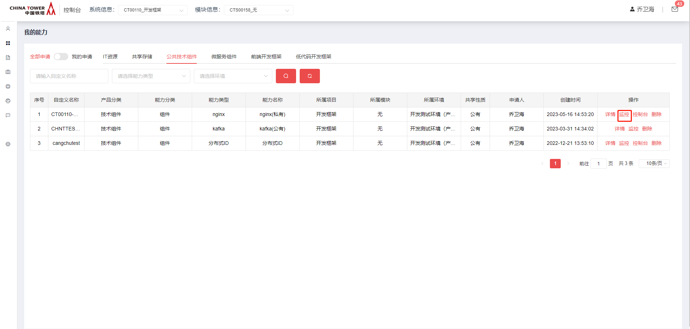 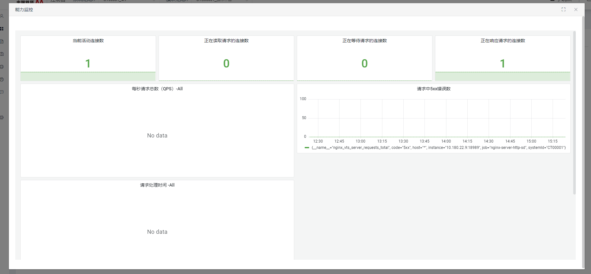

### 6.2. 监听路径配置使用场景介绍

- 上游负载

  提供负载均衡能力配置，根据匹配的访问路径，动态负载到上游服务

- 上游分流

  支持负载均衡能力的业务分流，提供cookie等分流策略，根据分流策略访问对应的上游负载，默认支持灰度发布，适用于服务端蓝绿发布、A\B测试

- 静态映射

  根据匹配的访问路径，映射到本地的文件目录，适用于Vue静态包部署场景

- 静态分流

  支持静态映射能力的业务分流，提供cookie等分流策略，根据分流策略访问对应的静态目录，适用于Vue静态部署蓝绿发布、A\B测试

- 跳转

  根据匹配的访问路径，跳转到指定的URI，默认状态码302

- 跳转分流

  支持跳转能力的业务分流，提供cookie等分流策略，根据分流策略跳转到对应的URI

### 6.3. 公有版功能介绍

暂无

### 6.4. 统一部署方案

在技术中台申请nginx组件后，前往我的能力，找到对应的能力，点击详情页面，点击下载高可用部署文档。

## 7. API参考

无

## 8. SDK

无

## 9. 网络要求

### 9.1. 私有虚拟版网络打通

- 单向打通nginx到业务服务的网络
- 单向打通nginx管理端到业务服务nginx节点的网络
- 单向打通Prometheus到业务服务nginx节点的网络
- Nginx搭配F5使用Cookie分流策略时请要求网络组配置F5下游可以获取客户端真实ip

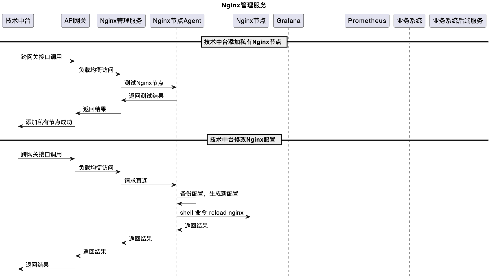

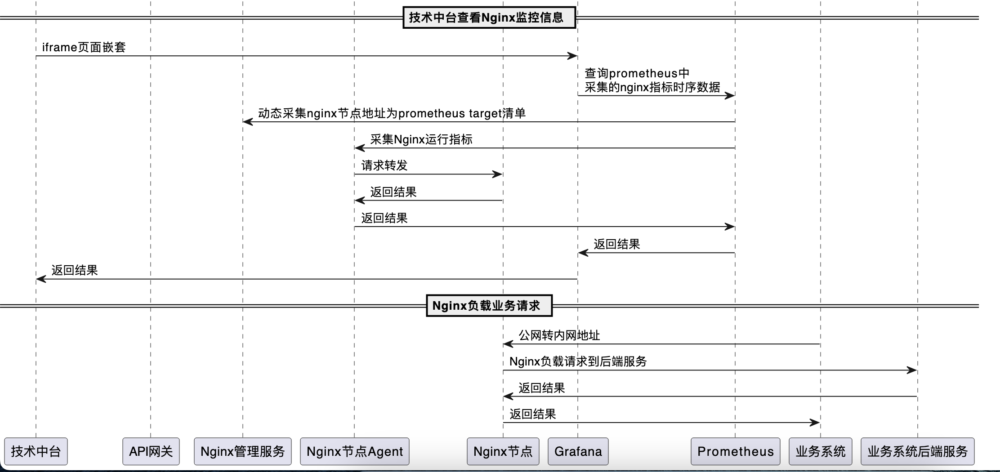