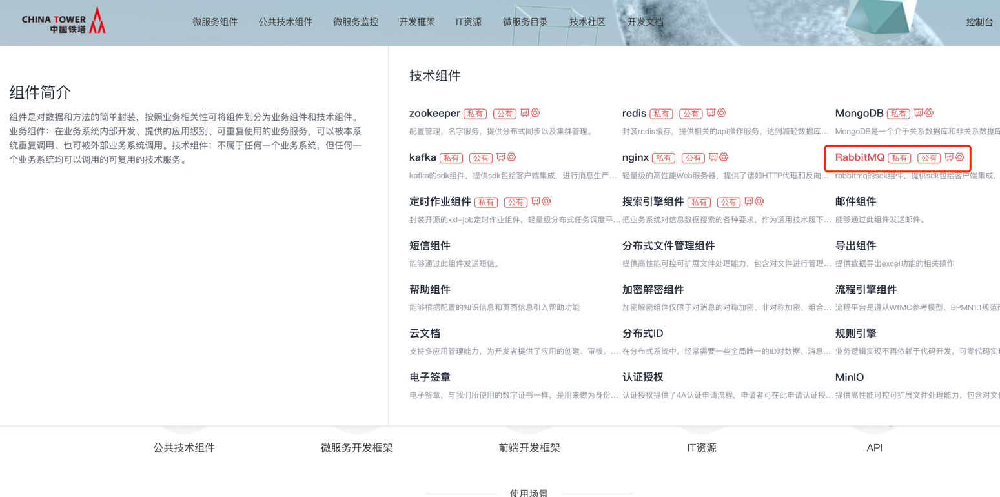
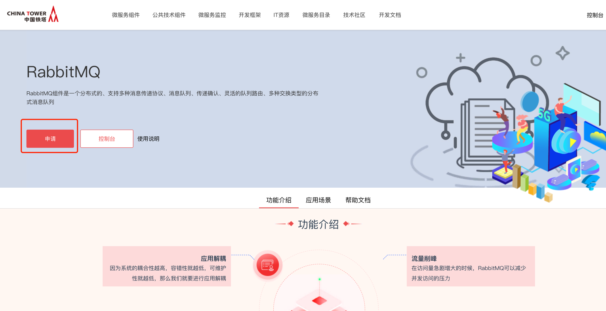
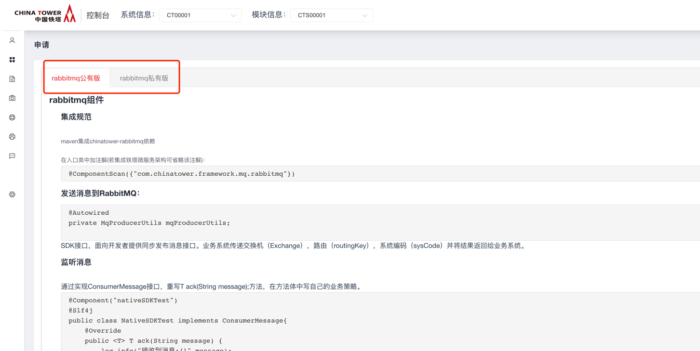
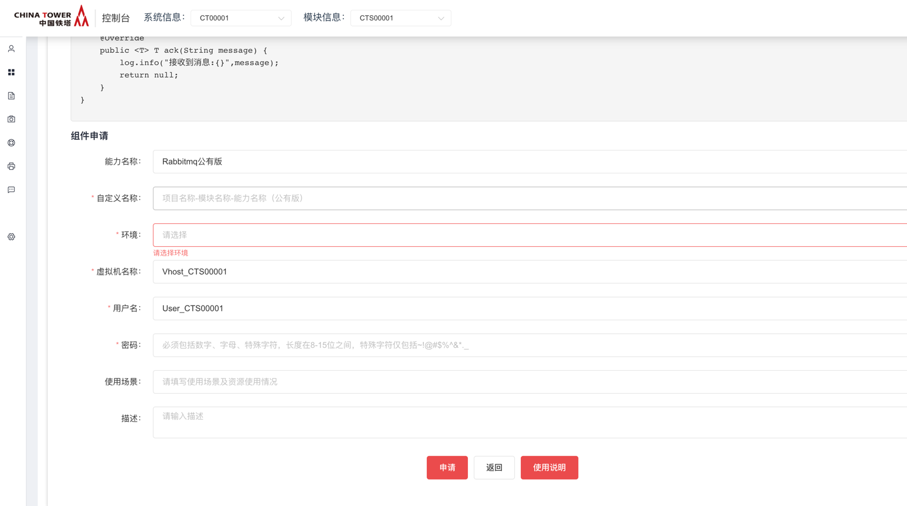
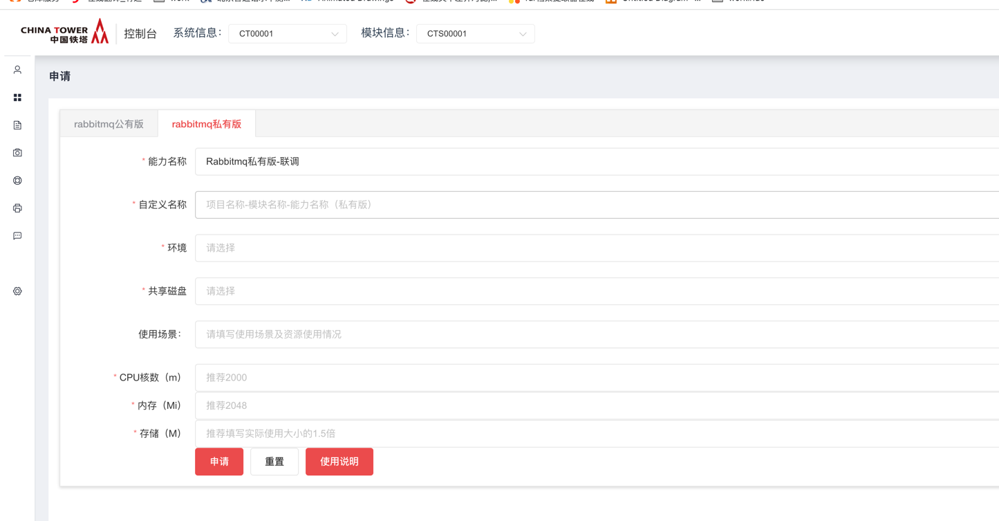
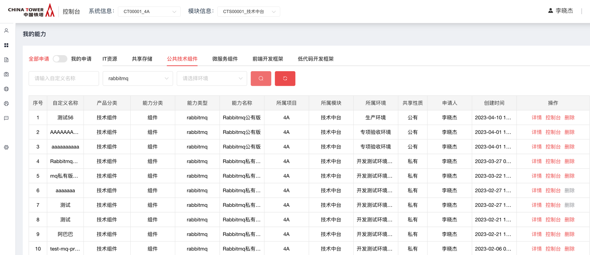

# RabbitMq

2019年5月

## 开源版本说明

| 版本名   | 版本   | 说明 |
| -------- | ------ | ---- |
| rabbitMq | 3.6.15 |      |

## 功能发布记录

| 日期       | 版本  | 变更说明                                    | 作者   |
| ---------- | ----- | ------------------------------------------- | ------ |
| 2019-8-15  | 1.0   | 初始版本                                    | 郝世崇 |
| 2019-9-10  | 1.2   | 数据库同步版本                              | 郝世崇 |
| 2019-10-21 | 1.2.1 | 1、可自定义异常2、性能优化  3、自动加载文件 | 郝世崇 |
| 2019-12-6  | 1.3   | Springboot版本                              | 郝世崇 |

### 审阅人

## 重要通知

暂无

## 组件描述

目前中国铁塔 IT 信息系统已经规模很大，各系统间有着很多交互，为了使系统间的相互调用更优雅，对系统无侵入，不对现有结构造成冲击，需要引入连接各系统的介质：分布式消息中间件。 RabbitMQ是实现了高级消息队列协议（AMQP）的开源消息代理软件（亦称面向消息的中间件）

## 快速入门

### 组件申请

仅允许铁塔自有人员申请。

消费者登录技术中台首页，选择公共技术组件，点击RabbitMQ。

点击申请

根据使用需要，选择私有版申请或公有版申请

公有版申请时，根据系统及模块，填写申请单，点击申请即可。

私有版申请时，需要用户带着三台已纳管caas的机器，然后依据集群的内存及cpu大小，填写申请单，一般容器占用机器的 1/2 cpu内存即可，其他信息如实填写即可。

申请完毕后，依据能力地址通过sdk链接使用即可

## 操作指南

登录技术中台后，选择“我的能力”左侧导航菜单，右侧主内容区域选择“公共技术组件”，能力名称为"rabbitmq"，操作一栏选择“详情”，即可获取rabbitmq地址。

## 典型实践

详见 [样例文件](http://mid.chinatowercom.cn:18080/docs/chinatower-component/v1.0/module/RabbitMq.html#rabbitMq01)

## API参考

无

## SDK

暂无

## 网络要求

### 网络打通

- 双向打通业务微服务到rabbitMq能力地址的网络。

## 常见问题

### 1.无法正常消费或生产消息

使用telnet检查网络是否已通，主题名是否正确，rabbitmq地址配置是否有误.

## 样例文件

 [chinatower-rabbitmq-demo.zip](../file/chinatower-rabbitmq-demo.zip) 