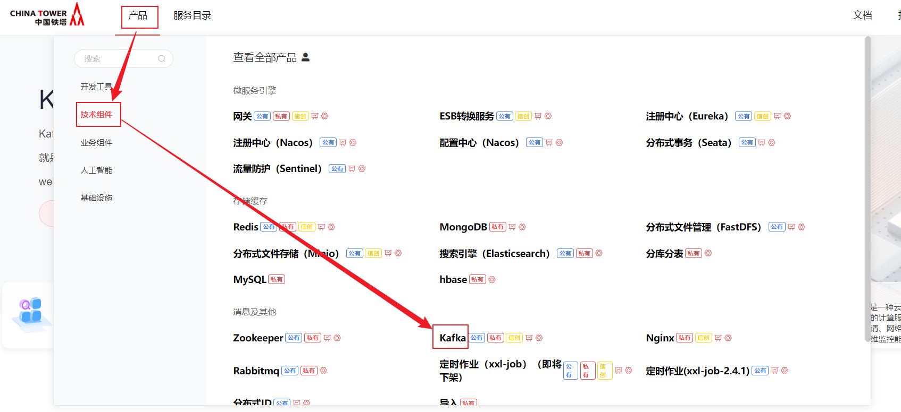
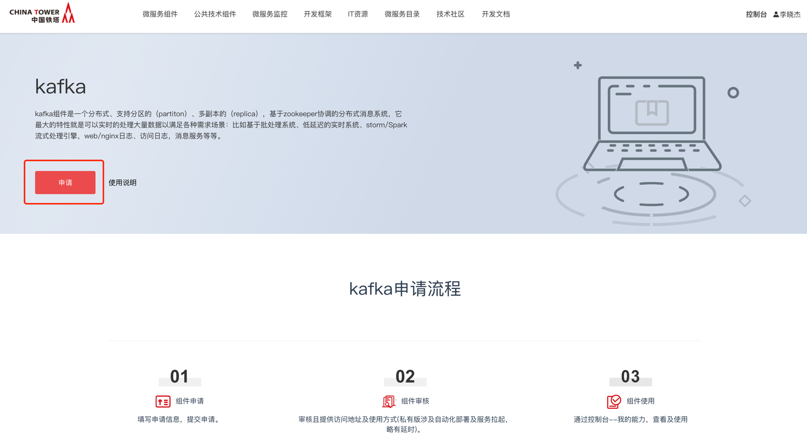
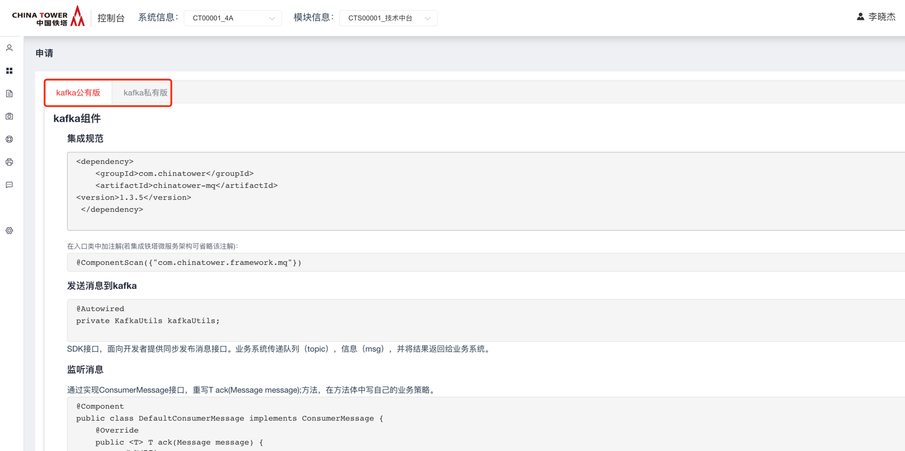
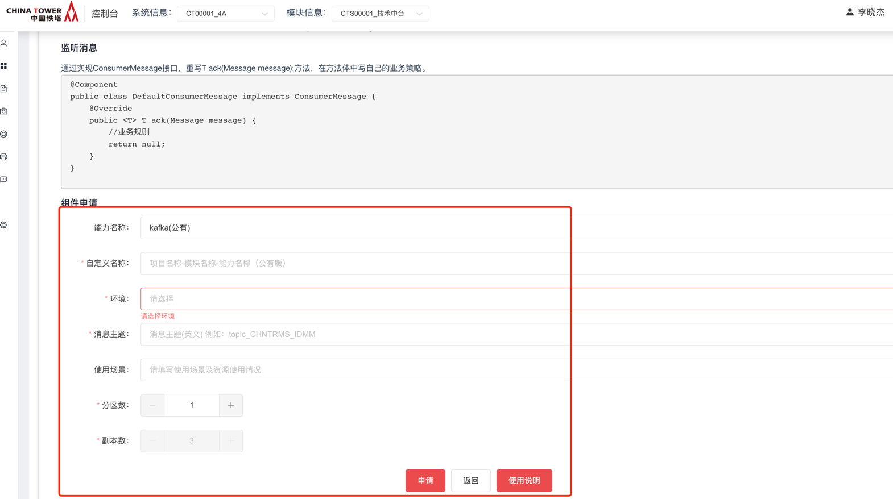
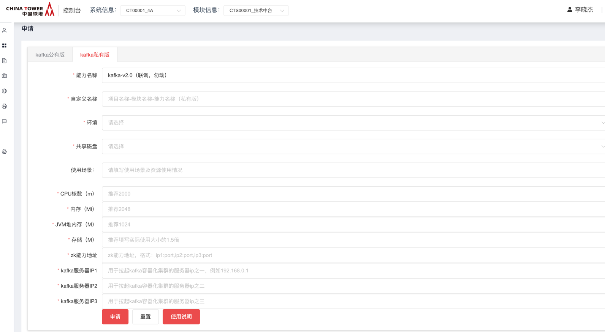
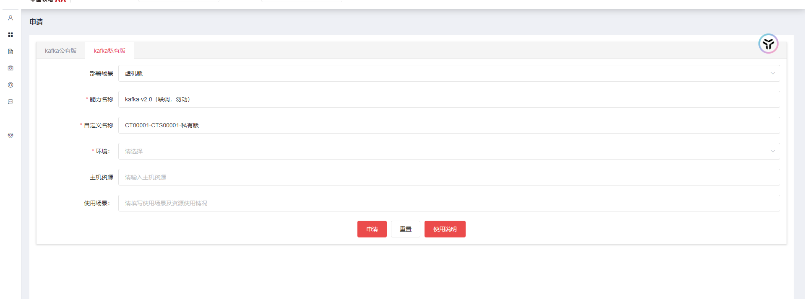
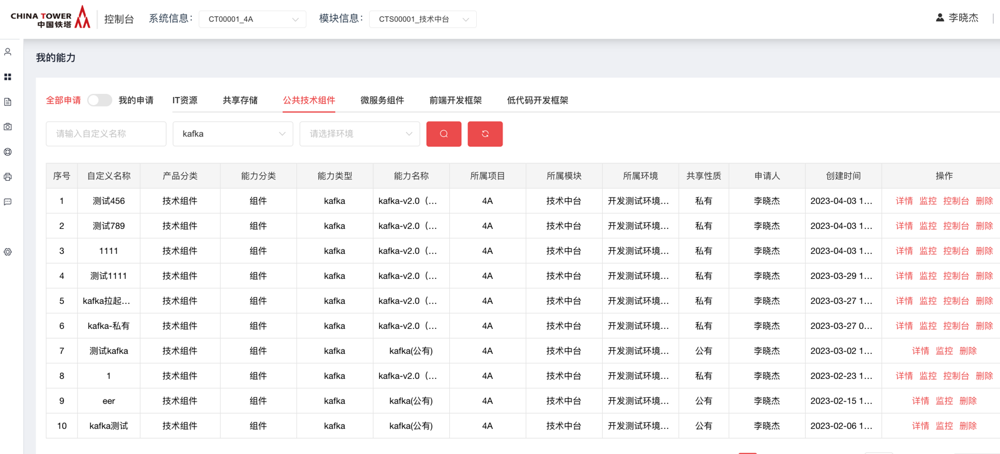
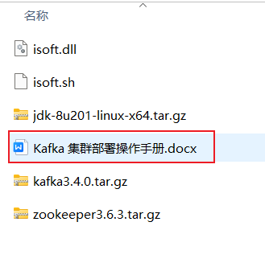

# kafka

## 开源版本说明

| 版本名 | 版本  | 说明 |
| ------ | ----- | ---- |
| kafka  | 1.1.0 |      |

## 功能发布记录

| 日期       | 版本  | 变更说明                                      | 作者   |
| ---------- | ----- | --------------------------------------------- | ------ |
| 2019-8-15  | 1.0   | 初始版本                                      | 郝世崇 |
| 2019-9-10  | 1.2   | 数据库同步版本                                | 郝世崇 |
| 2019-10-21 | 1.2.1 | 1、可自定义异常  2、性能优化  3、自动加载文件 | 郝世崇 |
| 2019-12-6  | 1.3   | Springboot版本                                | 郝世崇 |
| 2022-09-06 | 1.5   | Springboot版本升级，由2.0.6升至2.6.1          | 陈孔林 |
| 2024-06-25 |       | kafka 私有虚机版                              | 赵龙   |

### 审阅人

## 重要通知

暂无

## 组件描述

目前中国铁塔 IT 信息系统已经规模很大，各系统间有着很多交互，为了使系统间的相互调用更优雅，对系统无侵入，不对现有结构造成冲击，需要引入连接各系统的介质：分布式消息中间件。 Kafka是一种高吞吐量的分布式发布订阅消息系统，它可以处理消费者在网站中的所有动作流数据。

## 快速入门

### 公有版申请

仅允许铁塔自有人员申请。公有版kafka将会在公共kafka上为用户创建用户所需主题。

消费者登录技术中台首页，依次选择: 产品 → 技术组件 → kafka



点击申请



选择公有版申请



公有版申请时，根据系统及模块，填写申请单，点击申请即可。副本数默认与kafka集群节点数一致。

 申请完毕，运营者审批通过后，可在我的申请单中查看能力地址及主题名称。

### 私有容器版

私有版申请时，需要用户带着三台已纳管caas的机器，然后依据集群的内存及cpu大小，填写申请单，一般容器占用机器的 1/2  cpu内存即可，其他信息如实填写即可，zookeeper能力地址请在申请zookeeper私有版能力后，从zookeeper申请单详情内获取(能力地址)。



申请完毕，运营者审批通过后，可在我的申请单中查看具体能力详情。

### 私有虚机版

- 申请
  - 在技术中台申请 kafka 组件私有版，部署场景选择虚机版，容器版暂不支持纳管，申请通过后，下载私有版部署包
  - 申请时需要选择环境，并填写申请的服务器地址



## 操作指南

### 监控、控制台

登录技术中台后，选择“我的能力”左侧导航菜单，右侧主内容区域选择“公共技术组件”，能力名称为"kafka"，操作一栏选择“详情”，即可获取kafka地址。公有版kafka用户仅有监控，控制台为管理员使用。私有版kafka用户拥有控制台及监控。



### 私有虚机版功能介绍

#### 部署包下载

[kafak 私有虚机版_介质与脚本(kafka_2.13-3.4.0).zip](../file/kafak 私有虚机版_介质与脚本(kafka_2.13-3.4.0).zip) 

#### 基本信息介绍

kafka 版本： kafka_2.13-3.4.0

zookeeper 版本： apache-zookeeper-3.6.3

压缩包内容： 具体安装步骤请参考压缩包内的 《Kafka 集群部署操作手册.docx》



## 典型实践

详见 样例文件

## API参考

无

## SDK

springboot-2.0.6版本

```none
<dependency>
    <groupId>com.chinatower</groupId>
    <artifactId>chinatower-mq</artifactId>
    <version>1.4.0</version>
</dependency>
```

springboot-2.6.1版本

```none
<dependency>
    <groupId>com.chinatower</groupId>
    <artifactId>chinatower-mq</artifactId>
    <version>1.5.0</version>
</dependency>
```

### 生产者引入方式

```none
@Autowired

private KafkaUtils kafkaUtils;
```

### 功能清单

#### 1. 同步发布消息功能

SDK接口，面向开发者提供同步发布消息接口。业务系统传递队列（topic），信息（msg），并将结果返回给业务系统。

请求地址

| 接口类型 | SDK                      |
| -------- | ------------------------ |
| 接口地址 | kafkaUtils. syncSend/[K] |

请求参数

| 参数名称 | 说明           | 约束 | 类型   | 备注 |
| -------- | -------------- | ---- | ------ | ---- |
| Topic    | 主题名（队列） | 必填 | String |      |
| msg      | 信息           | 必填 | String |      |

响应参数

| 参数名称   | 说明      | 类型   | 备注                          |
| ---------- | --------- | ------ | ----------------------------- |
| successful | 成功/失败 | String | 枚举值可参见7.7.1出错信息描述 |

#### 2. 异步发布消息功能

SDK接口，面向开发者提供异步发布消息接口。业务系统传递队列（topic），信息（msg），发布成功后以日志形式反馈给生产系统。

请求地址

| 接口类型 | SDK                       |
| -------- | ------------------------- |
| 接口地址 | kafkaUtils. asyncSend/[K] |

请求参数

| 参数名称 | 说明           | 约束 | 类型   | 备注 |
| -------- | -------------- | ---- | ------ | ---- |
| Topic    | 主题名（队列） | 必填 | String |      |
| msg      | 信息           | 必填 | String |      |

#### 3. 异步批量发布消息功能

SDK接口，面向开发者提供异步批量发布消息接口。业务系统传递队列（topic），信息（List<msg>），发布成功后以日志形式反馈给生产系统。

请求地址

| 接口类型 | SDK                       |
| -------- | ------------------------- |
| 接口地址 | kafkaUtils. batchSend/[K] |

请求参数

| 参数名称 | 说明           | 约束 | 类型         | 备注 |
| -------- | -------------- | ---- | ------------ | ---- |
| Topic    | 主题名（队列） | 必填 | String       |      |
| msg      | 信息           | 必填 | List<String> |      |

#### 4. 自定义过滤规则（选用��

Eg:

```none
@Component

public class CustomFilterImpl implements CustomFilter {

    @Override

    public boolean rule(ConsumerRecord consumerRecord) {

        return false;

    }

}
```

#### 5. 监听消息后的通知

通过实现ConsumerMessage接口，重写T ack(Message message);方法，在方法体中写自己的业务策略。

Eg:

```none
@Component

public class DefaultConsumerMessage implements ConsumerMessage {

    @Override

    public <T> T ack(Message message) {

        //业务规则

        return null;

    }

}
```

#### 6. 发布消息后的控制（选用）

通过实现ProducerHandler接口，实现onSuccess()与onError()方法，在方法体中写自己的操作。

Eg:

```none
@Component
public class ProducerHandlerImpl implements ProducerHandler {
    @Override
    public void onSuccess(ProducerRecord producerRecord, RecordMetadata recordMetadata) {
        log.debug("ProducerHandlerImpl sendTo topic success : {}", producerRecord.toString());
    }
    @Override
    public void onError(ProducerRecord producerRecord, Exception recordMetadata) {
        log.debug("ProducerHandlerImpl sendTo topic error : {}", producerRecord.toString());
    }

}
```

### 集成说明

#### 1. 集成说明

消息队列是面向开发者使用SDK集成的技术组件。要求开发者在项目中引入该组件所生成的jar包。

#### 2. 集成规范

在pom文件中：

```none
<dependency>
    <groupId>com.chinatower</groupId>
    <artifactId>chinatower-mq</artifactId>
    <version>1.4.0</version>
</dependency>
```

在入口类中加注解(若集成铁塔微服务架构可省略该注解)：

```none
@ComponentScan({"com.chinatower.framework.mq"})
```

#### 3. 日志开关

Kafka打印日志过多，建议在集成测试过后，关闭kafka本身的日志

在logback.xml中添加：

```none
<logger name="org.apache.kafka" level="OFF"/>
```

## 网络要求

### 网络打通

- 双向打通业务服务到kafka能力地址的网络。

## 常见问题

### 1.无法正常消费或生产消息

使用telnet检查网络是否已通，主题名是否正确，kafka地址配置是否有误.

### 2. 消息重复消费并伴随error

检查error，mq组件会在调用自定义方法进行消息消费失败捕获到exception后，将消息重新发送至kafka，出现此情况请及时关停消费者并调整消费方法。

## 样例文件

kafkaDemo

 [kafka样例文件.zip](../file/kafka样例文件.zip) 