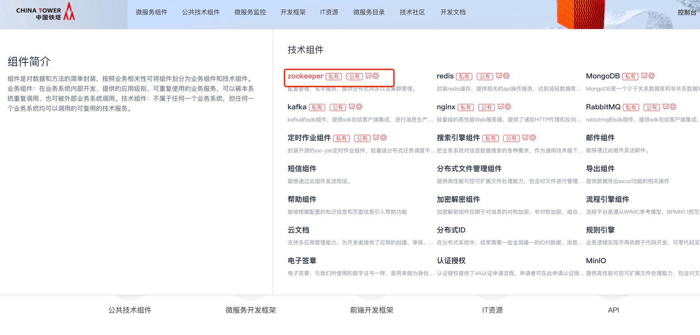
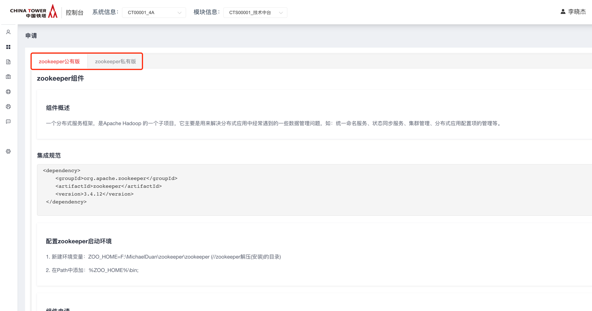
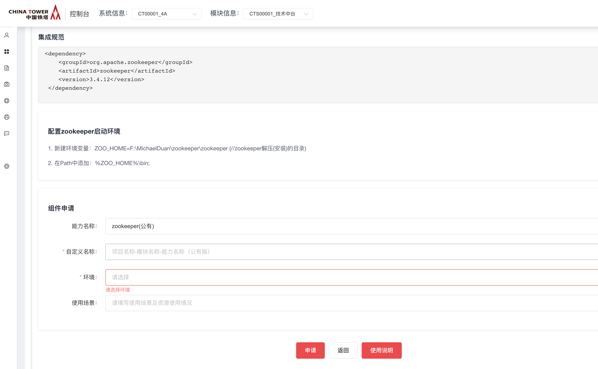
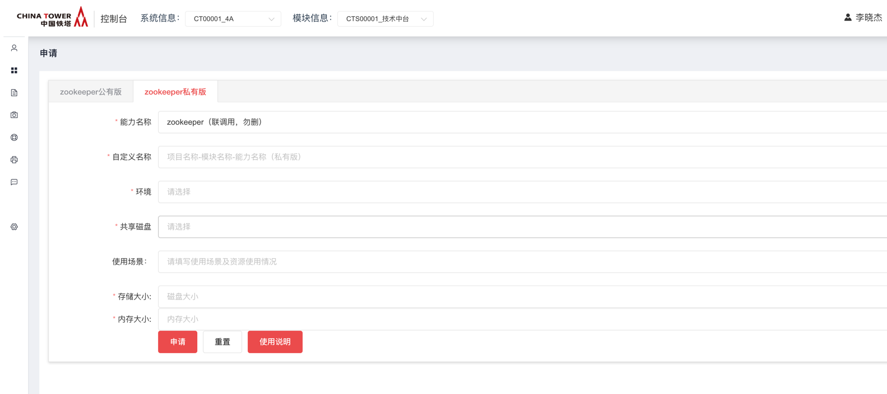
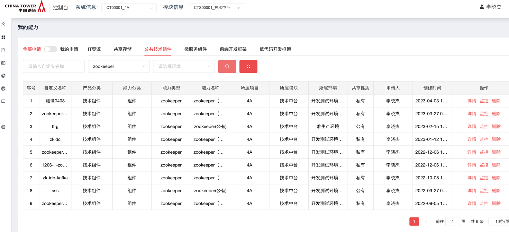
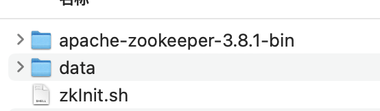
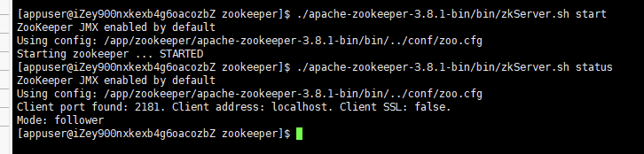
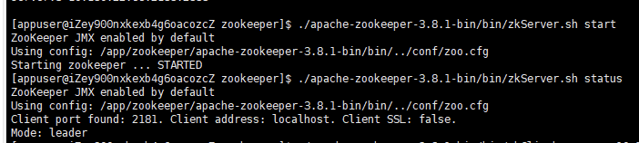
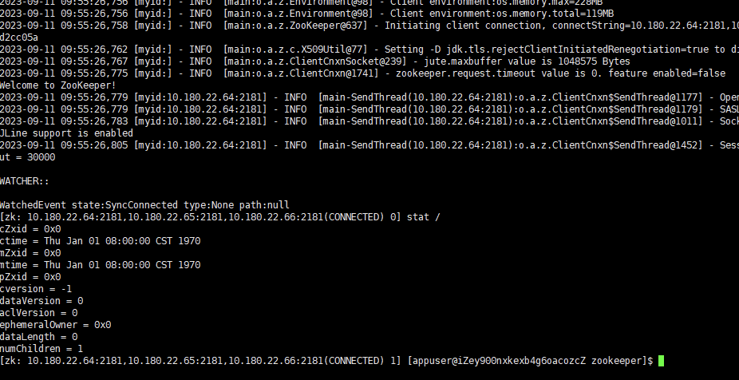

# zookeeper

2021年9月

## 开源版本说明

| 版本名    | 版本   | 说明 |
| --------- | ------ | ---- |
| zookeeper | 3.4.10 |      |

## 文档控制

### 功能发布记录

| 日期       | 版本 | 变更说明 | 作者   |
| ---------- | ---- | -------- | ------ |
| 2023-04-10 | 1.0  | 初始版本 | 陈孔林 |

### 审阅人

## 重要通知

暂无

## 组件描述

提升铁塔IT开发效率，进行统一组件化管理。ZooKeeper使用组件提供SDK引入的方式进行使用，调用端可以通过组件完成对zookeeper服务的的节点和节点数据进行管理等。适用于使用zookeeper服务的服务端。

## 快速入门

仅允许铁塔自有人员申请。

消费者登录技术中台首页，选择公共技术组件，点击zookeeper。



点击申请


根据使用需要，选择私有版申请或公有版申请



公有版申请时，根据系统及模块，填写申请单，点击申请即可。



私有版申请时，需要用户带着三台已纳管caas的机器，然后依据集群的内存及cpu大小，填写申请单，一般容器占用机器的 1/2 cpu内存即可，其他信息如实填写即可。



申请完毕后，依据能力地址直接链接zookeeper使用即可。

## 操作指南

暂无控制台，可在登录技术中台后，选择“我的能力”左侧导航菜单，右侧主内容区域选择“公共技术组件”，能力名称为"zookeeper"，操作一栏选择“详情”，即可获取zookeeper地址



### 私有虚机版功能介绍

#### 部署包位置

[点击下载](http://10.38.77.5:8081/repository/raws/chntjstz/zjh/zookeeper/zookeeper-3.8.1-20230906.tar.gz)  [zookeeper-3.8.1-20230906.tar.gz](../file/zookeeper-3.8.1-20230906.tar.gz) 

#### 部署包内容

部署包根路径



#### 搭建过程

#### 提前安装jdk1.8，并配置环境变量

使用appuser用户执行命令  java -version

运行无异常即可 三台服务器，搭建3个节点集群

包名称：zookeeper-3.8.1-20230906.tar.gz

#### 1.1 每台服务器安装zookeeper-3.8.1步骤

```shell
# appuser用户登录服务器
# 在 app 目录下，上传 zookeeper-3.8.1-20230906.tar.gz安装包，并解压
cd /app
# 上传后解压
tar -zxvf zookeeper-3.8.1-20230906.tar.gz

初始化zookeeper

进入 /app/zookeeper

执行命令 ./zkInit.sh {ip1} {ip2} {ip3} {服务器序号}

如：
在三台机器分别执行

./zkInit.sh xx.xx.22.64 xx.xx.22.65 xx.xx.22.66 1

./zkInit.sh xx.xx.22.64 xx.xx.22.65 xx.xx.22.66 2

./zkInit.sh xx.xx.22.64 xx.xx.22.65 xx.xx.22.66 3

进入 /app/zookeeper/ 目录下

执行 ./apache-zookeeper-3.8.1-bin/bin/zkServer.sh start

等待启动完成

# 检查启动后进程
ps -ef|grep zookeeper
```

#### 1.2 验证并查看集群状态

- 节点状态

进入 /app/zookeeper/ 目录下

执行 ./apache-zookeeper-3.8.1-bin/bin/zkServer.sh status

3个节点状态均正常，mode状态，1个为leader，2个为follower





- 可以进入zookeeper进行进一步操作

执行 ./apache-zookeeper-3.8.1-bin/bin/zkCli.sh -server {ip1}:2181,{ip2}:2181,{ip3}:2181

可以正常进入

执行 stat /  有正常输出



## 典型实践

详见 [样例文件](http://mid.chinatowercom.cn:18080/docs/chinatower-component/v1.0/module/zookeeper.html#ZOOKEEPER01)

## API参考

无

## SDK

无

## 网络要求

- 双向打通业务服务到zookeeper能力地址的网络。

## 常见问题

暂无

## 样例文件

暂无