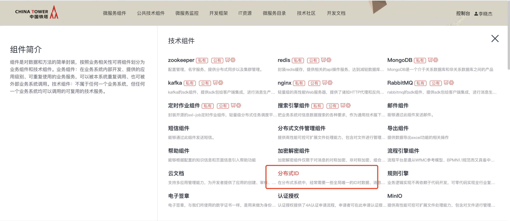
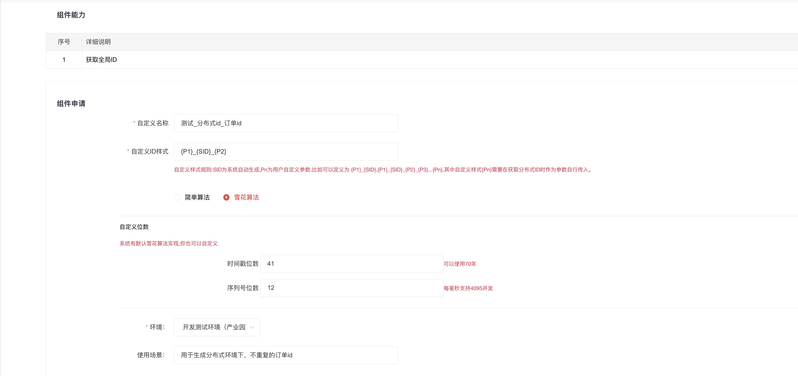
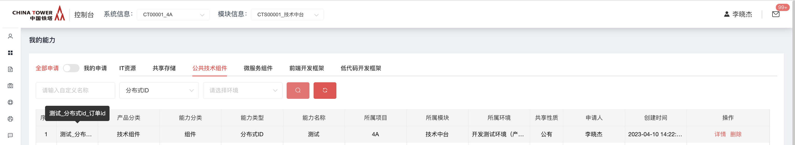
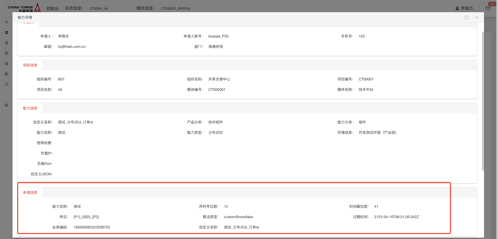
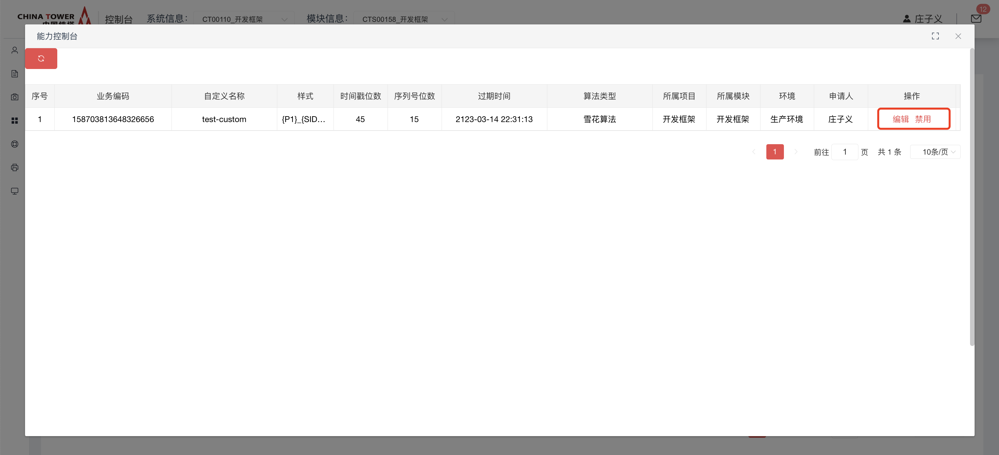
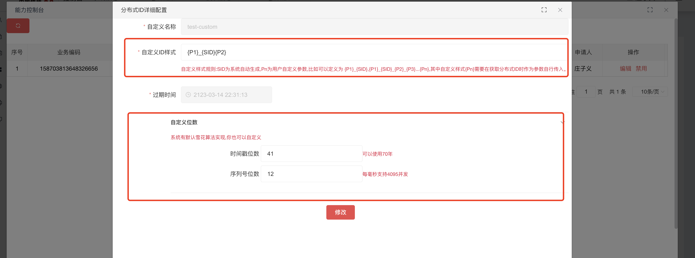
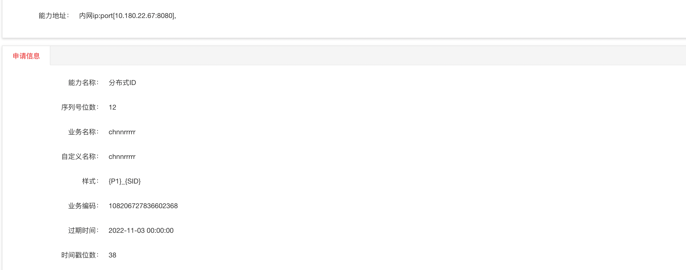
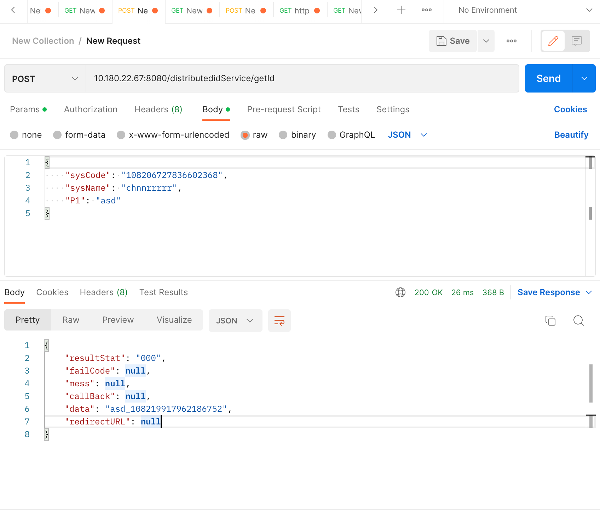
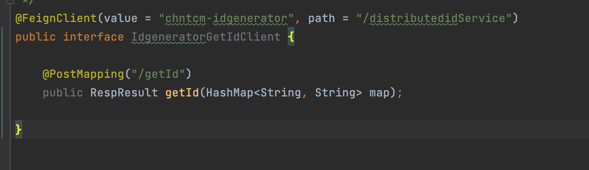
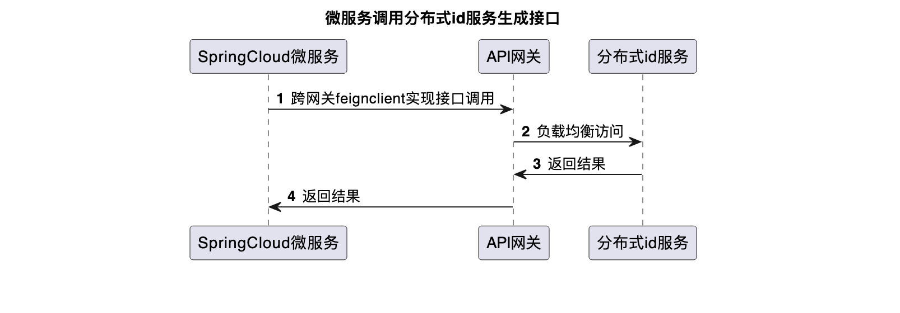

# 分布式ID

在分布式系统中，经常需要一些全局唯一的ID对数据、消息、http请求等进行唯一标识。那么这个全局唯一ID就叫分布式ID

## 功能发布记录

| 发布时间   | 功能分类 | 功能名称               | 说明                                                         |
| ---------- | -------- | ---------------------- | ------------------------------------------------------------ |
| 2022-03-16 | 新特性   | 新增加分布式ID能力     | 新增分布式ID能力，可在技术中台申请能力                       |
| 2023-01-10 | 新特性   | 分布式id支持简化ID生成 | 根据业务需求，需要较短的id位数和各位数字特定的意义，新增分布式id的简化id生成 |

## 重要通知

|      | 生产环境接口最大并发数为1500，超过最大并发的请求将被丢弃，或影响服务正常使用。 |
| ---- | ------------------------------------------------------------ |
|      |                                                              |

|      | 新接系统并发数建议不超过50，如果预估超过100请联系技术中台组。 |
| ---- | ------------------------------------------------------------ |
|      |                                                              |

## 组件描述

在复杂分布式系统中，分布式ID服务能够快速稳定生成唯一的主键，高性能高可用，并且实现了多种类型的生成方式，可以根据需要自由配置使用

## 快速入门

### 组件申请

消费者登录技术中台首页，选择微服务框架，点击分布式ID

按照页面中的提示，填写具体信息，如：申请雪花算法的分布式id，点击申请按钮提交申请

能力申请通过后，消费者在我的能力中将看到对应能力

点击详情，可以看到具体能力信息

## 操作指南

### 消费者控制台

在我的能力，选择分布式ID，在操作栏选择"控制台"，可以打开控制台

在列表中，选择编辑可以对ID生成规则进行编辑，点击禁用则禁用该ID的生成

## 典型实践

### 查看分布式ID能力

注意样式中 {PID} 为系统生成的ID。 {P1}为自定义样式占位，自定义样式需要在获取分布式ID时 以参数形式传入，如 样式为{P1}{SID}{P2},则需要在参数中传入P1:xxx,P2:yyy.

### HTTP POST方式访问 /distributedidService/getId

其中需要以JSON格式传入业务名称sysName，业务编码sysCode,样式中的Pn参数。

### 通过feign访问

## API参考

### 简化ID生成接口

输入参数：

| 接口    | /distributedidService/getSimpleId |                        |
| ------- | --------------------------------- | ---------------------- |
| 参数    | 类型                              | 说明                   |
| sysName | String                            | 申请组件时的自定义名称 |
| sysCode | String                            | 业务编码               |
| Pn      | String                            | 样式参数               |

返回参数：

| 参数       | 类型   | 说明                         |
| ---------- | ------ | ---------------------------- |
| resultStat | String | 操作状态码，000成功；999失败 |
| failCode   | String | 错误码                       |
| mess       | String | 错误原因                     |
| data       | String | 分布式ID                     |

### 标准ID生成接口

输入参数：

| 接口    | /distributedidService/getId |                        |
| ------- | --------------------------- | ---------------------- |
| 参数    | 类型                        | 说明                   |
| sysName | String                      | 申请组件时的自定义名称 |
| sysCode | String                      | 业务编码               |
| Pn      | String                      | 样式参数               |

返回参数：

| 参数       | 类型   | 说明                         |
| ---------- | ------ | ---------------------------- |
| resultStat | String | 操作状态码，000成功；999失败 |
| failCode   | String | 错误码                       |
| mess       | String | 错误原因                     |
| data       | String | 分布式ID                     |

## SDK

无

## 网络要求

- 各业务微服务，在各个环境，需要打通到分布式ID服务的指定IP:端口的网络，具体地址信息在能力详情中查看

## 常见问题

无

## 样例文件

无