# 定时作业组件

## 功能发布记录

| 版本  | 拟制/修改日期 | 拟制/修改人 | 修改记录                   | 批准人 |
| ----- | ------------- | ----------- | -------------------------- | ------ |
| 2.0   | 2020/06/28    | 杨稳        | 增加了5适用范围            |        |
| 2.4.1 | 2024/05/24    | 丁炜        | 增加了新版本介绍及升级步骤 |        |
|       |               |             |                            |        |

## 重要通知

>[!IMPORTANT]
>
>定时任务组件已支持微服务短信组件快速对接使用，详见[低代码定时任务组件](http://mid.chinatowercom.cn:18080/docs/chinatower-framework-lowcode/v1.0/module/定时任务组件.html)

>[!IMPORTANT]
>
>定时任务组件已上线2.4.1版本，升级步骤详见[升级到2.4.1版本](http://mid.chinatowercom.cn:18080/docs/chinatower-component/v1.0/module/定时作业组件.html#2-升级到2-4-1版本)

## 组件描述

JOB是一个轻量级分布式任务调度平台，其核心设计目标是开发迅速、学习简单、轻量级、易扩展。

提升铁塔IT自主掌控能力，提高开发效率，集中管理定时任务。

## 快速入门

### 能力申请

进入技术中台，选择产品 → 技术组件 → 定时作业（xxl-job）

【2.4.1版本】

进入技术中台选择产品 → 技术组件 → 定时作业（xxl-job-2.4.1）

点击 【申请】，填写自定义名称、选择环境，点击申请，等待运营人员审批

审批通过后可以在我的能力中看到定时任务的控制台

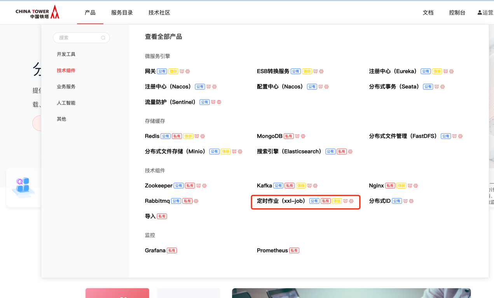

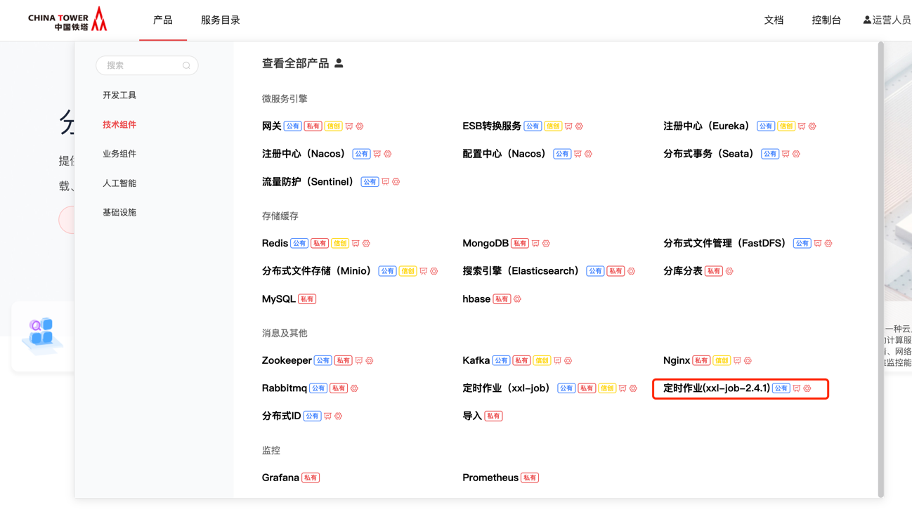

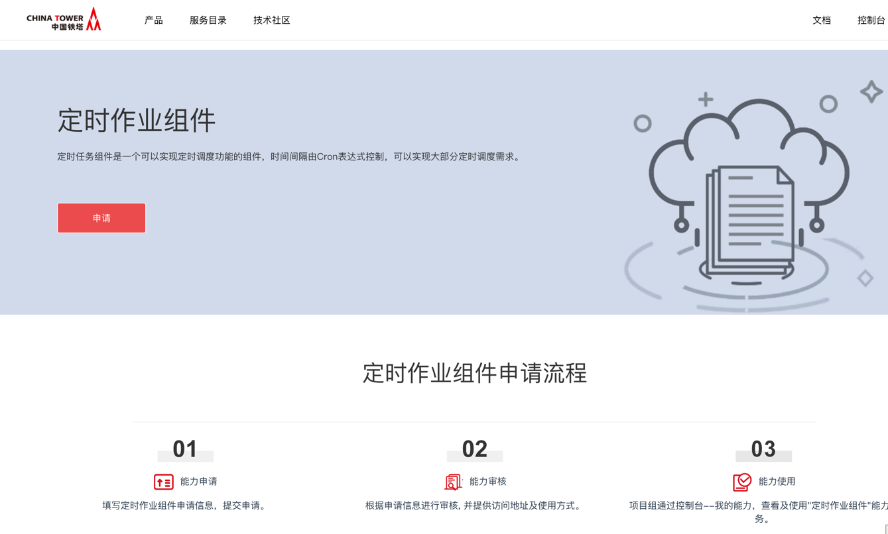

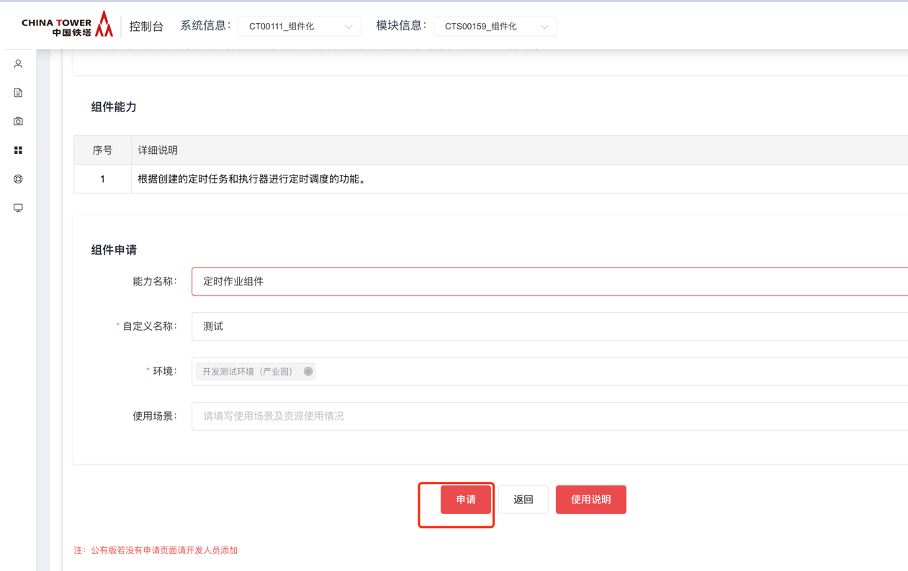


### 服务端配置案例

1. 执行器管理界面：配置执行器信息，

> 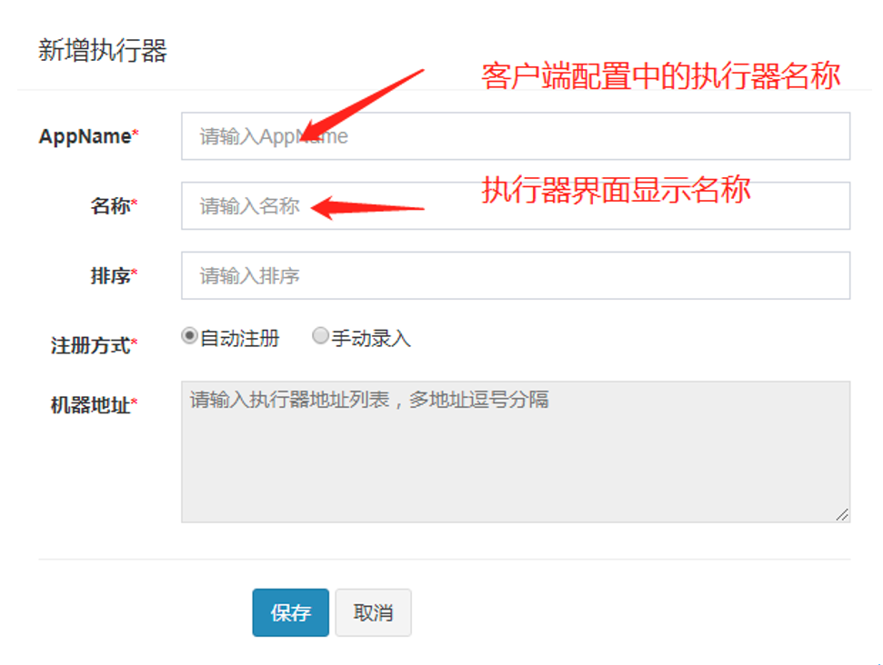
>
> 注意：如果后端是自动注册，机器地址可以自动获取到。否则自行添加机器地址；地址为ip+端口

1. 任务管理界面：配置定时任务

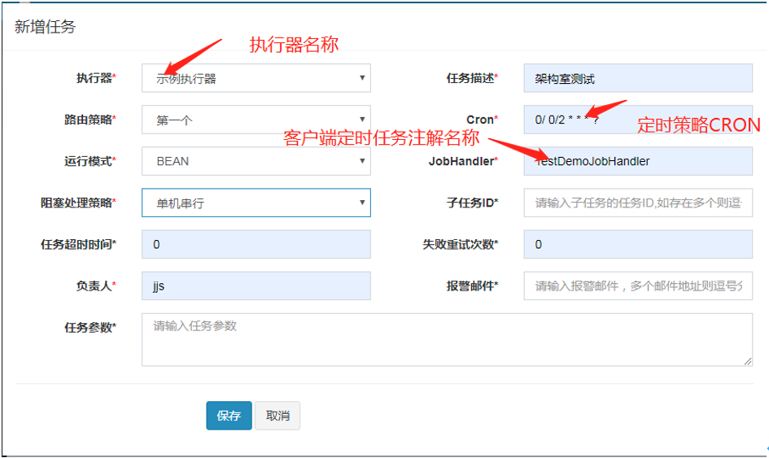

## 操作指南

### 适用范围

| 序号 | 类别     | 支持                                   | 不支持                 |
| ---- | -------- | -------------------------------------- | ---------------------- |
|      | 语言     | Java                                   | 其他                   |
|      | 架构     | Spring boot, Spring MVC                | 其他                   |
|      | 作业管理 | 作业在首次运行时将自动添加到作业监控中 | 手动添加作业，作业分发 |

### 组件技术架构图

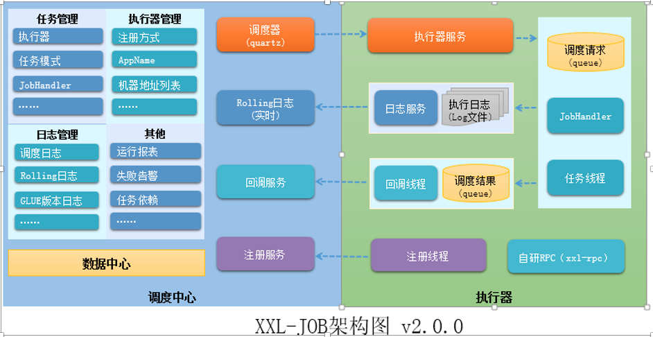

### 运行报表

该模块展现调度中心的任务数量，触发的调度次数和在线的执行器机器数量。并且柱状图展示执行器成功失败次数。

### 任务管理

该模块具有执行任务、停止任务、日志查看，定时任务的增删改查等功能。

### 调度日志

该模块通过执行器、状态和时间等维度查看执行任务日志。

### 执行器管理

该模块具有执行器的增、删、改、查等功能。

## 操作手册


## 开发流程

1 Spring Boot 案例

### 1.1 接入环境说明

具体接入的url地址会在申请后能力详情中告知

| 序号 | 环境     | 任务调度中心地址         | 服务器端配置中心地址                                         |
| ---- | -------- | ------------------------ | ------------------------------------------------------------ |
|      | 测试环境 | http://ip:port/job-admin | [http://ip:port/xxl-job-web/#/](http://123.126.41.204:20415/xxl-job-web/#/)login |

注：服务器端配置中心需要管理员分配账号，然后登录进入操作。

### 1.2 环境要求

【版本: 2.0.2】

1. JDK1.7+
2. Maven3+
3. Spring-boot：1.5.x/Spring4.x

【版本: 2.4.1】

1. JDK1.8+
2. Maven3+
3. Spring-boot: 2.6.x/Spring5.x

### 1.3 客户端开发案例

1. 引入jar包，可通过本地集成jar包的方式，或者通过maven下载，需要maven地址配置成铁塔私服地址

```xml
<dependency>
    <groupId>com.xuxueli</groupId>
    <artifactId>xxl-job-core</artifactId>
    <version>2.0.2</version>
</dependency>
<dependency>
  <groupId>com.chinatower</groupId>
  <artifactId>xxl-job-core</artifactId>
  <version>2.4.1</version>
</dependency>
```

1. 配置文件 .propertis

```properties
###任务调度中心地址（测试环境地址举例，能力申请后，在能力详情页查看）：

xxl.job.admin.addresses=http://10.180.22.51:8762/job-admin

### 执行器AppName [选填]：执行器心跳注册分组依据；为空则关闭自动注册

xxl.job.executor.appname=xxl-job-executor-sample

### 执行器端口号

[选填]：小于等于0则自动获取；默认端口为9999，单机部署多个执行器时，注意要配置不同执行器端口；

xxl.job.executor.port=9999

### 执行器通讯TOKEN [选填]：非空时启用；

### 新版本固定值为 default_token [必填]

xxl.job.accessToken=

### 执行器运行日志文件存储磁盘路径 [选填]：需要对该路径拥有读写权限；为空则使用默认路径；

xxl.job.executor.logpath=/data/applogs/xxl-job/jobhandler

### 执行器日志保存天数 [选填]：值大于3时生效，启用执行器Log文件定期清理功能，否则不生效；

xxl.job.executor.logretentiondays=-1
```

1. 自动注册执行器

```java
@Configuration
public class JobConfig implements java.io.Serializable {
    private Logger logger = LoggerFactory.getLogger(JobConfig.class);
    @Value("${xxl.job.admin.addresses}")
    private String adminAddresses;

    @Value("${xxl.job.executor.appname}")

    private String appName;

    @Value("${xxl.job.executor.ip}")

    private String ip;

    @Value("${xxl.job.executor.port}")

    private int port;

    @Value("${xxl.job.accessToken}")

    private String accessToken;

    @Value("${xxl.job.executor.logpath}")

    private String logPath;

    @Value("${xxl.job.executor.logretentiondays}")

    private int logRetentionDays;

    @Bean(initMethod = "start", destroyMethod = "destroy")

    public XxlJobSpringExecutor JobExecutor() {

        logger.info(">>>>>>>>>>> xxl-job config init.");

        XxlJobSpringExecutor xxlJobSpringExecutor = new XxlJobSpringExecutor();

        xxlJobSpringExecutor.setAdminAddresses(adminAddresses);

        xxlJobSpringExecutor.setAppName(appName);

        xxlJobSpringExecutor.setIp(ip);

        xxlJobSpringExecutor.setPort(port);

        xxlJobSpringExecutor.setAccessToken(accessToken);

        xxlJobSpringExecutor.setLogPath(logPath);

        xxlJobSpringExecutor.setLogRetentionDays(logRetentionDays);

        return xxlJobSpringExecutor;

    }

}
```

1. 定时任务类

```java
//添加注解@JobHandler(value="demoJobHandler")
//demoJobHandler是执行任务名称，需要在页面添加该名称。执行类需要继承IJobHandler类。并且重写execute方法。

@JobHandler(value = "demoJobHandler")
@Component
public class DemoJobHandler extends IJobHandler {
    @Override
    public ReturnT<String> execute(String param) throws Exception {
        XxlJobLogger.log("XXL-JOB, Hello World.");
        for (int i = 0; i < 10; i++) {
            XxlJobLogger.log("beat at:" + i);
            TimeUnit.SECONDS.sleep(2);
        }
        return SUCCESS;
    }
}
```

### 1.4 服务端配置案例

1. 执行器管理界面：配置执行器信息，

> 
>
> 注意：如果后端是自动注册，机器地址可以自动获取到。否则自行添加机器地址；地址为ip+端口

1. 任务管理界面：配置定时任务


### 2 升级到2.4.1版本

业务系统需自行重新申请新版本的定时作业组件

#### 客户端内修改

（1）依赖替换

前置条件：

使用的开发框架版本：3.0.6.0及以上

或者springboot版本：2.6.0及以上

xxl-job核心包依赖：

旧版本依赖：

```xml
<dependency>
    <groupId>com.xuxueli</groupId>
    <artifactId>xxl-job-core</artifactId>
    <version>2.0.2</version>
</dependency>
```

新版本依赖：

```xml
<dependency>
    <groupId>com.chinatower</groupId>
    <artifactId>xxl-job-core</artifactId>
    <version>2.4.1</version>
</dependency>
```

（2）执行器客户端代码及配置变更

1. 配置类XxlJobConfig.java

因XxlJobSpringExecutor中的变量appName变更为了appname，所以将xxlJobSpringExecutor.setAppName(appName);中的N变为n，如图所示。

> [!IMPORTANT]
>
> 2.4.1版本中，执行器的appName属性改为appname

>[!IMPORTANT]
>
>2.4.1版本中，(initMethod = "start", destroyMethod = "destroy")需要删除，否则会出现下面的错误

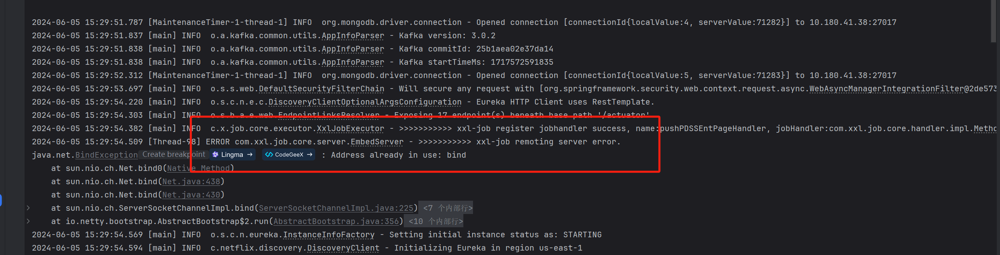

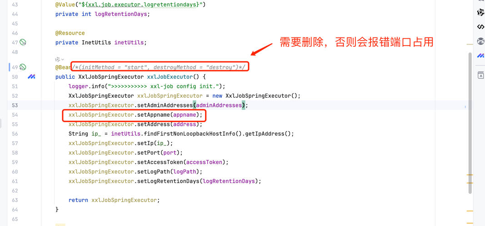

1. 自动注册配置

配置类参考代码如下

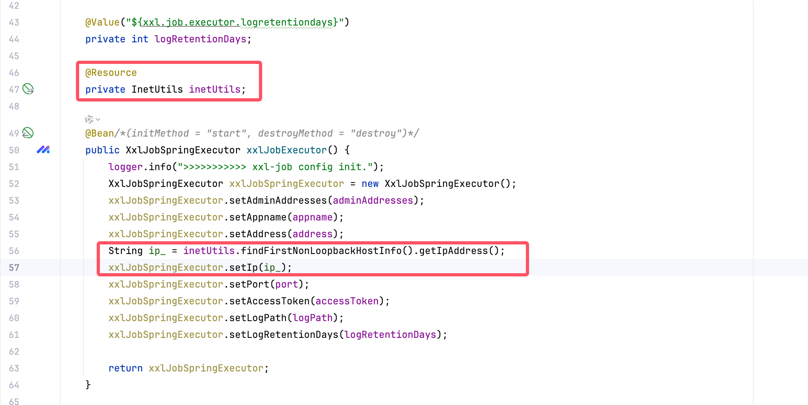

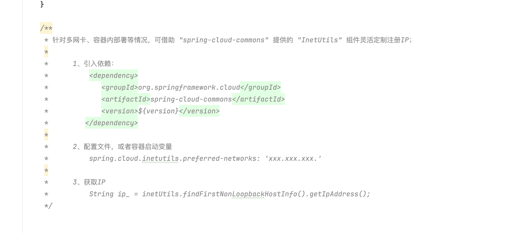

```xml
<dependency>
    <groupId>org.springframework.cloud</groupId>
    <artifactId>spring-cloud-commons</artifactId>
</dependency>
```

```yaml
spring:
  cloud:
    inetutils:
      preferred-networks: 10.180.22.
```

```java
String ip_ = inetUtils.findFirstNonLoopbackHostInfo().getIpAddress();
xxlJobSpringExecutor.setIp(ip_);
```


1. handler类（实际业务代码执行类）

修改内容：

a.删除类上的JobHandler注解

b.删除继承IJobHandler类

c.删除重写注解

d.在方法上添加注解XxlJob

e.XxlJob日志类改为XxlJobHelper

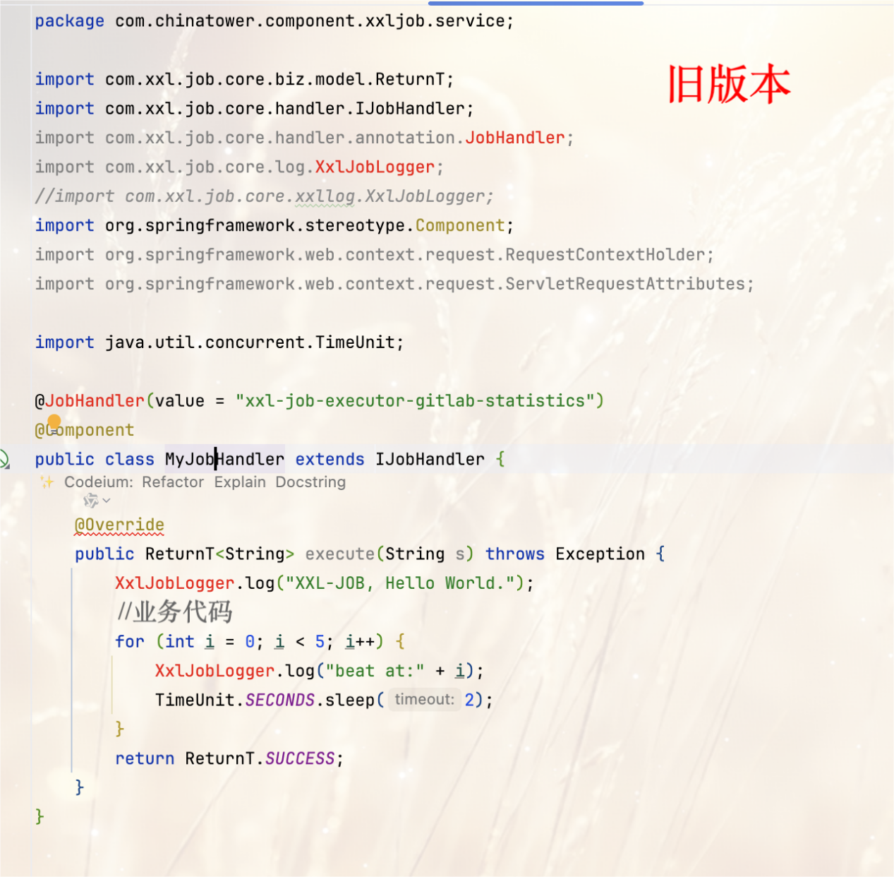

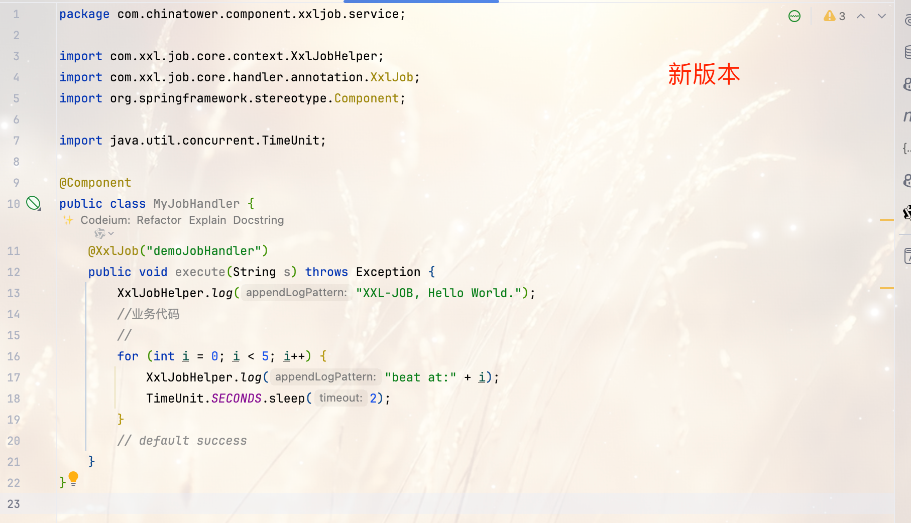

1. 配置文件修改

需修改xxl.job.admin.addresses地址。（具体地址可以在新能力的能力详情中查看）

新版本中，客户端和服务端需要校验token，需要填写一个固定的token值为default_token，具体配置项见下面文本和图中参考

(PS：旧版本中，服务端启动时该参数配置为空，故客户端也需要配置为空，新版本中增加了默认值）

```
### xxl-job, access token
xxl.job.accessToken=default_token
```

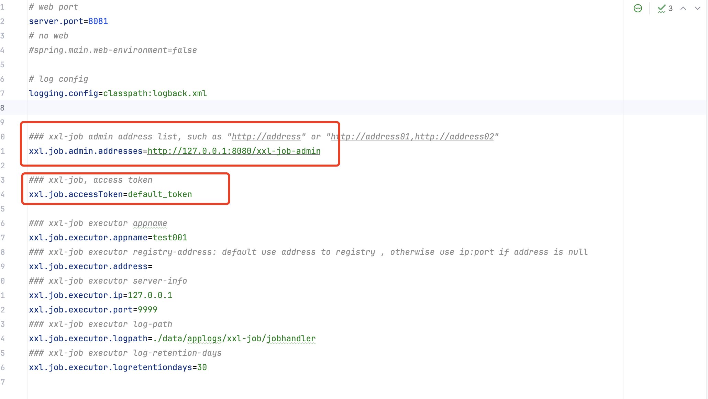

## 典型实践

无

## API参考

无

## SDK

无

## 网络要求

> [!IMPORTANT]
>
> 双向打通定时作业服务器和业务系统执行器服务器指定端口的网络

>[!IMPORTANT]
>
>定时作业服务器需要到执行器 ip: xxl.job.executor.port 网络可用

## 常见问题

### 升级到2.4.1常见问题

1. 尽量使用自动注册，手动录入需注意添加协议http://

常见报错截图 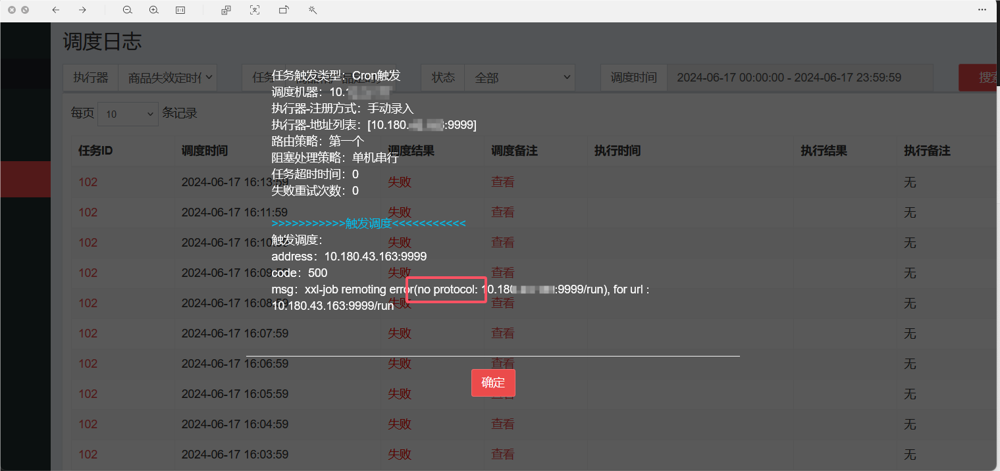

## 样例文件

 [xxljob-demo.zip](../file/xxljob-demo.zip) 