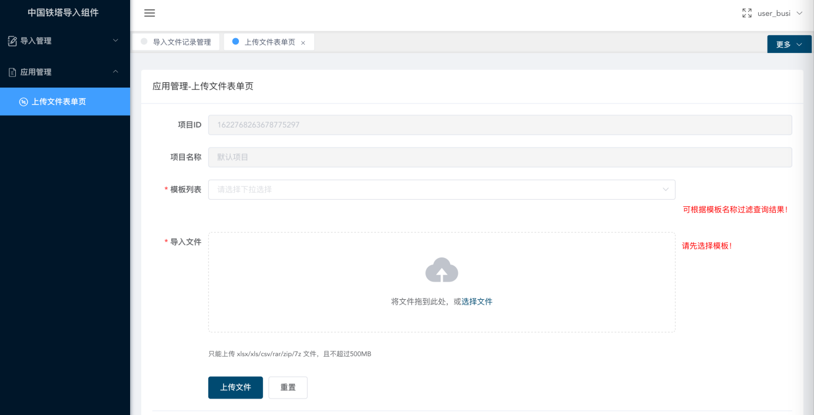
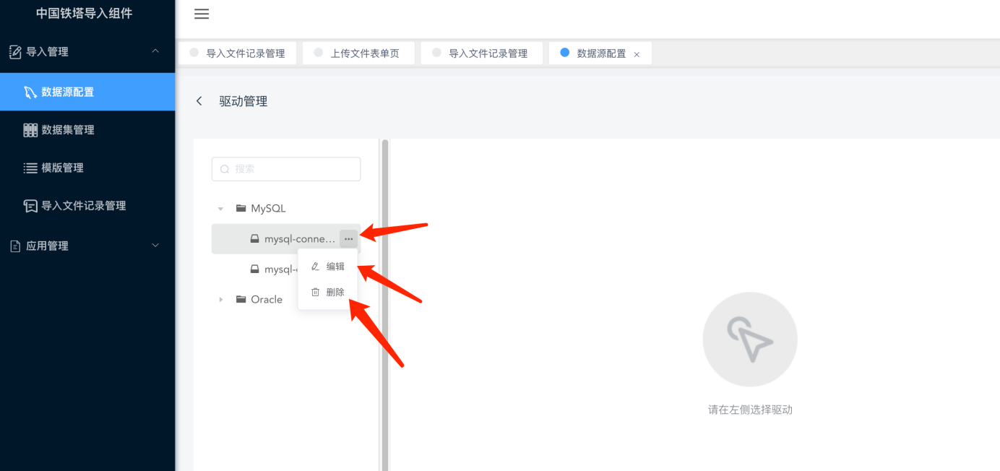

# 导入组件

## 功能发布记录

| 版本 | 拟制/修改日期 | 拟制/修改人 | 修改记录 | 批准人 |
| ---- | ------------- | ----------- | -------- | ------ |
| 1.0  | 2023/07/10    | 梁冰        | 初版     |        |

## 重要通知

无

## 组件描述

### 目标

提升铁塔IT自主掌控能力，提高开发效率，以业务为导向，结合规范化的企业架构为出发点，推进技术中台组件沉淀，实现导入组件可视化管理与功能集成。 建设导入任务统一编程模型和托管服务组件，可视化配置能力，支持数据模板在线制作、校验规则在线定义、导入任务在线配置。 提供大数据表格导入处理能力，支持数据分区，并行执行，流处理，内存优化等技术，保证导入速度，避免内存泄露、系统假死等问题。 提供数据源管理能力、元数据管理能力、内置数据校验规则能力、数据质量管理能力，保证导入数据一致可靠。

### 读者

应用系统维护人员；

应用系统开发人员；

### 参考资料

| 序号 | 文档名称                               | 最后修订时间 | 版本号 | 来源         |
| ---- | -------------------------------------- | ------------ | ------ | ------------ |
| 1    | 中国铁塔IT系统技术架构总体规划（总册） | 2017/05/05   | 1.0    | 铁塔内部资料 |
| 2    | 中国铁塔架构组公共枚举值清单V1.0.docx  | 2019-04-08   | 1.0    | 铁塔内部资料 |

### 术语定义

| 序号 | 简称/术语 | 说明                                                         |
| ---- | --------- | ------------------------------------------------------------ |
| 1    | POI       | Apache POI 是基于 Office Open XML 标准（OOXML）和 Microsoft 的 OLE 2  复合文档格式（OLE2）处理各种文件格式的开源项目。 简而言之，您可以使用 Java 读写 MS Excel 文件，可以使用 Java 读写  MS Word 和 MS PowerPoint 文件。 |

### 适用范围

| 序号 | 类别     | 支持                                                         | 不支持         |
| ---- | -------- | ------------------------------------------------------------ | -------------- |
|      | 语言     | 不受限制                                                     | 无             |
|      | 架构     | 不受限制                                                     | 无             |
|      | 文件类型 | .xlsx,.xls,.csv,.rar,.zip,.7z                                | 无             |
|      | 文件大小 | 文件上传下载的大小建议范围：4KB < file_size <500MB           | 大于500M       |
|      | 操作类型 | 数据源配置，数据集配置，模板设计，导入文件上传，导入文件记录管理 | 多模板混合上传 |
|      | 断点续传 |                                                              | 不支持         |

## 快速入门

### 组件申请

消费者登录技术中台首页，选择公共技术组件，点击导入组件，进入导入组件申请页面，点击提交，等待技术中台管理员审批通过后，即可使用。
 

按照页面中的提示，填写具体信息，点击申请按钮提交。

 

能力申请通过后，消费者在我的能力中将看到对应能力。

 

点击详情，可以看到具体能力信息。

 

## 操作指南

### 环境要求

- 组件现阶段作为私有化版本发布，需要业务系统自行申请或利旧服务器资源，请根据自身业务场景及使用情况评估资源容量。
- 组件部署环境依赖 JDK1.8 或 JDK11。
- 组件依赖Nginx代理服务，请业务系统复用自身服务，按提供的配置作为参考。
- 组件依赖Redis缓存服务，请业务系统复用自身服务，或新申请服务，申请后的地址参数通过配置文件配置传递。
- 组件依赖Mysql数据库服务，请业务系统复用自身数据库服务，或申请数据库服务，Mysql5.7 或 Mysql8.0。
- 组件集成使用了技术中台的分布式文件存储组件【MiniIO】，请业务系统申请使用，申请后的地址参数通过配置文件配置传递。

### 用户手册

导入组件系统

用户操作手册

## 文档控制

### 更新记录

| **日期** | **作者** | **版本** | **新增功能**           |
| -------- | -------- | -------- | ---------------------- |
| 20230330 | 李琦     | V1.0     | 创建文档               |
| 20230630 | 梁冰     | V1.0     | 确认集成方案后进行调整 |

## 〖手册目标〗

通过阅读该用户手册，用户能够了解系统的整体结构，学会使用系统。

## 〖阅读对象〗

本文档适用于系统的使用人员和系统的维护人员使用。

## 〖手册构成〗

本手册基本上由“系统操作说明"部分组成

〖手册约定〗

本手册遵循以下约定：

所有标题均使用黑体字。

如果标题后跟有“〖条件〗”字样，说明该标题下正文所要求的内容是在一定条件下必须的。

【注意】的意思是请读者注意那些需要注意的事项。

【警告】的意思是请读者千万注意某些事项，否则将造成严重错误。

## 〖系统运行环境说明〗

建议使用IE10及其以上、Google Chrome、Safari、Mozilla Firefox、QQ、Opera浏览器

控制台页面默认登录地址：http://{dataflow-service-ip}:8082

## 系统角色说明

组件内置三个角色用于区分菜单授权。

### 管理员角色

管理员角色拥有系统管理权限，可以管理角色、用户以及用户与角色间授权关系。

默认用户名密码

admin

123456


### 开发角色

开发角色拥有用户管理权限，用于管理项目组内访问控制台的用户信息。角色可以管理用户信息以及维护用户与角色间授权关系。此外开发角色具有数据管理权限，可以看到数据源和数据集管控菜单。

默认用户名密码

user_dev

123456


### 业务角色

业务角色作为业务系统实际使用者默认用户存在，具有模板设计发布以及上传导入文件和查询导入文件记录功能。

默认用户名密码

user_busi

123456



## 系统操作说明

### 1 登录入口

#### 1.1 功能概述

业务系统管理员角色用户，通过私有化部署后的前端工程页面登录。

#### 1.2 操作角色

铁塔信息化建设部门以及合作伙伴。

#### 1.3 操作步骤

登录系统后，会自动登录系统并跳转到系统首页，如下图所示：


### 2 首页

#### 2.1 功能概述

用户登录后默认展示导入文件记录列表。

#### 2.2 操作角色

铁塔信息化建设部门以及合作伙伴。

#### 2.3 操作步骤

首页展示各版本信息：如下图所示：


### 3 数据源配置-驱动管理

#### 3.1 功能概述

管理员根据目标业务系统使用数据库情况选择相应数据库类型，并上传对应版本的驱动文件。

#### 3.2 操作角色

铁塔信息化建设部门以及合作伙伴。

#### 3.3 操作步骤

驱动管理功能位置，点击菜单【导入管理-数据源配置】，在数据源目录树上方，点击齿轮图标可进入驱动管理页面。


进入驱动管理页面后，点击右侧【添加驱动】按钮添加驱动


添加驱动时请填写自定义驱动名称，并选择对应的驱动类型


在驱动目录树选中添加驱动进行内容编辑，填写对应的驱动类全路径，并点击上传文件按钮上传驱动文件，点击保存按钮保存驱动记录。


用户通过驱动目录树子节点右侧的  图标对节点进行编辑或删除操作。


### 4 数据源配置-数据源管理

#### 4.1 功能概述

管理员角色用户对数据源进行管理。

#### 4.2 操作角色

铁塔信息化建设部门以及合作伙伴。

#### 4.3 操作步骤

点击菜单【导入管理-数据源配置】，通过数据源目录树右上方的
 按钮可以新建数据源。


点击选择对应业务系统使用的数据库类型后，跳转到数据源表单页面，按表单页面填写数据源必要信息项，可以点击页面右上方【检验】按钮测试数据库连接状态，点击【保存】按钮保存数据源配置记录。数据源表单中【数据源编码】是组件识别数据源记录的唯一标识，并非数据库字符集编码，请注意不用填错。


数据源表单中【驱动】信息项需要用户选择前面配置的驱动记录。


用户通过数据源目录树子节点右侧的  图标对节点进行编辑、复制或删除操作。


### **5数据集管理**

#### 5.1 功能概述

基于数据源对数据集进行增删改查等管理操作。

#### 5.2 操作角色

铁塔信息化建设部门以及合作伙伴

#### 5.3 操作步骤

通过菜单【导入管理-数据集管理】进入数据集管理页面，通过数据集目录树右上方的 + 按钮可以新建数据库数据集或新建文件夹。


新建文件夹功能用于业务系统管理员对数据集进行管理。


新建数据集时先行选择所属的文件夹，点击【确认】按钮，页面跳转到新建数据库数据集页面。


在新建数据库数据集页面左侧选择数据源。


选择数据源后会自动拉取该数据源下所有表对象，并且识别已添加过数据集的表对象是已选中并不可选中状态，也就是同一个表不能重复添加为数据集。用户可以通过输入框通过表名搜索目标表对象。


选中数据表后，在右侧内容区域会显示该表1000条数据，便于用户识别表结构。确认无误后，可二次编辑上方的【数据集名称】和【数据集编码】，其中数据集名称是作为记录显示名称使用，数据集编码是作为记录唯一标识使用，且数据集编码不允许重复，请注意。

编辑确认后可以点击页面右上方【保存】按钮，保存数据集记录。


在数据集管理页面，可以通过数据集目录树点击子节点右侧 图标对该条记录进行重命名、移动到和删除操作。点击记录名称在右侧区域显示对应表对象的表结构。


### **6 模版管理-模板查询列表**

#### 6.1 功能概述

可以通过模板名称查询模板列表信息，并可以对相应记录进行编辑、删除、下载和发布或取消发布的操作。

#### 6.2 操作角色

铁塔信息化建设部门以及合作伙伴

#### 6.3 操作步骤

通过菜单【导入管理-模板管理】可以进入到模板列表查询页面。

用户可以通过模板名称作为查询条件查询模板记录。


用户可以通过右侧按钮调整列表列的显示与隐藏效果。


可在对应记录右侧操作区域内点击按钮对该条记录做相应操作。

【编辑】按钮可对该条记录做二次编辑。

【删除】按钮可删除该条记录。

【下载】按钮可下载该条记录模板对应的excel文件，下载时以zip压缩包形式下载到用户本地，用户可以基于下载文件作为模板文件。


点击【发布】按钮更新该条记录的发布状态，发布之前需确认是否需要触发业务系统回调通知，若需要，请打开回调开关，并填写业务系统侧回调接口地址，通过右侧【查看报文】可以查看了解回调接口的接口规范。点击【确定】后更新该条记录为发布状态，发布状态的模板不允许编辑。


### **7 模板管理-模版设计器**

#### 7.1 功能概述

提供管理员角色用户新增模板的窗口，可以打开模板设计器设计模板的标题、页签、标题、数据区以及单元格的约束规则。

#### 7.2 操作角色

铁塔信息化建设部门以及合作伙伴

#### 7.3 操作步骤

用户通过模板查询列表页的【新增】按钮打开模板设计器编辑页面，或通过列表页对应记录操作区域的【编辑】按钮打开模板设计器页面对该条模板记录进行二次编辑。


打开模板设计器页面，用户可通过上方功能区实现常规功能操作；在中间内容区域对模板进行编辑；在右侧数据区选择对应数据集和字段列；通过下方页签区管理模板sheet页签。


用户可在模板名称中填写或二次编辑该条模板数据的模板名称。


用户可点击【保存】按钮保存当前模板设计数据，在保存之前页面会对已编辑的数据做有效性检验。


用户选中要编辑的目标单元格，通过选行类型对选中单元格所属行做行类型标记。


【头标题】标记已选单元格所属行填写导入文件头部标题内容。非必要类型。


【报表头】标记已选单元格所属行填写导入数据对应表头信息。该类型为模板必选类型，在模板保存时会校验，同时也作为导入上传文件与模板是否匹配的关键信息。


【数据区】标记已选单元格所属行内单元格用于与数据集字段进行绑定。该类型为模板必选类型，在模板保存时会校验，同时也作为导入上传文件内识别导入数据的关键信息。


【数据说明】用于在模板中标识数据说明区域，非必要类型。

【报表尾】用于在模板标识汇总或尾部信息的区域。非必要类型。

用户可以通过【插入行】对目标单元格做编辑操作。可以选择【在上方插入一行】、【在下方插入一行】或【删除选中行】。


用户可以通过【插入列】对目标单元格做编辑操作。可以选择【在左方插入一列】、【在右方插入一列】或【删除选中列】。


可以通过【合并单元格】对已选中的多格单元格进行合并操作。

可以通过【拆分单元格】对已合并状态的单元格进行拆分操作。


用户可以通过【单元格规则设置】设置当前所选中的数据区单元格的数据规则。


【单元格规则设置】弹出窗口中，规则类型设置【文本】，验证规则包括非空校验、身份证号、IP地址规则、邮箱规则；规则类型设置【数字】，验证规则包括整型格式化、数值规则支持、小数规则支持、手机号码支持、百分数规则支持；规则类型设置【日期】时会对所选单元格数据做格式化处理，处理规则包括日期时间格式化[yyyy-MM-dd HH:mm:ss.SSS]、日期时间格式化[yyyy-MM-dd HH:mm:ss.SSS]、日期格式化[yyyy/MM/dd]、日期格式化[yyyy-MM-dd]和时间格式化[HH:mm:ss]。


点击功能区右侧 X 按钮可以关闭当前模板编辑器页面。


点击功能区右侧 <> 按钮可隐藏/显示右侧数据区的数据集与参数设置面板。


通过右侧数据区数据集与参数设置面板中可以查询已配置数据集，此处以归属数据源名称作为父节点，数据集名称作为子节点，以树形目录展示。

点击子节点数据集可拉取对应表对象的全部字段信息，用户通过拖拽方式将字段拖拽到数据区对应单元格上，实现目标列目标单元格与导入目标表目标字段的绑定关系。


用户可通过下方页签区中的 + 按钮增加新的页签。


通过点击页签右侧的按钮弹出页签功能菜单，对页签做向左移、向右移或删除操作。


双击页签文字区域部分，可以编辑页签名称。


同一页签中，只允许绑定唯一一个数据集。

不同页签中，允许绑定不同数据集。

要求导入上传文件中的页签名称与页签顺序要与对应模板的设计保持一致。

模板设计完毕后需要点击【保存】按钮，保存设计数据。保存后页面不会自动关闭，请手动关闭。设计器页面关闭后不会触发模板列表页自动刷新，请手动刷新查询列表方可查询到新增模板数据。

### **8 导入文件记录管理**

#### 8.1 功能概述

查询导入文件后任务的执行情况，可通过模板名称过滤查询。结果展示本次导入的执行时长，导入数据总条数、导入成功条数和导入失败条数等信息。通过操作区域可以查看导入结果详细信息。

#### 8.2 操作角色

铁塔信息化建设部门以及合作伙伴

#### 8.3 操作步骤

用户通过菜单【导入管理-导入文件记录管理】可以查询导入操作记录列表。


点击操作列【查看导入结果】可跳转到导入文件结果详情页面查看对应导入记录的详细信息。


可通过点击任务详情信息列表中操作列中【查看详情】查看对应任务的详细信息。


可通过点击任务详情信息列表中操作列中【查看日志】查看对应任务的日志信息。


### **9 上传文件表单页**

#### 9.1 功能概述

实现用户上传导入数据目标文件功能页面。

#### 9.2 操作角色

铁塔信息化建设部门以及合作伙伴

#### 9.3 操作步骤

用户通过菜单【应用管理-上传文件表单页】打开上传文件页面。在表单页中，根据业务场景选择已保存并发布的设计模板，选择好模板后，点击导入文件右侧控件进行上传操作。

上传文件应属于xlsx/xls/csv/rar/zip/7z 文件，且不超过500MB大小。


点击上传文件开始上传并启动导入任务，执行成功后，上传文件按钮更新为跳转到跟踪页面按钮，点击按钮可跳转到本次导入任务的查询页面进行跟踪。


### **10 上传文件表单页**

#### 10.1 功能概述

管理员配置dataflow-server端的IP地址和监听端口页面。

#### 10.2 操作角色

铁塔信息化建设部门以及合作伙伴

#### 10.3 操作步骤

管理员通过菜单【导入管理-服务管理】打开页面。点击新增按钮可打开新增表单页，根据实际环境部署dataflow-server程序的信息填写并提交。


### 服务环境

- 由业务系统部署后发布服务域地址
- 默认页面地址：http://{HOST_IP}:8082
- 默认API地址：http://{HOST_IP}:9999

### 组件部署

#### 部署流程

1. 准备部署导入组件服务器资源。
2. 登录技术中台上申请导入组件。
3. 打通相关依赖服务间网络。
4. 安装配置导入组件所需运行环境软件。
5. 部署导入组件安装程序。
6. 执行导入组件数据库脚本。
7. 配置导入组件运行参数。
8. 启动导入组件服务，并根据自身业务场景适配。

#### 部署步骤

##### 数据库脚本

- 环境要求
  - Mysql5.7 或 Mysql8.0
- 脚本文件
  - [授权脚本 → dataflow_grant.sql]

```sql
create database dataflow;
create database dataflow_config;

use mysql;

create user dataflow@'%' identified by 'ZTXEsUpeRVByMumC';

grant all privileges on dataflow.* to dataflow@'%' with grant option;
grant all privileges on dataflow_config.* to dataflow@'%' with grant option;

flush privileges;

alter user dataflow@'%' identified with mysql_native_password by 'ZTXEsUpeRVByMumC';
```

- [配置脚本 → dataflow.sql]

```sql
/*
 Navicat Premium Data Transfer

 Source Server         : 铁塔架构室-导入组件
 Source Server Type    : MySQL
 Source Server Version : 80029
 Source Schema         : dataflow_config

 Target Server Type    : MySQL
 Target Server Version : 80029
 File Encoding         : 65001
*/

use dataflow_config;

SET NAMES utf8mb4;
SET FOREIGN_KEY_CHECKS = 0;

-- ----------------------------
-- Table structure for config_info
-- ----------------------------
DROP TABLE IF EXISTS `config_info`;
CREATE TABLE `config_info` (
  `id` bigint NOT NULL AUTO_INCREMENT COMMENT 'id',
  `data_id` varchar(255) CHARACTER SET utf8mb3 COLLATE utf8_bin NOT NULL COMMENT 'data_id',
  `group_id` varchar(255) CHARACTER SET utf8mb3 COLLATE utf8_bin DEFAULT NULL,
  `content` longtext CHARACTER SET utf8mb3 COLLATE utf8_bin NOT NULL COMMENT 'content',
  `md5` varchar(32) CHARACTER SET utf8mb3 COLLATE utf8_bin DEFAULT NULL COMMENT 'md5',
  `gmt_create` datetime NOT NULL DEFAULT '2010-05-05 00:00:00' COMMENT '创建时间',
  `gmt_modified` datetime NOT NULL DEFAULT '2010-05-05 00:00:00' COMMENT '修改时间',
  `src_user` text CHARACTER SET utf8mb3 COLLATE utf8_bin COMMENT 'source user',
  `src_ip` varchar(20) CHARACTER SET utf8mb3 COLLATE utf8_bin DEFAULT NULL COMMENT 'source ip',
  `app_name` varchar(128) CHARACTER SET utf8mb3 COLLATE utf8_bin DEFAULT NULL,
  `tenant_id` varchar(128) CHARACTER SET utf8mb3 COLLATE utf8_bin DEFAULT '' COMMENT '租户字段',
  `c_desc` varchar(256) CHARACTER SET utf8mb3 COLLATE utf8_bin DEFAULT NULL,
  `c_use` varchar(64) CHARACTER SET utf8mb3 COLLATE utf8_bin DEFAULT NULL,
  `effect` varchar(64) CHARACTER SET utf8mb3 COLLATE utf8_bin DEFAULT NULL,
  `type` varchar(64) CHARACTER SET utf8mb3 COLLATE utf8_bin DEFAULT NULL,
  `c_schema` text CHARACTER SET utf8mb3 COLLATE utf8_bin,
  PRIMARY KEY (`id`),
  UNIQUE KEY `uk_configinfo_datagrouptenant` (`data_id`,`group_id`,`tenant_id`)
) ENGINE=InnoDB AUTO_INCREMENT=719 DEFAULT CHARSET=utf8mb3 COLLATE=utf8_bin COMMENT='config_info';

-- ----------------------------
-- Records of config_info
-- ----------------------------
BEGIN;
COMMIT;

-- ----------------------------
-- Table structure for config_info_aggr
-- ----------------------------
DROP TABLE IF EXISTS `config_info_aggr`;
CREATE TABLE `config_info_aggr` (
  `id` bigint NOT NULL AUTO_INCREMENT COMMENT 'id',
  `data_id` varchar(255) CHARACTER SET utf8mb3 COLLATE utf8_bin NOT NULL COMMENT 'data_id',
  `group_id` varchar(255) CHARACTER SET utf8mb3 COLLATE utf8_bin NOT NULL COMMENT 'group_id',
  `datum_id` varchar(255) CHARACTER SET utf8mb3 COLLATE utf8_bin NOT NULL COMMENT 'datum_id',
  `content` longtext CHARACTER SET utf8mb3 COLLATE utf8_bin NOT NULL COMMENT '内容',
  `gmt_modified` datetime NOT NULL COMMENT '修改时间',
  `app_name` varchar(128) CHARACTER SET utf8mb3 COLLATE utf8_bin DEFAULT NULL,
  `tenant_id` varchar(128) CHARACTER SET utf8mb3 COLLATE utf8_bin DEFAULT '' COMMENT '租户字段',
  PRIMARY KEY (`id`),
  UNIQUE KEY `uk_configinfoaggr_datagrouptenantdatum` (`data_id`,`group_id`,`tenant_id`,`datum_id`)
) ENGINE=InnoDB DEFAULT CHARSET=utf8mb3 COLLATE=utf8_bin COMMENT='增加租户字段';

-- ----------------------------
-- Records of config_info_aggr
-- ----------------------------
BEGIN;
COMMIT;

-- ----------------------------
-- Table structure for config_info_beta
-- ----------------------------
DROP TABLE IF EXISTS `config_info_beta`;
CREATE TABLE `config_info_beta` (
  `id` bigint NOT NULL AUTO_INCREMENT COMMENT 'id',
  `data_id` varchar(255) CHARACTER SET utf8mb3 COLLATE utf8_bin NOT NULL COMMENT 'data_id',
  `group_id` varchar(128) CHARACTER SET utf8mb3 COLLATE utf8_bin NOT NULL COMMENT 'group_id',
  `app_name` varchar(128) CHARACTER SET utf8mb3 COLLATE utf8_bin DEFAULT NULL COMMENT 'app_name',
  `content` longtext CHARACTER SET utf8mb3 COLLATE utf8_bin NOT NULL COMMENT 'content',
  `beta_ips` varchar(1024) CHARACTER SET utf8mb3 COLLATE utf8_bin DEFAULT NULL COMMENT 'betaIps',
  `md5` varchar(32) CHARACTER SET utf8mb3 COLLATE utf8_bin DEFAULT NULL COMMENT 'md5',
  `gmt_create` datetime NOT NULL DEFAULT '2010-05-05 00:00:00' COMMENT '创建时间',
  `gmt_modified` datetime NOT NULL DEFAULT '2010-05-05 00:00:00' COMMENT '修改时间',
  `src_user` text CHARACTER SET utf8mb3 COLLATE utf8_bin COMMENT 'source user',
  `src_ip` varchar(20) CHARACTER SET utf8mb3 COLLATE utf8_bin DEFAULT NULL COMMENT 'source ip',
  `tenant_id` varchar(128) CHARACTER SET utf8mb3 COLLATE utf8_bin DEFAULT '' COMMENT '租户字段',
  PRIMARY KEY (`id`),
  UNIQUE KEY `uk_configinfobeta_datagrouptenant` (`data_id`,`group_id`,`tenant_id`)
) ENGINE=InnoDB DEFAULT CHARSET=utf8mb3 COLLATE=utf8_bin COMMENT='config_info_beta';

-- ----------------------------
-- Records of config_info_beta
-- ----------------------------
BEGIN;
COMMIT;

-- ----------------------------
-- Table structure for config_info_tag
-- ----------------------------
DROP TABLE IF EXISTS `config_info_tag`;
CREATE TABLE `config_info_tag` (
  `id` bigint NOT NULL AUTO_INCREMENT COMMENT 'id',
  `data_id` varchar(255) CHARACTER SET utf8mb3 COLLATE utf8_bin NOT NULL COMMENT 'data_id',
  `group_id` varchar(128) CHARACTER SET utf8mb3 COLLATE utf8_bin NOT NULL COMMENT 'group_id',
  `tenant_id` varchar(128) CHARACTER SET utf8mb3 COLLATE utf8_bin DEFAULT '' COMMENT 'tenant_id',
  `tag_id` varchar(128) CHARACTER SET utf8mb3 COLLATE utf8_bin NOT NULL COMMENT 'tag_id',
  `app_name` varchar(128) CHARACTER SET utf8mb3 COLLATE utf8_bin DEFAULT NULL COMMENT 'app_name',
  `content` longtext CHARACTER SET utf8mb3 COLLATE utf8_bin NOT NULL COMMENT 'content',
  `md5` varchar(32) CHARACTER SET utf8mb3 COLLATE utf8_bin DEFAULT NULL COMMENT 'md5',
  `gmt_create` datetime NOT NULL DEFAULT '2010-05-05 00:00:00' COMMENT '创建时间',
  `gmt_modified` datetime NOT NULL DEFAULT '2010-05-05 00:00:00' COMMENT '修改时间',
  `src_user` text CHARACTER SET utf8mb3 COLLATE utf8_bin COMMENT 'source user',
  `src_ip` varchar(20) CHARACTER SET utf8mb3 COLLATE utf8_bin DEFAULT NULL COMMENT 'source ip',
  PRIMARY KEY (`id`),
  UNIQUE KEY `uk_configinfotag_datagrouptenanttag` (`data_id`,`group_id`,`tenant_id`,`tag_id`)
) ENGINE=InnoDB DEFAULT CHARSET=utf8mb3 COLLATE=utf8_bin COMMENT='config_info_tag';

-- ----------------------------
-- Records of config_info_tag
-- ----------------------------
BEGIN;
COMMIT;

-- ----------------------------
-- Table structure for config_tags_relation
-- ----------------------------
DROP TABLE IF EXISTS `config_tags_relation`;
CREATE TABLE `config_tags_relation` (
  `id` bigint NOT NULL COMMENT 'id',
  `tag_name` varchar(128) CHARACTER SET utf8mb3 COLLATE utf8_bin NOT NULL COMMENT 'tag_name',
  `tag_type` varchar(64) CHARACTER SET utf8mb3 COLLATE utf8_bin DEFAULT NULL COMMENT 'tag_type',
  `data_id` varchar(255) CHARACTER SET utf8mb3 COLLATE utf8_bin NOT NULL COMMENT 'data_id',
  `group_id` varchar(128) CHARACTER SET utf8mb3 COLLATE utf8_bin NOT NULL COMMENT 'group_id',
  `tenant_id` varchar(128) CHARACTER SET utf8mb3 COLLATE utf8_bin DEFAULT '' COMMENT 'tenant_id',
  `nid` bigint NOT NULL AUTO_INCREMENT,
  PRIMARY KEY (`nid`),
  UNIQUE KEY `uk_configtagrelation_configidtag` (`id`,`tag_name`,`tag_type`),
  KEY `idx_tenant_id` (`tenant_id`)
) ENGINE=InnoDB DEFAULT CHARSET=utf8mb3 COLLATE=utf8_bin COMMENT='config_tag_relation';

-- ----------------------------
-- Records of config_tags_relation
-- ----------------------------
BEGIN;
COMMIT;

-- ----------------------------
-- Table structure for group_capacity
-- ----------------------------
DROP TABLE IF EXISTS `group_capacity`;
CREATE TABLE `group_capacity` (
  `id` bigint unsigned NOT NULL AUTO_INCREMENT COMMENT '主键ID',
  `group_id` varchar(128) CHARACTER SET utf8mb3 COLLATE utf8_bin NOT NULL DEFAULT '' COMMENT 'Group ID，空字符表示整个集群',
  `quota` int unsigned NOT NULL DEFAULT '0' COMMENT '配额，0表示使用默认值',
  `usage` int unsigned NOT NULL DEFAULT '0' COMMENT '使用量',
  `max_size` int unsigned NOT NULL DEFAULT '0' COMMENT '单个配置大小上限，单位为字节，0表示使用默认值',
  `max_aggr_count` int unsigned NOT NULL DEFAULT '0' COMMENT '聚合子配置最大个数，，0表示使用默认值',
  `max_aggr_size` int unsigned NOT NULL DEFAULT '0' COMMENT '单个聚合数据的子配置大小上限，单位为字节，0表示使用默认值',
  `max_history_count` int unsigned NOT NULL DEFAULT '0' COMMENT '最大变更历史数量',
  `gmt_create` datetime NOT NULL DEFAULT '2010-05-05 00:00:00' COMMENT '创建时间',
  `gmt_modified` datetime NOT NULL DEFAULT '2010-05-05 00:00:00' COMMENT '修改时间',
  PRIMARY KEY (`id`),
  UNIQUE KEY `uk_group_id` (`group_id`)
) ENGINE=InnoDB DEFAULT CHARSET=utf8mb3 COLLATE=utf8_bin COMMENT='集群、各Group容量信息表';

-- ----------------------------
-- Records of group_capacity
-- ----------------------------
BEGIN;
COMMIT;

-- ----------------------------
-- Table structure for his_config_info
-- ----------------------------
DROP TABLE IF EXISTS `his_config_info`;
CREATE TABLE `his_config_info` (
  `id` bigint unsigned NOT NULL,
  `nid` bigint unsigned NOT NULL AUTO_INCREMENT,
  `data_id` varchar(255) CHARACTER SET utf8mb3 COLLATE utf8_bin NOT NULL,
  `group_id` varchar(128) CHARACTER SET utf8mb3 COLLATE utf8_bin NOT NULL,
  `app_name` varchar(128) CHARACTER SET utf8mb3 COLLATE utf8_bin DEFAULT NULL COMMENT 'app_name',
  `content` longtext CHARACTER SET utf8mb3 COLLATE utf8_bin NOT NULL,
  `md5` varchar(32) CHARACTER SET utf8mb3 COLLATE utf8_bin DEFAULT NULL,
  `gmt_create` datetime NOT NULL DEFAULT '2010-05-05 00:00:00',
  `gmt_modified` datetime NOT NULL DEFAULT '2010-05-05 00:00:00',
  `src_user` text CHARACTER SET utf8mb3 COLLATE utf8_bin,
  `src_ip` varchar(20) CHARACTER SET utf8mb3 COLLATE utf8_bin DEFAULT NULL,
  `op_type` char(10) CHARACTER SET utf8mb3 COLLATE utf8_bin DEFAULT NULL,
  `tenant_id` varchar(128) CHARACTER SET utf8mb3 COLLATE utf8_bin DEFAULT '' COMMENT '租户字段',
  PRIMARY KEY (`nid`),
  KEY `idx_gmt_create` (`gmt_create`),
  KEY `idx_gmt_modified` (`gmt_modified`),
  KEY `idx_did` (`data_id`)
) ENGINE=InnoDB AUTO_INCREMENT=752 DEFAULT CHARSET=utf8mb3 COLLATE=utf8_bin COMMENT='多租户改造';

-- ----------------------------
-- Records of his_config_info
-- ----------------------------
BEGIN;
COMMIT;

-- ----------------------------
-- Table structure for permissions
-- ----------------------------
DROP TABLE IF EXISTS `permissions`;
CREATE TABLE `permissions` (
  `role` varchar(50) NOT NULL,
  `resource` varchar(512) NOT NULL,
  `action` varchar(8) NOT NULL,
  UNIQUE KEY `uk_role_permission` (`role`,`resource`,`action`)
) ENGINE=InnoDB DEFAULT CHARSET=utf8mb4 COLLATE=utf8mb4_0900_ai_ci;

-- ----------------------------
-- Records of permissions
-- ----------------------------
BEGIN;
COMMIT;

-- ----------------------------
-- Table structure for roles
-- ----------------------------
DROP TABLE IF EXISTS `roles`;
CREATE TABLE `roles` (
  `username` varchar(50) NOT NULL,
  `role` varchar(50) NOT NULL,
  UNIQUE KEY `uk_username_role` (`username`,`role`)
) ENGINE=InnoDB DEFAULT CHARSET=utf8mb4 COLLATE=utf8mb4_0900_ai_ci;

-- ----------------------------
-- Records of roles
-- ----------------------------
BEGIN;
INSERT INTO `roles` (`username`, `role`) VALUES ('nacos', 'ROLE_ADMIN');
COMMIT;

-- ----------------------------
-- Table structure for tenant_capacity
-- ----------------------------
DROP TABLE IF EXISTS `tenant_capacity`;
CREATE TABLE `tenant_capacity` (
  `id` bigint unsigned NOT NULL AUTO_INCREMENT COMMENT '主键ID',
  `tenant_id` varchar(128) CHARACTER SET utf8mb3 COLLATE utf8_bin NOT NULL DEFAULT '' COMMENT 'Tenant ID',
  `quota` int unsigned NOT NULL DEFAULT '0' COMMENT '配额，0表示使用默认值',
  `usage` int unsigned NOT NULL DEFAULT '0' COMMENT '使用量',
  `max_size` int unsigned NOT NULL DEFAULT '0' COMMENT '单个配置大小上限，单位为字节，0表示使用默认值',
  `max_aggr_count` int unsigned NOT NULL DEFAULT '0' COMMENT '聚合子配置最大个数',
  `max_aggr_size` int unsigned NOT NULL DEFAULT '0' COMMENT '单个聚合数据的子配置大小上限，单位为字节，0表示使用默认值',
  `max_history_count` int unsigned NOT NULL DEFAULT '0' COMMENT '最大变更历史数量',
  `gmt_create` datetime NOT NULL DEFAULT '2010-05-05 00:00:00' COMMENT '创建时间',
  `gmt_modified` datetime NOT NULL DEFAULT '2010-05-05 00:00:00' COMMENT '修改时间',
  PRIMARY KEY (`id`),
  UNIQUE KEY `uk_tenant_id` (`tenant_id`)
) ENGINE=InnoDB DEFAULT CHARSET=utf8mb3 COLLATE=utf8_bin COMMENT='租户容量信息表';

-- ----------------------------
-- Records of tenant_capacity
-- ----------------------------
BEGIN;
COMMIT;

-- ----------------------------
-- Table structure for tenant_info
-- ----------------------------
DROP TABLE IF EXISTS `tenant_info`;
CREATE TABLE `tenant_info` (
  `id` bigint NOT NULL AUTO_INCREMENT COMMENT 'id',
  `kp` varchar(128) CHARACTER SET utf8mb3 COLLATE utf8_bin NOT NULL COMMENT 'kp',
  `tenant_id` varchar(128) CHARACTER SET utf8mb3 COLLATE utf8_bin DEFAULT '' COMMENT 'tenant_id',
  `tenant_name` varchar(128) CHARACTER SET utf8mb3 COLLATE utf8_bin DEFAULT '' COMMENT 'tenant_name',
  `tenant_desc` varchar(256) CHARACTER SET utf8mb3 COLLATE utf8_bin DEFAULT NULL COMMENT 'tenant_desc',
  `create_source` varchar(32) CHARACTER SET utf8mb3 COLLATE utf8_bin DEFAULT NULL COMMENT 'create_source',
  `gmt_create` bigint NOT NULL COMMENT '创建时间',
  `gmt_modified` bigint NOT NULL COMMENT '修改时间',
  PRIMARY KEY (`id`),
  UNIQUE KEY `uk_tenant_info_kptenantid` (`kp`,`tenant_id`),
  KEY `idx_tenant_id` (`tenant_id`)
) ENGINE=InnoDB AUTO_INCREMENT=19 DEFAULT CHARSET=utf8mb3 COLLATE=utf8_bin COMMENT='tenant_info';

-- ----------------------------
-- Records of tenant_info
-- ----------------------------
BEGIN;
COMMIT;

-- ----------------------------
-- Table structure for users
-- ----------------------------
DROP TABLE IF EXISTS `users`;
CREATE TABLE `users` (
  `username` varchar(50) NOT NULL,
  `password` varchar(500) NOT NULL,
  `enabled` tinyint(1) NOT NULL,
  PRIMARY KEY (`username`)
) ENGINE=InnoDB DEFAULT CHARSET=utf8mb4 COLLATE=utf8mb4_0900_ai_ci;

-- ----------------------------
-- Records of users
-- ----------------------------
BEGIN;
INSERT INTO `users` (`username`, `password`, `enabled`) VALUES ('nacos', '$2a$10$EuWPZHzz32dJN7jexM34MOeYirDdFAZm2kuWj7VEOJhhZkDrxfvUu', 1);
COMMIT;

SET FOREIGN_KEY_CHECKS = 1;
```

- [配置脚本 → dataflow_config.sql]

```sql
/*
 Navicat Premium Data Transfer

 Source Server         : 铁塔架构室-导入组件
 Source Server Type    : MySQL
 Source Server Version : 80029
 Source Schema         : dataflow

 Target Server Type    : MySQL
 Target Server Version : 80029
 File Encoding         : 65001
*/

use dataflow;

SET NAMES utf8mb4;
SET FOREIGN_KEY_CHECKS = 0;

-- ----------------------------
-- Table structure for action
-- ----------------------------
DROP TABLE IF EXISTS `action`;
CREATE TABLE `action` (
  `id` bigint NOT NULL,
  `name` varchar(255) DEFAULT NULL,
  `spel` varchar(255) DEFAULT NULL,
  PRIMARY KEY (`id`)
) ENGINE=InnoDB DEFAULT CHARSET=utf8mb4 COLLATE=utf8mb4_0900_ai_ci;

-- ----------------------------
-- Records of action
-- ----------------------------
BEGIN;
COMMIT;

-- ----------------------------
-- Table structure for app_registration
-- ----------------------------
DROP TABLE IF EXISTS `app_registration`;
CREATE TABLE `app_registration` (
  `id` bigint NOT NULL,
  `object_version` bigint DEFAULT NULL,
  `default_version` bit(1) DEFAULT NULL,
  `metadata_uri` longtext,
  `name` varchar(255) DEFAULT NULL,
  `type` int DEFAULT NULL,
  `uri` longtext,
  `version` varchar(255) DEFAULT NULL,
  PRIMARY KEY (`id`)
) ENGINE=InnoDB DEFAULT CHARSET=utf8mb4 COLLATE=utf8mb4_0900_ai_ci;

-- ----------------------------
-- Records of app_registration
-- ----------------------------
BEGIN;
INSERT INTO `app_registration` (`id`, `object_version`, `default_version`, `metadata_uri`, `name`, `type`, `uri`, `version`) VALUES (1443, 0, b'1', NULL, 'dataflow-batch-file', 4, 'maven://cn.chinatowercom:dataflow-batch-file:1.0.0', '1.0.0');
INSERT INTO `app_registration` (`id`, `object_version`, `default_version`, `metadata_uri`, `name`, `type`, `uri`, `version`) VALUES (1546, 0, b'1', NULL, 'dataflow-file-split', 4, 'maven://cn.chinatowercom:dataflow-batch-csv:1.0.0', '1.0.0');
INSERT INTO `app_registration` (`id`, `object_version`, `default_version`, `metadata_uri`, `name`, `type`, `uri`, `version`) VALUES (1791, 0, b'1', NULL, 'timestamp', 4, 'maven://io.spring:timestamp-task:2.0.2', '2.0.2');
INSERT INTO `app_registration` (`id`, `object_version`, `default_version`, `metadata_uri`, `name`, `type`, `uri`, `version`) VALUES (1793, 0, b'1', NULL, 'timestamp-batch', 4, 'maven://io.spring:timestamp-batch-task:2.0.2', '2.0.2');
COMMIT;

-- ----------------------------
-- Table structure for audit_records
-- ----------------------------
DROP TABLE IF EXISTS `audit_records`;
CREATE TABLE `audit_records` (
  `id` bigint NOT NULL,
  `audit_action` bigint DEFAULT NULL,
  `audit_data` longtext,
  `audit_operation` bigint DEFAULT NULL,
  `correlation_id` varchar(255) DEFAULT NULL,
  `created_by` varchar(255) DEFAULT NULL,
  `created_on` datetime DEFAULT NULL,
  `platform_name` varchar(255) DEFAULT NULL,
  PRIMARY KEY (`id`)
) ENGINE=InnoDB DEFAULT CHARSET=utf8mb4 COLLATE=utf8mb4_0900_ai_ci;

-- ----------------------------
-- Records of audit_records
-- ----------------------------
BEGIN;
COMMIT;

-- ----------------------------
-- Table structure for batch_job_execution
-- ----------------------------
DROP TABLE IF EXISTS `batch_job_execution`;
CREATE TABLE `batch_job_execution` (
  `JOB_EXECUTION_ID` bigint NOT NULL,
  `VERSION` bigint DEFAULT NULL,
  `JOB_INSTANCE_ID` bigint NOT NULL,
  `CREATE_TIME` datetime NOT NULL,
  `START_TIME` datetime DEFAULT NULL,
  `END_TIME` datetime DEFAULT NULL,
  `STATUS` varchar(10) DEFAULT NULL,
  `EXIT_CODE` varchar(2500) DEFAULT NULL,
  `EXIT_MESSAGE` varchar(2500) DEFAULT NULL,
  `LAST_UPDATED` datetime DEFAULT NULL,
  `JOB_CONFIGURATION_LOCATION` varchar(2500) DEFAULT NULL,
  PRIMARY KEY (`JOB_EXECUTION_ID`),
  KEY `JOB_INST_EXEC_FK` (`JOB_INSTANCE_ID`),
  CONSTRAINT `JOB_INST_EXEC_FK` FOREIGN KEY (`JOB_INSTANCE_ID`) REFERENCES `batch_job_instance` (`JOB_INSTANCE_ID`)
) ENGINE=InnoDB DEFAULT CHARSET=utf8mb4 COLLATE=utf8mb4_0900_ai_ci;

-- ----------------------------
-- Records of batch_job_execution
-- ----------------------------
BEGIN;
COMMIT;

-- ----------------------------
-- Table structure for batch_job_execution_context
-- ----------------------------
DROP TABLE IF EXISTS `batch_job_execution_context`;
CREATE TABLE `batch_job_execution_context` (
  `JOB_EXECUTION_ID` bigint NOT NULL,
  `SHORT_CONTEXT` varchar(2500) NOT NULL,
  `SERIALIZED_CONTEXT` text,
  PRIMARY KEY (`JOB_EXECUTION_ID`),
  CONSTRAINT `JOB_EXEC_CTX_FK` FOREIGN KEY (`JOB_EXECUTION_ID`) REFERENCES `batch_job_execution` (`JOB_EXECUTION_ID`)
) ENGINE=InnoDB DEFAULT CHARSET=utf8mb4 COLLATE=utf8mb4_0900_ai_ci;

-- ----------------------------
-- Records of batch_job_execution_context
-- ----------------------------
BEGIN;
COMMIT;

-- ----------------------------
-- Table structure for batch_job_execution_params
-- ----------------------------
DROP TABLE IF EXISTS `batch_job_execution_params`;
CREATE TABLE `batch_job_execution_params` (
  `JOB_EXECUTION_ID` bigint NOT NULL,
  `TYPE_CD` varchar(6) NOT NULL,
  `KEY_NAME` varchar(100) NOT NULL,
  `STRING_VAL` varchar(512) CHARACTER SET utf8mb4 COLLATE utf8mb4_0900_ai_ci DEFAULT NULL,
  `DATE_VAL` datetime DEFAULT NULL,
  `LONG_VAL` bigint DEFAULT NULL,
  `DOUBLE_VAL` double DEFAULT NULL,
  `IDENTIFYING` char(1) NOT NULL,
  KEY `JOB_EXEC_PARAMS_FK` (`JOB_EXECUTION_ID`),
  CONSTRAINT `JOB_EXEC_PARAMS_FK` FOREIGN KEY (`JOB_EXECUTION_ID`) REFERENCES `batch_job_execution` (`JOB_EXECUTION_ID`)
) ENGINE=InnoDB DEFAULT CHARSET=utf8mb4 COLLATE=utf8mb4_0900_ai_ci;

-- ----------------------------
-- Records of batch_job_execution_params
-- ----------------------------
BEGIN;
COMMIT;

-- ----------------------------
-- Table structure for batch_job_execution_seq
-- ----------------------------
DROP TABLE IF EXISTS `batch_job_execution_seq`;
CREATE TABLE `batch_job_execution_seq` (
  `ID` bigint NOT NULL,
  `UNIQUE_KEY` char(1) NOT NULL,
  UNIQUE KEY `UNIQUE_KEY_UN` (`UNIQUE_KEY`)
) ENGINE=InnoDB DEFAULT CHARSET=utf8mb4 COLLATE=utf8mb4_0900_ai_ci;

-- ----------------------------
-- Records of batch_job_execution_seq
-- ----------------------------
BEGIN;
INSERT INTO `batch_job_execution_seq` (`ID`, `UNIQUE_KEY`) VALUES (1, '0');
COMMIT;

-- ----------------------------
-- Table structure for batch_job_instance
-- ----------------------------
DROP TABLE IF EXISTS `batch_job_instance`;
CREATE TABLE `batch_job_instance` (
  `JOB_INSTANCE_ID` bigint NOT NULL,
  `VERSION` bigint DEFAULT NULL,
  `JOB_NAME` varchar(100) NOT NULL,
  `JOB_KEY` varchar(32) NOT NULL,
  PRIMARY KEY (`JOB_INSTANCE_ID`),
  UNIQUE KEY `JOB_INST_UN` (`JOB_NAME`,`JOB_KEY`)
) ENGINE=InnoDB DEFAULT CHARSET=utf8mb4 COLLATE=utf8mb4_0900_ai_ci;

-- ----------------------------
-- Records of batch_job_instance
-- ----------------------------
BEGIN;
COMMIT;

-- ----------------------------
-- Table structure for batch_job_seq
-- ----------------------------
DROP TABLE IF EXISTS `batch_job_seq`;
CREATE TABLE `batch_job_seq` (
  `ID` bigint NOT NULL,
  `UNIQUE_KEY` char(1) NOT NULL,
  UNIQUE KEY `UNIQUE_KEY_UN` (`UNIQUE_KEY`)
) ENGINE=InnoDB DEFAULT CHARSET=utf8mb4 COLLATE=utf8mb4_0900_ai_ci;

-- ----------------------------
-- Records of batch_job_seq
-- ----------------------------
BEGIN;
INSERT INTO `batch_job_seq` (`ID`, `UNIQUE_KEY`) VALUES (1, '0');
COMMIT;

-- ----------------------------
-- Table structure for batch_step_execution
-- ----------------------------
DROP TABLE IF EXISTS `batch_step_execution`;
CREATE TABLE `batch_step_execution` (
  `STEP_EXECUTION_ID` bigint NOT NULL,
  `VERSION` bigint NOT NULL,
  `STEP_NAME` varchar(100) NOT NULL,
  `JOB_EXECUTION_ID` bigint NOT NULL,
  `START_TIME` datetime NOT NULL,
  `END_TIME` datetime DEFAULT NULL,
  `STATUS` varchar(10) DEFAULT NULL,
  `COMMIT_COUNT` bigint DEFAULT NULL,
  `READ_COUNT` bigint DEFAULT NULL,
  `FILTER_COUNT` bigint DEFAULT NULL,
  `WRITE_COUNT` bigint DEFAULT NULL,
  `READ_SKIP_COUNT` bigint DEFAULT NULL,
  `WRITE_SKIP_COUNT` bigint DEFAULT NULL,
  `PROCESS_SKIP_COUNT` bigint DEFAULT NULL,
  `ROLLBACK_COUNT` bigint DEFAULT NULL,
  `EXIT_CODE` varchar(2500) DEFAULT NULL,
  `EXIT_MESSAGE` varchar(2500) DEFAULT NULL,
  `LAST_UPDATED` datetime DEFAULT NULL,
  PRIMARY KEY (`STEP_EXECUTION_ID`),
  KEY `JOB_EXEC_STEP_FK` (`JOB_EXECUTION_ID`),
  KEY `STEP_NAME_IDX` (`STEP_NAME`),
  CONSTRAINT `JOB_EXEC_STEP_FK` FOREIGN KEY (`JOB_EXECUTION_ID`) REFERENCES `batch_job_execution` (`JOB_EXECUTION_ID`)
) ENGINE=InnoDB DEFAULT CHARSET=utf8mb4 COLLATE=utf8mb4_0900_ai_ci;

-- ----------------------------
-- Records of batch_step_execution
-- ----------------------------
BEGIN;
COMMIT;

-- ----------------------------
-- Table structure for batch_step_execution_seq
-- ----------------------------
DROP TABLE IF EXISTS `batch_step_execution_seq`;
CREATE TABLE `batch_step_execution_seq` (
  `ID` bigint NOT NULL,
  `UNIQUE_KEY` char(1) NOT NULL,
  UNIQUE KEY `UNIQUE_KEY_UN` (`UNIQUE_KEY`)
) ENGINE=InnoDB DEFAULT CHARSET=utf8mb4 COLLATE=utf8mb4_0900_ai_ci;

-- ----------------------------
-- Records of batch_step_execution_seq
-- ----------------------------
BEGIN;
INSERT INTO `batch_step_execution_seq` (`ID`, `UNIQUE_KEY`) VALUES (1, '0');
COMMIT;

-- ----------------------------
-- Table structure for data_exchange_dict
-- ----------------------------
DROP TABLE IF EXISTS `data_exchange_dict`;
CREATE TABLE `data_exchange_dict` (
  `id` bigint NOT NULL,
  `type` varchar(100) CHARACTER SET utf8mb4 COLLATE utf8mb4_general_ci DEFAULT NULL COMMENT '类型',
  `description` varchar(100) CHARACTER SET utf8mb4 COLLATE utf8mb4_general_ci DEFAULT NULL COMMENT '描述',
  `remark` varchar(255) CHARACTER SET utf8mb4 COLLATE utf8mb4_general_ci DEFAULT NULL COMMENT '备注',
  `system_flag` char(1) CHARACTER SET utf8mb4 COLLATE utf8mb4_general_ci DEFAULT '0' COMMENT '是否是系统内置',
  `del_flag` char(1) CHARACTER SET utf8mb4 COLLATE utf8mb4_general_ci DEFAULT '0' COMMENT '删除标记',
  `create_time` datetime DEFAULT NULL COMMENT '创建时间',
  `create_by` varchar(64) CHARACTER SET utf8mb4 COLLATE utf8mb4_general_ci DEFAULT NULL COMMENT '创建人',
  `update_by` varchar(64) CHARACTER SET utf8mb4 COLLATE utf8mb4_general_ci DEFAULT NULL COMMENT '更新人',
  `update_time` datetime DEFAULT NULL COMMENT '更新时间',
  `project_id` varchar(100) CHARACTER SET utf8mb4 COLLATE utf8mb4_general_ci DEFAULT NULL COMMENT '项目id',
  PRIMARY KEY (`id`) USING BTREE,
  KEY `sys_dict_del_flag` (`del_flag`) USING BTREE
) ENGINE=InnoDB DEFAULT CHARSET=utf8mb4 COLLATE=utf8mb4_general_ci COMMENT='数据库字段转换字典表';

-- ----------------------------
-- Records of data_exchange_dict
-- ----------------------------
BEGIN;
INSERT INTO `data_exchange_dict` (`id`, `type`, `description`, `remark`, `system_flag`, `del_flag`, `create_time`, `create_by`, `update_by`, `update_time`, `project_id`) VALUES (1, 'dict_type', '字典类型', NULL, '0', '0', '2019-05-16 14:16:20', '', 'admin', '2023-02-06 14:54:11', NULL);
INSERT INTO `data_exchange_dict` (`id`, `type`, `description`, `remark`, `system_flag`, `del_flag`, `create_time`, `create_by`, `update_by`, `update_time`, `project_id`) VALUES (2, 'log_type', '日志类型', NULL, '0', '0', '2020-03-13 14:21:01', '', 'admin', '2023-02-06 14:59:45', NULL);
INSERT INTO `data_exchange_dict` (`id`, `type`, `description`, `remark`, `system_flag`, `del_flag`, `create_time`, `create_by`, `update_by`, `update_time`, `project_id`) VALUES (3, 'ds_type', '驱动类型', NULL, '0', '0', '2021-10-15 16:24:35', '', 'admin', '2022-06-27 15:56:01', NULL);
COMMIT;

-- ----------------------------
-- Table structure for data_exchange_dict_item
-- ----------------------------
DROP TABLE IF EXISTS `data_exchange_dict_item`;
CREATE TABLE `data_exchange_dict_item` (
  `id` bigint NOT NULL,
  `dict_id` bigint NOT NULL COMMENT '字典ID',
  `value` varchar(100) CHARACTER SET utf8mb4 COLLATE utf8mb4_general_ci DEFAULT NULL COMMENT '值',
  `label` varchar(100) CHARACTER SET utf8mb4 COLLATE utf8mb4_general_ci DEFAULT NULL COMMENT '标签',
  `type` varchar(100) CHARACTER SET utf8mb4 COLLATE utf8mb4_general_ci DEFAULT NULL COMMENT '字典类型',
  `description` varchar(100) CHARACTER SET utf8mb4 COLLATE utf8mb4_general_ci DEFAULT NULL COMMENT '描述',
  `sort_order` int NOT NULL DEFAULT '0' COMMENT '排序（升序）',
  `remark` varchar(255) CHARACTER SET utf8mb4 COLLATE utf8mb4_general_ci DEFAULT ' ' COMMENT '备注',
  `del_flag` char(1) CHARACTER SET utf8mb4 COLLATE utf8mb4_general_ci DEFAULT '0' COMMENT '删除标记',
  `create_time` datetime DEFAULT NULL COMMENT '创建时间',
  `create_by` varchar(64) CHARACTER SET utf8mb4 COLLATE utf8mb4_general_ci DEFAULT NULL COMMENT '创建人',
  `update_by` varchar(64) CHARACTER SET utf8mb4 COLLATE utf8mb4_general_ci DEFAULT NULL COMMENT '修改人',
  `update_time` datetime DEFAULT NULL COMMENT '更新时间',
  PRIMARY KEY (`id`) USING BTREE,
  KEY `sys_dict_value` (`value`) USING BTREE,
  KEY `sys_dict_label` (`label`) USING BTREE,
  KEY `sys_dict_del_flag` (`del_flag`) USING BTREE
) ENGINE=InnoDB DEFAULT CHARSET=utf8mb4 COLLATE=utf8mb4_general_ci COMMENT='数据库字段转换字典项表';

-- ----------------------------
-- Records of data_exchange_dict_item
-- ----------------------------
BEGIN;
INSERT INTO `data_exchange_dict_item` (`id`, `dict_id`, `value`, `label`, `type`, `description`, `sort_order`, `remark`, `del_flag`, `create_time`, `create_by`, `update_by`, `update_time`) VALUES (1, 1, '1', '系统类', 'dict_type', '系统类字典', 0, ' ', '0', '2019-05-16 14:20:40', NULL, NULL, '2019-05-16 14:20:40');
INSERT INTO `data_exchange_dict_item` (`id`, `dict_id`, `value`, `label`, `type`, `description`, `sort_order`, `remark`, `del_flag`, `create_time`, `create_by`, `update_by`, `update_time`) VALUES (2, 1, '0', '业务类', 'dict_type', '业务类字典', 0, ' ', '0', '2019-05-16 14:20:59', NULL, NULL, '2019-05-16 14:20:59');
INSERT INTO `data_exchange_dict_item` (`id`, `dict_id`, `value`, `label`, `type`, `description`, `sort_order`, `remark`, `del_flag`, `create_time`, `create_by`, `update_by`, `update_time`) VALUES (3, 2, '0', '正常', 'log_type', '正常', 0, ' ', '0', '2020-03-13 14:23:22', NULL, NULL, '2020-03-13 14:23:22');
INSERT INTO `data_exchange_dict_item` (`id`, `dict_id`, `value`, `label`, `type`, `description`, `sort_order`, `remark`, `del_flag`, `create_time`, `create_by`, `update_by`, `update_time`) VALUES (4, 2, '9', '异常', 'log_type', '异常', 0, ' ', '0', '2020-03-13 14:23:35', NULL, NULL, '2020-03-13 14:23:35');
INSERT INTO `data_exchange_dict_item` (`id`, `dict_id`, `value`, `label`, `type`, `description`, `sort_order`, `remark`, `del_flag`, `create_time`, `create_by`, `update_by`, `update_time`) VALUES (5, 3, 'com.mysql.cj.jdbc.Driver', 'MYSQL8', 'ds_type', 'MYSQL8', 0, ' ', '0', NULL, NULL, NULL, NULL);
INSERT INTO `data_exchange_dict_item` (`id`, `dict_id`, `value`, `label`, `type`, `description`, `sort_order`, `remark`, `del_flag`, `create_time`, `create_by`, `update_by`, `update_time`) VALUES (6, 3, 'com.mysql.jdbc.Driver', 'MYSQL5', 'ds_type', 'MYSQL5', 0, ' ', '0', NULL, NULL, NULL, NULL);
INSERT INTO `data_exchange_dict_item` (`id`, `dict_id`, `value`, `label`, `type`, `description`, `sort_order`, `remark`, `del_flag`, `create_time`, `create_by`, `update_by`, `update_time`) VALUES (7, 3, 'oracle.jdbc.OracleDriver', 'Oracle', 'ds_type', 'Oracle', 0, ' ', '0', NULL, NULL, NULL, NULL);
INSERT INTO `data_exchange_dict_item` (`id`, `dict_id`, `value`, `label`, `type`, `description`, `sort_order`, `remark`, `del_flag`, `create_time`, `create_by`, `update_by`, `update_time`) VALUES (8, 3, 'org.mariadb.jdbc.Driver', 'mariadb', 'ds_type', 'mariadb', 0, ' ', '0', NULL, NULL, NULL, NULL);
INSERT INTO `data_exchange_dict_item` (`id`, `dict_id`, `value`, `label`, `type`, `description`, `sort_order`, `remark`, `del_flag`, `create_time`, `create_by`, `update_by`, `update_time`) VALUES (9, 3, 'com.microsoft.sqlserver.jdbc.SQLServerDriver', 'sqlserver2005+', 'ds_type', 'sqlserver2005+', 0, ' ', '0', NULL, NULL, NULL, NULL);
INSERT INTO `data_exchange_dict_item` (`id`, `dict_id`, `value`, `label`, `type`, `description`, `sort_order`, `remark`, `del_flag`, `create_time`, `create_by`, `update_by`, `update_time`) VALUES (10, 3, 'com.microsoft.jdbc.sqlserver.SQLServerDriver', 'sqlserver2000', 'ds_type', 'sqlserver2000', 0, ' ', '0', NULL, NULL, NULL, NULL);
INSERT INTO `data_exchange_dict_item` (`id`, `dict_id`, `value`, `label`, `type`, `description`, `sort_order`, `remark`, `del_flag`, `create_time`, `create_by`, `update_by`, `update_time`) VALUES (11, 3, 'com.ibm.db2.jcc.DB2Driver', 'db2', 'ds_type', 'db2', 0, ' ', '0', NULL, NULL, NULL, NULL);
INSERT INTO `data_exchange_dict_item` (`id`, `dict_id`, `value`, `label`, `type`, `description`, `sort_order`, `remark`, `del_flag`, `create_time`, `create_by`, `update_by`, `update_time`) VALUES (12, 3, 'org.postgresql.Driver', 'postgresql', 'ds_type', 'postgresql', 0, ' ', '0', NULL, NULL, NULL, NULL);
COMMIT;

-- ----------------------------
-- Table structure for dataset_group
-- ----------------------------
DROP TABLE IF EXISTS `dataset_group`;
CREATE TABLE `dataset_group` (
  `id` varchar(50) CHARACTER SET utf8mb4 COLLATE utf8mb4_general_ci NOT NULL COMMENT 'ID',
  `name` varchar(64) CHARACTER SET utf8mb4 COLLATE utf8mb4_general_ci NOT NULL COMMENT '名称',
  `pid` varchar(50) CHARACTER SET utf8mb4 COLLATE utf8mb4_general_ci DEFAULT NULL COMMENT '父级ID',
  `level` int DEFAULT NULL COMMENT '当前分组处于第几级',
  `type` varchar(50) CHARACTER SET utf8mb4 COLLATE utf8mb4_general_ci DEFAULT NULL COMMENT 'group or scene',
  `create_by` varchar(50) CHARACTER SET utf8mb4 COLLATE utf8mb4_general_ci DEFAULT NULL COMMENT '创建人ID',
  `create_time` bigint DEFAULT NULL COMMENT '创建时间',
  PRIMARY KEY (`id`) USING BTREE
) ENGINE=InnoDB DEFAULT CHARSET=utf8mb4 COLLATE=utf8mb4_general_ci ROW_FORMAT=DYNAMIC COMMENT='数据集分组表';

-- ----------------------------
-- Records of dataset_group
-- ----------------------------
BEGIN;
COMMIT;

-- ----------------------------
-- Table structure for dataset_table
-- ----------------------------
DROP TABLE IF EXISTS `dataset_table`;
CREATE TABLE `dataset_table` (
  `id` varchar(50) CHARACTER SET utf8mb4 COLLATE utf8mb4_general_ci NOT NULL COMMENT 'ID',
  `name` varchar(128) CHARACTER SET utf8mb4 COLLATE utf8mb4_general_ci DEFAULT NULL,
  `code` varchar(50) CHARACTER SET utf8mb4 COLLATE utf8mb4_general_ci DEFAULT NULL COMMENT 'code',
  `scene_id` varchar(50) CHARACTER SET utf8mb4 COLLATE utf8mb4_general_ci NOT NULL COMMENT '场景ID',
  `data_source_id` varchar(50) CHARACTER SET utf8mb4 COLLATE utf8mb4_general_ci DEFAULT NULL COMMENT '数据源ID',
  `data_source_code` varchar(50) CHARACTER SET utf8mb4 COLLATE utf8mb4_general_ci DEFAULT NULL COMMENT '数据源code',
  `type` varchar(50) CHARACTER SET utf8mb4 COLLATE utf8mb4_general_ci DEFAULT NULL COMMENT 'db,sql,excel,custom',
  `mode` int DEFAULT '0' COMMENT '连接模式：0-直连，1-定时同步',
  `info` longtext CHARACTER SET utf8mb4 COLLATE utf8mb4_general_ci COMMENT '表原始信息',
  `create_by` varchar(50) CHARACTER SET utf8mb4 COLLATE utf8mb4_general_ci DEFAULT NULL COMMENT '创建人ID',
  `create_time` bigint DEFAULT NULL COMMENT '创建时间',
  `qrtz_instance` varchar(1024) CHARACTER SET utf8mb4 COLLATE utf8mb4_general_ci DEFAULT NULL,
  `sync_status` varchar(45) CHARACTER SET utf8mb4 COLLATE utf8mb4_general_ci DEFAULT NULL,
  `last_update_time` bigint DEFAULT '0',
  `sql_variable_details` longtext CHARACTER SET utf8mb4 COLLATE utf8mb4_general_ci,
  PRIMARY KEY (`id`) USING BTREE,
  UNIQUE KEY `un_index_code` (`code`) USING BTREE COMMENT 'code唯一索引'
) ENGINE=InnoDB DEFAULT CHARSET=utf8mb4 COLLATE=utf8mb4_general_ci ROW_FORMAT=DYNAMIC COMMENT='数据集表';

-- ----------------------------
-- Records of dataset_table
-- ----------------------------
BEGIN;
COMMIT;

-- ----------------------------
-- Table structure for dataset_table_field
-- ----------------------------
DROP TABLE IF EXISTS `dataset_table_field`;
CREATE TABLE `dataset_table_field` (
  `id` varchar(50) CHARACTER SET utf8mb4 COLLATE utf8mb4_general_ci NOT NULL COMMENT 'ID',
  `table_id` varchar(50) CHARACTER SET utf8mb4 COLLATE utf8mb4_general_ci NOT NULL COMMENT '表ID',
  `origin_name` longtext CHARACTER SET utf8mb4 COLLATE utf8mb4_bin NOT NULL COMMENT '原始字段名',
  `name` longtext CHARACTER SET utf8mb4 COLLATE utf8mb4_bin NOT NULL COMMENT '字段名名',
  `dataease_name` varchar(255) CHARACTER SET utf8mb4 COLLATE utf8mb4_general_ci NOT NULL COMMENT '字段名',
  `group_type` varchar(50) CHARACTER SET utf8mb4 COLLATE utf8mb4_general_ci DEFAULT NULL COMMENT '维度/指标标识 d:维度，q:指标',
  `type` varchar(255) CHARACTER SET utf8mb4 COLLATE utf8mb4_general_ci NOT NULL COMMENT '原始字段类型',
  `size` int DEFAULT NULL,
  `de_type` int NOT NULL COMMENT 'dataease字段类型：0-文本，1-时间，2-整型数值，3-浮点数值...',
  `de_type_format` int DEFAULT NULL COMMENT '类型格式',
  `de_extract_type` int NOT NULL,
  `ext_field` int DEFAULT NULL COMMENT '是否扩展字段 0否 1是',
  `checked` tinyint(1) NOT NULL DEFAULT '1' COMMENT '是否选中',
  `column_index` int NOT NULL COMMENT '列位置',
  `last_sync_time` bigint DEFAULT NULL COMMENT '同步时间',
  `accuracy` int DEFAULT '0' COMMENT '精度',
  `date_format` varchar(255) CHARACTER SET utf8mb4 COLLATE utf8mb4_general_ci DEFAULT NULL,
  `date_format_type` varchar(255) CHARACTER SET utf8mb4 COLLATE utf8mb4_general_ci DEFAULT NULL COMMENT '时间格式类型',
  PRIMARY KEY (`id`) USING BTREE
) ENGINE=InnoDB DEFAULT CHARSET=utf8mb4 COLLATE=utf8mb4_general_ci ROW_FORMAT=DYNAMIC COMMENT='数据集表字段';

-- ----------------------------
-- Records of dataset_table_field
-- ----------------------------
BEGIN;
COMMIT;

-- ----------------------------
-- Table structure for dataset_table_function
-- ----------------------------
DROP TABLE IF EXISTS `dataset_table_function`;
CREATE TABLE `dataset_table_function` (
  `id` bigint NOT NULL COMMENT 'ID',
  `name` varchar(255) CHARACTER SET utf8mb4 COLLATE utf8mb4_general_ci DEFAULT NULL COMMENT '函数名称',
  `func` varchar(500) CHARACTER SET utf8mb4 COLLATE utf8mb4_general_ci DEFAULT NULL COMMENT '函数表达式',
  `db_type` varchar(255) CHARACTER SET utf8mb4 COLLATE utf8mb4_general_ci DEFAULT NULL COMMENT '所属数据库',
  `func_type` int DEFAULT NULL COMMENT '函数类型：0-聚合函数；1-快速计算函数；2-数学和三角函数；3-日期函数；4-文本函数；5-逻辑函数；6-其它函数',
  `desc` longtext CHARACTER SET utf8mb4 COLLATE utf8mb4_general_ci COMMENT '描述',
  PRIMARY KEY (`id`) USING BTREE
) ENGINE=InnoDB DEFAULT CHARSET=utf8mb4 COLLATE=utf8mb4_general_ci ROW_FORMAT=DYNAMIC COMMENT='数据集表函数表';

-- ----------------------------
-- Records of dataset_table_function
-- ----------------------------
BEGIN;
COMMIT;

-- ----------------------------
-- Table structure for datasource
-- ----------------------------
DROP TABLE IF EXISTS `datasource`;
CREATE TABLE `datasource` (
  `id` varchar(50) CHARACTER SET utf8mb4 COLLATE utf8mb4_general_ci NOT NULL DEFAULT '' COMMENT 'ID',
  `name` varchar(50) CHARACTER SET utf8mb4 COLLATE utf8mb4_general_ci NOT NULL COMMENT '数据源名称',
  `code` varchar(50) CHARACTER SET utf8mb4 COLLATE utf8mb4_general_ci DEFAULT NULL COMMENT 'code',
  `desc` varchar(50) CHARACTER SET utf8mb4 COLLATE utf8mb4_general_ci DEFAULT NULL COMMENT '描述',
  `type` varchar(50) CHARACTER SET utf8mb4 COLLATE utf8mb4_general_ci NOT NULL COMMENT '类型',
  `configuration` longtext CHARACTER SET utf8mb4 COLLATE utf8mb4_general_ci NOT NULL COMMENT '详细信息',
  `create_time` bigint NOT NULL COMMENT 'Create timestamp',
  `update_time` bigint NOT NULL COMMENT 'Update timestamp',
  `create_by` varchar(50) CHARACTER SET utf8mb4 COLLATE utf8mb4_general_ci DEFAULT NULL COMMENT '创建人ID',
  `status` longtext CHARACTER SET utf8mb4 COLLATE utf8mb4_general_ci COMMENT '状态',
  PRIMARY KEY (`id`),
  UNIQUE KEY `un_index_code` (`code`) USING BTREE COMMENT 'code唯一索引'
) ENGINE=InnoDB DEFAULT CHARSET=utf8mb4 COLLATE=utf8mb4_general_ci COMMENT='数据源表';

-- ----------------------------
-- Records of datasource
-- ----------------------------
BEGIN;
COMMIT;

-- ----------------------------
-- Table structure for de_driver
-- ----------------------------
DROP TABLE IF EXISTS `de_driver`;
CREATE TABLE `de_driver` (
  `id` varchar(50) NOT NULL COMMENT '主键',
  `name` varchar(50) NOT NULL COMMENT '用户ID',
  `create_time` bigint NOT NULL COMMENT '创健时间',
  `type` varchar(255) DEFAULT NULL COMMENT '数据源类型',
  `driver_class` varchar(255) DEFAULT NULL COMMENT '驱动类',
  `desc` varchar(255) DEFAULT NULL COMMENT '描述',
  PRIMARY KEY (`id`) USING BTREE
) ENGINE=InnoDB DEFAULT CHARSET=utf8mb4 COLLATE=utf8mb4_0900_ai_ci COMMENT='驱动';

-- ----------------------------
-- Records of de_driver
-- ----------------------------
BEGIN;
COMMIT;

-- ----------------------------
-- Table structure for de_driver_details
-- ----------------------------
DROP TABLE IF EXISTS `de_driver_details`;
CREATE TABLE `de_driver_details` (
  `id` varchar(50) CHARACTER SET utf8mb4 COLLATE utf8mb4_general_ci NOT NULL COMMENT '主键',
  `de_driver_id` varchar(50) CHARACTER SET utf8mb4 COLLATE utf8mb4_general_ci NOT NULL COMMENT '驱动主键',
  `file_name` varchar(255) CHARACTER SET utf8mb4 COLLATE utf8mb4_general_ci DEFAULT NULL COMMENT '名称',
  `version` varchar(255) CHARACTER SET utf8mb4 COLLATE utf8mb4_general_ci DEFAULT NULL COMMENT '版本',
  `driver_class` longtext CHARACTER SET utf8mb4 COLLATE utf8mb4_general_ci COMMENT '驱动类',
  `trans_name` varchar(255) CHARACTER SET utf8mb4 COLLATE utf8mb4_general_ci DEFAULT NULL,
  `is_trans_name` tinyint(1) DEFAULT NULL,
  `file_path` varchar(255) CHARACTER SET utf8mb4 COLLATE utf8mb4_general_ci DEFAULT NULL COMMENT '文件路径',
  PRIMARY KEY (`id`) USING BTREE
) ENGINE=InnoDB DEFAULT CHARSET=utf8mb4 COLLATE=utf8mb4_general_ci ROW_FORMAT=DYNAMIC COMMENT='驱动详情';

-- ----------------------------
-- Records of de_driver_details
-- ----------------------------
BEGIN;
COMMIT;

-- ----------------------------
-- Table structure for de_engine
-- ----------------------------
DROP TABLE IF EXISTS `de_engine`;
CREATE TABLE `de_engine` (
  `id` varchar(50) CHARACTER SET utf8mb4 COLLATE utf8mb4_general_ci NOT NULL DEFAULT '' COMMENT 'ID',
  `name` varchar(50) CHARACTER SET utf8mb4 COLLATE utf8mb4_general_ci DEFAULT NULL COMMENT '名称',
  `desc` varchar(50) CHARACTER SET utf8mb4 COLLATE utf8mb4_general_ci DEFAULT NULL COMMENT '描述',
  `type` varchar(50) CHARACTER SET utf8mb4 COLLATE utf8mb4_general_ci NOT NULL COMMENT '类型',
  `configuration` longtext CHARACTER SET utf8mb4 COLLATE utf8mb4_general_ci NOT NULL COMMENT '详细信息',
  `create_time` bigint DEFAULT NULL COMMENT 'Create timestamp',
  `update_time` bigint DEFAULT NULL COMMENT 'Update timestamp',
  `create_by` varchar(50) CHARACTER SET utf8mb4 COLLATE utf8mb4_general_ci DEFAULT NULL COMMENT '创建人ID',
  `status` varchar(45) CHARACTER SET utf8mb4 COLLATE utf8mb4_general_ci DEFAULT NULL COMMENT '状态',
  PRIMARY KEY (`id`) USING BTREE
) ENGINE=InnoDB DEFAULT CHARSET=utf8mb4 COLLATE=utf8mb4_general_ci ROW_FORMAT=DYNAMIC COMMENT='数据引擎表';

-- ----------------------------
-- Records of de_engine
-- ----------------------------
BEGIN;
COMMIT;

-- ----------------------------
-- Table structure for deferred_events
-- ----------------------------
DROP TABLE IF EXISTS `deferred_events`;
CREATE TABLE `deferred_events` (
  `jpa_repository_state_id` bigint NOT NULL,
  `deferred_events` varchar(255) DEFAULT NULL,
  KEY `fk_state_deferred_events` (`jpa_repository_state_id`),
  CONSTRAINT `fk_state_deferred_events` FOREIGN KEY (`jpa_repository_state_id`) REFERENCES `state` (`id`)
) ENGINE=InnoDB DEFAULT CHARSET=utf8mb4 COLLATE=utf8mb4_0900_ai_ci;

-- ----------------------------
-- Records of deferred_events
-- ----------------------------
BEGIN;
COMMIT;

-- ----------------------------
-- Table structure for flyway_schema_history
-- ----------------------------
DROP TABLE IF EXISTS `flyway_schema_history`;
CREATE TABLE `flyway_schema_history` (
  `installed_rank` int NOT NULL,
  `version` varchar(50) DEFAULT NULL,
  `description` varchar(200) NOT NULL,
  `type` varchar(20) NOT NULL,
  `script` varchar(1000) NOT NULL,
  `checksum` int DEFAULT NULL,
  `installed_by` varchar(100) NOT NULL,
  `installed_on` timestamp NOT NULL DEFAULT CURRENT_TIMESTAMP,
  `execution_time` int NOT NULL,
  `success` tinyint(1) NOT NULL,
  PRIMARY KEY (`installed_rank`),
  KEY `flyway_schema_history_s_idx` (`success`)
) ENGINE=InnoDB DEFAULT CHARSET=utf8mb4 COLLATE=utf8mb4_0900_ai_ci;

-- ----------------------------
-- Records of flyway_schema_history
-- ----------------------------
BEGIN;
INSERT INTO `flyway_schema_history` (`installed_rank`, `version`, `description`, `type`, `script`, `checksum`, `installed_by`, `installed_on`, `execution_time`, `success`) VALUES (1, '1', '<< Flyway Baseline >>', 'BASELINE', '<< Flyway Baseline >>', NULL, 'null', '2023-03-23 10:09:28', 0, 1);
COMMIT;

-- ----------------------------
-- Table structure for flyway_schema_history_dataflow
-- ----------------------------
DROP TABLE IF EXISTS `flyway_schema_history_dataflow`;
CREATE TABLE `flyway_schema_history_dataflow` (
  `installed_rank` int NOT NULL,
  `version` varchar(50) DEFAULT NULL,
  `description` varchar(200) NOT NULL,
  `type` varchar(20) NOT NULL,
  `script` varchar(1000) NOT NULL,
  `checksum` int DEFAULT NULL,
  `installed_by` varchar(100) NOT NULL,
  `installed_on` timestamp NOT NULL DEFAULT CURRENT_TIMESTAMP,
  `execution_time` int NOT NULL,
  `success` tinyint(1) NOT NULL,
  PRIMARY KEY (`installed_rank`),
  KEY `flyway_schema_history_dataflow_s_idx` (`success`)
) ENGINE=InnoDB DEFAULT CHARSET=utf8mb4 COLLATE=utf8mb4_0900_ai_ci;

-- ----------------------------
-- Records of flyway_schema_history_dataflow
-- ----------------------------
BEGIN;
INSERT INTO `flyway_schema_history_dataflow` (`installed_rank`, `version`, `description`, `type`, `script`, `checksum`, `installed_by`, `installed_on`, `execution_time`, `success`) VALUES (1, '1', '<< Flyway Baseline >>', 'BASELINE', '<< Flyway Baseline >>', NULL, 'null', '2023-01-28 20:19:02', 0, 1);
INSERT INTO `flyway_schema_history_dataflow` (`installed_rank`, `version`, `description`, `type`, `script`, `checksum`, `installed_by`, `installed_on`, `execution_time`, `success`) VALUES (2, '2', 'Add Descriptions And OriginalDefinition', 'JDBC', 'org.springframework.cloud.dataflow.server.db.migration.mariadb.V2__Add_Descriptions_And_OriginalDefinition', NULL, 'dataflow', '2023-01-28 20:19:03', 420, 1);
INSERT INTO `flyway_schema_history_dataflow` (`installed_rank`, `version`, `description`, `type`, `script`, `checksum`, `installed_by`, `installed_on`, `execution_time`, `success`) VALUES (3, '3', 'Add Platform To AuditRecords', 'JDBC', 'org.springframework.cloud.dataflow.server.db.migration.mariadb.V3__Add_Platform_To_AuditRecords', NULL, 'dataflow', '2023-01-28 20:19:03', 52, 1);
INSERT INTO `flyway_schema_history_dataflow` (`installed_rank`, `version`, `description`, `type`, `script`, `checksum`, `installed_by`, `installed_on`, `execution_time`, `success`) VALUES (4, '4', 'Add Step Name Indexes', 'JDBC', 'org.springframework.cloud.dataflow.server.db.migration.mariadb.V4__Add_Step_Name_Indexes', NULL, 'dataflow', '2023-01-28 20:19:03', 91, 1);
INSERT INTO `flyway_schema_history_dataflow` (`installed_rank`, `version`, `description`, `type`, `script`, `checksum`, `installed_by`, `installed_on`, `execution_time`, `success`) VALUES (5, '5', 'Add Task Execution Params Indexes', 'JDBC', 'org.springframework.cloud.dataflow.server.db.migration.mariadb.V5__Add_Task_Execution_Params_Indexes', NULL, 'dataflow', '2023-01-28 20:19:03', 135, 1);
COMMIT;

-- ----------------------------
-- Table structure for guard
-- ----------------------------
DROP TABLE IF EXISTS `guard`;
CREATE TABLE `guard` (
  `id` bigint NOT NULL,
  `name` varchar(255) DEFAULT NULL,
  `spel` varchar(255) DEFAULT NULL,
  PRIMARY KEY (`id`)
) ENGINE=InnoDB DEFAULT CHARSET=utf8mb4 COLLATE=utf8mb4_0900_ai_ci;

-- ----------------------------
-- Records of guard
-- ----------------------------
BEGIN;
COMMIT;

-- ----------------------------
-- Table structure for hibernate_sequence
-- ----------------------------
DROP TABLE IF EXISTS `hibernate_sequence`;
CREATE TABLE `hibernate_sequence` (
  `next_val` bigint DEFAULT NULL
) ENGINE=InnoDB DEFAULT CHARSET=utf8mb4 COLLATE=utf8mb4_0900_ai_ci;

-- ----------------------------
-- Records of hibernate_sequence
-- ----------------------------
BEGIN;
INSERT INTO `hibernate_sequence` (`next_val`) VALUES (513);
COMMIT;

-- ----------------------------
-- Table structure for skipper_app_deployer_data
-- ----------------------------
DROP TABLE IF EXISTS `skipper_app_deployer_data`;
CREATE TABLE `skipper_app_deployer_data` (
  `id` bigint NOT NULL,
  `object_version` bigint DEFAULT NULL,
  `deployment_data` longtext,
  `release_name` varchar(255) DEFAULT NULL,
  `release_version` int DEFAULT NULL,
  PRIMARY KEY (`id`)
) ENGINE=InnoDB DEFAULT CHARSET=utf8mb4 COLLATE=utf8mb4_0900_ai_ci;

-- ----------------------------
-- Records of skipper_app_deployer_data
-- ----------------------------
BEGIN;
COMMIT;

-- ----------------------------
-- Table structure for skipper_info
-- ----------------------------
DROP TABLE IF EXISTS `skipper_info`;
CREATE TABLE `skipper_info` (
  `id` bigint NOT NULL,
  `object_version` bigint DEFAULT NULL,
  `deleted` datetime DEFAULT NULL,
  `description` varchar(255) DEFAULT NULL,
  `first_deployed` datetime DEFAULT NULL,
  `last_deployed` datetime DEFAULT NULL,
  `status_id` bigint DEFAULT NULL,
  PRIMARY KEY (`id`),
  KEY `fk_info_status` (`status_id`),
  CONSTRAINT `fk_info_status` FOREIGN KEY (`status_id`) REFERENCES `skipper_status` (`id`)
) ENGINE=InnoDB DEFAULT CHARSET=utf8mb4 COLLATE=utf8mb4_0900_ai_ci;

-- ----------------------------
-- Records of skipper_info
-- ----------------------------
BEGIN;
COMMIT;

-- ----------------------------
-- Table structure for skipper_manifest
-- ----------------------------
DROP TABLE IF EXISTS `skipper_manifest`;
CREATE TABLE `skipper_manifest` (
  `id` bigint NOT NULL,
  `object_version` bigint DEFAULT NULL,
  `data` longtext,
  PRIMARY KEY (`id`)
) ENGINE=InnoDB DEFAULT CHARSET=utf8mb4 COLLATE=utf8mb4_0900_ai_ci;

-- ----------------------------
-- Records of skipper_manifest
-- ----------------------------
BEGIN;
COMMIT;

-- ----------------------------
-- Table structure for skipper_package_file
-- ----------------------------
DROP TABLE IF EXISTS `skipper_package_file`;
CREATE TABLE `skipper_package_file` (
  `id` bigint NOT NULL,
  `package_bytes` longblob,
  PRIMARY KEY (`id`)
) ENGINE=InnoDB DEFAULT CHARSET=utf8mb4 COLLATE=utf8mb4_0900_ai_ci;

-- ----------------------------
-- Records of skipper_package_file
-- ----------------------------
BEGIN;
COMMIT;

-- ----------------------------
-- Table structure for skipper_package_metadata
-- ----------------------------
DROP TABLE IF EXISTS `skipper_package_metadata`;
CREATE TABLE `skipper_package_metadata` (
  `id` bigint NOT NULL,
  `object_version` bigint DEFAULT NULL,
  `api_version` varchar(255) DEFAULT NULL,
  `description` longtext,
  `display_name` varchar(255) DEFAULT NULL,
  `icon_url` longtext,
  `kind` varchar(255) DEFAULT NULL,
  `maintainer` varchar(255) DEFAULT NULL,
  `name` varchar(255) DEFAULT NULL,
  `origin` varchar(255) DEFAULT NULL,
  `package_home_url` longtext,
  `package_source_url` longtext,
  `repository_id` bigint DEFAULT NULL,
  `repository_name` varchar(255) DEFAULT NULL,
  `sha256` varchar(255) DEFAULT NULL,
  `tags` longtext,
  `version` varchar(255) DEFAULT NULL,
  `packagefile_id` bigint DEFAULT NULL,
  PRIMARY KEY (`id`),
  KEY `idx_pkg_name` (`name`),
  KEY `fk_package_metadata_pfile` (`packagefile_id`),
  CONSTRAINT `fk_package_metadata_pfile` FOREIGN KEY (`packagefile_id`) REFERENCES `skipper_package_file` (`id`)
) ENGINE=InnoDB DEFAULT CHARSET=utf8mb4 COLLATE=utf8mb4_0900_ai_ci;

-- ----------------------------
-- Records of skipper_package_metadata
-- ----------------------------
BEGIN;
COMMIT;

-- ----------------------------
-- Table structure for skipper_release
-- ----------------------------
DROP TABLE IF EXISTS `skipper_release`;
CREATE TABLE `skipper_release` (
  `id` bigint NOT NULL,
  `object_version` bigint DEFAULT NULL,
  `config_values_string` longtext,
  `name` varchar(255) DEFAULT NULL,
  `package_metadata_id` bigint DEFAULT NULL,
  `pkg_json_string` longtext,
  `platform_name` varchar(255) DEFAULT NULL,
  `repository_id` bigint DEFAULT NULL,
  `version` int NOT NULL,
  `info_id` bigint DEFAULT NULL,
  `manifest_id` bigint DEFAULT NULL,
  PRIMARY KEY (`id`),
  KEY `idx_rel_name` (`name`),
  KEY `fk_release_info` (`info_id`),
  KEY `fk_release_manifest` (`manifest_id`),
  CONSTRAINT `fk_release_info` FOREIGN KEY (`info_id`) REFERENCES `skipper_info` (`id`),
  CONSTRAINT `fk_release_manifest` FOREIGN KEY (`manifest_id`) REFERENCES `skipper_manifest` (`id`)
) ENGINE=InnoDB DEFAULT CHARSET=utf8mb4 COLLATE=utf8mb4_0900_ai_ci;

-- ----------------------------
-- Records of skipper_release
-- ----------------------------
BEGIN;
COMMIT;

-- ----------------------------
-- Table structure for skipper_repository
-- ----------------------------
DROP TABLE IF EXISTS `skipper_repository`;
CREATE TABLE `skipper_repository` (
  `id` bigint NOT NULL,
  `object_version` bigint DEFAULT NULL,
  `description` varchar(255) DEFAULT NULL,
  `local` bit(1) DEFAULT NULL,
  `name` varchar(255) DEFAULT NULL,
  `repo_order` int DEFAULT NULL,
  `source_url` longtext,
  `url` longtext,
  PRIMARY KEY (`id`),
  UNIQUE KEY `uk_repository` (`name`),
  KEY `idx_repo_name` (`name`)
) ENGINE=InnoDB DEFAULT CHARSET=utf8mb4 COLLATE=utf8mb4_0900_ai_ci;

-- ----------------------------
-- Records of skipper_repository
-- ----------------------------
BEGIN;
COMMIT;

-- ----------------------------
-- Table structure for skipper_status
-- ----------------------------
DROP TABLE IF EXISTS `skipper_status`;
CREATE TABLE `skipper_status` (
  `id` bigint NOT NULL,
  `platform_status` longtext,
  `status_code` varchar(255) DEFAULT NULL,
  PRIMARY KEY (`id`)
) ENGINE=InnoDB DEFAULT CHARSET=utf8mb4 COLLATE=utf8mb4_0900_ai_ci;

-- ----------------------------
-- Records of skipper_status
-- ----------------------------
BEGIN;
COMMIT;

-- ----------------------------
-- Table structure for state
-- ----------------------------
DROP TABLE IF EXISTS `state`;
CREATE TABLE `state` (
  `id` bigint NOT NULL,
  `initial_state` bit(1) NOT NULL,
  `kind` int DEFAULT NULL,
  `machine_id` varchar(255) DEFAULT NULL,
  `region` varchar(255) DEFAULT NULL,
  `state` varchar(255) DEFAULT NULL,
  `submachine_id` varchar(255) DEFAULT NULL,
  `initial_action_id` bigint DEFAULT NULL,
  `parent_state_id` bigint DEFAULT NULL,
  PRIMARY KEY (`id`),
  KEY `fk_state_initial_action` (`initial_action_id`),
  KEY `fk_state_parent_state` (`parent_state_id`),
  CONSTRAINT `fk_state_initial_action` FOREIGN KEY (`initial_action_id`) REFERENCES `action` (`id`),
  CONSTRAINT `fk_state_parent_state` FOREIGN KEY (`parent_state_id`) REFERENCES `state` (`id`)
) ENGINE=InnoDB DEFAULT CHARSET=utf8mb4 COLLATE=utf8mb4_0900_ai_ci;

-- ----------------------------
-- Records of state
-- ----------------------------
BEGIN;
COMMIT;

-- ----------------------------
-- Table structure for state_entry_actions
-- ----------------------------
DROP TABLE IF EXISTS `state_entry_actions`;
CREATE TABLE `state_entry_actions` (
  `jpa_repository_state_id` bigint NOT NULL,
  `entry_actions_id` bigint NOT NULL,
  PRIMARY KEY (`jpa_repository_state_id`,`entry_actions_id`),
  KEY `fk_state_entry_actions_a` (`entry_actions_id`),
  CONSTRAINT `fk_state_entry_actions_a` FOREIGN KEY (`entry_actions_id`) REFERENCES `action` (`id`),
  CONSTRAINT `fk_state_entry_actions_s` FOREIGN KEY (`jpa_repository_state_id`) REFERENCES `state` (`id`)
) ENGINE=InnoDB DEFAULT CHARSET=utf8mb4 COLLATE=utf8mb4_0900_ai_ci;

-- ----------------------------
-- Records of state_entry_actions
-- ----------------------------
BEGIN;
COMMIT;

-- ----------------------------
-- Table structure for state_exit_actions
-- ----------------------------
DROP TABLE IF EXISTS `state_exit_actions`;
CREATE TABLE `state_exit_actions` (
  `jpa_repository_state_id` bigint NOT NULL,
  `exit_actions_id` bigint NOT NULL,
  PRIMARY KEY (`jpa_repository_state_id`,`exit_actions_id`),
  KEY `fk_state_exit_actions_a` (`exit_actions_id`),
  CONSTRAINT `fk_state_exit_actions_a` FOREIGN KEY (`exit_actions_id`) REFERENCES `action` (`id`),
  CONSTRAINT `fk_state_exit_actions_s` FOREIGN KEY (`jpa_repository_state_id`) REFERENCES `state` (`id`)
) ENGINE=InnoDB DEFAULT CHARSET=utf8mb4 COLLATE=utf8mb4_0900_ai_ci;

-- ----------------------------
-- Records of state_exit_actions
-- ----------------------------
BEGIN;
COMMIT;

-- ----------------------------
-- Table structure for state_machine
-- ----------------------------
DROP TABLE IF EXISTS `state_machine`;
CREATE TABLE `state_machine` (
  `machine_id` varchar(255) NOT NULL,
  `state` varchar(255) DEFAULT NULL,
  `state_machine_context` longblob,
  PRIMARY KEY (`machine_id`)
) ENGINE=InnoDB DEFAULT CHARSET=utf8mb4 COLLATE=utf8mb4_0900_ai_ci;

-- ----------------------------
-- Records of state_machine
-- ----------------------------
BEGIN;
COMMIT;

-- ----------------------------
-- Table structure for state_state_actions
-- ----------------------------
DROP TABLE IF EXISTS `state_state_actions`;
CREATE TABLE `state_state_actions` (
  `jpa_repository_state_id` bigint NOT NULL,
  `state_actions_id` bigint NOT NULL,
  PRIMARY KEY (`jpa_repository_state_id`,`state_actions_id`),
  KEY `fk_state_state_actions_a` (`state_actions_id`),
  CONSTRAINT `fk_state_state_actions_a` FOREIGN KEY (`state_actions_id`) REFERENCES `action` (`id`),
  CONSTRAINT `fk_state_state_actions_s` FOREIGN KEY (`jpa_repository_state_id`) REFERENCES `state` (`id`)
) ENGINE=InnoDB DEFAULT CHARSET=utf8mb4 COLLATE=utf8mb4_0900_ai_ci;

-- ----------------------------
-- Records of state_state_actions
-- ----------------------------
BEGIN;
COMMIT;

-- ----------------------------
-- Table structure for stream_definitions
-- ----------------------------
DROP TABLE IF EXISTS `stream_definitions`;
CREATE TABLE `stream_definitions` (
  `definition_name` varchar(255) NOT NULL,
  `definition` longtext,
  `description` varchar(255) DEFAULT NULL,
  `original_definition` longtext,
  PRIMARY KEY (`definition_name`)
) ENGINE=InnoDB DEFAULT CHARSET=utf8mb4 COLLATE=utf8mb4_0900_ai_ci;

-- ----------------------------
-- Records of stream_definitions
-- ----------------------------
BEGIN;
COMMIT;

-- ----------------------------
-- Table structure for sys_dept
-- ----------------------------
DROP TABLE IF EXISTS `sys_dept`;
CREATE TABLE `sys_dept` (
  `dept_id` bigint NOT NULL,
  `name` varchar(50) CHARACTER SET utf8mb4 COLLATE utf8mb4_general_ci DEFAULT NULL COMMENT '部门名称',
  `sort_order` int NOT NULL DEFAULT '0' COMMENT '排序',
  `del_flag` char(1) CHARACTER SET utf8mb4 COLLATE utf8mb4_general_ci DEFAULT '0' COMMENT '是否删除  -1：已删除  0：正常',
  `parent_id` bigint DEFAULT NULL,
  `create_time` datetime DEFAULT NULL COMMENT '创建时间',
  `create_by` varchar(64) CHARACTER SET utf8mb4 COLLATE utf8mb4_general_ci DEFAULT NULL COMMENT '创建人',
  `update_time` datetime DEFAULT NULL COMMENT '修改时间',
  `update_by` varchar(64) CHARACTER SET utf8mb4 COLLATE utf8mb4_general_ci DEFAULT NULL COMMENT '更新人',
  PRIMARY KEY (`dept_id`)
) ENGINE=InnoDB DEFAULT CHARSET=utf8mb4 COLLATE=utf8mb4_general_ci ROW_FORMAT=DYNAMIC COMMENT='部门管理';

-- ----------------------------
-- Records of sys_dept
-- ----------------------------
BEGIN;
INSERT INTO `sys_dept` (`dept_id`, `name`, `sort_order`, `del_flag`, `parent_id`, `create_time`, `create_by`, `update_time`, `update_by`) VALUES (1, '铁塔信息院', 0, '0', 0, '2022-03-13 13:13:16', ' ', '2022-03-13 13:14:31', ' ');
INSERT INTO `sys_dept` (`dept_id`, `name`, `sort_order`, `del_flag`, `parent_id`, `create_time`, `create_by`, `update_time`, `update_by`) VALUES (2, '技术中台', 0, '0', 1, '2022-03-13 13:13:30', ' ', '2022-12-31 06:59:56', ' ');
COMMIT;

-- ----------------------------
-- Table structure for sys_dept_relation
-- ----------------------------
DROP TABLE IF EXISTS `sys_dept_relation`;
CREATE TABLE `sys_dept_relation` (
  `ancestor` bigint NOT NULL,
  `descendant` bigint NOT NULL,
  PRIMARY KEY (`ancestor`,`descendant`),
  KEY `idx1` (`ancestor`),
  KEY `idx2` (`descendant`)
) ENGINE=InnoDB DEFAULT CHARSET=utf8mb4 COLLATE=utf8mb4_general_ci ROW_FORMAT=DYNAMIC COMMENT='部门关系表';

-- ----------------------------
-- Records of sys_dept_relation
-- ----------------------------
BEGIN;
INSERT INTO `sys_dept_relation` (`ancestor`, `descendant`) VALUES (1, 1);
INSERT INTO `sys_dept_relation` (`ancestor`, `descendant`) VALUES (1, 2);
COMMIT;

-- ----------------------------
-- Table structure for sys_dict
-- ----------------------------
DROP TABLE IF EXISTS `sys_dict`;
CREATE TABLE `sys_dict` (
  `id` bigint NOT NULL,
  `type` varchar(100) CHARACTER SET utf8mb4 COLLATE utf8mb4_general_ci DEFAULT NULL COMMENT '类型',
  `description` varchar(100) CHARACTER SET utf8mb4 COLLATE utf8mb4_general_ci DEFAULT NULL COMMENT '描述',
  `remark` varchar(255) CHARACTER SET utf8mb4 COLLATE utf8mb4_general_ci DEFAULT NULL COMMENT '备注',
  `system_flag` char(1) CHARACTER SET utf8mb4 COLLATE utf8mb4_general_ci DEFAULT '0' COMMENT '是否是系统内置',
  `del_flag` char(1) CHARACTER SET utf8mb4 COLLATE utf8mb4_general_ci DEFAULT '0' COMMENT '删除标记',
  `create_time` datetime DEFAULT NULL COMMENT '创建时间',
  `create_by` varchar(64) CHARACTER SET utf8mb4 COLLATE utf8mb4_general_ci DEFAULT NULL COMMENT '创建人',
  `update_by` varchar(64) CHARACTER SET utf8mb4 COLLATE utf8mb4_general_ci DEFAULT NULL COMMENT '更新人',
  `update_time` datetime DEFAULT NULL COMMENT '更新时间',
  PRIMARY KEY (`id`) USING BTREE,
  KEY `sys_dict_del_flag` (`del_flag`) USING BTREE
) ENGINE=InnoDB DEFAULT CHARSET=utf8mb4 COLLATE=utf8mb4_general_ci COMMENT='字典表';

-- ----------------------------
-- Records of sys_dict
-- ----------------------------
BEGIN;
INSERT INTO `sys_dict` (`id`, `type`, `description`, `remark`, `system_flag`, `del_flag`, `create_time`, `create_by`, `update_by`, `update_time`) VALUES (1, 'dict_type', '字典类型', NULL, '0', '0', '2019-05-16 14:16:20', '', 'admin1', '2023-03-27 11:20:48');
INSERT INTO `sys_dict` (`id`, `type`, `description`, `remark`, `system_flag`, `del_flag`, `create_time`, `create_by`, `update_by`, `update_time`) VALUES (2, 'log_type', '日志类型', NULL, '0', '0', '2020-03-13 14:21:01', '', 'admin', '2023-02-06 14:59:45');
INSERT INTO `sys_dict` (`id`, `type`, `description`, `remark`, `system_flag`, `del_flag`, `create_time`, `create_by`, `update_by`, `update_time`) VALUES (3, 'ds_type', '驱动类型', NULL, '0', '0', '2021-10-15 16:24:35', '', 'admin', '2022-06-27 15:56:01');
INSERT INTO `sys_dict` (`id`, `type`, `description`, `remark`, `system_flag`, `del_flag`, `create_time`, `create_by`, `update_by`, `update_time`) VALUES (1640986460865658881, 'import_rule_type_data_type', '规则类型中的数据类型枚举', 'sys_import_rule_type.data_type', '0', '0', '2023-03-29 15:57:15', 'admin', 'admin', '2023-03-29 15:57:15');
INSERT INTO `sys_dict` (`id`, `type`, `description`, `remark`, `system_flag`, `del_flag`, `create_time`, `create_by`, `update_by`, `update_time`) VALUES (1648203230200000514, 'yes_or_no', '1-是 0-否', '1-是 0-否', '1', '0', '2023-04-18 13:54:07', 'admin', 'admin', '2023-04-18 13:54:07');
COMMIT;

-- ----------------------------
-- Table structure for sys_dict_item
-- ----------------------------
DROP TABLE IF EXISTS `sys_dict_item`;
CREATE TABLE `sys_dict_item` (
  `id` bigint NOT NULL,
  `dict_id` bigint NOT NULL COMMENT '字典ID',
  `value` varchar(100) CHARACTER SET utf8mb4 COLLATE utf8mb4_general_ci DEFAULT NULL COMMENT '值',
  `label` varchar(100) CHARACTER SET utf8mb4 COLLATE utf8mb4_general_ci DEFAULT NULL COMMENT '标签',
  `type` varchar(100) CHARACTER SET utf8mb4 COLLATE utf8mb4_general_ci DEFAULT NULL COMMENT '字典类型',
  `description` varchar(100) CHARACTER SET utf8mb4 COLLATE utf8mb4_general_ci DEFAULT NULL COMMENT '描述',
  `sort_order` int NOT NULL DEFAULT '0' COMMENT '排序（升序）',
  `remark` varchar(255) CHARACTER SET utf8mb4 COLLATE utf8mb4_general_ci DEFAULT ' ' COMMENT '备注',
  `del_flag` char(1) CHARACTER SET utf8mb4 COLLATE utf8mb4_general_ci DEFAULT '0' COMMENT '删除标记',
  `create_time` datetime DEFAULT NULL COMMENT '创建时间',
  `create_by` varchar(64) CHARACTER SET utf8mb4 COLLATE utf8mb4_general_ci DEFAULT NULL COMMENT '创建人',
  `update_by` varchar(64) CHARACTER SET utf8mb4 COLLATE utf8mb4_general_ci DEFAULT NULL COMMENT '修改人',
  `update_time` datetime DEFAULT NULL COMMENT '更新时间',
  PRIMARY KEY (`id`) USING BTREE,
  KEY `sys_dict_value` (`value`) USING BTREE,
  KEY `sys_dict_label` (`label`) USING BTREE,
  KEY `sys_dict_del_flag` (`del_flag`) USING BTREE
) ENGINE=InnoDB DEFAULT CHARSET=utf8mb4 COLLATE=utf8mb4_general_ci COMMENT='字典项';

-- ----------------------------
-- Records of sys_dict_item
-- ----------------------------
BEGIN;
INSERT INTO `sys_dict_item` (`id`, `dict_id`, `value`, `label`, `type`, `description`, `sort_order`, `remark`, `del_flag`, `create_time`, `create_by`, `update_by`, `update_time`) VALUES (1, 1, '1', '系统类', 'dict_type', '系统类字典', 0, ' ', '0', '2019-05-16 14:20:40', NULL, NULL, '2019-05-16 14:20:40');
INSERT INTO `sys_dict_item` (`id`, `dict_id`, `value`, `label`, `type`, `description`, `sort_order`, `remark`, `del_flag`, `create_time`, `create_by`, `update_by`, `update_time`) VALUES (2, 1, '0', '业务类', 'dict_type', '业务类字典', 0, ' ', '0', '2019-05-16 14:20:59', NULL, NULL, '2019-05-16 14:20:59');
INSERT INTO `sys_dict_item` (`id`, `dict_id`, `value`, `label`, `type`, `description`, `sort_order`, `remark`, `del_flag`, `create_time`, `create_by`, `update_by`, `update_time`) VALUES (3, 2, '0', '正常', 'log_type', '正常', 0, ' ', '0', '2020-03-13 14:23:22', NULL, NULL, '2020-03-13 14:23:22');
INSERT INTO `sys_dict_item` (`id`, `dict_id`, `value`, `label`, `type`, `description`, `sort_order`, `remark`, `del_flag`, `create_time`, `create_by`, `update_by`, `update_time`) VALUES (4, 2, '9', '异常', 'log_type', '异常', 0, ' ', '0', '2020-03-13 14:23:35', NULL, NULL, '2020-03-13 14:23:35');
INSERT INTO `sys_dict_item` (`id`, `dict_id`, `value`, `label`, `type`, `description`, `sort_order`, `remark`, `del_flag`, `create_time`, `create_by`, `update_by`, `update_time`) VALUES (5, 3, 'com.mysql.cj.jdbc.Driver', 'MYSQL8', 'ds_type', 'MYSQL8', 0, ' ', '0', NULL, NULL, NULL, NULL);
INSERT INTO `sys_dict_item` (`id`, `dict_id`, `value`, `label`, `type`, `description`, `sort_order`, `remark`, `del_flag`, `create_time`, `create_by`, `update_by`, `update_time`) VALUES (6, 3, 'com.mysql.jdbc.Driver', 'MYSQL5', 'ds_type', 'MYSQL5', 0, ' ', '0', NULL, NULL, NULL, NULL);
INSERT INTO `sys_dict_item` (`id`, `dict_id`, `value`, `label`, `type`, `description`, `sort_order`, `remark`, `del_flag`, `create_time`, `create_by`, `update_by`, `update_time`) VALUES (7, 3, 'oracle.jdbc.OracleDriver', 'Oracle', 'ds_type', 'Oracle', 0, ' ', '0', NULL, NULL, NULL, NULL);
INSERT INTO `sys_dict_item` (`id`, `dict_id`, `value`, `label`, `type`, `description`, `sort_order`, `remark`, `del_flag`, `create_time`, `create_by`, `update_by`, `update_time`) VALUES (8, 3, 'org.mariadb.jdbc.Driver', 'mariadb', 'ds_type', 'mariadb', 0, ' ', '0', NULL, NULL, NULL, NULL);
INSERT INTO `sys_dict_item` (`id`, `dict_id`, `value`, `label`, `type`, `description`, `sort_order`, `remark`, `del_flag`, `create_time`, `create_by`, `update_by`, `update_time`) VALUES (9, 3, 'com.microsoft.sqlserver.jdbc.SQLServerDriver', 'sqlserver2005+', 'ds_type', 'sqlserver2005+', 0, ' ', '0', NULL, NULL, NULL, NULL);
INSERT INTO `sys_dict_item` (`id`, `dict_id`, `value`, `label`, `type`, `description`, `sort_order`, `remark`, `del_flag`, `create_time`, `create_by`, `update_by`, `update_time`) VALUES (10, 3, 'com.microsoft.jdbc.sqlserver.SQLServerDriver', 'sqlserver2000', 'ds_type', 'sqlserver2000', 0, ' ', '0', NULL, NULL, NULL, NULL);
INSERT INTO `sys_dict_item` (`id`, `dict_id`, `value`, `label`, `type`, `description`, `sort_order`, `remark`, `del_flag`, `create_time`, `create_by`, `update_by`, `update_time`) VALUES (11, 3, 'com.ibm.db2.jcc.DB2Driver', 'db2', 'ds_type', 'db2', 0, ' ', '0', NULL, NULL, NULL, NULL);
INSERT INTO `sys_dict_item` (`id`, `dict_id`, `value`, `label`, `type`, `description`, `sort_order`, `remark`, `del_flag`, `create_time`, `create_by`, `update_by`, `update_time`) VALUES (12, 3, 'org.postgresql.Driver', 'postgresql', 'ds_type', 'postgresql', 0, ' ', '0', NULL, NULL, NULL, NULL);
INSERT INTO `sys_dict_item` (`id`, `dict_id`, `value`, `label`, `type`, `description`, `sort_order`, `remark`, `del_flag`, `create_time`, `create_by`, `update_by`, `update_time`) VALUES (1640986598057148418, 1640986460865658881, 'number', '数字', 'import_rule_type_data_type', '数字', 1, '数字', '0', '2023-03-29 15:57:48', 'admin', 'admin', '2023-03-29 16:24:43');
INSERT INTO `sys_dict_item` (`id`, `dict_id`, `value`, `label`, `type`, `description`, `sort_order`, `remark`, `del_flag`, `create_time`, `create_by`, `update_by`, `update_time`) VALUES (1640986692097638401, 1640986460865658881, 'text', '文本', 'import_rule_type_data_type', '文本', 2, '文本', '0', '2023-03-29 15:58:10', 'admin', 'admin', '2023-03-29 16:24:52');
INSERT INTO `sys_dict_item` (`id`, `dict_id`, `value`, `label`, `type`, `description`, `sort_order`, `remark`, `del_flag`, `create_time`, `create_by`, `update_by`, `update_time`) VALUES (1640986770006835201, 1640986460865658881, 'date', '日期', 'import_rule_type_data_type', '日期', 3, '日期', '0', '2023-03-29 15:58:29', 'admin', 'admin', '2023-03-29 16:24:59');
INSERT INTO `sys_dict_item` (`id`, `dict_id`, `value`, `label`, `type`, `description`, `sort_order`, `remark`, `del_flag`, `create_time`, `create_by`, `update_by`, `update_time`) VALUES (1640986969248858113, 1640986460865658881, 'dict', '字典', 'import_rule_type_data_type', '字典', 4, '字典', '0', '2023-03-29 15:59:16', 'admin', 'admin', '2023-03-29 16:25:08');
INSERT INTO `sys_dict_item` (`id`, `dict_id`, `value`, `label`, `type`, `description`, `sort_order`, `remark`, `del_flag`, `create_time`, `create_by`, `update_by`, `update_time`) VALUES (1640987051994087426, 1640986460865658881, 'code', '代码', 'import_rule_type_data_type', '代码', 5, '代码', '0', '2023-03-29 15:59:36', 'admin', 'admin', '2023-03-29 16:25:14');
INSERT INTO `sys_dict_item` (`id`, `dict_id`, `value`, `label`, `type`, `description`, `sort_order`, `remark`, `del_flag`, `create_time`, `create_by`, `update_by`, `update_time`) VALUES (1640987226934312962, 1640986460865658881, 'category', '类别', 'import_rule_type_data_type', '类别', 6, '类别', '0', '2023-03-29 16:00:18', 'admin', 'admin', '2023-03-29 16:25:22');
INSERT INTO `sys_dict_item` (`id`, `dict_id`, `value`, `label`, `type`, `description`, `sort_order`, `remark`, `del_flag`, `create_time`, `create_by`, `update_by`, `update_time`) VALUES (1640987389908189185, 1640986460865658881, 'all', '全部', 'import_rule_type_data_type', '全部', 0, '全部', '0', '2023-03-29 16:00:56', 'admin', 'admin', '2023-03-29 16:25:28');
INSERT INTO `sys_dict_item` (`id`, `dict_id`, `value`, `label`, `type`, `description`, `sort_order`, `remark`, `del_flag`, `create_time`, `create_by`, `update_by`, `update_time`) VALUES (1648203328468348929, 1648203230200000514, '1', '是', 'yes_or_no', '是', 1, '是', '0', '2023-04-18 13:54:30', 'admin', 'admin', '2023-04-18 13:54:30');
INSERT INTO `sys_dict_item` (`id`, `dict_id`, `value`, `label`, `type`, `description`, `sort_order`, `remark`, `del_flag`, `create_time`, `create_by`, `update_by`, `update_time`) VALUES (1648203385963868161, 1648203230200000514, '0', '否', 'yes_or_no', '否', 0, '否', '0', '2023-04-18 13:54:44', 'admin', 'admin', '2023-04-18 13:54:44');
COMMIT;

-- ----------------------------
-- Table structure for sys_import_column
-- ----------------------------
DROP TABLE IF EXISTS `sys_import_column`;
CREATE TABLE `sys_import_column` (
  `column_id` bigint NOT NULL COMMENT '列ID',
  `template_id` varchar(20) CHARACTER SET utf8mb4 COLLATE utf8mb4_general_ci NOT NULL COMMENT '模板ID',
  `sheet_id` varchar(30) CHARACTER SET utf8mb4 COLLATE utf8mb4_general_ci NOT NULL COMMENT 'sheet表的ID',
  `im_from` varchar(100) CHARACTER SET utf8mb4 COLLATE utf8mb4_general_ci DEFAULT NULL COMMENT '指标名称（Excel列名）',
  `data_type` varchar(50) CHARACTER SET utf8mb4 COLLATE utf8mb4_general_ci DEFAULT NULL COMMENT '数据类型',
  `im_to` varchar(50) CHARACTER SET utf8mb4 COLLATE utf8mb4_general_ci DEFAULT NULL COMMENT '数据库字段名',
  `cell_order` int DEFAULT NULL COMMENT '列名顺序',
  `data_type_customize` varchar(10) CHARACTER SET utf8mb4 COLLATE utf8mb4_general_ci DEFAULT NULL COMMENT '数据字典code：字典等类类型时候填写',
  `import_desc` varchar(100) CHARACTER SET utf8mb4 COLLATE utf8mb4_general_ci DEFAULT NULL COMMENT '导入说明',
  `create_by` varchar(64) CHARACTER SET utf8mb4 COLLATE utf8mb4_general_ci DEFAULT NULL COMMENT '创建人',
  `update_by` varchar(64) CHARACTER SET utf8mb4 COLLATE utf8mb4_general_ci DEFAULT NULL COMMENT '最后修改人',
  `create_time` datetime DEFAULT NULL COMMENT '创建时间',
  `update_time` datetime DEFAULT NULL COMMENT '修改时间',
  `del_flag` char(1) CHARACTER SET utf8mb4 COLLATE utf8mb4_general_ci DEFAULT '0' COMMENT '是否删除  -1：已删除  0：正常',
  `versions` int DEFAULT '1' COMMENT '乐观锁',
  PRIMARY KEY (`column_id`) USING BTREE
) ENGINE=InnoDB DEFAULT CHARSET=utf8mb4 COLLATE=utf8mb4_general_ci ROW_FORMAT=DYNAMIC COMMENT='模板指标配置表';

-- ----------------------------
-- Records of sys_import_column
-- ----------------------------
BEGIN;
COMMIT;

-- ----------------------------
-- Table structure for sys_import_column_rule
-- ----------------------------
DROP TABLE IF EXISTS `sys_import_column_rule`;
CREATE TABLE `sys_import_column_rule` (
  `rule_id` bigint NOT NULL COMMENT '规则ID',
  `column_id` bigint NOT NULL COMMENT '列ID',
  `rule_type_id` bigint NOT NULL COMMENT '规则类型表id',
  `rule_order` tinyint NOT NULL DEFAULT '0' COMMENT '校验规则执行顺序',
  `del_flag` char(1) CHARACTER SET utf8mb4 COLLATE utf8mb4_general_ci DEFAULT '0' COMMENT '是否删除  -1：已删除  0：正常',
  `create_by` varchar(64) CHARACTER SET utf8mb3 COLLATE utf8_bin DEFAULT NULL COMMENT '创建人',
  `update_by` varchar(64) CHARACTER SET utf8mb3 COLLATE utf8_bin DEFAULT NULL COMMENT '最后修改人',
  `create_time` datetime DEFAULT NULL COMMENT '创建时间',
  `update_time` datetime DEFAULT NULL COMMENT '修改时间',
  `versions` int DEFAULT '1' COMMENT '乐观锁',
  PRIMARY KEY (`rule_id`) USING BTREE
) ENGINE=InnoDB DEFAULT CHARSET=utf8mb4 COLLATE=utf8mb4_general_ci ROW_FORMAT=DYNAMIC COMMENT='指标规则配置表';

-- ----------------------------
-- Records of sys_import_column_rule
-- ----------------------------
BEGIN;
COMMIT;

-- ----------------------------
-- Table structure for sys_import_file
-- ----------------------------
DROP TABLE IF EXISTS `sys_import_file`;
CREATE TABLE `sys_import_file` (
  `id` bigint NOT NULL COMMENT 'ID',
  `file_path` varchar(256) CHARACTER SET utf8mb4 COLLATE utf8mb4_general_ci DEFAULT NULL COMMENT '文件存储路径',
  `file_name` varchar(256) CHARACTER SET utf8mb4 COLLATE utf8mb4_general_ci DEFAULT NULL COMMENT '文件名称',
  `original` varchar(100) CHARACTER SET utf8mb4 COLLATE utf8mb4_general_ci DEFAULT NULL,
  `type` varchar(50) CHARACTER SET utf8mb4 COLLATE utf8mb4_general_ci DEFAULT NULL,
  `bucket_name` varchar(200) CHARACTER SET utf8mb4 COLLATE utf8mb4_general_ci DEFAULT NULL,
  `file_size` bigint DEFAULT NULL COMMENT '文件大小',
  `file_group` int DEFAULT NULL COMMENT '文件组 1、原始文件 2、拆分文件 3、错误文件',
  `create_by` varchar(64) CHARACTER SET utf8mb4 COLLATE utf8mb4_general_ci DEFAULT NULL COMMENT '创建人',
  `update_by` varchar(64) CHARACTER SET utf8mb4 COLLATE utf8mb4_general_ci DEFAULT NULL COMMENT '最后修改人',
  `create_time` datetime DEFAULT NULL COMMENT '创建时间',
  `update_time` datetime DEFAULT NULL COMMENT '修改时间',
  `del_flag` char(1) CHARACTER SET utf8mb4 COLLATE utf8mb4_general_ci DEFAULT '0' COMMENT '是否删除  -1：已删除  0：正常',
  `versions` int DEFAULT '1' COMMENT '乐观锁',
  PRIMARY KEY (`id`) USING BTREE
) ENGINE=InnoDB DEFAULT CHARSET=utf8mb4 COLLATE=utf8mb4_general_ci ROW_FORMAT=DYNAMIC COMMENT='文件管理表';

-- ----------------------------
-- Records of sys_import_file
-- ----------------------------
BEGIN;
COMMIT;

-- ----------------------------
-- Table structure for sys_import_info
-- ----------------------------
DROP TABLE IF EXISTS `sys_import_info`;
CREATE TABLE `sys_import_info` (
  `id` bigint NOT NULL AUTO_INCREMENT COMMENT '流水ID',
  `template_id` varchar(20) CHARACTER SET utf8mb4 COLLATE utf8mb4_general_ci NOT NULL COMMENT '模板ID',
  `import_type` int NOT NULL DEFAULT '1' COMMENT '操作类型：1导入，0导出',
  `succ_num` bigint DEFAULT NULL COMMENT '上传成功条数',
  `err_num` bigint DEFAULT NULL COMMENT '上传失败条数',
  `status` int NOT NULL DEFAULT '0' COMMENT '导入导出状态：0未处理,1成功，2失败',
  `desc` varchar(200) CHARACTER SET utf8mb4 COLLATE utf8mb4_general_ci DEFAULT NULL COMMENT '导入导出结果描述',
  `create_by` varchar(64) CHARACTER SET utf8mb4 COLLATE utf8mb4_general_ci DEFAULT NULL COMMENT '创建人',
  `create_name` varchar(200) CHARACTER SET utf8mb4 COLLATE utf8mb4_general_ci DEFAULT NULL COMMENT '创建人用户名',
  `update_by` varchar(64) CHARACTER SET utf8mb4 COLLATE utf8mb4_general_ci DEFAULT NULL COMMENT '最后修改人',
  `create_time` datetime DEFAULT NULL COMMENT '创建时间',
  `update_time` datetime DEFAULT NULL COMMENT '修改时间',
  `del_flag` char(1) CHARACTER SET utf8mb4 COLLATE utf8mb4_general_ci DEFAULT '0' COMMENT '是否删除  -1：已删除  0：正常',
  `versions` int DEFAULT '1' COMMENT '乐观锁',
  PRIMARY KEY (`id`) USING BTREE
) ENGINE=InnoDB AUTO_INCREMENT=1679782025825882115 DEFAULT CHARSET=utf8mb4 COLLATE=utf8mb4_general_ci ROW_FORMAT=DYNAMIC COMMENT='导入导出结果表';

-- ----------------------------
-- Records of sys_import_info
-- ----------------------------
BEGIN;
COMMIT;

-- ----------------------------
-- Table structure for sys_import_info_attach
-- ----------------------------
DROP TABLE IF EXISTS `sys_import_info_attach`;
CREATE TABLE `sys_import_info_attach` (
  `attach_id` bigint NOT NULL AUTO_INCREMENT COMMENT '附件表id',
  `import_id` bigint NOT NULL COMMENT '导入导出唯一id',
  `file_id` bigint NOT NULL COMMENT '文件id',
  `create_time` datetime DEFAULT NULL COMMENT '创建时间',
  `update_time` datetime DEFAULT NULL COMMENT '修改时间',
  `del_flag` char(1) CHARACTER SET utf8mb4 COLLATE utf8mb4_general_ci DEFAULT '0' COMMENT '是否删除  -1：已删除  0：正常',
  `create_by` varchar(64) CHARACTER SET utf8mb4 COLLATE utf8mb4_general_ci DEFAULT NULL COMMENT '创建人',
  `update_by` varchar(64) CHARACTER SET utf8mb4 COLLATE utf8mb4_general_ci DEFAULT NULL COMMENT '最后修改人',
  `versions` int DEFAULT '1' COMMENT '乐观锁',
  PRIMARY KEY (`attach_id`,`import_id`)
) ENGINE=InnoDB AUTO_INCREMENT=1679782026392113155 DEFAULT CHARSET=utf8mb4 COLLATE=utf8mb4_0900_ai_ci COMMENT='导入导出文件信息附件表';

-- ----------------------------
-- Records of sys_import_info_attach
-- ----------------------------
BEGIN;
COMMIT;

-- ----------------------------
-- Table structure for sys_import_info_log
-- ----------------------------
DROP TABLE IF EXISTS `sys_import_info_log`;
CREATE TABLE `sys_import_info_log` (
  `log_id` bigint NOT NULL AUTO_INCREMENT COMMENT '日志ID',
  `import_id` bigint NOT NULL,
  `project_id` varchar(255) CHARACTER SET utf8mb4 COLLATE utf8mb4_general_ci DEFAULT NULL COMMENT '项目id',
  `template_id` varchar(20) CHARACTER SET utf8mb4 COLLATE utf8mb4_general_ci NOT NULL COMMENT '模板ID',
  `start_date` datetime NOT NULL COMMENT '开始时间',
  `end_date` datetime DEFAULT NULL COMMENT '结束时间',
  `result` bigint DEFAULT '1' COMMENT '导入标识（1：执行中、2：成功、3：失败）',
  `duration` int DEFAULT NULL COMMENT '执行时长',
  `row_num` int DEFAULT NULL COMMENT '导入数据总条数',
  `success_num` int DEFAULT NULL COMMENT '导入成功条数',
  `faile_num` int DEFAULT NULL COMMENT '导入失败条数',
  `success_check_num` int DEFAULT NULL COMMENT '校验成功条数',
  `failure_check_num` int DEFAULT NULL COMMENT '校验失败条数',
  `exception` longtext CHARACTER SET utf8mb4 COLLATE utf8mb4_general_ci COMMENT '导入结果',
  `error_file_id` bigint DEFAULT NULL COMMENT '异常归集文档ID（zip压缩格式）',
  `create_by` varchar(64) CHARACTER SET utf8mb4 COLLATE utf8mb4_general_ci DEFAULT NULL COMMENT '创建人',
  `create_name` varchar(200) CHARACTER SET utf8mb4 COLLATE utf8mb4_general_ci DEFAULT NULL,
  `update_by` varchar(255) CHARACTER SET utf8mb4 COLLATE utf8mb4_general_ci DEFAULT NULL COMMENT '最后修改人',
  `create_time` datetime DEFAULT NULL COMMENT '创建时间',
  `update_time` datetime DEFAULT NULL COMMENT '修改时间',
  `del_flag` char(1) CHARACTER SET utf8mb4 COLLATE utf8mb4_general_ci DEFAULT '0' COMMENT '是否删除  -1：已删除  0：正常',
  `versions` int DEFAULT '1' COMMENT '乐观锁',
  PRIMARY KEY (`log_id`) USING BTREE,
  UNIQUE KEY `index_import_id` (`import_id`) USING BTREE
) ENGINE=InnoDB AUTO_INCREMENT=1679782025846853635 DEFAULT CHARSET=utf8mb4 COLLATE=utf8mb4_general_ci ROW_FORMAT=DYNAMIC COMMENT='导入日志表';

-- ----------------------------
-- Records of sys_import_info_log
-- ----------------------------
BEGIN;
COMMIT;

-- ----------------------------
-- Table structure for sys_import_info_log_task
-- ----------------------------
DROP TABLE IF EXISTS `sys_import_info_log_task`;
CREATE TABLE `sys_import_info_log_task` (
  `log_task_id` bigint NOT NULL AUTO_INCREMENT,
  `import_id` bigint NOT NULL,
  `task_id` bigint NOT NULL COMMENT '任务id',
  `split_id` bigint NOT NULL,
  `start_date` datetime DEFAULT NULL COMMENT '开始时间',
  `end_date` datetime DEFAULT NULL COMMENT '结束时间',
  `result` char(1) CHARACTER SET utf8mb4 COLLATE utf8mb4_general_ci NOT NULL DEFAULT '1' COMMENT '1：执行中、2：成功、3：失败',
  `duration` int DEFAULT '0' COMMENT '执行时长',
  `row_num` int DEFAULT '0' COMMENT '导入数据总条数',
  `success_num` int DEFAULT '0' COMMENT '导入成功条数',
  `faile_num` int DEFAULT '0' COMMENT '导入失败条数',
  `success_check_num` int DEFAULT '0' COMMENT '校验成功条数',
  `failure_check_num` int DEFAULT '0' COMMENT '校验失败条数',
  `exception` longtext CHARACTER SET utf8mb4 COLLATE utf8mb4_general_ci COMMENT '导入结果',
  `create_by` varchar(64) CHARACTER SET utf8mb4 COLLATE utf8mb4_general_ci DEFAULT NULL COMMENT '创建人',
  `update_by` varchar(64) CHARACTER SET utf8mb4 COLLATE utf8mb4_general_ci DEFAULT NULL COMMENT '最后修改人',
  `create_time` datetime DEFAULT NULL COMMENT '创建时间',
  `update_time` datetime DEFAULT NULL COMMENT '修改时间',
  `del_flag` char(1) CHARACTER SET utf8mb4 COLLATE utf8mb4_general_ci DEFAULT '0' COMMENT '是否删除  -1：已删除  0：正常',
  `versions` int DEFAULT '1' COMMENT '乐观锁',
  PRIMARY KEY (`log_task_id`)
) ENGINE=InnoDB AUTO_INCREMENT=1679782069937377282 DEFAULT CHARSET=utf8mb4 COLLATE=utf8mb4_general_ci;

-- ----------------------------
-- Records of sys_import_info_log_task
-- ----------------------------
BEGIN;
COMMIT;

-- ----------------------------
-- Table structure for sys_import_info_split
-- ----------------------------
DROP TABLE IF EXISTS `sys_import_info_split`;
CREATE TABLE `sys_import_info_split` (
  `split_id` bigint NOT NULL AUTO_INCREMENT COMMENT '拆分文件id',
  `import_id` bigint NOT NULL COMMENT '导入导出流水id',
  `file_id` bigint NOT NULL COMMENT '文件id',
  `attach_id` bigint NOT NULL COMMENT '附件id',
  `file_name` varchar(256) CHARACTER SET utf8mb4 COLLATE utf8mb4_0900_ai_ci DEFAULT NULL COMMENT '文件全路径名称，CSV文件来源的文件全路径',
  `sheet_name` varchar(256) CHARACTER SET utf8mb4 COLLATE utf8mb4_0900_ai_ci DEFAULT NULL COMMENT 'sheet名称，拆分csv文件的sheet名称',
  `error_file_id` bigint DEFAULT NULL COMMENT 'csv校验异常文件',
  `exe_status` tinyint NOT NULL DEFAULT '0' COMMENT '0:排队中，1执行中，2完成',
  `create_time` datetime DEFAULT NULL COMMENT '创建时间',
  `update_time` datetime DEFAULT NULL COMMENT '修改时间',
  `del_flag` char(1) CHARACTER SET utf8mb4 COLLATE utf8mb4_general_ci DEFAULT '0' COMMENT '是否删除  -1：已删除  0：正常',
  `create_by` varchar(64) CHARACTER SET utf8mb4 COLLATE utf8mb4_general_ci DEFAULT NULL COMMENT '创建人',
  `update_by` varchar(64) CHARACTER SET utf8mb4 COLLATE utf8mb4_general_ci DEFAULT NULL COMMENT '最后修改人',
  `versions` int DEFAULT '1' COMMENT '乐观锁',
  PRIMARY KEY (`split_id`,`import_id`)
) ENGINE=InnoDB AUTO_INCREMENT=1679782051339325442 DEFAULT CHARSET=utf8mb4 COLLATE=utf8mb4_general_ci COMMENT='导入导出文件拆分表';

-- ----------------------------
-- Records of sys_import_info_split
-- ----------------------------
BEGIN;
COMMIT;

-- ----------------------------
-- Table structure for sys_import_rule_type
-- ----------------------------
DROP TABLE IF EXISTS `sys_import_rule_type`;
CREATE TABLE `sys_import_rule_type` (
  `rule_type_id` bigint NOT NULL COMMENT '主键ID',
  `rule_name` varchar(200) CHARACTER SET utf8mb3 COLLATE utf8_bin DEFAULT NULL COMMENT '规则名称',
  `rule_type` varchar(10) CHARACTER SET utf8mb3 COLLATE utf8_bin NOT NULL COMMENT '规则',
  `rule_value` varchar(500) CHARACTER SET utf8mb3 COLLATE utf8_bin DEFAULT NULL COMMENT '规则取值',
  `rule_desc` varchar(500) CHARACTER SET utf8mb3 COLLATE utf8_bin DEFAULT NULL COMMENT '规则说明',
  `data_type` varchar(50) CHARACTER SET utf8mb3 COLLATE utf8_bin DEFAULT NULL COMMENT '对应数据类型，业务字典类型 import_rule_type_data_type',
  `create_by` varchar(64) CHARACTER SET utf8mb3 COLLATE utf8_bin DEFAULT NULL COMMENT '创建人',
  `create_time` datetime DEFAULT NULL COMMENT '创建时间',
  `update_by` varchar(64) CHARACTER SET utf8mb3 COLLATE utf8_bin DEFAULT NULL COMMENT '最后修改人',
  `update_time` datetime DEFAULT NULL COMMENT '修改时间',
  `del_flag` char(1) CHARACTER SET utf8mb4 COLLATE utf8mb4_general_ci DEFAULT '0' COMMENT '是否删除  -1：已删除  0：正常',
  PRIMARY KEY (`rule_type_id`) USING BTREE
) ENGINE=InnoDB DEFAULT CHARSET=utf8mb4 COLLATE=utf8mb4_general_ci ROW_FORMAT=DYNAMIC COMMENT='指标规则类型表';

-- ----------------------------
-- Records of sys_import_rule_type
-- ----------------------------
BEGIN;
INSERT INTO `sys_import_rule_type` (`rule_type_id`, `rule_name`, `rule_type`, `rule_value`, `rule_desc`, `data_type`, `create_by`, `create_time`, `update_by`, `update_time`, `del_flag`) VALUES (1, '长度范围', '200', '', '最小长度、最大长度。必须填写一个最大长度。\r\n格式 如果填一个，默认为最大长度，例: 100 。 填两个，为长度范围 例：1,100', 'text', '1', '2019-08-14 10:19:02', '1', '2019-08-14 10:19:02', '0');
INSERT INTO `sys_import_rule_type` (`rule_type_id`, `rule_name`, `rule_type`, `rule_value`, `rule_desc`, `data_type`, `create_by`, `create_time`, `update_by`, `update_time`, `del_flag`) VALUES (2, '数值校验', '201', '1', '默认填1为校验该字段是否为数值，填0不校验', 'number', '1', '2019-08-14 10:20:25', '1', '2019-08-14 10:19:02', '0');
INSERT INTO `sys_import_rule_type` (`rule_type_id`, `rule_name`, `rule_type`, `rule_value`, `rule_desc`, `data_type`, `create_by`, `create_time`, `update_by`, `update_time`, `del_flag`) VALUES (3, '必填校验', '202', '1', '默认填1为校验该字段是否必填，填0不校验', 'all', '1', '2019-08-14 10:22:48', '1', '2019-08-14 10:19:02', '0');
INSERT INTO `sys_import_rule_type` (`rule_type_id`, `rule_name`, `rule_type`, `rule_value`, `rule_desc`, `data_type`, `create_by`, `create_time`, `update_by`, `update_time`, `del_flag`) VALUES (4, '日期格式校验', '203', '1', '默认填1为校验该字段是否为日期，填0不校验', 'date', '1', '2019-08-14 10:22:50', '1', '2019-08-14 10:19:02', '0');
INSERT INTO `sys_import_rule_type` (`rule_type_id`, `rule_name`, `rule_type`, `rule_value`, `rule_desc`, `data_type`, `create_by`, `create_time`, `update_by`, `update_time`, `del_flag`) VALUES (5, '有效性校验', 'sql', 'select 【字段名A】 from 【表名】 where 【字段名A】 in (?) and delete_flag = \'0\'', '保证数据在数据库中存在,则可导入成功。例： select 【字段名A】 from 【表名】 where【字段名A】 in (?) and delete_flag = \'0\'  其中需要替换字段名称和表名，字段名称需要一致 ', 'text', '1', '2019-08-14 10:24:47', '1', '2019-08-14 10:19:02', '0');
INSERT INTO `sys_import_rule_type` (`rule_type_id`, `rule_name`, `rule_type`, `rule_value`, `rule_desc`, `data_type`, `create_by`, `create_time`, `update_by`, `update_time`, `del_flag`) VALUES (6, '字典类型', '206', '', '填写字典的类型，取值参考字典管理中的字典组类型', 'dict', '1', '2019-08-14 10:42:07', '1', '2019-08-14 10:19:02', '0');
INSERT INTO `sys_import_rule_type` (`rule_type_id`, `rule_name`, `rule_type`, `rule_value`, `rule_desc`, `data_type`, `create_by`, `create_time`, `update_by`, `update_time`, `del_flag`) VALUES (7, '数据库和Excel唯一性校验', 'sql', 'select 【字段名A】from 【表名】 where 【字段名A】in (?) and delete_flag=\'0\' ', '保证数据在数据库中不存在，且excel里面数据唯一,则可导入成功。以校验身份证编码唯一性为例：select 【字段名A】 from 【表名】 where 【字段名A】in (?) and delete_flag=\'0\'     注意：返回字段和查询条件字段必须一致。 查什么返回什么，只能查一个', 'text', '1', '2019-08-14 10:43:22', '1', '2019-08-14 10:19:02', '0');
INSERT INTO `sys_import_rule_type` (`rule_type_id`, `rule_name`, `rule_type`, `rule_value`, `rule_desc`, `data_type`, `create_by`, `create_time`, `update_by`, `update_time`, `del_flag`) VALUES (8, '正则表达式', '208', NULL, '填写正则表达式', 'text', '1', '2019-08-14 10:44:28', '1', '2019-08-14 10:19:02', '0');
INSERT INTO `sys_import_rule_type` (`rule_type_id`, `rule_name`, `rule_type`, `rule_value`, `rule_desc`, `data_type`, `create_by`, `create_time`, `update_by`, `update_time`, `del_flag`) VALUES (9, '多级类型', '210', NULL, '填写多级的类型，取值参考多级类型管理的多级类型', 'category', '1', '2019-08-14 10:46:06', '1', '2019-08-14 10:19:02', '0');
INSERT INTO `sys_import_rule_type` (`rule_type_id`, `rule_name`, `rule_type`, `rule_value`, `rule_desc`, `data_type`, `create_by`, `create_time`, `update_by`, `update_time`, `del_flag`) VALUES (10, '网格是否存在校验', '211', 'select grid_code from bm_grid where grid_code in (?) and delete_flag = \'0\'', '仅选择规则不要改动SQL语句', 'code', '1', '2019-08-14 10:47:58', '1', '2019-08-14 10:19:02', '0');
INSERT INTO `sys_import_rule_type` (`rule_type_id`, `rule_name`, `rule_type`, `rule_value`, `rule_desc`, `data_type`, `create_by`, `create_time`, `update_by`, `update_time`, `del_flag`) VALUES (11, '是否最底层网格校验', '212', 'select grid_code from bm_grid where grid_code in (?) and is_end=\'1\' and grid_classification = \'1\' and delete_flag = \'0\' ', '仅选择规则不要改动SQL语句', 'code', '1', '2019-08-14 10:49:03', '1', '2019-08-14 10:19:02', '0');
INSERT INTO `sys_import_rule_type` (`rule_type_id`, `rule_name`, `rule_type`, `rule_value`, `rule_desc`, `data_type`, `create_by`, `create_time`, `update_by`, `update_time`, `del_flag`) VALUES (12, '是否有网格权限校验', '213', 'select grid.grid_code from bm_grid as grid left join bm_staff_grid_data as griddata on grid.grid_id = griddata.grid_id where griddata.staff_org_id = ? and griddata.delete_flag = \'0\' and griddata.grid_id in (select grid_id from bm_grid WHERE grid_code in(?))', '仅选择规则不要改动SQL语句', 'code', '1', '2019-08-14 10:50:00', '1', '2019-08-14 10:19:02', '0');
INSERT INTO `sys_import_rule_type` (`rule_type_id`, `rule_name`, `rule_type`, `rule_value`, `rule_desc`, `data_type`, `create_by`, `create_time`, `update_by`, `update_time`, `del_flag`) VALUES (13, '数字大小校验', '214', '0', '最小值、最大值。必须填写一个最大值。\r\n格式: 如果填一个 默认为最小 例：0。 如果填两个：校验范围， 例 0,100', 'number', '1', '2019-08-14 10:53:13', '1', '2019-08-14 10:19:02', '0');
INSERT INTO `sys_import_rule_type` (`rule_type_id`, `rule_name`, `rule_type`, `rule_value`, `rule_desc`, `data_type`, `create_by`, `create_time`, `update_by`, `update_time`, `del_flag`) VALUES (14, '小数位数校验', '216', '0', '如果是整数 填0。 如果是小数 例：小数点后两位 填写：0.00 以此类推 0.0000', 'number', '1', '2019-08-14 11:01:39', '1', '2019-08-14 10:19:02', '0');
INSERT INTO `sys_import_rule_type` (`rule_type_id`, `rule_name`, `rule_type`, `rule_value`, `rule_desc`, `data_type`, `create_by`, `create_time`, `update_by`, `update_time`, `del_flag`) VALUES (15, '行政区划转换', '218', NULL, '例子：【3,1,1】 3-》代表总共有几级，例如:省市区，则填3。 1-》当前字段为第几级。1-》该字段是否必填,0非必填，1必填。（这里配置了必填非必填校验后，该字段不需要再配置202规则）', 'text', '1', '2019-08-14 11:01:43', '1', '2019-08-14 10:19:02', '0');
INSERT INTO `sys_import_rule_type` (`rule_type_id`, `rule_name`, `rule_type`, `rule_value`, `rule_desc`, `data_type`, `create_by`, `create_time`, `update_by`, `update_time`, `del_flag`) VALUES (16, '多选的字典类型', '219', NULL, '同206  填写字典的类型，取值参考字典管理中的字典组类型，模板里会把字典类型对应的数据取值，放到其他sheet页中 ', 'dict', '1', '2019-08-14 11:02:44', '1', '2019-08-14 10:19:02', '0');
INSERT INTO `sys_import_rule_type` (`rule_type_id`, `rule_name`, `rule_type`, `rule_value`, `rule_desc`, `data_type`, `create_by`, `create_time`, `update_by`, `update_time`, `del_flag`) VALUES (17, '数据在数据库中存在且唯一校验', 'sql', 'select 【字段名A】,count(*) from 【表名】 where 【字段名A】 in(?) and delete_flag = \'0\' group by 【字段名A】', '保证数据在数据库中存在且唯一,则可导入成功。例：select 【字段名A】,count(*) from 【表名】 where 【字段名A】 in(?) and delete_flag = \'0\' group by 【字段名A】  \r\n其中需要替换字段名称和表名，字段名称需要一致 。', 'text', '1', '2019-08-14 11:06:08', '1', '2019-08-14 10:19:02', '0');
INSERT INTO `sys_import_rule_type` (`rule_type_id`, `rule_name`, `rule_type`, `rule_value`, `rule_desc`, `data_type`, `create_by`, `create_time`, `update_by`, `update_time`, `del_flag`) VALUES (18, '证件号码校验', '221', '{\"idcard\":\"^[1-9]\\\\d{7}((0\\\\d)|(1[0-2]))(([0|1|2]\\\\d)|3[0-1])\\\\d{3}$|^[1-9]\\\\d{5}[1-9]\\\\d{3}((0\\\\d)|(1[0-2]))(([0|1|2]\\\\d)|3[0-1])\\\\d{3}([0-9]|X)$\",\"passport\":\"(^\\\\d{9}$)\"}', '仅选择规则不要改动配置json字符串', 'text', '1', '2019-08-14 11:07:30', '1', '2019-08-14 10:19:02', '0');
INSERT INTO `sys_import_rule_type` (`rule_type_id`, `rule_name`, `rule_type`, `rule_value`, `rule_desc`, `data_type`, `create_by`, `create_time`, `update_by`, `update_time`, `del_flag`) VALUES (19, '数据库唯一性校验', 'sql', 'select 【字段名A】 from 【表名】 where 【字段名A】 in (?) and delete_flag = \'0\'', '保证数据在数据库中不存在,则可导入成功。例：select 【字段名A】 from 【表名】 where 【字段名A】 in (?) and delete_flag = \'0\'     注意：返回字段和查询条件字段必须一致。 查什么返回什么，只能查一个', 'text', '1', '2019-08-29 14:32:39', '1', '2019-08-14 10:19:02', '0');
INSERT INTO `sys_import_rule_type` (`rule_type_id`, `rule_name`, `rule_type`, `rule_value`, `rule_desc`, `data_type`, `create_by`, `create_time`, `update_by`, `update_time`, `del_flag`) VALUES (20, '唯一性联合校验', 'sql', 'select 【字段名A】,【字段名B】 from 【表名】 where (字段名A，字段名B) in (?) and delete_flag = \'0\'', '在需要校验的字段上配置相同的sql。保证数据在数据库中不存在，且excel里面数据唯一,则可导入成功。', 'text', '1', '2019-10-22 11:25:38', '1', '2019-08-14 10:19:02', '0');
INSERT INTO `sys_import_rule_type` (`rule_type_id`, `rule_name`, `rule_type`, `rule_value`, `rule_desc`, `data_type`, `create_by`, `create_time`, `update_by`, `update_time`, `del_flag`) VALUES (21, '有效性联合校验', 'sql', 'select 【字段名A】,【字段名B】 from 【表名】 where (字段名A，字段名B) in (?) and delete_flag = \'0\'', '在需要校验的字段上配置相同的sql。保证数据在数据库中存在,则可导入成功。', 'text', '1', '2019-10-22 11:25:40', '1', '2019-08-14 10:19:02', '0');
INSERT INTO `sys_import_rule_type` (`rule_type_id`, `rule_name`, `rule_type`, `rule_value`, `rule_desc`, `data_type`, `create_by`, `create_time`, `update_by`, `update_time`, `del_flag`) VALUES (22, '数值规则支持', 'regex', '^-?[1-9][0-9]*$', '数值规则支持', 'number', '1', '2023-03-29 10:32:35', '1', '2023-03-29 10:32:35', '0');
INSERT INTO `sys_import_rule_type` (`rule_type_id`, `rule_name`, `rule_type`, `rule_value`, `rule_desc`, `data_type`, `create_by`, `create_time`, `update_by`, `update_time`, `del_flag`) VALUES (23, '小数规则支持', 'regex', '^-?[0-9]+\\.{1}[0-9]+$', '小数规则支持', 'number', '1', '2023-03-29 10:32:35', '1', '2023-03-29 10:32:35', '0');
INSERT INTO `sys_import_rule_type` (`rule_type_id`, `rule_name`, `rule_type`, `rule_value`, `rule_desc`, `data_type`, `create_by`, `create_time`, `update_by`, `update_time`, `del_flag`) VALUES (24, '日期规则支持[yyyy-MM-dd]', 'regex', '^(1[0-9][0-9][0-9]|2[0-9][0-9][0-9])[-](0[1-9]|1[012])[-](0[1-9]|[12][0-9]|3[01])$|^(1[0-9][0-9][0-9]|2[0-3][0-9][0-9])[/{1}](0[1-9]|1[012])[/{1}](0[1-9]|[12][0-9]|3[01])$', '日期规则支持', 'date', '1', '2023-03-29 10:32:35', '1', '2023-03-29 10:32:35', '1');
INSERT INTO `sys_import_rule_type` (`rule_type_id`, `rule_name`, `rule_type`, `rule_value`, `rule_desc`, `data_type`, `create_by`, `create_time`, `update_by`, `update_time`, `del_flag`) VALUES (25, '手机号规则支持', 'regex', '^(?:(?:\\+|00)86)?1(?:(?:3[\\d])|(?:4[5-79])|(?:5[0-35-9])|(?:6[5-7])|(?:7[0-8])|(?:8[\\d])|(?:9[189]))\\d{8}$', '手机号规则支持', 'number', '1', '2023-03-29 10:32:35', '1', '2023-03-29 10:32:35', '0');
INSERT INTO `sys_import_rule_type` (`rule_type_id`, `rule_name`, `rule_type`, `rule_value`, `rule_desc`, `data_type`, `create_by`, `create_time`, `update_by`, `update_time`, `del_flag`) VALUES (26, '时间规则支持[24h]', 'regex', '^(?:[01]\\d|2[0-3]):[0-5]\\d:[0-5]\\d$', '时间规则支持[24h]', 'date', '1', '2023-03-29 10:32:36', '1', '2023-03-29 10:32:36', '1');
INSERT INTO `sys_import_rule_type` (`rule_type_id`, `rule_name`, `rule_type`, `rule_value`, `rule_desc`, `data_type`, `create_by`, `create_time`, `update_by`, `update_time`, `del_flag`) VALUES (27, '百分数规则支持', 'regex', '^([0-9]|[1-9][0-9]|100)(\\.[0-9]{1,2})?%$', '百分数规则支持', 'number', '1', '2023-03-29 10:32:36', '1', '2023-03-29 10:32:36', '0');
INSERT INTO `sys_import_rule_type` (`rule_type_id`, `rule_name`, `rule_type`, `rule_value`, `rule_desc`, `data_type`, `create_by`, `create_time`, `update_by`, `update_time`, `del_flag`) VALUES (28, '身份证号规则支持', 'regex', '^\\d{6}((((((19|20)\\d{2})(0[13-9]|1[012])(0[1-9]|[12]\\d|30))|(((19|20)\\d{2})(0[13578]|1[02])31)|((19|20)\\d{2})02(0[1-9]|1\\d|2[0-8])|((((19|20)([13579][26]|[2468][048]|0[48]))|(2000))0229))\\d{3})|((((\\d{2})(0[13-9]|1[012])(0[1-9]|[12]\\d|30))|((\\d{2})(0[13578]|1[02])31)|((\\d{2})02(0[1-9]|1\\d|2[0-8]))|(([13579][26]|[2468][048]|0[048])0229))\\d{2}))(\\d|X|x)$', '身份证号规则支持', 'text', '1', '2023-03-29 10:32:36', '1', '2023-03-29 10:32:36', '0');
INSERT INTO `sys_import_rule_type` (`rule_type_id`, `rule_name`, `rule_type`, `rule_value`, `rule_desc`, `data_type`, `create_by`, `create_time`, `update_by`, `update_time`, `del_flag`) VALUES (29, 'IP地址规则支持[ipv4]', 'regex', '^((25[0-5]|2[0-4][0-9]|1[0-9][0-9]|[1-9][0-9]|[1-9])\\.){3}(25[0-5]|2[0-4][0-9]|1[0-9][0-9]|[1-9][0-9]|[0-9])$', 'IP地址规则支持[ipv4]', 'text', '1', '2023-03-29 10:32:36', '1', '2023-03-29 10:32:36', '0');
INSERT INTO `sys_import_rule_type` (`rule_type_id`, `rule_name`, `rule_type`, `rule_value`, `rule_desc`, `data_type`, `create_by`, `create_time`, `update_by`, `update_time`, `del_flag`) VALUES (30, '邮箱规则支持', 'regex', '^(?!.*?[.]{2})([a-zA-Z0-9._%+-]+@[a-zA-Z0-9.-]+\\.[a-zA-Z]{2,})$', '邮箱规则支持', 'text', '1', '2023-03-29 10:32:36', '1', '2023-03-29 10:32:36', '0');
INSERT INTO `sys_import_rule_type` (`rule_type_id`, `rule_name`, `rule_type`, `rule_value`, `rule_desc`, `data_type`, `create_by`, `create_time`, `update_by`, `update_time`, `del_flag`) VALUES (31, '日期时间格式化[yyyy/MM/dd HH:mm:ss.SSS]', 'date', 'yyyy/MM/dd HH:mm:ss.SSS', '日期时间格式化[yyyy/MM/dd HH:mm:ss.SSS]', 'date', '1', '2023-04-18 15:54:49', '1', '2023-04-18 15:54:49', '1');
INSERT INTO `sys_import_rule_type` (`rule_type_id`, `rule_name`, `rule_type`, `rule_value`, `rule_desc`, `data_type`, `create_by`, `create_time`, `update_by`, `update_time`, `del_flag`) VALUES (32, '日期时间格式化[yyyy-MM-dd HH:mm:ss.SSS]', 'date', 'yyyy-MM-dd HH:mm:ss.SSS', '日期时间格式化[yyyy-MM-dd HH:mm:ss.SSS]', 'date', '1', '2023-04-18 15:54:49', '1', '2023-04-18 15:54:49', '0');
INSERT INTO `sys_import_rule_type` (`rule_type_id`, `rule_name`, `rule_type`, `rule_value`, `rule_desc`, `data_type`, `create_by`, `create_time`, `update_by`, `update_time`, `del_flag`) VALUES (33, '日期格式化[yyyy-MM-dd]', 'date', 'yyyy-MM-dd', '日期格式化[yyyy-MM-dd]', 'date', '1', '2023-04-18 15:54:49', '1', '2023-04-18 15:54:49', '0');
INSERT INTO `sys_import_rule_type` (`rule_type_id`, `rule_name`, `rule_type`, `rule_value`, `rule_desc`, `data_type`, `create_by`, `create_time`, `update_by`, `update_time`, `del_flag`) VALUES (34, '日期格式化[yyyy/MM/dd]', 'date', 'yyyy/MM/dd', '日期格式化[yyyy/MM/dd]', 'date', '1', '2023-04-18 15:54:49', '1', '2023-04-18 15:54:49', '0');
INSERT INTO `sys_import_rule_type` (`rule_type_id`, `rule_name`, `rule_type`, `rule_value`, `rule_desc`, `data_type`, `create_by`, `create_time`, `update_by`, `update_time`, `del_flag`) VALUES (35, '非空校验', 'non-empty', '非空校验', '非空校验', 'text', '1', NULL, NULL, NULL, '0');
INSERT INTO `sys_import_rule_type` (`rule_type_id`, `rule_name`, `rule_type`, `rule_value`, `rule_desc`, `data_type`, `create_by`, `create_time`, `update_by`, `update_time`, `del_flag`) VALUES (36, '整型格式化', 'int', '整型格式化', '整型格式化', 'number', '1', NULL, NULL, NULL, '0');
INSERT INTO `sys_import_rule_type` (`rule_type_id`, `rule_name`, `rule_type`, `rule_value`, `rule_desc`, `data_type`, `create_by`, `create_time`, `update_by`, `update_time`, `del_flag`) VALUES (37, '时间格式化[HH:mm:ss]', 'date', 'HH:mm:ss', '时间格式化[HH:mm:ss]', 'date', '1', '2023-04-18 15:54:49', '1', '2023-04-18 15:54:49', '0');
COMMIT;

-- ----------------------------
-- Table structure for sys_import_server
-- ----------------------------
DROP TABLE IF EXISTS `sys_import_server`;
CREATE TABLE `sys_import_server` (
  `ability_id` bigint NOT NULL COMMENT '能力id',
  `project_id` varchar(256) CHARACTER SET utf8mb4 COLLATE utf8mb4_0900_ai_ci NOT NULL COMMENT '项目编号',
  `type` varchar(20) CHARACTER SET utf8mb4 COLLATE utf8mb4_general_ci NOT NULL DEFAULT 'private' COMMENT '部署类型：private：私有化；platform：平台化',
  `host_ip` varchar(32) CHARACTER SET utf8mb4 COLLATE utf8mb4_0900_ai_ci DEFAULT NULL COMMENT '服务器ip',
  `host_port` int DEFAULT NULL COMMENT '应用端口',
  `label` varchar(256) CHARACTER SET utf8mb4 COLLATE utf8mb4_0900_ai_ci DEFAULT NULL COMMENT '标签',
  `create_time` datetime DEFAULT NULL COMMENT '创建时间',
  `update_time` datetime DEFAULT NULL COMMENT '修改时间',
  `del_flag` char(1) CHARACTER SET utf8mb4 COLLATE utf8mb4_general_ci DEFAULT '0' COMMENT '是否删除  -1：已删除  0：正常',
  `create_by` varchar(64) CHARACTER SET utf8mb4 COLLATE utf8mb4_general_ci DEFAULT NULL COMMENT '创建人',
  `update_by` varchar(64) CHARACTER SET utf8mb4 COLLATE utf8mb4_general_ci DEFAULT NULL COMMENT '最后修改人',
  `versions` int DEFAULT '1' COMMENT '乐观锁',
  PRIMARY KEY (`ability_id`)
) ENGINE=InnoDB DEFAULT CHARSET=utf8mb4 COLLATE=utf8mb4_general_ci;

-- ----------------------------
-- Records of sys_import_server
-- ----------------------------
BEGIN;
COMMIT;

-- ----------------------------
-- Table structure for sys_import_sheet
-- ----------------------------
DROP TABLE IF EXISTS `sys_import_sheet`;
CREATE TABLE `sys_import_sheet` (
  `sheet_id` varchar(30) CHARACTER SET utf8mb4 COLLATE utf8mb4_general_ci NOT NULL COMMENT 'ID',
  `template_id` varchar(20) CHARACTER SET utf8mb4 COLLATE utf8mb4_general_ci NOT NULL COMMENT '模板ID',
  `sheet_num` int NOT NULL COMMENT 'Excel的Sheet页序号',
  `sheet_name` varchar(50) CHARACTER SET utf8mb4 COLLATE utf8mb4_general_ci NOT NULL COMMENT 'Excel的Sheet页名称',
  `title_row` int DEFAULT NULL COMMENT '标题行的位置',
  `start_row` int DEFAULT NULL COMMENT '数据开始行',
  `start_col` int DEFAULT '0' COMMENT '数据开始列',
  `db_id` varchar(256) CHARACTER SET utf8mb4 COLLATE utf8mb4_general_ci DEFAULT NULL COMMENT '数据源id',
  `command_text` text CHARACTER SET utf8mb4 COLLATE utf8mb4_general_ci COMMENT '执行命令',
  `create_by` varchar(64) CHARACTER SET utf8mb4 COLLATE utf8mb4_general_ci DEFAULT NULL COMMENT '创建人',
  `update_by` varchar(64) CHARACTER SET utf8mb4 COLLATE utf8mb4_general_ci DEFAULT NULL COMMENT '最后修改人',
  `create_time` datetime DEFAULT NULL COMMENT '创建时间',
  `update_time` datetime DEFAULT NULL COMMENT '修改时间',
  `del_flag` char(1) CHARACTER SET utf8mb4 COLLATE utf8mb4_general_ci DEFAULT '0' COMMENT '是否删除  -1：已删除  0：正常',
  `versions` int DEFAULT '1' COMMENT '乐观锁',
  PRIMARY KEY (`sheet_id`) USING BTREE
) ENGINE=InnoDB DEFAULT CHARSET=utf8mb4 COLLATE=utf8mb4_general_ci ROW_FORMAT=DYNAMIC COMMENT='模板属性配置表';

-- ----------------------------
-- Records of sys_import_sheet
-- ----------------------------
BEGIN;
COMMIT;

-- ----------------------------
-- Table structure for sys_import_template
-- ----------------------------
DROP TABLE IF EXISTS `sys_import_template`;
CREATE TABLE `sys_import_template` (
  `template_id` varchar(20) CHARACTER SET utf8mb4 COLLATE utf8mb4_general_ci NOT NULL COMMENT '模板ID',
  `template_code` varchar(50) CHARACTER SET utf8mb4 COLLATE utf8mb4_general_ci DEFAULT NULL COMMENT '模板编码',
  `template_name` varchar(200) CHARACTER SET utf8mb4 COLLATE utf8mb4_general_ci NOT NULL COMMENT '模板名称',
  `template_type` varchar(10) CHARACTER SET utf8mb4 COLLATE utf8mb4_general_ci NOT NULL DEFAULT '1' COMMENT '模板分类（1：导入、2：导出）\n',
  `template_sort` int DEFAULT NULL COMMENT '展示顺序',
  `status` int NOT NULL DEFAULT '0' COMMENT '模板状态：1启用，0停用',
  `description` varchar(50) CHARACTER SET utf8mb4 COLLATE utf8mb4_general_ci DEFAULT NULL COMMENT '模板描述',
  `import_strategy` int NOT NULL DEFAULT '0' COMMENT '数据入库策略：0失败回滚，1允许部分导入',
  `original_template` mediumtext CHARACTER SET utf8mb4 COLLATE utf8mb4_general_ci NOT NULL COMMENT '模板元数据',
  `create_by` varchar(64) CHARACTER SET utf8mb4 COLLATE utf8mb4_general_ci DEFAULT NULL COMMENT '创建人',
  `update_by` varchar(64) CHARACTER SET utf8mb4 COLLATE utf8mb4_general_ci DEFAULT NULL COMMENT '最后修改人',
  `create_time` datetime DEFAULT NULL COMMENT '创建时间',
  `update_time` datetime DEFAULT NULL COMMENT '修改时间',
  `del_flag` char(1) CHARACTER SET utf8mb4 COLLATE utf8mb4_general_ci DEFAULT '0' COMMENT '是否删除  -1：已删除  0：正常',
  `versions` int DEFAULT '1' COMMENT '乐观锁',
  `is_callback` tinyint DEFAULT NULL COMMENT '是否回调，1-是 0-否，系统字典【select * from sys_dict_item where type = ''yes_or_no''】',
  `callback_http_url` varchar(128) CHARACTER SET utf8mb4 COLLATE utf8mb4_general_ci DEFAULT NULL COMMENT 'HTTP回调地址',
  PRIMARY KEY (`template_id`) USING BTREE
) ENGINE=InnoDB DEFAULT CHARSET=utf8mb4 COLLATE=utf8mb4_general_ci ROW_FORMAT=DYNAMIC COMMENT='导入模板定义表';

-- ----------------------------
-- Records of sys_import_template
-- ----------------------------
BEGIN;
COMMIT;

-- ----------------------------
-- Table structure for sys_log
-- ----------------------------
DROP TABLE IF EXISTS `sys_log`;
CREATE TABLE `sys_log` (
  `id` bigint NOT NULL,
  `type` char(1) CHARACTER SET utf8mb4 COLLATE utf8mb4_general_ci DEFAULT '1' COMMENT '日志类型',
  `title` varchar(255) CHARACTER SET utf8mb4 COLLATE utf8mb4_general_ci DEFAULT '' COMMENT '日志标题',
  `service_id` varchar(32) CHARACTER SET utf8mb4 COLLATE utf8mb4_general_ci DEFAULT NULL COMMENT '服务ID',
  `remote_addr` varchar(255) CHARACTER SET utf8mb4 COLLATE utf8mb4_general_ci DEFAULT NULL COMMENT '操作IP地址',
  `user_agent` varchar(1000) CHARACTER SET utf8mb4 COLLATE utf8mb4_general_ci DEFAULT NULL COMMENT '用户代理',
  `request_uri` varchar(255) CHARACTER SET utf8mb4 COLLATE utf8mb4_general_ci DEFAULT NULL COMMENT '请求URI',
  `method` varchar(10) CHARACTER SET utf8mb4 COLLATE utf8mb4_general_ci DEFAULT NULL COMMENT '操作方式',
  `params` mediumtext CHARACTER SET utf8mb4 COLLATE utf8mb4_general_ci COMMENT '操作提交的数据',
  `time` bigint DEFAULT NULL COMMENT '执行时间',
  `del_flag` char(1) CHARACTER SET utf8mb4 COLLATE utf8mb4_general_ci DEFAULT '0' COMMENT '删除标记',
  `exception` text CHARACTER SET utf8mb4 COLLATE utf8mb4_general_ci COMMENT '异常信息',
  `create_time` datetime DEFAULT NULL COMMENT '创建时间',
  `update_time` datetime DEFAULT NULL COMMENT '更新时间',
  `create_by` varchar(64) CHARACTER SET utf8mb4 COLLATE utf8mb4_general_ci DEFAULT NULL COMMENT '创建人',
  `update_by` varchar(64) CHARACTER SET utf8mb4 COLLATE utf8mb4_general_ci DEFAULT NULL COMMENT '更新人',
  PRIMARY KEY (`id`),
  KEY `sys_log_create_by` (`create_by`),
  KEY `sys_log_request_uri` (`request_uri`),
  KEY `sys_log_type` (`type`),
  KEY `sys_log_create_date` (`create_time`)
) ENGINE=InnoDB DEFAULT CHARSET=utf8mb4 COLLATE=utf8mb4_general_ci ROW_FORMAT=DYNAMIC COMMENT='日志表';

-- ----------------------------
-- Records of sys_log
-- ----------------------------
BEGIN;
COMMIT;

-- ----------------------------
-- Table structure for sys_menu
-- ----------------------------
DROP TABLE IF EXISTS `sys_menu`;
CREATE TABLE `sys_menu` (
  `menu_id` bigint NOT NULL,
  `name` varchar(32) CHARACTER SET utf8mb4 COLLATE utf8mb4_general_ci NOT NULL COMMENT '菜单名称',
  `permission` varchar(32) CHARACTER SET utf8mb4 COLLATE utf8mb4_general_ci DEFAULT NULL COMMENT '菜单权限标识',
  `path` varchar(128) CHARACTER SET utf8mb4 COLLATE utf8mb4_general_ci DEFAULT NULL COMMENT '前端URL',
  `component` varchar(255) CHARACTER SET utf8mb4 COLLATE utf8mb4_general_ci DEFAULT NULL COMMENT '组件路径',
  `parent_id` bigint DEFAULT NULL COMMENT '父菜单ID',
  `icon` varchar(32) CHARACTER SET utf8mb4 COLLATE utf8mb4_general_ci DEFAULT NULL COMMENT '图标',
  `sort_order` int NOT NULL DEFAULT '0' COMMENT '排序值',
  `keep_alive` char(1) CHARACTER SET utf8mb4 COLLATE utf8mb4_general_ci DEFAULT '0' COMMENT '0-开启，1- 关闭',
  `type` char(1) CHARACTER SET utf8mb4 COLLATE utf8mb4_general_ci DEFAULT NULL COMMENT '菜单类型 （0菜单 1按钮）',
  `del_flag` char(1) CHARACTER SET utf8mb4 COLLATE utf8mb4_general_ci DEFAULT '0' COMMENT '逻辑删除标记(0--正常 1--删除)',
  `create_by` varchar(64) CHARACTER SET utf8mb3 COLLATE utf8_general_ci DEFAULT NULL COMMENT '创建人',
  `create_time` datetime DEFAULT NULL COMMENT '创建时间',
  `update_by` varchar(64) CHARACTER SET utf8mb3 COLLATE utf8_general_ci DEFAULT NULL COMMENT '修改人',
  `update_time` datetime DEFAULT NULL COMMENT '更新时间',
  PRIMARY KEY (`menu_id`)
) ENGINE=InnoDB DEFAULT CHARSET=utf8mb4 COLLATE=utf8mb4_general_ci ROW_FORMAT=DYNAMIC COMMENT='菜单权限表';

-- ----------------------------
-- Records of sys_menu
-- ----------------------------
BEGIN;
INSERT INTO `sys_menu` (`menu_id`, `name`, `permission`, `path`, `component`, `parent_id`, `icon`, `sort_order`, `keep_alive`, `type`, `del_flag`, `create_by`, `create_time`, `update_by`, `update_time`) VALUES (1000, '权限管理', NULL, '/admin', NULL, -1, 'icon-quanxianguanli', 1, '0', '0', '0', ' ', '2018-09-28 08:29:53', ' ', '2020-03-11 23:58:18');
INSERT INTO `sys_menu` (`menu_id`, `name`, `permission`, `path`, `component`, `parent_id`, `icon`, `sort_order`, `keep_alive`, `type`, `del_flag`, `create_by`, `create_time`, `update_by`, `update_time`) VALUES (1100, '用户管理', NULL, '/admin/user/index', NULL, 1000, 'icon-yonghuguanli', 0, '0', '0', '0', ' ', '2017-11-02 22:24:37', ' ', '2020-03-12 00:12:57');
INSERT INTO `sys_menu` (`menu_id`, `name`, `permission`, `path`, `component`, `parent_id`, `icon`, `sort_order`, `keep_alive`, `type`, `del_flag`, `create_by`, `create_time`, `update_by`, `update_time`) VALUES (1101, '用户新增', 'sys_user_add', NULL, NULL, 1100, NULL, 0, '0', '1', '0', ' ', '2017-11-08 09:52:09', ' ', '2021-05-25 06:48:34');
INSERT INTO `sys_menu` (`menu_id`, `name`, `permission`, `path`, `component`, `parent_id`, `icon`, `sort_order`, `keep_alive`, `type`, `del_flag`, `create_by`, `create_time`, `update_by`, `update_time`) VALUES (1102, '用户修改', 'sys_user_edit', NULL, NULL, 1100, NULL, 0, '0', '1', '0', ' ', '2017-11-08 09:52:48', ' ', '2021-05-25 06:48:34');
INSERT INTO `sys_menu` (`menu_id`, `name`, `permission`, `path`, `component`, `parent_id`, `icon`, `sort_order`, `keep_alive`, `type`, `del_flag`, `create_by`, `create_time`, `update_by`, `update_time`) VALUES (1103, '用户删除', 'sys_user_del', NULL, NULL, 1100, NULL, 0, '0', '1', '0', ' ', '2017-11-08 09:54:01', ' ', '2021-05-25 06:48:34');
INSERT INTO `sys_menu` (`menu_id`, `name`, `permission`, `path`, `component`, `parent_id`, `icon`, `sort_order`, `keep_alive`, `type`, `del_flag`, `create_by`, `create_time`, `update_by`, `update_time`) VALUES (1104, '导入导出', 'sys_user_import_export', NULL, NULL, 1100, NULL, 0, '0', '1', '0', ' ', '2017-11-08 09:54:01', ' ', '2021-05-25 06:48:34');
INSERT INTO `sys_menu` (`menu_id`, `name`, `permission`, `path`, `component`, `parent_id`, `icon`, `sort_order`, `keep_alive`, `type`, `del_flag`, `create_by`, `create_time`, `update_by`, `update_time`) VALUES (1200, '菜单管理', NULL, '/admin/menu/index', NULL, 1000, 'icon-caidanguanli', 0, '0', '0', '0', ' ', '2017-11-08 09:57:27', ' ', '2020-03-12 00:13:52');
INSERT INTO `sys_menu` (`menu_id`, `name`, `permission`, `path`, `component`, `parent_id`, `icon`, `sort_order`, `keep_alive`, `type`, `del_flag`, `create_by`, `create_time`, `update_by`, `update_time`) VALUES (1201, '菜单新增', 'sys_menu_add', NULL, NULL, 1200, NULL, 0, '0', '1', '0', ' ', '2017-11-08 10:15:53', ' ', '2021-05-25 06:48:34');
INSERT INTO `sys_menu` (`menu_id`, `name`, `permission`, `path`, `component`, `parent_id`, `icon`, `sort_order`, `keep_alive`, `type`, `del_flag`, `create_by`, `create_time`, `update_by`, `update_time`) VALUES (1202, '菜单修改', 'sys_menu_edit', NULL, NULL, 1200, NULL, 0, '0', '1', '0', ' ', '2017-11-08 10:16:23', ' ', '2021-05-25 06:48:34');
INSERT INTO `sys_menu` (`menu_id`, `name`, `permission`, `path`, `component`, `parent_id`, `icon`, `sort_order`, `keep_alive`, `type`, `del_flag`, `create_by`, `create_time`, `update_by`, `update_time`) VALUES (1203, '菜单删除', 'sys_menu_del', NULL, NULL, 1200, NULL, 0, '0', '1', '0', ' ', '2017-11-08 10:16:43', ' ', '2021-05-25 06:48:34');
INSERT INTO `sys_menu` (`menu_id`, `name`, `permission`, `path`, `component`, `parent_id`, `icon`, `sort_order`, `keep_alive`, `type`, `del_flag`, `create_by`, `create_time`, `update_by`, `update_time`) VALUES (1300, '角色管理', NULL, '/admin/role/index', NULL, 1000, 'icon-jiaoseguanli', 0, '0', '0', '0', ' ', '2017-11-08 10:13:37', ' ', '2020-03-12 00:15:40');
INSERT INTO `sys_menu` (`menu_id`, `name`, `permission`, `path`, `component`, `parent_id`, `icon`, `sort_order`, `keep_alive`, `type`, `del_flag`, `create_by`, `create_time`, `update_by`, `update_time`) VALUES (1301, '角色新增', 'sys_role_add', NULL, NULL, 1300, NULL, 0, '0', '1', '0', ' ', '2017-11-08 10:14:18', ' ', '2021-05-25 06:48:34');
INSERT INTO `sys_menu` (`menu_id`, `name`, `permission`, `path`, `component`, `parent_id`, `icon`, `sort_order`, `keep_alive`, `type`, `del_flag`, `create_by`, `create_time`, `update_by`, `update_time`) VALUES (1302, '角色修改', 'sys_role_edit', NULL, NULL, 1300, NULL, 0, '0', '1', '0', ' ', '2017-11-08 10:14:41', ' ', '2021-05-25 06:48:34');
INSERT INTO `sys_menu` (`menu_id`, `name`, `permission`, `path`, `component`, `parent_id`, `icon`, `sort_order`, `keep_alive`, `type`, `del_flag`, `create_by`, `create_time`, `update_by`, `update_time`) VALUES (1303, '角色删除', 'sys_role_del', NULL, NULL, 1300, NULL, 0, '0', '1', '0', ' ', '2017-11-08 10:14:59', ' ', '2021-05-25 06:48:34');
INSERT INTO `sys_menu` (`menu_id`, `name`, `permission`, `path`, `component`, `parent_id`, `icon`, `sort_order`, `keep_alive`, `type`, `del_flag`, `create_by`, `create_time`, `update_by`, `update_time`) VALUES (1304, '分配权限', 'sys_role_perm', NULL, NULL, 1300, NULL, 0, '0', '1', '0', ' ', '2018-04-20 07:22:55', ' ', '2021-05-25 06:48:34');
INSERT INTO `sys_menu` (`menu_id`, `name`, `permission`, `path`, `component`, `parent_id`, `icon`, `sort_order`, `keep_alive`, `type`, `del_flag`, `create_by`, `create_time`, `update_by`, `update_time`) VALUES (1400, '部门管理', NULL, '/admin/dept/index', NULL, 1000, 'icon-web-icon-', 0, '0', '0', '0', ' ', '2018-01-20 13:17:19', ' ', '2020-03-12 00:15:44');
INSERT INTO `sys_menu` (`menu_id`, `name`, `permission`, `path`, `component`, `parent_id`, `icon`, `sort_order`, `keep_alive`, `type`, `del_flag`, `create_by`, `create_time`, `update_by`, `update_time`) VALUES (1401, '部门新增', 'sys_dept_add', NULL, NULL, 1400, NULL, 0, '0', '1', '0', ' ', '2018-01-20 14:56:16', ' ', '2021-05-25 06:48:34');
INSERT INTO `sys_menu` (`menu_id`, `name`, `permission`, `path`, `component`, `parent_id`, `icon`, `sort_order`, `keep_alive`, `type`, `del_flag`, `create_by`, `create_time`, `update_by`, `update_time`) VALUES (1402, '部门修改', 'sys_dept_edit', NULL, NULL, 1400, NULL, 0, '0', '1', '0', ' ', '2018-01-20 14:56:59', ' ', '2021-05-25 06:48:34');
INSERT INTO `sys_menu` (`menu_id`, `name`, `permission`, `path`, `component`, `parent_id`, `icon`, `sort_order`, `keep_alive`, `type`, `del_flag`, `create_by`, `create_time`, `update_by`, `update_time`) VALUES (1403, '部门删除', 'sys_dept_del', NULL, NULL, 1400, NULL, 0, '0', '1', '0', ' ', '2018-01-20 14:57:28', ' ', '2021-05-25 06:48:34');
INSERT INTO `sys_menu` (`menu_id`, `name`, `permission`, `path`, `component`, `parent_id`, `icon`, `sort_order`, `keep_alive`, `type`, `del_flag`, `create_by`, `create_time`, `update_by`, `update_time`) VALUES (2000, '系统管理', NULL, '/setting', NULL, -1, 'icon-xitongguanli', 2, '0', '0', '0', ' ', '2017-11-07 20:56:00', 'admin', '2023-04-21 15:17:29');
INSERT INTO `sys_menu` (`menu_id`, `name`, `permission`, `path`, `component`, `parent_id`, `icon`, `sort_order`, `keep_alive`, `type`, `del_flag`, `create_by`, `create_time`, `update_by`, `update_time`) VALUES (2100, '日志管理', NULL, '/admin/log/index', NULL, 2000, 'icon-rizhiguanli', 0, '0', '0', '0', ' ', '2017-11-20 14:06:22', ' ', '2020-03-12 00:15:49');
INSERT INTO `sys_menu` (`menu_id`, `name`, `permission`, `path`, `component`, `parent_id`, `icon`, `sort_order`, `keep_alive`, `type`, `del_flag`, `create_by`, `create_time`, `update_by`, `update_time`) VALUES (2101, '日志删除', 'sys_log_del', NULL, NULL, 2100, NULL, 0, '0', '1', '0', ' ', '2017-11-20 20:37:37', ' ', '2021-05-25 06:48:34');
INSERT INTO `sys_menu` (`menu_id`, `name`, `permission`, `path`, `component`, `parent_id`, `icon`, `sort_order`, `keep_alive`, `type`, `del_flag`, `create_by`, `create_time`, `update_by`, `update_time`) VALUES (2102, '导入导出', 'sys_log_import_export', NULL, NULL, 2100, NULL, 0, '0', '1', '0', ' ', '2017-11-08 09:54:01', ' ', '2021-05-25 06:48:34');
INSERT INTO `sys_menu` (`menu_id`, `name`, `permission`, `path`, `component`, `parent_id`, `icon`, `sort_order`, `keep_alive`, `type`, `del_flag`, `create_by`, `create_time`, `update_by`, `update_time`) VALUES (2200, '字典管理', NULL, '/admin/dict/index', NULL, 2000, 'icon-navicon-zdgl', 0, '0', '0', '0', ' ', '2017-11-29 11:30:52', ' ', '2020-03-12 00:15:58');
INSERT INTO `sys_menu` (`menu_id`, `name`, `permission`, `path`, `component`, `parent_id`, `icon`, `sort_order`, `keep_alive`, `type`, `del_flag`, `create_by`, `create_time`, `update_by`, `update_time`) VALUES (2201, '字典删除', 'sys_dict_del', NULL, NULL, 2200, NULL, 0, '0', '1', '0', ' ', '2017-11-29 11:30:11', ' ', '2021-05-25 06:48:34');
INSERT INTO `sys_menu` (`menu_id`, `name`, `permission`, `path`, `component`, `parent_id`, `icon`, `sort_order`, `keep_alive`, `type`, `del_flag`, `create_by`, `create_time`, `update_by`, `update_time`) VALUES (2202, '字典新增', 'sys_dict_add', NULL, NULL, 2200, NULL, 0, '0', '1', '0', ' ', '2018-05-11 22:34:55', ' ', '2021-05-25 06:48:34');
INSERT INTO `sys_menu` (`menu_id`, `name`, `permission`, `path`, `component`, `parent_id`, `icon`, `sort_order`, `keep_alive`, `type`, `del_flag`, `create_by`, `create_time`, `update_by`, `update_time`) VALUES (2203, '字典修改', 'sys_dict_edit', NULL, NULL, 2200, NULL, 0, '0', '1', '0', ' ', '2018-05-11 22:36:03', ' ', '2021-05-25 06:48:34');
INSERT INTO `sys_menu` (`menu_id`, `name`, `permission`, `path`, `component`, `parent_id`, `icon`, `sort_order`, `keep_alive`, `type`, `del_flag`, `create_by`, `create_time`, `update_by`, `update_time`) VALUES (2300, '令牌管理', NULL, '/admin/token/index', NULL, 2000, 'icon-denglvlingpai', 0, '0', '0', '0', ' ', '2018-09-04 05:58:41', ' ', '2020-03-13 12:57:25');
INSERT INTO `sys_menu` (`menu_id`, `name`, `permission`, `path`, `component`, `parent_id`, `icon`, `sort_order`, `keep_alive`, `type`, `del_flag`, `create_by`, `create_time`, `update_by`, `update_time`) VALUES (2301, '令牌删除', 'sys_token_del', NULL, NULL, 2300, NULL, 0, '0', '1', '0', ' ', '2018-09-04 05:59:50', ' ', '2020-03-13 12:57:34');
INSERT INTO `sys_menu` (`menu_id`, `name`, `permission`, `path`, `component`, `parent_id`, `icon`, `sort_order`, `keep_alive`, `type`, `del_flag`, `create_by`, `create_time`, `update_by`, `update_time`) VALUES (2400, '终端管理', '', '/admin/client/index', NULL, 2000, 'icon-shouji', 0, '0', '0', '0', ' ', '2018-01-20 13:17:19', ' ', '2020-03-12 00:15:54');
INSERT INTO `sys_menu` (`menu_id`, `name`, `permission`, `path`, `component`, `parent_id`, `icon`, `sort_order`, `keep_alive`, `type`, `del_flag`, `create_by`, `create_time`, `update_by`, `update_time`) VALUES (2401, '客户端新增', 'sys_client_add', NULL, NULL, 2400, '1', 0, '0', '1', '0', ' ', '2018-05-15 21:35:18', ' ', '2021-05-25 06:48:34');
INSERT INTO `sys_menu` (`menu_id`, `name`, `permission`, `path`, `component`, `parent_id`, `icon`, `sort_order`, `keep_alive`, `type`, `del_flag`, `create_by`, `create_time`, `update_by`, `update_time`) VALUES (2402, '客户端修改', 'sys_client_edit', NULL, NULL, 2400, NULL, 0, '0', '1', '0', ' ', '2018-05-15 21:37:06', ' ', '2021-05-25 06:48:34');
INSERT INTO `sys_menu` (`menu_id`, `name`, `permission`, `path`, `component`, `parent_id`, `icon`, `sort_order`, `keep_alive`, `type`, `del_flag`, `create_by`, `create_time`, `update_by`, `update_time`) VALUES (2403, '客户端删除', 'sys_client_del', NULL, NULL, 2400, NULL, 0, '0', '1', '0', ' ', '2018-05-15 21:39:16', ' ', '2021-05-25 06:48:34');
INSERT INTO `sys_menu` (`menu_id`, `name`, `permission`, `path`, `component`, `parent_id`, `icon`, `sort_order`, `keep_alive`, `type`, `del_flag`, `create_by`, `create_time`, `update_by`, `update_time`) VALUES (2500, '服务监控', NULL, 'http://localhost:5001', NULL, 2000, 'icon-server', 0, '0', '0', '0', ' ', '2018-06-26 10:50:32', ' ', '2019-02-01 20:41:30');
INSERT INTO `sys_menu` (`menu_id`, `name`, `permission`, `path`, `component`, `parent_id`, `icon`, `sort_order`, `keep_alive`, `type`, `del_flag`, `create_by`, `create_time`, `update_by`, `update_time`) VALUES (2600, '文件管理', NULL, '/admin/file/index', NULL, 2000, 'icon-wenjianguanli', 0, '0', '0', '0', ' ', '2018-06-26 10:50:32', ' ', '2019-02-01 20:41:30');
INSERT INTO `sys_menu` (`menu_id`, `name`, `permission`, `path`, `component`, `parent_id`, `icon`, `sort_order`, `keep_alive`, `type`, `del_flag`, `create_by`, `create_time`, `update_by`, `update_time`) VALUES (2601, '文件删除', 'sys_file_del', NULL, NULL, 2600, NULL, 0, '0', '1', '0', ' ', '2017-11-29 11:30:11', ' ', '2021-05-25 06:48:34');
INSERT INTO `sys_menu` (`menu_id`, `name`, `permission`, `path`, `component`, `parent_id`, `icon`, `sort_order`, `keep_alive`, `type`, `del_flag`, `create_by`, `create_time`, `update_by`, `update_time`) VALUES (2602, '文件新增', 'sys_file_add', NULL, NULL, 2600, NULL, 0, '0', '1', '0', ' ', '2018-05-11 22:34:55', ' ', '2021-05-25 06:48:34');
INSERT INTO `sys_menu` (`menu_id`, `name`, `permission`, `path`, `component`, `parent_id`, `icon`, `sort_order`, `keep_alive`, `type`, `del_flag`, `create_by`, `create_time`, `update_by`, `update_time`) VALUES (2603, '文件修改', 'sys_file_edit', NULL, NULL, 2600, NULL, 0, '0', '1', '0', ' ', '2018-05-11 22:36:03', ' ', '2021-05-25 06:48:34');
INSERT INTO `sys_menu` (`menu_id`, `name`, `permission`, `path`, `component`, `parent_id`, `icon`, `sort_order`, `keep_alive`, `type`, `del_flag`, `create_by`, `create_time`, `update_by`, `update_time`) VALUES (3100, '数据源管理', NULL, '/gen/datasource', NULL, 3000, 'icon-mysql', 0, '1', '0', '1', ' ', '2020-03-11 22:17:05', 'admin', '2023-05-29 16:27:19');
INSERT INTO `sys_menu` (`menu_id`, `name`, `permission`, `path`, `component`, `parent_id`, `icon`, `sort_order`, `keep_alive`, `type`, `del_flag`, `create_by`, `create_time`, `update_by`, `update_time`) VALUES (9999, '系统官网', NULL, 'http://www.strongdata.com.cn', NULL, -1, 'icon-guanwangfangwen', 999, '0', '0', '1', ' ', '2019-01-17 17:05:19', 'admin', '2023-05-29 16:28:09');
INSERT INTO `sys_menu` (`menu_id`, `name`, `permission`, `path`, `component`, `parent_id`, `icon`, `sort_order`, `keep_alive`, `type`, `del_flag`, `create_by`, `create_time`, `update_by`, `update_time`) VALUES (1531818298200133633, '系统管理', NULL, '/system', 'Layout', -1, 'icon-xitongguanli', 998, '1', '0', '1', 'admin', '2022-06-01 10:01:57', 'admin', '2023-05-29 16:31:28');
INSERT INTO `sys_menu` (`menu_id`, `name`, `permission`, `path`, `component`, `parent_id`, `icon`, `sort_order`, `keep_alive`, `type`, `del_flag`, `create_by`, `create_time`, `update_by`, `update_time`) VALUES (1531818958928842754, '项目管理', NULL, 'project1', 'system/project/index', 1531818298200133633, 'icon-quanxianguanli', 1000, '0', '0', '1', 'admin', '2022-06-01 10:04:34', 'admin', '2023-05-29 16:31:08');
INSERT INTO `sys_menu` (`menu_id`, `name`, `permission`, `path`, `component`, `parent_id`, `icon`, `sort_order`, `keep_alive`, `type`, `del_flag`, `create_by`, `create_time`, `update_by`, `update_time`) VALUES (1531819090948755458, '字典管理', NULL, 'dict', 'system/dict/index', 1531818298200133633, 'icon-record', 999, '0', '0', '1', 'admin', '2022-06-01 10:05:06', 'admin', '2023-05-29 16:31:15');
INSERT INTO `sys_menu` (`menu_id`, `name`, `permission`, `path`, `component`, `parent_id`, `icon`, `sort_order`, `keep_alive`, `type`, `del_flag`, `create_by`, `create_time`, `update_by`, `update_time`) VALUES (1531819207978225666, '指令管理', NULL, 'command', 'system/command/index', 1531818298200133633, 'icon-shejiyukaifa-', 999, '0', '0', '1', 'admin', '2022-06-01 10:05:34', 'admin', '2023-05-29 16:31:21');
INSERT INTO `sys_menu` (`menu_id`, `name`, `permission`, `path`, `component`, `parent_id`, `icon`, `sort_order`, `keep_alive`, `type`, `del_flag`, `create_by`, `create_time`, `update_by`, `update_time`) VALUES (1531819304044564481, '接口管理', NULL, 'interface', 'system/interface/index', 1531818298200133633, 'icon-gtsquanjushiwufuwuGTS', 999, '0', '0', '1', 'admin', '2022-06-01 10:05:57', 'admin', '2023-05-29 16:31:12');
INSERT INTO `sys_menu` (`menu_id`, `name`, `permission`, `path`, `component`, `parent_id`, `icon`, `sort_order`, `keep_alive`, `type`, `del_flag`, `create_by`, `create_time`, `update_by`, `update_time`) VALUES (1531819871424843778, '项目管理', NULL, '/my', '', 1531818298200133633, 'icon-rizhiguanli', 999, '0', '0', '1', 'admin', '2022-06-01 10:08:12', 'admin', '2022-06-01 10:08:20');
INSERT INTO `sys_menu` (`menu_id`, `name`, `permission`, `path`, `component`, `parent_id`, `icon`, `sort_order`, `keep_alive`, `type`, `del_flag`, `create_by`, `create_time`, `update_by`, `update_time`) VALUES (1531819978450898946, '项目管理', NULL, '/my', NULL, 1531818298200133633, 'icon-rizhiguanli', 999, '0', '0', '1', 'admin', '2022-06-01 10:08:37', 'admin', '2022-06-01 10:08:44');
INSERT INTO `sys_menu` (`menu_id`, `name`, `permission`, `path`, `component`, `parent_id`, `icon`, `sort_order`, `keep_alive`, `type`, `del_flag`, `create_by`, `create_time`, `update_by`, `update_time`) VALUES (1531820108973445122, '项目管理', NULL, '/my', 'Layout', -1, 'icon-shejiyukaifa-', 999, '1', '0', '0', 'admin', '2022-06-01 10:09:08', 'admin', '2022-06-14 11:15:36');
INSERT INTO `sys_menu` (`menu_id`, `name`, `permission`, `path`, `component`, `parent_id`, `icon`, `sort_order`, `keep_alive`, `type`, `del_flag`, `create_by`, `create_time`, `update_by`, `update_time`) VALUES (1531820199679463426, '我的项目', NULL, 'project', 'my/project/myProject', 1531820108973445122, 'icon-quanxianguanli', 999, '0', '0', '0', 'admin', '2022-06-01 10:09:30', 'admin', '2022-06-13 09:55:45');
INSERT INTO `sys_menu` (`menu_id`, `name`, `permission`, `path`, `component`, `parent_id`, `icon`, `sort_order`, `keep_alive`, `type`, `del_flag`, `create_by`, `create_time`, `update_by`, `update_time`) VALUES (1531820344009658370, '凭证管理', NULL, 'certificate', 'my/certificate/index', 1531820108973445122, 'icon-wenjianguanli', 999, '0', '0', '0', 'admin', '2022-06-01 10:10:05', 'admin', '2022-06-13 11:33:42');
INSERT INTO `sys_menu` (`menu_id`, `name`, `permission`, `path`, `component`, `parent_id`, `icon`, `sort_order`, `keep_alive`, `type`, `del_flag`, `create_by`, `create_time`, `update_by`, `update_time`) VALUES (1541239203573571585, '参数管理', NULL, 'command', 'system/command/cmdParam', 1531818298200133633, NULL, 999, '0', '0', '1', 'admin', '2022-06-01 10:05:34', 'admin', '2022-06-27 10:03:11');
INSERT INTO `sys_menu` (`menu_id`, `name`, `permission`, `path`, `component`, `parent_id`, `icon`, `sort_order`, `keep_alive`, `type`, `del_flag`, `create_by`, `create_time`, `update_by`, `update_time`) VALUES (1541244051245277185, '参数管理', NULL, 'cmdParam', 'system/command/cmdParam', 1531818298200133633, 'icon-xitongguanli', 999, '0', '0', '1', 'admin', '2022-06-01 10:05:34', 'admin', '2023-05-29 16:31:25');
INSERT INTO `sys_menu` (`menu_id`, `name`, `permission`, `path`, `component`, `parent_id`, `icon`, `sort_order`, `keep_alive`, `type`, `del_flag`, `create_by`, `create_time`, `update_by`, `update_time`) VALUES (1541294711596687362, '新增', 'system:dict:add', NULL, NULL, 1531819207978225666, NULL, 999, '0', '1', '1', 'admin', '2022-06-01 10:05:34', 'admin', '2023-05-29 16:31:18');
INSERT INTO `sys_menu` (`menu_id`, `name`, `permission`, `path`, `component`, `parent_id`, `icon`, `sort_order`, `keep_alive`, `type`, `del_flag`, `create_by`, `create_time`, `update_by`, `update_time`) VALUES (1619595309586378753, '导入管理', NULL, '/excel', NULL, -1, 'icon-rizhiguanli', 4, '0', '0', '0', 'admin', '2018-09-28 08:29:53', 'admin', '2023-04-21 15:17:48');
INSERT INTO `sys_menu` (`menu_id`, `name`, `permission`, `path`, `component`, `parent_id`, `icon`, `sort_order`, `keep_alive`, `type`, `del_flag`, `create_by`, `create_time`, `update_by`, `update_time`) VALUES (1619596569739849729, '模版设计', NULL, '/admin/excel/index', NULL, 1619595309586378753, 'icon-gtsquanjushiwufuwuGTS', 999, '0', '0', '1', 'admin', '2023-01-29 15:21:28', 'admin', '2023-01-29 15:21:37');
INSERT INTO `sys_menu` (`menu_id`, `name`, `permission`, `path`, `component`, `parent_id`, `icon`, `sort_order`, `keep_alive`, `type`, `del_flag`, `create_by`, `create_time`, `update_by`, `update_time`) VALUES (1619596575410548737, '模版设计', NULL, '/admin/excel/index', NULL, 1619595309586378753, 'icon-gtsquanjushiwufuwuGTS', 1, '0', '0', '1', 'admin', '2023-01-29 15:21:29', 'admin1', '2023-04-04 10:02:21');
INSERT INTO `sys_menu` (`menu_id`, `name`, `permission`, `path`, `component`, `parent_id`, `icon`, `sort_order`, `keep_alive`, `type`, `del_flag`, `create_by`, `create_time`, `update_by`, `update_time`) VALUES (1620608527586881538, '模版列表', NULL, 'admin/excel/modelList', NULL, 1619595309586378753, 'icon-caidanguanli', 2, '0', '0', '1', 'admin', '2018-09-28 08:29:53', 'admin', '2023-02-01 10:22:44');
INSERT INTO `sys_menu` (`menu_id`, `name`, `permission`, `path`, `component`, `parent_id`, `icon`, `sort_order`, `keep_alive`, `type`, `del_flag`, `create_by`, `create_time`, `update_by`, `update_time`) VALUES (1620608527901454337, '模版管理', NULL, '/admin/excel/modelList', NULL, 1619595309586378753, 'icon-caidanguanli', 23, '0', '0', '0', 'admin', '2018-09-28 08:29:53', 'admin', '2023-04-21 15:27:04');
INSERT INTO `sys_menu` (`menu_id`, `name`, `permission`, `path`, `component`, `parent_id`, `icon`, `sort_order`, `keep_alive`, `type`, `del_flag`, `create_by`, `create_time`, `update_by`, `update_time`) VALUES (1621050771880079362, '项目管理', NULL, '/admin/project/projectList', NULL, 1619595309586378753, 'icon-guanwang', 3, '0', '0', '0', 'admin', '2023-02-02 15:39:56', 'admin', '2023-02-02 15:39:56');
INSERT INTO `sys_menu` (`menu_id`, `name`, `permission`, `path`, `component`, `parent_id`, `icon`, `sort_order`, `keep_alive`, `type`, `del_flag`, `create_by`, `create_time`, `update_by`, `update_time`) VALUES (1621332501841113089, '数据源管理', NULL, '/admin/datasource/datasource', NULL, 1619595309586378753, 'icon-mysql', 4, '0', '0', '1', 'admin', '2023-02-03 10:19:26', 'admin', '2023-03-02 16:36:43');
INSERT INTO `sys_menu` (`menu_id`, `name`, `permission`, `path`, `component`, `parent_id`, `icon`, `sort_order`, `keep_alive`, `type`, `del_flag`, `create_by`, `create_time`, `update_by`, `update_time`) VALUES (1627586518171836417, '数据源配置', NULL, '/admin/datasource/index', NULL, 1619595309586378753, 'icon-mysql', 21, '0', '0', '0', 'admin', '2023-02-20 16:30:40', 'admin', '2023-04-21 15:26:50');
INSERT INTO `sys_menu` (`menu_id`, `name`, `permission`, `path`, `component`, `parent_id`, `icon`, `sort_order`, `keep_alive`, `type`, `del_flag`, `create_by`, `create_time`, `update_by`, `update_time`) VALUES (1628275853351247873, '积木报表', NULL, 'http://10.2.1.205:8085/jmreport/list', NULL, 1619595309586378753, 'icon-wenjianguanli', 999, '0', '0', '0', 'admin', '2023-02-22 14:09:50', 'admin', '2023-02-22 14:09:50');
INSERT INTO `sys_menu` (`menu_id`, `name`, `permission`, `path`, `component`, `parent_id`, `icon`, `sort_order`, `keep_alive`, `type`, `del_flag`, `create_by`, `create_time`, `update_by`, `update_time`) VALUES (1635160956766859266, '数据集管理', NULL, '/admin/dataset/index', NULL, 1619595309586378753, 'icon-wenjianguanli', 22, '0', '0', '0', 'admin', '2023-02-20 16:30:40', 'admin', '2023-04-21 15:26:42');
INSERT INTO `sys_menu` (`menu_id`, `name`, `permission`, `path`, `component`, `parent_id`, `icon`, `sort_order`, `keep_alive`, `type`, `del_flag`, `create_by`, `create_time`, `update_by`, `update_time`) VALUES (1637712302625644546, '应用管理', NULL, '/admin/utilize', NULL, -1, 'icon-wendang', 1000, '0', '0', '0', 'admin', '2023-03-20 15:06:55', 'admin', '2023-03-20 15:16:27');
INSERT INTO `sys_menu` (`menu_id`, `name`, `permission`, `path`, `component`, `parent_id`, `icon`, `sort_order`, `keep_alive`, `type`, `del_flag`, `create_by`, `create_time`, `update_by`, `update_time`) VALUES (1637714063897780226, '上传文件表单页', NULL, '/admin/utilize/upload/index', 'system/command/cmdParam', 1637712302625644546, 'icon-zhifuqudaoguanli', 1001, '0', '0', '0', 'admin', '2022-06-01 10:05:34', 'admin', '2023-03-20 16:21:58');
INSERT INTO `sys_menu` (`menu_id`, `name`, `permission`, `path`, `component`, `parent_id`, `icon`, `sort_order`, `keep_alive`, `type`, `del_flag`, `create_by`, `create_time`, `update_by`, `update_time`) VALUES (1638479719556964353, '设计器过渡页面', NULL, '/admin/utilize/excelDesign/index', NULL, 1637712302625644546, 'icon-server', 999, '0', '0', '1', 'admin', '2023-03-22 17:56:21', 'admin', '2023-03-22 17:56:32');
INSERT INTO `sys_menu` (`menu_id`, `name`, `permission`, `path`, `component`, `parent_id`, `icon`, `sort_order`, `keep_alive`, `type`, `del_flag`, `create_by`, `create_time`, `update_by`, `update_time`) VALUES (1638479734048284673, '设计器过渡页面', NULL, '/admin/utilize/excelDesign/index', NULL, 1637712302625644546, 'icon-server', 999, '0', '0', '0', 'admin', '2023-03-22 17:56:25', 'admin', '2023-03-22 17:56:25');
INSERT INTO `sys_menu` (`menu_id`, `name`, `permission`, `path`, `component`, `parent_id`, `icon`, `sort_order`, `keep_alive`, `type`, `del_flag`, `create_by`, `create_time`, `update_by`, `update_time`) VALUES (1639184832508387330, '普通模板设计器', NULL, '/admin/utilize/excelDesign/normal', NULL, 1637712302625644546, 'icon-weibiaoti46', 999, '0', '0', '1', 'admin', '2023-03-24 16:38:13', 'admin', '2023-03-24 16:52:25');
INSERT INTO `sys_menu` (`menu_id`, `name`, `permission`, `path`, `component`, `parent_id`, `icon`, `sort_order`, `keep_alive`, `type`, `del_flag`, `create_by`, `create_time`, `update_by`, `update_time`) VALUES (1640948243835240450, '导入文件记录管理', NULL, '/admin/file/fileList', NULL, 1619595309586378753, 'icon-biaodanbiaoqian', 24, '0', '0', '0', 'admin', '2023-03-29 13:25:23', 'admin', '2023-04-21 15:25:53');
INSERT INTO `sys_menu` (`menu_id`, `name`, `permission`, `path`, `component`, `parent_id`, `icon`, `sort_order`, `keep_alive`, `type`, `del_flag`, `create_by`, `create_time`, `update_by`, `update_time`) VALUES (1641333758928465921, '导入任务执行管理', NULL, '/admin/file/taskJobList', NULL, 1619595309586378753, 'icon-xitongguanli', 999, '0', '0', '0', 'admin', '2023-03-29 13:25:23', 'admin', '2023-03-29 13:25:23');
INSERT INTO `sys_menu` (`menu_id`, `name`, `permission`, `path`, `component`, `parent_id`, `icon`, `sort_order`, `keep_alive`, `type`, `del_flag`, `create_by`, `create_time`, `update_by`, `update_time`) VALUES (1641333759482114050, '导入任务执行管理', NULL, '/admin/file/taskJobList', NULL, 1619595309586378753, 'icon-xitongguanli', 999, '0', '0', '1', 'admin', '2023-03-29 13:25:23', 'admin', '2023-03-30 15:01:14');
INSERT INTO `sys_menu` (`menu_id`, `name`, `permission`, `path`, `component`, `parent_id`, `icon`, `sort_order`, `keep_alive`, `type`, `del_flag`, `create_by`, `create_time`, `update_by`, `update_time`) VALUES (1643071097103036417, '导入文件结果详情', NULL, '/admin/file/fileResult', NULL, 1619595309586378753, 'icon-gtsquanjushiwufuwuGTS', 999, '0', '0', '1', 'admin1', '2023-04-04 10:00:51', 'admin1', '2023-04-04 10:00:51');
INSERT INTO `sys_menu` (`menu_id`, `name`, `permission`, `path`, `component`, `parent_id`, `icon`, `sort_order`, `keep_alive`, `type`, `del_flag`, `create_by`, `create_time`, `update_by`, `update_time`) VALUES (1643805205938909186, '导入文件结果详情', NULL, '/admin/file/fileResult', NULL, 1619595309586378753, 'icon-gtsquanjushiwufuwuGTS', 999, '0', '0', '1', 'admin', '2023-04-06 10:37:56', 'admin', '2023-04-06 10:37:56');
INSERT INTO `sys_menu` (`menu_id`, `name`, `permission`, `path`, `component`, `parent_id`, `icon`, `sort_order`, `keep_alive`, `type`, `del_flag`, `create_by`, `create_time`, `update_by`, `update_time`) VALUES (1680492682598768642, '服务管理', NULL, '/admin/server/serverList', NULL, 1619595309586378753, 'icon-guanwangfangwen', 2, '0', '0', '0', 'admin', '2023-07-16 16:20:52', 'admin', '2023-07-16 17:24:59');
COMMIT;

-- ----------------------------
-- Table structure for sys_oauth_client_details
-- ----------------------------
DROP TABLE IF EXISTS `sys_oauth_client_details`;
CREATE TABLE `sys_oauth_client_details` (
  `client_id` varchar(32) CHARACTER SET utf8mb4 COLLATE utf8mb4_general_ci NOT NULL COMMENT '客户端ID',
  `resource_ids` varchar(256) CHARACTER SET utf8mb4 COLLATE utf8mb4_general_ci DEFAULT NULL COMMENT '资源列表',
  `client_secret` varchar(256) CHARACTER SET utf8mb4 COLLATE utf8mb4_general_ci DEFAULT NULL COMMENT '客户端密钥',
  `scope` varchar(256) CHARACTER SET utf8mb4 COLLATE utf8mb4_general_ci DEFAULT NULL COMMENT '域',
  `authorized_grant_types` varchar(256) CHARACTER SET utf8mb4 COLLATE utf8mb4_general_ci DEFAULT NULL COMMENT '认证类型',
  `web_server_redirect_uri` varchar(256) CHARACTER SET utf8mb4 COLLATE utf8mb4_general_ci DEFAULT NULL COMMENT '重定向地址',
  `authorities` varchar(256) CHARACTER SET utf8mb4 COLLATE utf8mb4_general_ci DEFAULT NULL COMMENT '角色列表',
  `access_token_validity` int DEFAULT NULL COMMENT 'token 有效期',
  `refresh_token_validity` int DEFAULT NULL COMMENT '刷新令牌有效期',
  `additional_information` varchar(4096) CHARACTER SET utf8mb4 COLLATE utf8mb4_general_ci DEFAULT NULL COMMENT '令牌扩展字段JSON',
  `autoapprove` varchar(256) CHARACTER SET utf8mb4 COLLATE utf8mb4_general_ci DEFAULT NULL COMMENT '是否自动放行',
  `create_time` datetime DEFAULT NULL COMMENT '创建时间',
  `update_time` datetime DEFAULT NULL COMMENT '更新时间',
  `create_by` varchar(64) CHARACTER SET utf8mb4 COLLATE utf8mb4_general_ci DEFAULT NULL COMMENT '创建人',
  `update_by` varchar(64) CHARACTER SET utf8mb4 COLLATE utf8mb4_general_ci DEFAULT NULL COMMENT '更新人',
  PRIMARY KEY (`client_id`)
) ENGINE=InnoDB DEFAULT CHARSET=utf8mb4 COLLATE=utf8mb4_general_ci ROW_FORMAT=DYNAMIC COMMENT='终端信息表';

-- ----------------------------
-- Records of sys_oauth_client_details
-- ----------------------------
BEGIN;
INSERT INTO `sys_oauth_client_details` (`client_id`, `resource_ids`, `client_secret`, `scope`, `authorized_grant_types`, `web_server_redirect_uri`, `authorities`, `access_token_validity`, `refresh_token_validity`, `additional_information`, `autoapprove`, `create_time`, `update_time`, `create_by`, `update_by`) VALUES ('app', NULL, 'app', 'server', 'app,refresh_token', NULL, NULL, NULL, NULL, NULL, 'true', NULL, NULL, NULL, NULL);
INSERT INTO `sys_oauth_client_details` (`client_id`, `resource_ids`, `client_secret`, `scope`, `authorized_grant_types`, `web_server_redirect_uri`, `authorities`, `access_token_validity`, `refresh_token_validity`, `additional_information`, `autoapprove`, `create_time`, `update_time`, `create_by`, `update_by`) VALUES ('daemon', NULL, 'daemon', 'server', 'password,refresh_token', NULL, NULL, NULL, NULL, NULL, 'true', NULL, NULL, NULL, NULL);
INSERT INTO `sys_oauth_client_details` (`client_id`, `resource_ids`, `client_secret`, `scope`, `authorized_grant_types`, `web_server_redirect_uri`, `authorities`, `access_token_validity`, `refresh_token_validity`, `additional_information`, `autoapprove`, `create_time`, `update_time`, `create_by`, `update_by`) VALUES ('gen', NULL, 'gen', 'server', 'password,refresh_token', NULL, NULL, NULL, NULL, NULL, 'true', NULL, NULL, NULL, NULL);
INSERT INTO `sys_oauth_client_details` (`client_id`, `resource_ids`, `client_secret`, `scope`, `authorized_grant_types`, `web_server_redirect_uri`, `authorities`, `access_token_validity`, `refresh_token_validity`, `additional_information`, `autoapprove`, `create_time`, `update_time`, `create_by`, `update_by`) VALUES ('rill', NULL, 'rill', 'server', 'password,app,refresh_token,authorization_code,client_credentials,wechat_enterprise', 'http://localhost:4040/sso1/login,http://localhost:4041/sso1/login', NULL, NULL, NULL, NULL, 'true', NULL, NULL, NULL, NULL);
INSERT INTO `sys_oauth_client_details` (`client_id`, `resource_ids`, `client_secret`, `scope`, `authorized_grant_types`, `web_server_redirect_uri`, `authorities`, `access_token_validity`, `refresh_token_validity`, `additional_information`, `autoapprove`, `create_time`, `update_time`, `create_by`, `update_by`) VALUES ('wechat_enterprise', NULL, 'wechat_enterprise', 'server', 'wechat_enterprise,refresh_token', NULL, NULL, NULL, NULL, NULL, 'true', NULL, NULL, NULL, NULL);
COMMIT;

-- ----------------------------
-- Table structure for sys_project_datasource
-- ----------------------------
DROP TABLE IF EXISTS `sys_project_datasource`;
CREATE TABLE `sys_project_datasource` (
  `id` bigint NOT NULL AUTO_INCREMENT COMMENT 'ID',
  `datasource_id` varchar(64) CHARACTER SET utf8mb4 COLLATE utf8mb4_general_ci NOT NULL COMMENT '模板ID',
  `project_id` varchar(64) CHARACTER SET utf8mb4 COLLATE utf8mb4_general_ci NOT NULL COMMENT '项目组id',
  `create_by` varchar(64) CHARACTER SET utf8mb4 COLLATE utf8mb4_general_ci DEFAULT NULL COMMENT '创建人',
  `update_by` varchar(64) CHARACTER SET utf8mb4 COLLATE utf8mb4_general_ci DEFAULT NULL COMMENT '最后修改人',
  `create_time` datetime DEFAULT NULL COMMENT '创建时间',
  `update_time` datetime DEFAULT NULL COMMENT '修改时间',
  `del_flag` char(1) CHARACTER SET utf8mb4 COLLATE utf8mb4_general_ci DEFAULT '0' COMMENT '是否删除  -1：已删除  0：正常',
  `versions` int DEFAULT '1' COMMENT '乐观锁',
  PRIMARY KEY (`id`) USING BTREE
) ENGINE=InnoDB AUTO_INCREMENT=1636616659304812615 DEFAULT CHARSET=utf8mb4 COLLATE=utf8mb4_general_ci ROW_FORMAT=DYNAMIC COMMENT='项目和数据源关联表';

-- ----------------------------
-- Records of sys_project_datasource
-- ----------------------------
BEGIN;
COMMIT;

-- ----------------------------
-- Table structure for sys_project_info
-- ----------------------------
DROP TABLE IF EXISTS `sys_project_info`;
CREATE TABLE `sys_project_info` (
  `project_id` varchar(20) CHARACTER SET utf8mb4 COLLATE utf8mb4_general_ci NOT NULL COMMENT '项目组id',
  `project_code` varchar(50) CHARACTER SET utf8mb4 COLLATE utf8mb4_general_ci NOT NULL COMMENT '项目组编码',
  `project_name` varchar(50) CHARACTER SET utf8mb4 COLLATE utf8mb4_general_ci NOT NULL COMMENT '项目组名称',
  `dept_id` varchar(50) CHARACTER SET utf8mb4 COLLATE utf8mb4_general_ci DEFAULT NULL COMMENT '部门id',
  `dept_name` varchar(50) CHARACTER SET utf8mb4 COLLATE utf8mb4_general_ci DEFAULT NULL COMMENT '部门名称',
  `status` int NOT NULL DEFAULT '1' COMMENT '状态：1启用，0停用',
  `description` varchar(200) CHARACTER SET utf8mb4 COLLATE utf8mb4_general_ci DEFAULT NULL COMMENT '项目组描述',
  `create_by` varchar(64) CHARACTER SET utf8mb4 COLLATE utf8mb4_general_ci DEFAULT NULL COMMENT '创建人',
  `update_by` varchar(64) CHARACTER SET utf8mb4 COLLATE utf8mb4_general_ci DEFAULT NULL COMMENT '最后修改人',
  `create_time` datetime DEFAULT NULL COMMENT '创建时间',
  `update_time` datetime DEFAULT NULL COMMENT '修改时间',
  `del_flag` char(1) CHARACTER SET utf8mb4 COLLATE utf8mb4_general_ci DEFAULT '0' COMMENT '是否删除  -1：已删除  0：正常',
  `versions` int DEFAULT '1' COMMENT '乐观锁',
  PRIMARY KEY (`project_id`) USING BTREE
) ENGINE=InnoDB DEFAULT CHARSET=utf8mb4 COLLATE=utf8mb4_general_ci ROW_FORMAT=DYNAMIC COMMENT='项目信息表';

-- ----------------------------
-- Records of sys_project_info
-- ----------------------------
BEGIN;
INSERT INTO `sys_project_info` (`project_id`, `project_code`, `project_name`, `dept_id`, `dept_name`, `status`, `description`, `create_by`, `update_by`, `create_time`, `update_time`, `del_flag`, `versions`) VALUES ('1622768263678775297', '101', '默认项目', NULL, '', 1, '业务系统私有化部署默认项目', 'admin', 'admin', '2023-02-07 09:24:38', '2023-02-07 09:24:38', '0', 1);
COMMIT;

-- ----------------------------
-- Table structure for sys_project_template
-- ----------------------------
DROP TABLE IF EXISTS `sys_project_template`;
CREATE TABLE `sys_project_template` (
  `id` bigint NOT NULL COMMENT 'ID',
  `template_id` varchar(20) CHARACTER SET utf8mb4 COLLATE utf8mb4_general_ci NOT NULL COMMENT '模板ID',
  `project_id` varchar(100) CHARACTER SET utf8mb4 COLLATE utf8mb4_general_ci NOT NULL COMMENT '项目组id',
  `create_by` varchar(64) CHARACTER SET utf8mb4 COLLATE utf8mb4_general_ci DEFAULT NULL COMMENT '创建人',
  `update_by` varchar(64) CHARACTER SET utf8mb4 COLLATE utf8mb4_general_ci DEFAULT NULL COMMENT '最后修改人',
  `create_time` datetime DEFAULT NULL COMMENT '创建时间',
  `update_time` datetime DEFAULT NULL COMMENT '修改时间',
  `del_flag` char(1) CHARACTER SET utf8mb4 COLLATE utf8mb4_general_ci DEFAULT '0' COMMENT '是否删除  -1：已删除  0：正常',
  `versions` int DEFAULT '1' COMMENT '乐观锁',
  PRIMARY KEY (`id`) USING BTREE,
  KEY `index_template_id` (`template_id`),
  KEY `index_project_id` (`project_id`)
) ENGINE=InnoDB DEFAULT CHARSET=utf8mb4 COLLATE=utf8mb4_general_ci ROW_FORMAT=DYNAMIC COMMENT='项目和模板关联表';

-- ----------------------------
-- Records of sys_project_template
-- ----------------------------
BEGIN;
COMMIT;

-- ----------------------------
-- Table structure for sys_project_user_relation
-- ----------------------------
DROP TABLE IF EXISTS `sys_project_user_relation`;
CREATE TABLE `sys_project_user_relation` (
  `id` bigint NOT NULL COMMENT 'id',
  `project_id` varchar(20) CHARACTER SET utf8mb4 COLLATE utf8mb4_general_ci NOT NULL COMMENT '项目组id',
  `user_id` varchar(64) CHARACTER SET utf8mb4 COLLATE utf8mb4_general_ci NOT NULL COMMENT '人员id',
  `user_name` varchar(50) CHARACTER SET utf8mb4 COLLATE utf8mb4_general_ci NOT NULL COMMENT '用户名',
  `del_flag` char(1) CHARACTER SET utf8mb4 COLLATE utf8mb4_general_ci DEFAULT '0' COMMENT '是否删除  -1：已删除  0：正常',
  PRIMARY KEY (`id`)
) ENGINE=InnoDB DEFAULT CHARSET=utf8mb4 COLLATE=utf8mb4_general_ci ROW_FORMAT=DYNAMIC COMMENT='项目人员关联表';

-- ----------------------------
-- Records of sys_project_user_relation
-- ----------------------------
BEGIN;
COMMIT;

-- ----------------------------
-- Table structure for sys_role
-- ----------------------------
DROP TABLE IF EXISTS `sys_role`;
CREATE TABLE `sys_role` (
  `role_id` bigint NOT NULL,
  `role_name` varchar(64) CHARACTER SET utf8mb4 COLLATE utf8mb4_general_ci NOT NULL,
  `role_code` varchar(64) CHARACTER SET utf8mb4 COLLATE utf8mb4_general_ci NOT NULL,
  `role_desc` varchar(255) CHARACTER SET utf8mb4 COLLATE utf8mb4_general_ci DEFAULT NULL,
  `del_flag` char(1) CHARACTER SET utf8mb4 COLLATE utf8mb4_general_ci DEFAULT '0' COMMENT '删除标识（0-正常,1-删除）',
  `create_time` datetime DEFAULT NULL COMMENT '创建时间',
  `update_time` datetime DEFAULT NULL COMMENT '修改时间',
  `update_by` varchar(64) CHARACTER SET utf8mb4 COLLATE utf8mb4_general_ci DEFAULT NULL COMMENT '修改人',
  `create_by` varchar(64) CHARACTER SET utf8mb4 COLLATE utf8mb4_general_ci DEFAULT NULL COMMENT '创建人',
  PRIMARY KEY (`role_id`),
  UNIQUE KEY `role_idx1_role_code` (`role_code`)
) ENGINE=InnoDB DEFAULT CHARSET=utf8mb4 COLLATE=utf8mb4_general_ci ROW_FORMAT=DYNAMIC COMMENT='系统角色表';

-- ----------------------------
-- Records of sys_role
-- ----------------------------
BEGIN;
INSERT INTO `sys_role` (`role_id`, `role_name`, `role_code`, `role_desc`, `del_flag`, `create_time`, `update_time`, `update_by`, `create_by`) VALUES (1, '管理员', 'ROLE_ADMIN', '管理员', '0', '2017-10-29 15:45:51', '2018-12-26 14:09:11', NULL, NULL);
INSERT INTO `sys_role` (`role_id`, `role_name`, `role_code`, `role_desc`, `del_flag`, `create_time`, `update_time`, `update_by`, `create_by`) VALUES (1648946925719322625, '业务角色', 'ROLE_BUSI', '业务角色', '0', '2023-04-20 15:09:18', '2023-04-20 15:09:18', 'admin', 'admin');
INSERT INTO `sys_role` (`role_id`, `role_name`, `role_code`, `role_desc`, `del_flag`, `create_time`, `update_time`, `update_by`, `create_by`) VALUES (1650394570674438145, '开发角色', 'ROLE_DEV', '开发角色', '0', '2023-04-24 15:01:43', '2023-04-24 15:01:43', 'admin', 'admin');
COMMIT;

-- ----------------------------
-- Table structure for sys_role_menu
-- ----------------------------
DROP TABLE IF EXISTS `sys_role_menu`;
CREATE TABLE `sys_role_menu` (
  `role_id` bigint NOT NULL,
  `menu_id` bigint NOT NULL,
  PRIMARY KEY (`role_id`,`menu_id`)
) ENGINE=InnoDB DEFAULT CHARSET=utf8mb4 COLLATE=utf8mb4_general_ci ROW_FORMAT=DYNAMIC COMMENT='角色菜单表';

-- ----------------------------
-- Records of sys_role_menu
-- ----------------------------
BEGIN;
INSERT INTO `sys_role_menu` (`role_id`, `menu_id`) VALUES (1, 1000);
INSERT INTO `sys_role_menu` (`role_id`, `menu_id`) VALUES (1, 1100);
INSERT INTO `sys_role_menu` (`role_id`, `menu_id`) VALUES (1, 1101);
INSERT INTO `sys_role_menu` (`role_id`, `menu_id`) VALUES (1, 1102);
INSERT INTO `sys_role_menu` (`role_id`, `menu_id`) VALUES (1, 1103);
INSERT INTO `sys_role_menu` (`role_id`, `menu_id`) VALUES (1, 1104);
INSERT INTO `sys_role_menu` (`role_id`, `menu_id`) VALUES (1, 1300);
INSERT INTO `sys_role_menu` (`role_id`, `menu_id`) VALUES (1, 1301);
INSERT INTO `sys_role_menu` (`role_id`, `menu_id`) VALUES (1, 1302);
INSERT INTO `sys_role_menu` (`role_id`, `menu_id`) VALUES (1, 1303);
INSERT INTO `sys_role_menu` (`role_id`, `menu_id`) VALUES (1, 1304);
INSERT INTO `sys_role_menu` (`role_id`, `menu_id`) VALUES (1, 2000);
INSERT INTO `sys_role_menu` (`role_id`, `menu_id`) VALUES (1, 2200);
INSERT INTO `sys_role_menu` (`role_id`, `menu_id`) VALUES (1, 2201);
INSERT INTO `sys_role_menu` (`role_id`, `menu_id`) VALUES (1, 2202);
INSERT INTO `sys_role_menu` (`role_id`, `menu_id`) VALUES (1, 2203);
INSERT INTO `sys_role_menu` (`role_id`, `menu_id`) VALUES (1, 2300);
INSERT INTO `sys_role_menu` (`role_id`, `menu_id`) VALUES (1, 2301);
INSERT INTO `sys_role_menu` (`role_id`, `menu_id`) VALUES (1, 1619595309586378753);
INSERT INTO `sys_role_menu` (`role_id`, `menu_id`) VALUES (1, 1620608527901454337);
INSERT INTO `sys_role_menu` (`role_id`, `menu_id`) VALUES (1, 1627586518171836417);
INSERT INTO `sys_role_menu` (`role_id`, `menu_id`) VALUES (1, 1635160956766859266);
INSERT INTO `sys_role_menu` (`role_id`, `menu_id`) VALUES (1, 1637712302625644546);
INSERT INTO `sys_role_menu` (`role_id`, `menu_id`) VALUES (1, 1637714063897780226);
INSERT INTO `sys_role_menu` (`role_id`, `menu_id`) VALUES (1, 1640948243835240450);
INSERT INTO `sys_role_menu` (`role_id`, `menu_id`) VALUES (1, 1680492682598768642);
INSERT INTO `sys_role_menu` (`role_id`, `menu_id`) VALUES (1648946925719322625, 1619595309586378753);
INSERT INTO `sys_role_menu` (`role_id`, `menu_id`) VALUES (1648946925719322625, 1620608527901454337);
INSERT INTO `sys_role_menu` (`role_id`, `menu_id`) VALUES (1648946925719322625, 1637712302625644546);
INSERT INTO `sys_role_menu` (`role_id`, `menu_id`) VALUES (1648946925719322625, 1637714063897780226);
INSERT INTO `sys_role_menu` (`role_id`, `menu_id`) VALUES (1648946925719322625, 1640948243835240450);
INSERT INTO `sys_role_menu` (`role_id`, `menu_id`) VALUES (1650394570674438145, 1000);
INSERT INTO `sys_role_menu` (`role_id`, `menu_id`) VALUES (1650394570674438145, 1100);
INSERT INTO `sys_role_menu` (`role_id`, `menu_id`) VALUES (1650394570674438145, 1101);
INSERT INTO `sys_role_menu` (`role_id`, `menu_id`) VALUES (1650394570674438145, 1102);
INSERT INTO `sys_role_menu` (`role_id`, `menu_id`) VALUES (1650394570674438145, 1103);
INSERT INTO `sys_role_menu` (`role_id`, `menu_id`) VALUES (1650394570674438145, 1619595309586378753);
INSERT INTO `sys_role_menu` (`role_id`, `menu_id`) VALUES (1650394570674438145, 1620608527901454337);
INSERT INTO `sys_role_menu` (`role_id`, `menu_id`) VALUES (1650394570674438145, 1627586518171836417);
INSERT INTO `sys_role_menu` (`role_id`, `menu_id`) VALUES (1650394570674438145, 1635160956766859266);
INSERT INTO `sys_role_menu` (`role_id`, `menu_id`) VALUES (1650394570674438145, 1637712302625644546);
INSERT INTO `sys_role_menu` (`role_id`, `menu_id`) VALUES (1650394570674438145, 1637714063897780226);
INSERT INTO `sys_role_menu` (`role_id`, `menu_id`) VALUES (1650394570674438145, 1640948243835240450);
INSERT INTO `sys_role_menu` (`role_id`, `menu_id`) VALUES (1650394570674438145, 1680492682598768642);
COMMIT;

-- ----------------------------
-- Table structure for sys_template_export_criteria
-- ----------------------------
DROP TABLE IF EXISTS `sys_template_export_criteria`;
CREATE TABLE `sys_template_export_criteria` (
  `criteria_id` bigint NOT NULL COMMENT '条件id',
  `prop_id` bigint NOT NULL COMMENT 'sheet_id',
  `template_id` varchar(20) CHARACTER SET utf8mb4 COLLATE utf8mb4_general_ci NOT NULL COMMENT '模板id',
  `criteria_order` int NOT NULL COMMENT '条件顺序',
  `criteria_code` varchar(10) CHARACTER SET utf8mb4 COLLATE utf8mb4_general_ci NOT NULL COMMENT '条件名称（表列名）',
  `criteria_type` varchar(10) CHARACTER SET utf8mb4 COLLATE utf8mb4_general_ci NOT NULL COMMENT '条件类型',
  `criteria_name` varchar(20) CHARACTER SET utf8mb4 COLLATE utf8mb4_general_ci NOT NULL COMMENT '条件说明',
  `form_data_type` varchar(10) CHARACTER SET utf8mb4 COLLATE utf8mb4_general_ci NOT NULL COMMENT '表单类型',
  `status` int NOT NULL DEFAULT '1' COMMENT '状态：1启用，0停用',
  `criteria` varchar(2000) CHARACTER SET utf8mb4 COLLATE utf8mb4_general_ci NOT NULL COMMENT '条件值（如果是字典类型此处存储字典key）',
  `create_by` varchar(64) CHARACTER SET utf8mb4 COLLATE utf8mb4_general_ci DEFAULT NULL COMMENT '创建人',
  `update_by` varchar(64) CHARACTER SET utf8mb4 COLLATE utf8mb4_general_ci DEFAULT NULL COMMENT '最后修改人',
  `create_time` datetime DEFAULT NULL COMMENT '创建时间',
  `update_time` datetime DEFAULT NULL COMMENT '修改时间',
  `del_flag` char(1) CHARACTER SET utf8mb4 COLLATE utf8mb4_general_ci DEFAULT '0' COMMENT '是否删除  -1：已删除  0：正常',
  `versions` int DEFAULT '1' COMMENT '乐观锁',
  PRIMARY KEY (`criteria_id`) USING BTREE
) ENGINE=InnoDB DEFAULT CHARSET=utf8mb4 COLLATE=utf8mb4_general_ci ROW_FORMAT=DYNAMIC COMMENT='导出数据条件表';

-- ----------------------------
-- Records of sys_template_export_criteria
-- ----------------------------
BEGIN;
COMMIT;

-- ----------------------------
-- Table structure for sys_user
-- ----------------------------
DROP TABLE IF EXISTS `sys_user`;
CREATE TABLE `sys_user` (
  `user_id` bigint NOT NULL,
  `username` varchar(64) CHARACTER SET utf8mb4 COLLATE utf8mb4_general_ci NOT NULL COMMENT '用户名',
  `password` varchar(255) CHARACTER SET utf8mb4 COLLATE utf8mb4_general_ci NOT NULL COMMENT '密码',
  `salt` varchar(255) CHARACTER SET utf8mb4 COLLATE utf8mb4_general_ci DEFAULT NULL COMMENT '随机盐',
  `phone` varchar(20) CHARACTER SET utf8mb4 COLLATE utf8mb4_general_ci DEFAULT NULL COMMENT '简介',
  `avatar` varchar(255) CHARACTER SET utf8mb4 COLLATE utf8mb4_general_ci DEFAULT NULL COMMENT '头像',
  `dept_id` bigint DEFAULT NULL COMMENT '部门ID',
  `lock_flag` char(1) CHARACTER SET utf8mb4 COLLATE utf8mb4_general_ci DEFAULT '0' COMMENT '0-正常，9-锁定',
  `del_flag` char(1) CHARACTER SET utf8mb4 COLLATE utf8mb4_general_ci DEFAULT '0' COMMENT '0-正常，1-删除',
  `create_time` datetime DEFAULT NULL COMMENT '创建时间',
  `update_time` datetime DEFAULT NULL COMMENT '修改时间',
  `create_by` varchar(64) CHARACTER SET utf8mb4 COLLATE utf8mb4_general_ci DEFAULT NULL COMMENT '创建者',
  `update_by` varchar(64) CHARACTER SET utf8mb4 COLLATE utf8mb4_general_ci DEFAULT NULL COMMENT '更新人',
  PRIMARY KEY (`user_id`),
  KEY `user_idx1_username` (`username`)
) ENGINE=InnoDB DEFAULT CHARSET=utf8mb4 COLLATE=utf8mb4_general_ci ROW_FORMAT=DYNAMIC COMMENT='用户表';

-- ----------------------------
-- Records of sys_user
-- ----------------------------
BEGIN;
INSERT INTO `sys_user` (`user_id`, `username`, `password`, `salt`, `phone`, `avatar`, `dept_id`, `lock_flag`, `del_flag`, `create_time`, `update_time`, `create_by`, `update_by`) VALUES (1, 'admin', '$2a$10$QqaTNkPDKX4B8Q/mZVRyje4Efhc6dgWH5v.qYeqTUd8vjwXY.Ac2O', NULL, '18575750381', '', 1, '0', '0', '2018-04-20 07:15:18', '2019-01-31 14:29:07', NULL, NULL);
INSERT INTO `sys_user` (`user_id`, `username`, `password`, `salt`, `phone`, `avatar`, `dept_id`, `lock_flag`, `del_flag`, `create_time`, `update_time`, `create_by`, `update_by`) VALUES (1680221947263791105, 'user_busi', '$2a$10$jfxcIdzK0YbRbi6zPRCjyOvO6RpWuISfynly.9LdF8Ms3.z5rJlxC', NULL, '18624280999', NULL, 1, '0', '0', '2023-07-15 22:25:04', '2023-07-15 22:25:04', 'admin', 'admin');
INSERT INTO `sys_user` (`user_id`, `username`, `password`, `salt`, `phone`, `avatar`, `dept_id`, `lock_flag`, `del_flag`, `create_time`, `update_time`, `create_by`, `update_by`) VALUES (1680222050145873921, 'user_dev', '$2a$10$DLNl2sR381zIyq6mOx181Oi42N5DBcyUx6WYB44Vwjgj08FgwIl42', NULL, '18624280999', NULL, 1, '0', '0', '2023-07-15 22:25:28', '2023-07-15 22:25:28', 'admin', 'admin');
COMMIT;

-- ----------------------------
-- Table structure for sys_user_role
-- ----------------------------
DROP TABLE IF EXISTS `sys_user_role`;
CREATE TABLE `sys_user_role` (
  `user_id` bigint NOT NULL,
  `role_id` bigint NOT NULL,
  PRIMARY KEY (`user_id`,`role_id`)
) ENGINE=InnoDB DEFAULT CHARSET=utf8mb4 COLLATE=utf8mb4_general_ci ROW_FORMAT=DYNAMIC COMMENT='用户角色表';

-- ----------------------------
-- Records of sys_user_role
-- ----------------------------
BEGIN;
INSERT INTO `sys_user_role` (`user_id`, `role_id`) VALUES (1, 1);
INSERT INTO `sys_user_role` (`user_id`, `role_id`) VALUES (1680221947263791105, 1648946925719322625);
INSERT INTO `sys_user_role` (`user_id`, `role_id`) VALUES (1680222050145873921, 1650394570674438145);
COMMIT;

-- ----------------------------
-- Table structure for system_parameter
-- ----------------------------
DROP TABLE IF EXISTS `system_parameter`;
CREATE TABLE `system_parameter` (
  `param_key` varchar(64) CHARACTER SET utf8mb4 COLLATE utf8mb4_general_ci NOT NULL COMMENT 'Parameter name',
  `param_value` varchar(255) CHARACTER SET utf8mb4 COLLATE utf8mb4_general_ci DEFAULT NULL COMMENT 'Parameter value',
  `type` varchar(100) CHARACTER SET utf8mb4 COLLATE utf8mb4_general_ci NOT NULL DEFAULT 'text' COMMENT 'Parameter type',
  `sort` int DEFAULT NULL COMMENT 'Sort',
  PRIMARY KEY (`param_key`) USING BTREE
) ENGINE=InnoDB DEFAULT CHARSET=utf8mb4 COLLATE=utf8mb4_general_ci ROW_FORMAT=DYNAMIC COMMENT='数据源管理系统参数配置';

-- ----------------------------
-- Records of system_parameter
-- ----------------------------
BEGIN;
INSERT INTO `system_parameter` (`param_key`, `param_value`, `type`, `sort`) VALUES ('basic.dsCheckInterval', '30', 'text', 1);
INSERT INTO `system_parameter` (`param_key`, `param_value`, `type`, `sort`) VALUES ('basic.dsCheckIntervalType', 'minute', 'text', 1);
INSERT INTO `system_parameter` (`param_key`, `param_value`, `type`, `sort`) VALUES ('basic.templateAccessKey', 'dataease', 'text', NULL);
INSERT INTO `system_parameter` (`param_key`, `param_value`, `type`, `sort`) VALUES ('basic.templateMarketUlr', 'https://dataease.io/templates', 'text', 5);
INSERT INTO `system_parameter` (`param_key`, `param_value`, `type`, `sort`) VALUES ('default.language', 'zh_CN', 'text', 6);
INSERT INTO `system_parameter` (`param_key`, `param_value`, `type`, `sort`) VALUES ('ldap.dn', NULL, 'text', 2);
INSERT INTO `system_parameter` (`param_key`, `param_value`, `type`, `sort`) VALUES ('ldap.mapping', NULL, 'text', 7);
INSERT INTO `system_parameter` (`param_key`, `param_value`, `type`, `sort`) VALUES ('ldap.open', NULL, 'text', 8);
INSERT INTO `system_parameter` (`param_key`, `param_value`, `type`, `sort`) VALUES ('ldap.ou', NULL, 'text', 5);
INSERT INTO `system_parameter` (`param_key`, `param_value`, `type`, `sort`) VALUES ('ldap.password', NULL, 'password', 3);
INSERT INTO `system_parameter` (`param_key`, `param_value`, `type`, `sort`) VALUES ('ldap.url', NULL, 'text', 1);
INSERT INTO `system_parameter` (`param_key`, `param_value`, `type`, `sort`) VALUES ('oidc.authEndpoint', NULL, 'text', 1);
INSERT INTO `system_parameter` (`param_key`, `param_value`, `type`, `sort`) VALUES ('oidc.clientId', NULL, 'text', 6);
INSERT INTO `system_parameter` (`param_key`, `param_value`, `type`, `sort`) VALUES ('oidc.logoutEndpoint', NULL, 'text', 5);
INSERT INTO `system_parameter` (`param_key`, `param_value`, `type`, `sort`) VALUES ('oidc.open', NULL, 'text', 10);
INSERT INTO `system_parameter` (`param_key`, `param_value`, `type`, `sort`) VALUES ('oidc.redirectUrl', NULL, 'text', 9);
INSERT INTO `system_parameter` (`param_key`, `param_value`, `type`, `sort`) VALUES ('oidc.scope', NULL, 'text', 8);
INSERT INTO `system_parameter` (`param_key`, `param_value`, `type`, `sort`) VALUES ('oidc.secret', NULL, 'password', 7);
INSERT INTO `system_parameter` (`param_key`, `param_value`, `type`, `sort`) VALUES ('oidc.tokenEndpoint', NULL, 'text', 2);
INSERT INTO `system_parameter` (`param_key`, `param_value`, `type`, `sort`) VALUES ('oidc.userinfoEndpoint', NULL, 'text', 3);
INSERT INTO `system_parameter` (`param_key`, `param_value`, `type`, `sort`) VALUES ('ui.favicon', NULL, 'file', 4);
INSERT INTO `system_parameter` (`param_key`, `param_value`, `type`, `sort`) VALUES ('ui.footContent', NULL, 'blob', 19);
INSERT INTO `system_parameter` (`param_key`, `param_value`, `type`, `sort`) VALUES ('ui.helpLink', NULL, 'text', 16);
INSERT INTO `system_parameter` (`param_key`, `param_value`, `type`, `sort`) VALUES ('ui.homeLink', NULL, 'text', 17);
INSERT INTO `system_parameter` (`param_key`, `param_value`, `type`, `sort`) VALUES ('ui.loginImage', NULL, 'file', 3);
INSERT INTO `system_parameter` (`param_key`, `param_value`, `type`, `sort`) VALUES ('ui.loginLogo', NULL, 'file', 2);
INSERT INTO `system_parameter` (`param_key`, `param_value`, `type`, `sort`) VALUES ('ui.loginTitle', '', 'text', 5);
INSERT INTO `system_parameter` (`param_key`, `param_value`, `type`, `sort`) VALUES ('ui.logo', NULL, 'file', 1);
INSERT INTO `system_parameter` (`param_key`, `param_value`, `type`, `sort`) VALUES ('ui.mobileBG', NULL, 'file', 15);
INSERT INTO `system_parameter` (`param_key`, `param_value`, `type`, `sort`) VALUES ('ui.openHomePage', 'true', 'boolean', 14);
INSERT INTO `system_parameter` (`param_key`, `param_value`, `type`, `sort`) VALUES ('ui.openMarketPage', 'true', 'boolean', 15);
INSERT INTO `system_parameter` (`param_key`, `param_value`, `type`, `sort`) VALUES ('ui.showFoot', NULL, 'text', 18);
INSERT INTO `system_parameter` (`param_key`, `param_value`, `type`, `sort`) VALUES ('ui.themeStr', 'light', 'text', 13);
INSERT INTO `system_parameter` (`param_key`, `param_value`, `type`, `sort`) VALUES ('ui.title', '', 'text', 6);
COMMIT;

-- ----------------------------
-- Table structure for task_definitions
-- ----------------------------
DROP TABLE IF EXISTS `task_definitions`;
CREATE TABLE `task_definitions` (
  `definition_name` varchar(255) NOT NULL,
  `definition` longtext,
  `description` varchar(255) DEFAULT NULL,
  PRIMARY KEY (`definition_name`)
) ENGINE=InnoDB DEFAULT CHARSET=utf8mb4 COLLATE=utf8mb4_0900_ai_ci;

-- ----------------------------
-- Records of task_definitions
-- ----------------------------
BEGIN;
INSERT INTO `task_definitions` (`definition_name`, `definition`, `description`) VALUES ('excel-import', 'dataflow-batch-file', '');
INSERT INTO `task_definitions` (`definition_name`, `definition`, `description`) VALUES ('file-split-csv', 'dataflow-file-split', 'file-split-csv');
COMMIT;

-- ----------------------------
-- Table structure for task_deployment
-- ----------------------------
DROP TABLE IF EXISTS `task_deployment`;
CREATE TABLE `task_deployment` (
  `id` bigint NOT NULL,
  `object_version` bigint DEFAULT NULL,
  `task_deployment_id` varchar(255) NOT NULL,
  `task_definition_name` varchar(255) NOT NULL,
  `platform_name` varchar(255) NOT NULL,
  `created_on` datetime DEFAULT NULL,
  PRIMARY KEY (`id`)
) ENGINE=InnoDB DEFAULT CHARSET=utf8mb4 COLLATE=utf8mb4_0900_ai_ci;

-- ----------------------------
-- Records of task_deployment
-- ----------------------------
BEGIN;
COMMIT;

-- ----------------------------
-- Table structure for task_execution
-- ----------------------------
DROP TABLE IF EXISTS `task_execution`;
CREATE TABLE `task_execution` (
  `TASK_EXECUTION_ID` bigint NOT NULL,
  `START_TIME` datetime DEFAULT NULL,
  `END_TIME` datetime DEFAULT NULL,
  `TASK_NAME` varchar(100) DEFAULT NULL,
  `EXIT_CODE` int DEFAULT NULL,
  `EXIT_MESSAGE` varchar(2500) DEFAULT NULL,
  `ERROR_MESSAGE` varchar(2500) DEFAULT NULL,
  `LAST_UPDATED` timestamp NULL DEFAULT NULL,
  `EXTERNAL_EXECUTION_ID` varchar(255) DEFAULT NULL,
  `PARENT_EXECUTION_ID` bigint DEFAULT NULL,
  PRIMARY KEY (`TASK_EXECUTION_ID`)
) ENGINE=InnoDB DEFAULT CHARSET=utf8mb4 COLLATE=utf8mb4_0900_ai_ci;

-- ----------------------------
-- Records of task_execution
-- ----------------------------
BEGIN;
COMMIT;

-- ----------------------------
-- Table structure for task_execution_metadata
-- ----------------------------
DROP TABLE IF EXISTS `task_execution_metadata`;
CREATE TABLE `task_execution_metadata` (
  `id` bigint NOT NULL,
  `task_execution_id` bigint NOT NULL,
  `task_execution_manifest` longtext,
  PRIMARY KEY (`id`),
  KEY `TASK_METADATA_FK` (`task_execution_id`),
  CONSTRAINT `TASK_METADATA_FK` FOREIGN KEY (`task_execution_id`) REFERENCES `task_execution` (`TASK_EXECUTION_ID`)
) ENGINE=InnoDB DEFAULT CHARSET=utf8mb4 COLLATE=utf8mb4_0900_ai_ci;

-- ----------------------------
-- Records of task_execution_metadata
-- ----------------------------
BEGIN;
COMMIT;

-- ----------------------------
-- Table structure for task_execution_metadata_seq
-- ----------------------------
DROP TABLE IF EXISTS `task_execution_metadata_seq`;
CREATE TABLE `task_execution_metadata_seq` (
  `ID` bigint NOT NULL,
  `UNIQUE_KEY` char(1) NOT NULL,
  UNIQUE KEY `UNIQUE_KEY_UN` (`UNIQUE_KEY`)
) ENGINE=InnoDB DEFAULT CHARSET=utf8mb4 COLLATE=utf8mb4_0900_ai_ci;

-- ----------------------------
-- Records of task_execution_metadata_seq
-- ----------------------------
BEGIN;
INSERT INTO `task_execution_metadata_seq` (`ID`, `UNIQUE_KEY`) VALUES (1, '0');
COMMIT;

-- ----------------------------
-- Table structure for task_execution_params
-- ----------------------------
DROP TABLE IF EXISTS `task_execution_params`;
CREATE TABLE `task_execution_params` (
  `TASK_EXECUTION_ID` bigint NOT NULL,
  `TASK_PARAM` varchar(2500) DEFAULT NULL,
  KEY `TASK_EXECUTION_ID_IDX` (`TASK_EXECUTION_ID`),
  CONSTRAINT `TASK_EXEC_PARAMS_FK` FOREIGN KEY (`TASK_EXECUTION_ID`) REFERENCES `task_execution` (`TASK_EXECUTION_ID`)
) ENGINE=InnoDB DEFAULT CHARSET=utf8mb4 COLLATE=utf8mb4_0900_ai_ci;

-- ----------------------------
-- Records of task_execution_params
-- ----------------------------
BEGIN;
COMMIT;

-- ----------------------------
-- Table structure for task_lock
-- ----------------------------
DROP TABLE IF EXISTS `task_lock`;
CREATE TABLE `task_lock` (
  `LOCK_KEY` char(36) NOT NULL,
  `REGION` varchar(100) NOT NULL,
  `CLIENT_ID` char(36) DEFAULT NULL,
  `CREATED_DATE` datetime(6) NOT NULL,
  PRIMARY KEY (`LOCK_KEY`,`REGION`)
) ENGINE=InnoDB DEFAULT CHARSET=utf8mb4 COLLATE=utf8mb4_0900_ai_ci;

-- ----------------------------
-- Records of task_lock
-- ----------------------------
BEGIN;
COMMIT;

-- ----------------------------
-- Table structure for task_seq
-- ----------------------------
DROP TABLE IF EXISTS `task_seq`;
CREATE TABLE `task_seq` (
  `ID` bigint NOT NULL,
  `UNIQUE_KEY` char(1) NOT NULL,
  UNIQUE KEY `UNIQUE_KEY_UN` (`UNIQUE_KEY`)
) ENGINE=InnoDB DEFAULT CHARSET=utf8mb4 COLLATE=utf8mb4_0900_ai_ci;

-- ----------------------------
-- Records of task_seq
-- ----------------------------
BEGIN;
INSERT INTO `task_seq` (`ID`, `UNIQUE_KEY`) VALUES (1, '0');
COMMIT;

-- ----------------------------
-- Table structure for task_task_batch
-- ----------------------------
DROP TABLE IF EXISTS `task_task_batch`;
CREATE TABLE `task_task_batch` (
  `TASK_EXECUTION_ID` bigint NOT NULL,
  `JOB_EXECUTION_ID` bigint NOT NULL,
  KEY `TASK_EXEC_BATCH_FK` (`TASK_EXECUTION_ID`),
  CONSTRAINT `TASK_EXEC_BATCH_FK` FOREIGN KEY (`TASK_EXECUTION_ID`) REFERENCES `task_execution` (`TASK_EXECUTION_ID`)
) ENGINE=InnoDB DEFAULT CHARSET=utf8mb4 COLLATE=utf8mb4_0900_ai_ci;

-- ----------------------------
-- Records of task_task_batch
-- ----------------------------
BEGIN;
COMMIT;

-- ----------------------------
-- Table structure for transition
-- ----------------------------
DROP TABLE IF EXISTS `transition`;
CREATE TABLE `transition` (
  `id` bigint NOT NULL,
  `event` varchar(255) DEFAULT NULL,
  `kind` int DEFAULT NULL,
  `machine_id` varchar(255) DEFAULT NULL,
  `guard_id` bigint DEFAULT NULL,
  `source_id` bigint DEFAULT NULL,
  `target_id` bigint DEFAULT NULL,
  PRIMARY KEY (`id`),
  KEY `fk_transition_guard` (`guard_id`),
  KEY `fk_transition_source` (`source_id`),
  KEY `fk_transition_target` (`target_id`),
  CONSTRAINT `fk_transition_guard` FOREIGN KEY (`guard_id`) REFERENCES `guard` (`id`),
  CONSTRAINT `fk_transition_source` FOREIGN KEY (`source_id`) REFERENCES `state` (`id`),
  CONSTRAINT `fk_transition_target` FOREIGN KEY (`target_id`) REFERENCES `state` (`id`)
) ENGINE=InnoDB DEFAULT CHARSET=utf8mb4 COLLATE=utf8mb4_0900_ai_ci;

-- ----------------------------
-- Records of transition
-- ----------------------------
BEGIN;
COMMIT;

-- ----------------------------
-- Table structure for transition_actions
-- ----------------------------
DROP TABLE IF EXISTS `transition_actions`;
CREATE TABLE `transition_actions` (
  `jpa_repository_transition_id` bigint NOT NULL,
  `actions_id` bigint NOT NULL,
  PRIMARY KEY (`jpa_repository_transition_id`,`actions_id`),
  KEY `fk_transition_actions_a` (`actions_id`),
  CONSTRAINT `fk_transition_actions_a` FOREIGN KEY (`actions_id`) REFERENCES `action` (`id`),
  CONSTRAINT `fk_transition_actions_t` FOREIGN KEY (`jpa_repository_transition_id`) REFERENCES `transition` (`id`)
) ENGINE=InnoDB DEFAULT CHARSET=utf8mb4 COLLATE=utf8mb4_0900_ai_ci;

-- ----------------------------
-- Records of transition_actions
-- ----------------------------
BEGIN;
COMMIT;

-- ----------------------------
-- View structure for v_auth_model
-- ----------------------------
DROP VIEW IF EXISTS `v_auth_model`;
CREATE ALGORITHM = UNDEFINED SQL SECURITY DEFINER VIEW `v_auth_model` AS select `datasource`.`id` AS `id`,`datasource`.`name` AS `NAME`,`datasource`.`name` AS `label`,'0' AS `pid`,'leaf' AS `node_type`,'link' AS `model_type`,`datasource`.`type` AS `model_inner_type`,'source' AS `auth_type`,`datasource`.`create_by` AS `create_by`,0 AS `level`,0 AS `mode`,'0' AS `data_source_id` from `datasource` union all select `dataset_group`.`id` AS `id`,`dataset_group`.`name` AS `NAME`,`dataset_group`.`name` AS `label`,if((`dataset_group`.`pid` is null),'0',`dataset_group`.`pid`) AS `pid`,'spine' AS `node_type`,'dataset' AS `model_type`,`dataset_group`.`type` AS `model_inner_type`,'source' AS `auth_type`,`dataset_group`.`create_by` AS `create_by`,`dataset_group`.`level` AS `level`,0 AS `mode`,'0' AS `data_source_id` from `dataset_group` union all select `dataset_table`.`id` AS `id`,`dataset_table`.`name` AS `NAME`,`dataset_table`.`name` AS `label`,`dataset_table`.`scene_id` AS `pid`,'leaf' AS `node_type`,'dataset' AS `model_type`,`dataset_table`.`type` AS `model_inner_type`,'source' AS `auth_type`,`dataset_table`.`create_by` AS `create_by`,0 AS `level`,`dataset_table`.`mode` AS `mode`,`dataset_table`.`data_source_id` AS `data_source_id` from `dataset_table`;

SET FOREIGN_KEY_CHECKS = 1;
```

##### dataflow-server部署

- 环境要求
  - JDK1.8 或 JDK11
  - 执行下面命令安装字体库，避免任务执行异常。
    - yum install dejavu-sans-fonts fontconfig -y
- 程序文件 [dataflow-server.tar.gz](http://10.38.77.5:8081/repository/raws/chntjstz/zjh/modules/importModule/dataflow-server.tar.gz)  [dataflow-server.tar.gz](../file/dataflow-server.tar.gz) 
- 运行命令

```bash
# 解压
tar -zxvf dataflow-server.tar.gz

# 进入目录
cd dataflow-server

# 启动管理端
nohup java -jar excel-skipper-server-1.0.jar > skipper.log &

# 启动服务端，根据实际部署环境调整参数
nohup java -Djava.tmp.dir=/app/imp/excel-dataflow/tmp -jar excel-dataflow-server-1.0.jar --server.port=9393 --spring.cloud.skipper.client.serverUri=http://127.0.0.1:7577/api --spring.datasource.url=jdbc:mariadb://10.180.22.97:3306/dataflow?useMysqlMetadata=true --spring.datasource.username=dataflow --spring.datasource.password=ZTXEsUpeRVByMumC > server.log &
```

- 参数说明

```bash
# 服务端监听端口
--server.port=9393

# 管理端地址，默认部署在本机
--spring.cloud.skipper.client.serverUri=http://127.0.0.1:7577/api

# 数据库连接地址
--spring.datasource.url=jdbc:mariadb://10.180.22.97:3306/dataflow?useMysqlMetadata=true
# 数据库用户名
--spring.datasource.username=dataflow
# 数据库密码
--spring.datasource.password=ZTXEsUpeRVByMumC
```

##### dataflow-service部署

- 环境要求
  - 部署环境依赖 JDK1.8 或 JDK11。
  - 执行下面命令安装字体库，避免任务执行异常。
    - yum install dejavu-sans-fonts fontconfig -y
- 程序文件 [dataflow-services.tar.gz](http://10.38.77.5:8081/repository/raws/chntjstz/zjh/modules/importModule/dataflow-services.tar.gz)  [dataflow-services.tar.gz](../file/dataflow-services.tar.gz) 
- 运行命令

```bash
# 将程序文件上传到目标服务器部署目录下
# 解压
tar -zxvf dataflow-services.tar.gz

# 目录说明
## dataflow-services/bin 执行脚本目录
## dataflow-services/conf 配置文件目录
## dataflow-services/lib 依赖jar包目录
## dataflow-services/logs 日志目录
## dataflow-services/driver 驱动目录
## dataflow-services/files 文件目录
## dataflow-services/tmp 临时目录

# 根据实际部署环境调整配置文件，参数说明见文件中参数注释
vi dataflow-services/conf/config.env

# 执行脚本
cd dataflow-services/bin
chmod u+x launch.sh
./launch.sh start all
```

- 参数说明

```bash
# Plase run with: ./launch.sh [start | stop | restart] [all | dataflow-register | dataflow-gateway | dataflow-auth | dataflow-iam-service | dataflow-data-manage | dataflow-backend] [$version]
## 参数1：启动 | 停止 | 重启
## 参数2：所有服务 | 注册中心 | 网关服务 | 认证服务 | 权限服务 | 数据服务 | 后端服务
## 参数3：版本号，可选参数，不填默认为1.0

# 服务暴露监听端口如下
dataflow-backend      9091
dataflow-data-manage  9095
dataflow-gateway      9999
dataflow-register     8848
```

##### dataflow-ui部署

- 环境要求
  - 部署环境依赖 Nginx 作为代理服务。
- 程序文件 [dataflow-ui-1.0.tar.gz](http://10.38.77.5:8081/repository/raws/chntjstz/zjh/modules/importModule/dataflow-ui-1.0.tar.gz)  [dataflow-ui-1.0.tar.gz](../file/dataflow-ui-1.0.tar.gz) 
- 运行命令

```bash
# 将程序文件上传到目标服务器部署目录下
# 解压后是前端打包后的dist目录
tar -zxvf dataflow-ui-1.0.tar.gz

# 调整Nginx配置文件，将dist作为根目录
# 重启Nginx服务
```

- 配置文件

```bash
#user  nobody;
worker_processes  1;

#error_log  logs/error.log;
error_log  logs/error.log  notice;
#error_log  logs/error.log  info;

pid        logs/nginx.pid;


events {
    worker_connections  1024;
}


http {
    include       mime.types;
    default_type  application/octet-stream;

    log_format  main  '$remote_addr - $remote_user [$time_local] "$request" '
                      '$status $body_bytes_sent "$http_referer" '
                      '"$http_user_agent" "$http_x_forwarded_for"';

    access_log  logs/access.log  main;

    sendfile        on;
    #tcp_nopush     on;

    #keepalive_timeout  0;
    keepalive_timeout  300;

    #gzip  on;

    client_max_body_size 500m;
    client_header_timeout 1m;
    client_body_timeout 1m;
    proxy_connect_timeout 60s;
    proxy_read_timeout 1m;
    proxy_send_timeout 1m;

    server {
        listen       8082;
        server_name  localhost;

        root dist;

        location ~* ^/(code|auth|admin|gen|dataflow|dataManage) {
          proxy_pass http://10.1.1.12:9999;
          proxy_connect_timeout 15s;
          proxy_send_timeout 15s;
          proxy_read_timeout 15s;
          proxy_set_header X-Forwarded-Proto http;
          proxy_set_header X-Real-IP $remote_addr;
          proxy_set_header X-Forwarded-For $proxy_add_x_forwarded_for;
          client_max_body_size 500m;
        }
    }
}
```

- 参数说明

```bash
# 请根据实际部署环境调整
# 监听端口
listen 8082;
# 代理服务地址
proxy_pass http://10.1.1.12:9999;
```

## 典型实践

无

## API参考


## 接口手册

目录

[文档控制](http://mid.chinatowercom.cn:18080/docs/chinatower-component/v1.0/module/导入组件.html)

[更新记录](http://mid.chinatowercom.cn:18080/docs/chinatower-component/v1.0/module/导入组件.html)

[1. 接口](http://mid.chinatowercom.cn:18080/docs/chinatower-component/v1.0/module/导入组件.html)

[1.1. 登录](http://mid.chinatowercom.cn:18080/docs/chinatower-component/v1.0/module/导入组件.html)

[1.2. 令牌刷新](http://mid.chinatowercom.cn:18080/docs/chinatower-component/v1.0/module/导入组件.html)

[1.3. 模板列表查询](http://mid.chinatowercom.cn:18080/docs/chinatower-component/v1.0/module/导入组件.html)

[1.4. 模板下载](http://mid.chinatowercom.cn:18080/docs/chinatower-component/v1.0/module/导入组件.html)

[1.5. 文件上传](http://mid.chinatowercom.cn:18080/docs/chinatower-component/v1.0/module/导入组件.html)

[1.6. 结果查询页面](http://mid.chinatowercom.cn:18080/docs/chinatower-component/v1.0/module/导入组件.html)

[1.7. 异常数据文件下载](http://mid.chinatowercom.cn:18080/docs/chinatower-component/v1.0/module/导入组件.html)

[1.8. 导入历史列表查询](http://mid.chinatowercom.cn:18080/docs/chinatower-component/v1.0/module/导入组件.html)

[1.9. 结果通知](http://mid.chinatowercom.cn:18080/docs/chinatower-component/v1.0/module/导入组件.html)

[1.10. 结果通知](http://mid.chinatowercom.cn:18080/docs/chinatower-component/v1.0/module/导入组件.html)

[附录](http://mid.chinatowercom.cn:18080/docs/chinatower-component/v1.0/module/导入组件.html)

## 文档控制

### 更新记录

| **日期** | **作者** | **版本** | **新增功能** |
| -------- | -------- | -------- | ------------ |
| 20230630 | 隋传国   | V1.0     | 新建         |

## 接口

### 登录

#### 功能描述

调用业务接口之前需要先做登录，登录成功之后的业务请求头中携带access_token，否则业务接口鉴权不通过。

除登录和刷新令牌接口，其余业务接口请求时请求头统一携带access_token参数“Authorization : Bearer(英文空格)access_token”

#### 请求头参数

| **字段**      | **字段名称** | **字段类型** | **必填** | **备注**                          |
| ------------- | ------------ | ------------ | -------- | --------------------------------- |
| Authorization |              | String       | Y        | Basic dGVzdDp0ZXN0                |
| Content-Type  |              | String       | Y        | application/x-www-form-urlencoded |

#### 请求体参数

| **字段** | **父节点** | **字段名称** | **字段类型** | **必填** | **备注**                              |
| -------- | ---------- | ------------ | ------------ | -------- | ------------------------------------- |
| username |            | 用户名       | String       | Y        |                                       |
| password |            | 密码         | String       | Y        | 密码需要做加密处理,明文加密方法见附录 |

#### 输出参数

| **字段**      | **父节点** | **字段名称**   | **字段类型** | **必填** | **备注**                                    |
| ------------- | ---------- | -------------- | ------------ | -------- | ------------------------------------------- |
| access_token  |            | 业务令牌       | String       | N        | 令牌有效期12h。后续业务请求头需要携带此令牌 |
| token_type    |            | 令牌类型       | String       | N        |                                             |
| refresh_token |            | 刷新令牌       | String       | N        | 刷新令牌时使用                              |
| expires_in    |            | 令牌剩余有效期 | String       | N        |                                             |

#### 请求格式

| HTTP方法     | post                                                         |
| ------------ | ------------------------------------------------------------ |
| URL          | /auth/oauth/token?grant_type=password&scope=server           |
| 输入请求参数 | {  username: admin1,  password: AuVTXk0T(加密密码)  }        |
| 响应返回数据 | {  "access_token": "54e98105-12b6-4e61-8436-eb0ef81e9146",  "token_type": "bearer",  "refresh_token": "8703c8ff-2fc5-430c-9e0a-1272ecb9eaf7",  "expires_in": 43199  } |

### 令牌刷新

#### 功能描述

目前令牌access_token有效期为12小时，如果业务系统接入时有刷新令牌需求可以进行刷新。

#### 请求头参数

| **字段**      | **字段名称** | **字段类型** | **必填** | **备注**                          |
| ------------- | ------------ | ------------ | -------- | --------------------------------- |
| Authorization |              | String       | Y        | Basic dGVzdDp0ZXN0                |
| Content-Type  |              | String       | Y        | application/x-www-form-urlencoded |

#### 请求体参数

| **字段**      | **字段名称** | **字段类型** | **必填** | **备注** |
| ------------- | ------------ | ------------ | -------- | -------- |
| refresh_token | 刷新令牌     | String       | Y        |          |

#### 输出参数

| **字段**      | **父节点** | **字段名称**   | **字段类型** | **必填** | **备注**                                    |
| ------------- | ---------- | -------------- | ------------ | -------- | ------------------------------------------- |
| access_token  |            | 业务令牌       | String       | N        | 令牌有效期12h。后续业务请求头需要携带此令牌 |
| token_type    |            | 令牌类型       | String       | N        |                                             |
| refresh_token |            | 刷新令牌       | String       | N        | 刷新令牌时使用                              |
| expires_in    |            | 令牌剩余有效期 | String       | N        |                                             |

#### 请求格式

| HTTP方法     | post                                                         |
| ------------ | ------------------------------------------------------------ |
| URL          | /auth/oauth/token?grant_type=refresh_token&scope=server      |
| 输入请求参数 | {  refresh_token: “8703c8ff-2fc5-430c-9e0a-1272ecb9eaf7”  }  |
| 响应返回数据 | {  "access_token": "de9779cf-57b2-4036-95ff-73abddfa96e4",  "token_type": "bearer",  "refresh_token": "d350f2a7-6661-4552-aab7-ed411a021c97",  "expires_in": 43199  } |

### 模板列表查询

#### 功能描述

导入文件excel模板查询。

#### 请求头参数

| **字段**      | **字段名称** | **字段类型** | **必填** | **备注**            |
| ------------- | ------------ | ------------ | -------- | ------------------- |
| Authorization |              | String       | Y        | Bearer access_token |

#### 请求参数

| **字段**  | **父节点** | **字段名称** | **字段类型** | **必填** | **备注**               |
| --------- | ---------- | ------------ | ------------ | -------- | ---------------------- |
| projectId |            | 系统编码     | String       | Y        |                        |
| status    |            | 模板状态     | int          | Y        | 模板状态：1启用，0停用 |

#### 输出参数

| **字段**        | **父节点** | **字段名称**     | **字段类型** | **必填** | **备注**                                    |
| --------------- | ---------- | ---------------- | ------------ | -------- | ------------------------------------------- |
| code            |            | 状态             | int          | Y        | 状态：0成功，1失败                          |
| msg             |            | 描述             | String       | N        | 描述                                        |
| data            |            | 响应数据         | List         | N        | 返回List数组结构                            |
| templateId      | data       | 模板id           | String       | N        |                                             |
| templateName    | data       | 模板名称         | String       | N        |                                             |
| status          | data       | 模板状态         | int          | N        | 模板状态：1启用，0停用                      |
| isCallback      | data       | 导入结果回调开关 | int          | N        | 导入文件完成回调业务系统接口地址：1-是 0-否 |
| callbackHttpUrl | data       | 回调url          | String       | N        |                                             |
| createBy        | data       | 创建人           | String       | N        |                                             |
| createTime      | data       | 创建时间         | String       | N        |                                             |

#### 请求格式

| HTTP方法     | get                                                          |
| ------------ | ------------------------------------------------------------ |
| URL          | /dataflow/templateManage/all                                 |
| 输入请求参数 | /dataflow/templateManage/all?projectId=1622768263678775297&status=1 |
| 响应返回数据 | {  code: 0,  msg: "成功",  data: {  {  "createBy": "liangbing_dev",  "createTime": "2023-06-20 11:16:18",  "templateId": "1670993950632591361",  "templateName": "演示-员工信息模板",  "status": 1,  "isCallback": 1,  "callbackHttpUrl": "http://10.1.1.12:18080/doCallBack"  },  {  "createBy": "liangbing_dev",  "createTime": "2023-05-16 09:14:17",  "templateId": "1658279669092859906",  "templateName": "测试多数据集导入模板",  "status": 1,  "isCallback": 0,  "callbackHttpUrl": null  }  }  } |

### 模板下载

#### 功能描述

导入文件excel模板下载

#### 请求参数

| **字段**    | **父节点** | **字段名称** | **字段类型** | **必填** | **备注** |
| ----------- | ---------- | ------------ | ------------ | -------- | -------- |
| templateIds |            | 模板id       | String       | Y        |          |

#### 输出参数

| **字段** | **父节点** | **字段名称** | **字段类型** | **必填** | **备注** |
| -------- | ---------- | ------------ | ------------ | -------- | -------- |
| 文件下载 |            |              |              |          |          |

#### 请求格式

| HTTP方法     | get                                                          |
| ------------ | ------------------------------------------------------------ |
| URL          | /dataflow/templateManage/exportTemplate                      |
| 输入请求参数 | /dataflow/templateManage/exportTemplate?templateIds=1622768263678775297 |
| 响应返回数据 | 文件下载                                                     |

### 文件上传

#### 功能描述

上传数据文件，支持excel、csv、excel和csv混合的压缩文件（压缩文件中目录层级不能超过两层）。另，excel版本尽量使用2007以上，之下版本导入性能较差影响业务体验。

#### 请求参数

| **字段**     | **父节点** | **字段名称**   | **字段类型**      | **必填** | **备注**          |
| ------------ | ---------- | -------------- | ----------------- | -------- | ----------------- |
| importInfo   |            |                | object            | Y        |                   |
| **userId**   | importInfo | 用户id         | **String**        | **N**    |                   |
| **userName** | importInfo | 用户名         | **String**        | **N**    |                   |
| templateId   | importInfo | 模板id         | String            | Y        |                   |
| projectId    | importInfo | 系统编码       | String            | Y        |                   |
| **file**     |            | 导入的数据文件 | **MultipartFile** | **Y**    | **MultipartFile** |

#### 输出参数

| **字段** | **父节点** | **字段名称** | **字段类型** | **必填** | **备注**               |
| -------- | ---------- | ------------ | ------------ | -------- | ---------------------- |
| code     |            | 状态         | int          | Y        | 状态：0成功，1失败     |
| msg      |            | 描述         | String       | N        | 描述                   |
| data     |            | 响应数据     | String       | N        | 返回导入数据的唯一标识 |

#### 请求格式

| HTTP方法     | post                                                         |
| ------------ | ------------------------------------------------------------ |
| URL          | /dataflow/fileManage/uploadImportFile                        |
| 输入请求参数 | importInfo: {  "importType": 1,  "templateId": "1640884282188562434",  "projectId": "1622768263678775297",  "userId": "1639188744560893954",  "userName": "admin1"  }  file: 上传的文件 |
| 响应返回数据 | {  code: 0,  msg: "成功",  data: {  “1639188744560893666”  }  } |

### 结果查询页面

#### 功能描述

根据1.3文件上传章节返回的“导入数据的唯一标识”获取结果详情页面数据。

#### 请求参数

| **字段**      | **父节点** | **字段名称**       | **字段类型** | **必填** | **备注**                    |
| ------------- | ---------- | ------------------ | ------------ | -------- | --------------------------- |
| page          |            | 页码               | int          | Y        | 默认传1                     |
| **size**      |            | 条数               | **int**      | **Y**    | 默认10                      |
| **projectId** |            | 系统编码           | **String**   | **Y**    |                             |
| importId      |            | 导入数据的唯一标识 | String       | Y        |                             |
| sort          |            | 排序方式           | String       | Y        | 传值：TASK_EXECUTION_ID,ASC |

#### 输出参数

| **字段**             | **父节点** | **字段名称**           | **字段类型** | **必填** | **备注**                                   |
| -------------------- | ---------- | ---------------------- | ------------ | -------- | ------------------------------------------ |
| code                 |            | 状态                   | int          | Y        | 状态：0成功，1失败                         |
| msg                  |            | 描述                   | String       | N        | 描述                                       |
| data                 |            | 响应数据               | String       | N        | 返回导入数据的唯一标识                     |
| current              | data       | 当前页数               | int          | N        |                                            |
| pages                | data       | 合计页数               | int          | N        |                                            |
| size                 | data       | 每页条数               | int          | N        |                                            |
| total                | data       | 当前页条数             | int          | N        |                                            |
| records              |            | 导入任务子任务列表     | List         | N        | 单次导入任务各个子任务执行情况详细信息列表 |
| importId             | records    | 导入唯一标识           | String       | N        |                                            |
| taskId               | records    | 任务id                 | String       | N        |                                            |
| splitId              | records    | 子任务id               | String       | N        |                                            |
| startDate            | records    | 子任务开始时间         | String       | N        |                                            |
| endDate              | records    | 子任务结束时间         | String       | N        |                                            |
| result               | records    | 子任务执行结果         | String       | N        | 1：执行中、2：成功、3：失败                |
| duration             | records    | 子任务耗时             | int          | N        | 单位：秒                                   |
| rowNum               | records    | 子任务数据条数         | int          | N        |                                            |
| successNum           | records    | 子任务执行成功数据条数 | int          | N        |                                            |
| faileNum             | records    | 子任务执行失败数据条数 | String       | N        |                                            |
| errFileId            | records    | 失败文件id             | String       | N        | 子任务执行失败时存储的文件id               |
| taskInfo             | records    | 任务执行上下文参数     | object       | N        |                                            |
| executionId          | taskInfo   | 执行id                 | int          | N        |                                            |
| resourceUrl          | taskInfo   | 资源路径               | String       | N        |                                            |
| taskName             | taskInfo   | 任务名称               | String       | N        |                                            |
| arguments            | taskInfo   | 任务执行参数           | array        | N        | 业务参数                                   |
| deploymentProperties | taskInfo   | 任务发布参数           | json         | N        | 发布参数                                   |
| appProperties        | taskInfo   | 系统参数               | json         | N        | 简单理解为spring参数                       |
| total                |            | 返回总条数             | int          | N        |                                            |
| size                 |            | 每页条数               | int          | N        |                                            |
| current              |            | 当前页                 | int          | N        |                                            |
| pages                |            | 合计页数               | int          | N        |                                            |

#### 请求格式

| HTTP方法     | post                                                         |
| ------------ | ------------------------------------------------------------ |
| URL          | /dataflow/resources/tasks/executions                         |
| 输入请求参数 | page: 1  size: 10  projectId: 1622768263678775297  importId: 1674263192495923201  sort: TASK_EXECUTION_ID,ASC |
| 响应返回数据 |             |

### 异常数据文件下载

#### 功能描述

当导入文件中存在规则校验失败、导入过程中数据库写入异常等情况，未写入数据库的数据及其失败原因将被写入excel文件供业务人员下载，根据错误文件中错误描述进行修改之后再次上传。

#### 请求参数

| **字段**        | **父节点** | **字段名称** | **字段类型** | **必填** | **备注**                                |
| --------------- | ---------- | ------------ | ------------ | -------- | --------------------------------------- |
| fileId          |            | 错误文件id   | String       | Y        | 1.4 结果查询页面返回参数中errFileId字段 |
| **contentType** |            | 内容类型     | **String**   | **Y**    | **固定：application/zip**               |

#### 输出参数

| **字段** | **父节点** | **字段名称** | **字段类型** | **必填** | **备注**               |
| -------- | ---------- | ------------ | ------------ | -------- | ---------------------- |
| 文件下载 |            | 响应数据     | String       | N        | 返回导入数据的唯一标识 |

#### 请求格式

| HTTP方法     | get                                                          |
| ------------ | ------------------------------------------------------------ |
| URL          | /dataflow/fileManage/downFile                                |
| 输入请求参数 | /dataflow/fileManage/downFile?fileId=1673232937279574017&contentType=application/zip |
| 响应返回数据 | 文件下载                                                     |

### 导入历史列表查询

#### 功能描述

分页查询导入历史记录信息。

#### 请求参数

| **字段** | **父节点** | **字段名称** | **字段类型** | **必填** | **备注** |
| -------- | ---------- | ------------ | ------------ | -------- | -------- |
| current  |            | 当前页码     | String       | Y        | 默认：1  |
| **size** |            | 每页条数     | **String**   | **Y**    | 默认：10 |

#### 输出参数

| **字段**     | **父节点** | **字段名称**           | **字段类型** | **必填** | **备注**                                      |
| ------------ | ---------- | ---------------------- | ------------ | -------- | --------------------------------------------- |
| code         |            | 状态                   | int          | Y        | 状态：0成功，1失败                            |
| msg          |            | 描述                   | String       | N        |                                               |
| data         |            | 结果数据               | json         | N        |                                               |
| total        | data       | 数据总条数             | int          | N        |                                               |
| size         | data       | 每页条数               | int          | N        |                                               |
| current      | data       | 当前页码               | int          | N        |                                               |
| pages        | data       | 合计页数               | int          | N        |                                               |
| records      | data       | 导入记录详情列表       | List         | N        |                                               |
| importId     | records    | 导入唯一标识           | String       | N        |                                               |
| startDate    | records    | 子任务开始时间         | String       | N        |                                               |
| endDate      | records    | 子任务结束时间         | String       | N        |                                               |
| result       | records    | 子任务执行结果         | String       | N        | 1：执行中、2：成功、3：失败                   |
| duration     | records    | 子任务耗时             | int          | N        | 单位：秒                                      |
| rowNum       | records    | 子任务数据条数         | int          | N        |                                               |
| successNum   | records    | 子任务执行成功数据条数 | int          | N        |                                               |
| faileNum     | records    | 子任务执行失败数据条数 | String       | N        |                                               |
| errFileId    | records    | 失败文件id             | String       | N        | 子任务执行失败时存储的文件id                  |
| templateName | records    | 模板名称               | String       | N        |                                               |
| fileName     | records    | 源文件名称             | String       | N        | 用户上传文件名称                              |
| createBy     | records    | 用户id                 | String       | N        | 上传文件用户id                                |
| createName   | records    | 用户名称               | String       | N        | 业务可以根据业务需求传用户名：如，架构室-李梅 |
| createTime   | records    | 上传时间               | String       | N        |                                               |
| projectId    | records    | 系统编码               | String       | N        |                                               |
| templateId   | records    | 模板id                 | String       | N        |                                               |

#### 请求格式

| HTTP方法     | get                                                       |
| ------------ | --------------------------------------------------------- |
| URL          | /dataflow/sysimportinfolog/page                           |
| 输入请求参数 | /dataflow/sysimportinfolog/page?current=2&size=20         |
| 响应返回数据 |  |

### 结果通知

#### 功能描述

结果通知接口，接入系统需要开发此接口。当导入组件处理完毕导入请求之后通过该接口通知处理结果。

#### 请求参数

| **字段**     | **父节点** | **字段名称** | **字段类型** | **必填** | **备注**                    |
| ------------ | ---------- | ------------ | ------------ | -------- | --------------------------- |
| status       |            | 处理结果     | String       | Y        | 1：执行中、2：成功、3：失败 |
| **importId** |            | 导入唯一标识 | **String**   | **Y**    |                             |
| **userId**   |            | 用户id       | **String**   | **Y**    |                             |
| **userName** |            | 用户名       | **String**   | **Y**    |                             |

#### 输出参数

无需响应

#### 请求格式

| HTTP方法     | post                                                         |
| ------------ | ------------------------------------------------------------ |
| URL          | 用户系统自定义，在模板发布时候配置回调地址                   |
| 输入请求参数 | {  “status”: 2,  “importId”:“1674263192495923201”,  “userId”: “1537333037982371842”,  “userName”:“智胜”  } |
| 响应返回数据 | 无                                                           |

### 前端页面跳转接口

#### 功能描述

根据前端页面跳转入口链接跳转到控制台并自动登录。

#### 请求格式

| HTTP方法     | get                                                          |
| ------------ | ------------------------------------------------------------ |
| URL          | http://{控制台前端工程服务地址}/#/urlLogin                   |
| 输入请求参数 | ?encryptString=&md5String=                                   |
| 请求示例     | http://localhost:8081/#/urlLogin?encryptString=%2fDdLK1wGg5hTeTkTU9NCTKWlIWWu3ud8NDmZeYoaxpKwdi0TtbS%2bx4MLLBSfBT33Bi8Sk0KjCrHgsU2L%2bfJ2BtWjOP6GH4XekMGkSJvlNF9AILW51xU6ZXwUBX9CgZQ%2b8cQl0EPN3cWIYS55E9wpfOa5rouljjydO%2bHltlEs8Dt3p%2fICaJ1zn%2fzynN%2bBd93F&md5String=22e69e90dd9319a31733319e5379877a |

#### 请求参数

| **字段**      | **父节点**    | **字段名称**                     | **字段类型** | **必填** | **备注**                                                     |
| ------------- | ------------- | -------------------------------- | ------------ | -------- | ------------------------------------------------------------ |
| encryptString |               | 加密字符串                       | String       | Y        | 加密字符串是以下列参数组合成json字符串后进行AES加密后的字符串再做URL转码。AES加密代码以及key请参见模拟样例。 |
| projectId     | encryptString | 项目ID                           | String       | N        | 取默认值，1622768263678775297                                |
| empCode       | encryptString | 业务系统员工编码，登录用户名     | String       | N        |                                                              |
| empName       | encryptString | 业务系统员工姓名                 | String       | N        |                                                              |
| username      | encryptString | 导入组件的用户名，登录控制台账号 | String       | N        |                                                              |
| userPassword  | encryptString | 导入组件的用户密码               | String       | N        |                                                              |
| timeStamp     | encryptString | 时间戳                           | String       | N        | 点击按钮时获取系统当前时间毫秒数                             |
| md5String     |               | 签名字符串                       | String       | Y        | 签名字符串是以下列参数组合成json字符串后进行MD5加密后的字符串。 |
| projectId     | md5String     | 项目ID                           | String       | N        | 取默认值，1622768263678775297                                |
| empCode       | md5String     | 业务系统员工编码，登录用户名     | String       | N        |                                                              |
| username      | md5String     | 导入组件的用户名，登录控制台账号 | String       | N        |                                                              |
| userPassword  | md5String     | 导入组件的用户密码               | String       | N        |                                                              |
| timeStamp     | md5String     | 时间戳                           | String       | N        | 点击按钮时获取系统当前时间毫秒数                             |

模拟样例 [dataflow-url-simulator.tar.gz](http://10.38.77.5:8081/repository/raws/chntjstz/zjh/modules/importModule/dataflow-url-simulator.tar.gz)

### 附录

密码加解密示例：

```java
AES aes = new AES(Mode.CFB, Padding.NoPadding,
new SecretKeySpec("rillisagoodstack".getBytes(), "AES"),
new IvParameterSpec("rillisagoodstack".getBytes()));
System.out.println(aes.encryptBase64("123456", "UTF-8"));
System.out.println(aes.decryptStr("AuVTXk0T"));
```

## SDK

无

## 网络要求

业务需要打通以下服务间网络

- 组件服务器 ←→ 组件数据库
- 组件服务器 ←→ 目标数据库
- 组件服务器 ←→ Nginx服务
- 组件服务器 ←→ Redis服务
- 组件服务器 ←→ MiniIO服务

## 常见问题

无

## 样例文件

无