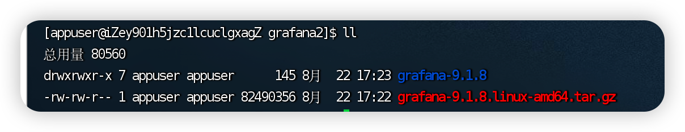
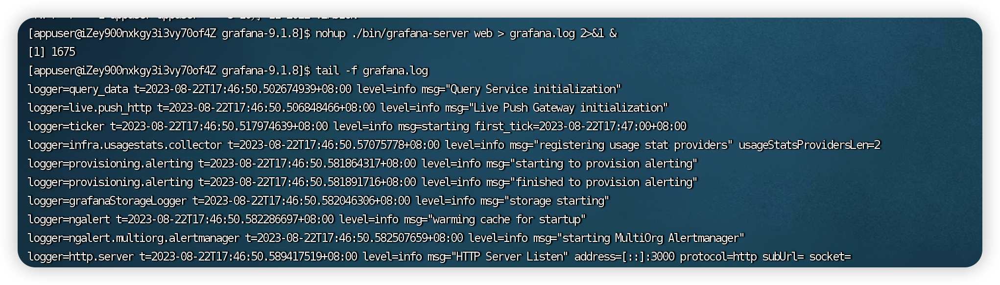
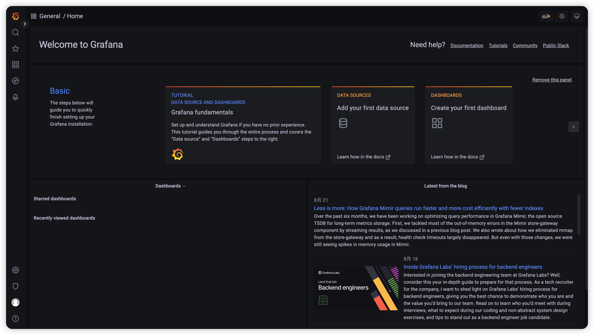
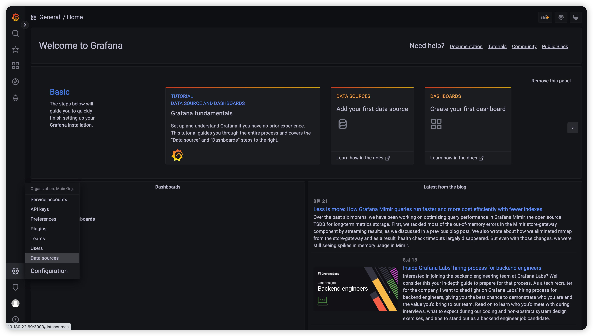
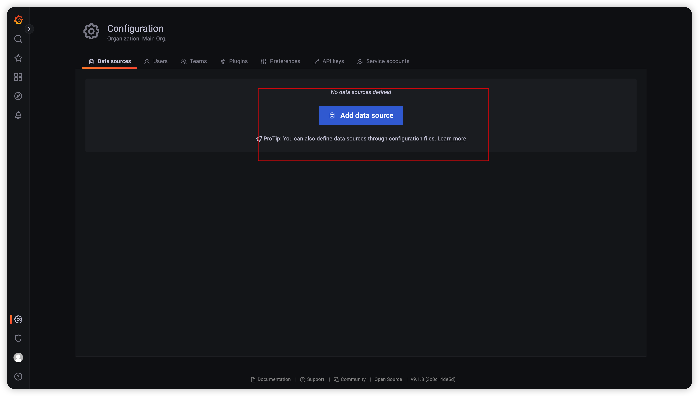
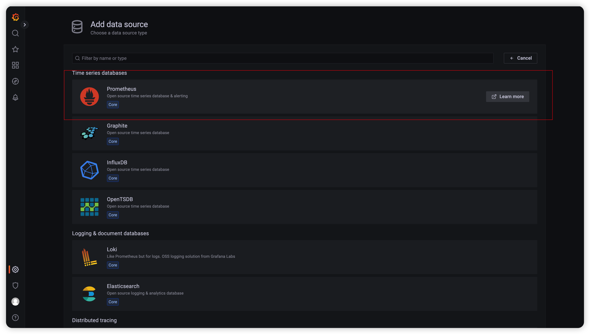
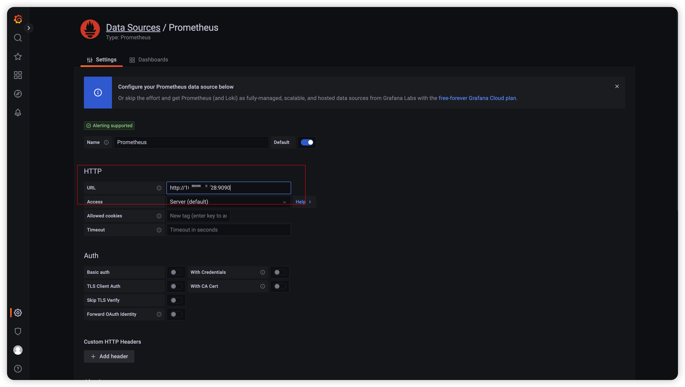
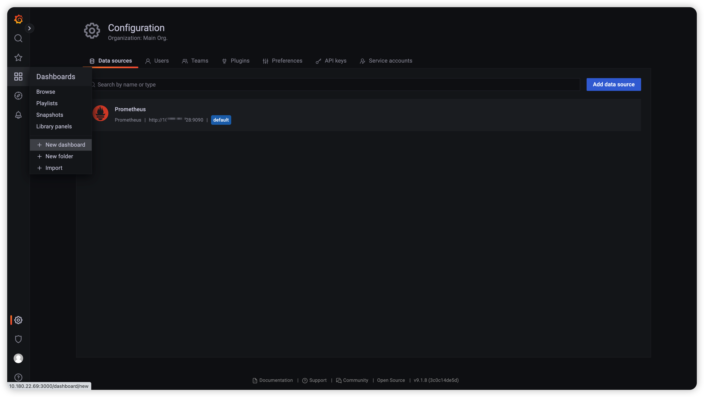

# Grafana

Grafana是一个跨平台的开源的度量分析和可视化工具，可以通过将采集的数据查询然后可视化的展示。

## 功能发布记录

| 发布时间 | 功能分类 | 功能名称 | 说明 |
| -------- | -------- | -------- | ---- |
|          |          |          |      |

## 重要通知

无

## 组件描述

- 提供私有版Grafana部署包和使用说明，实现监控信息可视化分析。

## 组件集成

1.下载样例文件，上传至服务器目标位置

2.解压grafana-9.1.8.linux-amd64.tar.gz

```bash
tar -zxvf grafana-9.1.8.linux-amd64.tar.gz
```



3.启动Grafana

```bash
nohup ./bin/grafana-server web > grafana.log 2>&1 &
```



4.浏览器访问指定地址，查看grafana客户端页面

```text
http://ip:port/login
```


5.默认密码为admin/admin，第一次登录会要求修改密码


6.登录成功，进入控制台页面



7.设置数据源，填写prometheus地址









8.根据需求新建监控面板



> [!NOTE]
>
> 若需要使用指定模板，推荐模板地址： https://grafana.com/grafana/dashboards/

### 添加依赖

无

### 补充配置文件

无

## 部署包

 [grafana-9.1.8.linux-amd64.tar.gz](../file/grafana-9.1.8.linux-amd64.tar.gz) 