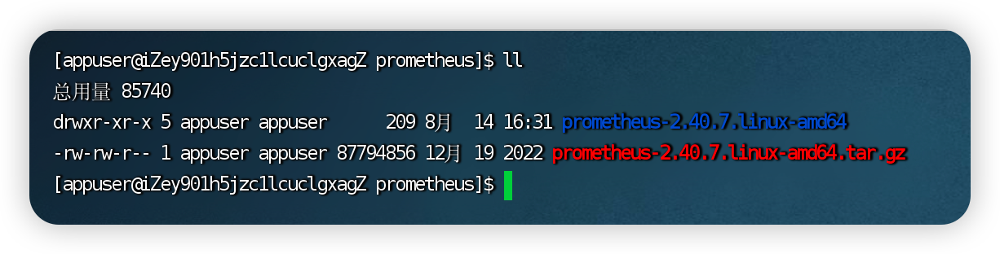
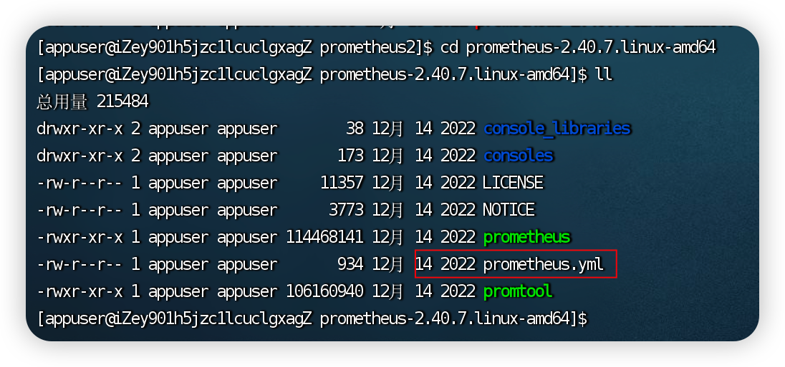
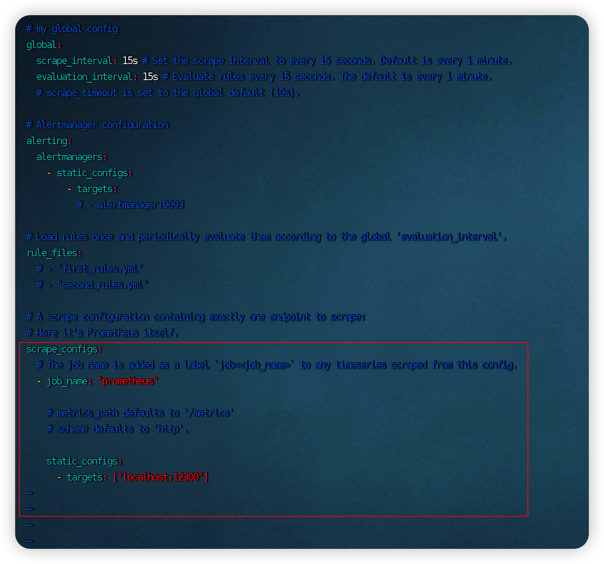
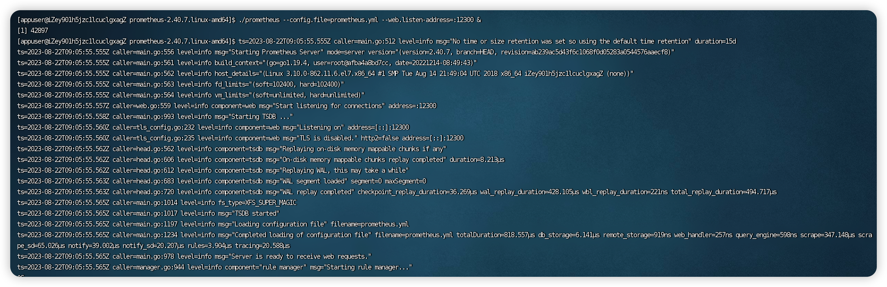
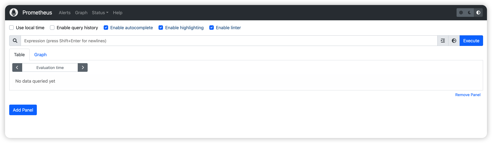
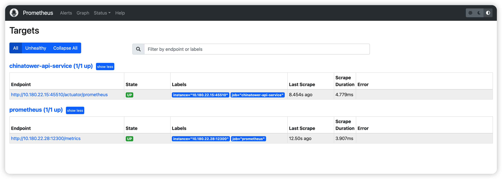

# Prometheus

Prometheus是一个近年比较火的开源监控框架，服务端和客户端都是开箱即用，不需要进行安装。

## 功能发布记录

| 发布时间 | 功能分类 | 功能名称 | 说明 |
| -------- | -------- | -------- | ---- |
|          |          |          |      |

## 重要通知

无

## 组件描述

- 提供私有版Prometheus部署包和使用说明，实现自动监控。

## 组件集成

1.下载样例文件，上传至服务器目标位置

2.解压prometheus-2.40.7.linux-amd64.tar.gz

```bash
tar -zxvf prometheus-2.40.7.linux-amd64.tar.gz
```



3.进入解压后文件夹，按实际情况编辑prometheus.yml文件中内容，将需要监控的服务配置其中





4.启动prometheus

方式一：指定配置文件直接启动，默认端口号9090

```bash
./prometheus --config.file=prometheus.yml &
```

方式二：指定配置文件和端口号启动

```bash
./prometheus --config.file=prometheus.yml --web.listen-address=:12300 &
```



5.启动成功，浏览器请求目标地址

```text
http://ip:port
```



6.请求目标地址，查看配置中添加的服务监控是否生效



>[!NOTE]
>
>要看prometheus的所有命令行参数，可以执行如下命令： ./prometheus -h

### 添加依赖

无

### 补充配置文件

无

## 典型实践

无

## API参考

无

## SDK

无

## 部署包

 [prometheus-2.40.7.linux-amd64.tar.gz](../file/prometheus-2.40.7.linux-amd64.tar.gz) 